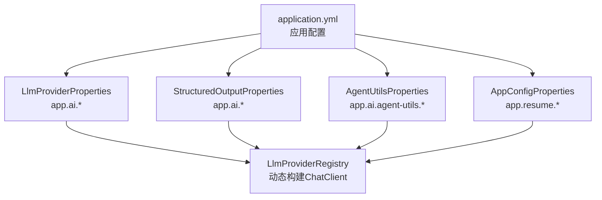
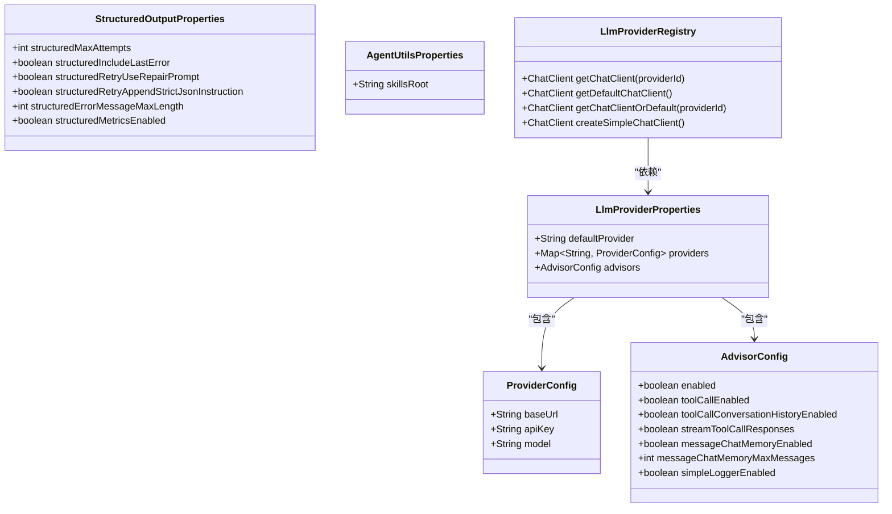
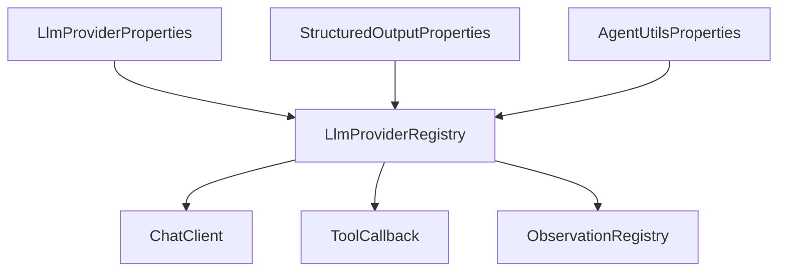
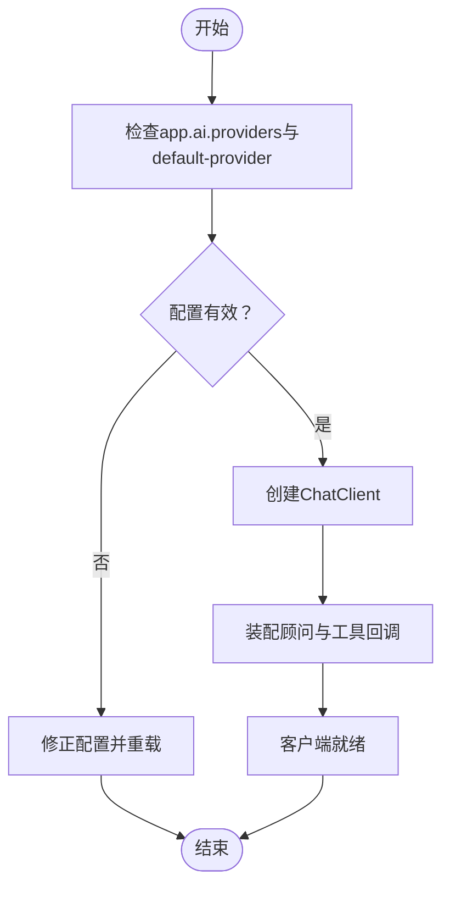

# AI服务配置管理

<cite>
**本文引用的文件**
- [application.yml](file://app/src/main/resources/application.yml)
- [LlmProviderProperties.java](file://app/src/main/java/interview/guide/common/config/LlmProviderProperties.java)
- [StructuredOutputProperties.java](file://app/src/main/java/interview/guide/common/ai/StructuredOutputProperties.java)
- [AgentUtilsProperties.java](file://app/src/main/java/interview/guide/common/ai/AgentUtilsProperties.java)
- [AppConfigProperties.java](file://app/src/main/java/interview/guide/common/config/AppConfigProperties.java)
- [LlmProviderRegistry.java](file://app/src/main/java/interview/guide/common/ai/LlmProviderRegistry.java)
- [LlmProviderRegistryTest.java](file://app/src/test/java/interview/guide/common/ai/LlmProviderRegistryTest.java)
- [playwright-config.md](file://.opencode/skills/bmad-testarch-automate/resources/knowledge/playwright-config.md)
- [adr-quality-readiness-checklist.md](file://.opencode/skills/bmad-tea/resources/knowledge/adr-quality-readiness-checklist.md)
- [test-priorities-matrix.md](file://.opencode/skills/bmad-tea/resources/knowledge/test-priorities-matrix.md)
- [files-manifest.csv](file://_bmad/_config/files-manifest.csv)
</cite>

## 目录
1. [简介](#简介)
2. [项目结构](#项目结构)
3. [核心组件](#核心组件)
4. [架构总览](#架构总览)
5. [详细组件分析](#详细组件分析)
6. [依赖分析](#依赖分析)
7. [性能考虑](#性能考虑)
8. [故障排除指南](#故障排除指南)
9. [结论](#结论)
10. [附录](#附录)

## 简介
本文件系统性阐述该AI服务的配置管理体系，覆盖配置属性定义与管理（如ProviderConfig、AdvisorConfig）、配置文件结构与格式（YAML）、参数验证与默认值策略、动态加载与热重载机制、安全管理（敏感信息保护、配置加密、访问控制）、监控与审计（变更记录、性能指标、健康检查），以及最佳实践与故障排除建议。目标是帮助开发者与运维人员高效理解并维护配置系统。

## 项目结构
配置相关的核心位置集中在应用资源与配置类中：
- 应用配置文件：application.yml，包含Spring AI、数据库、Redisson、存储、CORS、语音面试等多模块配置
- 配置属性类：位于common/config与common/ai包下，通过@ConfigurationProperties注解绑定application.yml中的app.*命名空间
- 提供商注册器：LlmProviderRegistry负责根据配置动态构建ChatClient实例并缓存

图表来源
- [application.yml:125-282](file://app/src/main/resources/application.yml#L125-L282)
- [LlmProviderProperties.java:11-39](file://app/src/main/java/interview/guide/common/config/LlmProviderProperties.java#L11-L39)
- [StructuredOutputProperties.java:10-18](file://app/src/main/java/interview/guide/common/ai/StructuredOutputProperties.java#L10-L18)
- [AgentUtilsProperties.java:9-13](file://app/src/main/java/interview/guide/common/ai/AgentUtilsProperties.java#L9-L13)
- [AppConfigProperties.java:12-33](file://app/src/main/java/interview/guide/common/config/AppConfigProperties.java#L12-L33)
- [LlmProviderRegistry.java:39-55](file://app/src/main/java/interview/guide/common/ai/LlmProviderRegistry.java#L39-L55)

章节来源
- [application.yml:125-282](file://app/src/main/resources/application.yml#L125-L282)
- [LlmProviderProperties.java:11-39](file://app/src/main/java/interview/guide/common/config/LlmProviderProperties.java#L11-L39)
- [StructuredOutputProperties.java:10-18](file://app/src/main/java/interview/guide/common/ai/StructuredOutputProperties.java#L10-L18)
- [AgentUtilsProperties.java:9-13](file://app/src/main/java/interview/guide/common/ai/AgentUtilsProperties.java#L9-L13)
- [AppConfigProperties.java:12-33](file://app/src/main/java/interview/guide/common/config/AppConfigProperties.java#L12-L33)
- [LlmProviderRegistry.java:39-55](file://app/src/main/java/interview/guide/common/ai/LlmProviderRegistry.java#L39-L55)

## 核心组件
- 配置属性类
  - LlmProviderProperties：定义默认提供商、提供商映射、顾问配置（AdvisorConfig）
  - StructuredOutputProperties：定义结构化输出重试与度量相关参数
  - AgentUtilsProperties：定义技能根目录等AI工具相关配置
  - AppConfigProperties：定义简历上传目录与允许类型等应用级配置
- 配置注册器
  - LlmProviderRegistry：基于配置动态创建并缓存ChatClient，支持默认客户端获取与工具回调集成

章节来源
- [LlmProviderProperties.java:11-39](file://app/src/main/java/interview/guide/common/config/LlmProviderProperties.java#L11-L39)
- [StructuredOutputProperties.java:10-18](file://app/src/main/java/interview/guide/common/ai/StructuredOutputProperties.java#L10-L18)
- [AgentUtilsProperties.java:9-13](file://app/src/main/java/interview/guide/common/ai/AgentUtilsProperties.java#L9-L13)
- [AppConfigProperties.java:12-33](file://app/src/main/java/interview/guide/common/config/AppConfigProperties.java#L12-L33)
- [LlmProviderRegistry.java:39-55](file://app/src/main/java/interview/guide/common/ai/LlmProviderRegistry.java#L39-L55)

## 架构总览
配置体系采用“声明式属性 + 动态构建”的架构：
- 声明式属性：通过@ConfigurationProperties将application.yml中的键空间映射到Java对象
- 动态构建：LlmProviderRegistry依据属性值创建ChatClient实例，并按需装配顾问与工具回调
- 缓存策略：使用ConcurrentHashMap缓存已创建的客户端，避免重复初始化

图表来源
- [LlmProviderProperties.java:11-39](file://app/src/main/java/interview/guide/common/config/LlmProviderProperties.java#L11-L39)
- [StructuredOutputProperties.java:10-18](file://app/src/main/java/interview/guide/common/ai/StructuredOutputProperties.java#L10-L18)
- [AgentUtilsProperties.java:9-13](file://app/src/main/java/interview/guide/common/ai/AgentUtilsProperties.java#L9-L13)
- [LlmProviderRegistry.java:39-55](file://app/src/main/java/interview/guide/common/ai/LlmProviderRegistry.java#L39-L55)

## 详细组件分析

### 配置属性设计与管理
- LlmProviderProperties
  - 默认提供商与提供商映射：支持多提供商切换，便于灰度与灾备
  - 顾问配置（AdvisorConfig）：集中管理工具调用、消息记忆、日志等行为开关
- StructuredOutputProperties
  - 结构化输出重试策略与度量开关，便于在解析失败时进行修复与观测
- AgentUtilsProperties
  - 技能根目录配置，便于统一管理技能资源路径
- AppConfigProperties
  - 简历上传目录与类型白名单，保障文件处理安全与合规

章节来源
- [LlmProviderProperties.java:11-39](file://app/src/main/java/interview/guide/common/config/LlmProviderProperties.java#L11-L39)
- [StructuredOutputProperties.java:10-18](file://app/src/main/java/interview/guide/common/ai/StructuredOutputProperties.java#L10-L18)
- [AgentUtilsProperties.java:9-13](file://app/src/main/java/interview/guide/common/ai/AgentUtilsProperties.java#L9-L13)
- [AppConfigProperties.java:12-33](file://app/src/main/java/interview/guide/common/config/AppConfigProperties.java#L12-L33)

### 配置文件结构与格式（YAML）
- application.yml
  - Spring AI：OpenAI兼容模式基础URL、API密钥、聊天与嵌入选项、重试策略、向量库配置
  - 应用自定义配置：app.ai.* 下的提供商、顾问、结构化输出、RAG、面试、简历、存储、CORS、语音面试等
  - 环境变量占位符：大量使用${VAR:default}语法，便于在不同环境间切换
- 文件清单与模块化
  - files-manifest.csv展示项目内各类配置文件的清单，体现模块化与可追踪性

章节来源
- [application.yml:1-282](file://app/src/main/resources/application.yml#L1-L282)
- [files-manifest.csv:112-120](file://_bmad/_config/files-manifest.csv#L112-L120)

### 参数验证与默认值
- 默认值策略
  - 属性类中直接提供字段默认值（如默认提供商、顾问开关、结构化输出参数）
  - application.yml中通过占位符提供运行时默认值（如模型名、温度、日志级别等）
- 参数验证
  - 通过构造器或builder创建客户端时进行必要校验（如未知提供商抛出异常）
  - 建议在属性类上增加JSR-303约束或自定义校验器以增强静态验证

章节来源
- [LlmProviderProperties.java:11-39](file://app/src/main/java/interview/guide/common/config/LlmProviderProperties.java#L11-L39)
- [LlmProviderRegistry.java:134-140](file://app/src/main/java/interview/guide/common/ai/LlmProviderRegistry.java#L134-L140)

### 动态加载与更新机制
- Spring Boot配置绑定
  - 使用@ConfigurationProperties将application.yml键空间映射到属性类，实现自动刷新与类型安全
- 客户端缓存与按需创建
  - LlmProviderRegistry使用ConcurrentHashMap缓存ChatClient，首次请求时按配置创建并复用
- 建议的热重载方案
  - 引入RefreshScope或Spring Cloud Config，结合事件监听实现配置变更后的客户端重建
  - 对顾问与工具回调的动态装配，需在重建时重新应用最新配置

章节来源
- [LlmProviderRegistry.java:40-71](file://app/src/main/java/interview/guide/common/ai/LlmProviderRegistry.java#L40-L71)

### 配置的安全管理
- 敏感信息保护
  - API密钥通过环境变量注入（如${AI_BAILIAN_API_KEY}），避免硬编码
  - 数据库密码、存储密钥等通过环境变量注入，降低泄露风险
- 配置加密
  - 建议引入Spring Cloud Config加密（对称/非对称密钥）与Vault集成
- 访问控制
  - 仅授权服务与运维人员访问配置中心与密钥管理服务
  - 在CI/CD流水线中限制配置文件的读写权限

章节来源
- [application.yml:49-53](file://app/src/main/resources/application.yml#L49-L53)
- [application.yml:182-189](file://app/src/main/resources/application.yml#L182-L189)
- [adr-quality-readiness-checklist.md:122-148](file://.opencode/skills/bmad-tea/resources/knowledge/adr-quality-readiness-checklist.md#L122-L148)

### 监控与审计
- 变更记录
  - 通过版本控制系统记录配置文件变更，配合PR审查与审批流程
  - 建议引入配置审计日志，记录关键配置的修改时间、修改人与影响范围
- 性能指标
  - 暴露/metrics端点，采集LLM调用延迟、重试次数、错误率等指标
  - 对结构化输出与顾问行为进行独立指标观测
- 健康检查
  - 提供健康检查端点，验证LLM连通性、向量库可用性、存储连接状态

章节来源
- [application.yml:113-124](file://app/src/main/resources/application.yml#L113-L124)
- [adr-quality-readiness-checklist.md:149-158](file://.opencode/skills/bmad-tea/resources/knowledge/adr-quality-readiness-checklist.md#L149-L158)

### 配置管理最佳实践
- 分层配置
  - 将通用配置放入application.yml，环境特定配置通过profile或外部化配置覆盖
- 环境隔离
  - 开发、测试、预发布、生产使用不同的配置源与密钥
- 变更治理
  - 配置变更必须通过评审与灰度发布，记录变更影响面
- 文档与清单
  - 使用files-manifest.csv等清单工具追踪配置文件与模块关系

章节来源
- [application.yml:1-282](file://app/src/main/resources/application.yml#L1-L282)
- [files-manifest.csv:112-120](file://_bmad/_config/files-manifest.csv#L112-L120)

## 依赖分析
- 组件耦合
  - LlmProviderRegistry依赖LlmProviderProperties与工具回调、观测注册器
  - 属性类之间通过组合关系（ProviderConfig、AdvisorConfig）保持高内聚低耦合
- 外部依赖
  - Spring AI、Micrometer、RestClient等用于客户端构建与观测
- 循环依赖
  - 当前结构未见循环依赖，属性类为纯数据载体

图表来源
- [LlmProviderProperties.java:11-39](file://app/src/main/java/interview/guide/common/config/LlmProviderProperties.java#L11-L39)
- [StructuredOutputProperties.java:10-18](file://app/src/main/java/interview/guide/common/ai/StructuredOutputProperties.java#L10-L18)
- [AgentUtilsProperties.java:9-13](file://app/src/main/java/interview/guide/common/ai/AgentUtilsProperties.java#L9-L13)
- [LlmProviderRegistry.java:39-55](file://app/src/main/java/interview/guide/common/ai/LlmProviderRegistry.java#L39-L55)

章节来源
- [LlmProviderRegistry.java:39-55](file://app/src/main/java/interview/guide/common/ai/LlmProviderRegistry.java#L39-L55)

## 性能考虑
- 客户端缓存
  - 使用ConcurrentHashMap缓存ChatClient，避免重复初始化带来的性能损耗
- 超时与重试
  - 为本地模型设置较长读超时，同时在application.yml中禁用自动重试以快速失败
- 观测与指标
  - 通过ObservationRegistry与Micrometer暴露关键指标，辅助性能调优

章节来源
- [LlmProviderRegistry.java:40-71](file://app/src/main/java/interview/guide/common/ai/LlmProviderRegistry.java#L40-L71)
- [application.yml:113-115](file://app/src/main/resources/application.yml#L113-L115)

## 故障排除指南
- 常见问题
  - 未知提供商：当providers映射中不存在对应ID时，抛出非法参数异常
  - 工具回调缺失：若ToolCallingManager不可用，工具调用顾问将被跳过
  - 默认提供商缺失：创建简单客户端时若默认提供商配置缺失，抛出异常
- 排查步骤
  - 检查application.yml中的app.ai.providers与app.ai.default-provider
  - 确认环境变量是否正确注入（如API密钥）
  - 查看日志中关于客户端创建与顾问装配的记录
- 单元测试
  - LlmProviderRegistryTest通过Mock验证注册器行为，建议扩展用例覆盖边界条件

图表来源
- [LlmProviderRegistry.java:134-190](file://app/src/main/java/interview/guide/common/ai/LlmProviderRegistry.java#L134-L190)
- [LlmProviderProperties.java:11-39](file://app/src/main/java/interview/guide/common/config/LlmProviderProperties.java#L11-L39)

章节来源
- [LlmProviderRegistry.java:134-190](file://app/src/main/java/interview/guide/common/ai/LlmProviderRegistry.java#L134-L190)
- [LlmProviderRegistryTest.java:24-41](file://app/src/test/java/interview/guide/common/ai/LlmProviderRegistryTest.java#L24-L41)

## 结论
该配置管理体系通过声明式属性与动态构建相结合，实现了灵活、可观测且可扩展的AI服务配置管理。建议在现有基础上进一步完善热重载、配置加密与审计、以及更严格的参数验证与变更治理，以满足生产环境的高可靠与高安全需求。

## 附录
- 配置文件示例与模板
  - Playwright配置模板展示了环境切换与超时标准，可借鉴到配置文件模板设计中
- 风险与缓解矩阵
  - 测试优先级矩阵与质量准备清单提供了配置治理与变更风险评估的参考

章节来源
- [playwright-config.md:104-153](file://.opencode/skills/bmad-testarch-automate/resources/knowledge/playwright-config.md#L104-L153)
- [test-priorities-matrix.md:352-374](file://.opencode/skills/bmad-tea/resources/knowledge/test-priorities-matrix.md#L352-L374)
- [adr-quality-readiness-checklist.md:149-158](file://.opencode/skills/bmad-tea/resources/knowledge/adr-quality-readiness-checklist.md#L149-L158)