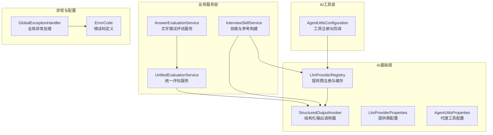
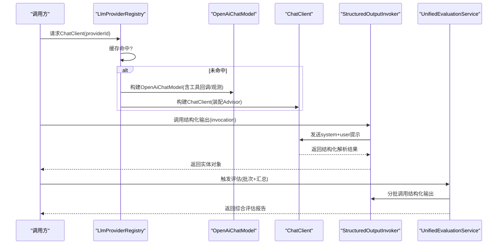
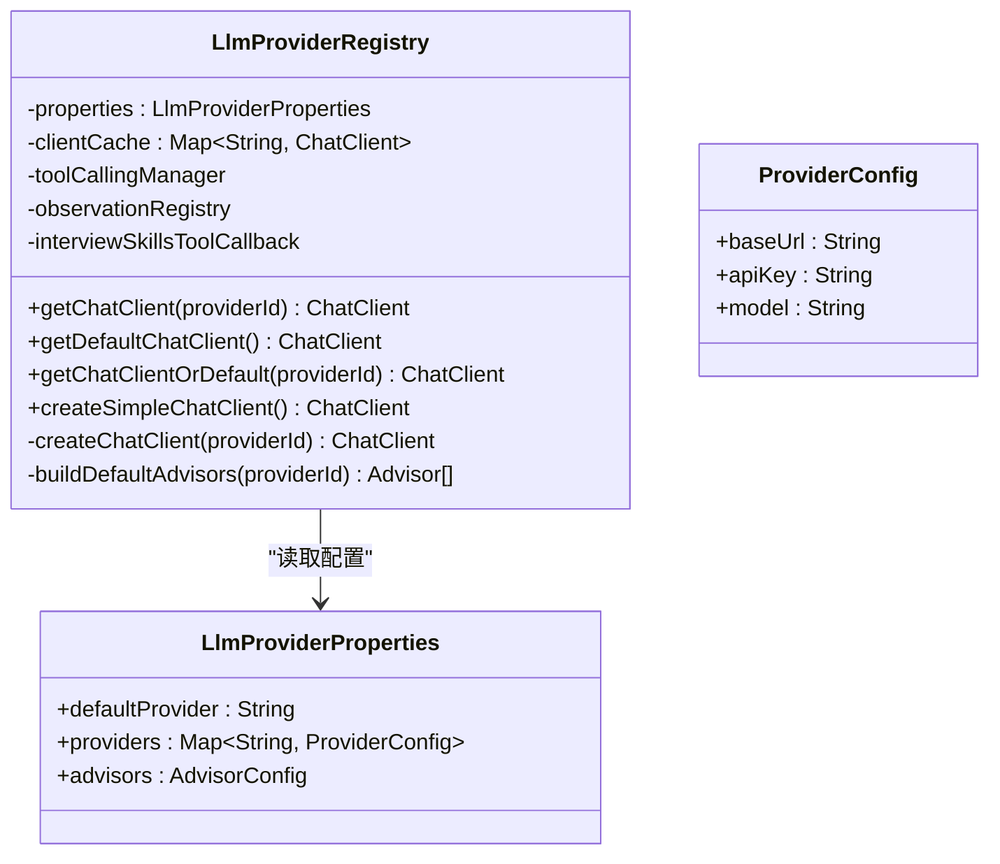
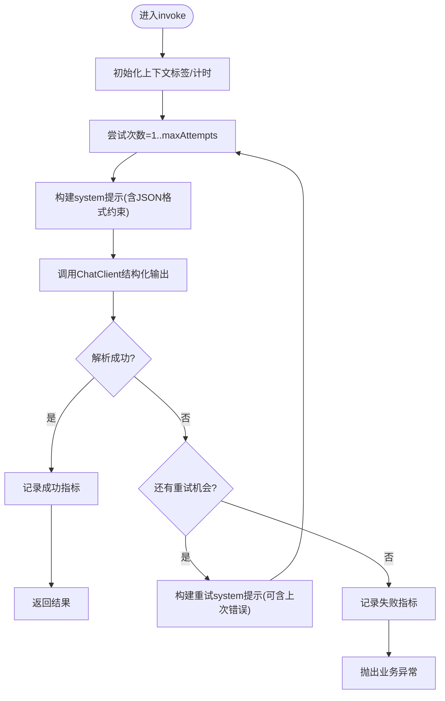
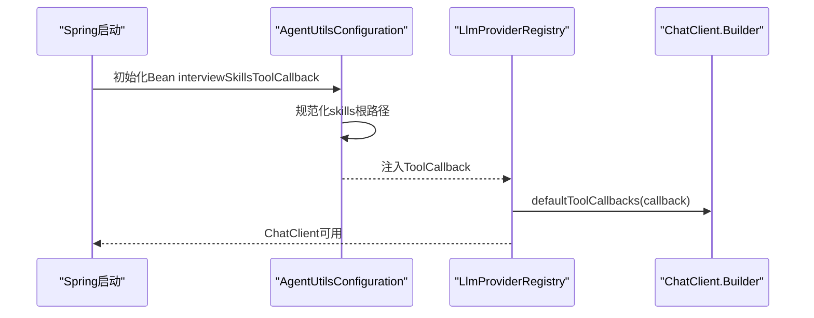
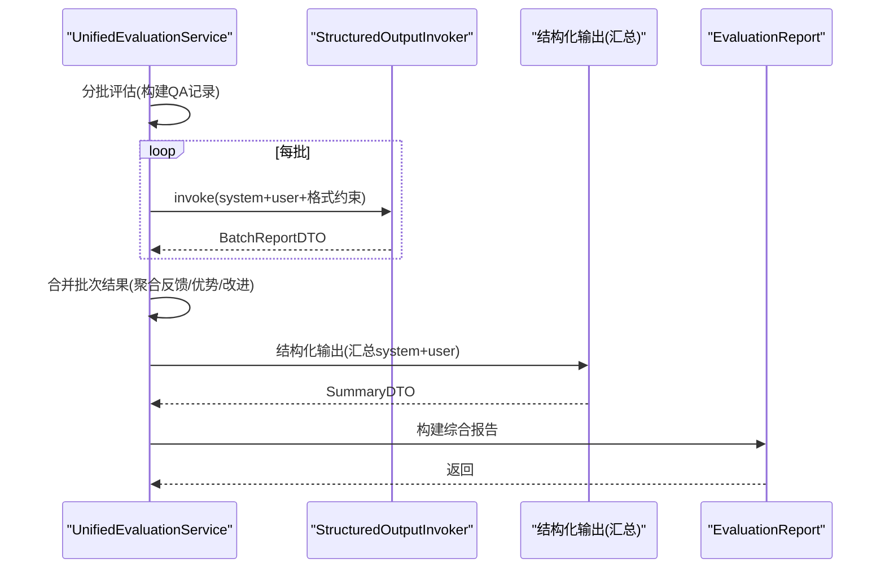
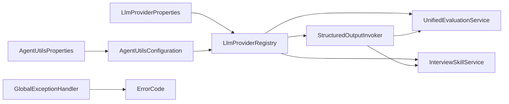

# AI集成架构

<cite>
**本文引用的文件**
- [LlmProviderRegistry.java](file://app/src/main/java/interview/guide/common/ai/LlmProviderRegistry.java)
- [AgentUtilsConfiguration.java](file://app/src/main/java/interview/guide/common/ai/AgentUtilsConfiguration.java)
- [StructuredOutputInvoker.java](file://app/src/main/java/interview/guide/common/ai/StructuredOutputInvoker.java)
- [StructuredOutputProperties.java](file://app/src/main/java/interview/guide/common/ai/StructuredOutputProperties.java)
- [AgentUtilsProperties.java](file://app/src/main/java/interview/guide/common/ai/AgentUtilsProperties.java)
- [LlmProviderProperties.java](file://app/src/main/java/interview/guide/common/config/LlmProviderProperties.java)
- [UnifiedEvaluationService.java](file://app/src/main/java/interview/guide/common/evaluation/UnifiedEvaluationService.java)
- [AnswerEvaluationService.java](file://app/src/main/java/interview/guide/modules/interview/service/AnswerEvaluationService.java)
- [InterviewSkillService.java](file://app/src/main/java/interview/guide/modules/interview/skill/InterviewSkillService.java)
- [GlobalExceptionHandler.java](file://app/src/main/java/interview/guide/common/exception/GlobalExceptionHandler.java)
- [ErrorCode.java](file://app/src/main/java/interview/guide/common/exception/ErrorCode.java)
- [interview-evaluation-user.st](file://app/src/main/resources/prompts/interview-evaluation-user.st)
- [interview-evaluation-summary-system.st](file://app/src/main/resources/prompts/interview-evaluation-summary-system.st)
- [SearchMetricsService.java](file://docs/superpowers/plans/2026-05-12-rag-search-optimization.md)
</cite>

## 目录
1. [简介](#简介)
2. [项目结构](#项目结构)
3. [核心组件](#核心组件)
4. [架构总览](#架构总览)
5. [详细组件分析](#详细组件分析)
6. [依赖分析](#依赖分析)
7. [性能考虑](#性能考虑)
8. [故障排查指南](#故障排查指南)
9. [结论](#结论)
10. [附录](#附录)

## 简介
本文件面向AI集成架构，系统性阐述以下能力：
- LLM提供商管理系统：工厂模式、多提供商支持、动态切换与缓存
- 结构化输出处理：JSON模式注入、输出验证与重试修复
- 工具调用系统：工具注册、参数传递、回调与代理工具集成
- 代理工具集成：代理配置、消息路由、状态管理
- 提示词模板系统：模板语法、变量替换、资源加载
- 模型配置管理：模型选择、参数调优、可观测性
- 错误处理与降级：重试策略、超时处理、故障转移
- 性能优化与最佳实践

## 项目结构
本项目采用分层+模块化组织，AI相关能力集中在common/ai与common/evaluation包，面试模块通过service与skill服务调用AI能力。

图示来源
- [LlmProviderRegistry.java:35-229](file://app/src/main/java/interview/guide/common/ai/LlmProviderRegistry.java#L35-L229)
- [StructuredOutputInvoker.java:19-172](file://app/src/main/java/interview/guide/common/ai/StructuredOutputInvoker.java#L19-L172)
- [LlmProviderProperties.java:11-39](file://app/src/main/java/interview/guide/common/config/LlmProviderProperties.java#L11-L39)
- [AgentUtilsConfiguration.java:17-69](file://app/src/main/java/interview/guide/common/ai/AgentUtilsConfiguration.java#L17-L69)
- [UnifiedEvaluationService.java:32-380](file://app/src/main/java/interview/guide/common/evaluation/UnifiedEvaluationService.java#L32-L380)
- [AnswerEvaluationService.java:26-99](file://app/src/main/java/interview/guide/modules/interview/service/AnswerEvaluationService.java#L26-L99)
- [InterviewSkillService.java:34-593](file://app/src/main/java/interview/guide/modules/interview/skill/InterviewSkillService.java#L34-L593)
- [GlobalExceptionHandler.java:24-161](file://app/src/main/java/interview/guide/common/exception/GlobalExceptionHandler.java#L24-L161)
- [ErrorCode.java:11-81](file://app/src/main/java/interview/guide/common/exception/ErrorCode.java#L11-L81)

章节来源
- [LlmProviderRegistry.java:35-229](file://app/src/main/java/interview/guide/common/ai/LlmProviderRegistry.java#L35-L229)
- [AgentUtilsConfiguration.java:17-69](file://app/src/main/java/interview/guide/common/ai/AgentUtilsConfiguration.java#L17-L69)
- [StructuredOutputInvoker.java:19-172](file://app/src/main/java/interview/guide/common/ai/StructuredOutputInvoker.java#L19-L172)
- [LlmProviderProperties.java:11-39](file://app/src/main/java/interview/guide/common/config/LlmProviderProperties.java#L11-L39)
- [UnifiedEvaluationService.java:32-380](file://app/src/main/java/interview/guide/common/evaluation/UnifiedEvaluationService.java#L32-L380)
- [AnswerEvaluationService.java:26-99](file://app/src/main/java/interview/guide/modules/interview/service/AnswerEvaluationService.java#L26-L99)
- [InterviewSkillService.java:34-593](file://app/src/main/java/interview/guide/modules/interview/skill/InterviewSkillService.java#L34-L593)
- [GlobalExceptionHandler.java:24-161](file://app/src/main/java/interview/guide/common/exception/GlobalExceptionHandler.java#L24-L161)
- [ErrorCode.java:11-81](file://app/src/main/java/interview/guide/common/exception/ErrorCode.java#L11-L81)

## 核心组件
- LLM提供商注册中心：基于工厂模式按提供商ID创建并缓存ChatClient，支持默认提供商、动态切换与Advisor链装配。
- 结构化输出调用器：统一封装结构化输出调用、重试策略、指标采集与上下文标签归一化。
- 代理工具配置：通过Spring AI Agent Utils注册SkillsTool回调，支持从classpath:skills加载技能资源。
- 统一评估服务：分批评估、结构化解析、二次汇总、降级兜底，贯穿文字与语音面试。
- 技能服务：加载预设技能、构建参考内容、JD解析、题目分配与参考基线生成。
- 异常处理：将AI服务网络/调用异常映射为业务错误码，统一返回HTTP 200。

章节来源
- [LlmProviderRegistry.java:35-229](file://app/src/main/java/interview/guide/common/ai/LlmProviderRegistry.java#L35-L229)
- [StructuredOutputInvoker.java:19-172](file://app/src/main/java/interview/guide/common/ai/StructuredOutputInvoker.java#L19-L172)
- [AgentUtilsConfiguration.java:17-69](file://app/src/main/java/interview/guide/common/ai/AgentUtilsConfiguration.java#L17-L69)
- [UnifiedEvaluationService.java:32-380](file://app/src/main/java/interview/guide/common/evaluation/UnifiedEvaluationService.java#L32-L380)
- [InterviewSkillService.java:34-593](file://app/src/main/java/interview/guide/modules/interview/skill/InterviewSkillService.java#L34-L593)
- [GlobalExceptionHandler.java:24-161](file://app/src/main/java/interview/guide/common/exception/GlobalExceptionHandler.java#L24-L161)

## 架构总览
AI集成以“配置驱动 + 工厂缓存 + 结构化输出 + 工具回调”的方式串联起提供商、提示词模板、评估流程与异常治理。

图示来源
- [LlmProviderRegistry.java:65-190](file://app/src/main/java/interview/guide/common/ai/LlmProviderRegistry.java#L65-L190)
- [StructuredOutputInvoker.java:59-103](file://app/src/main/java/interview/guide/common/ai/StructuredOutputInvoker.java#L59-L103)
- [UnifiedEvaluationService.java:151-280](file://app/src/main/java/interview/guide/common/evaluation/UnifiedEvaluationService.java#L151-L280)

## 详细组件分析

### LLM提供商注册与工厂模式
- 设计要点
  - 以提供商ID为键的并发缓存，避免重复创建
  - 基于配置构建OpenAiChatModel与ChatClient
  - 动态装配Advisor（工具调用、记忆、日志）
  - 默认提供商与“空值即默认”的兼容策略
- 关键行为
  - createChatClient：构造RestClient、OpenAiApi、OpenAiChatOptions、ChatClient
  - buildDefaultAdvisors：按开关启用ToolCallAdvisor、MessageChatMemoryAdvisor、SimpleLoggerAdvisor
  - createSimpleChatClient：无工具回调的轻量ChatClient，适用于纯文本生成

图示来源
- [LlmProviderRegistry.java:35-229](file://app/src/main/java/interview/guide/common/ai/LlmProviderRegistry.java#L35-L229)
- [LlmProviderProperties.java:11-39](file://app/src/main/java/interview/guide/common/config/LlmProviderProperties.java#L11-L39)

章节来源
- [LlmProviderRegistry.java:65-190](file://app/src/main/java/interview/guide/common/ai/LlmProviderRegistry.java#L65-L190)
- [LlmProviderProperties.java:11-39](file://app/src/main/java/interview/guide/common/config/LlmProviderProperties.java#L11-L39)

### 结构化输出处理机制
- 设计要点
  - 在system提示末尾注入BeanOutputConverter.getFormat()，引导模型严格返回可解析JSON
  - 统一重试策略：可配置最大尝试次数、是否在重试提示中附加上次错误、是否追加严格JSON指令
  - 指标采集：调用次数、尝试次数、耗时，支持上下文标签归一化
- 关键行为
  - invoke：循环尝试，捕获异常并记录；最终失败抛出业务异常
  - buildRetrySystemPrompt：按策略拼接重试提示
  - 归一化上下文标签，限制长度与字符集

图示来源
- [StructuredOutputInvoker.java:59-103](file://app/src/main/java/interview/guide/common/ai/StructuredOutputInvoker.java#L59-L103)
- [StructuredOutputInvoker.java:105-131](file://app/src/main/java/interview/guide/common/ai/StructuredOutputInvoker.java#L105-L131)

章节来源
- [StructuredOutputInvoker.java:19-172](file://app/src/main/java/interview/guide/common/ai/StructuredOutputInvoker.java#L19-L172)
- [StructuredOutputProperties.java:10-19](file://app/src/main/java/interview/guide/common/ai/StructuredOutputProperties.java#L10-L19)

### 工具调用系统与代理工具集成
- 设计要点
  - 通过AgentUtilsConfiguration注册SkillsTool回调，从classpath:skills加载技能资源
  - LlmProviderRegistry在构建ChatClient时注入defaultToolCallbacks，使Advisor链支持工具调用
  - 支持工具调用历史、流式响应等开关
- 关键行为
  - normalizeSkillsRoot：规范化技能根路径，去除尾部/ SKILL.md、通配符与多余斜杠
  - interviewSkillsToolCallback：构建SkillsTool并启用

图示来源
- [AgentUtilsConfiguration.java:29-44](file://app/src/main/java/interview/guide/common/ai/AgentUtilsConfiguration.java#L29-L44)
- [LlmProviderRegistry.java:178-187](file://app/src/main/java/interview/guide/common/ai/LlmProviderRegistry.java#L178-L187)

章节来源
- [AgentUtilsConfiguration.java:17-69](file://app/src/main/java/interview/guide/common/ai/AgentUtilsConfiguration.java#L17-L69)
- [AgentUtilsProperties.java:10-14](file://app/src/main/java/interview/guide/common/ai/AgentUtilsProperties.java#L10-L14)
- [LlmProviderRegistry.java:178-187](file://app/src/main/java/interview/guide/common/ai/LlmProviderRegistry.java#L178-L187)

### 统一评估服务（分批+结构化+汇总+降级）
- 设计要点
  - 将问答记录按batchSize切片，逐批调用结构化输出，聚合结果
  - 二次汇总：将类别概览与高亮题项输入summary模型，产出一致化的综合结论
  - 降级兜底：任一批次失败或汇总失败，均回退到聚合结果
- 关键行为
  - evaluateInBatches/evaluateBatch：构建system/user提示，注入JSON格式约束
  - summarizeBatchResults：构造summary提示，再次走结构化输出
  - buildReport：计算平均分、类别均分、问题明细与参考答案

图示来源
- [UnifiedEvaluationService.java:151-280](file://app/src/main/java/interview/guide/common/evaluation/UnifiedEvaluationService.java#L151-L280)
- [interview-evaluation-user.st:1-23](file://app/src/main/resources/prompts/interview-evaluation-user.st#L1-L23)
- [interview-evaluation-summary-system.st:1-11](file://app/src/main/resources/prompts/interview-evaluation-summary-system.st#L1-L11)

章节来源
- [UnifiedEvaluationService.java:32-380](file://app/src/main/java/interview/guide/common/evaluation/UnifiedEvaluationService.java#L32-L380)
- [interview-evaluation-user.st:1-23](file://app/src/main/resources/prompts/interview-evaluation-user.st#L1-L23)
- [interview-evaluation-summary-system.st:1-11](file://app/src/main/resources/prompts/interview-evaluation-summary-system.st#L1-L11)

### 技能与参考内容构建（提示词模板与资源加载）
- 设计要点
  - 启动时扫描classpath:skills/*/SKILL.md，解析YAML Front Matter与正文，构建预设技能注册表
  - 构建category→reference映射，支持shared/local两种范围
  - 通过PromptTemplate加载system/user模板，注入变量（如参考文件列表）
- 关键行为
  - buildReferenceSectionInternal：按分类过滤、拼接引用内容，限制最大字符
  - loadReferenceContent：安全路径校验、多候选位置解析、缓存读取
  - parseJd：调用结构化输出解析JD为分类列表

章节来源
- [InterviewSkillService.java:79-105](file://app/src/main/java/interview/guide/modules/interview/skill/InterviewSkillService.java#L79-L105)
- [InterviewSkillService.java:200-228](file://app/src/main/java/interview/guide/modules/interview/skill/InterviewSkillService.java#L200-L228)
- [InterviewSkillService.java:345-385](file://app/src/main/java/interview/guide/modules/interview/skill/InterviewSkillService.java#L345-L385)
- [InterviewSkillService.java:166-198](file://app/src/main/java/interview/guide/modules/interview/skill/InterviewSkillService.java#L166-L198)

### 文字面试评估服务（DTO适配与持久化）
- 设计要点
  - 将前端DTO转换为通用QaRecord，调用统一评估服务
  - 持久化与技能服务协作，构建参考基线
  - 异常包装为业务异常，便于上层处理

章节来源
- [AnswerEvaluationService.java:26-99](file://app/src/main/java/interview/guide/modules/interview/service/AnswerEvaluationService.java#L26-L99)

## 依赖分析
- 组件耦合
  - LlmProviderRegistry依赖配置与工具回调，负责ChatClient工厂与缓存
  - UnifiedEvaluationService依赖StructuredOutputInvoker与PromptTemplate，负责评估流程
  - InterviewSkillService依赖LlmProviderRegistry与StructuredOutputInvoker，负责参考构建与JD解析
  - AgentUtilsConfiguration为可选依赖，按需启用工具回调
- 外部依赖
  - Spring AI ChatClient、OpenAI模型适配、Advisor链
  - Micrometer指标（StructuredOutputInvoker与RAG搜索监控）

图示来源
- [LlmProviderProperties.java:11-39](file://app/src/main/java/interview/guide/common/config/LlmProviderProperties.java#L11-L39)
- [AgentUtilsProperties.java:10-14](file://app/src/main/java/interview/guide/common/ai/AgentUtilsProperties.java#L10-L14)
- [AgentUtilsConfiguration.java:17-69](file://app/src/main/java/interview/guide/common/ai/AgentUtilsConfiguration.java#L17-L69)
- [LlmProviderRegistry.java:35-229](file://app/src/main/java/interview/guide/common/ai/LlmProviderRegistry.java#L35-L229)
- [StructuredOutputInvoker.java:19-172](file://app/src/main/java/interview/guide/common/ai/StructuredOutputInvoker.java#L19-L172)
- [UnifiedEvaluationService.java:32-380](file://app/src/main/java/interview/guide/common/evaluation/UnifiedEvaluationService.java#L32-L380)
- [InterviewSkillService.java:34-593](file://app/src/main/java/interview/guide/modules/interview/skill/InterviewSkillService.java#L34-L593)
- [GlobalExceptionHandler.java:24-161](file://app/src/main/java/interview/guide/common/exception/GlobalExceptionHandler.java#L24-L161)
- [ErrorCode.java:11-81](file://app/src/main/java/interview/guide/common/exception/ErrorCode.java#L11-L81)

章节来源
- [LlmProviderRegistry.java:35-229](file://app/src/main/java/interview/guide/common/ai/LlmProviderRegistry.java#L35-L229)
- [AgentUtilsConfiguration.java:17-69](file://app/src/main/java/interview/guide/common/ai/AgentUtilsConfiguration.java#L17-L69)
- [StructuredOutputInvoker.java:19-172](file://app/src/main/java/interview/guide/common/ai/StructuredOutputInvoker.java#L19-L172)
- [UnifiedEvaluationService.java:32-380](file://app/src/main/java/interview/guide/common/evaluation/UnifiedEvaluationService.java#L32-L380)
- [InterviewSkillService.java:34-593](file://app/src/main/java/interview/guide/modules/interview/skill/InterviewSkillService.java#L34-L593)
- [GlobalExceptionHandler.java:24-161](file://app/src/main/java/interview/guide/common/exception/GlobalExceptionHandler.java#L24-L161)
- [ErrorCode.java:11-81](file://app/src/main/java/interview/guide/common/exception/ErrorCode.java#L11-L81)

## 性能考虑
- 连接与超时
  - LlmProviderRegistry为本地/远端模型设置较长读超时，提升稳定性
  - StructuredOutputInvoker记录耗时指标，便于定位慢调用
- 资源与缓存
  - ChatClient按提供商ID缓存，避免重复初始化
  - 技能参考内容缓存，减少IO与解析开销
- 评估策略
  - 分批评估降低单次提示长度，控制token与延迟
  - 二次汇总在失败时降级到聚合结果，保障可用性
- 指标监控
  - 结构化输出调用次数/尝试次数/耗时
  - RAG搜索耗时与热门查询统计（用于检索优化）

章节来源
- [LlmProviderRegistry.java:144-149](file://app/src/main/java/interview/guide/common/ai/LlmProviderRegistry.java#L144-L149)
- [StructuredOutputInvoker.java:133-151](file://app/src/main/java/interview/guide/common/ai/StructuredOutputInvoker.java#L133-L151)
- [SearchMetricsService.java:825-866](file://docs/superpowers/plans/2026-05-12-rag-search-optimization.md#L825-L866)

## 故障排查指南
- 常见错误与处理
  - AI服务不可用/超时：映射为AI_SERVICE_UNAVAILABLE/AI_SERVICE_TIMEOUT，建议重试或切换提供商
  - API密钥无效/限流：映射为AI_API_KEY_INVALID/AI_RATE_LIMIT_EXCEEDED，检查凭证与配额
  - 结构化解析失败：StructuredOutputInvoker内置重试与严格JSON指令，必要时查看最后一次错误
- 诊断步骤
  - 查看全局异常处理器返回的业务错误码
  - 检查StructuredOutputInvoker指标（调用/尝试/耗时）
  - 核对LlmProviderRegistry缓存与默认提供商配置
  - 确认AgentUtilsConfiguration的skills根路径与资源存在

章节来源
- [GlobalExceptionHandler.java:88-128](file://app/src/main/java/interview/guide/common/exception/GlobalExceptionHandler.java#L88-L128)
- [ErrorCode.java:57-65](file://app/src/main/java/interview/guide/common/exception/ErrorCode.java#L57-L65)
- [StructuredOutputInvoker.java:105-131](file://app/src/main/java/interview/guide/common/ai/StructuredOutputInvoker.java#L105-L131)
- [LlmProviderRegistry.java:65-89](file://app/src/main/java/interview/guide/common/ai/LlmProviderRegistry.java#L65-L89)
- [AgentUtilsConfiguration.java:35-37](file://app/src/main/java/interview/guide/common/ai/AgentUtilsConfiguration.java#L35-L37)

## 结论
本AI集成架构以“配置驱动 + 工厂缓存 + 结构化输出 + 工具回调”为核心，实现了多提供商、动态切换、稳定重试与可观测性。通过分批评估与二次汇总，确保评估质量与可用性；通过技能与参考构建，支撑多样化的面试主题。配合完善的异常映射与指标采集，形成可运维、可优化的整体方案。

## 附录
- 配置项要点
  - app.ai.default-provider：默认提供商ID
  - app.ai.providers.{id}.baseUrl/apiKey/model：提供商接入参数
  - app.ai.advisors.enabled/toolCall*/messageChatMemory*/simpleLoggerEnabled：Advisor开关
  - app.ai.agent-utils.skills-root：技能资源根路径
  - app.ai.structured-*：结构化输出重试与指标配置
- 最佳实践
  - 为本地模型设置合理超时，避免阻塞
  - 使用结构化输出并注入JSON格式约束，结合重试修复
  - 启用指标监控，持续观察调用成功率与耗时分布
  - 通过分批评估与降级策略，平衡吞吐与一致性