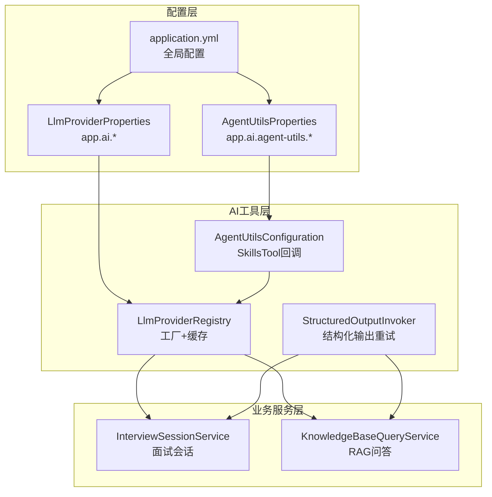
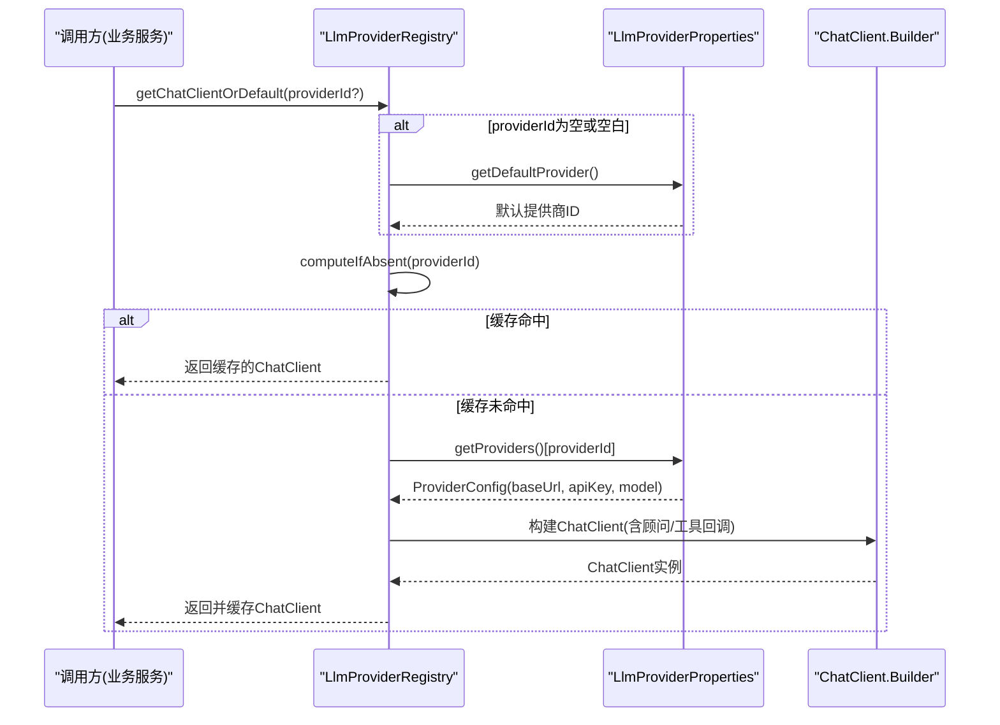
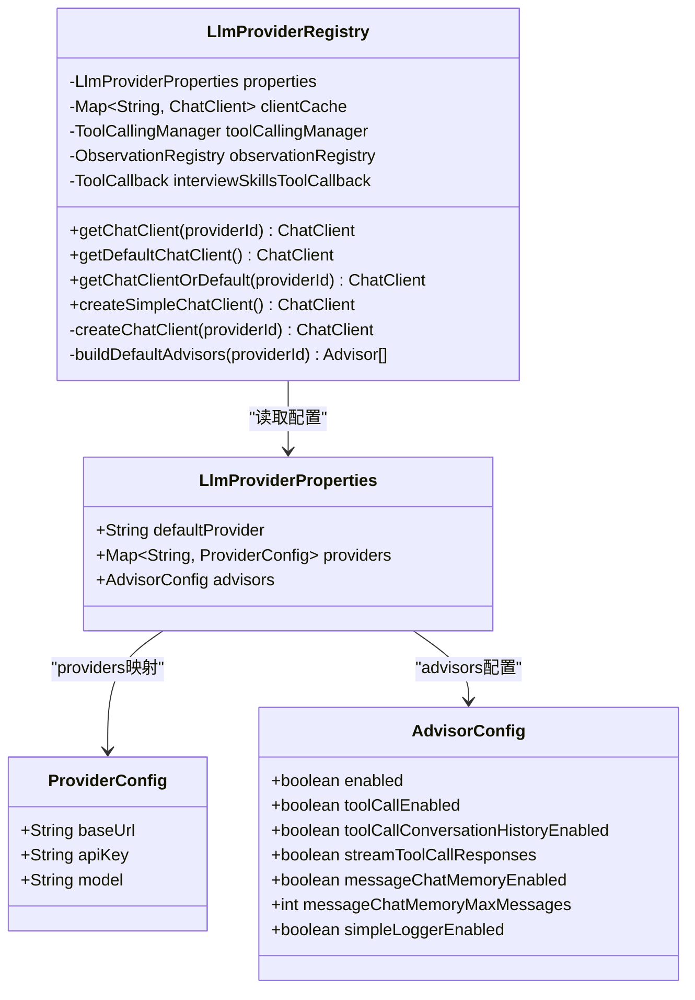
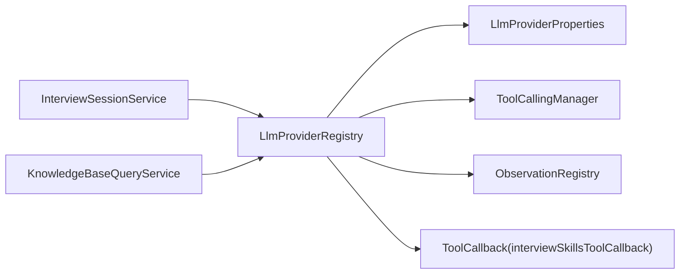

# LLM提供商管理

<cite>
**本文引用的文件**
- [LlmProviderRegistry.java](file://app/src/main/java/interview/guide/common/ai/LlmProviderRegistry.java)
- [LlmProviderProperties.java](file://app/src/main/java/interview/guide/common/config/LlmProviderProperties.java)
- [AgentUtilsConfiguration.java](file://app/src/main/java/interview/guide/common/ai/AgentUtilsConfiguration.java)
- [AgentUtilsProperties.java](file://app/src/main/java/interview/guide/common/ai/AgentUtilsProperties.java)
- [StructuredOutputInvoker.java](file://app/src/main/java/interview/guide/common/ai/StructuredOutputInvoker.java)
- [StructuredOutputProperties.java](file://app/src/main/java/interview/guide/common/ai/StructuredOutputProperties.java)
- [application.yml](file://app/src/main/resources/application.yml)
- [LlmProviderRegistryTest.java](file://app/src/test/java/interview/guide/common/ai/LlmProviderRegistryTest.java)
- [InterviewSessionService.java](file://app/src/main/java/interview/guide/modules/interview/service/InterviewSessionService.java)
- [KnowledgeBaseQueryService.java](file://app/src/main/java/interview/guide/modules/knowledgebase/service/KnowledgeBaseQueryService.java)
- [GlobalExceptionHandler.java](file://app/src/main/java/interview/guide/common/exception/GlobalExceptionHandler.java)
</cite>

## 目录
1. [简介](#简介)
2. [项目结构](#项目结构)
3. [核心组件](#核心组件)
4. [架构总览](#架构总览)
5. [详细组件分析](#详细组件分析)
6. [依赖分析](#依赖分析)
7. [性能考虑](#性能考虑)
8. [故障排查指南](#故障排查指南)
9. [结论](#结论)
10. [附录](#附录)

## 简介
本文件面向“LLM提供商管理”子系统，围绕 LlmProviderRegistry 的设计与实现进行深入技术说明，涵盖以下主题：
- 工厂模式与客户端缓存机制
- 动态创建 ChatClient 的技术实现
- 多提供商支持（配置管理、提供商切换、顾问适配器）
- 配置加载与验证（配置文件格式、参数校验、默认值）
- 客户端缓存策略（键设计、过期与内存管理）
- 错误处理与异常管理（未知提供商、连接失败、配置错误）
- 最佳实践与性能优化建议

## 项目结构
该子系统位于后端应用的 common/ai 与 common/config 包中，配合模块化服务（如面试、知识库）在运行时通过 LlmProviderRegistry 获取 ChatClient 实例，实现统一的 LLM 访问入口。

图表来源
- [LlmProviderRegistry.java:35-229](file://app/src/main/java/interview/guide/common/ai/LlmProviderRegistry.java#L35-L229)
- [LlmProviderProperties.java:11-39](file://app/src/main/java/interview/guide/common/config/LlmProviderProperties.java#L11-L39)
- [AgentUtilsConfiguration.java:22-44](file://app/src/main/java/interview/guide/common/ai/AgentUtilsConfiguration.java#L22-L44)
- [AgentUtilsProperties.java:10-13](file://app/src/main/java/interview/guide/common/ai/AgentUtilsProperties.java#L10-L13)
- [application.yml:126-160](file://app/src/main/resources/application.yml#L126-L160)
- [InterviewSessionService.java:78-80](file://app/src/main/java/interview/guide/modules/interview/service/InterviewSessionService.java#L78-L80)
- [KnowledgeBaseQueryService.java:61-71](file://app/src/main/java/interview/guide/modules/knowledgebase/service/KnowledgeBaseQueryService.java#L61-L71)

章节来源
- [LlmProviderRegistry.java:35-229](file://app/src/main/java/interview/guide/common/ai/LlmProviderRegistry.java#L35-L229)
- [LlmProviderProperties.java:11-39](file://app/src/main/java/interview/guide/common/config/LlmProviderProperties.java#L11-L39)
- [AgentUtilsConfiguration.java:22-44](file://app/src/main/java/interview/guide/common/ai/AgentUtilsConfiguration.java#L22-L44)
- [application.yml:126-160](file://app/src/main/resources/application.yml#L126-L160)

## 核心组件
- LlmProviderRegistry：负责根据提供商 ID 动态创建并缓存 ChatClient，支持默认提供商与回退逻辑，以及“简单客户端”创建路径。
- LlmProviderProperties：承载 app.ai.* 配置，包含 defaultProvider、providers 映射与 advisors 配置。
- AgentUtilsConfiguration/AgentUtilsProperties：提供技能工具回调（SkillsTool）的装配与校验。
- StructuredOutputInvoker/StructuredOutputProperties：封装结构化输出的重试与指标采集，配合 ChatClient 使用。
- 业务服务：InterviewSessionService、KnowledgeBaseQueryService 在运行时通过 LlmProviderRegistry 获取 ChatClient 并执行对话或RAG流程。

章节来源
- [LlmProviderRegistry.java:65-190](file://app/src/main/java/interview/guide/common/ai/LlmProviderRegistry.java#L65-L190)
- [LlmProviderProperties.java:11-39](file://app/src/main/java/interview/guide/common/config/LlmProviderProperties.java#L11-L39)
- [AgentUtilsConfiguration.java:29-44](file://app/src/main/java/interview/guide/common/ai/AgentUtilsConfiguration.java#L29-L44)
- [StructuredOutputInvoker.java:59-103](file://app/src/main/java/interview/guide/common/ai/StructuredOutputInvoker.java#L59-L103)

## 架构总览
LlmProviderRegistry 采用工厂+缓存模式，结合 Spring AI 的 ChatClient/ChatModel/Advisor 体系，实现：
- 按提供商 ID 从配置映射中读取 baseUrl/apiKey/model
- 构造 OpenAiApi/OpenAiChatOptions/OpenAiChatModel
- 组装 ChatClient（可选默认顾问适配器与工具回调）
- 缓存 ChatClient 实例，避免重复创建
- 提供默认客户端与回退逻辑，简化调用方使用

图表来源
- [LlmProviderRegistry.java:65-190](file://app/src/main/java/interview/guide/common/ai/LlmProviderRegistry.java#L65-L190)
- [LlmProviderProperties.java:11-14](file://app/src/main/java/interview/guide/common/config/LlmProviderProperties.java#L11-L14)

## 详细组件分析

### LlmProviderRegistry 设计与实现
- 工厂模式
  - 通过 createChatClient(providerId) 依据 ProviderConfig 动态构建 ChatClient
  - 通过 createSimpleChatClient() 构建不带工具回调的简单客户端
- 客户端缓存
  - 使用并发 Map 作为缓存容器，键为 providerId
  - computeIfAbsent 实现懒加载与线程安全
- 顾问适配器与工具回调
  - buildDefaultAdvisors() 根据 Advisors 配置动态装配 ToolCallAdvisor、MessageChatMemoryAdvisor、SimpleLoggerAdvisor
  - defaultToolCallbacks() 注入 SkillsTool 回调（当可用）
- 默认与回退
  - getDefaultChatClient()/getChatClientOrDefault() 提供默认与回退逻辑

图表来源
- [LlmProviderRegistry.java:35-229](file://app/src/main/java/interview/guide/common/ai/LlmProviderRegistry.java#L35-L229)
- [LlmProviderProperties.java:11-39](file://app/src/main/java/interview/guide/common/config/LlmProviderProperties.java#L11-L39)

章节来源
- [LlmProviderRegistry.java:65-190](file://app/src/main/java/interview/guide/common/ai/LlmProviderRegistry.java#L65-L190)
- [LlmProviderProperties.java:11-39](file://app/src/main/java/interview/guide/common/config/LlmProviderProperties.java#L11-L39)

### 多提供商支持与配置管理
- 配置来源
  - application.yml 中 app.ai.providers.* 定义多个提供商的 baseUrl/apiKey/model
  - app.ai.default-provider 指定默认提供商
  - app.ai.advisors.* 控制顾问适配器开关与行为
- 切换与回退
  - 业务侧可传入 providerId，Registry 自动选择对应配置
  - 若 providerId 为空或空白，回退至默认提供商
- 加载与验证
  - Registry 在创建 ChatClient 前校验 ProviderConfig 是否存在
  - 不存在时抛出非法参数异常，避免静默失败

章节来源
- [application.yml:126-160](file://app/src/main/resources/application.yml#L126-L160)
- [LlmProviderRegistry.java:134-140](file://app/src/main/java/interview/guide/common/ai/LlmProviderRegistry.java#L134-L140)
- [LlmProviderRegistryTest.java:88-96](file://app/src/test/java/interview/guide/common/ai/LlmProviderRegistryTest.java#L88-L96)

### 客户端缓存策略
- 缓存键设计
  - 以 providerId 为键，确保不同提供商的 ChatClient 实例隔离
- 过期机制
  - 未实现显式过期，依赖 JVM 生命周期；若需热切换，可在上层触发重建
- 内存管理
  - 单例注册表持有缓存，避免重复构造 ChatClient，降低内存与初始化成本
- 线程安全
  - 使用并发 Map 与 computeIfAbsent，保证多线程下的原子性与一致性

章节来源
- [LlmProviderRegistry.java:40-71](file://app/src/main/java/interview/guide/common/ai/LlmProviderRegistry.java#L40-L71)
- [LlmProviderRegistryTest.java:66-86](file://app/src/test/java/interview/guide/common/ai/LlmProviderRegistryTest.java#L66-L86)

### 错误处理与异常管理
- 未知提供商
  - 通过 IllegalArgumentException 抛出明确错误，便于上层捕获与降级
- 连接失败与重试
  - Registry 使用 Spring AI RetryUtils 默认重试模板
  - application.yml 中 ai.retry.* 可控制 Spring AI 层重试策略
- 配置错误提示
  - AgentUtilsConfiguration 在 skills 根目录缺失时抛出 IllegalStateException，提示检查配置
- 全局异常处理
  - GlobalExceptionHandler 将业务异常转换为统一响应格式

章节来源
- [LlmProviderRegistry.java:134-140](file://app/src/main/java/interview/guide/common/ai/LlmProviderRegistry.java#L134-L140)
- [AgentUtilsConfiguration.java:35-37](file://app/src/main/java/interview/guide/common/ai/AgentUtilsConfiguration.java#L35-L37)
- [application.yml:113-115](file://app/src/main/resources/application.yml#L113-L115)
- [GlobalExceptionHandler.java:31-36](file://app/src/main/java/interview/guide/common/exception/GlobalExceptionHandler.java#L31-L36)

### 结构化输出与重试
- 重试策略
  - StructuredOutputInvoker 提供可配置的最大尝试次数、是否在重试提示中注入上次错误、是否追加严格JSON指令等
- 指标采集
  - 可选 Micrometer 指标记录调用次数、尝试次数与延迟
- 与 ChatClient 集成
  - 在需要结构化解析的业务场景（如面试评分、知识库问答）中，通过 ChatClient 执行并由 Invoker 负责重试与指标

章节来源
- [StructuredOutputInvoker.java:59-103](file://app/src/main/java/interview/guide/common/ai/StructuredOutputInvoker.java#L59-L103)
- [StructuredOutputProperties.java:10-18](file://app/src/main/java/interview/guide/common/ai/StructuredOutputProperties.java#L10-L18)

### 运行时集成示例
- 面试会话服务
  - InterviewSessionService 通过 LlmProviderRegistry.getChatClientOrDefault(request.llmProvider()) 获取 ChatClient，用于生成问题与评估答案
- 知识库查询服务
  - KnowledgeBaseQueryService 构造 ChatClient 并执行 RAG 流程，包含查询改写、向量检索、提示词构建与流式输出

章节来源
- [InterviewSessionService.java:78-90](file://app/src/main/java/interview/guide/modules/interview/service/InterviewSessionService.java#L78-L90)
- [KnowledgeBaseQueryService.java:61-71](file://app/src/main/java/interview/guide/modules/knowledgebase/service/KnowledgeBaseQueryService.java#L61-L71)

## 依赖分析
- 组件耦合
  - LlmProviderRegistry 依赖 LlmProviderProperties 与可选的 ToolCallingManager/ObservationRegistry/ToolCallback
  - 业务服务通过注入 LlmProviderRegistry 使用 ChatClient，解耦具体提供商
- 外部依赖
  - Spring AI ChatClient/ChatModel/Advisor 体系
  - Micrometer ObservationRegistry（可选）
  - spring-ai-agent-utils（可选）

图表来源
- [LlmProviderRegistry.java:46-55](file://app/src/main/java/interview/guide/common/ai/LlmProviderRegistry.java#L46-L55)
- [InterviewSessionService.java:48-48](file://app/src/main/java/interview/guide/modules/interview/service/InterviewSessionService.java#L48-L48)
- [KnowledgeBaseQueryService.java:61-61](file://app/src/main/java/interview/guide/modules/knowledgebase/service/KnowledgeBaseQueryService.java#L61-L61)

章节来源
- [LlmProviderRegistry.java:46-55](file://app/src/main/java/interview/guide/common/ai/LlmProviderRegistry.java#L46-L55)
- [InterviewSessionService.java:48-48](file://app/src/main/java/interview/guide/modules/interview/service/InterviewSessionService.java#L48-L48)
- [KnowledgeBaseQueryService.java:61-61](file://app/src/main/java/interview/guide/modules/knowledgebase/service/KnowledgeBaseQueryService.java#L61-L61)

## 性能考虑
- 虚拟线程与I/O并发
  - application.yml 启用虚拟线程与线程池优化，提升高并发场景下的吞吐
- 客户端缓存
  - 通过缓存 ChatClient 避免重复初始化，降低 CPU 与 GC 压力
- 超时与本地模型兼容
  - Registry 为本地模型（如 LM Studio）设置较长读超时，提高稳定性
- 顾问适配器按需启用
  - 默认关闭高开销顾问（如消息记忆、日志），按需开启以平衡功能与性能
- 结构化输出重试
  - 通过 StructuredOutputInvoker 的最大尝试次数与严格JSON指令，减少解析失败导致的重试风暴

章节来源
- [application.yml:42-47](file://app/src/main/resources/application.yml#L42-L47)
- [LlmProviderRegistry.java:144-149](file://app/src/main/java/interview/guide/common/ai/LlmProviderRegistry.java#L144-L149)
- [LlmProviderRegistry.java:192-228](file://app/src/main/java/interview/guide/common/ai/LlmProviderRegistry.java#L192-L228)
- [StructuredOutputInvoker.java:59-103](file://app/src/main/java/interview/guide/common/ai/StructuredOutputInvoker.java#L59-L103)

## 故障排查指南
- 未知提供商
  - 现象：IllegalArgumentException
  - 排查：确认 app.ai.providers.* 是否包含目标提供商，或检查传入的 providerId
- 技能根目录缺失
  - 现象：IllegalStateException
  - 排查：检查 app.ai.agent-utils.skills-root 配置，确保资源路径存在
- 连接超时/失败
  - 现象：ChatClient 调用异常
  - 排查：检查 baseUrl/apiKey/model，确认网络连通；必要时调整超时或代理
- 重试与指标
  - 现象：结构化输出解析失败
  - 排查：查看 StructuredOutputInvoker 的最大尝试次数与是否注入上次错误；启用 Micrometer 指标定位瓶颈

章节来源
- [LlmProviderRegistry.java:134-140](file://app/src/main/java/interview/guide/common/ai/LlmProviderRegistry.java#L134-L140)
- [AgentUtilsConfiguration.java:35-37](file://app/src/main/java/interview/guide/common/ai/AgentUtilsConfiguration.java#L35-L37)
- [application.yml:113-115](file://app/src/main/resources/application.yml#L113-L115)
- [StructuredOutputInvoker.java:85-96](file://app/src/main/java/interview/guide/common/ai/StructuredOutputInvoker.java#L85-L96)

## 结论
LlmProviderRegistry 通过工厂+缓存模式，将多提供商配置抽象为统一的 ChatClient 获取入口，结合顾问适配器与工具回调，实现了灵活、可扩展且高性能的 LLM 访问层。配合结构化输出重试与全局异常处理，系统在功能完整性与运行稳定性方面具备良好表现。建议在生产环境中按需启用顾问适配器、合理设置重试与超时，并持续监控指标以优化性能。

## 附录
- 配置要点
  - app.ai.default-provider：默认提供商 ID
  - app.ai.providers.{id}.base-url/api-key/model：各提供商基础配置
  - app.ai.advisors.*：顾问适配器开关与行为
  - app.ai.agent-utils.skills-root：技能工具回调根路径
  - ai.retry.*：Spring AI 层重试策略
- 测试要点
  - 验证已知提供商可获取 ChatClient
  - 验证缓存命中与实例复用
  - 验证未知提供商抛出异常

章节来源
- [application.yml:126-160](file://app/src/main/resources/application.yml#L126-L160)
- [LlmProviderRegistryTest.java:43-119](file://app/src/test/java/interview/guide/common/ai/LlmProviderRegistryTest.java#L43-L119)