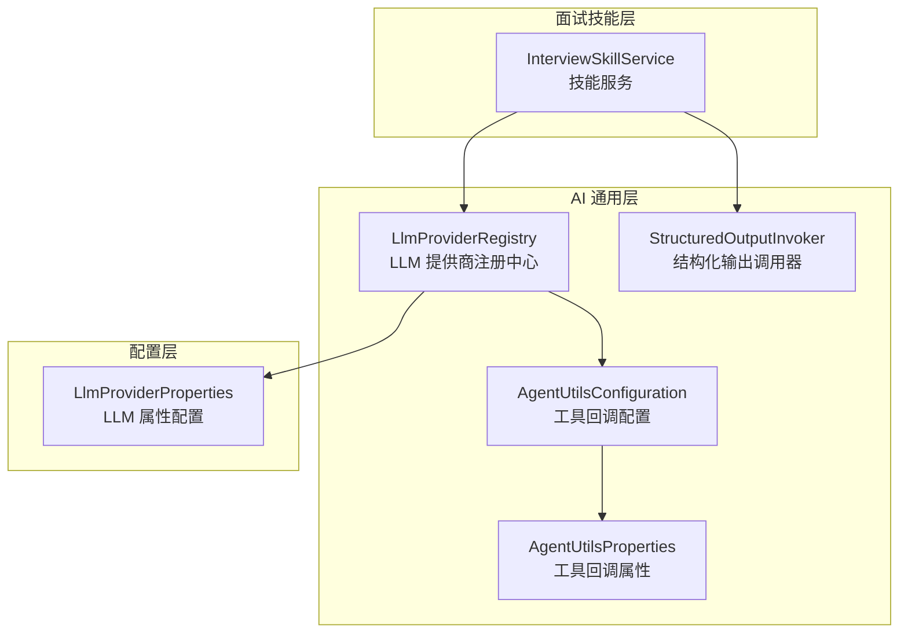
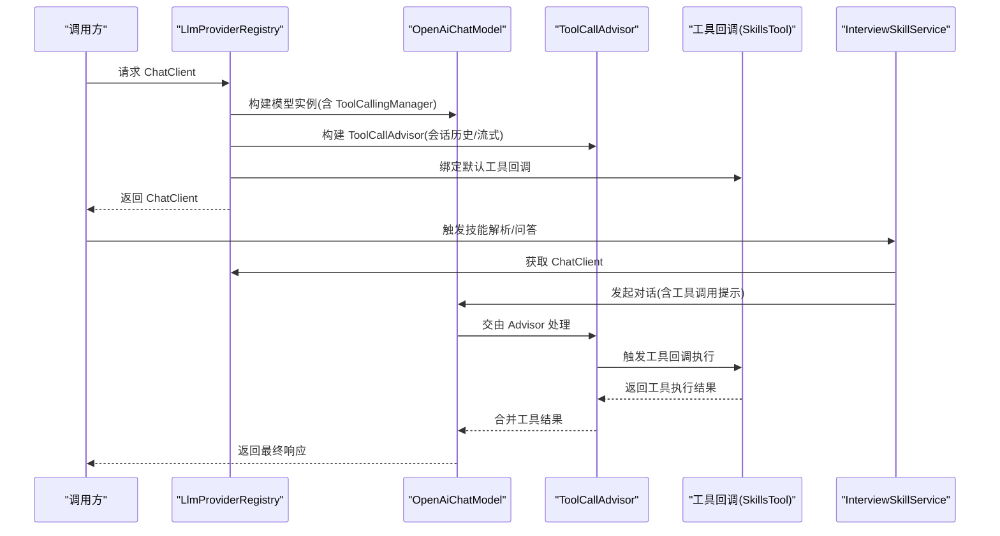
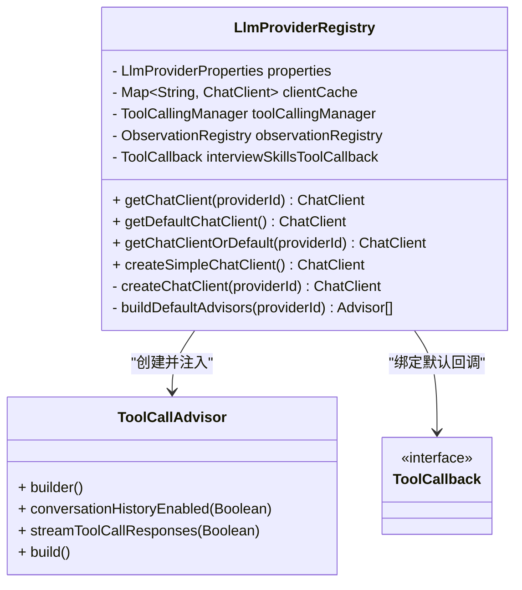
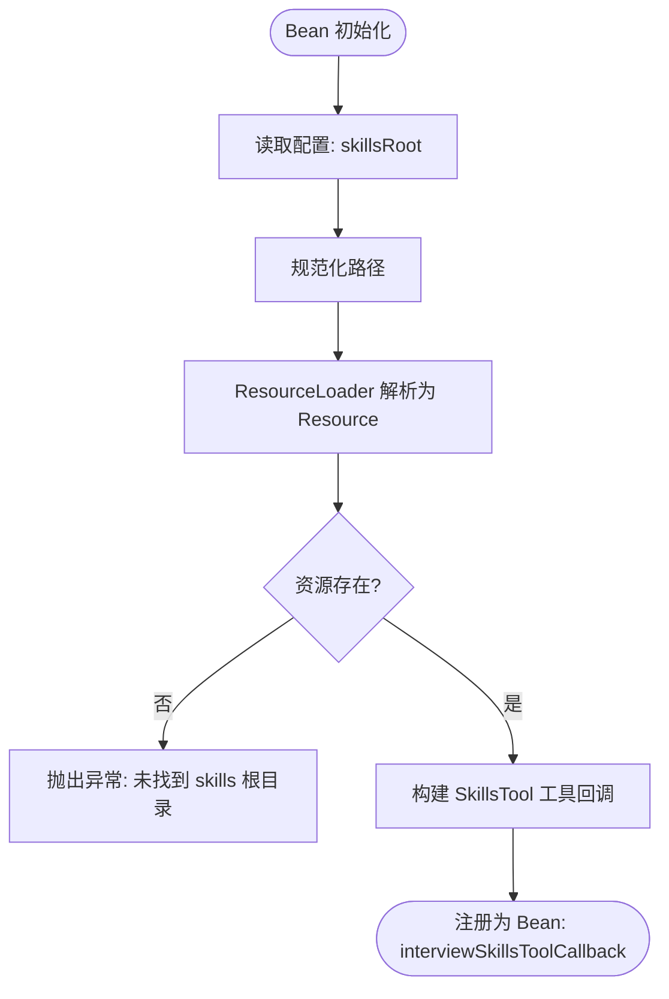
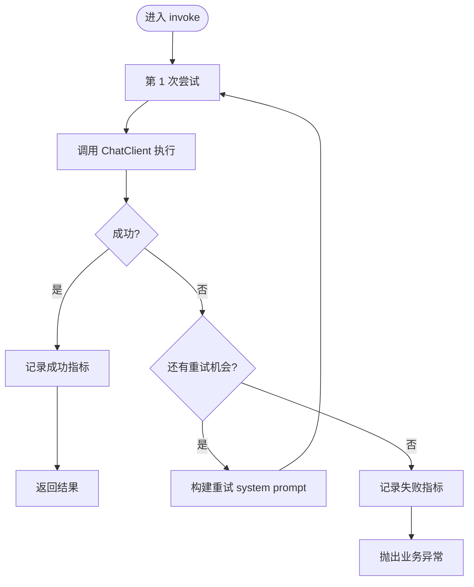
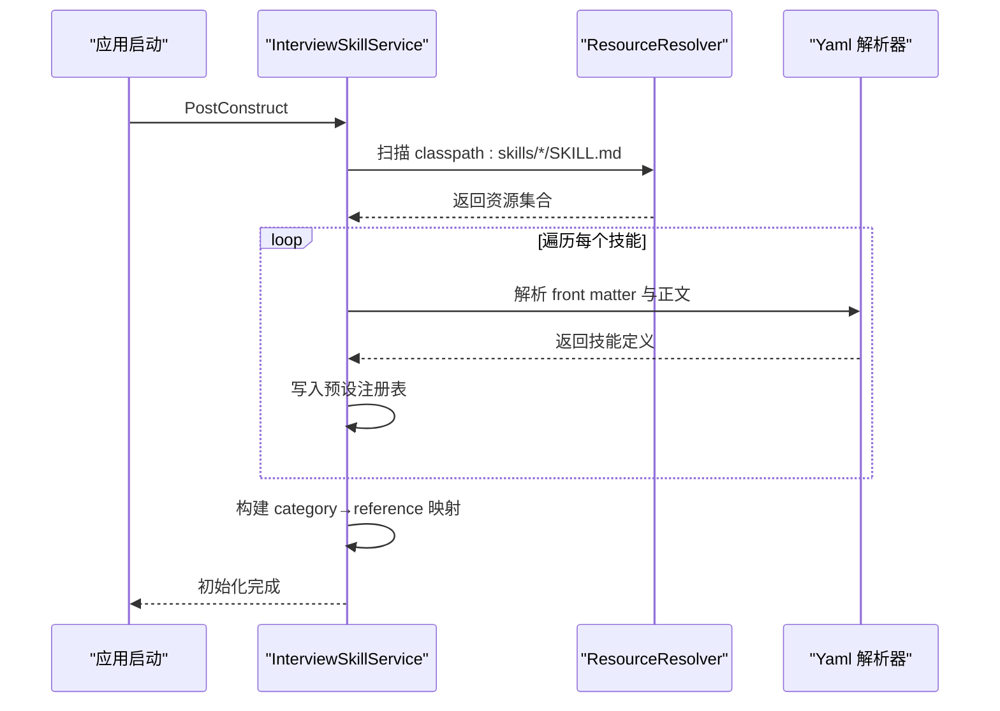
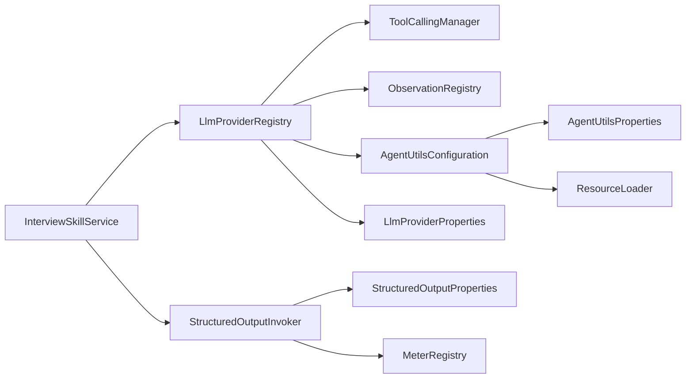

# 工具调用系统

<cite>
**本文引用的文件**
- [LlmProviderRegistry.java](file://app/src/main/java/interview/guide/common/ai/LlmProviderRegistry.java)
- [AgentUtilsConfiguration.java](file://app/src/main/java/interview/guide/common/ai/AgentUtilsConfiguration.java)
- [AgentUtilsProperties.java](file://app/src/main/java/interview/guide/common/ai/AgentUtilsProperties.java)
- [StructuredOutputInvoker.java](file://app/src/main/java/interview/guide/common/ai/StructuredOutputInvoker.java)
- [LlmProviderProperties.java](file://app/src/main/java/interview/guide/common/config/LlmProviderProperties.java)
- [InterviewSkillService.java](file://app/src/main/java/interview/guide/modules/interview/skill/InterviewSkillService.java)
</cite>

## 目录
1. [简介](#简介)
2. [项目结构](#项目结构)
3. [核心组件](#核心组件)
4. [架构总览](#架构总览)
5. [详细组件分析](#详细组件分析)
6. [依赖分析](#依赖分析)
7. [性能考虑](#性能考虑)
8. [故障排查指南](#故障排查指南)
9. [结论](#结论)
10. [附录](#附录)

## 简介
本文件面向“工具调用系统”的技术文档，围绕以下目标展开：
- 深入解释工具调用的实现原理，包括 ToolCallingManager 的集成、工具注册机制、参数传递等核心技术。
- 详细说明工具回调的处理流程，包括回调函数注册、参数解析、结果处理等实现细节。
- 解释工具调用的配置管理，包括工具启用控制、回调配置、错误处理等配置选项。
- 详细描述工具调用的 Advisor 集成，包括 ToolCallAdvisor 的配置、会话历史管理、流式响应处理等技术实现。
- 解释工具调用的性能优化，包括并发处理、缓存策略、资源管理等优化技术。
- 提供工具调用系统的使用示例和集成指南。

## 项目结构
工具调用系统主要由以下模块构成：
- LLM 提供商注册中心：负责根据配置动态创建 ChatClient，并注入 ToolCallAdvisor 和工具回调。
- 工具回调配置：通过 Spring Bean 将 SkillsTool 注册为工具回调，读取 resources/skills 下的技能定义。
- 结构化输出调用器：封装结构化解析与重试策略，保障工具调用结果的稳定性。
- 技能服务：加载预设技能、解析 JD、构建参考内容，支撑工具调用的上下文与参数来源。
- 配置属性：集中管理工具调用开关、会话历史、流式响应等配置项。

**图表来源**
- [LlmProviderRegistry.java:35-229](file://app/src/main/java/interview/guide/common/ai/LlmProviderRegistry.java#L35-L229)
- [AgentUtilsConfiguration.java:15-69](file://app/src/main/java/interview/guide/common/ai/AgentUtilsConfiguration.java#L15-L69)
- [AgentUtilsProperties.java:7-13](file://app/src/main/java/interview/guide/common/ai/AgentUtilsProperties.java#L7-L13)
- [StructuredOutputInvoker.java:19-171](file://app/src/main/java/interview/guide/common/ai/StructuredOutputInvoker.java#L19-L171)
- [LlmProviderProperties.java:8-38](file://app/src/main/java/interview/guide/common/config/LlmProviderProperties.java#L8-L38)
- [InterviewSkillService.java:32-592](file://app/src/main/java/interview/guide/modules/interview/skill/InterviewSkillService.java#L32-L592)

**章节来源**
- [LlmProviderRegistry.java:35-229](file://app/src/main/java/interview/guide/common/ai/LlmProviderRegistry.java#L35-L229)
- [AgentUtilsConfiguration.java:15-69](file://app/src/main/java/interview/guide/common/ai/AgentUtilsConfiguration.java#L15-L69)
- [AgentUtilsProperties.java:7-13](file://app/src/main/java/interview/guide/common/ai/AgentUtilsProperties.java#L7-L13)
- [StructuredOutputInvoker.java:19-171](file://app/src/main/java/interview/guide/common/ai/StructuredOutputInvoker.java#L19-L171)
- [LlmProviderProperties.java:8-38](file://app/src/main/java/interview/guide/common/config/LlmProviderProperties.java#L8-L38)
- [InterviewSkillService.java:32-592](file://app/src/main/java/interview/guide/modules/interview/skill/InterviewSkillService.java#L32-L592)

## 核心组件
- LlmProviderRegistry：统一管理 LLM 提供商客户端，支持缓存、默认 Advisors 注入、工具回调绑定。
- AgentUtilsConfiguration：将 SkillsTool 注册为工具回调 Bean，读取 skills 根目录并校验存在性。
- AgentUtilsProperties：工具回调相关配置项（如 skillsRoot）。
- StructuredOutputInvoker：封装结构化输出调用与重试策略，确保工具调用结果稳定。
- LlmProviderProperties：集中管理工具调用开关、会话历史、流式响应等配置。
- InterviewSkillService：加载技能、解析 JD、构建参考内容，为工具调用提供上下文。

**章节来源**
- [LlmProviderRegistry.java:35-229](file://app/src/main/java/interview/guide/common/ai/LlmProviderRegistry.java#L35-L229)
- [AgentUtilsConfiguration.java:15-69](file://app/src/main/java/interview/guide/common/ai/AgentUtilsConfiguration.java#L15-L69)
- [AgentUtilsProperties.java:7-13](file://app/src/main/java/interview/guide/common/ai/AgentUtilsProperties.java#L7-L13)
- [StructuredOutputInvoker.java:19-171](file://app/src/main/java/interview/guide/common/ai/StructuredOutputInvoker.java#L19-L171)
- [LlmProviderProperties.java:8-38](file://app/src/main/java/interview/guide/common/config/LlmProviderProperties.java#L8-L38)
- [InterviewSkillService.java:32-592](file://app/src/main/java/interview/guide/modules/interview/skill/InterviewSkillService.java#L32-L592)

## 架构总览
工具调用系统的关键交互如下：
- LlmProviderRegistry 在创建 ChatClient 时，注入 ToolCallAdvisor 与工具回调。
- ToolCallAdvisor 使用 ToolCallingManager 管理会话历史与流式响应。
- AgentUtilsConfiguration 注册 SkillsTool 作为工具回调，读取 skills 根目录。
- StructuredOutputInvoker 在需要结构化输出时，提供重试与指标记录。
- InterviewSkillService 通过 ChatClient 与 StructuredOutputInvoker 完成技能解析与参考构建。

**图表来源**
- [LlmProviderRegistry.java:134-190](file://app/src/main/java/interview/guide/common/ai/LlmProviderRegistry.java#L134-L190)
- [LlmProviderRegistry.java:192-228](file://app/src/main/java/interview/guide/common/ai/LlmProviderRegistry.java#L192-L228)
- [AgentUtilsConfiguration.java:29-44](file://app/src/main/java/interview/guide/common/ai/AgentUtilsConfiguration.java#L29-L44)
- [InterviewSkillService.java:166-198](file://app/src/main/java/interview/guide/modules/interview/skill/InterviewSkillService.java#L166-L198)

## 详细组件分析

### LlmProviderRegistry：工具调用集成与 Advisors 注入
- 功能要点
  - 缓存 ChatClient，按提供商 ID 动态创建。
  - 在构建 ChatClient 时注入 ToolCallAdvisor 与工具回调。
  - 根据配置决定是否启用 ToolCallAdvisor、会话历史、流式响应。
- 关键实现
  - 构建 ChatClient 时，若存在 ToolCallingManager，则创建 ToolCallAdvisor 并设置 conversationHistoryEnabled 与 streamToolCallResponses。
  - 若存在 interviewSkillsToolCallback，则将其设置为默认工具回调。
  - 当 ToolCallingManager 为空时，记录警告日志并跳过 ToolCallAdvisor。

**图表来源**
- [LlmProviderRegistry.java:35-229](file://app/src/main/java/interview/guide/common/ai/LlmProviderRegistry.java#L35-L229)

**章节来源**
- [LlmProviderRegistry.java:65-190](file://app/src/main/java/interview/guide/common/ai/LlmProviderRegistry.java#L65-L190)
- [LlmProviderRegistry.java:192-228](file://app/src/main/java/interview/guide/common/ai/LlmProviderRegistry.java#L192-L228)

### AgentUtilsConfiguration：工具回调注册与资源加载
- 功能要点
  - 将 SkillsTool 注册为名为 interviewSkillsToolCallback 的 ToolCallback Bean。
  - 校验 skills 根目录是否存在，不存在则抛出异常。
  - 对输入路径进行规范化处理，支持 classpath 与通配符清理。
- 关键实现
  - 通过 ResourceLoader 获取 skills 根目录 Resource。
  - 使用 SkillsTool.builder().addSkillsResource(...) 构建工具回调。
  - normalizeSkillsRoot 清理末尾 “/SKILL.md”、通配符与多余斜杠，确保路径规范。

**图表来源**
- [AgentUtilsConfiguration.java:29-44](file://app/src/main/java/interview/guide/common/ai/AgentUtilsConfiguration.java#L29-L44)

**章节来源**
- [AgentUtilsConfiguration.java:15-69](file://app/src/main/java/interview/guide/common/ai/AgentUtilsConfiguration.java#L15-L69)
- [AgentUtilsProperties.java:7-13](file://app/src/main/java/interview/guide/common/ai/AgentUtilsProperties.java#L7-L13)

### StructuredOutputInvoker：结构化输出与重试策略
- 功能要点
  - 封装 ChatClient.prompt().system(...).user(...).call().entity(...) 的调用流程。
  - 支持多轮重试，可选修复提示、严格 JSON 指令、错误信息截断。
  - 记录指标（invocations、attempts、latency），便于性能观测。
- 关键实现
  - invoke 方法中循环尝试，构建 retry system prompt，必要时追加严格 JSON 指令与上次错误摘要。
  - 使用 MeterRegistry 记录计数与时延，标签包含 context 与状态。

**图表来源**
- [StructuredOutputInvoker.java:59-103](file://app/src/main/java/interview/guide/common/ai/StructuredOutputInvoker.java#L59-L103)

**章节来源**
- [StructuredOutputInvoker.java:19-171](file://app/src/main/java/interview/guide/common/ai/StructuredOutputInvoker.java#L19-L171)

### InterviewSkillService：技能加载与参考构建
- 功能要点
  - 启动时扫描 classpath:skills/*/SKILL.md，构建预设技能注册表。
  - 解析 JD，输出结构化分类列表，用于后续问题生成与参考构建。
  - 构建参考内容段落，限制字符长度，支持共享与本地 reference。
- 关键实现
  - 使用 PathMatchingResourcePatternResolver 扫描技能文件。
  - 通过 BeanOutputConverter 与 StructuredOutputInvoker 实现结构化解析。
  - 参考内容加载采用 ConcurrentHashMap 缓存，避免重复 IO。

**图表来源**
- [InterviewSkillService.java:79-105](file://app/src/main/java/interview/guide/modules/interview/skill/InterviewSkillService.java#L79-L105)

**章节来源**
- [InterviewSkillService.java:32-592](file://app/src/main/java/interview/guide/modules/interview/skill/InterviewSkillService.java#L32-L592)

## 依赖分析
- LlmProviderRegistry 依赖
  - ToolCallingManager：用于 ToolCallAdvisor 的构造与会话管理。
  - ObservationRegistry：用于观测与指标记录。
  - ToolCallback（可选）：默认工具回调，来自 AgentUtilsConfiguration。
  - LlmProviderProperties：读取默认提供商、Advisor 开关与参数。
- AgentUtilsConfiguration 依赖
  - AgentUtilsProperties：读取 skillsRoot。
  - ResourceLoader：解析 skills 根目录。
- StructuredOutputInvoker 依赖
  - StructuredOutputProperties：控制重试次数、修复提示、严格 JSON 指令等。
  - MeterRegistry：记录指标。
- InterviewSkillService 依赖
  - LlmProviderRegistry：获取 ChatClient。
  - StructuredOutputInvoker：结构化解析 JD。

**图表来源**
- [LlmProviderRegistry.java:42-54](file://app/src/main/java/interview/guide/common/ai/LlmProviderRegistry.java#L42-L54)
- [AgentUtilsConfiguration.java:19-27](file://app/src/main/java/interview/guide/common/ai/AgentUtilsConfiguration.java#L19-L27)
- [StructuredOutputInvoker.java:46-57](file://app/src/main/java/interview/guide/common/ai/StructuredOutputInvoker.java#L46-L57)
- [InterviewSkillService.java:69-77](file://app/src/main/java/interview/guide/modules/interview/skill/InterviewSkillService.java#L69-L77)

**章节来源**
- [LlmProviderRegistry.java:42-54](file://app/src/main/java/interview/guide/common/ai/LlmProviderRegistry.java#L42-L54)
- [AgentUtilsConfiguration.java:19-27](file://app/src/main/java/interview/guide/common/ai/AgentUtilsConfiguration.java#L19-L27)
- [StructuredOutputInvoker.java:46-57](file://app/src/main/java/interview/guide/common/ai/StructuredOutputInvoker.java#L46-L57)
- [InterviewSkillService.java:69-77](file://app/src/main/java/interview/guide/modules/interview/skill/InterviewSkillService.java#L69-L77)

## 性能考虑
- 并发与线程
  - ChatClient 构建与缓存使用 ConcurrentHashMap，避免锁竞争。
  - 在其他模块中使用虚拟线程执行器进行任务调度（例如问题生成），提升吞吐。
- 缓存策略
  - LlmProviderRegistry 缓存 ChatClient 实例，减少重复初始化成本。
  - InterviewSkillService 缓存 reference 内容，避免重复 IO。
- 资源管理
  - RestClient 设置连接与读取超时，适配本地模型与长耗时请求。
  - ToolCallAdvisor 的流式响应与会话历史可按需开启，降低内存压力。
- 指标与可观测性
  - StructuredOutputInvoker 记录 invocations、attempts、latency 指标，便于性能分析。

**章节来源**
- [LlmProviderRegistry.java:40-71](file://app/src/main/java/interview/guide/common/ai/LlmProviderRegistry.java#L40-L71)
- [InterviewSkillService.java:58-62](file://app/src/main/java/interview/guide/modules/interview/skill/InterviewSkillService.java#L58-L62)
- [StructuredOutputInvoker.java:133-151](file://app/src/main/java/interview/guide/common/ai/StructuredOutputInvoker.java#L133-L151)

## 故障排查指南
- ToolCallAdvisor 被跳过
  - 现象：日志出现“ToolCallAdvisor skipped: ToolCallingManager unavailable”。
  - 排查：确认 ToolCallingManager Bean 是否存在；检查配置开关与提供商 ID。
- 工具回调未生效
  - 现象：工具调用未触发。
  - 排查：确认 AgentUtilsConfiguration 是否成功注册 interviewSkillsToolCallback；检查 skillsRoot 路径是否正确且存在。
- 结构化输出失败
  - 现象：多次重试后仍解析失败。
  - 排查：查看 retryUseRepairPrompt、retryAppendStrictJsonInstruction 等配置；检查错误信息截断与指标记录。
- 资源加载异常
  - 现象：抛出“未找到 skills 根目录”异常。
  - 排查：核对 AgentUtilsProperties.skillsRoot；确认 normalizeSkillsRoot 后的路径实际存在。

**章节来源**
- [LlmProviderRegistry.java:208-211](file://app/src/main/java/interview/guide/common/ai/LlmProviderRegistry.java#L208-L211)
- [AgentUtilsConfiguration.java:35-37](file://app/src/main/java/interview/guide/common/ai/AgentUtilsConfiguration.java#L35-L37)
- [StructuredOutputInvoker.java:85-103](file://app/src/main/java/interview/guide/common/ai/StructuredOutputInvoker.java#L85-L103)

## 结论
工具调用系统以 LlmProviderRegistry 为核心，结合 ToolCallAdvisor 与工具回调，实现了可控、可观测、可扩展的工具调用能力。通过结构化输出与重试策略，系统在复杂对话与工具调用场景下保持稳定；通过缓存与并发优化，兼顾性能与资源利用。InterviewSkillService 则为工具调用提供了丰富的上下文与参考数据，进一步提升了工具使用的准确性与一致性。

## 附录

### 配置项一览（关键）
- app.ai.default-provider：默认提供商 ID。
- app.ai.providers.{id}.baseUrl/apiKey/model：提供商基础配置。
- app.ai.advisors.enabled：是否启用默认 Advisors。
- app.ai.advisors.toolCallEnabled：是否启用 ToolCallAdvisor。
- app.ai.advisors.toolCallConversationHistoryEnabled：是否启用会话历史。
- app.ai.advisors.streamToolCallResponses：是否流式返回工具结果。
- app.ai.agent-utils.skillsRoot：skills 根目录（支持 classpath 与相对路径）。

**章节来源**
- [LlmProviderProperties.java:10-38](file://app/src/main/java/interview/guide/common/config/LlmProviderProperties.java#L10-L38)
- [AgentUtilsProperties.java:7-13](file://app/src/main/java/interview/guide/common/ai/AgentUtilsProperties.java#L7-L13)