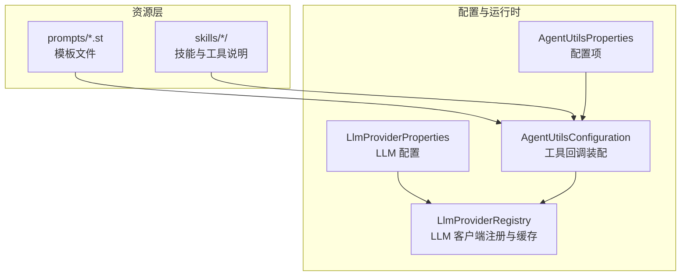
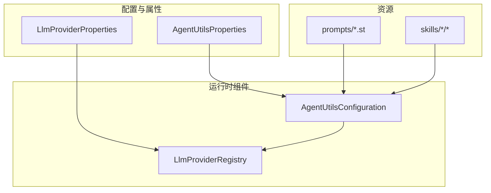
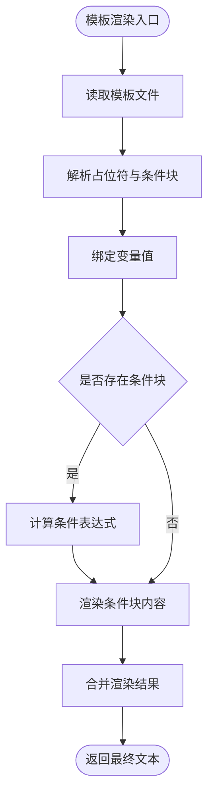
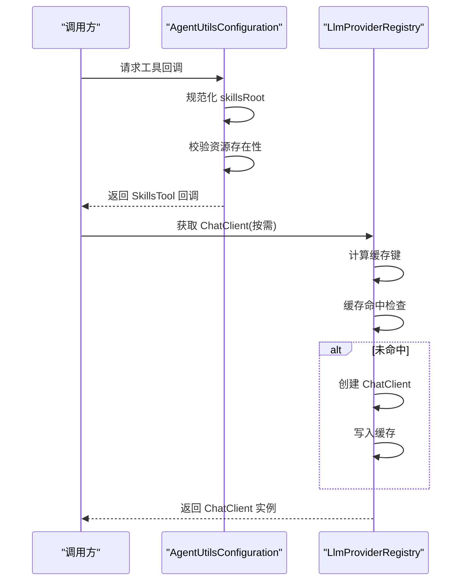
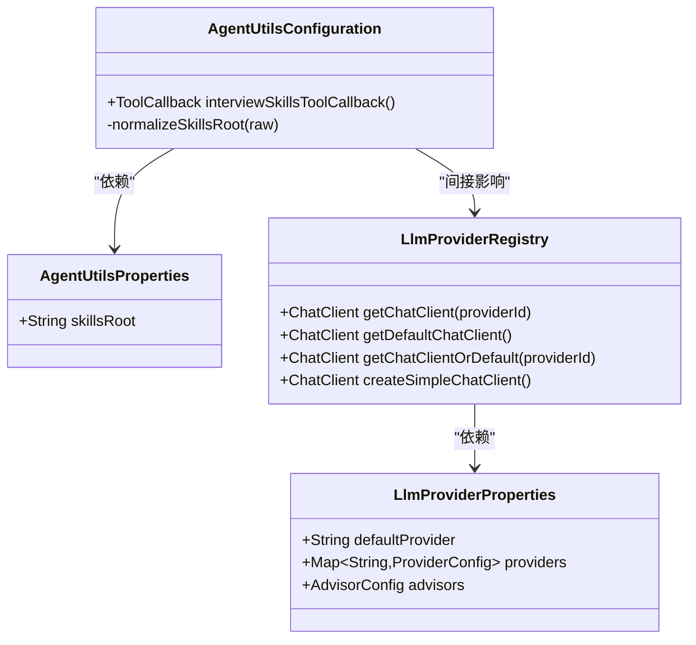

# 提示词模板系统

<cite>
**本文档引用的文件**
- [AgentUtilsConfiguration.java](file://app/src/main/java/interview/guide/common/ai/AgentUtilsConfiguration.java)
- [AgentUtilsProperties.java](file://app/src/main/java/interview/guide/common/ai/AgentUtilsProperties.java)
- [LlmProviderRegistry.java](file://app/src/main/java/interview/guide/common/ai/LlmProviderRegistry.java)
- [LlmProviderProperties.java](file://app/src/main/java/interview/guide/common/config/LlmProviderProperties.java)
- [interview-evaluation-summary-system.st](file://app/src/main/resources/prompts/interview-evaluation-summary-system.st)
- [interview-evaluation-summary-user.st](file://app/src/main/resources/prompts/interview-evaluation-summary-user.st)
- [knowledgebase-query-user.st](file://app/src/main/resources/prompts/knowledgebase-query-user.st)
- [agile-english-evaluation.st](file://app/src/main/resources/prompts/agile-english-evaluation.st)
- [agile-english-multiturn.st](file://app/src/main/resources/prompts/agile-english-multiturn.st)
- [agile-english-scenario.st](file://app/src/main/resources/prompts/agile-english-scenario.st)
- [interview-question-resume-user.st](file://app/src/main/resources/prompts/interview-question-resume-user.st)
- [interview-question-skill-user.st](file://app/src/main/resources/prompts/interview-question-skill-user.st)
- [knowledgebase-query-rewrite.st](file://app/src/main/resources/prompts/knowledgebase-query-rewrite.st)
</cite>

## 目录
1. [简介](#简介)
2. [项目结构](#项目结构)
3. [核心组件](#核心组件)
4. [架构总览](#架构总览)
5. [详细组件分析](#详细组件分析)
6. [依赖关系分析](#依赖关系分析)
7. [性能考虑](#性能考虑)
8. [故障排查指南](#故障排查指南)
9. [结论](#结论)
10. [附录](#附录)

## 简介
本文件面向提示词模板系统，提供从模板文件组织、语法与变量替换、加载与缓存策略、国际化支持、版本管理与演进，到开发最佳实践与调试技巧的完整技术文档。系统通过资源目录中的模板文件与 Spring AI 的 ChatClient 集成，实现可维护、可扩展、可演进的提示词模板体系。

## 项目结构
模板系统主要由两类资源构成：
- 模板文件：位于资源目录中，采用统一的后缀约定，便于识别与管理。
- 配置与运行时组件：通过 Java 配置类与属性类注入，提供模板加载、工具回调、LLM 客户端注册与缓存等能力。

图表来源
- [AgentUtilsConfiguration.java:1-70](file://app/src/main/java/interview/guide/common/ai/AgentUtilsConfiguration.java#L1-L70)
- [AgentUtilsProperties.java:1-14](file://app/src/main/java/interview/guide/common/ai/AgentUtilsProperties.java#L1-L14)
- [LlmProviderRegistry.java:1-230](file://app/src/main/java/interview/guide/common/ai/LlmProviderRegistry.java#L1-L230)
- [LlmProviderProperties.java:1-40](file://app/src/main/java/interview/guide/common/config/LlmProviderProperties.java#L1-L40)

章节来源
- [AgentUtilsConfiguration.java:1-70](file://app/src/main/java/interview/guide/common/ai/AgentUtilsConfiguration.java#L1-L70)
- [AgentUtilsProperties.java:1-14](file://app/src/main/java/interview/guide/common/ai/AgentUtilsProperties.java#L1-L14)
- [LlmProviderRegistry.java:1-230](file://app/src/main/java/interview/guide/common/ai/LlmProviderRegistry.java#L1-L230)
- [LlmProviderProperties.java:1-40](file://app/src/main/java/interview/guide/common/config/LlmProviderProperties.java#L1-L40)

## 核心组件
- 模板文件组织与命名规范
  - 统一使用 .st 后缀，便于在资源路径中被识别与扫描。
  - 文件名采用语义化命名，如 interview-question-resume-user.st、knowledgebase-query-user.st 等，体现用途与角色。
  - 模板按功能域分组存放，便于维护与查找。
- 模板语法与变量替换
  - 占位符语法：模板中使用占位符标记变量位置，运行时由调用方注入实际值。
  - 条件渲染：模板支持条件块语法，用于在不同上下文中选择性渲染片段。
  - 多语言输入：模板允许同时接收多语言输入（例如中英对照的对话场景）。
- 加载与缓存策略
  - 资源加载：通过 ResourceLoader 将模板作为资源读取，支持 classpath 与自定义路径。
  - 工具回调：SkillsTool 通过配置的 skillsRoot 动态加载技能与工具说明，实现模板与工具的联动。
  - 客户端缓存：LlmProviderRegistry 使用并发映射缓存 ChatClient，避免重复创建，提升性能。
- 国际化支持
  - 模板内可直接包含多语言内容（如中英对照对话），满足多语言场景需求。
  - 通过配置项与外部参数控制语言偏好，结合模板中的占位符实现动态切换。
- 版本管理与演进
  - 采用文件级版本控制（文件名含时间戳或标识），便于追踪与回滚。
  - 兼容性处理：新增模板时保留旧模板，逐步迁移；对条件渲染与占位符进行向后兼容。
  - 迁移指南：提供模板字段变更清单与替换脚本，确保平滑过渡。

章节来源
- [interview-evaluation-summary-system.st:1-11](file://app/src/main/resources/prompts/interview-evaluation-summary-system.st#L1-L11)
- [interview-evaluation-summary-user.st:1-25](file://app/src/main/resources/prompts/interview-evaluation-summary-user.st#L1-L25)
- [knowledgebase-query-user.st:1-23](file://app/src/main/resources/prompts/knowledgebase-query-user.st#L1-L23)
- [agile-english-evaluation.st:1-13](file://app/src/main/resources/prompts/agile-english-evaluation.st#L1-L13)
- [agile-english-multiturn.st:1-22](file://app/src/main/resources/prompts/agile-english-multiturn.st#L1-L22)
- [agile-english-scenario.st:1-27](file://app/src/main/resources/prompts/agile-english-scenario.st#L1-L27)
- [interview-question-resume-user.st:1-25](file://app/src/main/resources/prompts/interview-question-resume-user.st#L1-L25)
- [interview-question-skill-user.st:1-39](file://app/src/main/resources/prompts/interview-question-skill-user.st#L1-L39)
- [knowledgebase-query-rewrite.st:1-11](file://app/src/main/resources/prompts/knowledgebase-query-rewrite.st#L1-L11)

## 架构总览
模板系统通过配置类与属性类装配运行时组件，结合资源目录中的模板文件与工具说明，形成完整的提示词模板生态。

图表来源
- [AgentUtilsConfiguration.java:1-70](file://app/src/main/java/interview/guide/common/ai/AgentUtilsConfiguration.java#L1-L70)
- [AgentUtilsProperties.java:1-14](file://app/src/main/java/interview/guide/common/ai/AgentUtilsProperties.java#L1-L14)
- [LlmProviderRegistry.java:1-230](file://app/src/main/java/interview/guide/common/ai/LlmProviderRegistry.java#L1-L230)
- [LlmProviderProperties.java:1-40](file://app/src/main/java/interview/guide/common/config/LlmProviderProperties.java#L1-L40)

## 详细组件分析

### 组件一：模板文件组织与命名规范
- 组织结构
  - templates 目录下按功能域与角色划分模板文件，便于维护与检索。
  - 文件名采用语义化命名，明确用途与角色，如 user/system、resume/skill 等。
- 命名规范
  - 统一使用 .st 后缀，便于在资源路径中被识别与扫描。
  - 通过前缀区分模板类型（如 interview、knowledgebase、agile-english 等）。
- 文件管理
  - 采用版本控制（如时间戳或标识）与注释说明，便于追踪与回滚。
  - 对条件渲染与占位符进行标准化，确保跨模板一致性。

章节来源
- [interview-evaluation-summary-system.st:1-11](file://app/src/main/resources/prompts/interview-evaluation-summary-system.st#L1-L11)
- [interview-evaluation-summary-user.st:1-25](file://app/src/main/resources/prompts/interview-evaluation-summary-user.st#L1-L25)
- [knowledgebase-query-user.st:1-23](file://app/src/main/resources/prompts/knowledgebase-query-user.st#L1-L23)
- [agile-english-evaluation.st:1-13](file://app/src/main/resources/prompts/agile-english-evaluation.st#L1-L13)
- [agile-english-multiturn.st:1-22](file://app/src/main/resources/prompts/agile-english-multiturn.st#L1-L22)
- [agile-english-scenario.st:1-27](file://app/src/main/resources/prompts/agile-english-scenario.st#L1-L27)
- [interview-question-resume-user.st:1-25](file://app/src/main/resources/prompts/interview-question-resume-user.st#L1-L25)
- [interview-question-skill-user.st:1-39](file://app/src/main/resources/prompts/interview-question-skill-user.st#L1-L39)
- [knowledgebase-query-rewrite.st:1-11](file://app/src/main/resources/prompts/knowledgebase-query-rewrite.st#L1-L11)

### 组件二：模板语法与变量替换机制
- 占位符语法
  - 模板中使用占位符标记变量位置，运行时由调用方注入实际值。
  - 支持多层级占位符，便于复杂数据结构的渲染。
- 条件渲染
  - 模板支持条件块语法，用于在不同上下文中选择性渲染片段。
  - 条件块可嵌套，提升模板灵活性。
- 多语言输入
  - 模板允许同时接收多语言输入（例如中英对照的对话场景），满足国际化需求。
  - 通过占位符实现动态切换语言，结合外部参数控制语言偏好。

图表来源
- [interview-evaluation-summary-user.st:1-25](file://app/src/main/resources/prompts/interview-evaluation-summary-user.st#L1-L25)
- [agile-english-multiturn.st:1-22](file://app/src/main/resources/prompts/agile-english-multiturn.st#L1-L22)
- [agile-english-scenario.st:1-27](file://app/src/main/resources/prompts/agile-english-scenario.st#L1-L27)

章节来源
- [interview-evaluation-summary-user.st:1-25](file://app/src/main/resources/prompts/interview-evaluation-summary-user.st#L1-L25)
- [agile-english-multiturn.st:1-22](file://app/src/main/resources/prompts/agile-english-multiturn.st#L1-L22)
- [agile-english-scenario.st:1-27](file://app/src/main/resources/prompts/agile-english-scenario.st#L1-L27)

### 组件三：模板加载与缓存策略
- 资源加载
  - 通过 ResourceLoader 将模板作为资源读取，支持 classpath 与自定义路径。
  - 支持通配符与路径规范化，确保加载稳定性。
- 工具回调
  - SkillsTool 通过配置的 skillsRoot 动态加载技能与工具说明，实现模板与工具的联动。
  - 支持路径裁剪与尾部斜杠处理，确保根目录定位正确。
- 客户端缓存
  - LlmProviderRegistry 使用并发映射缓存 ChatClient，避免重复创建，提升性能。
  - 支持默认客户端与按需客户端获取，满足不同场景需求。

图表来源
- [AgentUtilsConfiguration.java:1-70](file://app/src/main/java/interview/guide/common/ai/AgentUtilsConfiguration.java#L1-L70)
- [LlmProviderRegistry.java:1-230](file://app/src/main/java/interview/guide/common/ai/LlmProviderRegistry.java#L1-L230)

章节来源
- [AgentUtilsConfiguration.java:1-70](file://app/src/main/java/interview/guide/common/ai/AgentUtilsConfiguration.java#L1-L70)
- [LlmProviderRegistry.java:1-230](file://app/src/main/java/interview/guide/common/ai/LlmProviderRegistry.java#L1-L230)

### 组件四：国际化支持
- 多语言模板
  - 模板内可直接包含多语言内容（如中英对照对话），满足多语言场景需求。
  - 通过占位符实现动态切换语言，结合外部参数控制语言偏好。
- 本地化处理
  - 模板中可包含多语言输入与输出要求，确保生成内容符合目标语言规范。
- 动态切换
  - 通过配置项与外部参数控制语言偏好，结合模板中的占位符实现动态切换。

章节来源
- [agile-english-scenario.st:1-27](file://app/src/main/resources/prompts/agile-english-scenario.st#L1-L27)
- [knowledgebase-query-user.st:1-23](file://app/src/main/resources/prompts/knowledgebase-query-user.st#L1-L23)

### 组件五：版本管理与演进策略
- 版本控制
  - 采用文件级版本控制（文件名含时间戳或标识），便于追踪与回滚。
  - 对模板进行版本标注，确保历史版本可访问。
- 兼容性处理
  - 新增模板时保留旧模板，逐步迁移；对条件渲染与占位符进行向后兼容。
  - 提供兼容性检查清单，确保字段与结构稳定。
- 迁移指南
  - 提供模板字段变更清单与替换脚本，确保平滑过渡。
  - 对条件块与占位符进行标准化，减少迁移成本。

章节来源
- [interview-evaluation-summary-system.st:1-11](file://app/src/main/resources/prompts/interview-evaluation-summary-system.st#L1-L11)
- [interview-evaluation-summary-user.st:1-25](file://app/src/main/resources/prompts/interview-evaluation-summary-user.st#L1-L25)
- [knowledgebase-query-rewrite.st:1-11](file://app/src/main/resources/prompts/knowledgebase-query-rewrite.st#L1-L11)

## 依赖关系分析
模板系统的关键依赖关系如下：

图表来源
- [AgentUtilsConfiguration.java:1-70](file://app/src/main/java/interview/guide/common/ai/AgentUtilsConfiguration.java#L1-L70)
- [AgentUtilsProperties.java:1-14](file://app/src/main/java/interview/guide/common/ai/AgentUtilsProperties.java#L1-L14)
- [LlmProviderRegistry.java:1-230](file://app/src/main/java/interview/guide/common/ai/LlmProviderRegistry.java#L1-L230)
- [LlmProviderProperties.java:1-40](file://app/src/main/java/interview/guide/common/config/LlmProviderProperties.java#L1-L40)

章节来源
- [AgentUtilsConfiguration.java:1-70](file://app/src/main/java/interview/guide/common/ai/AgentUtilsConfiguration.java#L1-L70)
- [AgentUtilsProperties.java:1-14](file://app/src/main/java/interview/guide/common/ai/AgentUtilsProperties.java#L1-L14)
- [LlmProviderRegistry.java:1-230](file://app/src/main/java/interview/guide/common/ai/LlmProviderRegistry.java#L1-L230)
- [LlmProviderProperties.java:1-40](file://app/src/main/java/interview/guide/common/config/LlmProviderProperties.java#L1-L40)

## 性能考虑
- 模板加载
  - 使用 ResourceLoader 读取模板，避免频繁 IO；对模板进行缓存，减少重复解析。
- 客户端缓存
  - LlmProviderRegistry 使用并发映射缓存 ChatClient，避免重复创建，提升性能。
- 工具回调
  - SkillsTool 通过配置的 skillsRoot 动态加载技能与工具说明，减少不必要的初始化开销。
- 内存管理
  - 对模板与工具说明进行合理的生命周期管理，避免内存泄漏。

## 故障排查指南
- 路径配置错误
  - 检查 skillsRoot 是否正确配置，确保 ResourceLoader 能够定位到资源。
  - 确认路径末尾斜杠与通配符处理逻辑是否符合预期。
- 资源不存在
  - 在启动阶段校验资源存在性，若不存在则抛出异常并提示配置项。
- 客户端创建失败
  - 检查 LLM 提供商配置是否正确，确保 baseUrl、apiKey、model 等参数有效。
  - 关注超时设置与网络环境，避免因连接超时导致创建失败。
- 模板渲染异常
  - 检查占位符与条件块语法是否正确，确保变量绑定完整。
  - 对多语言输入进行校验，确保语言偏好与模板要求一致。

章节来源
- [AgentUtilsConfiguration.java:1-70](file://app/src/main/java/interview/guide/common/ai/AgentUtilsConfiguration.java#L1-L70)
- [LlmProviderRegistry.java:1-230](file://app/src/main/java/interview/guide/common/ai/LlmProviderRegistry.java#L1-L230)

## 结论
提示词模板系统通过规范化的文件组织、灵活的模板语法与变量替换、高效的加载与缓存策略、完善的国际化支持与版本管理，构建了可维护、可扩展、可演进的提示词模板生态。配合 Spring AI 的 ChatClient 与工具回调机制，系统能够稳定地支撑多场景的提示词生成与应用。

## 附录
- 开发最佳实践
  - 使用语义化命名与分组，便于维护与检索。
  - 对占位符与条件块进行标准化，减少模板差异。
  - 在模板中明确多语言要求，确保生成内容符合目标语言规范。
  - 对模板进行版本控制与兼容性检查，确保平滑迁移。
- 调试技巧
  - 在启动阶段打印资源路径与配置项，便于定位问题。
  - 对模板渲染过程进行日志记录，便于追踪变量绑定与条件渲染结果。
  - 使用最小化示例验证模板语法与变量替换，快速定位问题。