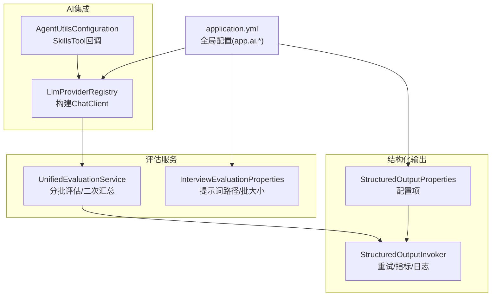
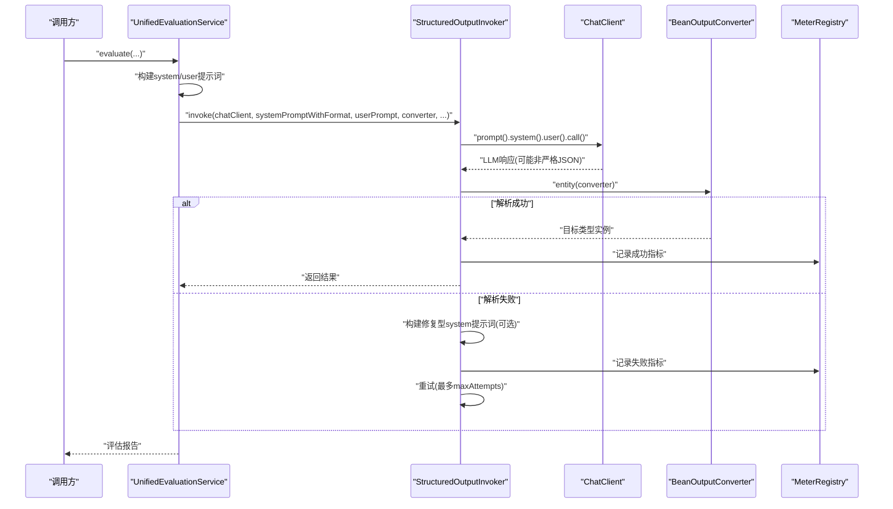
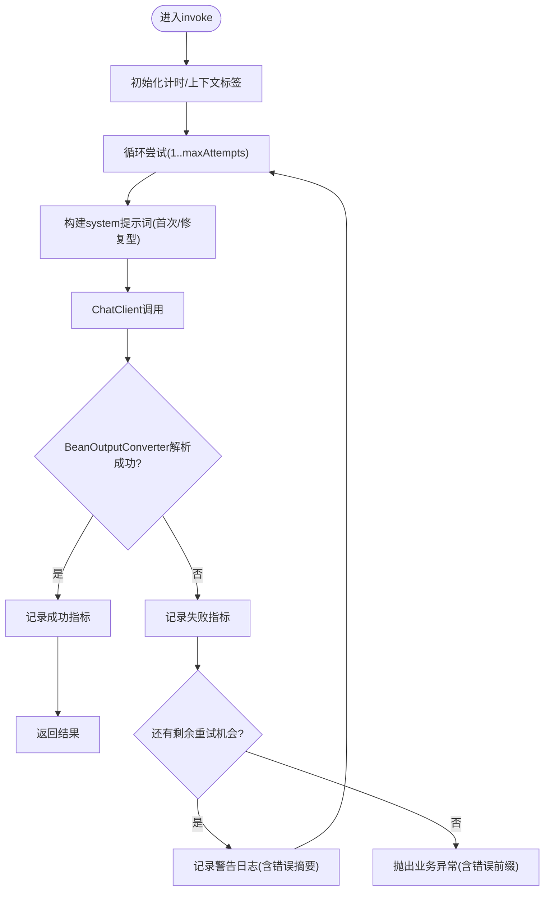
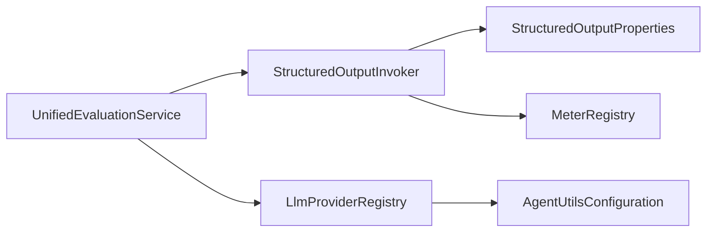

# 结构化输出处理

<cite>
**本文引用的文件**
- [StructuredOutputInvoker.java](file://app/src/main/java/interview/guide/common/ai/StructuredOutputInvoker.java)
- [StructuredOutputProperties.java](file://app/src/main/java/interview/guide/common/ai/StructuredOutputProperties.java)
- [LlmProviderRegistry.java](file://app/src/main/java/interview/guide/common/ai/LlmProviderRegistry.java)
- [AgentUtilsConfiguration.java](file://app/src/main/java/interview/guide/common/ai/AgentUtilsConfiguration.java)
- [LlmProviderProperties.java](file://app/src/main/java/interview/guide/common/config/LlmProviderProperties.java)
- [application.yml](file://app/src/main/resources/application.yml)
- [UnifiedEvaluationService.java](file://app/src/main/java/interview/guide/common/evaluation/UnifiedEvaluationService.java)
- [InterviewEvaluationProperties.java](file://app/src/main/java/interview/guide/common/evaluation/InterviewEvaluationProperties.java)
</cite>

## 目录
1. [简介](#简介)
2. [项目结构](#项目结构)
3. [核心组件](#核心组件)
4. [架构总览](#架构总览)
5. [详细组件分析](#详细组件分析)
6. [依赖分析](#依赖分析)
7. [性能考量](#性能考量)
8. [故障排查指南](#故障排查指南)
9. [结论](#结论)
10. [附录](#附录)

## 简介
本文件围绕结构化输出处理系统进行深度技术文档整理，重点覆盖以下方面：
- StructuredOutputInvoker 的工作机制：JSON 模式约束、输出验证、重试策略、错误处理与指标采集
- 结构化输出调用机制：参数传递、返回值处理、异常捕获与降级
- 输出模式配置管理：模式定义、验证规则、自定义处理器与提示词增强
- 错误处理与调试机制：模式不匹配、数据转换错误、性能监控与上下文标签
- 与 AI 模型的集成：输出约束设置、格式化处理、结果解析与提示词引导
- 使用示例与最佳实践：在统一评估服务中的分批评估与二次汇总流程

## 项目结构
本系统位于后端应用模块中，核心代码集中在 common/ai 与 common/evaluation 包内，并通过 Micrometer 指标系统进行可观测性埋点。AI 提供商注册中心负责构建 ChatClient，支持多提供商与工具回调。

图表来源
- [LlmProviderRegistry.java:134-190](file://app/src/main/java/interview/guide/common/ai/LlmProviderRegistry.java#L134-L190)
- [AgentUtilsConfiguration.java:29-44](file://app/src/main/java/interview/guide/common/ai/AgentUtilsConfiguration.java#L29-L44)
- [StructuredOutputInvoker.java:46-57](file://app/src/main/java/interview/guide/common/ai/StructuredOutputInvoker.java#L46-L57)
- [StructuredOutputProperties.java:10-18](file://app/src/main/java/interview/guide/common/ai/StructuredOutputProperties.java#L10-L18)
- [UnifiedEvaluationService.java:76-89](file://app/src/main/java/interview/guide/common/evaluation/UnifiedEvaluationService.java#L76-L89)
- [InterviewEvaluationProperties.java:10-17](file://app/src/main/java/interview/guide/common/evaluation/InterviewEvaluationProperties.java#L10-L17)
- [application.yml:126-159](file://app/src/main/resources/application.yml#L126-L159)

章节来源
- [application.yml:126-159](file://app/src/main/resources/application.yml#L126-L159)
- [LlmProviderRegistry.java:134-190](file://app/src/main/java/interview/guide/common/ai/LlmProviderRegistry.java#L134-L190)
- [StructuredOutputInvoker.java:46-57](file://app/src/main/java/interview/guide/common/ai/StructuredOutputInvoker.java#L46-L57)
- [UnifiedEvaluationService.java:76-89](file://app/src/main/java/interview/guide/common/evaluation/UnifiedEvaluationService.java#L76-L89)

## 核心组件
- StructuredOutputInvoker：封装结构化输出调用、重试策略、严格 JSON 指令注入、错误信息清洗、上下文标签归一化与 Micrometer 指标上报。
- StructuredOutputProperties：结构化输出相关配置项，包括最大重试次数、是否包含上次错误、是否使用修复型重试提示词、是否追加严格 JSON 指令、错误信息最大长度、是否启用指标。
- LlmProviderRegistry：基于提供商配置动态创建 ChatClient，支持工具回调与顾问（Advisor）链路装配。
- AgentUtilsConfiguration：加载 skills 根目录并构建 SkillsTool 回调，供 ChatClient 默认工具回调使用。
- UnifiedEvaluationService：统一评估服务，采用分批评估 + 结构化输出 + 二次汇总 + 降级兜底的策略，调用 StructuredOutputInvoker 完成结构化解析。
- InterviewEvaluationProperties：评估服务的提示词模板路径与批大小配置。
- application.yml：全局配置入口，集中管理 app.ai.* 与 app.interview.evaluation.* 等关键配置。

章节来源
- [StructuredOutputInvoker.java:16-172](file://app/src/main/java/interview/guide/common/ai/StructuredOutputInvoker.java#L16-L172)
- [StructuredOutputProperties.java:10-18](file://app/src/main/java/interview/guide/common/ai/StructuredOutputProperties.java#L10-L18)
- [LlmProviderRegistry.java:134-190](file://app/src/main/java/interview/guide/common/ai/LlmProviderRegistry.java#L134-L190)
- [AgentUtilsConfiguration.java:29-44](file://app/src/main/java/interview/guide/common/ai/AgentUtilsConfiguration.java#L29-L44)
- [UnifiedEvaluationService.java:76-89](file://app/src/main/java/interview/guide/common/evaluation/UnifiedEvaluationService.java#L76-L89)
- [InterviewEvaluationProperties.java:10-17](file://app/src/main/java/interview/guide/common/evaluation/InterviewEvaluationProperties.java#L10-L17)
- [application.yml:126-159](file://app/src/main/resources/application.yml#L126-L159)

## 架构总览
结构化输出处理贯穿“提示词构造 → ChatClient 调用 → BeanOutputConverter 解析 → 重试与指标 → 异常与降级”的完整链路。系统通过严格 JSON 指令与修复型提示词降低解析失败概率，并通过批处理与二次汇总提升稳定性与可读性。

图表来源
- [UnifiedEvaluationService.java:164-189](file://app/src/main/java/interview/guide/common/evaluation/UnifiedEvaluationService.java#L164-L189)
- [StructuredOutputInvoker.java:59-103](file://app/src/main/java/interview/guide/common/ai/StructuredOutputInvoker.java#L59-L103)
- [application.yml:148-159](file://app/src/main/resources/application.yml#L148-L159)

## 详细组件分析

### StructuredOutputInvoker 工作原理
- JSON 模式定义与严格指令
  - 在首次与后续重试时，系统将 BeanOutputConverter 的格式说明拼接到 system prompt 中，形成“格式即约束”的提示词。
  - 若启用严格 JSON 指令，会在修复型提示词中追加“仅返回可被 JSON 解析器直接解析的 JSON 对象”的严格指令，减少模型输出冗余或注释。
- 输出验证与重试策略
  - 调用 ChatClient.prompt().system().user().call().entity(converter) 完成一次请求与解析。
  - 若解析失败，根据配置决定是否使用修复型提示词（包含上次错误原因与严格 JSON 指令），并在达到最大重试次数前持续尝试。
- 错误处理与日志
  - 每次尝试记录 attempts 计数器；最终成功或失败记录 invocations 计数器与 latency timer。
  - 日志中输出当前尝试次数、最大重试次数与错误摘要；当达到最大重试仍失败时，抛出业务异常并携带错误前缀。
- 指标与上下文标签
  - 指标名称：invocations、attempts、latency；标签包含 context 与 status。
  - 上下文标签归一化：小写、去空白、替换非字母数字为下划线、去除多余下划线、截断至最大长度，保证标签一致性与长度控制。

图表来源
- [StructuredOutputInvoker.java:59-103](file://app/src/main/java/interview/guide/common/ai/StructuredOutputInvoker.java#L59-L103)
- [StructuredOutputInvoker.java:105-123](file://app/src/main/java/interview/guide/common/ai/StructuredOutputInvoker.java#L105-L123)
- [StructuredOutputInvoker.java:133-151](file://app/src/main/java/interview/guide/common/ai/StructuredOutputInvoker.java#L133-L151)
- [StructuredOutputInvoker.java:157-170](file://app/src/main/java/interview/guide/common/ai/StructuredOutputInvoker.java#L157-L170)

章节来源
- [StructuredOutputInvoker.java:16-172](file://app/src/main/java/interview/guide/common/ai/StructuredOutputInvoker.java#L16-L172)

### 结构化输出调用机制
- 参数传递
  - 必要参数：ChatClient、带格式说明的 system prompt、user prompt、BeanOutputConverter、错误码、错误前缀、日志上下文、Logger。
  - 可选参数：Micrometer MeterRegistry（用于指标上报）。
- 返回值处理
  - 成功：直接返回目标类型实例。
  - 失败：在所有重试结束后抛出业务异常，异常消息包含错误前缀与最后错误摘要。
- 异常捕获与降级
  - 调用方可在上层对业务异常进行捕获与降级处理（例如在统一评估服务中，批评估失败时返回空报告，由合并阶段兜底）。

章节来源
- [StructuredOutputInvoker.java:46-57](file://app/src/main/java/interview/guide/common/ai/StructuredOutputInvoker.java#L46-L57)
- [StructuredOutputInvoker.java:59-103](file://app/src/main/java/interview/guide/common/ai/StructuredOutputInvoker.java#L59-L103)

### 输出模式的配置管理
- 配置项一览
  - structured-max-attempts：最大重试次数（≥1）
  - structured-include-last-error：重试时是否将上次错误原因注入提示词
  - structured-retry-use-repair-prompt：是否启用修复型重试提示词
  - structured-retry-append-strict-json-instruction：修复型提示词中是否追加严格 JSON 指令
  - structured-error-message-max-length：注入提示词中的错误信息最大长度
  - structured-metrics-enabled：是否开启结构化输出指标
- 配置来源
  - application.yml 中 app.ai.* 命名空间下的键映射到 StructuredOutputProperties。
  - LlmProviderProperties 与 LlmProviderRegistry 提供 ChatClient 构建与顾问装配，间接影响结构化输出的稳定性和工具回调行为。

章节来源
- [StructuredOutputProperties.java:10-18](file://app/src/main/java/interview/guide/common/ai/StructuredOutputProperties.java#L10-L18)
- [application.yml:148-159](file://app/src/main/resources/application.yml#L148-L159)
- [LlmProviderProperties.java:11-38](file://app/src/main/java/interview/guide/common/config/LlmProviderProperties.java#L11-L38)
- [LlmProviderRegistry.java:134-190](file://app/src/main/java/interview/guide/common/ai/LlmProviderRegistry.java#L134-L190)

### 错误处理与调试机制
- 模式不匹配处理
  - 通过修复型提示词注入“上次失败原因”与严格 JSON 指令，引导模型遵循目标 JSON 结构。
- 数据转换错误
  - BeanOutputConverter 解析失败即视为转换错误；Invoker 将其计入失败指标并触发重试。
- 性能监控
  - 指标：invocations、attempts、latency；标签：context、status。
  - 上下文标签归一化，避免标签爆炸与过长。
- 调试建议
  - 开启修复型提示词与严格 JSON 指令，有助于模型更稳定地输出符合格式的 JSON。
  - 控制错误信息最大长度，避免将过长错误注入提示词导致 token 溢出。
  - 在开发环境适当提高重试次数，生产环境保持合理上限以避免资源浪费。

章节来源
- [StructuredOutputInvoker.java:105-131](file://app/src/main/java/interview/guide/common/ai/StructuredOutputInvoker.java#L105-L131)
- [StructuredOutputInvoker.java:133-170](file://app/src/main/java/interview/guide/common/ai/StructuredOutputInvoker.java#L133-L170)
- [application.yml:148-159](file://app/src/main/resources/application.yml#L148-L159)

### 与 AI 模型的集成方式
- ChatClient 构建
  - LlmProviderRegistry 基于 app.ai.default-provider 与 app.ai.providers.* 配置创建 ChatClient，支持工具回调与顾问链（如 ToolCallAdvisor、MessageChatMemoryAdvisor、SimpleLoggerAdvisor）。
- 输出约束设置
  - 在 system prompt 中拼接 BeanOutputConverter 的格式说明，形成“格式即约束”，并可结合严格 JSON 指令进一步强化。
- 格式化处理与结果解析
  - 通过 BeanOutputConverter 将 LLM 响应解析为目标类型实例；若解析失败则进入重试与修复流程。
- 工具回调与顾问
  - AgentUtilsConfiguration 提供 SkillsTool 回调，LlmProviderRegistry 可将其作为 ChatClient 的默认工具回调，增强对话能力。

章节来源
- [LlmProviderRegistry.java:134-190](file://app/src/main/java/interview/guide/common/ai/LlmProviderRegistry.java#L134-L190)
- [AgentUtilsConfiguration.java:29-44](file://app/src/main/java/interview/guide/common/ai/AgentUtilsConfiguration.java#L29-L44)
- [UnifiedEvaluationService.java:164-189](file://app/src/main/java/interview/guide/common/evaluation/UnifiedEvaluationService.java#L164-L189)
- [StructuredOutputInvoker.java:22-27](file://app/src/main/java/interview/guide/common/ai/StructuredOutputInvoker.java#L22-L27)

## 依赖分析
- 组件耦合
  - UnifiedEvaluationService 依赖 StructuredOutputInvoker 与 BeanOutputConverter，形成“提示词渲染 → 结构化调用 → 结果合并”的清晰边界。
  - StructuredOutputInvoker 依赖 StructuredOutputProperties 与可选 MeterRegistry，实现配置驱动与可观测性。
  - LlmProviderRegistry 为上层服务提供 ChatClient，间接支撑结构化输出的模型调用。
- 外部依赖
  - Spring AI ChatClient、BeanOutputConverter、PromptTemplate
  - Micrometer（MeterRegistry、Tags）
  - SLF4J（日志）

图表来源
- [UnifiedEvaluationService.java:76-89](file://app/src/main/java/interview/guide/common/evaluation/UnifiedEvaluationService.java#L76-L89)
- [StructuredOutputInvoker.java:46-57](file://app/src/main/java/interview/guide/common/ai/StructuredOutputInvoker.java#L46-L57)
- [LlmProviderRegistry.java:134-190](file://app/src/main/java/interview/guide/common/ai/LlmProviderRegistry.java#L134-L190)
- [AgentUtilsConfiguration.java:29-44](file://app/src/main/java/interview/guide/common/ai/AgentUtilsConfiguration.java#L29-L44)

章节来源
- [UnifiedEvaluationService.java:76-89](file://app/src/main/java/interview/guide/common/evaluation/UnifiedEvaluationService.java#L76-L89)
- [StructuredOutputInvoker.java:46-57](file://app/src/main/java/interview/guide/common/ai/StructuredOutputInvoker.java#L46-L57)
- [LlmProviderRegistry.java:134-190](file://app/src/main/java/interview/guide/common/ai/LlmProviderRegistry.java#L134-L190)
- [AgentUtilsConfiguration.java:29-44](file://app/src/main/java/interview/guide/common/ai/AgentUtilsConfiguration.java#L29-L44)

## 性能考量
- 重试策略
  - 合理设置最大重试次数，避免过度重试造成资源浪费；在高延迟或不稳定模型场景下适度放宽。
- 指标监控
  - 启用结构化输出指标，关注 invocations、attempts 与 latency 的分布，识别热点与异常波动。
- 提示词优化
  - 严格 JSON 指令与修复型提示词可显著降低解析失败率，减少无效重试。
- 批处理与降级
  - 在统一评估服务中采用分批评估与二次汇总，既提升吞吐又具备降级兜底能力。

## 故障排查指南
- 症状：结构化解析失败频繁
  - 排查要点：是否启用修复型提示词与严格 JSON 指令；是否包含上次错误原因；错误信息最大长度是否过短。
  - 建议：适当提高最大重试次数；在开发环境开启严格 JSON 指令；缩短错误信息长度以避免 token 溢出。
- 症状：指标缺失或为空
  - 排查要点：是否启用结构化输出指标；MeterRegistry 是否可用；上下文标签是否被截断或归一化为 unknown。
  - 建议：确认配置项与运行环境；检查标签长度与非法字符。
- 症状：评估报告为空或部分题目为 0 分
  - 排查要点：批评估是否抛出异常；合并阶段是否对空报告进行兜底；二次汇总是否降级。
  - 建议：查看批评估日志；确认 BeanOutputConverter 的格式说明与模型输出一致性。

章节来源
- [StructuredOutputInvoker.java:88-102](file://app/src/main/java/interview/guide/common/ai/StructuredOutputInvoker.java#L88-L102)
- [StructuredOutputInvoker.java:133-151](file://app/src/main/java/interview/guide/common/ai/StructuredOutputInvoker.java#L133-L151)
- [StructuredOutputInvoker.java:157-170](file://app/src/main/java/interview/guide/common/ai/StructuredOutputInvoker.java#L157-L170)
- [UnifiedEvaluationService.java:178-188](file://app/src/main/java/interview/guide/common/evaluation/UnifiedEvaluationService.java#L178-L188)
- [UnifiedEvaluationService.java:276-280](file://app/src/main/java/interview/guide/common/evaluation/UnifiedEvaluationService.java#L276-L280)

## 结论
结构化输出处理系统通过严格的提示词约束、修复型重试与可观测性指标，实现了对 AI 模型输出的稳定解析与高可用评估。在统一评估服务中，系统采用分批评估与二次汇总策略，兼顾吞吐与准确性，并在失败时提供降级兜底。通过合理的配置与监控，可有效降低解析失败率并提升整体性能。

## 附录

### 使用示例与最佳实践
- 在统一评估服务中使用结构化输出
  - 渲染 system/user 提示词，拼接 BeanOutputConverter 的格式说明，调用 StructuredOutputInvoker.invoke 完成结构化解析。
  - 批评估失败时返回空报告，由合并阶段兜底；二次汇总失败时降级到批次聚合结果。
- 配置建议
  - 开启修复型提示词与严格 JSON 指令，提高解析成功率。
  - 控制错误信息最大长度，避免 token 溢出。
  - 合理设置最大重试次数，平衡成功率与资源消耗。
  - 启用结构化输出指标，持续监控 invocations、attempts 与 latency。

章节来源
- [UnifiedEvaluationService.java:164-189](file://app/src/main/java/interview/guide/common/evaluation/UnifiedEvaluationService.java#L164-L189)
- [UnifiedEvaluationService.java:248-280](file://app/src/main/java/interview/guide/common/evaluation/UnifiedEvaluationService.java#L248-L280)
- [application.yml:148-159](file://app/src/main/resources/application.yml#L148-L159)