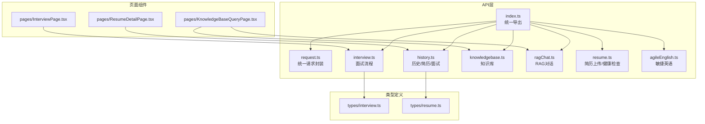
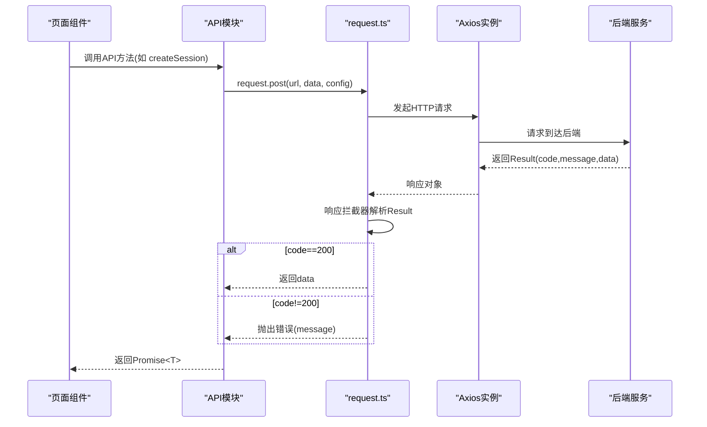
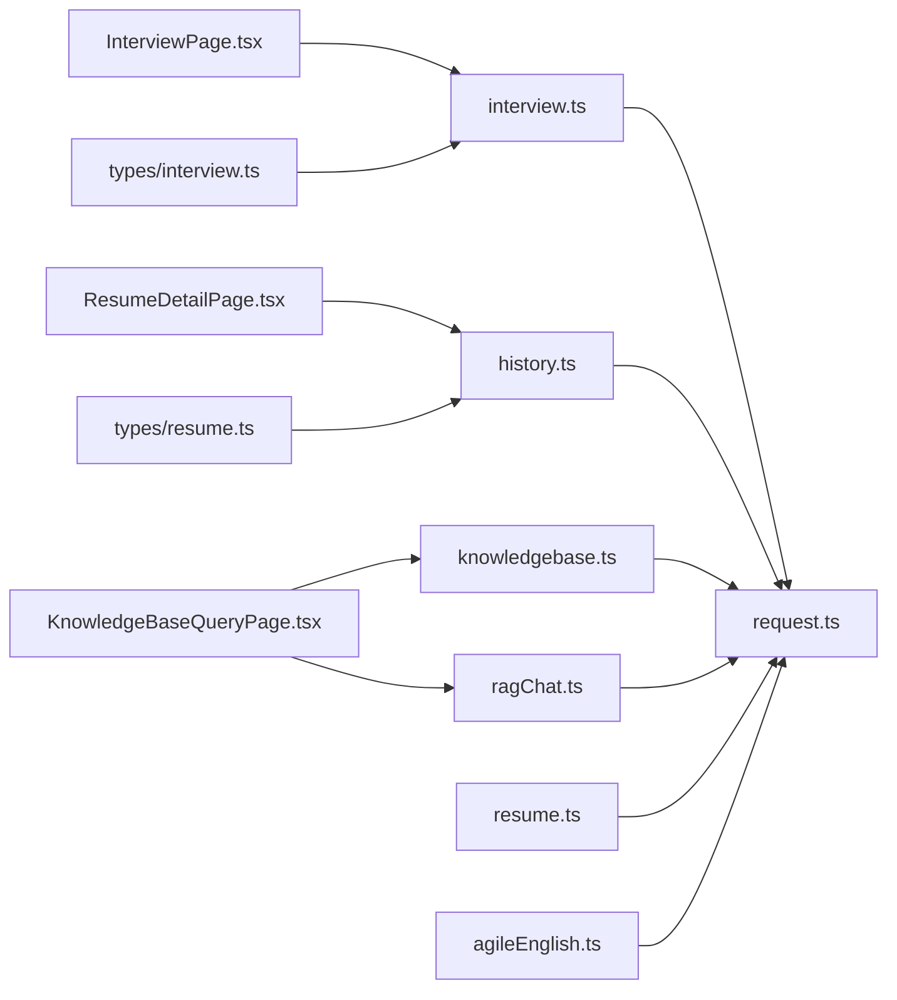

# API集成和数据获取

<cite>
**本文引用的文件**
- [frontend/src/api/index.ts](file://frontend/src/api/index.ts)
- [frontend/src/api/request.ts](file://frontend/src/api/request.ts)
- [frontend/src/api/history.ts](file://frontend/src/api/history.ts)
- [frontend/src/api/interview.ts](file://frontend/src/api/interview.ts)
- [frontend/src/api/knowledgebase.ts](file://frontend/src/api/knowledgebase.ts)
- [frontend/src/api/ragChat.ts](file://frontend/src/api/ragChat.ts)
- [frontend/src/api/resume.ts](file://frontend/src/api/resume.ts)
- [frontend/src/api/agileEnglish.ts](file://frontend/src/api/agileEnglish.ts)
- [frontend/src/types/interview.ts](file://frontend/src/types/interview.ts)
- [frontend/src/types/resume.ts](file://frontend/src/types/resume.ts)
- [frontend/src/utils/date.ts](file://frontend/src/utils/date.ts)
- [frontend/src/utils/score.ts](file://frontend/src/utils/score.ts)
- [frontend/src/pages/InterviewPage.tsx](file://frontend/src/pages/InterviewPage.tsx)
- [frontend/src/pages/KnowledgeBaseQueryPage.tsx](file://frontend/src/pages/KnowledgeBaseQueryPage.tsx)
- [frontend/src/pages/ResumeDetailPage.tsx](file://frontend/src/pages/ResumeDetailPage.tsx)
- [frontend/package.json](file://frontend/package.json)
</cite>

## 目录
1. [简介](#简介)
2. [项目结构](#项目结构)
3. [核心组件](#核心组件)
4. [架构总览](#架构总览)
5. [详细组件分析](#详细组件分析)
6. [依赖关系分析](#依赖关系分析)
7. [性能考量](#性能考量)
8. [故障排查指南](#故障排查指南)
9. [结论](#结论)
10. [附录](#附录)

## 简介
本指南聚焦面试指南平台的前端API集成与数据获取体系，围绕统一请求封装、各领域API模块（历史、面试、知识库、RAG对话、简历、敏捷英语）、类型定义最佳实践、错误处理策略、缓存与预加载、鉴权与认证、测试与Mock、性能优化等方面进行系统化梳理。目标是帮助开发者快速理解并高效扩展API层功能。

## 项目结构
前端API层位于 frontend/src/api，采用“按域分模块”的组织方式，每个模块负责一个业务域的数据交互；类型定义集中在 frontend/src/types；页面组件通过调用API模块完成数据获取与展示。

图表来源
- [frontend/src/api/index.ts:1-9](file://frontend/src/api/index.ts#L1-L9)
- [frontend/src/api/request.ts:1-128](file://frontend/src/api/request.ts#L1-L128)
- [frontend/src/api/history.ts:1-162](file://frontend/src/api/history.ts#L1-L162)
- [frontend/src/api/interview.ts:1-107](file://frontend/src/api/interview.ts#L1-L107)
- [frontend/src/api/knowledgebase.ts:1-281](file://frontend/src/api/knowledgebase.ts#L1-L281)
- [frontend/src/api/ragChat.ts:1-218](file://frontend/src/api/ragChat.ts#L1-L218)
- [frontend/src/api/resume.ts:1-21](file://frontend/src/api/resume.ts#L1-L21)
- [frontend/src/api/agileEnglish.ts:1-168](file://frontend/src/api/agileEnglish.ts#L1-L168)
- [frontend/src/types/interview.ts:1-88](file://frontend/src/types/interview.ts#L1-L88)
- [frontend/src/types/resume.ts:1-46](file://frontend/src/types/resume.ts#L1-L46)
- [frontend/src/pages/InterviewPage.tsx:1-292](file://frontend/src/pages/InterviewPage.tsx#L1-L292)
- [frontend/src/pages/KnowledgeBaseQueryPage.tsx:1-843](file://frontend/src/pages/KnowledgeBaseQueryPage.tsx#L1-L843)
- [frontend/src/pages/ResumeDetailPage.tsx:1-361](file://frontend/src/pages/ResumeDetailPage.tsx#L1-L361)

章节来源
- [frontend/src/api/index.ts:1-9](file://frontend/src/api/index.ts#L1-L9)
- [frontend/src/api/request.ts:1-128](file://frontend/src/api/request.ts#L1-L128)

## 核心组件
- 统一请求封装 request.ts
  - 基于Axios创建实例，内置响应拦截器，统一处理后端约定的 Result 结构（code/message/data）。
  - 提供 get/post/put/patch/delete/upload 等方法，并支持获取原始实例用于Blob下载等特殊场景。
  - 统一错误处理：区分有响应与无响应两类网络错误，针对文件上传场景给出更友好的提示。
- API模块导出 index.ts
  - 将 request 与各领域API统一导出，便于页面组件集中引入。

章节来源
- [frontend/src/api/request.ts:1-128](file://frontend/src/api/request.ts#L1-L128)
- [frontend/src/api/index.ts:1-9](file://frontend/src/api/index.ts#L1-L9)

## 架构总览
API层整体采用“请求封装 + 领域模块 + 类型定义”的分层设计。页面组件通过调用API模块发起HTTP请求，API模块基于统一请求封装执行网络请求并返回类型安全的数据结构。

图表来源
- [frontend/src/api/interview.ts:25-40](file://frontend/src/api/interview.ts#L25-L40)
- [frontend/src/api/request.ts:26-75](file://frontend/src/api/request.ts#L26-L75)

## 详细组件分析

### 统一请求封装 request.ts
- 设计要点
  - 统一baseURL与超时配置，开发环境指向本地后端。
  - 响应拦截器：识别Result结构，成功透传data，失败抛出message；非Result结构原样返回。
  - 网络错误分支：区分有响应与无响应；对上传场景给出更合理的错误提示。
  - 上传方法：自定义multipart超时与头部，适配大文件上传。
  - 原始实例：getInstance用于Blob下载等场景。
- 错误处理策略
  - 后端错误：统一读取message并抛出。
  - 网络异常：区分上传失败与一般网络错误，避免误判文件大小问题。
- 泛型使用
  - 所有HTTP方法均返回 Promise<T>，确保调用方获得类型安全的响应。

章节来源
- [frontend/src/api/request.ts:1-128](file://frontend/src/api/request.ts#L1-L128)

### 历史/简历/面试模块 history.ts
- 功能概览
  - 简历列表、详情、统计、删除、重新分析。
  - 面试会话详情、导出PDF（Blob下载）。
  - 支持分析状态轮询与导出流程。
- 数据模型
  - 定义了简历项、分析项、面试项、答案项、统计等接口，保证前后端数据一致。
- 实现细节
  - 导出PDF使用原始实例设置 responseType 与跳过结果转换。
  - 重新分析与删除等操作通过标准HTTP方法实现。

章节来源
- [frontend/src/api/history.ts:1-162](file://frontend/src/api/history.ts#L1-L162)
- [frontend/src/pages/ResumeDetailPage.tsx:58-74](file://frontend/src/pages/ResumeDetailPage.tsx#L58-L74)

### 面试模块 interview.ts
- 功能概览
  - 会话列表、创建、获取、当前问题、提交答案、获取报告、保存答案、提前交卷。
  - 针对AI生成问题与评估设置了较长超时。
- 类型绑定
  - 与 types/interview.ts 的接口强绑定，确保请求/响应结构一致。
- 页面集成
  - InterviewPage.tsx 通过 interviewApi 完成面试全流程。

章节来源
- [frontend/src/api/interview.ts:1-107](file://frontend/src/api/interview.ts#L1-L107)
- [frontend/src/types/interview.ts:1-88](file://frontend/src/types/interview.ts#L1-L88)
- [frontend/src/pages/InterviewPage.tsx:73-97](file://frontend/src/pages/InterviewPage.tsx#L73-L97)

### 知识库模块 knowledgebase.ts
- 功能概览
  - 文件上传、下载、列表、详情、删除、分类管理、搜索、统计、重新向量化。
  - 查询接口支持同步与流式SSE两种方式。
- 流式查询实现
  - 使用原生fetch + ReadableStream + TextDecoder解析SSE事件，逐块推送内容。
  - 对SSE事件格式进行健壮解析，处理data行与事件边界。
- 错误处理
  - 对SSE响应状态码与JSON错误体进行解析，统一通过getErrorMessage输出。

章节来源
- [frontend/src/api/knowledgebase.ts:1-281](file://frontend/src/api/knowledgebase.ts#L1-L281)
- [frontend/src/pages/KnowledgeBaseQueryPage.tsx:257-337](file://frontend/src/pages/KnowledgeBaseQueryPage.tsx#L257-L337)

### RAG对话模块 ragChat.ts
- 功能概览
  - 会话创建、列表、详情、标题更新、知识库更新、置顶切换、删除。
  - 流式SSE发送消息，解析多事件块，还原Markdown格式。
- 实现细节
  - SSE解析支持单行data:与多事件块，处理转义换行符，保持内容原始格式。
  - 错误统一通过getErrorMessage输出。

章节来源
- [frontend/src/api/ragChat.ts:1-218](file://frontend/src/api/ragChat.ts#L1-L218)
- [frontend/src/pages/KnowledgeBaseQueryPage.tsx:307-337](file://frontend/src/pages/KnowledgeBaseQueryPage.tsx#L307-L337)

### 简历模块 resume.ts
- 功能概览
  - 简历上传并分析（FormData），健康检查。
- 类型绑定
  - UploadResponse 与 types/resume.ts 对应，保证异步分析结果结构一致。

章节来源
- [frontend/src/api/resume.ts:1-21](file://frontend/src/api/resume.ts#L1-L21)
- [frontend/src/types/resume.ts:1-46](file://frontend/src/types/resume.ts#L1-L46)

### 敏捷英语模块 agileEnglish.ts
- 功能概览
  - 场景生成、可用场景列表、常用短语、表达评估、多轮对话、练习历史、能力报告、每日一句。
- 使用方式
  - 基于统一request封装，参数与返回类型明确。

章节来源
- [frontend/src/api/agileEnglish.ts:1-168](file://frontend/src/api/agileEnglish.ts#L1-L168)

### 类型定义最佳实践
- 建议
  - 明确区分请求参数、响应数据结构与中间态类型，避免在API层混用。
  - 使用联合类型与字面量类型约束枚举值（如状态、难度、分类）。
  - 对可选字段使用?标记，避免强制解构导致的运行时错误。
  - 对复杂嵌套结构拆分为子接口，提升可维护性。
- 示例参考
  - types/interview.ts：面试会话、问题、评分、报告等结构清晰。
  - types/resume.ts：分析结果、存储信息、建议等字段明确。

章节来源
- [frontend/src/types/interview.ts:1-88](file://frontend/src/types/interview.ts#L1-L88)
- [frontend/src/types/resume.ts:1-46](file://frontend/src/types/resume.ts#L1-L46)

### API调用的错误处理策略
- 后端约定错误
  - 响应拦截器统一读取Result.code与message，失败直接抛出。
- 网络错误
  - 有响应：尝试解析Result；否则提示“请求失败，请重试”。
  - 无响应：区分上传失败与一般网络错误，避免误判文件大小。
- 页面级兜底
  - 页面组件捕获错误并展示友好提示，提供重试入口。
- SSE错误
  - 对SSE响应状态与错误体进行解析，统一通过getErrorMessage输出。

章节来源
- [frontend/src/api/request.ts:44-75](file://frontend/src/api/request.ts#L44-L75)
- [frontend/src/api/knowledgebase.ts:276-279](file://frontend/src/api/knowledgebase.ts#L276-L279)
- [frontend/src/api/ragChat.ts:213-216](file://frontend/src/api/ragChat.ts#L213-L216)
- [frontend/src/pages/InterviewPage.tsx:91-96](file://frontend/src/pages/InterviewPage.tsx#L91-L96)

### 数据缓存与预加载
- 缓存策略
  - 建议：对静态列表（如知识库分类、场景列表）启用内存缓存；对高频读取的详情页采用LRU缓存。
  - 对于长耗时任务（如分析、向量化），采用轮询或事件通知机制，避免重复触发。
- 预加载
  - 在进入页面前预取必要数据（如知识库列表），减少首屏等待。
  - 对SSE流式数据，采用增量渲染与useTransition优化滚动体验。

章节来源
- [frontend/src/pages/KnowledgeBaseQueryPage.tsx:65-68](file://frontend/src/pages/KnowledgeBaseQueryPage.tsx#L65-L68)
- [frontend/src/pages/ResumeDetailPage.tsx:58-74](file://frontend/src/pages/ResumeDetailPage.tsx#L58-L74)

### API鉴权与认证
- 当前实现
  - 统一请求封装未包含鉴权头注入逻辑，鉴权通常由后端通过Cookie/Session或Token机制处理。
- 建议
  - 若采用Token，可在请求拦截器中注入Authorization头；若采用Cookie，确保跨域与SameSite策略正确。
  - 对敏感操作（删除、重新分析）增加二次确认与权限校验提示。

章节来源
- [frontend/src/api/request.ts:14-17](file://frontend/src/api/request.ts#L14-L17)

### API测试与Mock
- 单元测试
  - 建议：为API模块编写单元测试，使用MockAdapter拦截Axios请求，验证成功/失败分支。
- 端到端测试
  - 建议：使用Mock后端或Stubs，覆盖SSE流式场景与错误路径。
- Mock数据
  - 建议：为各领域API准备典型响应样本，便于组件测试与UI调试。

章节来源
- [frontend/package.json:1-47](file://frontend/package.json#L1-L47)

## 依赖关系分析

图表来源
- [frontend/src/api/interview.ts:1-107](file://frontend/src/api/interview.ts#L1-L107)
- [frontend/src/api/history.ts:1-162](file://frontend/src/api/history.ts#L1-L162)
- [frontend/src/api/knowledgebase.ts:1-281](file://frontend/src/api/knowledgebase.ts#L1-L281)
- [frontend/src/api/ragChat.ts:1-218](file://frontend/src/api/ragChat.ts#L1-L218)
- [frontend/src/api/resume.ts:1-21](file://frontend/src/api/resume.ts#L1-L21)
- [frontend/src/api/agileEnglish.ts:1-168](file://frontend/src/api/agileEnglish.ts#L1-L168)
- [frontend/src/pages/InterviewPage.tsx:1-292](file://frontend/src/pages/InterviewPage.tsx#L1-L292)
- [frontend/src/pages/KnowledgeBaseQueryPage.tsx:1-843](file://frontend/src/pages/KnowledgeBaseQueryPage.tsx#L1-L843)
- [frontend/src/pages/ResumeDetailPage.tsx:1-361](file://frontend/src/pages/ResumeDetailPage.tsx#L1-L361)
- [frontend/src/types/interview.ts:1-88](file://frontend/src/types/interview.ts#L1-L88)
- [frontend/src/types/resume.ts:1-46](file://frontend/src/types/resume.ts#L1-L46)

章节来源
- [frontend/src/api/index.ts:1-9](file://frontend/src/api/index.ts#L1-L9)

## 性能考量
- 请求合并
  - 对批量操作（如批量删除知识库、批量更新会话）合并为单次请求，减少RTT。
- 防抖/节流
  - 搜索与筛选（如知识库搜索）使用防抖，避免频繁请求。
- 并发控制
  - 对高并发请求设置最大并发数，避免资源争用。
- SSE渲染优化
  - 使用requestAnimationFrame与useTransition平滑增量渲染，避免主线程阻塞。
- 超时与重试
  - 为AI生成类接口设置合理超时；对临时性网络错误进行指数退避重试。

章节来源
- [frontend/src/pages/KnowledgeBaseQueryPage.tsx:312-321](file://frontend/src/pages/KnowledgeBaseQueryPage.tsx#L312-L321)

## 故障排查指南
- 常见问题
  - 上传失败：检查文件大小、MIME类型与后端限制；关注网络波动。
  - SSE断流：检查后端SSE通道、代理超时配置与浏览器兼容性。
  - 结果解析异常：确认后端返回是否符合Result结构，避免非JSON响应。
- 定位手段
  - 使用浏览器Network面板观察请求/响应头与Body。
  - 在API层打印错误上下文（URL、参数、状态码）。
  - 对SSE场景记录事件序列与解码缓冲区状态。

章节来源
- [frontend/src/api/request.ts:44-75](file://frontend/src/api/request.ts#L44-L75)
- [frontend/src/api/knowledgebase.ts:213-279](file://frontend/src/api/knowledgebase.ts#L213-L279)
- [frontend/src/api/ragChat.ts:117-216](file://frontend/src/api/ragChat.ts#L117-L216)

## 结论
本API集成体系以统一请求封装为核心，结合领域模块与类型定义，实现了清晰、可维护、可测试的数据获取层。通过合理的错误处理、SSE流式渲染与页面级兜底，保障了用户体验。建议在后续迭代中完善鉴权、缓存与Mock策略，并持续优化性能与稳定性。

## 附录
- 工具函数
  - 日期格式化：formatDate/formatDateTime/formatDateOnly，便于展示与排序。
  - 分数工具：calculatePercentage/normalizeScore/getScoreColor等，用于可视化与主题适配。
- 页面集成示例
  - 面试页面：通过 interviewApi 完成会话创建、问题获取、答案提交与报告生成。
  - 知识库问答：通过 knowledgebaseApi 与 ragChatApi 实现知识库选择、会话管理与流式回答。
  - 简历详情：通过 historyApi 获取分析与面试记录，支持导出PDF与重新分析。

章节来源
- [frontend/src/utils/date.ts:1-60](file://frontend/src/utils/date.ts#L1-L60)
- [frontend/src/utils/score.ts:1-109](file://frontend/src/utils/score.ts#L1-L109)
- [frontend/src/pages/InterviewPage.tsx:73-186](file://frontend/src/pages/InterviewPage.tsx#L73-L186)
- [frontend/src/pages/KnowledgeBaseQueryPage.tsx:257-337](file://frontend/src/pages/KnowledgeBaseQueryPage.tsx#L257-L337)
- [frontend/src/pages/ResumeDetailPage.tsx:112-148](file://frontend/src/pages/ResumeDetailPage.tsx#L112-L148)