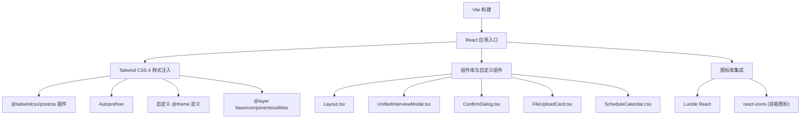
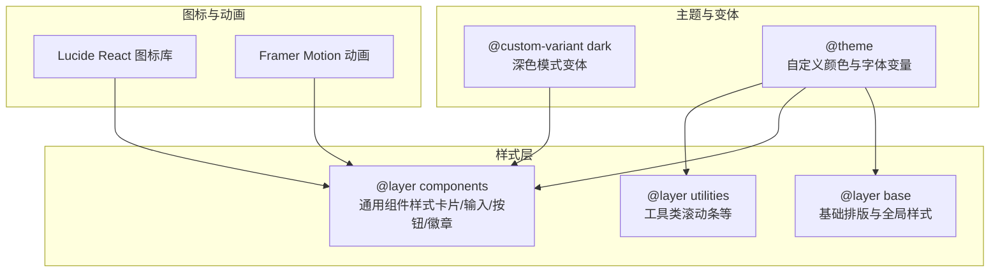
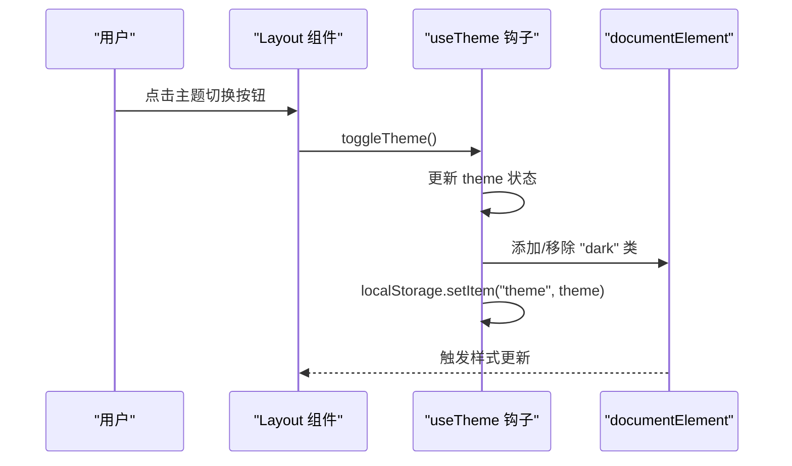
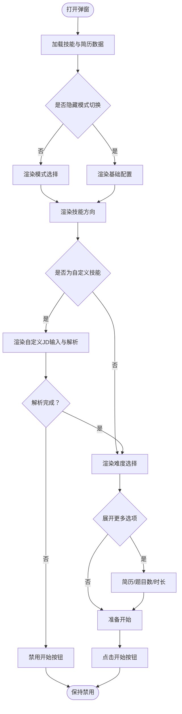
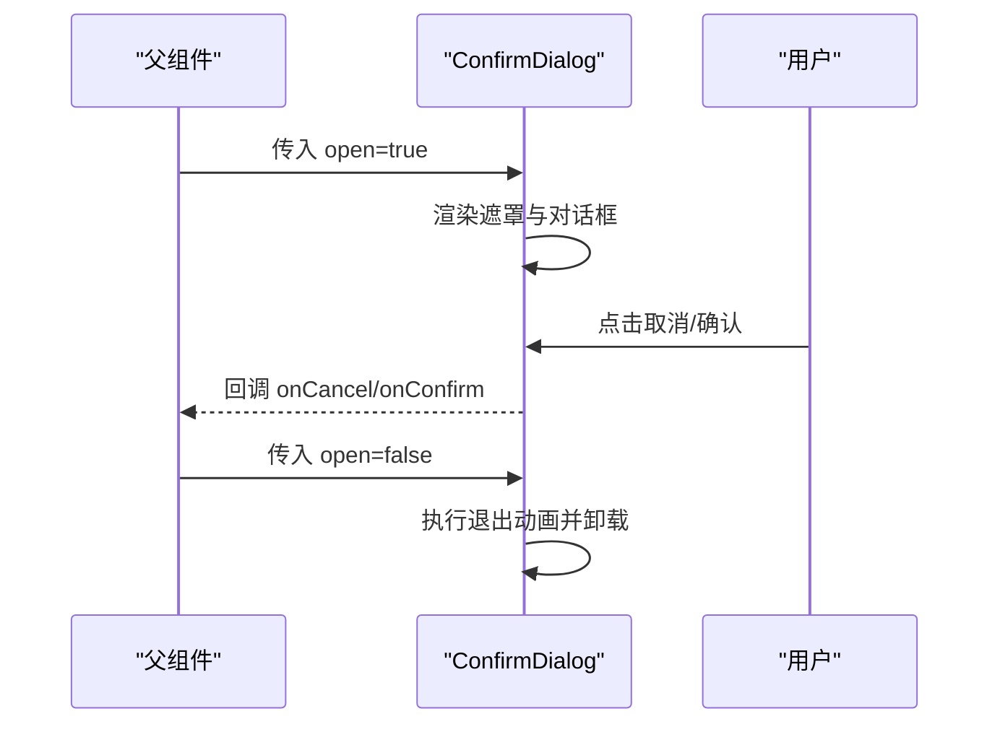
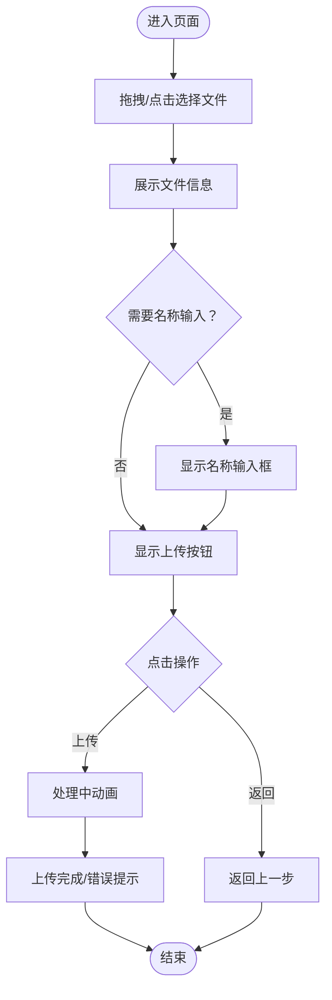
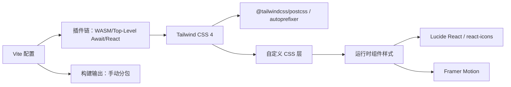

# UI组件库和样式系统

<cite>
**本文档引用的文件**
- [package.json](file://frontend/package.json)
- [vite.config.ts](file://frontend/vite.config.ts)
- [postcss.config.js](file://frontend/postcss.config.js)
- [index.css](file://frontend/src/index.css)
- [Layout.tsx](file://frontend/src/components/Layout.tsx)
- [useTheme.ts](file://frontend/src/hooks/useTheme.ts)
- [UnifiedInterviewModal.tsx](file://frontend/src/components/UnifiedInterviewModal.tsx)
- [ConfirmDialog.tsx](file://frontend/src/components/ConfirmDialog.tsx)
- [FileUploadCard.tsx](file://frontend/src/components/FileUploadCard.tsx)
- [ScheduleCalendar.css](file://frontend/src/components/interviewschedule/ScheduleCalendar.css)
- [skillIcons.tsx](file://frontend/src/utils/skillIcons.tsx)
- [useInterviewConfig.ts](file://frontend/src/hooks/useInterviewConfig.ts)
</cite>

## 目录
1. [简介](#简介)
2. [项目结构](#项目结构)
3. [核心组件](#核心组件)
4. [架构总览](#架构总览)
5. [详细组件分析](#详细组件分析)
6. [依赖关系分析](#依赖关系分析)
7. [性能考量](#性能考量)
8. [故障排查指南](#故障排查指南)
9. [结论](#结论)
10. [附录](#附录)

## 简介
本指南面向面试指南平台的前端UI组件库与样式系统，重点覆盖以下方面：
- Tailwind CSS 4.x 的配置与使用，包括自定义主题、响应式设计、暗色模式支持
- Lucide React 图标库的集成与使用方法
- 自定义组件的设计与实现，涵盖按钮、表单、卡片、模态框等基础组件
- 组件样式的统一规范，包括颜色系统、字体规范、间距标准等设计令牌
- CSS-in-JS 与传统 CSS 的混合使用策略
- 响应式设计最佳实践与多屏幕适配
- 组件可访问性（a11y）实现建议
- 动画与过渡效果的实现方式

## 项目结构
前端采用 Vite + React + TypeScript 构建，样式系统以 Tailwind CSS 4 为核心，结合 PostCSS 插件链与自定义 CSS 层，形成“原子类 + 自定义层 + 组件样式”的混合体系。

图表来源
- [vite.config.ts:1-42](file://frontend/vite.config.ts#L1-L42)
- [postcss.config.js:1-7](file://frontend/postcss.config.js#L1-L7)
- [index.css:1-270](file://frontend/src/index.css#L1-L270)

章节来源
- [package.json:1-47](file://frontend/package.json#L1-L47)
- [vite.config.ts:1-42](file://frontend/vite.config.ts#L1-L42)
- [postcss.config.js:1-7](file://frontend/postcss.config.js#L1-L7)
- [index.css:1-270](file://frontend/src/index.css#L1-L270)

## 核心组件
- 主题与暗色模式：通过 useTheme 钩子与根元素 class 策略实现，持久化到 localStorage，并支持系统偏好检测。
- 布局与导航：Layout 组件提供侧边栏导航、Logo 区域、主题切换按钮与主内容区，配合 Framer Motion 实现页面切换动画。
- 统一面试弹窗：UnifiedInterviewModal 封装了面试模式选择、技能方向、难度、更多选项（简历、题目数、时长）等交互，使用 Framer Motion 提供流畅的进入/退出动画。
- 确认对话框：ConfirmDialog 提供可定制的确认/取消操作，支持加载状态与变体样式。
- 文件上传卡片：FileUploadCard 支持拖拽/点击选择文件、名称输入、错误提示与上传流程，使用动画增强交互体验。
- 日程日历：ScheduleCalendar.css 为 react-big-calendar 提供深度定制样式，覆盖时间槽高度、事件最小高度、深色模式边框等细节。

章节来源
- [useTheme.ts:1-37](file://frontend/src/hooks/useTheme.ts#L1-L37)
- [Layout.tsx:1-257](file://frontend/src/components/Layout.tsx#L1-L257)
- [UnifiedInterviewModal.tsx:1-476](file://frontend/src/components/UnifiedInterviewModal.tsx#L1-L476)
- [ConfirmDialog.tsx:1-117](file://frontend/src/components/ConfirmDialog.tsx#L1-L117)
- [FileUploadCard.tsx:1-292](file://frontend/src/components/FileUploadCard.tsx#L1-L292)
- [ScheduleCalendar.css:1-76](file://frontend/src/components/interviewschedule/ScheduleCalendar.css#L1-L76)

## 架构总览
样式系统由三层构成：
- 原子类层：通过 Tailwind 原子类实现基础排版、颜色、间距、阴影等
- 自定义层：在 @layer 中定义 base、components、utilities，统一卡片、输入、按钮、状态徽章等组件样式
- 组件层：针对特定组件（如日历）的局部样式覆盖

图表来源
- [index.css:5-270](file://frontend/src/index.css#L5-L270)

章节来源
- [index.css:1-270](file://frontend/src/index.css#L1-L270)

## 详细组件分析

### 主题与暗色模式
- 实现策略：根元素添加/移除 "dark" 类，localStorage 持久化；优先读取用户设置，其次检测系统偏好
- 样式应用：通过 @custom-variant dark 为组件层提供深色模式变体，确保卡片、输入、文本、按钮等自动适配
- 交互：Layout 侧边栏提供切换按钮，点击后触发主题切换

图表来源
- [Layout.tsx:148-166](file://frontend/src/components/Layout.tsx#L148-L166)
- [useTheme.ts:19-33](file://frontend/src/hooks/useTheme.ts#L19-L33)

章节来源
- [useTheme.ts:1-37](file://frontend/src/hooks/useTheme.ts#L1-L37)
- [Layout.tsx:131-166](file://frontend/src/components/Layout.tsx#L131-L166)
- [index.css:5-9](file://frontend/src/index.css#L5-L9)

### 统一面试弹窗（UnifiedInterviewModal）
- 功能要点：面试模式（文字/语音）、技能方向（含自定义JD解析）、难度、更多选项（简历、题目数、时长）、开始按钮
- 样式规范：使用统一的卡片背景、输入框、按钮样式类；深色模式下自动适配
- 动画策略：使用 AnimatePresence 与 Framer Motion 提供进入/退出动画，按钮使用 tap/hover 缩放反馈
- 交互细节：自定义JD解析、禁用条件判断、更多选项折叠/展开

图表来源
- [UnifiedInterviewModal.tsx:54-91](file://frontend/src/components/UnifiedInterviewModal.tsx#L54-L91)
- [useInterviewConfig.ts:65-108](file://frontend/src/hooks/useInterviewConfig.ts#L65-L108)

章节来源
- [UnifiedInterviewModal.tsx:1-476](file://frontend/src/components/UnifiedInterviewModal.tsx#L1-L476)
- [useInterviewConfig.ts:1-152](file://frontend/src/hooks/useInterviewConfig.ts#L1-L152)

### 确认对话框（ConfirmDialog）
- 功能要点：标题、消息、确认/取消按钮、加载状态、变体样式（danger/primary/warning）、自定义内容
- 样式规范：卡片背景、按钮渐变、深色模式适配；按钮禁用态与加载旋转
- 动画策略：背景遮罩与对话框均使用 AnimatePresence 与 Framer Motion

图表来源
- [ConfirmDialog.tsx:38-114](file://frontend/src/components/ConfirmDialog.tsx#L38-L114)

章节来源
- [ConfirmDialog.tsx:1-117](file://frontend/src/components/ConfirmDialog.tsx#L1-L117)

### 文件上传卡片（FileUploadCard）
- 功能要点：拖拽/点击选择文件、文件信息展示、名称输入、错误提示、上传按钮与返回按钮
- 样式规范：渐变边框效果、卡片阴影、输入框与按钮的深色模式适配
- 动画策略：页面级入场动画、拖拽高亮反馈、错误提示淡入淡出

图表来源
- [FileUploadCard.tsx:98-290](file://frontend/src/components/FileUploadCard.tsx#L98-L290)

章节来源
- [FileUploadCard.tsx:1-292](file://frontend/src/components/FileUploadCard.tsx#L1-L292)

### 日程日历（react-big-calendar）样式
- 样式覆盖点：时间槽高度、事件最小高度、月视图事件高度、时间槽边框、头部样式、深色模式边框与背景
- 深色模式适配：针对 rbc-* 类名进行针对性覆盖，确保对比度与可读性

章节来源
- [ScheduleCalendar.css:1-76](file://frontend/src/components/interviewschedule/ScheduleCalendar.css#L1-L76)
- [index.css:116-270](file://frontend/src/index.css#L116-L270)

### 图标库集成
- Lucide React：用于界面图标（如太阳/月亮、日历、文件等），在组件中直接引入使用
- 技能图标：通过 react-icons（react-icons/si、react-icons/tb）映射技能 ID 到品牌/通用图标，未命中时回退到 emoji

章节来源
- [Layout.tsx:3](file://frontend/src/components/Layout.tsx#L3)
- [skillIcons.tsx:1-42](file://frontend/src/utils/skillIcons.tsx#L1-L42)

## 依赖关系分析
- 构建与打包：Vite 配置按依赖拆分 chunk，将 UI 相关依赖（framer-motion、lucide-react）单独分包，提升缓存命中率
- 样式管线：PostCSS 加载 @tailwindcss/postcss 与 autoprefixer，Tailwind 4 通过 @plugin 引入 typography 插件
- 运行时依赖：Lucide React、Framer Motion、react-big-calendar、react-icons 等

图表来源
- [vite.config.ts:1-42](file://frontend/vite.config.ts#L1-L42)
- [postcss.config.js:1-7](file://frontend/postcss.config.js#L1-L7)
- [package.json:11-28](file://frontend/package.json#L11-L28)

章节来源
- [package.json:1-47](file://frontend/package.json#L1-L47)
- [vite.config.ts:1-42](file://frontend/vite.config.ts#L1-L42)
- [postcss.config.js:1-7](file://frontend/postcss.config.js#L1-L7)

## 性能考量
- 代码分割：通过 Vite 的 manualChunks 将 UI 依赖独立打包，减少首屏 JS 体积
- 动画性能：Framer Motion 使用 GPU 加速的 transform/opacity，避免强制同步布局
- 样式体积：Tailwind 4 原子类按需生成，结合 @layer 减少重复样式
- 图标按需：Lucide React 与 react-icons 均支持 tree-shaking，仅打包使用到的图标

章节来源
- [vite.config.ts:14-23](file://frontend/vite.config.ts#L14-L23)
- [package.json:11-28](file://frontend/package.json#L11-L28)

## 故障排查指南
- 深色模式不生效
  - 检查根元素是否正确添加/移除 "dark" 类
  - 确认 localStorage 中的主题值是否被覆盖
- Tailwind 样式未生效
  - 确认已正确引入 @tailwindcss/postcss 与 autoprefixer
  - 检查 @layer 顺序与作用域
- 动画卡顿
  - 避免在动画过程中触发布局抖动（如频繁改变 width/height）
  - 使用 transform/opacity 替代会引发重排的属性
- 图标不显示
  - 确认图标组件已正确导入
  - 检查 react-icons 与 lucide-react 的版本兼容性

章节来源
- [useTheme.ts:19-33](file://frontend/src/hooks/useTheme.ts#L19-L33)
- [postcss.config.js:1-7](file://frontend/postcss.config.js#L1-L7)
- [index.css:5-9](file://frontend/src/index.css#L5-L9)

## 结论
本项目通过 Tailwind CSS 4 与 PostCSS 插件链实现了现代化的样式基础设施，结合 @layer 自定义层与组件级样式覆盖，形成了统一且可扩展的 UI 组件库。Lucide React 与 react-icons 的集成提供了丰富的图标资源，Framer Motion 为交互体验带来流畅的动画反馈。主题系统采用 class 策略与深色模式变体，确保在不同环境下的一致性与可访问性。

## 附录

### 设计令牌与样式规范
- 颜色系统：通过 @theme 定义主色阶（primary-50 到 primary-950），并在组件层中统一引用
- 字体系统：通过 --font-display 与 --font-sans 变量控制标题与正文字体族
- 间距与阴影：使用 Tailwind 原子类与自定义组件类统一间距与阴影风格
- 深色模式：通过 @custom-variant dark 与组件层覆盖，确保卡片、输入、按钮等元素自动适配

章节来源
- [index.css:9-25](file://frontend/src/index.css#L9-L25)
- [index.css:28-97](file://frontend/src/index.css#L28-L97)

### 响应式设计最佳实践
- 使用 Tailwind 断点前缀（sm/md/lg/xl/2xl）控制不同屏幕下的布局
- 在组件层中为关键元素提供移动端优先的默认样式，必要时在桌面端进行增强
- 对于复杂布局，优先使用 Flex/Grid 原子类组合，避免过度自定义 CSS

章节来源
- [index.css:116-270](file://frontend/src/index.css#L116-L270)

### 可访问性（a11y）实现建议
- 语义化标签：优先使用原生按钮、链接、表单控件
- 对比度：确保文本与背景满足 WCAG 对比度要求，深色模式下尤其注意
- 键盘导航：保证所有交互可通过键盘完成，焦点可见性良好
- 屏幕阅读器：为图标与装饰性元素提供适当的 aria-label 或 role

章节来源
- [Layout.tsx:131-256](file://frontend/src/components/Layout.tsx#L131-L256)
- [UnifiedInterviewModal.tsx:95-475](file://frontend/src/components/UnifiedInterviewModal.tsx#L95-L475)