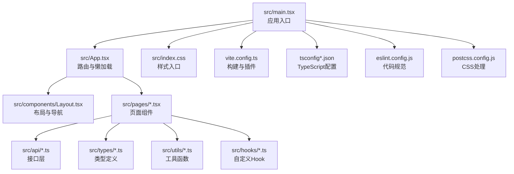
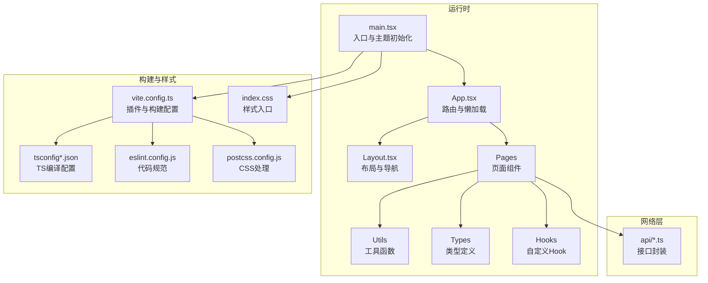
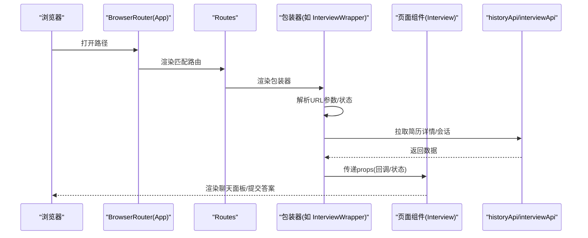
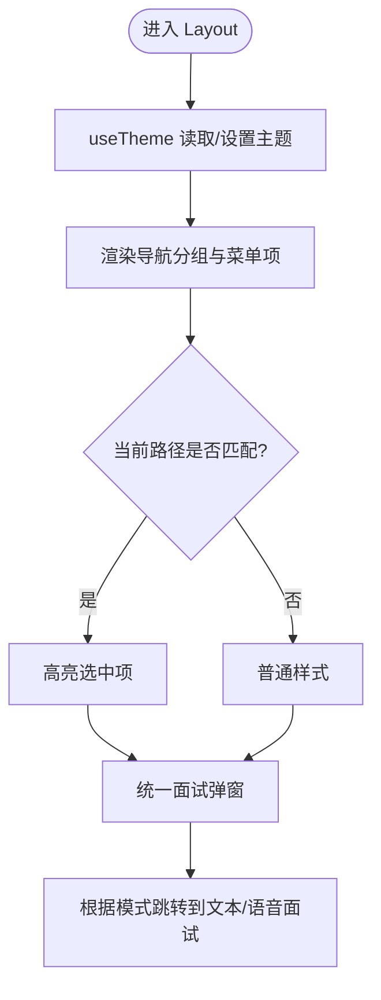
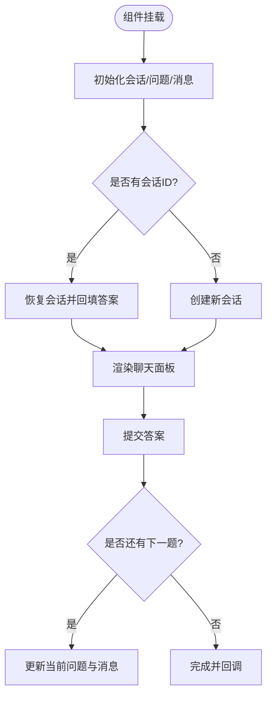
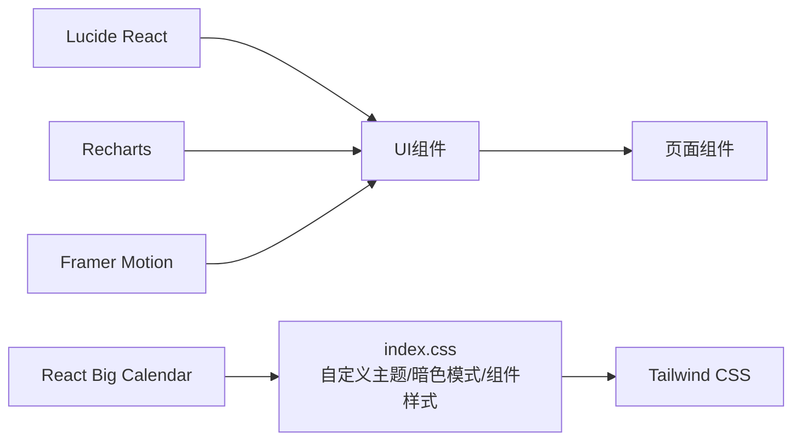
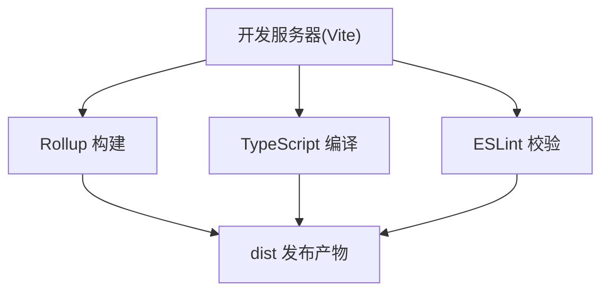
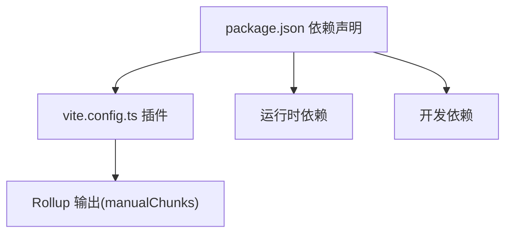

# 前端开发指南

<cite>
**本文引用的文件**
- [frontend/package.json](file://frontend/package.json)
- [frontend/vite.config.ts](file://frontend/vite.config.ts)
- [frontend/tsconfig.json](file://frontend/tsconfig.json)
- [frontend/tsconfig.app.json](file://frontend/tsconfig.app.json)
- [frontend/eslint.config.js](file://frontend/eslint.config.js)
- [frontend/postcss.config.js](file://frontend/postcss.config.js)
- [frontend/src/main.tsx](file://frontend/src/main.tsx)
- [frontend/src/App.tsx](file://frontend/src/App.tsx)
- [frontend/src/constants/routes.ts](file://frontend/src/constants/routes.ts)
- [frontend/src/components/Layout.tsx](file://frontend/src/components/Layout.tsx)
- [frontend/src/hooks/useTheme.ts](file://frontend/src/hooks/useTheme.ts)
- [frontend/src/index.css](file://frontend/src/index.css)
- [frontend/src/pages/InterviewPage.tsx](file://frontend/src/pages/InterviewPage.tsx)
- [frontend/src/api/history.ts](file://frontend/src/api/history.ts)
- [frontend/src/types/interview.ts](file://frontend/src/types/interview.ts)
- [frontend/src/utils/date.ts](file://frontend/src/utils/date.ts)
- [frontend/src/utils/score.ts](file://frontend/src/utils/score.ts)
</cite>

## 目录
1. [简介](#简介)
2. [项目结构](#项目结构)
3. [核心组件](#核心组件)
4. [架构总览](#架构总览)
5. [详细组件分析](#详细组件分析)
6. [依赖关系分析](#依赖关系分析)
7. [性能考虑](#性能考虑)
8. [故障排查指南](#故障排查指南)
9. [结论](#结论)
10. [附录](#附录)

## 简介
本指南面向面试指南平台前端团队，系统讲解基于 React 18 + TypeScript + Vite 的开发环境搭建与配置，涵盖组件架构设计、状态管理、路由配置、UI 组件库与样式体系、开发工具链、组件与样式规范以及性能优化与调试方法。目标是帮助开发者快速上手并高质量交付功能。

## 项目结构
前端位于 frontend 目录，采用“按功能域分层 + 类型与工具分离”的组织方式：
- src/main.tsx：应用入口，初始化主题与渲染根组件
- src/App.tsx：路由与懒加载页面包装器
- src/components：公共布局与通用 UI 组件
- src/pages：页面级组件
- src/api：统一请求封装与业务 API 定义
- src/types：共享类型定义
- src/utils：工具函数（日期、分数等）
- src/hooks：自定义 Hook（主题等）
- 配置文件：vite.config.ts、tsconfig.*、eslint.config.js、postcss.config.js、package.json

**图示来源**
- [frontend/src/main.tsx:1-21](file://frontend/src/main.tsx#L1-L21)
- [frontend/src/App.tsx:167-229](file://frontend/src/App.tsx#L167-L229)
- [frontend/vite.config.ts:1-42](file://frontend/vite.config.ts#L1-L42)
- [frontend/tsconfig.json:1-22](file://frontend/tsconfig.json#L1-L22)
- [frontend/eslint.config.js:1-24](file://frontend/eslint.config.js#L1-L24)
- [frontend/postcss.config.js:1-7](file://frontend/postcss.config.js#L1-L7)

**章节来源**
- [frontend/src/main.tsx:1-21](file://frontend/src/main.tsx#L1-L21)
- [frontend/src/App.tsx:167-229](file://frontend/src/App.tsx#L167-L229)

## 核心组件
- 应用入口与主题初始化：在入口处读取本地存储或系统偏好，设置深色/浅色模式，避免首屏闪烁
- 路由与懒加载：使用 React Router v7 的懒加载与 Suspense，提升首屏性能
- 布局与导航：左侧导航按业务模块组织，支持主题切换与活动态高亮
- 页面组件：以 InterviewPage 为例，演示会话创建、问题恢复、答案提交与提前交卷流程
- API 层：统一请求封装与类型定义，便于维护与扩展
- 工具函数：日期格式化、分数归一化与颜色映射，保证 UI 一致性

**章节来源**
- [frontend/src/main.tsx:6-14](file://frontend/src/main.tsx#L6-L14)
- [frontend/src/App.tsx:11-33](file://frontend/src/App.tsx#L11-L33)
- [frontend/src/components/Layout.tsx:22-129](file://frontend/src/components/Layout.tsx#L22-L129)
- [frontend/src/pages/InterviewPage.tsx:35-292](file://frontend/src/pages/InterviewPage.tsx#L35-L292)
- [frontend/src/api/history.ts:90-162](file://frontend/src/api/history.ts#L90-L162)
- [frontend/src/utils/date.ts:11-58](file://frontend/src/utils/date.ts#L11-L58)
- [frontend/src/utils/score.ts:45-108](file://frontend/src/utils/score.ts#L45-L108)

## 架构总览
整体采用“页面组件驱动 + API 层解耦 + 类型约束 + 工具函数支撑”的架构，结合 Vite 的快速冷启动与热更新能力，配合 Tailwind CSS 实现可维护的样式体系。

**图示来源**
- [frontend/src/main.tsx:1-21](file://frontend/src/main.tsx#L1-L21)
- [frontend/src/App.tsx:167-229](file://frontend/src/App.tsx#L167-L229)
- [frontend/src/components/Layout.tsx:22-129](file://frontend/src/components/Layout.tsx#L22-L129)
- [frontend/vite.config.ts:1-42](file://frontend/vite.config.ts#L1-L42)
- [frontend/tsconfig.json:1-22](file://frontend/tsconfig.json#L1-L22)
- [frontend/eslint.config.js:1-24](file://frontend/eslint.config.js#L1-L24)
- [frontend/postcss.config.js:1-7](file://frontend/postcss.config.js#L1-L7)
- [frontend/src/index.css:1-270](file://frontend/src/index.css#L1-L270)

## 详细组件分析

### 路由与页面包装器
- 使用 React Router v7 的懒加载与 Suspense，减少初始包体
- 包装器负责参数解析、状态传递、导航跳转与错误兜底
- 支持多入口（简历详情、会话 ID 恢复、语音面试参数注入）

**图示来源**
- [frontend/src/App.tsx:167-229](file://frontend/src/App.tsx#L167-L229)
- [frontend/src/App.tsx:99-165](file://frontend/src/App.tsx#L99-L165)
- [frontend/src/api/history.ts:90-162](file://frontend/src/api/history.ts#L90-L162)

**章节来源**
- [frontend/src/App.tsx:11-33](file://frontend/src/App.tsx#L11-L33)
- [frontend/src/App.tsx:99-165](file://frontend/src/App.tsx#L99-L165)
- [frontend/src/App.tsx:231-321](file://frontend/src/App.tsx#L231-L321)
- [frontend/src/constants/routes.ts:1-6](file://frontend/src/constants/routes.ts#L1-L6)

### 布局与导航
- 左侧导航按业务模块分组，支持活动态高亮与描述提示
- 主题切换通过自定义 Hook 管理，持久化到 localStorage
- 统一面试弹窗作为跨页面入口，支持文本/语音两种模式

**图示来源**
- [frontend/src/components/Layout.tsx:22-129](file://frontend/src/components/Layout.tsx#L22-L129)
- [frontend/src/hooks/useTheme.ts:5-36](file://frontend/src/hooks/useTheme.ts#L5-L36)

**章节来源**
- [frontend/src/components/Layout.tsx:22-129](file://frontend/src/components/Layout.tsx#L22-L129)
- [frontend/src/hooks/useTheme.ts:5-36](file://frontend/src/hooks/useTheme.ts#L5-L36)

### 状态管理与组件通信
- 页面内状态：InterviewPage 使用 useState/ useEffect 管理会话、问题、消息与提交流程
- 跨页面状态：通过 React Router 的 state 传递参数（如 resumeId、interviewConfig、sessionIdToResume）
- 全局状态：当前项目未引入集中式状态库，建议后续对共享主题、用户偏好、筛选条件等进行集中管理（例如使用 Context 或 Zustand）

**图示来源**
- [frontend/src/pages/InterviewPage.tsx:61-147](file://frontend/src/pages/InterviewPage.tsx#L61-L147)
- [frontend/src/pages/InterviewPage.tsx:149-202](file://frontend/src/pages/InterviewPage.tsx#L149-L202)

**章节来源**
- [frontend/src/pages/InterviewPage.tsx:35-292](file://frontend/src/pages/InterviewPage.tsx#L35-L292)

### UI 组件库与样式体系
- Tailwind CSS：通过 PostCSS 插件与自定义主题变量实现响应式与暗色模式
- Lucide React：图标库，用于导航与操作按钮
- Recharts：图表库，用于雷达图等可视化
- Framer Motion：动画库，用于页面切换与交互反馈
- React Big Calendar：日程管理组件，配套自定义样式覆盖

**图示来源**
- [frontend/src/index.css:1-270](file://frontend/src/index.css#L1-L270)
- [frontend/package.json:11-27](file://frontend/package.json#L11-L27)

**章节来源**
- [frontend/src/index.css:1-270](file://frontend/src/index.css#L1-L270)
- [frontend/package.json:11-27](file://frontend/package.json#L11-L27)

### 开发工具链
- Vite：快速冷启动、热更新、WASM 与顶层 await 插件支持
- TypeScript：严格类型检查与 bundler 模式，确保类型安全
- ESLint：推荐规则集与 React Hooks 规则，结合 Prettier 保持一致风格
- PostCSS：自动前缀与 Tailwind 集成

**图示来源**
- [frontend/vite.config.ts:1-42](file://frontend/vite.config.ts#L1-L42)
- [frontend/tsconfig.json:1-22](file://frontend/tsconfig.json#L1-L22)
- [frontend/eslint.config.js:1-24](file://frontend/eslint.config.js#L1-L24)

**章节来源**
- [frontend/vite.config.ts:1-42](file://frontend/vite.config.ts#L1-L42)
- [frontend/tsconfig.json:1-22](file://frontend/tsconfig.json#L1-L22)
- [frontend/tsconfig.app.json:1-29](file://frontend/tsconfig.app.json#L1-L29)
- [frontend/eslint.config.js:1-24](file://frontend/eslint.config.js#L1-L24)
- [frontend/postcss.config.js:1-7](file://frontend/postcss.config.js#L1-L7)

## 依赖关系分析
- 构建与打包：Vite 插件链路（React、WASM、顶层 await），Rollup 分包策略
- 运行时依赖：React 生态、UI 组件库、HTTP 客户端、日期工具、Markdown 渲染等
- 开发依赖：TypeScript、Vite、ESLint、Tailwind、PostCSS 等

**图示来源**
- [frontend/package.json:11-44](file://frontend/package.json#L11-L44)
- [frontend/vite.config.ts:13-23](file://frontend/vite.config.ts#L13-L23)

**章节来源**
- [frontend/package.json:11-44](file://frontend/package.json#L11-L44)
- [frontend/vite.config.ts:13-23](file://frontend/vite.config.ts#L13-L23)

## 性能考虑
- 代码分割：通过 Vite 的 manualChunks 将 React 生态、UI 组件与语法高亮拆分为独立 chunk，提升缓存命中率
- 懒加载：路由级懒加载与 Suspense，降低首屏体积
- 依赖优化：关闭不必要的依赖预优化，避免第三方库重复打包
- 样式体积：按需引入 Tailwind 指令与组件层样式，避免全量引入
- 动画与图表：按需渲染，避免在大量数据场景下造成卡顿

**章节来源**
- [frontend/vite.config.ts:13-23](file://frontend/vite.config.ts#L13-L23)
- [frontend/src/App.tsx:11-33](file://frontend/src/App.tsx#L11-L33)

## 故障排查指南
- 路由跳转异常：检查包装器中的参数解析与状态传递逻辑，确认路径与参数是否正确
- 主题切换无效：确认 useTheme 的副作用是否执行，localStorage 是否写入成功
- 样式不生效：检查 index.css 中的 @plugin 与自定义主题变量是否正确加载
- ESLint 报错：遵循推荐规则，必要时在局部禁用规则并添加注释说明
- 构建报错：核对 tsconfig 的 bundler 模式与 strict 设置，确保类型无误

**章节来源**
- [frontend/src/hooks/useTheme.ts:5-36](file://frontend/src/hooks/useTheme.ts#L5-L36)
- [frontend/src/index.css:1-270](file://frontend/src/index.css#L1-L270)
- [frontend/eslint.config.js:1-24](file://frontend/eslint.config.js#L1-L24)
- [frontend/tsconfig.json:1-22](file://frontend/tsconfig.json#L1-L22)

## 结论
本指南提供了从环境搭建到组件架构、状态管理、路由与样式体系、工具链配置、性能优化与故障排查的完整实践路径。建议在现有基础上逐步引入集中式状态管理、组件测试与自动化校验，持续提升可维护性与开发效率。

## 附录
- 组件开发规范
  - 命名：组件文件使用 PascalCase，导出默认组件；常量与工具函数使用 camelCase
  - 结构：单文件组件内按“类型 → Props → 状态 → 效果 → 渲染”顺序组织
  - 样式：优先使用 Tailwind 工具类，必要时在 index.css 中补充组件层样式
- 样式编写规范
  - 深色模式：使用 class 策略，通过 dark 伪变体统一适配
  - 主题变量：在 @theme 中集中定义，避免硬编码颜色
  - 可访问性：为交互元素提供明确的焦点与对比度
- 代码组织原则
  - 页面组件聚焦业务流程，通用 UI 放入 components
  - 类型定义集中在 types，避免在组件内重复声明
  - 工具函数独立于组件，便于复用与测试