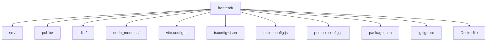
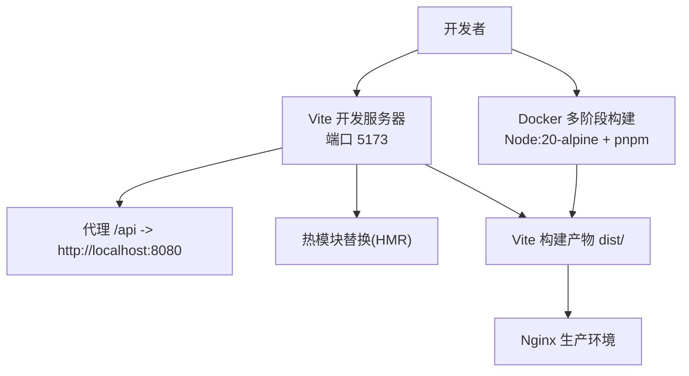
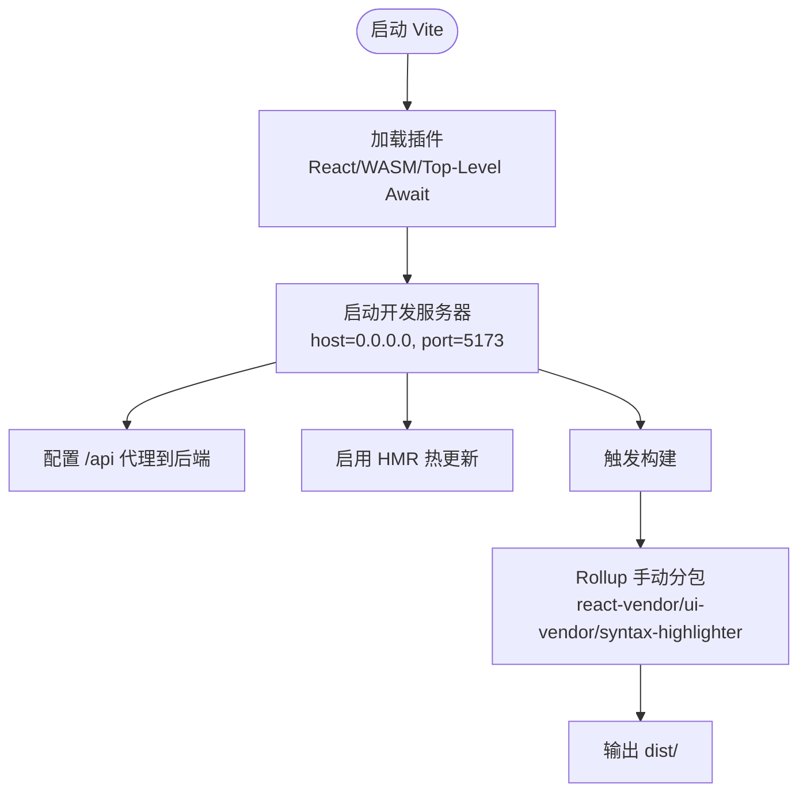
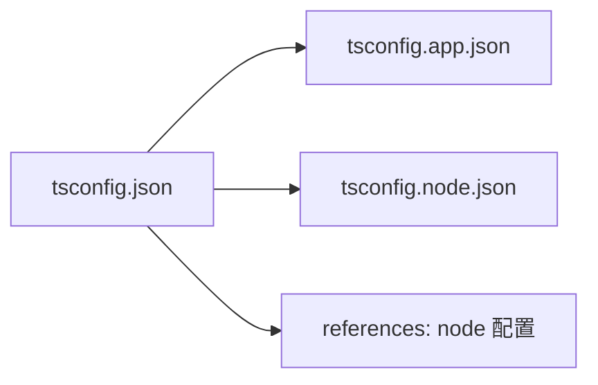
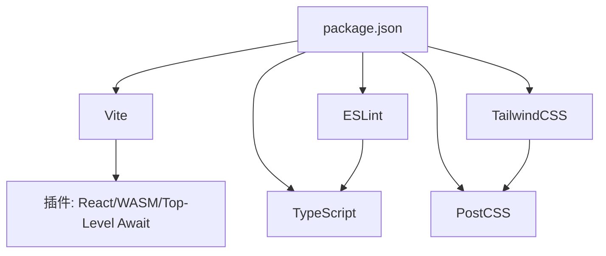

# 开发环境搭建

<cite>
**本文引用的文件**
- [frontend/package.json](file://frontend/package.json)
- [frontend/vite.config.ts](file://frontend/vite.config.ts)
- [frontend/tsconfig.json](file://frontend/tsconfig.json)
- [frontend/tsconfig.app.json](file://frontend/tsconfig.app.json)
- [frontend/tsconfig.node.json](file://frontend/tsconfig.node.json)
- [frontend/eslint.config.js](file://frontend/eslint.config.js)
- [frontend/postcss.config.js](file://frontend/postcss.config.js)
- [frontend/README.md](file://frontend/README.md)
- [frontend/Dockerfile](file://frontend/Dockerfile)
- [frontend/.gitignore](file://frontend/.gitignore)
</cite>

## 目录
1. [简介](#简介)
2. [项目结构](#项目结构)
3. [核心组件](#核心组件)
4. [架构总览](#架构总览)
5. [详细组件分析](#详细组件分析)
6. [依赖分析](#依赖分析)
7. [性能考虑](#性能考虑)
8. [故障排查指南](#故障排查指南)
9. [结论](#结论)
10. [附录](#附录)

## 简介
本指南面向面试指南平台前端团队与贡献者，系统性讲解开发环境搭建流程，覆盖以下主题：
- Node.js 版本与包管理器选择（npm/pnpm/yarn）及安装
- Vite 构建工具的配置与优化（开发服务器、热更新、代理、分包策略、sourcemap 忽略等）
- TypeScript 多配置文件体系（根 tsconfig、app、node）与编译选项、严格模式
- ESLint 配置与 IDE 集成建议
- Git 钩子与 pre-commit 检查（概念性指导）
- 开发工具推荐（VS Code 插件、浏览器扩展）
- 常见环境问题排查与解决方案

## 项目结构
前端工程位于仓库的 frontend 目录，采用 React + TypeScript + Vite 技术栈，配合 TailwindCSS、PostCSS、ESLint 等生态工具。

图表来源
- [frontend/package.json:1-47](file://frontend/package.json#L1-L47)
- [frontend/vite.config.ts:1-42](file://frontend/vite.config.ts#L1-L42)
- [frontend/tsconfig.json:1-22](file://frontend/tsconfig.json#L1-L22)
- [frontend/tsconfig.app.json:1-29](file://frontend/tsconfig.app.json#L1-L29)
- [frontend/tsconfig.node.json:1-11](file://frontend/tsconfig.node.json#L1-L11)
- [frontend/eslint.config.js:1-24](file://frontend/eslint.config.js#L1-L24)
- [frontend/postcss.config.js:1-7](file://frontend/postcss.config.js#L1-L7)
- [frontend/Dockerfile:1-44](file://frontend/Dockerfile#L1-L44)
- [frontend/.gitignore:1-25](file://frontend/.gitignore#L1-L25)

章节来源
- [frontend/package.json:1-47](file://frontend/package.json#L1-L47)
- [frontend/vite.config.ts:1-42](file://frontend/vite.config.ts#L1-L42)
- [frontend/tsconfig.json:1-22](file://frontend/tsconfig.json#L1-L22)
- [frontend/tsconfig.app.json:1-29](file://frontend/tsconfig.app.json#L1-L29)
- [frontend/tsconfig.node.json:1-11](file://frontend/tsconfig.node.json#L1-L11)
- [frontend/eslint.config.js:1-24](file://frontend/eslint.config.js#L1-L24)
- [frontend/postcss.config.js:1-7](file://frontend/postcss.config.js#L1-L7)
- [frontend/Dockerfile:1-44](file://frontend/Dockerfile#L1-L44)
- [frontend/.gitignore:1-25](file://frontend/.gitignore#L1-L25)

## 核心组件
- 包管理与脚本
  - 使用 pnpm 作为默认包管理器，脚本包含 dev/build/preview。
- 构建工具
  - Vite 提供开发服务器、HMR、代理、WASM 支持与顶层 await 优化。
- 类型系统
  - 多 tsconfig 文件协同：根配置、应用配置、Node 工具链配置。
- 代码质量
  - ESLint 平台化配置，结合 TS 推荐规则与 React Refresh。
- 样式管线
  - PostCSS + TailwindCSS 插件链。
- 容器化
  - Docker 多阶段构建，基于 Node:20-alpine，使用 pnpm 进行安装与构建。

章节来源
- [frontend/package.json:6-10](file://frontend/package.json#L6-L10)
- [frontend/package.json:45-46](file://frontend/package.json#L45-L46)
- [frontend/vite.config.ts:1-42](file://frontend/vite.config.ts#L1-L42)
- [frontend/tsconfig.json:1-22](file://frontend/tsconfig.json#L1-L22)
- [frontend/tsconfig.app.json:1-29](file://frontend/tsconfig.app.json#L1-L29)
- [frontend/tsconfig.node.json:1-11](file://frontend/tsconfig.node.json#L1-L11)
- [frontend/eslint.config.js:1-24](file://frontend/eslint.config.js#L1-L24)
- [frontend/postcss.config.js:1-7](file://frontend/postcss.config.js#L1-L7)
- [frontend/Dockerfile:5-22](file://frontend/Dockerfile#L5-L22)

## 架构总览
下图展示本地开发到容器部署的关键路径：本地通过 Vite 启动开发服务器，请求经由代理转发至后端；构建产物由 Vite 产出，Docker 多阶段构建最终以 Nginx 托管。

图表来源
- [frontend/vite.config.ts:24-37](file://frontend/vite.config.ts#L24-L37)
- [frontend/Dockerfile:5-44](file://frontend/Dockerfile#L5-L44)

章节来源
- [frontend/vite.config.ts:24-37](file://frontend/vite.config.ts#L24-L37)
- [frontend/Dockerfile:5-44](file://frontend/Dockerfile#L5-L44)

## 详细组件分析

### Node.js 与包管理器
- Node.js 版本
  - Docker 构建镜像使用 node:20-alpine，建议本地也使用 Node.js 20.x LTS 以保证一致性。
- 包管理器选择
  - 默认使用 pnpm（由 package.json 中的 packageManager 字段声明），具备更快安装、磁盘占用小、语义化版本控制等优势。
  - 如需使用 npm 或 yarn，可按各自生态的安装与初始化流程进行，但需注意与现有 lockfile 的兼容性。
- 安装步骤（建议）
  - 安装 Node.js 20.x。
  - 全局安装 pnpm：npm install -g pnpm。
  - 在 frontend 目录执行 pnpm install 安装依赖。

章节来源
- [frontend/package.json:45-46](file://frontend/package.json#L45-L46)
- [frontend/Dockerfile:5](file://frontend/Dockerfile#L5)
- [frontend/Dockerfile:17](file://frontend/Dockerfile#L17)

### Vite 配置与优化
- 插件与能力
  - React 插件、WASM 插件、顶层 await 插件，满足现代前端开发需求。
- 开发服务器
  - host 绑定为 0.0.0.0，便于容器或局域网访问。
  - 端口 5173，避免与后端冲突。
  - 代理 /api 到后端服务地址，便于联调。
- 分包策略
  - 通过 Rollup manualChunks 将 React 生态、UI 组件库、语法高亮等拆分为独立 chunk，提升缓存命中率。
- Sourcemap 优化
  - 对特定第三方库的 sourcemap 进行忽略，减少控制台噪音。
- 依赖预优化
  - optimizeDeps 留空，避免对特殊依赖（如 vad-web）进行不必要的预优化。

图表来源
- [frontend/vite.config.ts:7-41](file://frontend/vite.config.ts#L7-L41)

章节来源
- [frontend/vite.config.ts:7-41](file://frontend/vite.config.ts#L7-L41)

### TypeScript 配置体系
- 根 tsconfig.json
  - 目标 ES2020、模块 ESNext、严格模式开启、跳过库检查、Bundler 模式解析、JSX 使用 react-jsx 等。
- 应用 tsconfig.app.json
  - 面向应用层的额外严格规则（如 unused locals/params、switch exhaustiveness 等），并启用 erasableSyntaxOnly、noUncheckedSideEffectImports 等。
- Node 工具链 tsconfig.node.json
  - 面向 Vite 等工具链的配置，包含复合构建、Bundler 解析、vite/client 类型等。
- 引用关系
  - 根 tsconfig 通过 references 引用 node 配置，确保工具链与应用层类型检查一致。

图表来源
- [frontend/tsconfig.json:19-21](file://frontend/tsconfig.json#L19-L21)
- [frontend/tsconfig.app.json:27](file://frontend/tsconfig.app.json#L27)
- [frontend/tsconfig.node.json:9](file://frontend/tsconfig.node.json#L9)

章节来源
- [frontend/tsconfig.json:1-22](file://frontend/tsconfig.json#L1-L22)
- [frontend/tsconfig.app.json:1-29](file://frontend/tsconfig.app.json#L1-L29)
- [frontend/tsconfig.node.json:1-11](file://frontend/tsconfig.node.json#L1-L11)

### ESLint 与 Prettier 配置
- ESLint 平台化配置
  - 使用 eslint.config.js，启用 JS 推荐规则、TS 推荐规则、React Hooks 推荐规则、React Refresh 规则，并限定语言版本与浏览器全局。
- 类型感知与严格规则
  - README 提示可通过 tseslint 的类型感知配置（如 recommendedTypeChecked、strictTypeChecked、stylisticTypeChecked）进一步强化规则集。
- Prettier
  - 当前仓库未包含 Prettier 配置文件。若引入 Prettier，建议与 ESLint 配合，使用 eslint-config-prettier 关闭 ESLint 中与格式化重复的规则，并通过 husky + lint-staged 在 pre-commit 自动格式化与检查。

章节来源
- [frontend/eslint.config.js:1-24](file://frontend/eslint.config.js#L1-L24)
- [frontend/README.md:14-74](file://frontend/README.md#L14-L74)

### PostCSS 与 TailwindCSS
- PostCSS 配置
  - 启用 @tailwindcss/postcss 与 autoprefixer，确保 CSS 自动补全与 Tailwind 指令生效。
- 样式最佳实践
  - 在 src/index.css 中集中引入 Tailwind 指令，避免重复导入。

章节来源
- [frontend/postcss.config.js:1-7](file://frontend/postcss.config.js#L1-L7)

### Git 钩子与 pre-commit 检查（概念性指导）
- 推荐工具
  - husky（添加 Git 钩子）、lint-staged（仅对暂存文件运行 linter/formatter）。
- 建议流程
  - pre-commit：运行 ESLint（可选 Prettier）与 TypeScript 类型检查，失败则阻止提交。
  - 提交后：CI 流水线中再次执行完整检查与构建。

[本节为通用实践指导，不直接分析具体文件，故无“章节来源”]

### 开发工具推荐
- VS Code 插件
  - ESLint、Prettier、Tailwind CSS IntelliSense、TypeScript Importer、Bracket Pair Colorizer。
- 浏览器扩展
  - React Developer Tools、Redux DevTools（如使用 Redux）。
- 其他
  - 使用 Node.js 20.x LTS、pnpm 作为包管理器，确保与 Docker 构建一致。

[本节为通用实践指导，不直接分析具体文件，故无“章节来源”]

## 依赖分析
- 运行时依赖
  - React 生态、UI 组件库、路由、Markdown 渲染、音频/视频处理、ONNX Runtime Web 等。
- 开发时依赖
  - Vite、React 插件、WASM/顶层 await 插件、TypeScript、TailwindCSS、PostCSS、ESLint 及相关插件。
- 依赖关系与耦合
  - Vite 与 React 插件强耦合；WASM/顶层 await 插件与构建优化相关；TailwindCSS/PostCSS 形成样式管线；ESLint 与 TS 配置形成类型感知规则集。

图表来源
- [frontend/package.json:11-44](file://frontend/package.json#L11-L44)
- [frontend/vite.config.ts:8-12](file://frontend/vite.config.ts#L8-L12)
- [frontend/postcss.config.js:1-7](file://frontend/postcss.config.js#L1-L7)
- [frontend/eslint.config.js:1-24](file://frontend/eslint.config.js#L1-L24)

章节来源
- [frontend/package.json:11-44](file://frontend/package.json#L11-L44)
- [frontend/vite.config.ts:8-12](file://frontend/vite.config.ts#L8-L12)
- [frontend/postcss.config.js:1-7](file://frontend/postcss.config.js#L1-L7)
- [frontend/eslint.config.js:1-24](file://frontend/eslint.config.js#L1-L24)

## 性能考虑
- 分包与缓存
  - 通过 manualChunks 将常用库拆分，提升浏览器缓存命中率。
- 依赖预优化
  - 保留 optimizeDeps 空置，避免对特殊依赖的预优化造成副作用。
- Sourcemap
  - 对特定第三方库忽略 sourcemap，降低调试噪音。
- 构建与打包
  - 使用 Vite 的原生打包能力，结合多配置 TS 以获得更准确的类型检查与更快的增量编译。

章节来源
- [frontend/vite.config.ts:13-41](file://frontend/vite.config.ts#L13-L41)
- [frontend/tsconfig.app.json:20-25](file://frontend/tsconfig.app.json#L20-L25)

## 故障排查指南
- 依赖安装失败
  - 确认 Node.js 版本为 20.x；使用 pnpm install；若存在网络问题，可配置镜像源或使用 pnpm 的 registry。
- 开发服务器无法访问
  - 检查 host 与端口是否被占用；确认防火墙放行；如需外网访问，确保 host 设置为 0.0.0.0。
- 代理无效或跨域
  - 核对 /api 代理配置与后端地址；确认 changeOrigin 与目标端口正确。
- sourcemap 警告过多
  - 使用 sourcemapIgnoreList 忽略特定第三方库的 sourcemap。
- 构建产物异常
  - 清理 node_modules 与 dist 后重装依赖并重新构建；核对 tsconfig 与 vite 配置。
- Docker 构建失败
  - 确保 pnpm-lock.yaml 与 package.json 一致；检查 COPY 顺序与权限；确认 Nginx 配置正确。

章节来源
- [frontend/vite.config.ts:24-37](file://frontend/vite.config.ts#L24-L37)
- [frontend/Dockerfile:11-22](file://frontend/Dockerfile#L11-L22)
- [frontend/.gitignore:10-12](file://frontend/.gitignore#L10-L12)

## 结论
本指南提供了从 Node.js 与包管理器、Vite 配置、TypeScript 多配置体系、ESLint/Prettier 到 Git 钩子与容器化的完整开发环境搭建路径。遵循上述配置与最佳实践，可获得稳定、高性能且易于维护的前端开发体验。

## 附录
- 常用命令
  - 安装依赖：pnpm install
  - 启动开发：pnpm dev
  - 预览生产：pnpm preview
  - 构建生产：pnpm build
- Docker
  - 多阶段构建：基于 Node:20-alpine，使用 pnpm 安装并构建，最终由 Nginx 托管。

章节来源
- [frontend/package.json:6-10](file://frontend/package.json#L6-L10)
- [frontend/Dockerfile:5-44](file://frontend/Dockerfile#L5-L44)