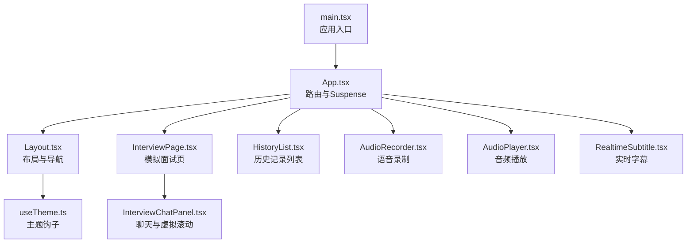
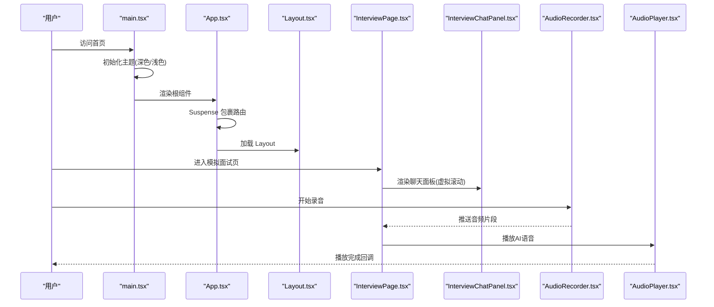
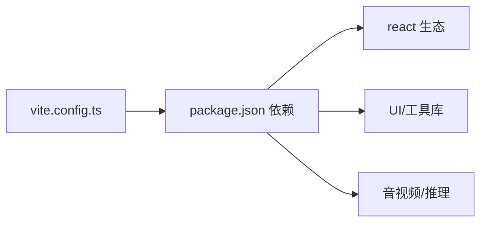

# 性能优化和最佳实践

<cite>
**本文引用的文件**
- [vite.config.ts](file://frontend/vite.config.ts)
- [package.json](file://frontend/package.json)
- [eslint.config.js](file://frontend/eslint.config.js)
- [tsconfig.json](file://frontend/tsconfig.json)
- [main.tsx](file://frontend/src/main.tsx)
- [App.tsx](file://frontend/src/App.tsx)
- [Layout.tsx](file://frontend/src/components/Layout.tsx)
- [InterviewPage.tsx](file://frontend/src/pages/InterviewPage.tsx)
- [InterviewChatPanel.tsx](file://frontend/src/components/InterviewChatPanel.tsx)
- [HistoryList.tsx](file://frontend/src/components/HistoryList.tsx)
- [AudioRecorder.tsx](file://frontend/src/components/AudioRecorder.tsx)
- [AudioPlayer.tsx](file://frontend/src/components/AudioPlayer.tsx)
- [RealtimeSubtitle.tsx](file://frontend/src/components/RealtimeSubtitle.tsx)
- [useTheme.ts](file://frontend/src/hooks/useTheme.ts)
</cite>

## 目录
1. [简介](#简介)
2. [项目结构](#项目结构)
3. [核心组件](#核心组件)
4. [架构总览](#架构总览)
5. [详细组件分析](#详细组件分析)
6. [依赖关系分析](#依赖关系分析)
7. [性能考量](#性能考量)
8. [故障排查指南](#故障排查指南)
9. [结论](#结论)
10. [附录](#附录)

## 简介
本指南面向面试指南平台前端，聚焦于构建与运行时性能优化、React 应用性能提升、内存与垃圾回收最佳实践、Web Vitals 监控与优化、Bundle 分析与体积优化、缓存策略（浏览器缓存、CDN、Service Worker）、移动端性能、性能监控与调试工具，以及代码质量保障（TypeScript 类型检查、ESLint 规则）。文档结合仓库现有配置与实现进行深入分析，并提供可落地的改进建议。

## 项目结构
前端位于 frontend 目录，采用 Vite + React + TypeScript 技术栈，配合 TailwindCSS 与若干第三方库（如 Framer Motion、Lucide React、react-virtuoso、onnxruntime-web 等）。路由采用 React Router，组件按功能模块拆分，页面组件通过 React.lazy 实现按需加载。

图表来源
- [main.tsx:1-21](file://frontend/src/main.tsx#L1-L21)
- [App.tsx:1-379](file://frontend/src/App.tsx#L1-L379)
- [Layout.tsx:1-257](file://frontend/src/components/Layout.tsx#L1-L257)
- [InterviewPage.tsx:1-292](file://frontend/src/pages/InterviewPage.tsx#L1-L292)
- [InterviewChatPanel.tsx:1-151](file://frontend/src/components/InterviewChatPanel.tsx#L1-L151)
- [HistoryList.tsx:1-452](file://frontend/src/components/HistoryList.tsx#L1-L452)
- [AudioRecorder.tsx:1-257](file://frontend/src/components/AudioRecorder.tsx#L1-L257)
- [AudioPlayer.tsx:1-125](file://frontend/src/components/AudioPlayer.tsx#L1-L125)
- [RealtimeSubtitle.tsx:1-151](file://frontend/src/components/RealtimeSubtitle.tsx#L1-L151)
- [useTheme.ts:1-37](file://frontend/src/hooks/useTheme.ts#L1-L37)

章节来源
- [main.tsx:1-21](file://frontend/src/main.tsx#L1-L21)
- [App.tsx:1-379](file://frontend/src/App.tsx#L1-L379)
- [Layout.tsx:1-257](file://frontend/src/components/Layout.tsx#L1-L257)

## 核心组件
- 构建与打包：Vite 配置启用插件、手动分包、代理与 sourcemap 忽略策略，为后续 Tree Shaking、压缩与体积优化奠定基础。
- 路由与懒加载：App 中对多个页面组件使用 React.lazy 与 Suspense，减少首屏 JS 体积与初始渲染压力。
- 渲染性能：InterviewChatPanel 使用 react-virtuoso 实现虚拟滚动，避免长列表全量渲染；Layout 使用 Framer Motion 做轻量动画。
- 媒体与音视频：AudioRecorder 与 AudioPlayer 分别负责录音与播放，涉及 Web Audio API、VAD、ONNX Runtime 等资源，需关注初始化与释放。
- 主题与深色模式：useTheme 与 main.tsx 中的主题初始化逻辑，避免 FOUC（Flash of Unstyled Content）。

章节来源
- [vite.config.ts:1-42](file://frontend/vite.config.ts#L1-L42)
- [App.tsx:11-33](file://frontend/src/App.tsx#L11-L33)
- [InterviewChatPanel.tsx:1-151](file://frontend/src/components/InterviewChatPanel.tsx#L1-L151)
- [AudioRecorder.tsx:1-257](file://frontend/src/components/AudioRecorder.tsx#L1-L257)
- [AudioPlayer.tsx:1-125](file://frontend/src/components/AudioPlayer.tsx#L1-L125)
- [useTheme.ts:1-37](file://frontend/src/hooks/useTheme.ts#L1-L37)
- [main.tsx:6-14](file://frontend/src/main.tsx#L6-L14)

## 架构总览
下图展示了前端启动、路由与懒加载、媒体处理与渲染的关键交互路径。

图表来源
- [main.tsx:6-14](file://frontend/src/main.tsx#L6-L14)
- [App.tsx:167-229](file://frontend/src/App.tsx#L167-L229)
- [Layout.tsx:22-256](file://frontend/src/components/Layout.tsx#L22-L256)
- [InterviewPage.tsx:35-292](file://frontend/src/pages/InterviewPage.tsx#L35-L292)
- [InterviewChatPanel.tsx:31-151](file://frontend/src/components/InterviewChatPanel.tsx#L31-L151)
- [AudioRecorder.tsx:69-218](file://frontend/src/components/AudioRecorder.tsx#L69-L218)
- [AudioPlayer.tsx:14-125](file://frontend/src/components/AudioPlayer.tsx#L14-L125)

## 详细组件分析

### Vite 构建优化与策略
- 插件与依赖预优化
  - 启用 wasm、top-level-await、react 插件，满足 ONNX Runtime 与顶层 await 场景需求。
  - optimizeDeps 留空，避免对特定库（如 vad-web）重复优化。
- 手动分包（manualChunks）
  - 将 react、react-dom、react-router-dom 合并为 react-vendor；
  - 将 framer-motion、lucide-react 合并为 ui-vendor；
  - 将 react-syntax-highlighter 合并为 syntax-highlighter。
  - 该策略有助于浏览器缓存命中与并行加载，降低重复下载。
- 代理与服务端配置
  - 本地开发代理到后端 8080 端口，便于联调。
  - sourcemapIgnoreList 忽略 vad-web 的 sourcemap 警告，减少噪音。
- 建议补充
  - 在生产构建中开启压缩（terser 或 esbuild），并启用资源内联阈值控制；
  - 结合 Rollup 输出策略，为不同第三方库设置合理的拆分粒度；
  - 使用动态导入与路由级懒加载，进一步减少首屏包体。

章节来源
- [vite.config.ts:7-41](file://frontend/vite.config.ts#L7-L41)
- [package.json:29-44](file://frontend/package.json#L29-L44)

### React 应用性能优化
- 组件懒加载与 Suspense
  - App 中对 UploadPage、HistoryList、InterviewPage 等页面组件使用 lazy 与 Suspense，避免一次性加载全部页面代码，缩短首屏阻塞。
- 虚拟滚动
  - InterviewChatPanel 使用 react-virtuoso 对长消息列表进行虚拟化，仅渲染可视区域元素，显著降低 DOM 节点数量与重排重绘成本。
- 动画与过渡
  - Layout 使用 Framer Motion 做路由切换动画，建议限制动画复杂度与帧率，避免影响滚动与交互流畅性。
- 主题初始化与防闪烁
  - main.tsx 在挂载前检测系统/本地存储主题并注入 dark 类，避免首次渲染样式闪烁。

章节来源
- [App.tsx:11-33](file://frontend/src/App.tsx#L11-L33)
- [InterviewChatPanel.tsx:82-97](file://frontend/src/components/InterviewChatPanel.tsx#L82-L97)
- [Layout.tsx:231-239](file://frontend/src/components/Layout.tsx#L231-L239)
- [main.tsx:6-14](file://frontend/src/main.tsx#L6-L14)

### 内存管理与垃圾回收最佳实践
- 音频流与 VAD 生命周期
  - AudioRecorder 在启动时创建 MediaStream、AudioContext、Analyser、ScriptProcessor，并通过定时器监控音量；停止时需确保：
    - 停止 vad 实例与 MediaStreamTrack；
    - 关闭 AudioContext；
    - 清理定时器；
    - 断开所有节点连接。
  - 若未正确清理，可能导致内存泄漏与设备占用。
- 虚拟滚动与事件监听
  - 使用 react-virtuoso 时，避免在 itemContent 中创建闭包绑定的函数对象，尽量复用稳定引用，减少不必要的重渲染与闭包持有。
- 动画与定时器
  - RealtimeSubtitle 中的打字效果与自动滚动使用 useEffect 管理，离开页面时应清理定时器与滚动监听，防止后台任务继续执行。

章节来源
- [AudioRecorder.tsx:180-211](file://frontend/src/components/AudioRecorder.tsx#L180-L211)
- [AudioRecorder.tsx:103-171](file://frontend/src/components/AudioRecorder.tsx#L103-L171)
- [RealtimeSubtitle.tsx:34-58](file://frontend/src/components/RealtimeSubtitle.tsx#L34-L58)
- [RealtimeSubtitle.tsx:60-65](file://frontend/src/components/RealtimeSubtitle.tsx#L60-L65)

### Web Vitals 监控与优化
- 核心指标
  - LCP（最大内容绘制）：优化图片与字体加载、延迟非关键资源、使用占位符与骨架屏。
  - FID（首输入延迟）：减少主线程长任务、使用 Web Workers、合理拆分脚本。
  - CLS（累积布局偏移）：为图片与广告预留尺寸、避免动态插入内容导致布局抖动。
- 实践建议
  - 图片与字体：使用现代格式（AVIF/WebP）、响应式尺寸与懒加载；字体使用 font-display: swap。
  - 资源加载：启用 HTTP/2 多路复用、CDN 缓存、HTTP 压缩；对第三方脚本使用异步加载与降级方案。
  - 交互性能：将长任务拆分为微任务、使用 requestIdleCallback 或 Web Workers；减少大数组排序与深度遍历。
  - 首屏体验：使用骨架屏、关键 CSS 内联、非关键 CSS 异步加载。

（本节为通用指导，无需特定文件引用）

### Bundle 分析与体积优化
- 工具与方法
  - webpack-bundle-analyzer：在构建后可视化分析包体构成，定位超大依赖与重复模块。
  - Vite 插件：rollup-plugin-visualizer 可在开发时生成可视化报告。
  - npm-check、depcheck：识别未使用依赖与重复依赖。
- 优化策略
  - 第三方库按需引入与 Tree Shaking：确保使用支持 ES Module 的库并启用摇树。
  - 手动分包：结合 Vite manualChunks 策略，将稳定不变的依赖拆分为独立 chunk。
  - 替代方案：评估体积较大的库（如 onnxruntime-web）是否可被更小的替代品或按需加载。
  - 压缩与去重：启用 terser 或 esbuild 压缩，合并重复模块。

章节来源
- [vite.config.ts:13-23](file://frontend/vite.config.ts#L13-L23)
- [package.json:29-44](file://frontend/package.json#L29-L44)

### 缓存策略
- 浏览器缓存
  - 静态资源：为 JS/CSS/图片设置强缓存（Cache-Control: max-age=...）与版本化命名，避免缓存穿透。
  - HTML：短期缓存或 no-store，确保 SPA 路由更新。
- CDN 加速
  - 将静态资源托管至 CDN，利用就近节点与边缘缓存；对第三方库使用 CDN 直达。
- Service Worker
  - 注册 SW，实现离线缓存、网络降级、预缓存关键资源；注意版本升级与缓存失效策略。
- 配置要点
  - 对 react-vendor/ui-vendor/syntax-highlighter 等稳定依赖设置长期缓存；
  - 对动态内容（API）使用协商缓存（ETag/Last-Modified）。

（本节为通用指导，无需特定文件引用）

### 移动端性能优化
- 触摸与手势
  - 使用 touch-action 控制滚动与缩放；避免在触摸事件上执行长任务。
- 网络与电量
  - 降低图片分辨率与格式优化；在弱网环境下启用降级策略（如低码率音频）。
- 交互反馈
  - 减少动画与阴影的过度使用；使用 transform 代替改变布局属性。
- 语音与音视频
  - 录音采样率与缓冲区大小需平衡质量与性能；播放时避免频繁创建销毁 AudioContext。

章节来源
- [AudioRecorder.tsx:72-79](file://frontend/src/components/AudioRecorder.tsx#L72-L79)
- [AudioRecorder.tsx:123-151](file://frontend/src/components/AudioRecorder.tsx#L123-L151)

### 性能监控与调试
- 工具
  - Chrome DevTools Performance/Network/Lighthouse；React DevTools Profiler。
  - Web Vitals Extension；Sentry/Rollbar（可选）。
- 方法
  - 使用 Performance API 记录关键渲染阶段；对长任务进行采样与告警。
  - 监控内存峰值与 GC 频率，定位泄漏点。
  - 对第三方脚本（如 vad-web）进行资源加载耗时统计。

（本节为通用指导，无需特定文件引用）

### 代码质量保障
- TypeScript
  - 严格模式与 noUnused* 规则，减少潜在错误与冗余代码。
  - 推荐开启 isolatedModules 与 noEmit，构建时统一交给 Vite/TS 编译器。
- ESLint
  - 使用 @eslint/js、typescript-eslint、react-hooks、react-refresh 等推荐配置，保持一致风格与安全实践。
- 代码规范
  - 组件函数式化、Hook 单一职责、避免在渲染期间创建新对象/函数；使用 useMemo/useCallback 保护昂贵计算与回调。

章节来源
- [tsconfig.json:2-17](file://frontend/tsconfig.json#L2-L17)
- [eslint.config.js:8-23](file://frontend/eslint.config.js#L8-L23)

## 依赖关系分析
- 构建期依赖
  - Vite、@vitejs/plugin-react、vite-plugin-wasm、vite-plugin-top-level-await。
  - TypeScript、TailwindCSS 生态。
- 运行时依赖
  - React 生态（react、react-dom、react-router-dom）、UI 库（framer-motion、lucide-react）、语法高亮（react-syntax-highlighter）、虚拟滚动（react-virtuoso）、图表（recharts）、Markdown（react-markdown、remark-gfm）。
  - 音频与模型推理（onnxruntime-web）、日历（react-big-calendar）、日期（dayjs）、HTTP（axios）。

图表来源
- [vite.config.ts:1-42](file://frontend/vite.config.ts#L1-L42)
- [package.json:11-28](file://frontend/package.json#L11-L28)

章节来源
- [package.json:11-28](file://frontend/package.json#L11-L28)
- [vite.config.ts:1-42](file://frontend/vite.config.ts#L1-L42)

## 性能考量
- 首屏加载
  - 路由懒加载与 Suspense 显著降低首屏 JS 体积；建议对非关键页面进一步拆分。
  - 主题初始化前置，避免 FOUC。
- 交互与滚动
  - 虚拟滚动有效降低长列表渲染成本；注意 itemContent 的稳定性与不可变引用。
  - 动画与过渡应适度，避免影响滚动性能。
- 媒体与音视频
  - 录音与播放链路需严格释放资源；对 AudioContext 与 MediaStream 的生命周期进行集中管理。
- 构建与缓存
  - 手动分包策略提升缓存命中；建议结合 CDN 与长期缓存策略。
  - sourcemap 忽略第三方警告，减少开发时噪声。

章节来源
- [App.tsx:11-33](file://frontend/src/App.tsx#L11-L33)
- [InterviewChatPanel.tsx:82-97](file://frontend/src/components/InterviewChatPanel.tsx#L82-L97)
- [AudioRecorder.tsx:180-211](file://frontend/src/components/AudioRecorder.tsx#L180-L211)
- [vite.config.ts:13-23](file://frontend/vite.config.ts#L13-L23)
- [main.tsx:6-14](file://frontend/src/main.tsx#L6-L14)

## 故障排查指南
- 首屏白屏或长时间加载
  - 检查 Suspense fallback 是否合理；确认路由懒加载是否生效；观察 Network 面板的 chunk 加载顺序。
- 虚拟滚动卡顿
  - 检查 itemContent 是否创建了新的函数/对象；确认数据引用是否稳定；适当调整虚拟滚动配置。
- 录音/播放异常
  - 确认麦克风权限与浏览器策略；检查 AudioContext 是否被正确关闭；验证 vad 实例的 start/pause/destroy 调用顺序。
- 主题切换闪烁
  - 确保在应用挂载前完成主题类的注入；避免在主题切换时触发不必要的重渲染。
- ESLint/TS 报错
  - 按推荐配置修复；对未使用变量/参数进行清理；必要时放宽严格规则但保留关键检查。

章节来源
- [App.tsx:167-229](file://frontend/src/App.tsx#L167-L229)
- [InterviewChatPanel.tsx:82-97](file://frontend/src/components/InterviewChatPanel.tsx#L82-L97)
- [AudioRecorder.tsx:180-211](file://frontend/src/components/AudioRecorder.tsx#L180-L211)
- [main.tsx:6-14](file://frontend/src/main.tsx#L6-L14)
- [eslint.config.js:8-23](file://frontend/eslint.config.js#L8-L23)
- [tsconfig.json:14-17](file://frontend/tsconfig.json#L14-L17)

## 结论
本项目已在构建分包、路由懒加载、虚拟滚动与主题初始化等方面形成良好基础。建议在生产构建中完善压缩与缓存策略，结合 Bundle 分析持续优化第三方依赖体积；在媒体与动画场景加强资源生命周期管理；同时建立 Web Vitals 监控体系，持续跟踪用户体验指标，确保在多端环境下的稳定与流畅。

## 附录
- 关键实现路径参考
  - 构建配置与分包策略：[vite.config.ts:13-23](file://frontend/vite.config.ts#L13-L23)
  - 路由懒加载与 Suspense：[App.tsx:11-33](file://frontend/src/App.tsx#L11-L33)
  - 虚拟滚动实现：[InterviewChatPanel.tsx:82-97](file://frontend/src/components/InterviewChatPanel.tsx#L82-L97)
  - 音频录制与播放：[AudioRecorder.tsx:69-218](file://frontend/src/components/AudioRecorder.tsx#L69-L218)、[AudioPlayer.tsx:14-125](file://frontend/src/components/AudioPlayer.tsx#L14-L125)
  - 主题初始化与切换：[useTheme.ts:1-37](file://frontend/src/hooks/useTheme.ts#L1-L37)、[main.tsx:6-14](file://frontend/src/main.tsx#L6-L14)
  - 代码质量配置：[tsconfig.json:2-17](file://frontend/tsconfig.json#L2-L17)、[eslint.config.js:8-23](file://frontend/eslint.config.js#L8-L23)