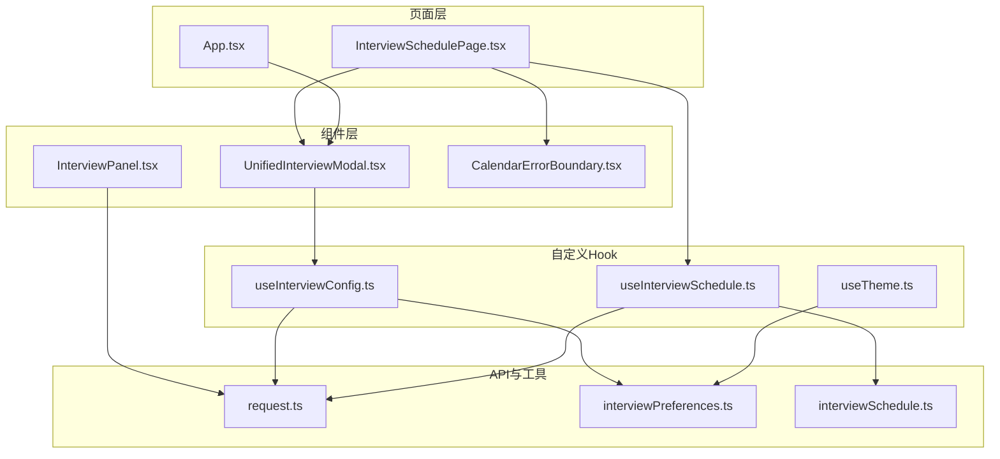
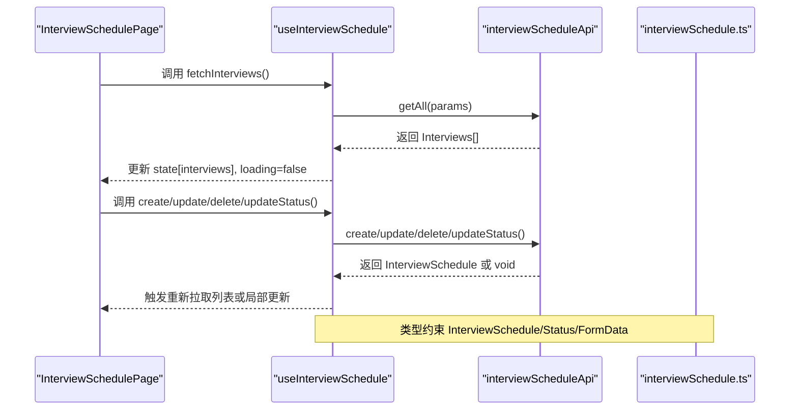
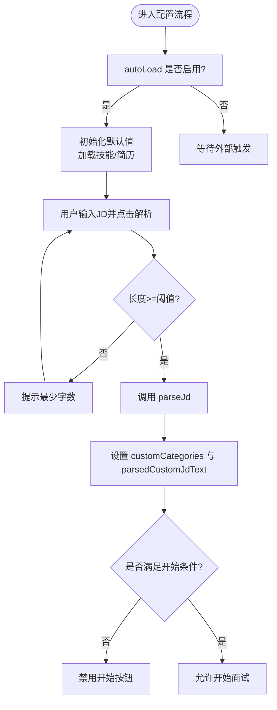
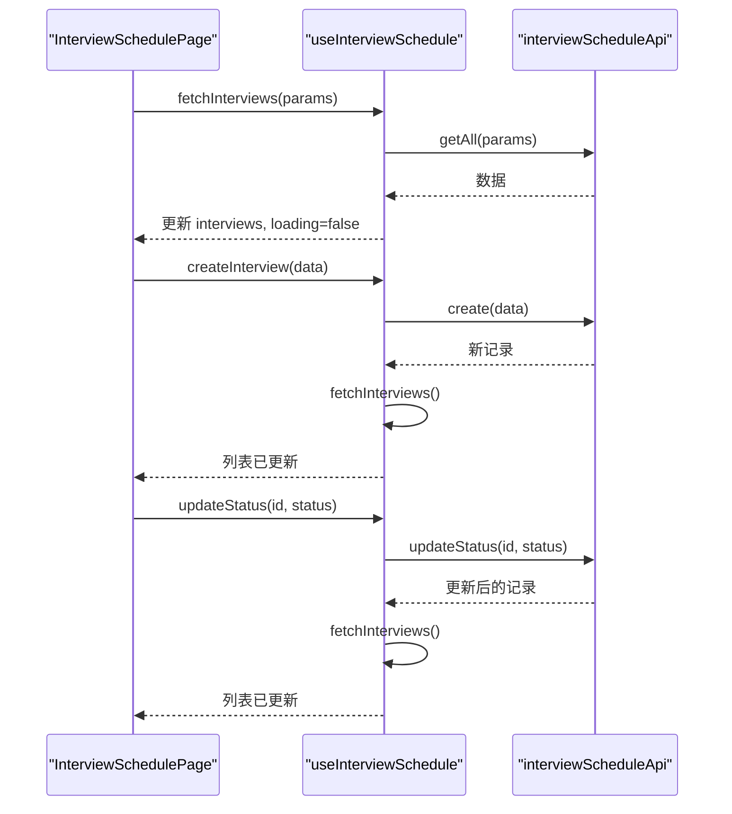
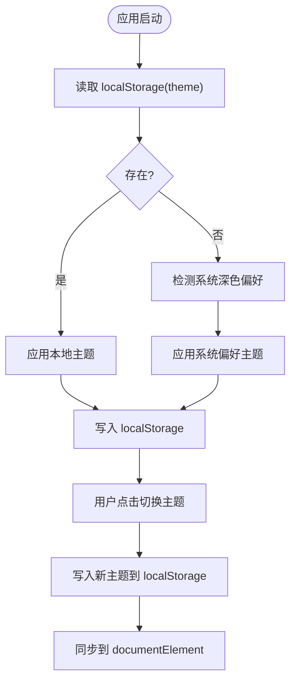
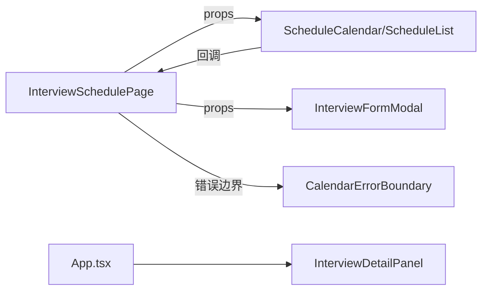
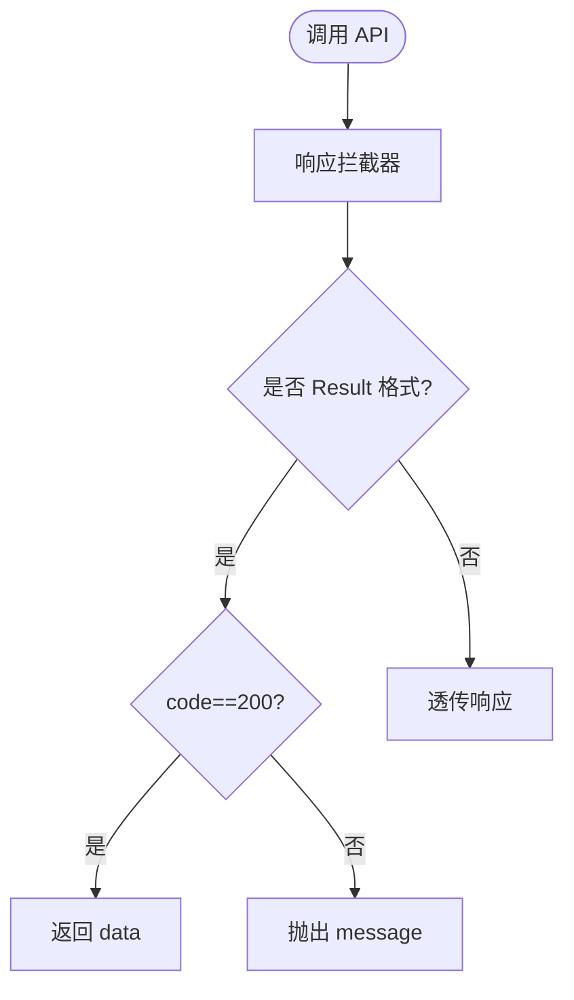
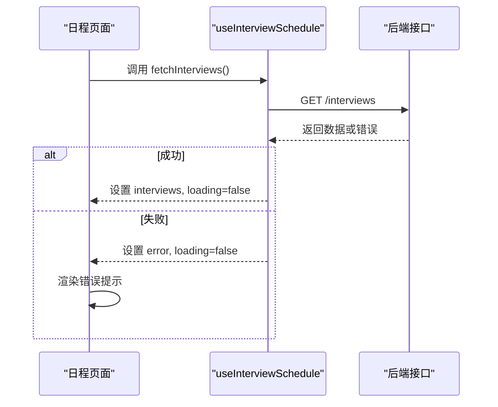
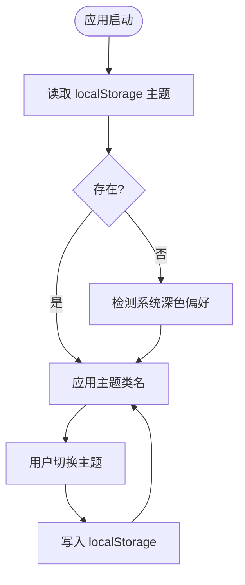
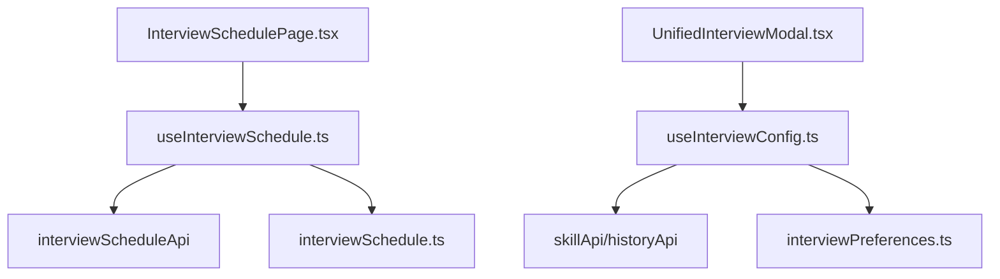

# 状态管理

<cite>
**本文引用的文件**
- [frontend/src/hooks/useInterviewConfig.ts](file://frontend/src/hooks/useInterviewConfig.ts)
- [frontend/src/hooks/useInterviewSchedule.ts](file://frontend/src/hooks/useInterviewSchedule.ts)
- [frontend/src/hooks/useTheme.ts](file://frontend/src/hooks/useTheme.ts)
- [frontend/src/utils/interviewPreferences.ts](file://frontend/src/utils/interviewPreferences.ts)
- [frontend/src/api/request.ts](file://frontend/src/api/request.ts)
- [frontend/src/pages/InterviewSchedulePage.tsx](file://frontend/src/pages/InterviewSchedulePage.tsx)
- [frontend/src/components/UnifiedInterviewModal.tsx](file://frontend/src/components/UnifiedInterviewModal.tsx)
- [frontend/src/components/InterviewPanel.tsx](file://frontend/src/components/InterviewPanel.tsx)
- [frontend/src/components/interviewschedule/CalendarErrorBoundary.tsx](file://frontend/src/components/interviewschedule/CalendarErrorBoundary.tsx)
- [frontend/src/types/interviewSchedule.ts](file://frontend/src/types/interviewSchedule.ts)
- [frontend/src/App.tsx](file://frontend/src/App.tsx)
- [frontend/src/main.tsx](file://frontend/src/main.tsx)
</cite>

## 目录
1. [引言](#引言)
2. [项目结构](#项目结构)
3. [核心组件](#核心组件)
4. [架构总览](#架构总览)
5. [详细组件分析](#详细组件分析)
6. [依赖分析](#依赖分析)
7. [性能考虑](#性能考虑)
8. [故障排查指南](#故障排查指南)
9. [结论](#结论)
10. [附录](#附录)

## 引言
本指南聚焦面试指南平台前端的状态管理实践，围绕 React Hooks 的使用场景与最佳实践展开，系统讲解 useState、useEffect、useContext、useMemo、useCallback 等 Hook 的应用；深入分析自定义 Hook 的设计与实现，如 useInterviewConfig、useInterviewSchedule；梳理组件间状态共享策略（props 传递、上下文共享、事件系统）；详解 API 调用的状态管理（加载、错误、缓存）；给出异步状态管理（Promise、错误边界、重试）与状态持久化（localStorage、sessionStorage）的实现要点，并总结性能优化技巧。

## 项目结构
前端采用模块化组织，状态管理主要集中在 hooks、components、pages、api、utils 等目录中：
- hooks：封装业务状态与副作用逻辑，如 useInterviewConfig、useInterviewSchedule、useTheme
- components：展示型组件与容器型组件，负责 UI 交互与状态消费
- pages：页面级容器，组合多个组件并协调状态
- api：统一请求封装与类型定义
- utils：工具函数与本地存储偏好设置

**图表来源**
- [frontend/src/pages/InterviewSchedulePage.tsx:1-230](file://frontend/src/pages/InterviewSchedulePage.tsx#L1-L230)
- [frontend/src/components/UnifiedInterviewModal.tsx:1-476](file://frontend/src/components/UnifiedInterviewModal.tsx#L1-L476)
- [frontend/src/components/InterviewPanel.tsx:1-295](file://frontend/src/components/InterviewPanel.tsx#L1-L295)
- [frontend/src/components/interviewschedule/CalendarErrorBoundary.tsx:1-57](file://frontend/src/components/interviewschedule/CalendarErrorBoundary.tsx#L1-L57)
- [frontend/src/hooks/useInterviewConfig.ts:1-152](file://frontend/src/hooks/useInterviewConfig.ts#L1-L152)
- [frontend/src/hooks/useInterviewSchedule.ts:1-72](file://frontend/src/hooks/useInterviewSchedule.ts#L1-L72)
- [frontend/src/hooks/useTheme.ts:1-37](file://frontend/src/hooks/useTheme.ts#L1-L37)
- [frontend/src/api/request.ts:1-128](file://frontend/src/api/request.ts#L1-L128)
- [frontend/src/utils/interviewPreferences.ts:1-51](file://frontend/src/utils/interviewPreferences.ts#L1-L51)
- [frontend/src/types/interviewSchedule.ts:1-49](file://frontend/src/types/interviewSchedule.ts#L1-L49)

**章节来源**
- [frontend/src/pages/InterviewSchedulePage.tsx:1-230](file://frontend/src/pages/InterviewSchedulePage.tsx#L1-L230)
- [frontend/src/App.tsx:1-379](file://frontend/src/App.tsx#L1-L379)

## 核心组件
本节聚焦三个关键自定义 Hook 的职责、状态结构与使用方式。

- useInterviewConfig：封装“面试配置”状态，包括模式、技能、难度、简历、LLM 提供商、题目数、计划时长、JD 解析等。提供加载技能、加载简历、解析 JD 的动作，以及派生状态（是否自定义、是否可开始等）。
- useInterviewSchedule：封装“面试日程”状态，包括列表、加载、错误；提供获取列表、创建、更新、删除、更新状态的动作；内部通过 useCallback 包装异步方法以减少重渲染。
- useTheme：封装主题状态与切换，支持从 localStorage 与系统偏好初始化，并同步到 DOM 与本地存储。

**章节来源**
- [frontend/src/hooks/useInterviewConfig.ts:1-152](file://frontend/src/hooks/useInterviewConfig.ts#L1-L152)
- [frontend/src/hooks/useInterviewSchedule.ts:1-72](file://frontend/src/hooks/useInterviewSchedule.ts#L1-L72)
- [frontend/src/hooks/useTheme.ts:1-37](file://frontend/src/hooks/useTheme.ts#L1-L37)

## 架构总览
下图展示了页面、组件与自定义 Hook 的协作关系，以及 API 层与工具层的支撑作用。

**图表来源**
- [frontend/src/pages/InterviewSchedulePage.tsx:1-230](file://frontend/src/pages/InterviewSchedulePage.tsx#L1-L230)
- [frontend/src/hooks/useInterviewSchedule.ts:1-72](file://frontend/src/hooks/useInterviewSchedule.ts#L1-L72)
- [frontend/src/types/interviewSchedule.ts:1-49](file://frontend/src/types/interviewSchedule.ts#L1-L49)

## 详细组件分析

### useInterviewConfig：面试配置状态管理
- 状态拆分：将配置项拆分为独立的 useState，便于细粒度控制与按需渲染。
- 副作用：在 autoLoad 为真时，初始化模式、简历、并异步加载技能与简历列表。
- 动作函数：
  - 加载技能：调用 skillApi.listSkills，设置 loadingSkills，finally 统一关闭。
  - 加载简历：调用 historyApi.getResumes。
  - 解析 JD：调用 skillApi.parseJd，设置 parsingJd，finally 关闭；若长度不足或解析失败，提示用户。
- 派生状态：根据 skillId、customJdText、parsedCustomJdText、parsingJd 计算 isCustomSkill、jdNeedsReparse、isCustomStartDisabled。
- 辅助：导出 DIFFICULTY_OPTIONS、DEFAULT_* 常量与图标工具。

**图表来源**
- [frontend/src/hooks/useInterviewConfig.ts:70-108](file://frontend/src/hooks/useInterviewConfig.ts#L70-L108)

**章节来源**
- [frontend/src/hooks/useInterviewConfig.ts:1-152](file://frontend/src/hooks/useInterviewConfig.ts#L1-L152)
- [frontend/src/components/UnifiedInterviewModal.tsx:1-476](file://frontend/src/components/UnifiedInterviewModal.tsx#L1-L476)

### useInterviewSchedule：日程管理状态与动作
- 状态：interviews、loading、error
- 动作：
  - fetchInterviews：带参数（status/start/end）拉取列表，统一设置 loading/error/fetch 完成后的 finally。
  - create/update/delete/updateStatus：分别调用对应 API，成功后刷新列表或局部更新。
- 优化：将 fetchInterviews 用 useCallback 包裹，避免子组件因引用变化导致重渲染。
- 生命周期：组件挂载时自动拉取一次列表。

**图表来源**
- [frontend/src/pages/InterviewSchedulePage.tsx:16-59](file://frontend/src/pages/InterviewSchedulePage.tsx#L16-L59)
- [frontend/src/hooks/useInterviewSchedule.ts:16-55](file://frontend/src/hooks/useInterviewSchedule.ts#L16-L55)

**章节来源**
- [frontend/src/hooks/useInterviewSchedule.ts:1-72](file://frontend/src/hooks/useInterviewSchedule.ts#L1-L72)
- [frontend/src/pages/InterviewSchedulePage.tsx:1-230](file://frontend/src/pages/InterviewSchedulePage.tsx#L1-L230)

### useTheme：主题状态与持久化
- 初始化：优先读取 localStorage，其次检测系统深色偏好，最后回退到 light。
- 同步：useEffect 将主题类名同步到 documentElement，并写入 localStorage。
- 切换：toggleTheme 在 light/dark 之间切换。

**图表来源**
- [frontend/src/hooks/useTheme.ts:6-28](file://frontend/src/hooks/useTheme.ts#L6-L28)
- [frontend/src/main.tsx:7-14](file://frontend/src/main.tsx#L7-L14)

**章节来源**
- [frontend/src/hooks/useTheme.ts:1-37](file://frontend/src/hooks/useTheme.ts#L1-L37)
- [frontend/src/main.tsx:1-21](file://frontend/src/main.tsx#L1-L21)

### 组件间状态共享策略
- props 传递：页面容器向子组件传递状态与回调，如 InterviewSchedulePage 向 Calendar/List 传递 interviews、loading、error 与事件处理器。
- 事件系统：子组件通过回调向上触发动作，如日历拖拽/调整尺寸后调用 updateInterview。
- 错误边界：CalendarErrorBoundary 捕获日历渲染错误，提供“刷新页面”按钮，避免整页崩溃。
- 页面级状态：App.tsx 中的路由包装器通过 useState 管理面试详情加载状态与错误提示，再传递给详情面板组件。

**图表来源**
- [frontend/src/pages/InterviewSchedulePage.tsx:1-230](file://frontend/src/pages/InterviewSchedulePage.tsx#L1-L230)
- [frontend/src/components/interviewschedule/CalendarErrorBoundary.tsx:1-57](file://frontend/src/components/interviewschedule/CalendarErrorBoundary.tsx#L1-L57)
- [frontend/src/App.tsx:255-321](file://frontend/src/App.tsx#L255-L321)

**章节来源**
- [frontend/src/pages/InterviewSchedulePage.tsx:1-230](file://frontend/src/pages/InterviewSchedulePage.tsx#L1-L230)
- [frontend/src/components/interviewschedule/CalendarErrorBoundary.tsx:1-57](file://frontend/src/components/interviewschedule/CalendarErrorBoundary.tsx#L1-L57)
- [frontend/src/App.tsx:1-379](file://frontend/src/App.tsx#L1-L379)

### API 调用的状态管理
- 统一拦截器：request.ts 中的 axios 实例拦截响应，识别后端约定的 Result 结构，成功返回 data，失败抛出 message。
- 错误处理：在 useInterviewSchedule 中捕获错误并设置 error，页面据此渲染错误提示。
- 加载状态：在每次请求前设置 loading=true，在 finally 中关闭。
- 缓存策略：当前未见显式的缓存实现，建议在需要时引入轻量缓存（如内存缓存 + 过期时间）或利用 HTTP 缓存头。

**图表来源**
- [frontend/src/api/request.ts:26-75](file://frontend/src/api/request.ts#L26-L75)

**章节来源**
- [frontend/src/api/request.ts:1-128](file://frontend/src/api/request.ts#L1-L128)
- [frontend/src/hooks/useInterviewSchedule.ts:16-32](file://frontend/src/hooks/useInterviewSchedule.ts#L16-L32)

### 异步状态管理与错误边界
- Promise 处理：useInterviewSchedule 中的 fetchInterviews、create、update、delete、updateStatus 均返回 Promise，页面通过 await 控制流程。
- 错误边界：CalendarErrorBoundary 捕获渲染错误，提供用户可操作的恢复路径（刷新）。
- 重试机制：当前未见自动重试实现，可在 UI 上增加“重试”按钮或在请求层加入指数退避策略。

**图表来源**
- [frontend/src/pages/InterviewSchedulePage.tsx:148-162](file://frontend/src/pages/InterviewSchedulePage.tsx#L148-L162)
- [frontend/src/hooks/useInterviewSchedule.ts:16-32](file://frontend/src/hooks/useInterviewSchedule.ts#L16-L32)

**章节来源**
- [frontend/src/pages/InterviewSchedulePage.tsx:1-230](file://frontend/src/pages/InterviewSchedulePage.tsx#L1-L230)
- [frontend/src/hooks/useInterviewSchedule.ts:1-72](file://frontend/src/hooks/useInterviewSchedule.ts#L1-L72)
- [frontend/src/components/interviewschedule/CalendarErrorBoundary.tsx:1-57](file://frontend/src/components/interviewschedule/CalendarErrorBoundary.tsx#L1-L57)

### 状态持久化策略
- localStorage：useTheme 将主题持久化；interviewPreferences 提供面试偏好（默认 LLM Provider）的读写与重置。
- sessionStorage：未在本项目中发现使用。
- 初始化优化：main.tsx 在应用启动时读取 localStorage 主题，避免首次闪烁。

**图表来源**
- [frontend/src/main.tsx:7-14](file://frontend/src/main.tsx#L7-L14)
- [frontend/src/hooks/useTheme.ts:6-28](file://frontend/src/hooks/useTheme.ts#L6-L28)
- [frontend/src/utils/interviewPreferences.ts:1-51](file://frontend/src/utils/interviewPreferences.ts#L1-L51)

**章节来源**
- [frontend/src/hooks/useTheme.ts:1-37](file://frontend/src/hooks/useTheme.ts#L1-L37)
- [frontend/src/utils/interviewPreferences.ts:1-51](file://frontend/src/utils/interviewPreferences.ts#L1-L51)
- [frontend/src/main.tsx:1-21](file://frontend/src/main.tsx#L1-L21)

## 依赖分析
- 组件到 Hook：InterviewSchedulePage 依赖 useInterviewSchedule；UnifiedInterviewModal 依赖 useInterviewConfig。
- Hook 到 API：两个 Hook 均依赖各自 API 模块（interviewScheduleApi、skillApi、historyApi）。
- Hook 到工具：useInterviewConfig 依赖 interviewPreferences；useTheme 依赖 localStorage。
- 类型约束：useInterviewSchedule 与类型文件 interviewSchedule.ts 紧密耦合。

**图表来源**
- [frontend/src/pages/InterviewSchedulePage.tsx:1-230](file://frontend/src/pages/InterviewSchedulePage.tsx#L1-L230)
- [frontend/src/components/UnifiedInterviewModal.tsx:1-476](file://frontend/src/components/UnifiedInterviewModal.tsx#L1-L476)
- [frontend/src/hooks/useInterviewSchedule.ts:1-72](file://frontend/src/hooks/useInterviewSchedule.ts#L1-L72)
- [frontend/src/hooks/useInterviewConfig.ts:1-152](file://frontend/src/hooks/useInterviewConfig.ts#L1-L152)
- [frontend/src/utils/interviewPreferences.ts:1-51](file://frontend/src/utils/interviewPreferences.ts#L1-L51)
- [frontend/src/types/interviewSchedule.ts:1-49](file://frontend/src/types/interviewSchedule.ts#L1-L49)

**章节来源**
- [frontend/src/pages/InterviewSchedulePage.tsx:1-230](file://frontend/src/pages/InterviewSchedulePage.tsx#L1-L230)
- [frontend/src/components/UnifiedInterviewModal.tsx:1-476](file://frontend/src/components/UnifiedInterviewModal.tsx#L1-L476)
- [frontend/src/hooks/useInterviewSchedule.ts:1-72](file://frontend/src/hooks/useInterviewSchedule.ts#L1-L72)
- [frontend/src/hooks/useInterviewConfig.ts:1-152](file://frontend/src/hooks/useInterviewConfig.ts#L1-L152)
- [frontend/src/utils/interviewPreferences.ts:1-51](file://frontend/src/utils/interviewPreferences.ts#L1-L51)
- [frontend/src/types/interviewSchedule.ts:1-49](file://frontend/src/types/interviewSchedule.ts#L1-L49)

## 性能考虑
- 使用 useMemo：InterviewPanel 中对图表数据进行 useMemo 缓存，避免重复计算。
- 使用 useCallback：InterviewSchedulePage 将 fetchInterviews、事件处理函数用 useCallback 包裹，降低子组件重渲染。
- 粒度化状态：useInterviewConfig 将多项配置拆分为独立状态，避免无关状态变更引发重渲染。
- 请求去抖/节流：可在高频请求场景（如搜索、拖拽）中引入防抖/节流策略。
- 图表与大列表：使用虚拟滚动或分页，减少一次性渲染压力。

**章节来源**
- [frontend/src/components/InterviewPanel.tsx:57-67](file://frontend/src/components/InterviewPanel.tsx#L57-L67)
- [frontend/src/pages/InterviewSchedulePage.tsx:36-146](file://frontend/src/pages/InterviewSchedulePage.tsx#L36-L146)
- [frontend/src/hooks/useInterviewConfig.ts:41-121](file://frontend/src/hooks/useInterviewConfig.ts#L41-L121)

## 故障排查指南
- 日程加载失败：检查 useInterviewSchedule 的 error 状态与页面错误渲染；确认后端接口可用与响应格式符合 Result 约定。
- 日历渲染异常：CalendarErrorBoundary 会捕获并提示“刷新页面”，建议记录错误堆栈以便定位具体组件。
- JD 解析失败：检查最小长度限制与网络请求；解析失败时弹窗提示用户重试或选择预设主题。
- 主题闪烁：确保 main.tsx 在应用启动时读取 localStorage 并设置根元素类名，避免首次渲染样式闪烁。
- 面试详情加载：App.tsx 中对详情页的 loading 与错误状态有明确处理，若出现空白页，检查 sessionId 与接口返回。

**章节来源**
- [frontend/src/pages/InterviewSchedulePage.tsx:148-162](file://frontend/src/pages/InterviewSchedulePage.tsx#L148-L162)
- [frontend/src/components/interviewschedule/CalendarErrorBoundary.tsx:28-55](file://frontend/src/components/interviewschedule/CalendarErrorBoundary.tsx#L28-L55)
- [frontend/src/hooks/useInterviewConfig.ts:93-108](file://frontend/src/hooks/useInterviewConfig.ts#L93-L108)
- [frontend/src/main.tsx:7-14](file://frontend/src/main.tsx#L7-L14)
- [frontend/src/App.tsx:255-321](file://frontend/src/App.tsx#L255-L321)

## 结论
本项目在前端状态管理上遵循“Hook 抽象 + 组件消费”的清晰分层：useInterviewConfig、useInterviewSchedule、useTheme 将业务状态与副作用集中封装，页面与组件仅负责渲染与交互；API 层通过统一拦截器保证响应一致性；错误边界与加载状态提升用户体验。建议后续在高频交互场景引入缓存与重试策略，并持续优化渲染性能。

## 附录
- 最佳实践清单
  - 将复杂状态拆分为细粒度 useState，配合派生状态减少重复计算。
  - 对外暴露的异步动作使用 useCallback 包裹，避免子组件重渲染。
  - 在请求前后统一设置 loading 与错误状态，保持 UI 一致反馈。
  - 使用 localStorage 存储用户偏好与主题，避免重复请求与闪烁。
  - 对大列表与图表使用 useMemo/memo 与虚拟滚动优化性能。
  - 在关键渲染区域使用错误边界兜底，提供“刷新”等恢复手段。