# 组件架构设计

<cite>
**本文档引用的文件**
- [App.tsx](file://frontend/src/App.tsx)
- [Layout.tsx](file://frontend/src/components/Layout.tsx)
- [routes.ts](file://frontend/src/constants/routes.ts)
- [UploadPage.tsx](file://frontend/src/pages/UploadPage.tsx)
- [HistoryPage.tsx](file://frontend/src/pages/HistoryPage.tsx)
- [InterviewPage.tsx](file://frontend/src/pages/InterviewPage.tsx)
- [InterviewHistoryPage.tsx](file://frontend/src/pages/InterviewHistoryPage.tsx)
- [ResumeDetailPage.tsx](file://frontend/src/pages/ResumeDetailPage.tsx)
- [KnowledgeBaseManagePage.tsx](file://frontend/src/pages/KnowledgeBaseManagePage.tsx)
- [KnowledgeBaseQueryPage.tsx](file://frontend/src/pages/KnowledgeBaseQueryPage.tsx)
- [KnowledgeBaseUploadPage.tsx](file://frontend/src/pages/KnowledgeBaseUploadPage.tsx)
- [InterviewHubPage.tsx](file://frontend/src/pages/InterviewHubPage.tsx)
- [UnifiedInterviewModal.tsx](file://frontend/src/components/UnifiedInterviewModal.tsx)
- [useTheme.ts](file://frontend/src/hooks/useTheme.ts)
- [useInterviewConfig.ts](file://frontend/src/hooks/useInterviewConfig.ts)
- [FileUploadCard.tsx](file://frontend/src/components/FileUploadCard.tsx)
- [InterviewChatPanel.tsx](file://frontend/src/components/InterviewChatPanel.tsx)
- [InterviewDetailPanel.tsx](file://frontend/src/components/InterviewDetailPanel.tsx)
</cite>

## 目录
1. [简介](#简介)
2. [项目结构](#项目结构)
3. [核心组件](#核心组件)
4. [架构概览](#架构概览)
5. [详细组件分析](#详细组件分析)
6. [依赖关系分析](#依赖关系分析)
7. [性能考虑](#性能考虑)
8. [故障排除指南](#故障排除指南)
9. [结论](#结论)

## 简介

面试指南平台是一个基于React的现代化面试准备应用，采用分层组件架构设计。该平台提供了完整的面试生态系统，包括简历管理、模拟面试、知识库问答、面试记录等功能模块。

本指南深入分析了平台的组件架构设计，重点解释了React组件的分层架构、路由配置模式、组件复用策略以及通信机制。

## 项目结构

前端项目采用清晰的目录组织结构，按照功能模块进行分离：

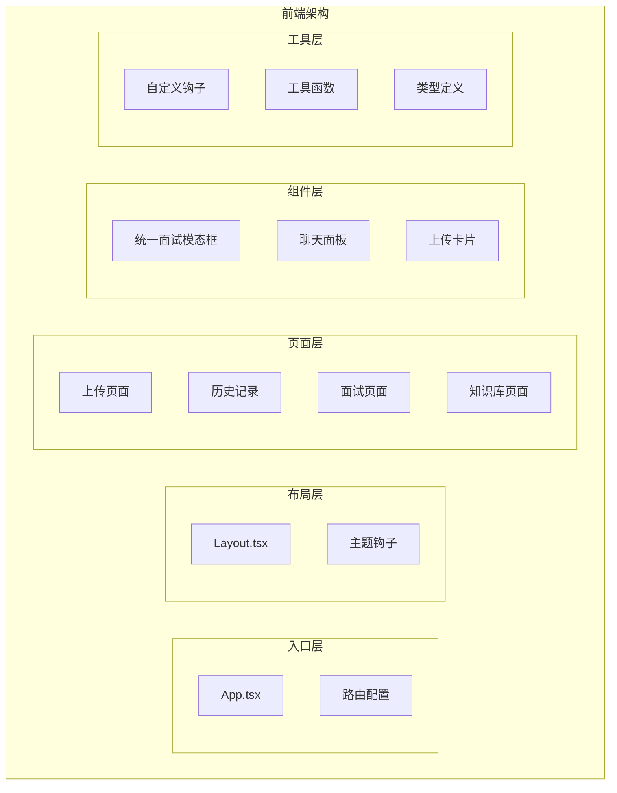

**图表来源**
- [App.tsx:167-229](file://frontend/src/App.tsx#L167-L229)
- [Layout.tsx:22-256](file://frontend/src/components/Layout.tsx#L22-L256)

**章节来源**
- [App.tsx:1-379](file://frontend/src/App.tsx#L1-L379)
- [Layout.tsx:1-257](file://frontend/src/components/Layout.tsx#L1-L257)

## 核心组件

### 组件分层架构

平台采用四层组件架构设计：

1. **布局组件层**：负责整体页面布局和导航
2. **页面组件层**：处理具体业务页面逻辑
3. **业务组件层**：封装特定业务功能
4. **UI组件层**：提供基础UI元素

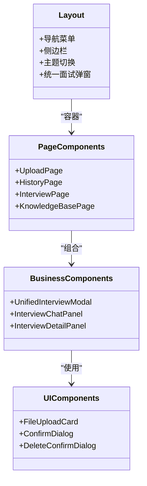

**图表来源**
- [Layout.tsx:22-256](file://frontend/src/components/Layout.tsx#L22-L256)
- [UnifiedInterviewModal.tsx:43-475](file://frontend/src/components/UnifiedInterviewModal.tsx#L43-L475)

### 路由配置与包装器模式

App.tsx实现了复杂的路由配置和包装器模式：

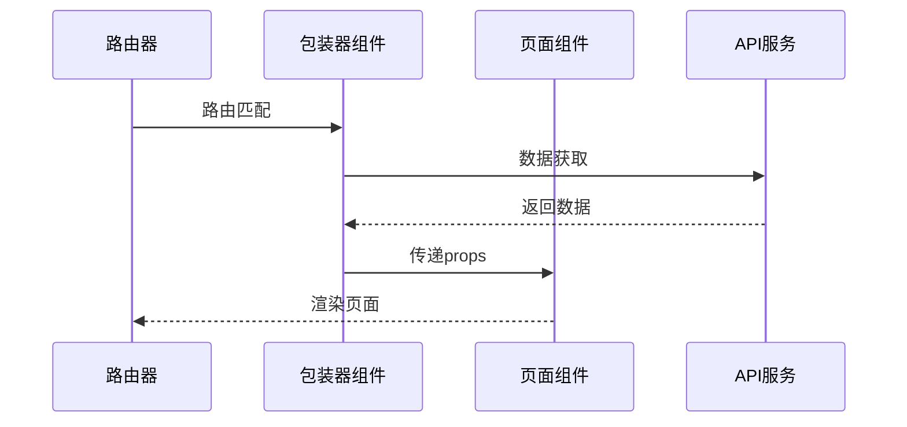

**图表来源**
- [App.tsx:167-229](file://frontend/src/App.tsx#L167-L229)
- [App.tsx:36-165](file://frontend/src/App.tsx#L36-L165)

**章节来源**
- [App.tsx:35-379](file://frontend/src/App.tsx#L35-L379)

## 架构概览

### 整体架构设计

平台采用单页应用(SPA)架构，通过React Router实现客户端路由管理：

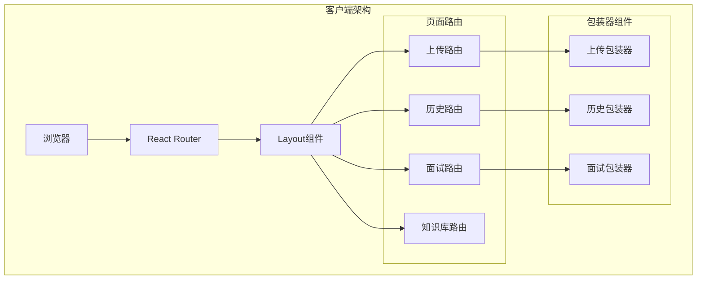

**图表来源**
- [App.tsx:167-229](file://frontend/src/App.tsx#L167-L229)
- [Layout.tsx:131-256](file://frontend/src/components/Layout.tsx#L131-L256)

### 状态管理模式

平台采用多种状态管理模式：

1. **本地状态管理**：组件内部状态
2. **路由状态管理**：通过location.state传递
3. **全局状态管理**：通过Context和自定义Hook
4. **缓存状态管理**：localStorage持久化

**章节来源**
- [App.tsx:85-165](file://frontend/src/App.tsx#L85-L165)
- [useTheme.ts:1-37](file://frontend/src/hooks/useTheme.ts#L1-L37)

## 详细组件分析

### Layout组件设计

Layout组件是整个应用的核心布局组件，实现了响应式侧边栏导航和主内容区域：

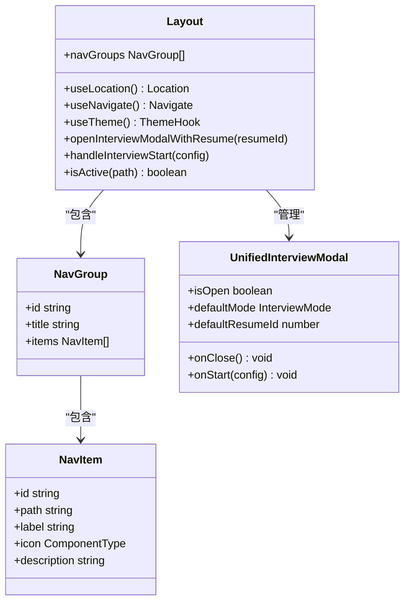

**图表来源**
- [Layout.tsx:8-14](file://frontend/src/components/Layout.tsx#L8-L14)
- [Layout.tsx:22-256](file://frontend/src/components/Layout.tsx#L22-L256)

#### 导航系统设计

Layout组件实现了多层次的导航系统：

1. **业务模块分组**：面试准备、知识库两大模块
2. **动态激活状态**：根据当前路径自动高亮
3. **主题切换**：支持明暗主题切换
4. **统一面试入口**：通过模态框统一面试配置

**章节来源**
- [Layout.tsx:82-129](file://frontend/src/components/Layout.tsx#L82-L129)
- [Layout.tsx:131-256](file://frontend/src/components/Layout.tsx#L131-L256)

### 页面组件组织结构

#### 上传页面组件

UploadPage组件专门处理简历上传功能：

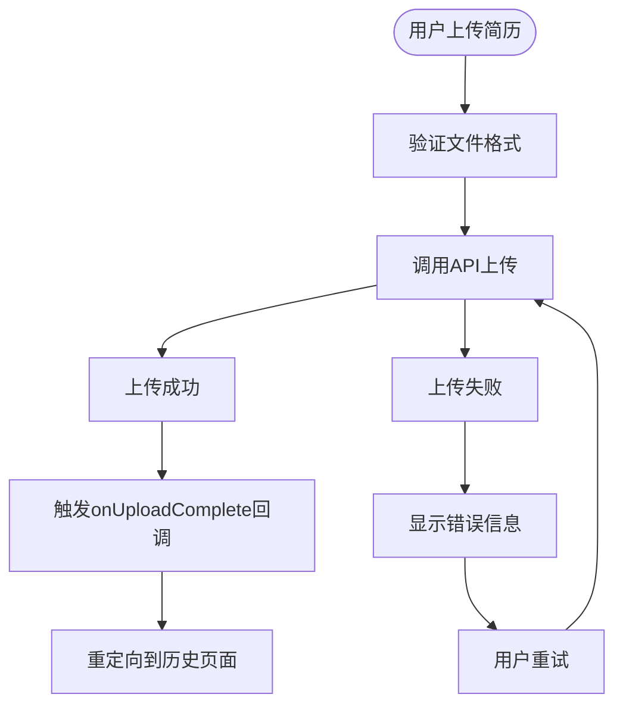

**图表来源**
- [UploadPage.tsx:14-32](file://frontend/src/pages/UploadPage.tsx#L14-L32)

**章节来源**
- [UploadPage.tsx:1-49](file://frontend/src/pages/UploadPage.tsx#L1-L49)

#### 历史记录页面组件

HistoryPage组件管理简历历史记录：

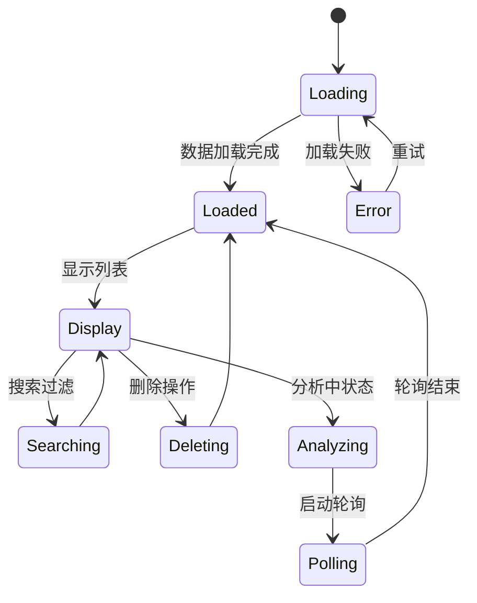

**图表来源**
- [HistoryPage.tsx:52-78](file://frontend/src/pages/HistoryPage.tsx#L52-L78)
- [HistoryPage.tsx:170-337](file://frontend/src/pages/HistoryPage.tsx#L170-L337)

**章节来源**
- [HistoryPage.tsx:44-337](file://frontend/src/pages/HistoryPage.tsx#L44-L337)

#### 面试页面组件

InterviewPage组件处理模拟面试流程：

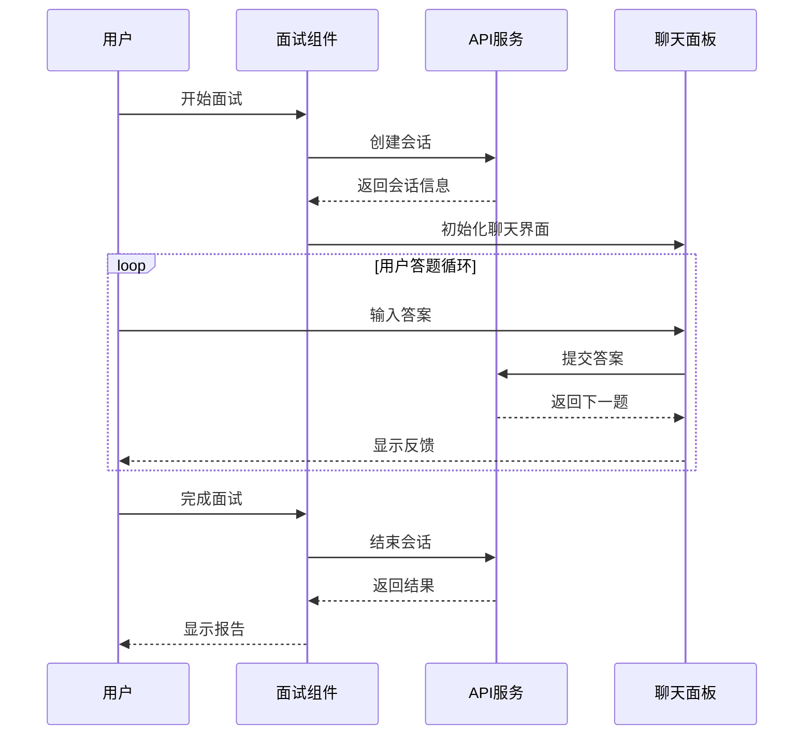

**图表来源**
- [InterviewPage.tsx:73-118](file://frontend/src/pages/InterviewPage.tsx#L73-L118)
- [InterviewPage.tsx:149-186](file://frontend/src/pages/InterviewPage.tsx#L149-L186)

**章节来源**
- [InterviewPage.tsx:35-292](file://frontend/src/pages/InterviewPage.tsx#L35-L292)

#### 知识库管理页面组件

KnowledgeBaseManagePage组件提供知识库管理功能：

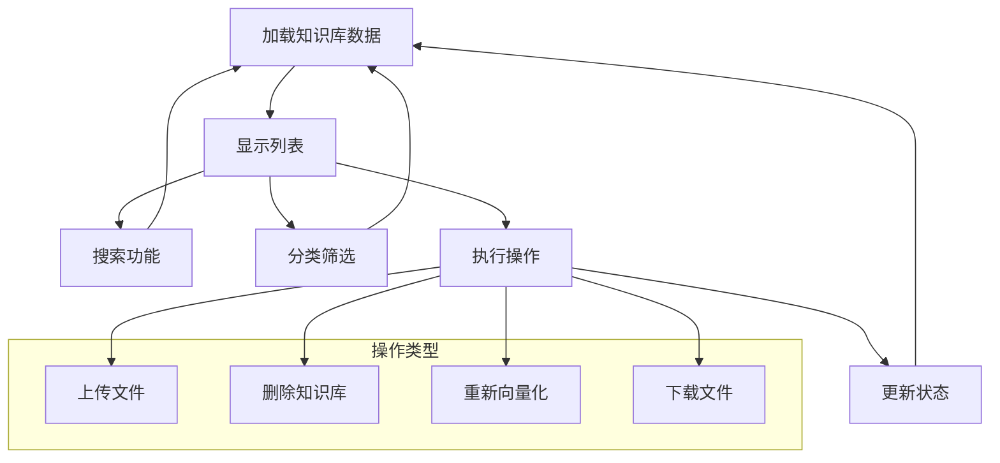

**图表来源**
- [KnowledgeBaseManagePage.tsx:115-195](file://frontend/src/pages/KnowledgeBaseManagePage.tsx#L115-L195)

**章节来源**
- [KnowledgeBaseManagePage.tsx:115-604](file://frontend/src/pages/KnowledgeBaseManagePage.tsx#L115-L604)

### 组件复用策略

#### 高阶组件(HOC)模式

平台广泛使用包装器组件模式：

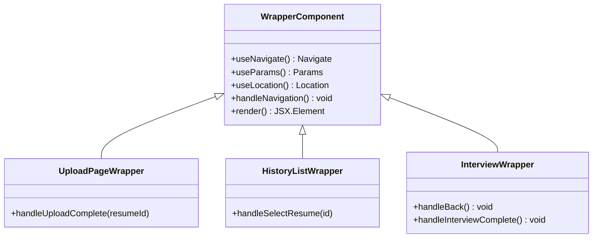

**图表来源**
- [App.tsx:36-165](file://frontend/src/App.tsx#L36-L165)

#### 自定义Hook模式

useInterviewConfig和useTheme等自定义Hook提供了强大的状态管理能力：

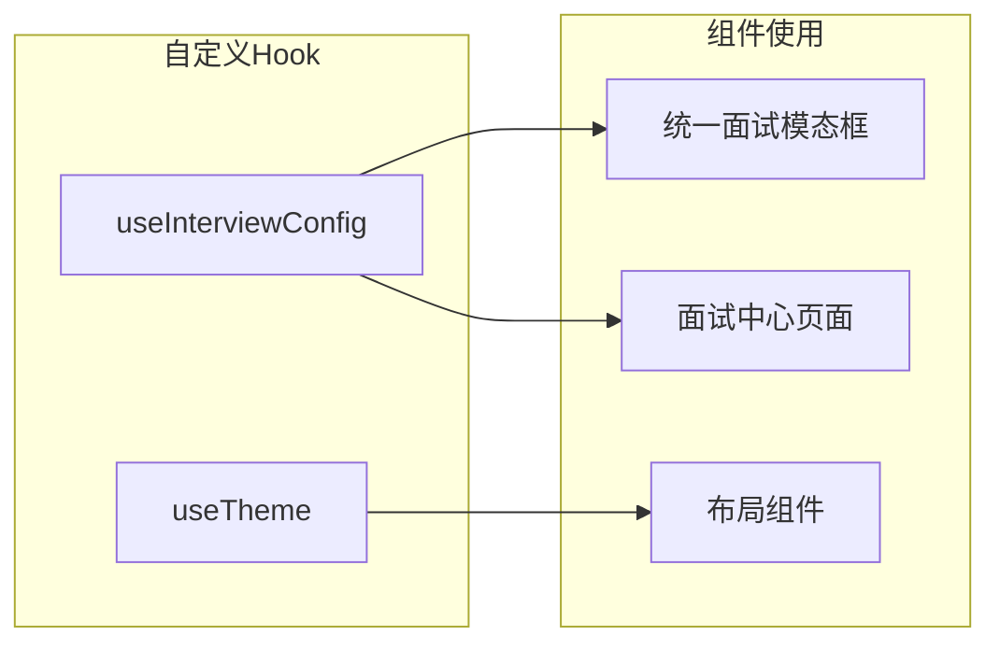

**图表来源**
- [useInterviewConfig.ts:41-151](file://frontend/src/hooks/useInterviewConfig.ts#L41-L151)
- [useTheme.ts:5-36](file://frontend/src/hooks/useTheme.ts#L5-L36)

**章节来源**
- [useInterviewConfig.ts:1-152](file://frontend/src/hooks/useInterviewConfig.ts#L1-L152)
- [useTheme.ts:1-37](file://frontend/src/hooks/useTheme.ts#L1-L37)

### 组件通信机制

#### Props传递机制

平台采用严格的props传递模式：

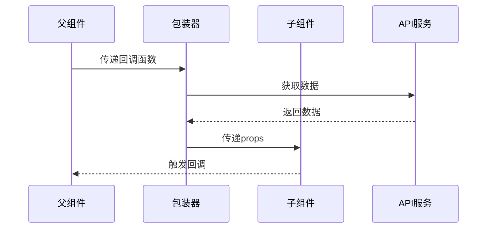

**图表来源**
- [App.tsx:36-165](file://frontend/src/App.tsx#L36-L165)

#### Context共享机制

Layout组件通过useOutletContext实现组件间通信：

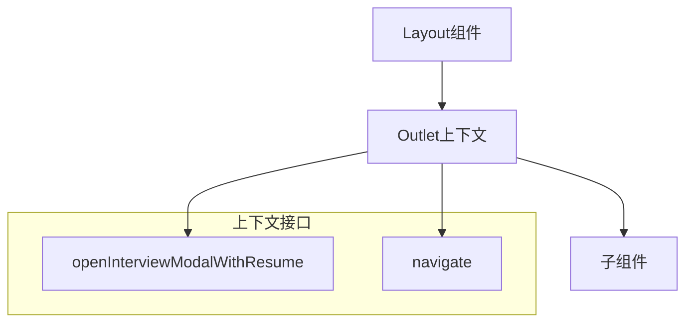

**图表来源**
- [Layout.tsx:238](file://frontend/src/components/Layout.tsx#L238)

#### 事件冒泡机制

平台正确处理事件冒泡，避免意外的路由跳转：

**章节来源**
- [InterviewChatPanel.tsx:50-54](file://frontend/src/components/InterviewChatPanel.tsx#L50-L54)

## 依赖关系分析

### 组件依赖图

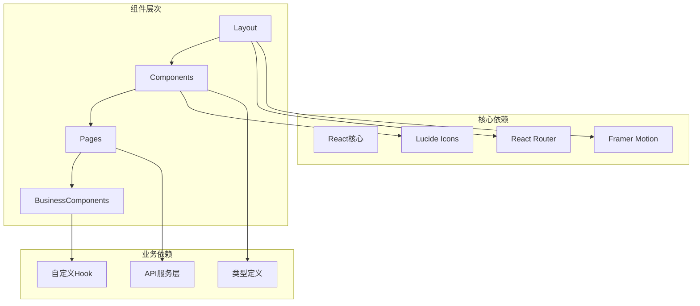

**图表来源**
- [App.tsx:1-10](file://frontend/src/App.tsx#L1-L10)
- [Layout.tsx:1-6](file://frontend/src/components/Layout.tsx#L1-L6)

### 外部依赖管理

平台使用以下关键外部依赖：

1. **UI框架**：Tailwind CSS提供样式基础
2. **动画库**：Framer Motion实现流畅动画
3. **图标库**：Lucide React提供统一图标
4. **状态管理**：React Hooks实现状态管理
5. **路由管理**：React Router实现客户端路由

**章节来源**
- [App.tsx:1-10](file://frontend/src/App.tsx#L1-L10)
- [Layout.tsx:1-6](file://frontend/src/components/Layout.tsx#L1-L6)

## 性能考虑

### 代码分割策略

平台采用懒加载和代码分割技术：

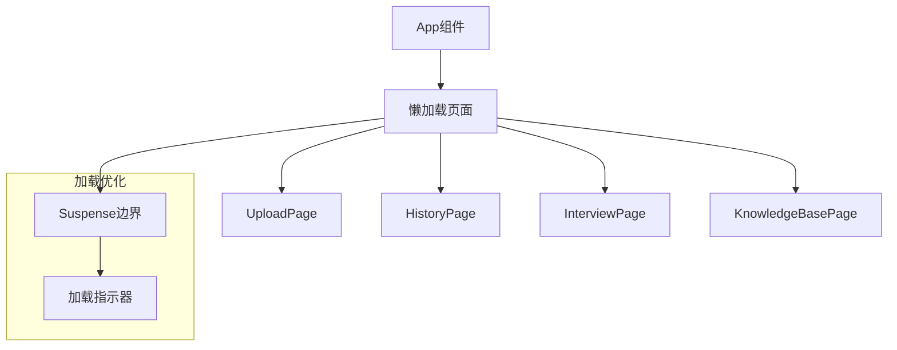

**图表来源**
- [App.tsx:11-33](file://frontend/src/App.tsx#L11-L33)

### 性能优化实践

1. **虚拟滚动**：使用react-virtuoso实现大数据量列表渲染
2. **条件渲染**：根据状态动态渲染组件
3. **防抖节流**：搜索和轮询操作的性能优化
4. **内存管理**：及时清理定时器和事件监听器

**章节来源**
- [InterviewChatPanel.tsx:82-97](file://frontend/src/components/InterviewChatPanel.tsx#L82-L97)
- [InterviewHistoryPage.tsx:282-299](file://frontend/src/pages/InterviewHistoryPage.tsx#L282-L299)

## 故障排除指南

### 常见问题诊断

#### 路由跳转问题

当遇到路由跳转异常时，检查以下要点：

1. **包装器组件参数传递**
2. **useNavigate使用方式**
3. **路由配置正确性**

#### 状态同步问题

状态不同步通常由以下原因造成：

1. **异步操作时机**
2. **组件卸载后的状态更新**
3. **缓存数据过期**

**章节来源**
- [App.tsx:36-165](file://frontend/src/App.tsx#L36-L165)

### 调试技巧

1. **使用React DevTools检查组件树**
2. **利用console.log追踪状态变化**
3. **检查网络请求和API响应**
4. **验证路由参数和状态传递**

## 结论

面试指南平台展现了优秀的React组件架构设计，主要体现在：

1. **清晰的分层架构**：布局层、页面层、业务层、UI层职责明确
2. **灵活的路由系统**：包装器模式实现参数传递和状态管理
3. **强大的组件复用**：HOC、自定义Hook、Render Props等多种模式
4. **完善的通信机制**：props传递、context共享、事件冒泡
5. **优秀的性能设计**：代码分割、虚拟滚动、状态优化

该架构为大型React应用提供了良好的参考模板，体现了现代前端开发的最佳实践。通过合理的组件拆分和状态管理，平台实现了高度的可维护性和扩展性。