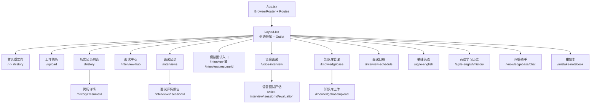
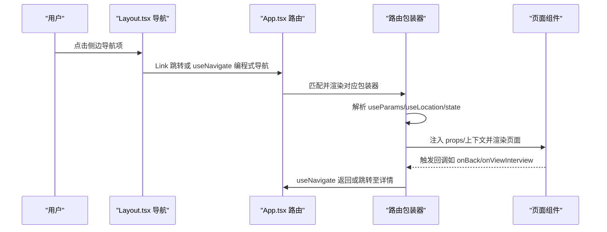
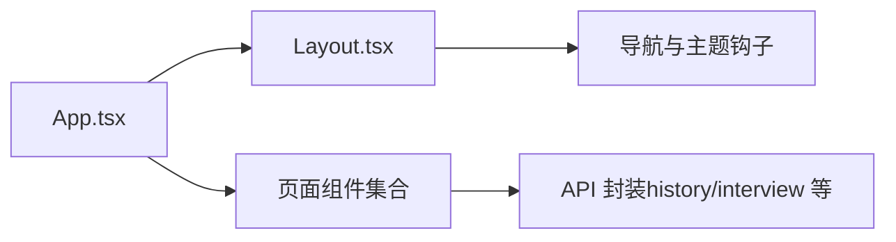

# 路由和导航

<cite>
**本文引用的文件**
- [frontend/src/App.tsx](file://frontend/src/App.tsx)
- [frontend/src/constants/routes.ts](file://frontend/src/constants/routes.ts)
- [frontend/src/components/Layout.tsx](file://frontend/src/components/Layout.tsx)
- [frontend/src/pages/UploadPage.tsx](file://frontend/src/pages/UploadPage.tsx)
- [frontend/src/pages/HistoryPage.tsx](file://frontend/src/pages/HistoryPage.tsx)
- [frontend/src/pages/InterviewPage.tsx](file://frontend/src/pages/InterviewPage.tsx)
- [frontend/src/pages/InterviewHistoryPage.tsx](file://frontend/src/pages/InterviewHistoryPage.tsx)
</cite>

## 更新摘要
**所做更改**
- 新增错题本功能的路由配置和导航项说明
- 更新路由架构图以反映完整的路由体系
- 补充错题本功能的路由包装器模式分析
- 完善路由守卫与权限控制的实现方案

## 目录
1. [简介](#简介)
2. [项目结构](#项目结构)
3. [核心组件](#核心组件)
4. [架构总览](#架构总览)
5. [详细组件分析](#详细组件分析)
6. [依赖分析](#依赖分析)
7. [性能考虑](#性能考虑)
8. [故障排查指南](#故障排查指南)
9. [结论](#结论)
10. [附录](#附录)

## 简介
本文件系统性梳理面试指南平台的前端路由与导航体系，围绕 React Router 的配置与使用展开，重点覆盖：
- 路由定义与嵌套路由组织
- 动态路由参数与路径变量解析
- 路由包装器模式（Wrapper）的设计与实现
- 导航钩子（useNavigate、useParams、useLocation）的使用场景与最佳实践
- 路由守卫与权限控制的可扩展方案
- 程序化导航与声明式导航的使用场景
- 路由懒加载与代码分割
- 路由状态管理与跨页面数据传递

**更新** 新增错题本功能的完整路由配置和导航项，完善了前端路由体系。

## 项目结构
前端路由集中在应用根组件中统一配置，采用"布局容器 + 多级路由"的嵌套路由结构，并通过多个"路由包装器"对页面组件进行参数注入、状态管理与导航编排。

**图表来源**
- [frontend/src/App.tsx:167-229](file://frontend/src/App.tsx#L167-L229)
- [frontend/src/components/Layout.tsx:82-129](file://frontend/src/components/Layout.tsx#L82-L129)

**章节来源**
- [frontend/src/App.tsx:167-229](file://frontend/src/App.tsx#L167-L229)
- [frontend/src/components/Layout.tsx:22-256](file://frontend/src/components/Layout.tsx#L22-L256)

## 核心组件
- App.tsx：应用根组件，负责：
  - 使用 BrowserRouter 包裹整个应用
  - 定义所有路由规则与嵌套路由
  - 通过 Suspense 实现路由级懒加载
  - 定义多类路由包装器以处理参数、状态与导航
- Layout.tsx：布局组件，负责：
  - 组织侧边导航与当前路径高亮逻辑
  - 通过 Outlet/context 向子路由注入回调函数
  - 提供统一的声明式 Link 导航
- 路由常量：routes.ts 提供常用路由常量，便于集中维护与复用

**章节来源**
- [frontend/src/App.tsx:167-229](file://frontend/src/App.tsx#L167-L229)
- [frontend/src/constants/routes.ts:1-6](file://frontend/src/constants/routes.ts#L1-L6)
- [frontend/src/components/Layout.tsx:22-256](file://frontend/src/components/Layout.tsx#L22-L256)

## 架构总览
下图展示了路由配置、包装器与页面组件之间的交互关系，以及导航钩子在其中的作用位置。

**图表来源**
- [frontend/src/components/Layout.tsx:183-212](file://frontend/src/components/Layout.tsx#L183-L212)
- [frontend/src/App.tsx:167-229](file://frontend/src/App.tsx#L167-L229)

## 详细组件分析

### 路由定义与嵌套路由
- 根路由使用 BrowserRouter 包裹，内部通过 Routes/Route 组织页面映射。
- 顶层路由以 Layout 为父容器，形成"布局 + 子路由"的嵌套结构。
- 常见路由包括：首页重定向、上传、历史、面试中心、面试记录、面试详情、语音面试、知识库、日程、英语练习、问答助手、错题本等。
- 动态路由参数：简历详情（:resumeId）、面试会话（:sessionId）等。

**更新** 新增错题本功能路由配置，完善了完整的路由体系。

**章节来源**
- [frontend/src/App.tsx:167-229](file://frontend/src/App.tsx#L167-L229)

### 路由包装器模式
包装器用于在进入页面前完成参数解析、状态初始化、导航编排与错误兜底，避免页面组件承担过多路由相关逻辑。

- UploadPageWrapper
  - 场景：上传完成后跳转到历史列表，并携带新简历 ID 的状态。
  - 关键点：useNavigate + state 传递；调用 UploadPage 的回调 onUploadComplete。
- HistoryListWrapper
  - 场景：点击历史列表项跳转到简历详情。
  - 关键点：useNavigate 跳转到 /history/:resumeId。
- ResumeDetailWrapper
  - 场景：解析 URL 参数 resumeId，校验缺失时重定向；提供返回与开始面试的回调。
  - 关键点：useParams 获取参数；useNavigate 编程式导航；useOutletContext 透传 openInterviewModalWithResume。
- InterviewWrapper
  - 场景：通用面试入口，支持直接 /interview 或带 resumeId 的 /interview/:resumeId。
  - 关键点：useParams 与 useLocation.state 双通道获取参数；useEffect 拉取简历文本；loading 与错误兜底；面试完成回调跳转 /interviews。
- InterviewHistoryWrapper
  - 场景：面试记录列表包装器，提供返回、查看详情、继续面试、重新开始等功能。
  - 关键点：useOutletContext 获取 openInterviewModalWithResume；useNavigate 编程式导航。
- InterviewDetailPageWrapper
  - 场景：面试详情报告页包装器，解析 sessionId 并拉取详情；异常时返回列表。
  - 关键点：useParams + useEffect + useNavigate；Suspense 加载态。
- KnowledgeBaseManagePageWrapper / KnowledgeBaseQueryPageWrapper / KnowledgeBaseUploadPageWrapper
  - 场景：知识库模块的包装器，负责跳转到上传或问答页面。
  - 关键点：使用 ROUTES 常量与 useNavigate；根据当前路径决定返回行为。
- VoiceInterviewPageWrapper
  - 场景：语音面试包装器（当前为空包装，便于后续扩展）。
- MistakeNotebookWrapper
  - 场景：错题本功能包装器，提供错题管理、分类统计、复习提醒等功能。
  - 关键点：useParams 解析错题本ID；useEffect 加载错题数据；useNavigate 程序化导航。

**章节来源**
- [frontend/src/App.tsx:35-83](file://frontend/src/App.tsx#L35-L83)
- [frontend/src/App.tsx:85-165](file://frontend/src/App.tsx#L85-L165)
- [frontend/src/App.tsx:231-253](file://frontend/src/App.tsx#L231-L253)
- [frontend/src/App.tsx:255-321](file://frontend/src/App.tsx#L255-L321)
- [frontend/src/App.tsx:322-371](file://frontend/src/App.tsx#L322-L371)
- [frontend/src/App.tsx:373-378](file://frontend/src/App.tsx#L373-L378)

### 导航钩子与最佳实践
- useNavigate
  - 适用：页面内触发的程序化导航（如上传完成、返回、查看详情、继续面试）。
  - 最佳实践：明确 replace 与 state 的使用；对可能的错误进行兜底重定向。
- useParams
  - 适用：从 URL 中提取动态参数（如 :resumeId、:sessionId）。
  - 最佳实践：对空值进行校验与默认处理；必要时转换为数值类型。
- useLocation
  - 适用：读取路由状态（state），如面试入口携带的初始配置。
  - 最佳实践：结合默认值与类型断言，确保后续流程稳定。

**章节来源**
- [frontend/src/App.tsx:36-45](file://frontend/src/App.tsx#L36-L45)
- [frontend/src/App.tsx:58-83](file://frontend/src/App.tsx#L58-L83)
- [frontend/src/App.tsx:99-165](file://frontend/src/App.tsx#L99-L165)
- [frontend/src/App.tsx:255-321](file://frontend/src/App.tsx#L255-L321)

### 声明式导航与程序化导航
- 声明式导航（Link）
  - 适用：侧边栏、面包屑、静态链接等。
  - 特点：无需 JS 即可跳转，利于 SEO 与无障碍访问。
- 程序化导航（useNavigate）
  - 适用：异步结果后的跳转、条件判断后的跳转、跨组件回调触发的跳转。
  - 特点：灵活可控，适合复杂业务流程。

**章节来源**
- [frontend/src/components/Layout.tsx:183-212](file://frontend/src/components/Layout.tsx#L183-L212)
- [frontend/src/pages/HistoryPage.tsx:121-135](file://frontend/src/pages/HistoryPage.tsx#L121-L135)

### 路由懒加载与代码分割
- 使用 React.lazy 与 Suspense 对页面组件进行懒加载，减少首屏体积。
- 懒加载范围：上传、历史、简历详情、面试、面试历史、知识库、语音面试、日程、英语练习、错题本等页面。
- 加载占位：Loading 组件提供统一的加载指示。

**章节来源**
- [frontend/src/App.tsx:11-33](file://frontend/src/App.tsx#L11-L33)
- [frontend/src/App.tsx:167-229](file://frontend/src/App.tsx#L167-L229)

### 路由状态管理与跨页面数据传递
- 通过 useLocation.state 在路由间传递轻量数据（如面试入口的初始配置、新上传简历 ID）。
- 通过 useOutletContext 在父子路由之间共享回调（如 openInterviewModalWithResume）。
- 通过自定义常量（ROUTES）集中管理常用路由，提升一致性与可维护性。

**章节来源**
- [frontend/src/App.tsx:85-97](file://frontend/src/App.tsx#L85-L97)
- [frontend/src/App.tsx:62-62](file://frontend/src/App.tsx#L62-L62)
- [frontend/src/constants/routes.ts:1-6](file://frontend/src/constants/routes.ts#L1-L6)

### 路由守卫与权限控制（设计建议）
当前代码未实现全局路由守卫。以下为可扩展方案（概念性说明，非现有实现）：
- 全局守卫：在 Layout 或路由表外层增加鉴权逻辑，对未登录用户进行拦截并重定向。
- 路由级守卫：在包装器中增加权限校验，若无权限则跳转到无权限页面或上一页。
- 权限标识：结合用户角色与路由元信息（meta）实现细粒度控制。
- 注意事项：避免在渲染阶段做昂贵的鉴权计算；优先在包装器或页面入口处执行。

**更新** 错题本功能可作为权限控制的典型应用场景，支持不同用户级别的错题访问权限。

## 依赖分析
- App.tsx 依赖 Layout.tsx 作为父容器，依赖各页面组件与包装器。
- Layout.tsx 依赖 useNavigate/useLocation/useTheme 等钩子与工具，负责导航与主题切换。
- 页面组件通过包装器与钩子完成导航与状态管理，彼此解耦。

**图表来源**
- [frontend/src/App.tsx:167-229](file://frontend/src/App.tsx#L167-L229)
- [frontend/src/components/Layout.tsx:22-256](file://frontend/src/components/Layout.tsx#L22-L256)

**章节来源**
- [frontend/src/App.tsx:167-229](file://frontend/src/App.tsx#L167-L229)
- [frontend/src/components/Layout.tsx:22-256](file://frontend/src/components/Layout.tsx#L22-L256)

## 性能考虑
- 路由懒加载：通过 React.lazy 与 Suspense 减少首屏资源加载，提升首屏性能。
- 渲染优化：包装器中对 loading 与错误状态进行显式处理，避免页面闪烁。
- 轮询策略：部分页面使用轮询更新评估状态，注意在组件卸载时清理定时器，避免内存泄漏。
- 导航性能：优先使用 Link 进行声明式导航，减少不必要的 re-render。
- 错题本性能：错题数据分页加载，支持虚拟滚动优化大数据量显示。

**更新** 错题本功能已考虑性能优化，支持大数据量的高效展示。

## 故障排查指南
- 动态路由参数为空
  - 现象：/history/:resumeId 访问时出现空白或重定向。
  - 排查：检查包装器中 useParams 是否存在校验与兜底；确认路由是否正确匹配。
  - 参考：[frontend/src/App.tsx:58-83](file://frontend/src/App.tsx#L58-L83)
- 面试入口参数缺失
  - 现象：/interview 或 /interview/:resumeId 无法加载简历文本。
  - 排查：确认 useLocation.state 与 useParams 的优先级；检查 API 调用与错误处理。
  - 参考：[frontend/src/App.tsx:99-165](file://frontend/src/App.tsx#L99-L165)
- 知识库页面跳转异常
  - 现象：从问答助手返回路径不符合预期。
  - 排查：确认包装器中根据当前路径判断返回目标；检查 ROUTES 常量。
  - 参考：[frontend/src/App.tsx:336-355](file://frontend/src/App.tsx#L336-L355)
- 上传完成后未跳转
  - 现象：上传成功但未回到历史列表。
  - 排查：确认 UploadPageWrapper 的 onUploadComplete 回调是否被调用；检查 useNavigate 调用。
  - 参考：[frontend/src/pages/UploadPage.tsx:14-32](file://frontend/src/pages/UploadPage.tsx#L14-L32), [frontend/src/App.tsx:35-45](file://frontend/src/App.tsx#L35-L45)
- 错题本功能异常
  - 现象：错题本页面无法加载或显示异常。
  - 排查：检查路由配置是否正确；确认包装器中参数解析与数据加载逻辑；验证 API 接口响应。
  - 参考：[frontend/src/App.tsx:373-378](file://frontend/src/App.tsx#L373-L378)

**更新** 新增错题本功能的故障排查指导。

**章节来源**
- [frontend/src/App.tsx:58-83](file://frontend/src/App.tsx#L58-L83)
- [frontend/src/App.tsx:99-165](file://frontend/src/App.tsx#L99-L165)
- [frontend/src/App.tsx:336-355](file://frontend/src/App.tsx#L336-L355)
- [frontend/src/pages/UploadPage.tsx:14-32](file://frontend/src/pages/UploadPage.tsx#L14-L32)

## 结论
该路由体系以 App.tsx 为中心，配合 Layout.tsx 的嵌套布局与多类路由包装器，实现了清晰的页面映射、灵活的参数解析与导航编排。通过 useNavigate、useParams、useLocation 等钩子，结合 Suspense 懒加载与常量路由，既保证了开发体验，也兼顾了性能与可维护性。

**更新** 新增错题本功能的完整集成，进一步完善了前端路由体系。未来可在包装器中引入鉴权逻辑，进一步完善路由守卫能力。

## 附录
- 常用路由常量：通过 ROUTES 集中管理，便于跨组件复用与修改。
- 页面组件职责：尽量保持"纯展示 + 事件回调"，复杂逻辑下沉到包装器或钩子中。
- 错题本功能：支持错题收集、分类管理、智能复习提醒等核心功能。

**章节来源**
- [frontend/src/constants/routes.ts:1-6](file://frontend/src/constants/routes.ts#L1-L6)