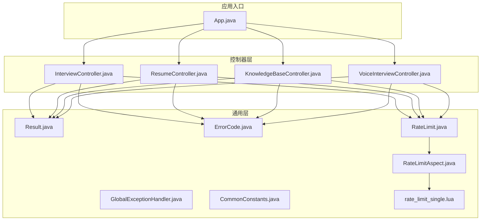
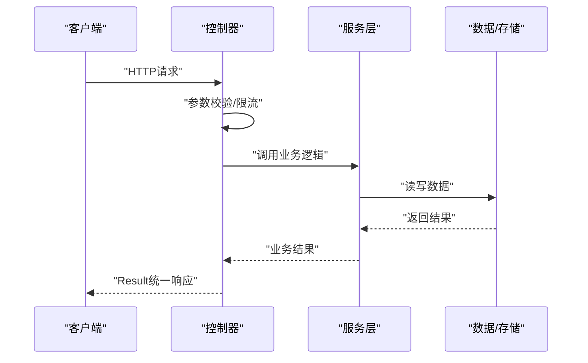
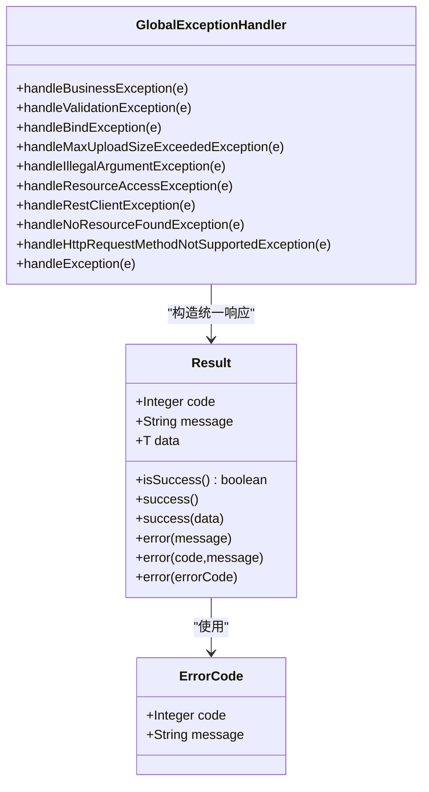
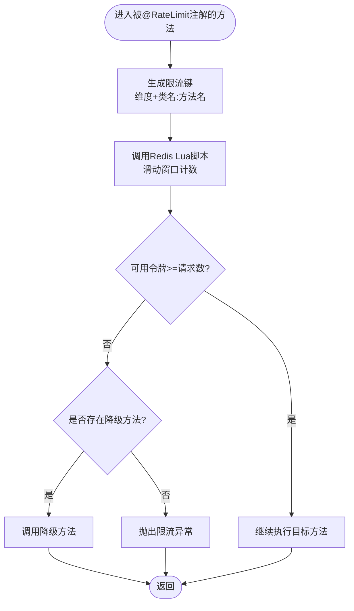
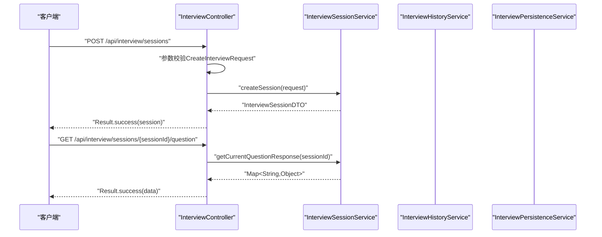
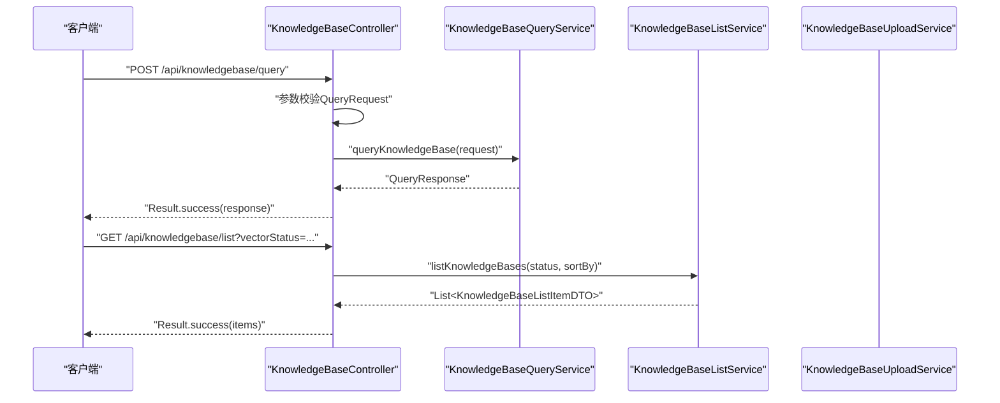
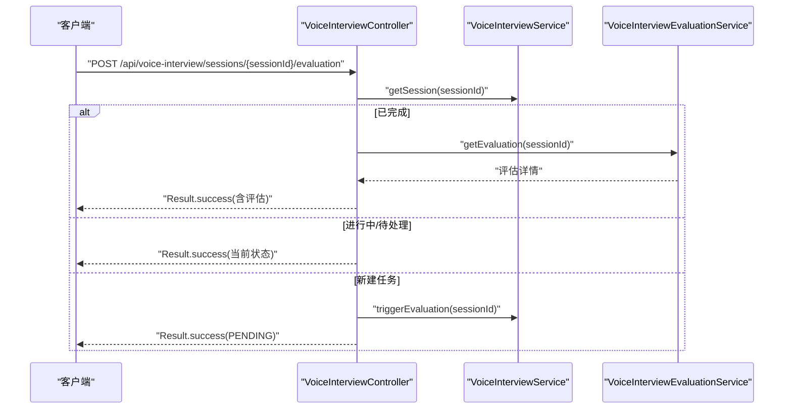
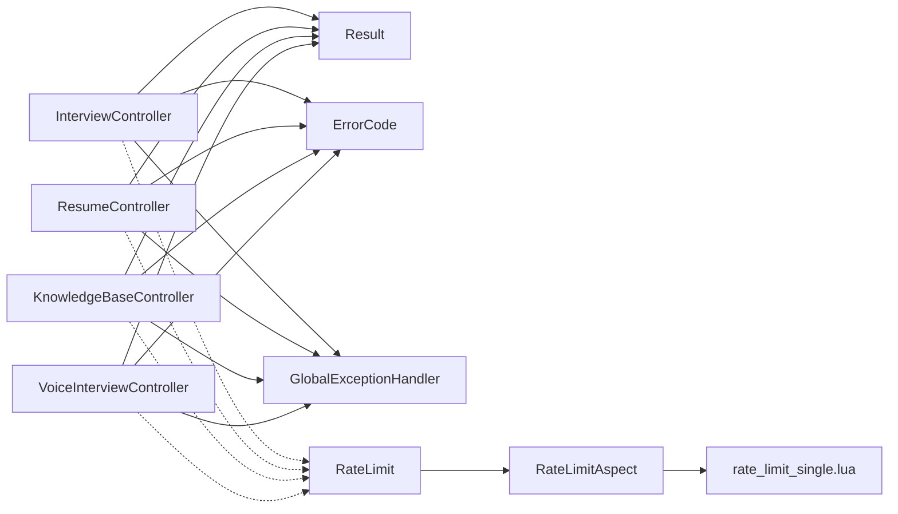

# API接口开发

<cite>
**本文引用的文件**
- [App.java](file://app/src/main/java/interview/guide/App.java)
- [Result.java](file://app/src/main/java/interview/guide/common/result/Result.java)
- [ErrorCode.java](file://app/src/main/java/interview/guide/common/exception/ErrorCode.java)
- [GlobalExceptionHandler.java](file://app/src/main/java/interview/guide/common/exception/GlobalExceptionHandler.java)
- [CommonConstants.java](file://app/src/main/java/interview/guide/common/constant/CommonConstants.java)
- [RateLimit.java](file://app/src/main/java/interview/guide/common/annotation/RateLimit.java)
- [RateLimitAspect.java](file://app/src/main/java/interview/guide/common/aspect/RateLimitAspect.java)
- [InterviewController.java](file://app/src/main/java/interview/guide/modules/interview/InterviewController.java)
- [CreateInterviewRequest.java](file://app/src/main/java/interview/guide/modules/interview/model/CreateInterviewRequest.java)
- [ResumeController.java](file://app/src/main/java/interview/guide/modules/resume/ResumeController.java)
- [KnowledgeBaseController.java](file://app/src/main/java/interview/guide/modules/knowledgebase/KnowledgeBaseController.java)
- [QueryRequest.java](file://app/src/main/java/interview/guide/modules/knowledgebase/model/QueryRequest.java)
- [VoiceInterviewController.java](file://app/src/main/java/interview/guide/modules/voiceinterview/controller/VoiceInterviewController.java)
- [rate_limit_single.lua](file://app/src/main/resources/scripts/rate_limit_single.lua)
</cite>

## 目录
1. [简介](#简介)
2. [项目结构](#项目结构)
3. [核心组件](#核心组件)
4. [架构总览](#架构总览)
5. [详细组件分析](#详细组件分析)
6. [依赖分析](#依赖分析)
7. [性能考虑](#性能考虑)
8. [故障排查指南](#故障排查指南)
9. [结论](#结论)
10. [附录](#附录)

## 简介
本指南面向API接口开发者，系统讲解本项目的RESTful API设计与实现，涵盖HTTP方法使用、URL设计、状态码规范、控制器实现、参数校验机制、统一响应格式、错误码体系、限流策略以及测试与调试方法。文档以“面试”“简历”“知识库”“语音面试”四大模块为主线，结合全局异常处理与统一响应封装，帮助读者快速掌握该系统的API设计与最佳实践。

## 项目结构
后端基于Spring Boot应用，采用分层清晰的模块化组织方式：
- 应用入口与配置：App.java
- 统一响应与异常：Result、ErrorCode、GlobalExceptionHandler
- 通用常量与注解：CommonConstants、RateLimit、RateLimitAspect
- 控制器层：InterviewController、ResumeController、KnowledgeBaseController、VoiceInterviewController
- 数据模型与请求体：各模块model包下的请求/响应对象
- 限流脚本：Redis Lua脚本

图表来源
- [App.java:1-19](file://app/src/main/java/interview/guide/App.java#L1-L19)
- [Result.java:1-61](file://app/src/main/java/interview/guide/common/result/Result.java#L1-L61)
- [ErrorCode.java:1-81](file://app/src/main/java/interview/guide/common/exception/ErrorCode.java#L1-L81)
- [GlobalExceptionHandler.java:1-161](file://app/src/main/java/interview/guide/common/exception/GlobalExceptionHandler.java#L1-L161)
- [CommonConstants.java:1-46](file://app/src/main/java/interview/guide/common/constant/CommonConstants.java#L1-L46)
- [RateLimit.java:1-120](file://app/src/main/java/interview/guide/common/annotation/RateLimit.java#L1-L120)
- [RateLimitAspect.java:1-265](file://app/src/main/java/interview/guide/common/aspect/RateLimitAspect.java#L1-L265)
- [InterviewController.java:1-176](file://app/src/main/java/interview/guide/modules/interview/InterviewController.java#L1-L176)
- [ResumeController.java:1-132](file://app/src/main/java/interview/guide/modules/resume/ResumeController.java#L1-L132)
- [KnowledgeBaseController.java:1-211](file://app/src/main/java/interview/guide/modules/knowledgebase/KnowledgeBaseController.java#L1-L211)
- [VoiceInterviewController.java:1-201](file://app/src/main/java/interview/guide/modules/voiceinterview/controller/VoiceInterviewController.java#L1-L201)
- [rate_limit_single.lua:1-61](file://app/src/main/resources/scripts/rate_limit_single.lua#L1-L61)

章节来源
- [App.java:1-19](file://app/src/main/java/interview/guide/App.java#L1-L19)

## 核心组件
- 统一响应Result：封装code/message/data三段式响应，提供success/error静态工厂方法与isSuccess判断。
- 错误码ErrorCode：集中定义业务错误码，覆盖通用、简历、面试、存储、导出、知识库、AI服务、限流、面试日程、语音面试等模块。
- 全局异常处理器GlobalExceptionHandler：统一捕获业务异常、参数校验异常、文件上传异常、AI服务异常、资源未找到、方法不支持等，并以统一响应格式返回。
- 通用常量CommonConstants：定义状态码、分页默认值、面试默认值等。
- 限流注解与切面：@RateLimit注解与RateLimitAspect实现多维度（全局/IP/用户）滑动窗口限流，Lua脚本保证原子性。

章节来源
- [Result.java:1-61](file://app/src/main/java/interview/guide/common/result/Result.java#L1-L61)
- [ErrorCode.java:1-81](file://app/src/main/java/interview/guide/common/exception/ErrorCode.java#L1-L81)
- [GlobalExceptionHandler.java:1-161](file://app/src/main/java/interview/guide/common/exception/GlobalExceptionHandler.java#L1-L161)
- [CommonConstants.java:1-46](file://app/src/main/java/interview/guide/common/constant/CommonConstants.java#L1-L46)
- [RateLimit.java:1-120](file://app/src/main/java/interview/guide/common/annotation/RateLimit.java#L1-L120)
- [RateLimitAspect.java:1-265](file://app/src/main/java/interview/guide/common/aspect/RateLimitAspect.java#L1-L265)

## 架构总览
系统采用“控制器-服务-仓储/持久层”的分层架构，控制器负责HTTP路由与参数接收，服务层编排业务流程，统一响应与异常处理贯穿始终。限流通过AOP切面在方法级生效，使用Redis Lua脚本实现高性能滑动窗口限流。

图表来源
- [InterviewController.java:1-176](file://app/src/main/java/interview/guide/modules/interview/InterviewController.java#L1-L176)
- [ResumeController.java:1-132](file://app/src/main/java/interview/guide/modules/resume/ResumeController.java#L1-L132)
- [KnowledgeBaseController.java:1-211](file://app/src/main/java/interview/guide/modules/knowledgebase/KnowledgeBaseController.java#L1-L211)
- [VoiceInterviewController.java:1-201](file://app/src/main/java/interview/guide/modules/voiceinterview/controller/VoiceInterviewController.java#L1-L201)

## 详细组件分析

### 统一响应与异常处理
- 统一响应Result：提供success()/error()系列静态方法，支持泛型data；isSuccess用于前端快速判断。
- 错误码ErrorCode：按模块划分错误码区间，便于定位与国际化扩展。
- 全局异常处理器：覆盖业务异常、参数校验、绑定异常、文件大小限制、非法参数、AI服务网络/调用异常、资源未找到、方法不支持、通用异常等，均以HTTP 200返回业务错误码，保持前后端一致性。

图表来源
- [Result.java:1-61](file://app/src/main/java/interview/guide/common/result/Result.java#L1-L61)
- [ErrorCode.java:1-81](file://app/src/main/java/interview/guide/common/exception/ErrorCode.java#L1-L81)
- [GlobalExceptionHandler.java:1-161](file://app/src/main/java/interview/guide/common/exception/GlobalExceptionHandler.java#L1-L161)

章节来源
- [Result.java:1-61](file://app/src/main/java/interview/guide/common/result/Result.java#L1-L61)
- [ErrorCode.java:1-81](file://app/src/main/java/interview/guide/common/exception/ErrorCode.java#L1-L81)
- [GlobalExceptionHandler.java:1-161](file://app/src/main/java/interview/guide/common/exception/GlobalExceptionHandler.java#L1-L161)

### 限流机制（RateLimit + RateLimitAspect + Lua）
- 注解维度：支持GLOBAL/IP/USER三种维度，可重复注解实现多维限流，任一规则不通过即拒绝。
- 实现原理：AOP环绕通知拦截方法，计算key（类名:方法名+维度），调用Redis Lua脚本执行滑动窗口原子计数，返回0表示限流触发。
- 降级策略：可通过fallback属性指定降级方法（无参或参数一致），否则抛出限流异常。
- Lua脚本：rate_limit_single.lua实现令牌回收、扣减与过期设置，确保高并发下的一致性。

图表来源
- [RateLimit.java:1-120](file://app/src/main/java/interview/guide/common/annotation/RateLimit.java#L1-L120)
- [RateLimitAspect.java:1-265](file://app/src/main/java/interview/guide/common/aspect/RateLimitAspect.java#L1-L265)
- [rate_limit_single.lua:1-61](file://app/src/main/resources/scripts/rate_limit_single.lua#L1-L61)

章节来源
- [RateLimit.java:1-120](file://app/src/main/java/interview/guide/common/annotation/RateLimit.java#L1-L120)
- [RateLimitAspect.java:1-265](file://app/src/main/java/interview/guide/common/aspect/RateLimitAspect.java#L1-L265)
- [rate_limit_single.lua:1-61](file://app/src/main/resources/scripts/rate_limit_single.lua#L1-L61)

### 面试控制器（InterviewController）
- 设计原则：遵循REST风格，路径语义化，HTTP方法与操作一一对应；统一返回Result；部分导出接口返回ResponseEntity以支持文件下载。
- 关键接口概览（路径与方法）：
  - GET /api/interview/sessions：列出会话（面试记录页）
  - POST /api/interview/sessions：创建会话（带@RateLimit）
  - GET /api/interview/sessions/{sessionId}：获取会话
  - GET /api/interview/sessions/{sessionId}/question：获取当前问题
  - POST /api/interview/sessions/{sessionId}/answers：提交答案（带@RateLimit）
  - PUT /api/interview/sessions/{sessionId}/answers：暂存答案
  - POST /api/interview/sessions/{sessionId}/complete：提前交卷
  - GET /api/interview/sessions/{sessionId}/report：生成报告
  - GET /api/interview/sessions/unfinished/{resumeId}：查找未完成会话
  - GET /api/interview/sessions/{sessionId}/details：获取会话详情
  - GET /api/interview/sessions/{sessionId}/export：导出PDF
  - DELETE /api/interview/sessions/{sessionId}：删除会话
- 参数校验：请求体使用record类型（如CreateInterviewRequest），配合Jakarta Bean Validation注解约束字段范围与必填性。
- 业务逻辑：控制器仅编排，实际逻辑委托给会话服务、历史服务、持久化服务。

图表来源
- [InterviewController.java:1-176](file://app/src/main/java/interview/guide/modules/interview/InterviewController.java#L1-L176)
- [CreateInterviewRequest.java:1-35](file://app/src/main/java/interview/guide/modules/interview/model/CreateInterviewRequest.java#L1-L35)

章节来源
- [InterviewController.java:1-176](file://app/src/main/java/interview/guide/modules/interview/InterviewController.java#L1-L176)
- [CreateInterviewRequest.java:1-35](file://app/src/main/java/interview/guide/modules/interview/model/CreateInterviewRequest.java#L1-L35)

### 简历控制器（ResumeController）
- 设计原则：文件上传使用multipart/form-data；导出PDF时返回ResponseEntity；健康检查接口便于运维监控。
- 关键接口概览：
  - POST /api/resumes/upload：上传并分析（带@RateLimit）
  - GET /api/resumes：获取简历列表
  - GET /api/resumes/{id}/detail：获取简历详情
  - GET /api/resumes/{id}/export：导出分析报告PDF
  - DELETE /api/resumes/{id}：删除简历
  - POST /api/resumes/{id}/reanalyze：重新分析（手动重试）
  - GET /api/resumes/health：健康检查
- 参数校验：上传接口使用@RequestParam接收MultipartFile；部分业务通过服务层校验与幂等处理。

章节来源
- [ResumeController.java:1-132](file://app/src/main/java/interview/guide/modules/resume/ResumeController.java#L1-L132)

### 知识库控制器（KnowledgeBaseController）
- 设计原则：支持多知识库查询、流式SSE、分类管理、上传下载、搜索与统计、向量化重试等完整生命周期管理。
- 关键接口概览：
  - GET /api/knowledgebase/list：获取列表（支持筛选向量化状态与排序）
  - GET /api/knowledgebase/{id}：获取详情
  - DELETE /api/knowledgebase/{id}：删除
  - POST /api/knowledgebase/query：查询（带@Valid）
  - POST /api/knowledgebase/query/stream：流式SSE查询（带@Valid）
  - GET /api/knowledgebase/categories：获取分类
  - GET /api/knowledgebase/category/{category}：按分类获取
  - GET /api/knowledgebase/uncategorized：未分类
  - PUT /api/knowledgebase/{id}/category：更新分类
  - POST /api/knowledgebase/upload：上传（带@RateLimit）
  - GET /api/knowledgebase/{id}/download：下载
  - GET /api/knowledgebase/search：搜索
  - GET /api/knowledgebase/stats：统计
  - POST /api/knowledgebase/{id}/revectorize：重新向量化（带@RateLimit）
- 参数校验：QueryRequest使用@NotEmpty/@NotBlank约束必填项；上传接口使用@RateLimit保护。

图表来源
- [KnowledgeBaseController.java:1-211](file://app/src/main/java/interview/guide/modules/knowledgebase/KnowledgeBaseController.java#L1-L211)
- [QueryRequest.java:1-26](file://app/src/main/java/interview/guide/modules/knowledgebase/model/QueryRequest.java#L1-L26)

章节来源
- [KnowledgeBaseController.java:1-211](file://app/src/main/java/interview/guide/modules/knowledgebase/KnowledgeBaseController.java#L1-L211)
- [QueryRequest.java:1-26](file://app/src/main/java/interview/guide/modules/knowledgebase/model/QueryRequest.java#L1-L26)

### 语音面试控制器（VoiceInterviewController）
- 设计原则：围绕会话生命周期（创建/查询/结束/暂停/恢复）、消息历史、异步评估（触发/轮询状态/获取结果）构建REST接口。
- 关键接口概览：
  - POST /api/voice-interview/sessions：创建会话（@Valid）
  - GET /api/voice-interview/sessions/{sessionId}：获取会话
  - POST /api/voice-interview/sessions/{sessionId}/end：结束会话
  - PUT /api/voice-interview/sessions/{sessionId}/pause：暂停（支持原因参数）
  - PUT /api/voice-interview/sessions/{sessionId}/resume：恢复
  - GET /api/voice-interview/sessions：获取用户/状态过滤的会话列表
  - GET /api/voice-interview/sessions/{sessionId}/messages：获取对话历史
  - GET /api/voice-interview/sessions/{sessionId}/evaluation：轮询评估状态
  - POST /api/voice-interview/sessions/{sessionId}/evaluation：触发异步评估
- 业务逻辑：结束会话时触发异步评估；评估状态通过轮询获取；若已完成则返回评估详情。

图表来源
- [VoiceInterviewController.java:1-201](file://app/src/main/java/interview/guide/modules/voiceinterview/controller/VoiceInterviewController.java#L1-L201)

章节来源
- [VoiceInterviewController.java:1-201](file://app/src/main/java/interview/guide/modules/voiceinterview/controller/VoiceInterviewController.java#L1-L201)

## 依赖分析
- 控制器依赖统一响应Result与错误码ErrorCode，异常通过GlobalExceptionHandler统一处理。
- 控制器方法可叠加@RateLimit注解，AOP切面在运行时注入限流逻辑，Lua脚本保障原子性。
- 模块间低耦合：控制器仅编排，业务逻辑下沉至服务层；服务层与仓储/外部服务解耦。

图表来源
- [InterviewController.java:1-176](file://app/src/main/java/interview/guide/modules/interview/InterviewController.java#L1-L176)
- [ResumeController.java:1-132](file://app/src/main/java/interview/guide/modules/resume/ResumeController.java#L1-L132)
- [KnowledgeBaseController.java:1-211](file://app/src/main/java/interview/guide/modules/knowledgebase/KnowledgeBaseController.java#L1-L211)
- [VoiceInterviewController.java:1-201](file://app/src/main/java/interview/guide/modules/voiceinterview/controller/VoiceInterviewController.java#L1-L201)
- [Result.java:1-61](file://app/src/main/java/interview/guide/common/result/Result.java#L1-L61)
- [ErrorCode.java:1-81](file://app/src/main/java/interview/guide/common/exception/ErrorCode.java#L1-L81)
- [GlobalExceptionHandler.java:1-161](file://app/src/main/java/interview/guide/common/exception/GlobalExceptionHandler.java#L1-L161)
- [RateLimit.java:1-120](file://app/src/main/java/interview/guide/common/annotation/RateLimit.java#L1-L120)
- [RateLimitAspect.java:1-265](file://app/src/main/java/interview/guide/common/aspect/RateLimitAspect.java#L1-L265)
- [rate_limit_single.lua:1-61](file://app/src/main/resources/scripts/rate_limit_single.lua#L1-L61)

章节来源
- [InterviewController.java:1-176](file://app/src/main/java/interview/guide/modules/interview/InterviewController.java#L1-L176)
- [ResumeController.java:1-132](file://app/src/main/java/interview/guide/modules/resume/ResumeController.java#L1-L132)
- [KnowledgeBaseController.java:1-211](file://app/src/main/java/interview/guide/modules/knowledgebase/KnowledgeBaseController.java#L1-L211)
- [VoiceInterviewController.java:1-201](file://app/src/main/java/interview/guide/modules/voiceinterview/controller/VoiceInterviewController.java#L1-L201)

## 性能考虑
- 限流策略：多维度滑动窗口限流，Lua脚本原子计数，避免竞态；合理设置count/interval/timeUnit，结合fallback降级提升用户体验。
- 导出与流式：导出PDF与SSE流式查询在控制器层直接返回，减少中间层开销；注意内存与超时配置。
- 缓存与幂等：对高频查询（如知识库列表、会话详情）可在服务层引入缓存与幂等键，降低数据库压力。
- 日志与追踪：控制器记录关键操作日志，便于性能分析与问题定位。

## 故障排查指南
- 统一错误响应：所有异常最终由GlobalExceptionHandler转为Result.error，前端可根据code/message快速定位。
- 常见问题定位：
  - 参数校验失败：查看字段错误集合，确认@Valid/@NotBlank/@NotEmpty等注解是否满足。
  - 文件上传失败：检查MaxUploadSizeExceededException与文件类型支持。
  - AI服务异常：区分超时、密钥无效、频率超限等场景，根据错误码提示修复。
  - 404/方法不支持：核对URL与HTTP方法是否匹配。
- 限流问题：确认@RateLimit配置与维度（GLOBAL/IP/USER），必要时临时提高阈值或调整降级策略。

章节来源
- [GlobalExceptionHandler.java:1-161](file://app/src/main/java/interview/guide/common/exception/GlobalExceptionHandler.java#L1-L161)
- [ErrorCode.java:1-81](file://app/src/main/java/interview/guide/common/exception/ErrorCode.java#L1-L81)

## 结论
本项目以统一响应与异常处理为核心，结合参数校验、限流与模块化控制器设计，形成了一套清晰、可维护、可扩展的API体系。面试、简历、知识库、语音面试四大模块覆盖了从内容管理到智能评估的完整链路，适合在企业级场景中推广与复用。

## 附录

### RESTful设计最佳实践摘要
- HTTP方法：GET/POST/PUT/DELETE/HEAD/OPTIONS等按语义使用，避免非幂等GET。
- URL设计：名词化、层级化、小写加连字符；路径参数用于资源定位，查询参数用于筛选。
- 状态码：遵循2xx/4xx/5xx语义；错误响应统一Result格式，便于前端处理。
- 版本控制：可在路径中加入版本号（如/api/v1/...）。
- 安全：鉴权与授权前置，敏感信息脱敏，输入严格校验。

### 参数校验与自定义校验
- 使用Jakarta Bean Validation注解（如@NotBlank、@NotEmpty、@Min/@Max）在请求体与路径/查询参数上声明约束。
- 对复杂对象使用@Valid触发嵌套校验；对集合使用@NotEmpty/@NotNull。
- 自定义校验器：可基于ConstraintValidator接口实现，配合@Constraint注解注册。

### 统一响应与错误码
- Result类提供success/error工厂方法，支持携带data或message；isSuccess便于前端快速判断。
- ErrorCode集中定义错误码与消息，便于国际化与多语言扩展。
- GlobalExceptionHandler将异常映射为Result.error，统一返回HTTP 200与业务错误码。

### API测试与调试
- Postman：导入OpenAPI/Swagger文档（如启用OpenAPI配置），批量验证接口；使用环境变量切换不同环境。
- 单元测试：针对控制器层的参数校验与异常分支、服务层的核心流程与边界条件进行测试；集成测试覆盖端到端流程。
- 调试技巧：开启DEBUG日志、使用断点定位、结合限流与导出场景压测，观察Redis Lua脚本执行情况与响应延迟。