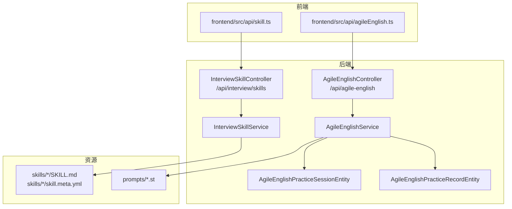
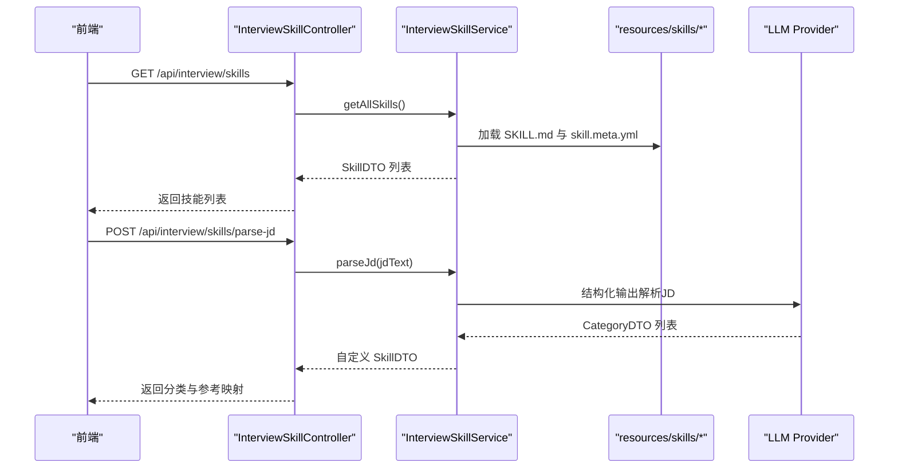
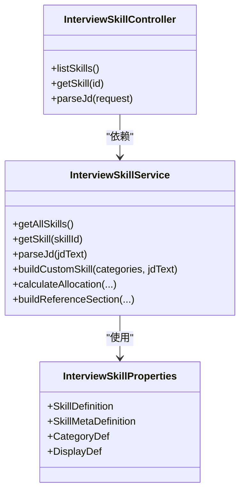
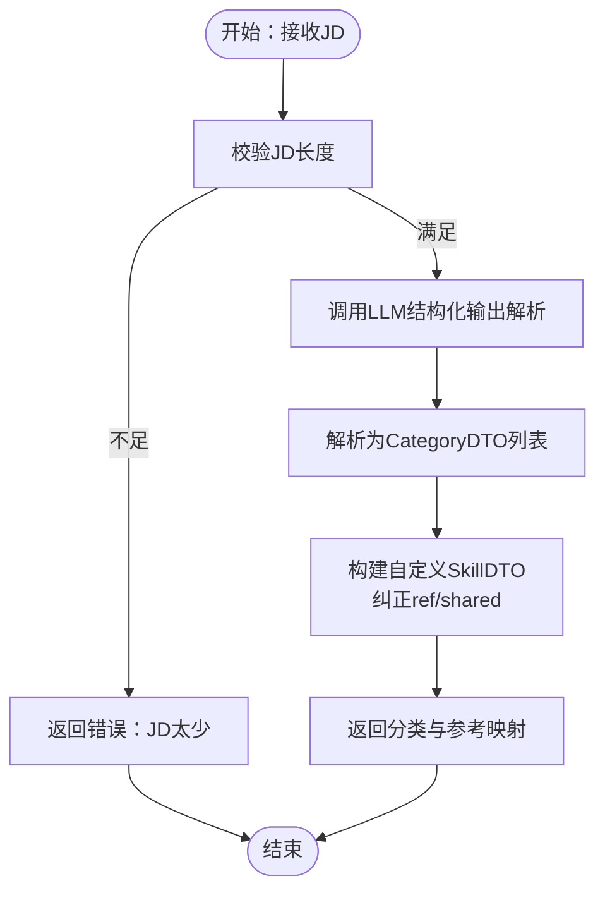
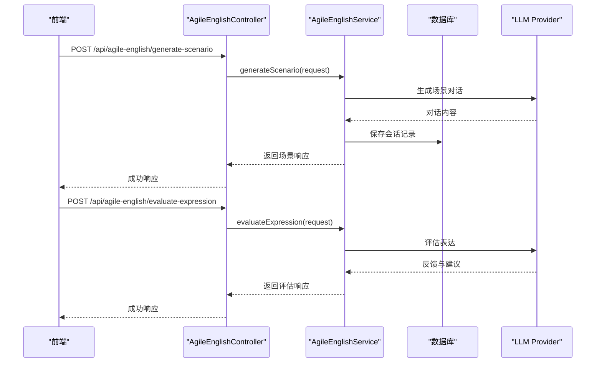
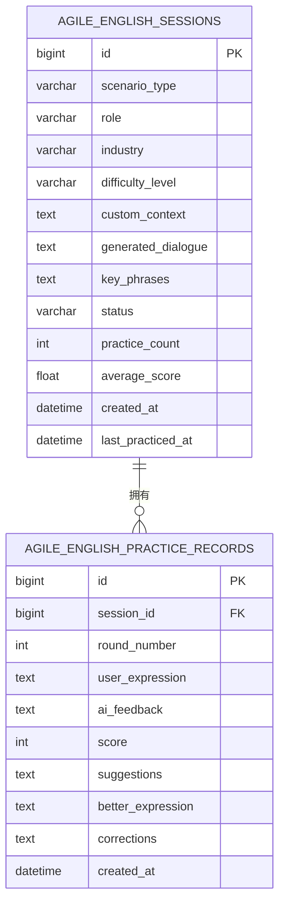
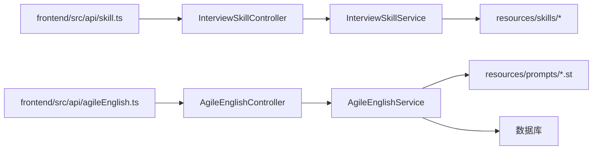

# 技能API接口

<cite>
**本文引用的文件**
- [InterviewSkillController.java](file://app/src/main/java/interview/guide/modules/interview/skill/InterviewSkillController.java)
- [AgileEnglishController.java](file://app/src/main/java/interview/guide/modules/interview/skill/AgileEnglishController.java)
- [InterviewSkillService.java](file://app/src/main/java/interview/guide/modules/interview/skill/InterviewSkillService.java)
- [AgileEnglishService.java](file://app/src/main/java/interview/guide/modules/interview/skill/AgileEnglishService.java)
- [InterviewSkillProperties.java](file://app/src/main/java/interview/guide/modules/interview/skill/InterviewSkillProperties.java)
- [AgileEnglishPracticeSessionEntity.java](file://app/src/main/java/interview/guide/modules/interview/model/AgileEnglishPracticeSessionEntity.java)
- [AgileEnglishPracticeRecordEntity.java](file://app/src/main/java/interview/guide/modules/interview/model/AgileEnglishPracticeRecordEntity.java)
- [SKILL.md（敏捷英语）](file://app/src/main/resources/skills/agile-english/SKILL.md)
- [skill.meta.yml（敏捷英语）](file://app/src/main/resources/skills/agile-english/skill.meta.yml)
- [skill.meta.yml（Java 后端）](file://app/src/main/resources/skills/java-backend/skill.meta.yml)
- [skill.meta.yml（系统设计）](file://app/src/main/resources/skills/system-design/skill.meta.yml)
- [skill.meta.yml（算法）](file://app/src/main/resources/skills/algorithm/skill.meta.yml)
- [jd-parse-system.st](file://app/src/main/resources/prompts/jd-parse-system.st)
- [agile-english-scenario.st](file://app/src/main/resources/prompts/agile-english-scenario.st)
- [skill.ts](file://frontend/src/api/skill.ts)
- [agileEnglish.ts](file://frontend/src/api/agileEnglish.ts)
</cite>

## 目录
1. [简介](#简介)
2. [项目结构](#项目结构)
3. [核心组件](#核心组件)
4. [架构总览](#架构总览)
5. [详细组件分析](#详细组件分析)
6. [依赖分析](#依赖分析)
7. [性能考虑](#性能考虑)
8. [故障排查指南](#故障排查指南)
9. [结论](#结论)
10. [附录](#附录)

## 简介
本文件面向技能API接口的使用者与维护者，系统化梳理面试技能与敏捷英语练习两大功能域的RESTful接口与内部实现机制。重点包括：
- 技能分类管理：技能树构建、难度分级、标签与参考资源绑定、JD解析与自定义技能生成。
- 面试题生成：智能出题、难度调节、题目去重、个性化推荐。
- 敏捷英语练习：口语训练、发音评测、词汇练习、情景对话、多轮对话、练习记录与能力评估。

同时提供接口调用示例、扩展机制与自定义配置说明，帮助快速集成与二次开发。

## 项目结构
技能API位于后端模块 interview/guide/modules/interview/skill，配套前端API封装位于 frontend/src/api。技能元数据与提示词模板位于 resources/skills 与 resources/prompts。

**图表来源**
- [InterviewSkillController.java:16-44](file://app/src/main/java/interview/guide/modules/interview/skill/InterviewSkillController.java#L16-L44)
- [AgileEnglishController.java:16-123](file://app/src/main/java/interview/guide/modules/interview/skill/AgileEnglishController.java#L16-L123)
- [InterviewSkillService.java:34-105](file://app/src/main/java/interview/guide/modules/interview/skill/InterviewSkillService.java#L34-L105)
- [AgileEnglishService.java:31-107](file://app/src/main/java/interview/guide/modules/interview/skill/AgileEnglishService.java#L31-L107)
- [AgileEnglishPracticeSessionEntity.java:15-133](file://app/src/main/java/interview/guide/modules/interview/model/AgileEnglishPracticeSessionEntity.java#L15-L133)
- [AgileEnglishPracticeRecordEntity.java:15-95](file://app/src/main/java/interview/guide/modules/interview/model/AgileEnglishPracticeRecordEntity.java#L15-L95)

**章节来源**
- [InterviewSkillController.java:16-44](file://app/src/main/java/interview/guide/modules/interview/skill/InterviewSkillController.java#L16-L44)
- [AgileEnglishController.java:16-123](file://app/src/main/java/interview/guide/modules/interview/skill/AgileEnglishController.java#L16-L123)

## 核心组件
- 技能控制器与服务
  - 控制器：提供技能列表、详情查询、JD解析接口。
  - 服务：负责技能元数据加载、分类索引、参考资源拼接、JD解析、题目分配与参考基线构建。
- 敏捷英语控制器与服务
  - 控制器：提供每日名言、场景生成、场景列表、短语、表达评测、多轮对话、练习历史、会话记录、能力报告。
  - 服务：负责LLM调用、会话与记录持久化、能力报告统计、提示词模板加载与解析。
- 实体模型
  - 练习会话实体：记录场景类型、角色、行业、难度、生成对话、关键短语、状态与统计。
  - 练习记录实体：记录每轮对话的用户表达、AI反馈、评分、建议与纠正。

**章节来源**
- [InterviewSkillService.java:34-105](file://app/src/main/java/interview/guide/modules/interview/skill/InterviewSkillService.java#L34-L105)
- [AgileEnglishService.java:31-107](file://app/src/main/java/interview/guide/modules/interview/skill/AgileEnglishService.java#L31-L107)
- [AgileEnglishPracticeSessionEntity.java:15-133](file://app/src/main/java/interview/guide/modules/interview/model/AgileEnglishPracticeSessionEntity.java#L15-L133)
- [AgileEnglishPracticeRecordEntity.java:15-95](file://app/src/main/java/interview/guide/modules/interview/model/AgileEnglishPracticeRecordEntity.java#L15-L95)

## 架构总览
技能系统采用“控制器-服务-资源/模板-实体”的分层架构。控制器负责HTTP路由与参数校验，服务负责业务逻辑与AI交互，资源/模板提供技能元数据与提示词，实体负责持久化。

**图表来源**
- [InterviewSkillController.java:26-42](file://app/src/main/java/interview/guide/modules/interview/skill/InterviewSkillController.java#L26-L42)
- [InterviewSkillService.java:166-198](file://app/src/main/java/interview/guide/modules/interview/skill/InterviewSkillService.java#L166-L198)
- [jd-parse-system.st:1-20](file://app/src/main/resources/prompts/jd-parse-system.st#L1-L20)

**章节来源**
- [InterviewSkillController.java:26-42](file://app/src/main/java/interview/guide/modules/interview/skill/InterviewSkillController.java#L26-L42)
- [InterviewSkillService.java:166-198](file://app/src/main/java/interview/guide/modules/interview/skill/InterviewSkillService.java#L166-L198)

## 详细组件分析

### 技能分类管理接口
- 接口概览
  - GET /api/interview/skills：列出所有预设技能。
  - GET /api/interview/skills/{id}：获取指定技能详情。
  - POST /api/interview/skills/parse-jd：解析职位描述，输出面试方向与参考文件映射。
- 关键特性
  - 技能树构建：从 classpath:skills/{skillId}/SKILL.md 与 skill.meta.yml 聚合显示名、图标、分类与参考文件。
  - 难度分级：支持 ALWAYS_ONE、CORE、NORMAL 三档优先级；用于题目分配与覆盖策略。
  - 标签与参考：每个分类可绑定 ref 与 shared 标记，支持共享与本地参考文件；服务端在加载时建立 category→reference 映射。
  - JD解析：通过结构化输出LLM解析JD，输出分类列表并自动纠正ref/shared以匹配本地索引。
- 数据模型
  - SkillDTO：包含 id、name、description、categories、isPreset、persona、display 等。
  - CategoryDTO：key、label、priority、ref、shared。
  - DisplayDTO：icon、gradient、iconBg、iconColor。
- 扩展机制
  - 新增技能：在 resources/skills/{newSkill} 下新增 SKILL.md 与 skill.meta.yml，并确保 front matter 与 categories 正确。
  - 自定义技能：parse-jd 返回的分类将与本地 categoryRefIndex 对齐，未匹配的分类将保留传入值但可能无法加载参考。

**图表来源**
- [InterviewSkillController.java:16-44](file://app/src/main/java/interview/guide/modules/interview/skill/InterviewSkillController.java#L16-L44)
- [InterviewSkillService.java:34-593](file://app/src/main/java/interview/guide/modules/interview/skill/InterviewSkillService.java#L34-L593)
- [InterviewSkillProperties.java:10-74](file://app/src/main/java/interview/guide/modules/interview/skill/InterviewSkillProperties.java#L10-L74)

**章节来源**
- [InterviewSkillController.java:26-42](file://app/src/main/java/interview/guide/modules/interview/skill/InterviewSkillController.java#L26-L42)
- [InterviewSkillService.java:122-198](file://app/src/main/java/interview/guide/modules/interview/skill/InterviewSkillService.java#L122-L198)
- [InterviewSkillProperties.java:10-74](file://app/src/main/java/interview/guide/modules/interview/skill/InterviewSkillProperties.java#L10-L74)

### 面试题生成接口
- 接口概览
  - GET /api/interview/skills：获取技能列表（含分类与参考）。
  - GET /api/interview/skills/{id}：获取技能详情。
  - POST /api/interview/skills/parse-jd：解析JD并输出分类列表，用于生成自定义技能。
- 智能出题与难度调节
  - 题目分配：根据分类优先级（ALWAYS_ONE/CORE/NORMAL）进行保底与轮转分配，确保覆盖率与公平性。
  - 参考基线：按分类ref拼接参考内容，限制最大字符数，避免LLM上下文溢出。
- 个性化推荐
  - 基于技能分类与参考文件，结合JD解析结果，动态生成个性化面试方向与参考材料。
- 接口调用示例（路径）
  - 获取技能列表：GET /api/interview/skills
  - 获取技能详情：GET /api/interview/skills/{id}
  - 解析JD：POST /api/interview/skills/parse-jd

**图表来源**
- [InterviewSkillService.java:166-198](file://app/src/main/java/interview/guide/modules/interview/skill/InterviewSkillService.java#L166-L198)
- [jd-parse-system.st:1-20](file://app/src/main/resources/prompts/jd-parse-system.st#L1-L20)

**章节来源**
- [InterviewSkillService.java:230-297](file://app/src/main/java/interview/guide/modules/interview/skill/InterviewSkillService.java#L230-L297)
- [InterviewSkillService.java:310-385](file://app/src/main/java/interview/guide/modules/interview/skill/InterviewSkillService.java#L310-L385)

### 敏捷英语练习接口
- 接口概览
  - GET /api/agile-english/daily-quote：获取每日名言。
  - POST /api/agile-english/generate-scenario：生成敏捷场景对话，保存会话并返回关键短语与练习建议。
  - GET /api/agile-english/scenarios：获取可用场景列表。
  - GET /api/agile-english/phrases：获取常用短语集合（可按分类过滤）。
  - POST /api/agile-english/evaluate-expression：评估用户表达并提供改进建议。
  - POST /api/agile-english/continue-conversation：多轮对话，保存记录并更新会话统计。
  - GET /api/agile-english/practice-history：获取练习历史（分页）。
  - GET /api/agile-english/session/{sessionId}/records：获取会话的详细练习记录。
  - GET /api/agile-english/capability-report：获取能力评估报告。
- 关键流程
  - 场景生成：调用LLM生成对话，保存会话记录，提取关键短语与练习建议。
  - 表达评测：调用LLM生成反馈、纠正与建议，支持附加上下文。
  - 多轮对话：验证会话存在性，渲染提示词，保存记录并更新练习次数与平均分。
  - 能力报告：统计场景分布、平均分、优势与改进项，生成报告。
- 数据模型
  - ScenarioRequest/Response、EvaluationRequest/Response、MultiTurnRequest/Response、PracticeSessionDTO、PracticeRecordDTO、CapabilityReport。
- 扩展机制
  - 新增场景：在静态场景映射中添加新场景信息；提示词模板可独立扩展。
  - 自定义短语：可在服务中扩展短语集合，或通过外部配置管理。

**图表来源**
- [AgileEnglishController.java:26-82](file://app/src/main/java/interview/guide/modules/interview/skill/AgileEnglishController.java#L26-L82)
- [AgileEnglishService.java:125-198](file://app/src/main/java/interview/guide/modules/interview/skill/AgileEnglishService.java#L125-L198)
- [AgileEnglishService.java:271-305](file://app/src/main/java/interview/guide/modules/interview/skill/AgileEnglishService.java#L271-L305)

**章节来源**
- [AgileEnglishController.java:26-121](file://app/src/main/java/interview/guide/modules/interview/skill/AgileEnglishController.java#L26-L121)
- [AgileEnglishService.java:125-432](file://app/src/main/java/interview/guide/modules/interview/skill/AgileEnglishService.java#L125-L432)

### 数据模型与持久化
- 练习会话实体
  - 字段：scenarioType、role、industry、difficultyLevel、customContext、generatedDialogue、keyPhrases、status、practiceCount、averageScore、createdAt、lastPracticedAt。
  - 状态枚举：ACTIVE、COMPLETED、ARCHIVED。
- 练习记录实体
  - 字段：sessionId、roundNumber、userExpression、aiFeedback、score、suggestions、betterExpression、corrections、createdAt。
- 索引设计
  - 会话表：createdAt、scenarioType。
  - 记录表：sessionId、createdAt。

**图表来源**
- [AgileEnglishPracticeSessionEntity.java:15-133](file://app/src/main/java/interview/guide/modules/interview/model/AgileEnglishPracticeSessionEntity.java#L15-L133)
- [AgileEnglishPracticeRecordEntity.java:15-95](file://app/src/main/java/interview/guide/modules/interview/model/AgileEnglishPracticeRecordEntity.java#L15-L95)

**章节来源**
- [AgileEnglishPracticeSessionEntity.java:15-133](file://app/src/main/java/interview/guide/modules/interview/model/AgileEnglishPracticeSessionEntity.java#L15-L133)
- [AgileEnglishPracticeRecordEntity.java:15-95](file://app/src/main/java/interview/guide/modules/interview/model/AgileEnglishPracticeRecordEntity.java#L15-L95)

## 依赖分析
- 控制器到服务：InterviewSkillController 与 AgileEnglishController 分别依赖对应 Service。
- 服务到资源/模板：InterviewSkillService 依赖 classpath:skills 与 skill.meta.yml；AgileEnglishService 依赖 prompts。
- 服务到数据库：AgileEnglishService 依赖会话与记录仓库进行持久化。
- 前端到后端：frontend/src/api 下的 skill.ts 与 agileEnglish.ts 封装了REST调用。

**图表来源**
- [skill.ts:29-41](file://frontend/src/api/skill.ts#L29-L41)
- [agileEnglish.ts:102-167](file://frontend/src/api/agileEnglish.ts#L102-L167)
- [InterviewSkillController.java:16-44](file://app/src/main/java/interview/guide/modules/interview/skill/InterviewSkillController.java#L16-L44)
- [AgileEnglishController.java:16-123](file://app/src/main/java/interview/guide/modules/interview/skill/AgileEnglishController.java#L16-L123)

**章节来源**
- [skill.ts:29-41](file://frontend/src/api/skill.ts#L29-L41)
- [agileEnglish.ts:102-167](file://frontend/src/api/agileEnglish.ts#L102-L167)

## 性能考虑
- 参考文件缓存：InterviewSkillService 对参考内容进行缓存，减少重复IO。
- 上下文截断：对参考内容与评估参考基线设置最大字符限制，避免LLM上下文超限。
- 分页与索引：练习历史采用分页查询并在关键字段建立索引，提升查询性能。
- LLM调用：结构化输出与提示词模板预加载，降低运行时开销。

[本节为通用指导，无需具体文件引用]

## 故障排查指南
- 业务异常
  - 错误码 BAD_REQUEST：JD文本过短、技能不存在等。
  - 错误码 AI_SERVICE_ERROR：LLM调用失败或解析结果为空。
  - 错误码 INTERNAL_ERROR：文件读取失败、数据库操作异常。
- 常见问题
  - JD解析失败：检查JD长度、提示词模板完整性与LLM可用性。
  - 参考文件缺失：确认 skill.meta.yml 中 ref 与 shared 配置正确，且文件存在于 classpath。
  - 会话不存在：多轮对话前需先生成场景并获取有效会话ID。
- 日志定位
  - 服务端日志包含JD解析、参考拼接、LLM调用与数据库操作的关键信息，便于定位问题。

**章节来源**
- [InterviewSkillService.java:166-198](file://app/src/main/java/interview/guide/modules/interview/skill/InterviewSkillService.java#L166-L198)
- [AgileEnglishService.java:125-198](file://app/src/main/java/interview/guide/modules/interview/skill/AgileEnglishService.java#L125-L198)

## 结论
技能API接口围绕“技能分类管理 + 面试题生成 + 敏捷英语练习”三大能力域，提供了清晰的REST接口与可扩展的实现机制。通过结构化输出、参考文件索引与提示词模板，系统实现了从JD解析到个性化面试方向生成、再到英语口语练习与能力评估的完整闭环。前端通过统一的API封装，降低了集成成本，便于快速落地应用。

[本节为总结性内容，无需具体文件引用]

## 附录

### 接口调用示例（路径）
- 技能管理
  - 获取技能列表：GET /api/interview/skills
  - 获取技能详情：GET /api/interview/skills/{id}
  - 解析JD：POST /api/interview/skills/parse-jd
- 敏捷英语
  - 获取每日名言：GET /api/agile-english/daily-quote
  - 生成场景：POST /api/agile-english/generate-scenario
  - 获取场景列表：GET /api/agile-english/scenarios
  - 获取短语：GET /api/agile-english/phrases?category=...
  - 表达评测：POST /api/agile-english/evaluate-expression
  - 多轮对话：POST /api/agile-english/continue-conversation
  - 练习历史：GET /api/agile-english/practice-history?page=&size=
  - 会话记录：GET /api/agile-english/session/{sessionId}/records
  - 能力报告：GET /api/agile-english/capability-report

**章节来源**
- [skill.ts:29-41](file://frontend/src/api/skill.ts#L29-L41)
- [agileEnglish.ts:102-167](file://frontend/src/api/agileEnglish.ts#L102-L167)

### 技能元数据与提示词模板
- 技能元数据
  - 敏捷英语：display 与 categories 定义。
  - Java 后端：多分类与共享参考文件。
  - 系统设计：高可用、分布式、缓存、设计模式等。
  - 算法：数组/链表、哈希/堆/栈/队列、树/图、DP、贪心/回溯、设计题。
- 提示词模板
  - JD解析系统提示：定义结构化输出约束与参考匹配规则。
  - 敏捷英语场景提示：定义场景生成格式与要求。

**章节来源**
- [skill.meta.yml（敏捷英语）:1-38](file://app/src/main/resources/skills/agile-english/skill.meta.yml#L1-L38)
- [skill.meta.yml（Java 后端）:1-36](file://app/src/main/resources/skills/java-backend/skill.meta.yml#L1-L36)
- [skill.meta.yml（系统设计）:1-39](file://app/src/main/resources/skills/system-design/skill.meta.yml#L1-L39)
- [skill.meta.yml（算法）:1-38](file://app/src/main/resources/skills/algorithm/skill.meta.yml#L1-L38)
- [jd-parse-system.st:1-20](file://app/src/main/resources/prompts/jd-parse-system.st#L1-L20)
- [agile-english-scenario.st:1-27](file://app/src/main/resources/prompts/agile-english-scenario.st#L1-L27)

### 扩展与自定义配置
- 新增技能
  - 在 resources/skills/{newSkill} 下新增 SKILL.md 与 skill.meta.yml，确保 front matter 与 categories 正确。
  - 若需要共享参考，将 ref 指向 shared 文件并设置 shared=true。
- 自定义提示词
  - 在 resources/prompts 下新增或修改 st 模板，注意与服务端 PromptTemplate 加载逻辑一致。
- 自定义场景
  - 在 AgileEnglishService 的静态映射中添加新场景信息，并提供相应提示词模板。

**章节来源**
- [InterviewSkillService.java:392-448](file://app/src/main/java/interview/guide/modules/interview/skill/InterviewSkillService.java#L392-L448)
- [AgileEnglishService.java:55-92](file://app/src/main/java/interview/guide/modules/interview/skill/AgileEnglishService.java#L55-L92)
- [SKILL.md（敏捷英语）:1-143](file://app/src/main/resources/skills/agile-english/SKILL.md#L1-L143)