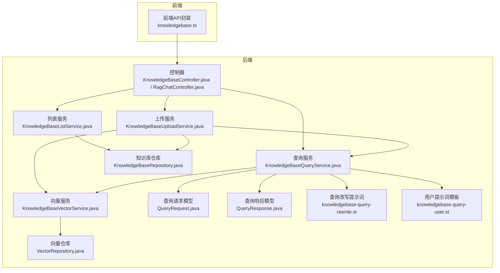
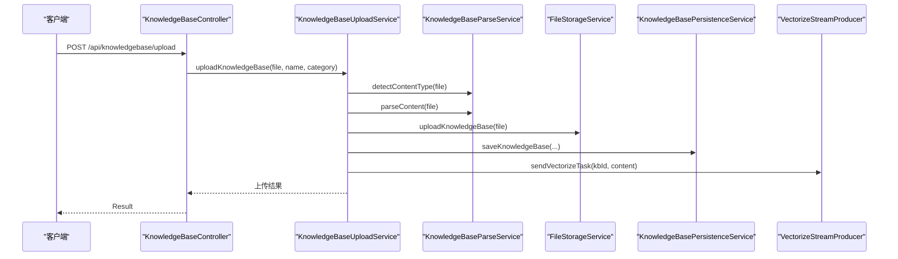
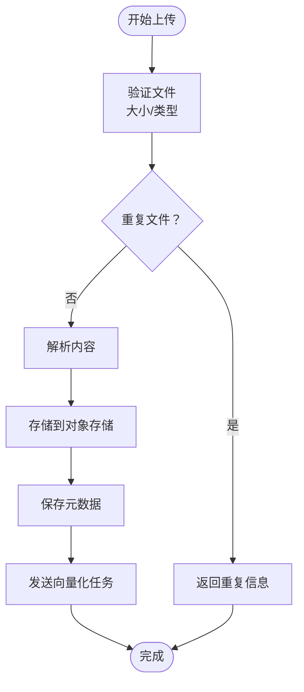
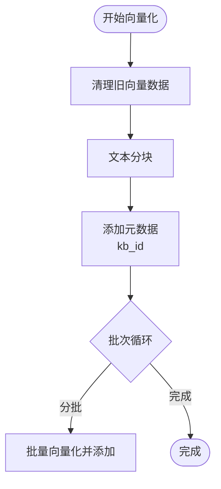
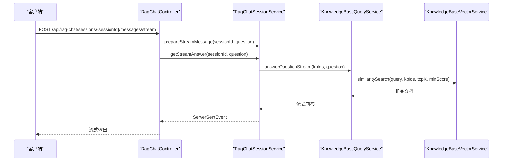
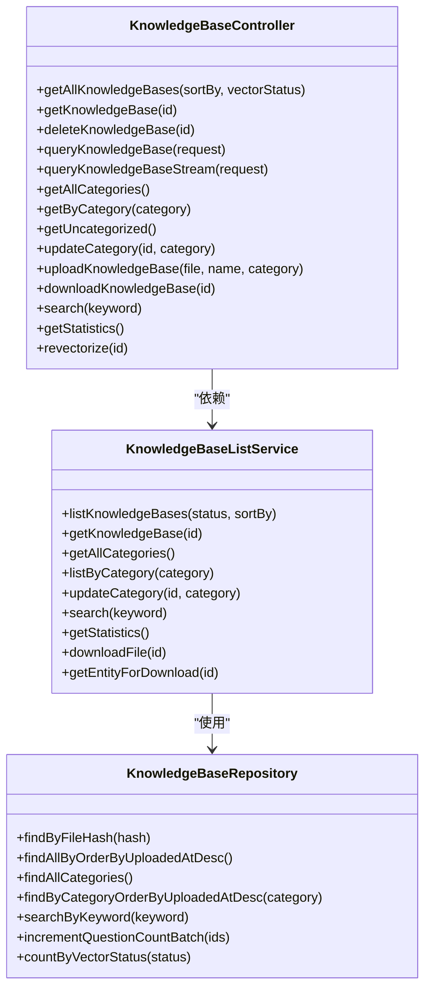
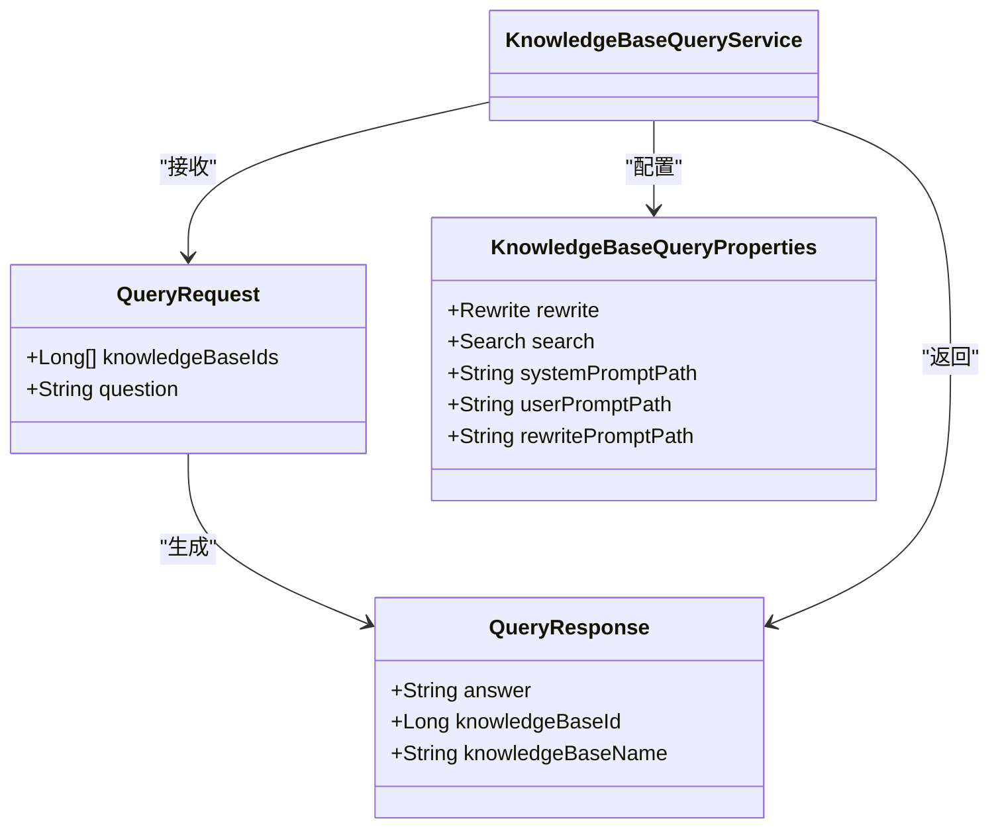
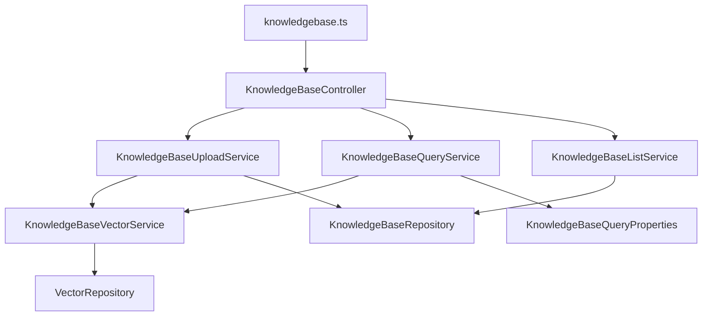

# 知识库API接口

<cite>
**本文档引用的文件**
- [KnowledgeBaseController.java](file://app/src/main/java/interview/guide/modules/knowledgebase/KnowledgeBaseController.java)
- [RagChatController.java](file://app/src/main/java/interview/guide/modules/knowledgebase/RagChatController.java)
- [KnowledgeBaseUploadService.java](file://app/src/main/java/interview/guide/modules/knowledgebase/service/KnowledgeBaseUploadService.java)
- [KnowledgeBaseVectorService.java](file://app/src/main/java/interview/guide/modules/knowledgebase/service/KnowledgeBaseVectorService.java)
- [KnowledgeBaseQueryService.java](file://app/src/main/java/interview/guide/modules/knowledgebase/service/KnowledgeBaseQueryService.java)
- [KnowledgeBaseListService.java](file://app/src/main/java/interview/guide/modules/knowledgebase/service/KnowledgeBaseListService.java)
- [KnowledgeBaseQueryProperties.java](file://app/src/main/java/interview/guide/modules/knowledgebase/service/KnowledgeBaseQueryProperties.java)
- [KnowledgeBaseRepository.java](file://app/src/main/java/interview/guide/modules/knowledgebase/repository/KnowledgeBaseRepository.java)
- [VectorRepository.java](file://app/src/main/java/interview/guide/modules/knowledgebase/repository/VectorRepository.java)
- [QueryRequest.java](file://app/src/main/java/interview/guide/modules/knowledgebase/model/QueryRequest.java)
- [QueryResponse.java](file://app/src/main/java/interview/guide/modules/knowledgebase/model/QueryResponse.java)
- [knowledgebase.ts](file://frontend/src/api/knowledgebase.ts)
- [knowledgebase-query-rewrite.st](file://app/src/main/resources/prompts/knowledgebase-query-rewrite.st)
- [knowledgebase-query-user.st](file://app/src/main/resources/prompts/knowledgebase-query-user.st)
</cite>

## 目录
1. [简介](#简介)
2. [项目结构](#项目结构)
3. [核心组件](#核心组件)
4. [架构概览](#架构概览)
5. [详细组件分析](#详细组件分析)
6. [依赖分析](#依赖分析)
7. [性能考虑](#性能考虑)
8. [故障排除指南](#故障排除指南)
9. [结论](#结论)
10. [附录](#附录)

## 简介
本项目提供一套完整的知识库管理RESTful API，涵盖文档上传、向量化处理、RAG问答、智能检索、分类管理、统计查询等功能。系统采用异步向量化处理、流式SSE响应、查询重写与动态参数检索等技术，确保高性能与良好的用户体验。

## 项目结构
知识库模块位于后端应用的modules/knowledgebase目录下，包含控制器、服务层、仓库层、模型与资源文件。前端API封装位于frontend/src/api/knowledgebase.ts，提供完整的调用示例与错误处理。

**图表来源**
- [KnowledgeBaseController.java:33-210](file://app/src/main/java/interview/guide/modules/knowledgebase/KnowledgeBaseController.java#L33-L210)
- [RagChatController.java:20-137](file://app/src/main/java/interview/guide/modules/knowledgebase/RagChatController.java#L20-L137)
- [KnowledgeBaseUploadService.java:25-144](file://app/src/main/java/interview/guide/modules/knowledgebase/service/KnowledgeBaseUploadService.java#L25-L144)
- [KnowledgeBaseQueryService.java:33-460](file://app/src/main/java/interview/guide/modules/knowledgebase/service/KnowledgeBaseQueryService.java#L33-L460)
- [KnowledgeBaseVectorService.java:23-202](file://app/src/main/java/interview/guide/modules/knowledgebase/service/KnowledgeBaseVectorService.java#L23-L202)
- [KnowledgeBaseListService.java:26-218](file://app/src/main/java/interview/guide/modules/knowledgebase/service/KnowledgeBaseListService.java#L26-L218)

**章节来源**
- [KnowledgeBaseController.java:33-210](file://app/src/main/java/interview/guide/modules/knowledgebase/KnowledgeBaseController.java#L33-L210)
- [RagChatController.java:20-137](file://app/src/main/java/interview/guide/modules/knowledgebase/RagChatController.java#L20-L137)

## 核心组件
- 控制器层：提供RESTful接口，包括知识库管理、分类管理、上传下载、搜索统计、向量化管理、RAG问答等。
- 服务层：实现业务逻辑，包括上传处理、向量化、查询与RAG、列表与统计、聊天会话等。
- 仓库层：数据持久化，包括知识库实体与向量数据的增删改查。
- 模型层：请求与响应的数据结构定义。
- 资源文件：提示词模板，支持查询重写与RAG问答。

**章节来源**
- [KnowledgeBaseUploadService.java:25-144](file://app/src/main/java/interview/guide/modules/knowledgebase/service/KnowledgeBaseUploadService.java#L25-L144)
- [KnowledgeBaseVectorService.java:23-202](file://app/src/main/java/interview/guide/modules/knowledgebase/service/KnowledgeBaseVectorService.java#L23-L202)
- [KnowledgeBaseQueryService.java:33-460](file://app/src/main/java/interview/guide/modules/knowledgebase/service/KnowledgeBaseQueryService.java#L33-L460)
- [KnowledgeBaseListService.java:26-218](file://app/src/main/java/interview/guide/modules/knowledgebase/service/KnowledgeBaseListService.java#L26-L218)

## 架构概览
系统采用分层架构，控制器负责HTTP请求处理，服务层封装业务逻辑，仓库层处理数据持久化。向量化采用异步处理，通过消息队列实现解耦；RAG问答结合查询重写与动态参数检索，提升召回质量。

**图表来源**
- [KnowledgeBaseController.java:144-153](file://app/src/main/java/interview/guide/modules/knowledgebase/KnowledgeBaseController.java#L144-L153)
- [KnowledgeBaseUploadService.java:48-102](file://app/src/main/java/interview/guide/modules/knowledgebase/service/KnowledgeBaseUploadService.java#L48-L102)

**章节来源**
- [KnowledgeBaseController.java:144-153](file://app/src/main/java/interview/guide/modules/knowledgebase/KnowledgeBaseController.java#L144-L153)
- [KnowledgeBaseUploadService.java:48-102](file://app/src/main/java/interview/guide/modules/knowledgebase/service/KnowledgeBaseUploadService.java#L48-L102)

## 详细组件分析

### 文档上传接口
- 支持单文件上传，自动验证文件类型与大小，支持去重检测。
- 解析文件内容用于向量化，存储到对象存储，并记录元数据。
- 异步发送向量化任务，返回上传结果与向量化状态。

**图表来源**
- [KnowledgeBaseUploadService.java:48-102](file://app/src/main/java/interview/guide/modules/knowledgebase/service/KnowledgeBaseUploadService.java#L48-L102)

**章节来源**
- [KnowledgeBaseUploadService.java:48-102](file://app/src/main/java/interview/guide/modules/knowledgebase/service/KnowledgeBaseUploadService.java#L48-L102)

### 向量化处理流程
- 文本分块：使用基于token的分块器，统一metadata包含知识库ID。
- 向量生成：分批调用向量存储API，批大小受外部服务限制。
- 索引建立：将分块与向量写入向量存储，支持按知识库过滤检索。

**图表来源**
- [KnowledgeBaseVectorService.java:45-81](file://app/src/main/java/interview/guide/modules/knowledgebase/service/KnowledgeBaseVectorService.java#L45-L81)

**章节来源**
- [KnowledgeBaseVectorService.java:45-81](file://app/src/main/java/interview/guide/modules/knowledgebase/service/KnowledgeBaseVectorService.java#L45-L81)
- [VectorRepository.java:31-64](file://app/src/main/java/interview/guide/modules/knowledgebase/repository/VectorRepository.java#L31-L64)

### RAG问答接口
- 查询重写：启用时对短查询进行改写，提升检索效果。
- 相似度搜索：根据查询长度动态调整topK与最小相似度阈值。
- 上下文检索：合并相关文档片段构建上下文。
- 答案生成：使用系统与用户提示词模板调用大模型生成回答。
- 流式响应：SSE流式输出，支持探测窗口快速识别无信息模板。

**图表来源**
- [RagChatController.java:102-136](file://app/src/main/java/interview/guide/modules/knowledgebase/RagChatController.java#L102-L136)
- [KnowledgeBaseQueryService.java:196-245](file://app/src/main/java/interview/guide/modules/knowledgebase/service/KnowledgeBaseQueryService.java#L196-L245)

**章节来源**
- [RagChatController.java:102-136](file://app/src/main/java/interview/guide/modules/knowledgebase/RagChatController.java#L102-L136)
- [KnowledgeBaseQueryService.java:196-245](file://app/src/main/java/interview/guide/modules/knowledgebase/service/KnowledgeBaseQueryService.java#L196-L245)

### 知识库管理API
- 列表与详情：支持按向量化状态过滤、排序与搜索。
- 分类管理：获取所有分类、按分类筛选、更新分类。
- 删除与下载：删除知识库、下载原始文件。
- 统计信息：获取总数、提问次数、访问次数、向量化状态统计。

**图表来源**
- [KnowledgeBaseController.java:47-210](file://app/src/main/java/interview/guide/modules/knowledgebase/KnowledgeBaseController.java#L47-L210)
- [KnowledgeBaseListService.java:43-218](file://app/src/main/java/interview/guide/modules/knowledgebase/service/KnowledgeBaseListService.java#L43-L218)
- [KnowledgeBaseRepository.java:18-106](file://app/src/main/java/interview/guide/modules/knowledgebase/repository/KnowledgeBaseRepository.java#L18-L106)

**章节来源**
- [KnowledgeBaseController.java:47-210](file://app/src/main/java/interview/guide/modules/knowledgebase/KnowledgeBaseController.java#L47-L210)
- [KnowledgeBaseListService.java:43-218](file://app/src/main/java/interview/guide/modules/knowledgebase/service/KnowledgeBaseListService.java#L43-L218)
- [KnowledgeBaseRepository.java:18-106](file://app/src/main/java/interview/guide/modules/knowledgebase/repository/KnowledgeBaseRepository.java#L18-L106)

### 查询与检索
- 查询请求模型：支持多知识库ID与问题文本。
- 查询响应模型：包含答案、主知识库ID与名称。
- 查询属性配置：支持查询重写开关、不同长度查询的topK与相似度阈值。

**图表来源**
- [QueryRequest.java:11-24](file://app/src/main/java/interview/guide/modules/knowledgebase/model/QueryRequest.java#L11-L24)
- [QueryResponse.java:6-10](file://app/src/main/java/interview/guide/modules/knowledgebase/model/QueryResponse.java#L6-L10)
- [KnowledgeBaseQueryProperties.java:9-32](file://app/src/main/java/interview/guide/modules/knowledgebase/service/KnowledgeBaseQueryProperties.java#L9-L32)

**章节来源**
- [QueryRequest.java:11-24](file://app/src/main/java/interview/guide/modules/knowledgebase/model/QueryRequest.java#L11-L24)
- [QueryResponse.java:6-10](file://app/src/main/java/interview/guide/modules/knowledgebase/model/QueryResponse.java#L6-L10)
- [KnowledgeBaseQueryProperties.java:9-32](file://app/src/main/java/interview/guide/modules/knowledgebase/service/KnowledgeBaseQueryProperties.java#L9-L32)

## 依赖分析
- 控制器依赖服务层，服务层依赖仓库层与基础设施组件。
- 向量化服务依赖向量存储与分块器，支持按知识库过滤。
- 查询服务依赖向量服务与提示词模板，支持查询重写与动态参数。
- 前端API封装与后端控制器一一对应，提供完整的调用示例。

**图表来源**
- [KnowledgeBaseController.java:39-42](file://app/src/main/java/interview/guide/modules/knowledgebase/KnowledgeBaseController.java#L39-L42)
- [KnowledgeBaseUploadService.java:30-36](file://app/src/main/java/interview/guide/modules/knowledgebase/service/KnowledgeBaseUploadService.java#L30-L36)
- [KnowledgeBaseQueryService.java:61-91](file://app/src/main/java/interview/guide/modules/knowledgebase/service/KnowledgeBaseQueryService.java#L61-L91)
- [knowledgebase.ts:62-280](file://frontend/src/api/knowledgebase.ts#L62-L280)

**章节来源**
- [KnowledgeBaseController.java:39-42](file://app/src/main/java/interview/guide/modules/knowledgebase/KnowledgeBaseController.java#L39-L42)
- [KnowledgeBaseUploadService.java:30-36](file://app/src/main/java/interview/guide/modules/knowledgebase/service/KnowledgeBaseUploadService.java#L30-L36)
- [KnowledgeBaseQueryService.java:61-91](file://app/src/main/java/interview/guide/modules/knowledgebase/service/KnowledgeBaseQueryService.java#L61-L91)
- [knowledgebase.ts:62-280](file://frontend/src/api/knowledgebase.ts#L62-L280)

## 性能考虑
- 异步向量化：上传完成后立即返回，向量化在后台异步执行，避免阻塞。
- 分批向量化：按外部服务批大小限制进行分批处理，平衡吞吐与延迟。
- 动态参数检索：根据查询长度与复杂度动态调整topK与相似度阈值，减少无关命中。
- 流式SSE：支持实时输出，探测窗口快速识别无信息模板，提升用户体验。
- 数据库优化：提供多种排序与过滤选项，支持按向量化状态统计，便于运维监控。

## 故障排除指南
- 文件上传失败：检查文件类型与大小限制，确认对象存储连接正常。
- 向量化失败：查看向量化服务日志，确认分块与嵌入API可用性。
- 查询无结果：启用查询重写，调整相似度阈值，确认知识库已向量化完成。
- 流式响应异常：检查SSE连接与网络状况，确认前端流式处理逻辑正确。

**章节来源**
- [KnowledgeBaseUploadService.java:123-142](file://app/src/main/java/interview/guide/modules/knowledgebase/service/KnowledgeBaseUploadService.java#L123-L142)
- [KnowledgeBaseVectorService.java:76-81](file://app/src/main/java/interview/guide/modules/knowledgebase/service/KnowledgeBaseVectorService.java#L76-L81)
- [KnowledgeBaseQueryService.java:241-245](file://app/src/main/java/interview/guide/modules/knowledgebase/service/KnowledgeBaseQueryService.java#L241-L245)

## 结论
本知识库API接口提供了完整的文档管理、向量化处理与RAG问答能力，具备良好的扩展性与性能表现。通过异步处理与流式响应，系统能够满足高并发场景下的用户体验需求。

## 附录

### API调用示例
- 向量查询：使用流式SSE接口，支持实时输出与错误处理。
- 语义搜索：通过相似度搜索接口，按知识库ID过滤检索结果。
- 知识库统计：获取总数、提问次数、访问次数与向量化状态统计。

**章节来源**
- [knowledgebase.ts:174-280](file://frontend/src/api/knowledgebase.ts#L174-L280)
- [KnowledgeBaseQueryService.java:91-125](file://app/src/main/java/interview/guide/modules/knowledgebase/service/KnowledgeBaseQueryService.java#L91-L125)
- [KnowledgeBaseListService.java:183-191](file://app/src/main/java/interview/guide/modules/knowledgebase/service/KnowledgeBaseListService.java#L183-L191)