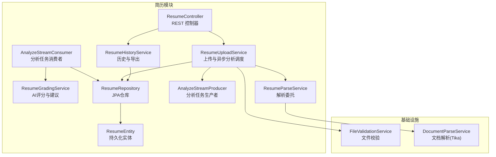
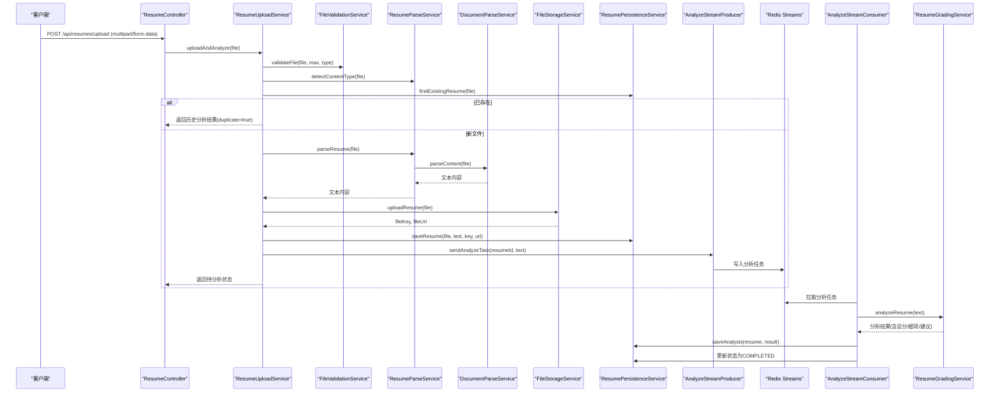
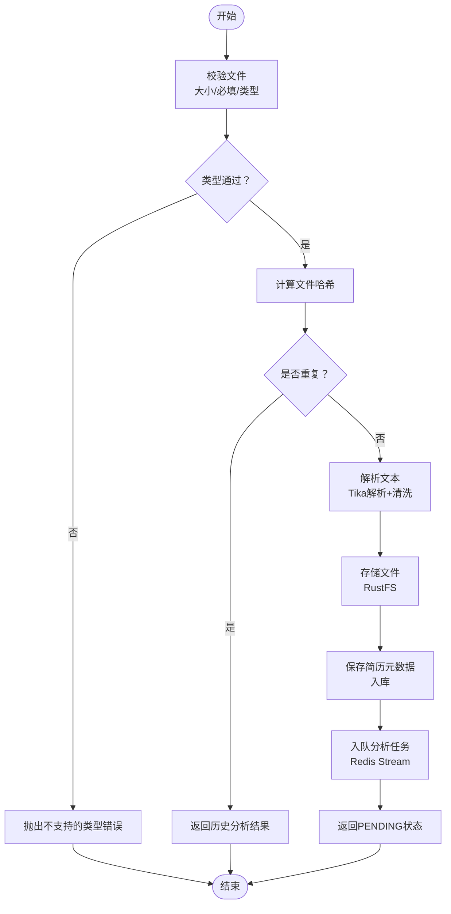
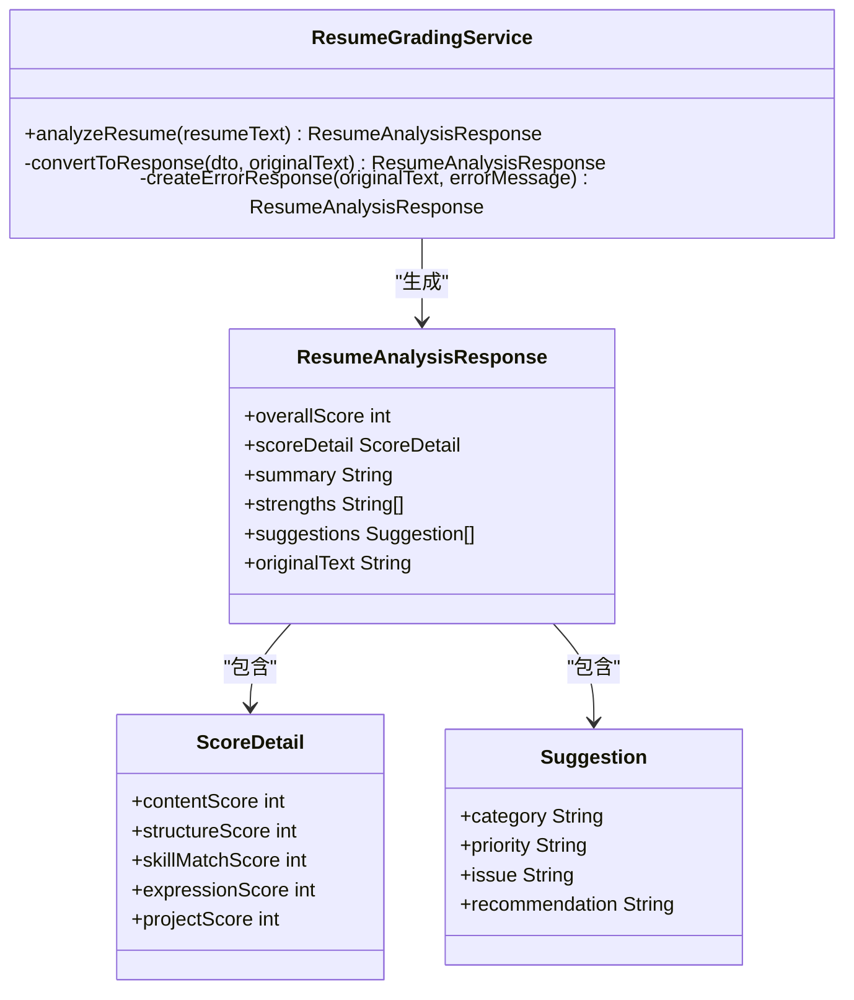
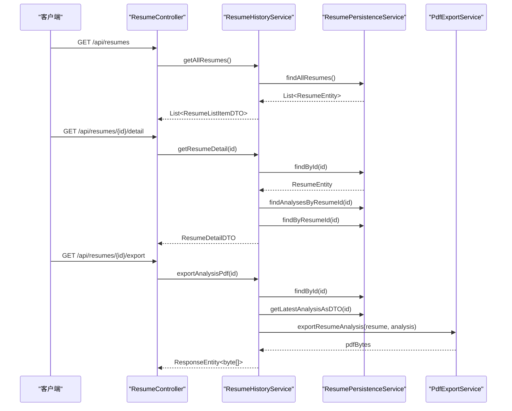
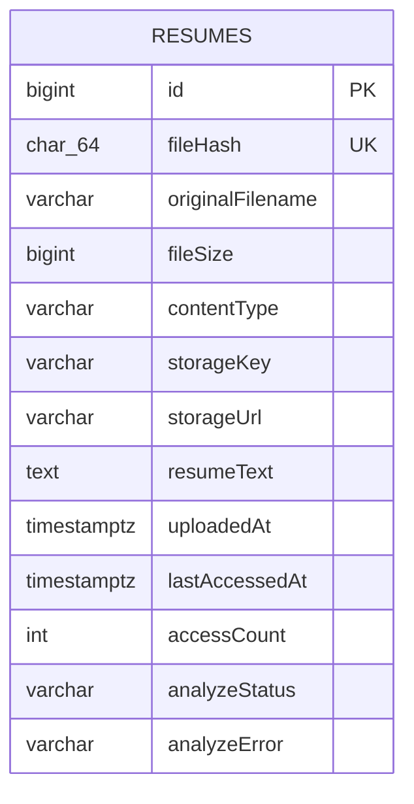
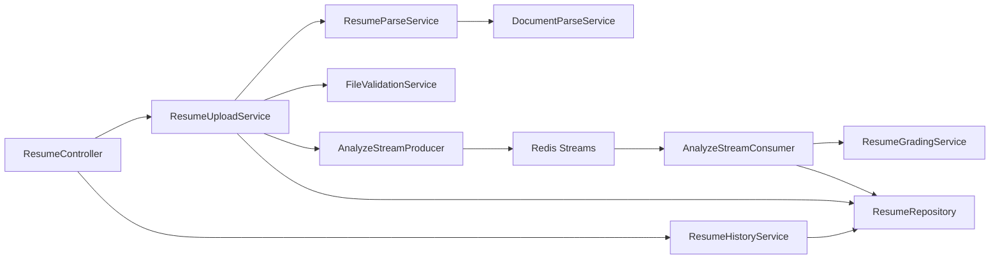

# 简历API接口

<cite>
**本文档引用的文件**
- [ResumeController.java](file://app/src/main/java/interview/guide/modules/resume/ResumeController.java)
- [ResumeUploadService.java](file://app/src/main/java/interview/guide/modules/resume/service/ResumeUploadService.java)
- [ResumeParseService.java](file://app/src/main/java/interview/guide/modules/resume/service/ResumeParseService.java)
- [ResumeGradingService.java](file://app/src/main/java/interview/guide/modules/resume/service/ResumeGradingService.java)
- [ResumeHistoryService.java](file://app/src/main/java/interview/guide/modules/resume/service/ResumeHistoryService.java)
- [AnalyzeStreamConsumer.java](file://app/src/main/java/interview/guide/modules/resume/listener/AnalyzeStreamConsumer.java)
- [AnalyzeStreamProducer.java](file://app/src/main/java/interview/guide/modules/resume/listener/AnalyzeStreamProducer.java)
- [ResumeEntity.java](file://app/src/main/java/interview/guide/modules/resume/model/ResumeEntity.java)
- [ResumeDetailDTO.java](file://app/src/main/java/interview/guide/modules/resume/model/ResumeDetailDTO.java)
- [ResumeRepository.java](file://app/src/main/java/interview/guide/modules/resume/repository/ResumeRepository.java)
- [FileValidationService.java](file://app/src/main/java/interview/guide/infrastructure/file/FileValidationService.java)
- [DocumentParseService.java](file://app/src/main/java/interview/guide/infrastructure/file/DocumentParseService.java)
</cite>

## 目录
1. [简介](#简介)
2. [项目结构](#项目结构)
3. [核心组件](#核心组件)
4. [架构总览](#架构总览)
5. [详细组件分析](#详细组件分析)
6. [依赖关系分析](#依赖关系分析)
7. [性能考量](#性能考量)
8. [故障排除指南](#故障排除指南)
9. [结论](#结论)
10. [附录](#附录)

## 简介
本文件面向简历管理与分析系统的RESTful API，覆盖简历上传、解析、异步分析、评分与建议、历史记录查询、PDF导出以及删除等完整能力。系统采用异步流式处理（Redis Streams）实现AI分析的解耦与弹性，支持多格式文档解析，并内置重复检测、速率限制与错误回退机制。

## 项目结构
简历模块位于后端应用的模块化目录下，控制器负责对外暴露HTTP接口，服务层封装业务逻辑，监听器负责异步消费与生产分析任务，基础设施层提供文件解析、存储、校验等通用能力。

图表来源
- [ResumeController.java:1-132](file://app/src/main/java/interview/guide/modules/resume/ResumeController.java#L1-L132)
- [ResumeUploadService.java:1-201](file://app/src/main/java/interview/guide/modules/resume/service/ResumeUploadService.java#L1-L201)
- [ResumeHistoryService.java:1-184](file://app/src/main/java/interview/guide/modules/resume/service/ResumeHistoryService.java#L1-L184)
- [ResumeGradingService.java:1-177](file://app/src/main/java/interview/guide/modules/resume/service/ResumeGradingService.java#L1-L177)
- [ResumeParseService.java:1-66](file://app/src/main/java/interview/guide/modules/resume/service/ResumeParseService.java#L1-L66)
- [AnalyzeStreamProducer.java:1-82](file://app/src/main/java/interview/guide/modules/resume/listener/AnalyzeStreamProducer.java#L1-L82)
- [AnalyzeStreamConsumer.java:1-158](file://app/src/main/java/interview/guide/modules/resume/listener/AnalyzeStreamConsumer.java#L1-L158)
- [ResumeEntity.java:1-184](file://app/src/main/java/interview/guide/modules/resume/model/ResumeEntity.java#L1-L184)
- [ResumeRepository.java:1-25](file://app/src/main/java/interview/guide/modules/resume/repository/ResumeRepository.java#L1-L25)
- [FileValidationService.java:1-129](file://app/src/main/java/interview/guide/infrastructure/file/FileValidationService.java#L1-L129)
- [DocumentParseService.java:1-164](file://app/src/main/java/interview/guide/infrastructure/file/DocumentParseService.java#L1-L164)

章节来源
- [ResumeController.java:1-132](file://app/src/main/java/interview/guide/modules/resume/ResumeController.java#L1-L132)
- [ResumeUploadService.java:1-201](file://app/src/main/java/interview/guide/modules/resume/service/ResumeUploadService.java#L1-L201)
- [ResumeHistoryService.java:1-184](file://app/src/main/java/interview/guide/modules/resume/service/ResumeHistoryService.java#L1-L184)
- [ResumeGradingService.java:1-177](file://app/src/main/java/interview/guide/modules/resume/service/ResumeGradingService.java#L1-L177)
- [ResumeParseService.java:1-66](file://app/src/main/java/interview/guide/modules/resume/service/ResumeParseService.java#L1-L66)
- [AnalyzeStreamProducer.java:1-82](file://app/src/main/java/interview/guide/modules/resume/listener/AnalyzeStreamProducer.java#L1-L82)
- [AnalyzeStreamConsumer.java:1-158](file://app/src/main/java/interview/guide/modules/resume/listener/AnalyzeStreamConsumer.java#L1-L158)
- [ResumeEntity.java:1-184](file://app/src/main/java/interview/guide/modules/resume/model/ResumeEntity.java#L1-L184)
- [ResumeRepository.java:1-25](file://app/src/main/java/interview/guide/modules/resume/repository/ResumeRepository.java#L1-L25)
- [FileValidationService.java:1-129](file://app/src/main/java/interview/guide/infrastructure/file/FileValidationService.java#L1-L129)
- [DocumentParseService.java:1-164](file://app/src/main/java/interview/guide/infrastructure/file/DocumentParseService.java#L1-L164)

## 核心组件
- 控制器层：提供REST接口，负责参数接收、限流与结果封装。
- 服务层：
  - 上传与解析：文件校验、类型检测、重复检测、文本解析、存储、数据库落库、异步分析任务投递。
  - 历史与导出：查询简历列表、详情、导出PDF。
  - AI评分：基于提示模板与结构化输出，生成总分、细项得分、总结、优势与建议。
- 异步处理：生产者将分析任务写入Redis Stream；消费者拉取任务、调用AI评分、持久化结果。
- 数据模型：简历实体、详情DTO、仓库接口。
- 基础设施：文件校验、文档解析（Apache Tika）、内容清洗。

章节来源
- [ResumeController.java:38-129](file://app/src/main/java/interview/guide/modules/resume/ResumeController.java#L38-L129)
- [ResumeUploadService.java:47-110](file://app/src/main/java/interview/guide/modules/resume/service/ResumeUploadService.java#L47-L110)
- [ResumeHistoryService.java:43-114](file://app/src/main/java/interview/guide/modules/resume/service/ResumeHistoryService.java#L43-L114)
- [ResumeGradingService.java:86-130](file://app/src/main/java/interview/guide/modules/resume/service/ResumeGradingService.java#L86-L130)
- [AnalyzeStreamProducer.java:36-57](file://app/src/main/java/interview/guide/modules/resume/listener/AnalyzeStreamProducer.java#L36-L57)
- [AnalyzeStreamConsumer.java:91-105](file://app/src/main/java/interview/guide/modules/resume/listener/AnalyzeStreamConsumer.java#L91-L105)
- [ResumeEntity.java:12-66](file://app/src/main/java/interview/guide/modules/resume/model/ResumeEntity.java#L12-L66)
- [ResumeDetailDTO.java:11-41](file://app/src/main/java/interview/guide/modules/resume/model/ResumeDetailDTO.java#L11-L41)
- [ResumeRepository.java:13-24](file://app/src/main/java/interview/guide/modules/resume/repository/ResumeRepository.java#L13-L24)
- [FileValidationService.java:27-50](file://app/src/main/java/interview/guide/infrastructure/file/FileValidationService.java#L27-L50)
- [DocumentParseService.java:45-91](file://app/src/main/java/interview/guide/infrastructure/file/DocumentParseService.java#L45-L91)

## 架构总览
系统采用“同步接口 + 异步分析”的模式：
- 客户端上传简历后，立即返回“待分析”状态；后台通过Redis Stream异步执行AI分析。
- 解析与存储采用通用服务，支持多格式文档；重复简历通过内容哈希去重。
- 历史查询与导出PDF由历史服务统一提供。

图表来源
- [ResumeController.java:44-54](file://app/src/main/java/interview/guide/modules/resume/ResumeController.java#L44-L54)
- [ResumeUploadService.java:47-110](file://app/src/main/java/interview/guide/modules/resume/service/ResumeUploadService.java#L47-L110)
- [ResumeParseService.java:30-33](file://app/src/main/java/interview/guide/modules/resume/service/ResumeParseService.java#L30-L33)
- [DocumentParseService.java:45-64](file://app/src/main/java/interview/guide/infrastructure/file/DocumentParseService.java#L45-L64)
- [AnalyzeStreamProducer.java:36-57](file://app/src/main/java/interview/guide/modules/resume/listener/AnalyzeStreamProducer.java#L36-L57)
- [AnalyzeStreamConsumer.java:91-105](file://app/src/main/java/interview/guide/modules/resume/listener/AnalyzeStreamConsumer.java#L91-L105)
- [ResumeGradingService.java:86-130](file://app/src/main/java/interview/guide/modules/resume/service/ResumeGradingService.java#L86-L130)

## 详细组件分析

### 接口定义与调用示例
- 上传并分析简历
  - 方法与路径：POST /api/resumes/upload
  - 请求体：multipart/form-data，字段名为file
  - 成功响应：包含简历基本信息、存储信息与duplicate标志；若重复则返回历史分析结果
  - 速率限制：全局与IP维度各限流
  - 示例场景：单文件上传、重复文件检测、异步状态轮询
- 获取简历列表
  - 方法与路径：GET /api/resumes
  - 响应：简历列表项（含最新分数、分析时间、面试次数等）
- 获取简历详情
  - 方法与路径：GET /api/resumes/{id}/detail
  - 响应：简历详情（含分析历史、面试历史）
- 导出PDF
  - 方法与路径：GET /api/resumes/{id}/export
  - 响应：application/pdf，文件名为UTF-8编码
- 删除简历
  - 方法与路径：DELETE /api/resumes/{id}
  - 响应：空结果
- 重新分析
  - 方法与路径：POST /api/resumes/{id}/reanalyze
  - 用途：分析失败或需要重试时手动触发
- 健康检查
  - 方法与路径：GET /api/resumes/health
  - 响应：服务状态

章节来源
- [ResumeController.java:44-129](file://app/src/main/java/interview/guide/modules/resume/ResumeController.java#L44-L129)

### 文件上传与解析流程
- 文件校验
  - 必填性、大小上限（默认10MB）、类型白名单（通过配置注入）
- 类型检测
  - 基于MIME类型与扩展名的双重校验，支持模糊匹配
- 重复检测
  - 基于文件内容哈希（SHA-256）去重，命中则直接返回历史分析结果
- 文本解析
  - 使用Apache Tika自动检测解析器，限制最大文本长度，禁用嵌入资源抽取，提升稳定性
- 存储与落库
  - 将文件上传至对象存储，记录存储键与URL；同时保存简历元数据与解析文本
- 异步分析
  - 将简历ID与文本写入Redis Stream，消费者拉取后调用AI评分服务并持久化结果

图表来源
- [ResumeUploadService.java:47-110](file://app/src/main/java/interview/guide/modules/resume/service/ResumeUploadService.java#L47-L110)
- [FileValidationService.java:27-50](file://app/src/main/java/interview/guide/infrastructure/file/FileValidationService.java#L27-L50)
- [DocumentParseService.java:108-139](file://app/src/main/java/interview/guide/infrastructure/file/DocumentParseService.java#L108-L139)
- [AnalyzeStreamProducer.java:36-57](file://app/src/main/java/interview/guide/modules/resume/listener/AnalyzeStreamProducer.java#L36-L57)

章节来源
- [ResumeUploadService.java:39-130](file://app/src/main/java/interview/guide/modules/resume/service/ResumeUploadService.java#L39-L130)
- [FileValidationService.java:27-50](file://app/src/main/java/interview/guide/infrastructure/file/FileValidationService.java#L27-L50)
- [DocumentParseService.java:45-91](file://app/src/main/java/interview/guide/infrastructure/file/DocumentParseService.java#L45-L91)

### 简历评分与分析
- 输入：简历纯文本
- 输出：总分、内容分、结构分、技能匹配分、表达分、项目分、摘要、优势列表、建议列表
- 实现要点：
  - 通过提示模板加载系统与用户提示词
  - 使用结构化输出转换器约束LLM输出格式
  - 失败时返回兜底错误响应并记录分析状态

图表来源
- [ResumeGradingService.java:86-130](file://app/src/main/java/interview/guide/modules/resume/service/ResumeGradingService.java#L86-L130)
- [ResumeGradingService.java:135-156](file://app/src/main/java/interview/guide/modules/resume/service/ResumeGradingService.java#L135-L156)

章节来源
- [ResumeGradingService.java:28-78](file://app/src/main/java/interview/guide/modules/resume/service/ResumeGradingService.java#L28-L78)
- [ResumeGradingService.java:86-130](file://app/src/main/java/interview/guide/modules/resume/service/ResumeGradingService.java#L86-L130)

### 历史记录与导出
- 列表查询：聚合最新分析分数、分析时间、面试次数、分析状态与错误信息
- 详情查询：返回简历元数据、文本、分析历史（JSON字段反序列化）、面试历史
- PDF导出：基于最新分析结果生成PDF报告，文件名UTF-8编码

图表来源
- [ResumeController.java:59-91](file://app/src/main/java/interview/guide/modules/resume/ResumeController.java#L59-L91)
- [ResumeHistoryService.java:43-114](file://app/src/main/java/interview/guide/modules/resume/service/ResumeHistoryService.java#L43-L114)
- [ResumeHistoryService.java:155-176](file://app/src/main/java/interview/guide/modules/resume/service/ResumeHistoryService.java#L155-L176)

章节来源
- [ResumeHistoryService.java:43-114](file://app/src/main/java/interview/guide/modules/resume/service/ResumeHistoryService.java#L43-L114)
- [ResumeHistoryService.java:155-176](file://app/src/main/java/interview/guide/modules/resume/service/ResumeHistoryService.java#L155-L176)

### 数据模型
- 实体：包含文件哈希、原始名、大小、类型、存储键/URL、解析文本、上传/访问时间、访问计数、分析状态与错误等
- DTO：详情DTO包含分析历史与面试历史列表

图表来源
- [ResumeEntity.java:12-66](file://app/src/main/java/interview/guide/modules/resume/model/ResumeEntity.java#L12-L66)

章节来源
- [ResumeEntity.java:12-66](file://app/src/main/java/interview/guide/modules/resume/model/ResumeEntity.java#L12-L66)
- [ResumeDetailDTO.java:11-41](file://app/src/main/java/interview/guide/modules/resume/model/ResumeDetailDTO.java#L11-L41)
- [ResumeRepository.java:13-24](file://app/src/main/java/interview/guide/modules/resume/repository/ResumeRepository.java#L13-L24)

## 依赖关系分析
- 控制器依赖服务层；服务层依赖基础设施与仓库；消费者依赖评分与持久化服务；生产者依赖仓库。
- 组件内聚高、耦合通过接口与抽象类（如Redis Stream基类）降低。
- 关键外部依赖：Redis Streams、对象存储、Apache Tika、提示模板与结构化输出。

图表来源
- [ResumeController.java:34-36](file://app/src/main/java/interview/guide/modules/resume/ResumeController.java#L34-L36)
- [ResumeUploadService.java:31-37](file://app/src/main/java/interview/guide/modules/resume/service/ResumeUploadService.java#L31-L37)
- [ResumeParseService.java:20-22](file://app/src/main/java/interview/guide/modules/resume/service/ResumeParseService.java#L20-L22)
- [DocumentParseService.java:35](file://app/src/main/java/interview/guide/infrastructure/file/DocumentParseService.java#L35)
- [AnalyzeStreamProducer.java:25-28](file://app/src/main/java/interview/guide/modules/resume/listener/AnalyzeStreamProducer.java#L25-L28)
- [AnalyzeStreamConsumer.java:30-40](file://app/src/main/java/interview/guide/modules/resume/listener/AnalyzeStreamConsumer.java#L30-L40)
- [ResumeGradingService.java:62-78](file://app/src/main/java/interview/guide/modules/resume/service/ResumeGradingService.java#L62-L78)
- [ResumeRepository.java:13-24](file://app/src/main/java/interview/guide/modules/resume/repository/ResumeRepository.java#L13-24)

章节来源
- [ResumeController.java:34-36](file://app/src/main/java/interview/guide/modules/resume/ResumeController.java#L34-L36)
- [ResumeUploadService.java:31-37](file://app/src/main/java/interview/guide/modules/resume/service/ResumeUploadService.java#L31-L37)
- [ResumeParseService.java:20-22](file://app/src/main/java/interview/guide/modules/resume/service/ResumeParseService.java#L20-L22)
- [DocumentParseService.java:35](file://app/src/main/java/interview/guide/infrastructure/file/DocumentParseService.java#L35)
- [AnalyzeStreamProducer.java:25-28](file://app/src/main/java/interview/guide/modules/resume/listener/AnalyzeStreamProducer.java#L25-L28)
- [AnalyzeStreamConsumer.java:30-40](file://app/src/main/java/interview/guide/modules/resume/listener/AnalyzeStreamConsumer.java#L30-L40)
- [ResumeGradingService.java:62-78](file://app/src/main/java/interview/guide/modules/resume/service/ResumeGradingService.java#L62-L78)
- [ResumeRepository.java:13-24](file://app/src/main/java/interview/guide/modules/resume/repository/ResumeRepository.java#L13-24)

## 性能考量
- 异步分析：上传接口立即返回，避免阻塞；消费者并发处理，提升吞吐。
- 文本解析优化：限制最大文本长度、禁用嵌入资源抽取、PDF按位置排序，减少解析开销与内存占用。
- 去重与缓存：基于哈希去重，避免重复解析与存储；必要时可缓存解析文本以支持重试。
- 限流与幂等：接口级限流，重复上传返回历史结果，避免重复工作。
- 存储与网络：对象存储上传与下载分离，解析与存储并行，缩短端到端延迟。

## 故障排除指南
- 文件类型不支持
  - 现象：返回“不支持的文件类型”
  - 排查：确认MIME类型与扩展名是否在允许列表中
- 文件过大
  - 现象：返回“文件大小超过限制”
  - 排查：检查上传文件大小是否超过10MB
- 解析失败
  - 现象：解析文本为空或异常
  - 排查：确认非扫描版PDF；查看Tika解析日志
- AI分析失败
  - 现象：分析状态为FAILED，返回兜底错误
  - 排查：检查提示模板加载、结构化输出约束、AI服务可用性
- 导出PDF失败
  - 现象：导出接口返回内部错误
  - 排查：确认存在最新分析结果、PDF导出服务可用

章节来源
- [FileValidationService.java:27-50](file://app/src/main/java/interview/guide/infrastructure/file/FileValidationService.java#L27-L50)
- [DocumentParseService.java:55-64](file://app/src/main/java/interview/guide/infrastructure/file/DocumentParseService.java#L55-L64)
- [ResumeGradingService.java:115-118](file://app/src/main/java/interview/guide/modules/resume/service/ResumeGradingService.java#L115-L118)
- [ResumeHistoryService.java:172-175](file://app/src/main/java/interview/guide/modules/resume/service/ResumeHistoryService.java#L172-L175)

## 结论
该简历API以清晰的分层架构与异步处理实现了高效稳定的简历上传、解析与分析能力。通过重复检测、限流与错误兜底，系统在保证用户体验的同时具备良好的可维护性与扩展性。建议后续关注提示模板的持续优化与分析结果的可视化呈现。

## 附录

### API定义概览
- 上传并分析简历
  - 方法：POST
  - 路径：/api/resumes/upload
  - 请求体：multipart/form-data，字段：file
  - 响应：包含简历ID、文件名、分析状态、存储信息；重复时返回历史分析结果
- 获取简历列表
  - 方法：GET
  - 路径：/api/resumes
  - 响应：列表项（含最新分数、分析时间、面试次数、状态与错误）
- 获取简历详情
  - 方法：GET
  - 路径：/api/resumes/{id}/detail
  - 响应：详情（含分析历史、面试历史）
- 导出PDF
  - 方法：GET
  - 路径：/api/resumes/{id}/export
  - 响应：application/pdf，带UTF-8编码文件名
- 删除简历
  - 方法：DELETE
  - 路径：/api/resumes/{id}
  - 响应：空结果
- 重新分析
  - 方法：POST
  - 路径：/api/resumes/{id}/reanalyze
  - 响应：空结果
- 健康检查
  - 方法：GET
  - 路径：/api/resumes/health
  - 响应：服务状态

章节来源
- [ResumeController.java:44-129](file://app/src/main/java/interview/guide/modules/resume/ResumeController.java#L44-L129)