# 语音面试API接口

<cite>
**本文档引用的文件**
- [VoiceInterviewController.java](file://app/src/main/java/interview/guide/modules/voiceinterview/controller/VoiceInterviewController.java)
- [VoiceInterviewWebSocketHandler.java](file://app/src/main/java/interview/guide/modules/voiceinterview/handler/VoiceInterviewWebSocketHandler.java)
- [VoiceInterviewService.java](file://app/src/main/java/interview/guide/modules/voiceinterview/service/VoiceInterviewService.java)
- [QwenAsrService.java](file://app/src/main/java/interview/guide/modules/voiceinterview/service/QwenAsrService.java)
- [QwenTtsService.java](file://app/src/main/java/interview/guide/modules/voiceinterview/service/QwenTtsService.java)
- [DashscopeLlmService.java](file://app/src/main/java/interview/guide/modules/voiceinterview/service/DashscopeLlmService.java)
- [CreateSessionRequest.java](file://app/src/main/java/interview/guide/modules/voiceinterview/dto/CreateSessionRequest.java)
- [VoiceInterviewSessionEntity.java](file://app/src/main/java/interview/guide/modules/voiceinterview/model/VoiceInterviewSessionEntity.java)
- [VoiceInterviewProperties.java](file://app/src/main/java/interview/guide/modules/voiceinterview/config/VoiceInterviewProperties.java)
- [voiceInterview.ts](file://frontend/src/api/voiceInterview.ts)
- [VoiceInterviewPage.tsx](file://frontend/src/pages/VoiceInterviewPage.tsx)
- [application.yml](file://app/src/main/resources/application.yml)
- [README.md](file://README.md)
</cite>

## 目录
1. [简介](#简介)
2. [项目结构](#项目结构)
3. [核心组件](#核心组件)
4. [架构概览](#架构概览)
5. [详细组件分析](#详细组件分析)
6. [依赖关系分析](#依赖关系分析)
7. [性能考虑](#性能考虑)
8. [故障排除指南](#故障排除指南)
9. [结论](#结论)
10. [附录](#附录)

## 简介

语音面试系统是一个基于实时语音技术的智能面试平台，集成了会话管理、WebSocket实时通信、ASR语音识别、TTS语音合成和AI对话等功能。该系统支持多轮对话、实时字幕、音频播放控制和评估结果获取等完整面试流程。

系统采用Spring Boot + React的技术栈，后端使用Java 21的虚拟线程技术，前端使用TypeScript和React，实现了高性能的实时语音面试体验。

## 项目结构

语音面试模块位于`app/src/main/java/interview/guide/modules/voiceinterview/`目录下，包含以下核心组件：

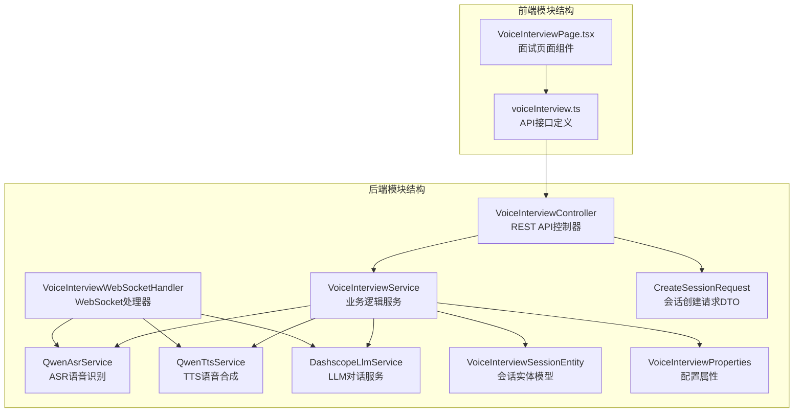

**图表来源**
- [VoiceInterviewController.java:1-201](file://app/src/main/java/interview/guide/modules/voiceinterview/controller/VoiceInterviewController.java#L1-L201)
- [VoiceInterviewService.java:1-582](file://app/src/main/java/interview/guide/modules/voiceinterview/service/VoiceInterviewService.java#L1-L582)
- [VoiceInterviewWebSocketHandler.java:1-800](file://app/src/main/java/interview/guide/modules/voiceinterview/handler/VoiceInterviewWebSocketHandler.java#L1-L800)

**章节来源**
- [README.md:118-129](file://README.md#L118-L129)

## 核心组件

### REST API控制器
VoiceInterviewController提供完整的REST API接口，包括会话管理、消息查询和评估状态获取等功能。

### WebSocket处理器
VoiceInterviewWebSocketHandler处理实时双向音频流，实现语音识别、AI对话和语音合成的完整管道。

### 语音处理服务
- **ASR服务**：基于阿里云DashScope的实时语音识别
- **TTS服务**：基于阿里云DashScope的实时语音合成
- **LLM服务**：基于Spring AI框架的对话服务

### 业务逻辑服务
VoiceInterviewService管理会话生命周期、状态转换和数据持久化。

**章节来源**
- [VoiceInterviewController.java:25-39](file://app/src/main/java/interview/guide/modules/voiceinterview/controller/VoiceInterviewController.java#L25-L39)
- [VoiceInterviewWebSocketHandler.java:45-56](file://app/src/main/java/interview/guide/modules/voiceinterview/handler/VoiceInterviewWebSocketHandler.java#L45-L56)
- [VoiceInterviewService.java:30-44](file://app/src/main/java/interview/guide/modules/voiceinterview/service/VoiceInterviewService.java#L30-L44)

## 架构概览

语音面试系统采用分层架构设计，实现了清晰的职责分离和高内聚低耦合的组件关系：

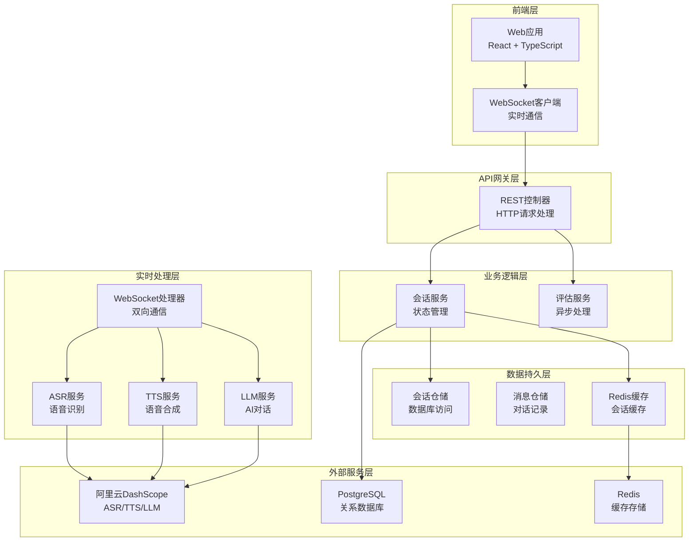

**图表来源**
- [VoiceInterviewController.java:35-38](file://app/src/main/java/interview/guide/modules/voiceinterview/controller/VoiceInterviewController.java#L35-L38)
- [VoiceInterviewService.java:41-44](file://app/src/main/java/interview/guide/modules/voiceinterview/service/VoiceInterviewService.java#L41-L44)
- [VoiceInterviewWebSocketHandler.java:53-56](file://app/src/main/java/interview/guide/modules/voiceinterview/handler/VoiceInterviewWebSocketHandler.java#L53-L56)

## 详细组件分析

### 会话创建接口

会话创建是语音面试流程的起点，负责初始化面试环境和资源配置。

#### 接口定义
- **URL**: `POST /api/voice-interview/sessions`
- **请求体**: CreateSessionRequest
- **响应体**: SessionResponseDTO

#### 请求参数配置
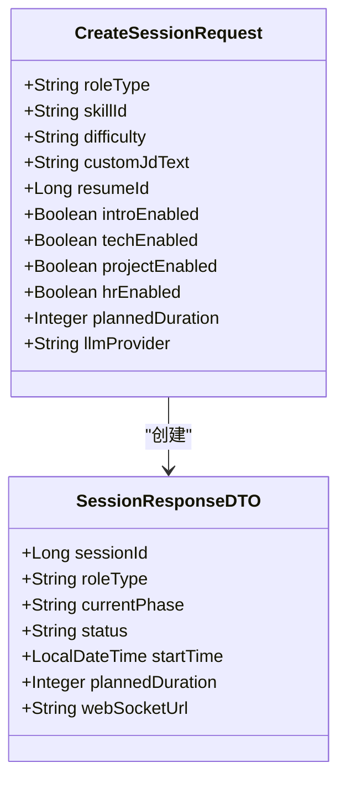

**图表来源**
- [CreateSessionRequest.java:8-33](file://app/src/main/java/interview/guide/modules/voiceinterview/dto/CreateSessionRequest.java#L8-L33)
- [VoiceInterviewService.java:482-492](file://app/src/main/java/interview/guide/modules/voiceinterview/service/VoiceInterviewService.java#L482-L492)

#### 会话生命周期管理
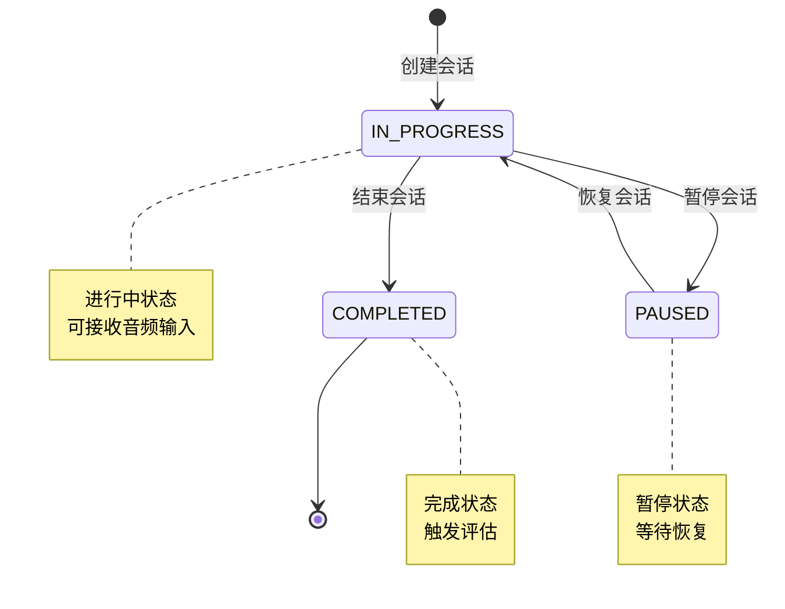

**图表来源**
- [VoiceInterviewSessionEntity.java:118-122](file://app/src/main/java/interview/guide/modules/voiceinterview/model/VoiceInterviewSessionEntity.java#L118-L122)
- [VoiceInterviewService.java:101-124](file://app/src/main/java/interview/guide/modules/voiceinterview/service/VoiceInterviewService.java#L101-L124)

#### 权限验证和资源分配
会话创建过程包含以下验证和分配机制：

1. **技能ID验证**: 确保提供的skillId在系统中有效
2. **难度级别验证**: 支持junior、mid、senior三个级别
3. **阶段配置验证**: 根据技能类型自动配置启用的面试阶段
4. **资源分配**: 为会话分配唯一的WebSocket URL和缓存键

**章节来源**
- [VoiceInterviewController.java:48-53](file://app/src/main/java/interview/guide/modules/voiceinterview/controller/VoiceInterviewController.java#L48-L53)
- [VoiceInterviewService.java:63-93](file://app/src/main/java/interview/guide/modules/voiceinterview/service/VoiceInterviewService.java#L63-L93)

### WebSocket实时通信协议

WebSocket协议是语音面试系统的核心通信机制，实现了双向实时音频传输和消息交换。

#### 连接建立流程
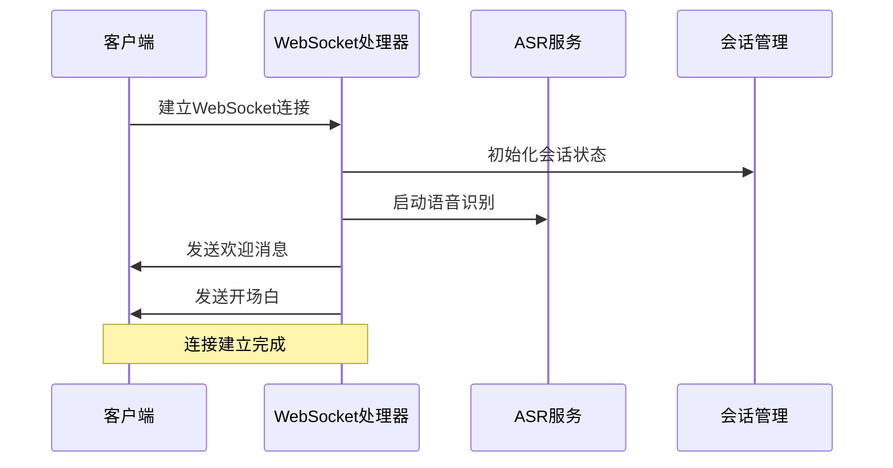

**图表来源**
- [VoiceInterviewWebSocketHandler.java:139-169](file://app/src/main/java/interview/guide/modules/voiceinterview/handler/VoiceInterviewWebSocketHandler.java#L139-L169)

#### 消息格式规范
系统支持多种消息类型，每种类型都有特定的数据结构：

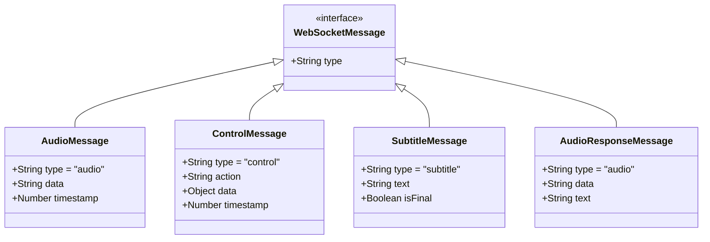

**图表来源**
- [voiceInterview.ts:86-133](file://frontend/src/api/voiceInterview.ts#L86-L133)

#### 心跳机制和断线重连
系统实现了完善的连接管理和恢复机制：

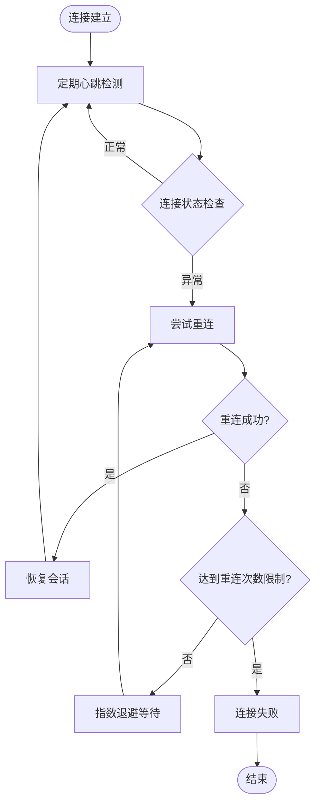

**图表来源**
- [VoiceInterviewWebSocketHandler.java:382-385](file://app/src/main/java/interview/guide/modules/voiceinterview/handler/VoiceInterviewWebSocketHandler.java#L382-L385)
- [voiceInterview.ts:220-365](file://frontend/src/api/voiceInterview.ts#L220-L365)

**章节来源**
- [VoiceInterviewWebSocketHandler.java:299-345](file://app/src/main/java/interview/guide/modules/voiceinterview/handler/VoiceInterviewWebSocketHandler.java#L299-L345)
- [voiceInterview.ts:220-383](file://frontend/src/api/voiceInterview.ts#L220-L383)

### 语音处理接口

语音处理是系统的核心功能，集成了ASR、TTS和LLM三个关键组件。

#### ASR语音识别服务
ASR服务基于阿里云DashScope的qwen3-asr-flash-realtime模型，提供实时语音识别功能：

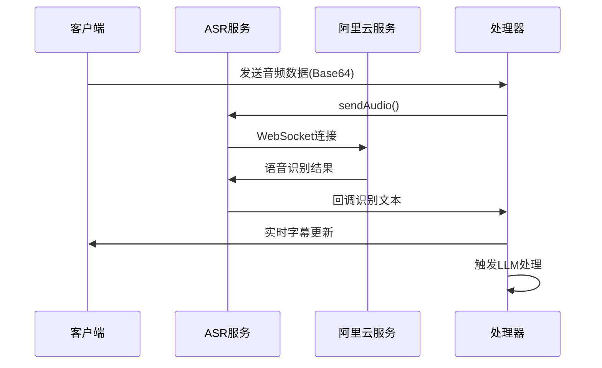

**图表来源**
- [QwenAsrService.java:290-322](file://app/src/main/java/interview/guide/modules/voiceinterview/service/QwenAsrService.java#L290-L322)
- [VoiceInterviewWebSocketHandler.java:427-482](file://app/src/main/java/interview/guide/modules/voiceinterview/handler/VoiceInterviewWebSocketHandler.java#L427-L482)

#### TTS语音合成服务
TTS服务基于阿里云DashScope的qwen3-tts-flash-realtime模型，提供实时语音合成：

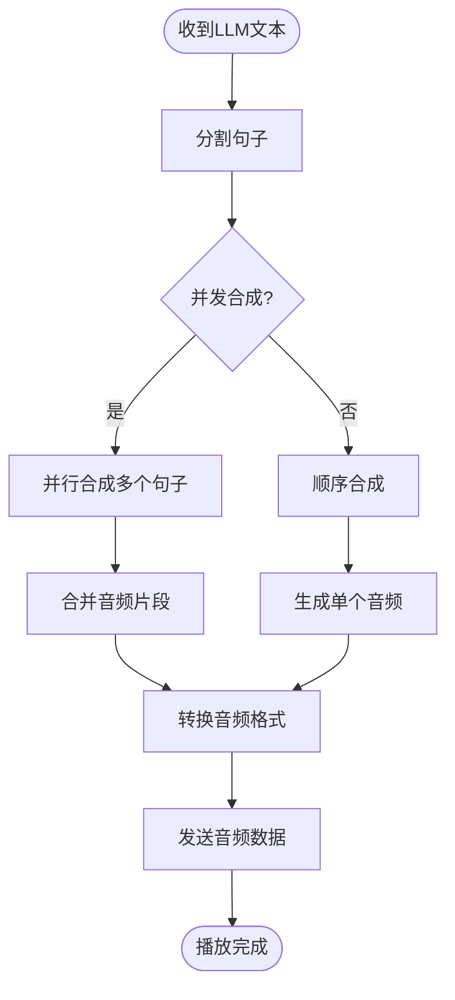

**图表来源**
- [QwenTtsService.java:94-222](file://app/src/main/java/interview/guide/modules/voiceinterview/service/QwenTtsService.java#L94-L222)
- [VoiceInterviewWebSocketHandler.java:556-748](file://app/src/main/java/interview/guide/modules/voiceinterview/handler/VoiceInterviewWebSocketHandler.java#L556-L748)

#### LLM对话服务
LLM服务提供智能对话能力，支持流式输出和句子级并发处理：

**章节来源**
- [QwenAsrService.java:1-625](file://app/src/main/java/interview/guide/modules/voiceinterview/service/QwenAsrService.java#L1-L625)
- [QwenTtsService.java:1-397](file://app/src/main/java/interview/guide/modules/voiceinterview/service/QwenTtsService.java#L1-L397)
- [DashscopeLlmService.java:1-246](file://app/src/main/java/interview/guide/modules/voiceinterview/service/DashscopeLlmService.java#L1-L246)

### 评估系统

评估系统提供面试结果的自动化分析和评分功能：

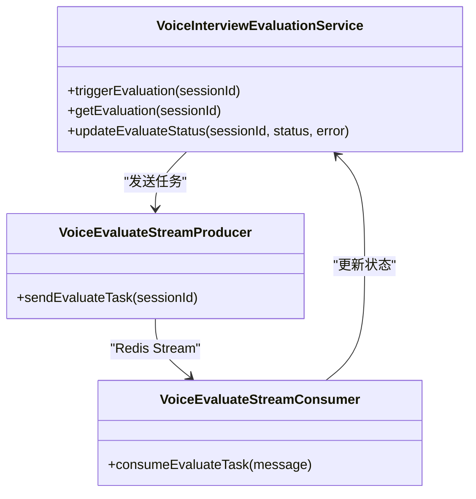

**图表来源**
- [VoiceInterviewController.java:167-199](file://app/src/main/java/interview/guide/modules/voiceinterview/controller/VoiceInterviewController.java#L167-L199)
- [VoiceInterviewService.java:534-538](file://app/src/main/java/interview/guide/modules/voiceinterview/service/VoiceInterviewService.java#L534-L538)

**章节来源**
- [VoiceInterviewController.java:137-157](file://app/src/main/java/interview/guide/modules/voiceinterview/controller/VoiceInterviewController.java#L137-L157)
- [VoiceInterviewService.java:517-529](file://app/src/main/java/interview/guide/modules/voiceinterview/service/VoiceInterviewService.java#L517-L529)

## 依赖关系分析

语音面试系统具有清晰的依赖层次结构，各组件之间的耦合度较低，便于维护和扩展。

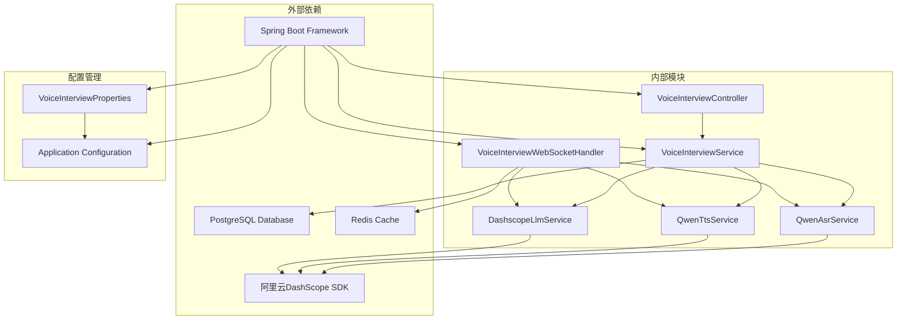

**图表来源**
- [VoiceInterviewController.java:1-201](file://app/src/main/java/interview/guide/modules/voiceinterview/controller/VoiceInterviewController.java#L1-L201)
- [VoiceInterviewService.java:1-582](file://app/src/main/java/interview/guide/modules/voiceinterview/service/VoiceInterviewService.java#L1-L582)
- [VoiceInterviewWebSocketHandler.java:1-800](file://app/src/main/java/interview/guide/modules/voiceinterview/handler/VoiceInterviewWebSocketHandler.java#L1-L800)

**章节来源**
- [application.yml:126-282](file://app/src/main/resources/application.yml#L126-L282)

## 性能考虑

语音面试系统在设计时充分考虑了性能优化，采用了多项技术来提升用户体验：

### 虚拟线程技术
系统使用Java 21的虚拟线程技术，显著提升了I/O密集型场景的并发能力：

- **线程池优化**: 使用`newVirtualThreadPerTaskExecutor()`为每个语音处理任务分配独立线程
- **阻塞操作隔离**: ASR、TTS、数据库操作都在虚拟线程上执行，避免阻塞主线程
- **资源利用率**: 虚拟线程相比传统线程具有更低的内存占用和切换开销

### 缓存策略
- **Redis缓存**: 会话信息缓存1小时，减少数据库查询压力
- **音频缓存**: 开场白音频预加载到内存缓存中
- **配置缓存**: 语音处理配置信息缓存，避免重复初始化

### 流式处理
- **ASR流式输出**: 实时显示语音识别中间结果
- **LLM流式对话**: 句子级并发TTS，边生成边播放
- **音频分块传输**: 支持音频分块推送，降低延迟

### 连接管理
- **WebSocket连接池**: 支持多会话并发处理
- **连接超时控制**: 20秒连接超时，防止资源泄露
- **自动重连机制**: 断线后自动重连，提升稳定性

## 故障排除指南

### 常见问题及解决方案

#### WebSocket连接问题
**症状**: 客户端无法连接到WebSocket服务器
**可能原因**:
- 网络连接不稳定
- 服务器负载过高
- 防火墙阻止WebSocket连接

**解决步骤**:
1. 检查服务器日志中的连接错误信息
2. 验证WebSocket端点URL是否正确
3. 确认防火墙设置允许WebSocket连接
4. 检查服务器资源使用情况

#### ASR识别失败
**症状**: 语音无法被正确识别
**可能原因**:
- 麦克风权限未授权
- 音频格式不支持
- 网络连接异常

**解决步骤**:
1. 检查浏览器的麦克风权限设置
2. 确认音频采样率和格式符合要求
3. 验证阿里云API Key配置
4. 检查网络连接稳定性

#### TTS合成异常
**症状**: 无法播放语音合成结果
**可能原因**:
- 音频播放权限未授权
- 浏览器兼容性问题
- 音频格式转换失败

**解决步骤**:
1. 确认浏览器允许自动播放音频
2. 检查音频格式转换是否成功
3. 验证TTS服务配置参数
4. 测试不同浏览器的兼容性

#### 评估服务异常
**症状**: 面试结束后无法获取评估结果
**可能原因**:
- Redis连接异常
- 评估任务队列堵塞
- 评估服务进程崩溃

**解决步骤**:
1. 检查Redis服务状态
2. 查看评估任务队列积压情况
3. 重启评估服务进程
4. 清理异常的任务状态

**章节来源**
- [VoiceInterviewWebSocketHandler.java:382-385](file://app/src/main/java/interview/guide/modules/voiceinterview/handler/VoiceInterviewWebSocketHandler.java#L382-L385)
- [QwenAsrService.java:376-391](file://app/src/main/java/interview/guide/modules/voiceinterview/service/QwenAsrService.java#L376-L391)
- [QwenTtsService.java:242-245](file://app/src/main/java/interview/guide/modules/voiceinterview/service/QwenTtsService.java#L242-L245)

## 结论

语音面试系统是一个功能完整、架构清晰的实时语音交互平台。系统通过合理的分层设计和组件分离，实现了高性能的语音面试体验。

### 主要优势
1. **实时性强**: 基于WebSocket的双向通信，支持毫秒级延迟
2. **扩展性好**: 模块化设计便于功能扩展和维护
3. **稳定性高**: 完善的错误处理和重连机制
4. **性能优异**: 虚拟线程技术和缓存策略提升系统性能

### 技术特色
- **多轮对话**: 支持复杂的多轮问答场景
- **实时字幕**: 语音识别中间结果实时显示
- **智能评估**: 自动化的面试结果分析和评分
- **多平台支持**: 前后端分离架构，支持多终端访问

### 未来改进方向
1. **WebRTC集成**: 降低端到端延迟
2. **音色多样化**: 支持更多TTS音色选择
3. **回声消除**: 改善音频质量
4. **移动端优化**: 针对移动设备的特殊优化

## 附录

### API调用示例

#### 创建会话
```javascript
// 前端调用示例
const session = await voiceInterviewApi.createSession({
  skillId: "java-backend",
  difficulty: "mid",
  techEnabled: true,
  projectEnabled: true,
  hrEnabled: true,
  plannedDuration: 30
});
```

#### 建立WebSocket连接
```javascript
// 建立实时通信连接
const ws = new VoiceInterviewWebSocket(
  sessionId, 
  session.webSocketUrl, 
  {
    onOpen: () => console.log('连接已建立'),
    onAudioChunk: (data, index, isLast) => {
      // 处理音频分块
    },
    onSubtitle: (text, isFinal) => {
      // 更新实时字幕
    }
  }
);
```

#### 发送音频数据
```javascript
// 发送麦克风采集的音频数据
ws.sendAudio(base64EncodedAudio);
```

#### 触发AI响应
```javascript
// 手动提交用户回答
ws.sendControl('submit');
```

### 配置参数说明

系统支持丰富的配置选项，可通过环境变量进行定制：

| 配置项 | 默认值 | 说明 |
|--------|--------|------|
| APP_VOICE_INTERVIEW_LLM_PROVIDER | dashscope | LLM提供商选择 |
| APP_VOICE_INTERVIEW_PHASE_INTRO_MAX_DURATION | 8 | 自我介绍阶段最大时长(分钟) |
| APP_VOICE_INTERVIEW_QWEN_ASR_API_KEY | 无 | 阿里云ASR API Key |
| APP_VOICE_INTERVIEW_QWEN_TTS_VOICE | Cherry | TTS默认音色 |
| APP_VOICE_USER_UTTERANCE_DEBOUNCE_MS | 2500 | 用户说话停顿检测时间 |

**章节来源**
- [application.yml:194-282](file://app/src/main/resources/application.yml#L194-L282)
- [VoiceInterviewProperties.java:17-160](file://app/src/main/java/interview/guide/modules/voiceinterview/config/VoiceInterviewProperties.java#L17-L160)