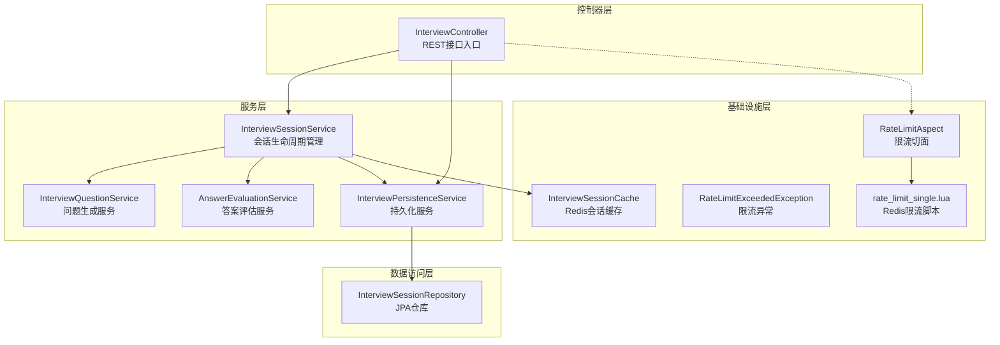
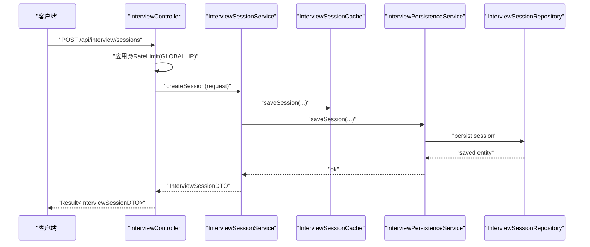
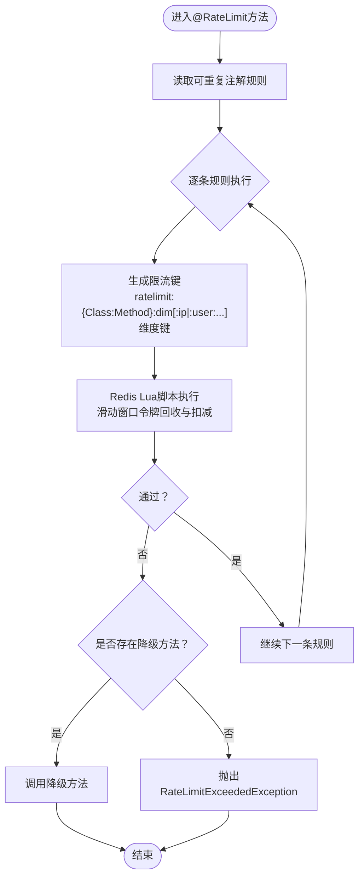
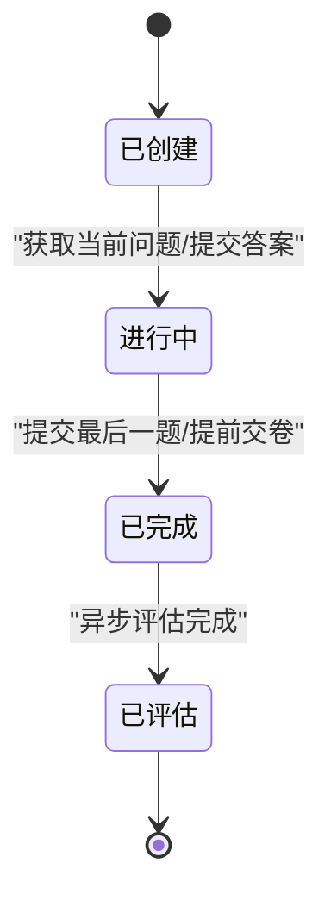
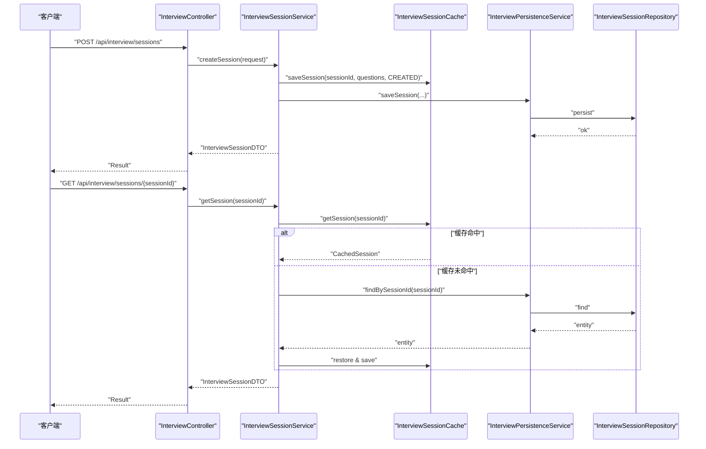
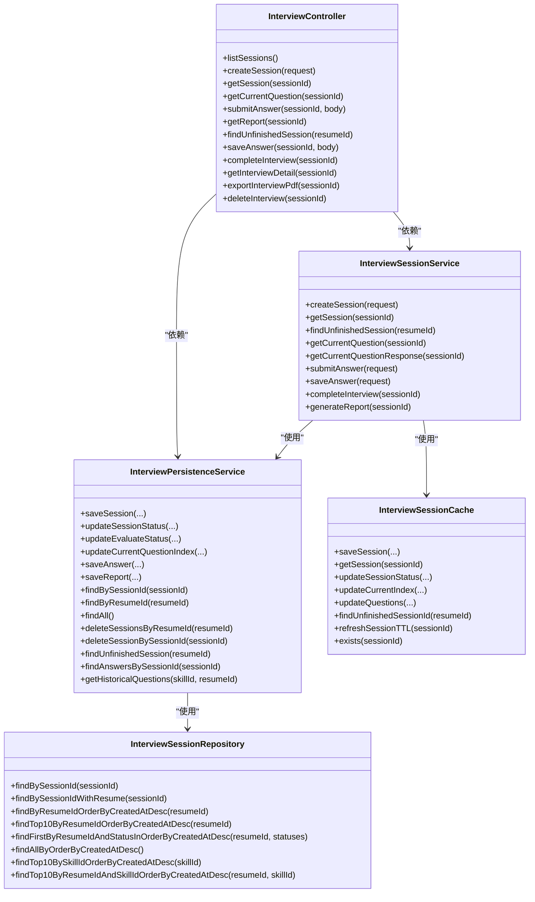

# 面试API接口

<cite>
**本文档引用的文件**
- [InterviewController.java](file://app/src/main/java/interview/guide/modules/interview/InterviewController.java)
- [InterviewSessionService.java](file://app/src/main/java/interview/guide/modules/interview/service/InterviewSessionService.java)
- [InterviewPersistenceService.java](file://app/src/main/java/interview/guide/modules/interview/service/InterviewPersistenceService.java)
- [InterviewSessionCache.java](file://app/src/main/java/interview/guide/infrastructure/redis/InterviewSessionCache.java)
- [InterviewSessionRepository.java](file://app/src/main/java/interview/guide/modules/interview/repository/InterviewSessionRepository.java)
- [CreateInterviewRequest.java](file://app/src/main/java/interview/guide/modules/interview/model/CreateInterviewRequest.java)
- [SubmitAnswerRequest.java](file://app/src/main/java/interview/guide/modules/interview/model/SubmitAnswerRequest.java)
- [SubmitAnswerResponse.java](file://app/src/main/java/interview/guide/modules/interview/model/SubmitAnswerResponse.java)
- [InterviewReportDTO.java](file://app/src/main/java/interview/guide/modules/interview/model/InterviewReportDTO.java)
- [InterviewDetailDTO.java](file://app/src/main/java/interview/guide/modules/interview/model/InterviewDetailDTO.java)
- [InterviewSessionDTO.java](file://app/src/main/java/interview/guide/modules/interview/model/InterviewSessionDTO.java)
- [RateLimit.java](file://app/src/main/java/interview/guide/common/annotation/RateLimit.java)
- [RateLimitAspect.java](file://app/src/main/java/interview/guide/common/aspect/RateLimitAspect.java)
- [RateLimitExceededException.java](file://app/src/main/java/interview/guide/common/exception/RateLimitExceededException.java)
- [rate_limit_single.lua](file://app/src/main/resources/scripts/rate_limit_single.lua)
</cite>

## 目录
1. [简介](#简介)
2. [项目结构](#项目结构)
3. [核心组件](#核心组件)
4. [架构总览](#架构总览)
5. [详细组件分析](#详细组件分析)
6. [依赖关系分析](#依赖关系分析)
7. [性能考虑](#性能考虑)
8. [故障排除指南](#故障排除指南)
9. [结论](#结论)
10. [附录](#附录)

## 简介
本文件面向面试API接口的使用者与维护者，系统性梳理模拟面试全流程的RESTful接口设计与实现，覆盖会话创建、问题获取、答案提交、报告生成、PDF导出、历史查询等能力，并深入解析速率限制机制（全局限流与IP限流）。文档以渐进方式呈现，既适合快速上手，也便于深入理解技术细节。

## 项目结构
面试相关模块位于后端应用的模块化目录下，采用按功能域划分的组织方式：
- 控制器层：负责HTTP路由与参数绑定，返回统一结果包装
- 服务层：封装业务流程，协调缓存、持久化与AI评估
- 数据访问层：基于JPA仓库进行数据库操作
- 基础设施层：Redis缓存、限流切面、异常处理等

图表来源
- [InterviewController.java:30-176](file://app/src/main/java/interview/guide/modules/interview/InterviewController.java#L30-L176)
- [InterviewSessionService.java:40-507](file://app/src/main/java/interview/guide/modules/interview/service/InterviewSessionService.java#L40-L507)
- [InterviewPersistenceService.java:36-359](file://app/src/main/java/interview/guide/modules/interview/service/InterviewPersistenceService.java#L36-L359)
- [InterviewSessionCache.java:27-244](file://app/src/main/java/interview/guide/infrastructure/redis/InterviewSessionCache.java#L27-L244)
- [InterviewSessionRepository.java:17-77](file://app/src/main/java/interview/guide/modules/interview/repository/InterviewSessionRepository.java#L17-L77)
- [RateLimitAspect.java:35-265](file://app/src/main/java/interview/guide/common/aspect/RateLimitAspect.java#L35-L265)
- [rate_limit_single.lua:1-61](file://app/src/main/resources/scripts/rate_limit_single.lua#L1-L61)

章节来源
- [InterviewController.java:30-176](file://app/src/main/java/interview/guide/modules/interview/InterviewController.java#L30-L176)
- [InterviewSessionService.java:40-507](file://app/src/main/java/interview/guide/modules/interview/service/InterviewSessionService.java#L40-L507)

## 核心组件
- 接口控制器：提供会话管理、问答交互、报告生成与导出等REST接口
- 会话服务：负责会话创建、状态推进、答案提交、报告生成与评估任务调度
- 持久化服务：负责会话、答案、报告的数据库读写与状态同步
- Redis缓存：提供高并发下的会话状态与进度缓存，降低数据库压力
- 限流切面：基于Redis的Lua脚本实现滑动时间窗限流，支持全局与IP维度

章节来源
- [InterviewController.java:30-176](file://app/src/main/java/interview/guide/modules/interview/InterviewController.java#L30-L176)
- [InterviewSessionService.java:40-507](file://app/src/main/java/interview/guide/modules/interview/service/InterviewSessionService.java#L40-L507)
- [InterviewPersistenceService.java:36-359](file://app/src/main/java/interview/guide/modules/interview/service/InterviewPersistenceService.java#L36-L359)
- [InterviewSessionCache.java:27-244](file://app/src/main/java/interview/guide/infrastructure/redis/InterviewSessionCache.java#L27-L244)
- [RateLimitAspect.java:35-265](file://app/src/main/java/interview/guide/common/aspect/RateLimitAspect.java#L35-L265)

## 架构总览
面试API遵循经典的分层架构，控制器接收请求并校验参数，服务层编排业务流程，缓存与数据库协同保证一致性与性能，限流切面在方法级提供安全保护。

图表来源
- [InterviewController.java:50-57](file://app/src/main/java/interview/guide/modules/interview/InterviewController.java#L50-L57)
- [InterviewSessionService.java:55-118](file://app/src/main/java/interview/guide/modules/interview/service/InterviewSessionService.java#L55-L118)
- [InterviewPersistenceService.java:46-78](file://app/src/main/java/interview/guide/modules/interview/service/InterviewPersistenceService.java#L46-L78)
- [InterviewSessionRepository.java:23-29](file://app/src/main/java/interview/guide/modules/interview/repository/InterviewSessionRepository.java#L23-L29)

## 详细组件分析

### 接口清单与业务逻辑

- 会话创建
  - 方法与路径：POST /api/interview/sessions
  - 请求体：CreateInterviewRequest
  - 响应：Result<InterviewSessionDTO>
  - 业务要点：
    - 若提供简历ID且未强制创建，优先返回未完成会话
    - 使用LLM生成题目，写入Redis缓存与数据库
    - 默认难度与技能ID来自系统默认配置
  - 速率限制：@RateLimit(dimension=GLOBAL, count=5)，@RateLimit(dimension=IP, count=5)

- 获取会话信息
  - 方法与路径：GET /api/interview/sessions/{sessionId}
  - 路径参数：sessionId
  - 响应：Result<InterviewSessionDTO>
  - 业务要点：优先从Redis缓存读取，未命中则从数据库恢复

- 获取当前问题
  - 方法与路径：GET /api/interview/sessions/{sessionId}/question
  - 路径参数：sessionId
  - 响应：Result<Map<String,Object>>
  - 响应结构：completed(boolean) + question(InterviewQuestionDTO) 或 completed=true + message

- 提交答案
  - 方法与路径：POST /api/interview/sessions/{sessionId}/answers
  - 路径参数：sessionId
  - 请求体：Map<String,Object>，包含questionIndex与answer
  - 响应：Result<SubmitAnswerResponse>
  - 业务要点：
    - 更新指定问题的答案
    - 自动推进到下一题
    - 最后一题自动触发异步评估任务
  - 速率限制：@RateLimit(dimension=GLOBAL, count=10)

- 生成面试报告
  - 方法与路径：GET /api/interview/sessions/{sessionId}/report
  - 路径参数：sessionId
  - 响应：Result<InterviewReportDTO>
  - 业务要点：仅在会话已完成或已评估状态下允许生成

- 查找未完成会话
  - 方法与路径：GET /api/interview/sessions/unfinished/{resumeId}
  - 路径参数：resumeId
  - 响应：Result<InterviewSessionDTO>

- 暂存答案（不进入下一题）
  - 方法与路径：PUT /api/interview/sessions/{sessionId}/answers
  - 请求体：Map<String,Object>，包含questionIndex与answer
  - 响应：Result<Void>

- 提前交卷
  - 方法与路径：POST /api/interview/sessions/{sessionId}/complete
  - 响应：Result<Void>
  - 业务要点：将会话状态置为COMPLETED并触发评估

- 获取面试详情
  - 方法与路径：GET /api/interview/sessions/{sessionId}/details
  - 响应：Result<InterviewDetailDTO>

- 导出PDF报告
  - 方法与路径：GET /api/interview/sessions/{sessionId}/export
  - 响应：ResponseEntity<byte[]>（application/pdf）
  - 业务要点：下载文件名为“模拟面试报告_{sessionId}.pdf”

- 删除会话
  - 方法与路径：DELETE /api/interview/sessions/{sessionId}
  - 响应：Result<Void>

章节来源
- [InterviewController.java:39-174](file://app/src/main/java/interview/guide/modules/interview/InterviewController.java#L39-L174)
- [CreateInterviewRequest.java:13-34](file://app/src/main/java/interview/guide/modules/interview/model/CreateInterviewRequest.java#L13-L34)
- [SubmitAnswerRequest.java:10-20](file://app/src/main/java/interview/guide/modules/interview/model/SubmitAnswerRequest.java#L10-L20)
- [SubmitAnswerResponse.java:6-11](file://app/src/main/java/interview/guide/modules/interview/model/SubmitAnswerResponse.java#L6-L11)
- [InterviewReportDTO.java:8-49](file://app/src/main/java/interview/guide/modules/interview/model/InterviewReportDTO.java#L8-L49)
- [InterviewDetailDTO.java:9-39](file://app/src/main/java/interview/guide/modules/interview/model/InterviewDetailDTO.java#L9-L39)
- [InterviewSessionDTO.java:8-22](file://app/src/main/java/interview/guide/modules/interview/model/InterviewSessionDTO.java#L8-L22)

### 速率限制机制

- 实现原理
  - 基于Redis的Lua脚本实现滑动时间窗限流
  - 切面在方法级拦截，逐条执行注解规则（可重复注解）
  - 任一规则不通过即拒绝请求
  - 支持维度：GLOBAL（全局限流）、IP（按客户端IP限流）、USER（按用户ID限流）

- 关键参数
  - count：时间窗口内的最大请求数
  - interval：时间窗口长度
  - timeUnit：时间单位（默认秒）
  - timeout：等待令牌超时时间（默认0，不等待）
  - fallback：降级方法名（为空则抛出限流异常）

- 触发行为
  - 未配置降级方法时，抛出RateLimitExceededException
  - 日志记录触发原因与限流键
  - Redis异常（脚本失效）时自动重载并重试

图表来源
- [RateLimit.java:30-118](file://app/src/main/java/interview/guide/common/annotation/RateLimit.java#L30-L118)
- [RateLimitAspect.java:66-90](file://app/src/main/java/interview/guide/common/aspect/RateLimitAspect.java#L66-L90)
- [RateLimitAspect.java:92-126](file://app/src/main/java/interview/guide/common/aspect/RateLimitAspect.java#L92-L126)
- [RateLimitAspect.java:165-191](file://app/src/main/java/interview/guide/common/aspect/RateLimitAspect.java#L165-L191)
- [rate_limit_single.lua:1-61](file://app/src/main/resources/scripts/rate_limit_single.lua#L1-L61)

章节来源
- [RateLimit.java:30-118](file://app/src/main/java/interview/guide/common/annotation/RateLimit.java#L30-L118)
- [RateLimitAspect.java:66-191](file://app/src/main/java/interview/guide/common/aspect/RateLimitAspect.java#L66-L191)
- [RateLimitExceededException.java:7-21](file://app/src/main/java/interview/guide/common/exception/RateLimitExceededException.java#L7-L21)
- [rate_limit_single.lua:1-61](file://app/src/main/resources/scripts/rate_limit_single.lua#L1-L61)

### 面试流程状态管理

- 状态流转
  - CREATED：会话刚创建
  - IN_PROGRESS：开始答题或暂存答案后进入
  - COMPLETED：提交最后一题或提前交卷后进入
  - EVALUATED：评估完成后进入

- 关键节点
  - 提交最后一题：自动更新状态为COMPLETED并入队评估任务
  - 提前交卷：直接进入COMPLETED并入队评估任务
  - 评估完成：状态更新为EVALUATED，报告可生成

章节来源
- [InterviewSessionDTO.java:16-21](file://app/src/main/java/interview/guide/modules/interview/model/InterviewSessionDTO.java#L16-L21)
- [InterviewSessionService.java:295-357](file://app/src/main/java/interview/guide/modules/interview/service/InterviewSessionService.java#L295-L357)
- [InterviewSessionService.java:402-427](file://app/src/main/java/interview/guide/modules/interview/service/InterviewSessionService.java#L402-L427)
- [InterviewPersistenceService.java:83-114](file://app/src/main/java/interview/guide/modules/interview/service/InterviewPersistenceService.java#L83-L114)

### 会话生命周期与数据流

图表来源
- [InterviewController.java:62-66](file://app/src/main/java/interview/guide/modules/interview/InterviewController.java#L62-L66)
- [InterviewSessionService.java:123-137](file://app/src/main/java/interview/guide/modules/interview/service/InterviewSessionService.java#L123-L137)
- [InterviewSessionService.java:183-191](file://app/src/main/java/interview/guide/modules/interview/service/InterviewSessionService.java#L183-L191)
- [InterviewSessionCache.java:110-118](file://app/src/main/java/interview/guide/infrastructure/redis/InterviewSessionCache.java#L110-L118)
- [InterviewPersistenceService.java:249-251](file://app/src/main/java/interview/guide/modules/interview/service/InterviewPersistenceService.java#L249-L251)

## 依赖关系分析

图表来源
- [InterviewController.java:32-34](file://app/src/main/java/interview/guide/modules/interview/InterviewController.java#L32-L34)
- [InterviewSessionService.java:42-48](file://app/src/main/java/interview/guide/modules/interview/service/InterviewSessionService.java#L42-L48)
- [InterviewPersistenceService.java:38-41](file://app/src/main/java/interview/guide/modules/interview/service/InterviewPersistenceService.java#L38-L41)
- [InterviewSessionCache.java:29-30](file://app/src/main/java/interview/guide/infrastructure/redis/InterviewSessionCache.java#L29-L30)
- [InterviewSessionRepository.java:18-76](file://app/src/main/java/interview/guide/modules/interview/repository/InterviewSessionRepository.java#L18-L76)

章节来源
- [InterviewController.java:32-34](file://app/src/main/java/interview/guide/modules/interview/InterviewController.java#L32-L34)
- [InterviewSessionService.java:42-48](file://app/src/main/java/interview/guide/modules/interview/service/InterviewSessionService.java#L42-L48)
- [InterviewPersistenceService.java:38-41](file://app/src/main/java/interview/guide/modules/interview/service/InterviewPersistenceService.java#L38-L41)
- [InterviewSessionCache.java:29-30](file://app/src/main/java/interview/guide/infrastructure/redis/InterviewSessionCache.java#L29-L30)
- [InterviewSessionRepository.java:18-76](file://app/src/main/java/interview/guide/modules/interview/repository/InterviewSessionRepository.java#L18-L76)

## 性能考虑
- 缓存优先：会话状态与进度优先从Redis缓存读取，减少数据库压力
- 异步评估：提交最后一题或提前交卷后，评估任务入队异步执行，避免阻塞请求
- 滑动窗口限流：基于Redis原子Lua脚本，具备高吞吐与低延迟特性
- JSON序列化：问题与报告采用Jackson序列化，注意大数据量时的内存占用
- 状态同步：缓存与数据库双写，确保一致性与可用性

## 故障排除指南
- 限流触发
  - 现象：抛出RateLimitExceededException或触发降级方法
  - 处理：检查@RateLimit配置、Redis连接状态、脚本SHA缓存是否丢失
  - 参考：限流异常类与切面日志输出

- 会话不存在
  - 现象：查询会话或生成报告时报错
  - 处理：确认sessionId正确性；若缓存未命中，检查数据库是否存在

- 答案索引无效
  - 现象：提交答案时报错
  - 处理：核对questionIndex是否在有效范围内

- PDF导出失败
  - 现象：导出接口返回500
  - 处理：检查报告生成状态与导出服务日志

章节来源
- [RateLimitExceededException.java:7-21](file://app/src/main/java/interview/guide/common/exception/RateLimitExceededException.java#L7-L21)
- [InterviewSessionService.java:456-458](file://app/src/main/java/interview/guide/modules/interview/service/InterviewSessionService.java#L456-L458)
- [InterviewController.java:150-164](file://app/src/main/java/interview/guide/modules/interview/InterviewController.java#L150-L164)

## 结论
面试API通过清晰的REST接口与完善的限流机制，实现了高可用的模拟面试体验。结合Redis缓存与异步评估，系统在保证实时性的同时兼顾了稳定性与扩展性。建议在生产环境中配合监控与告警，持续优化限流阈值与评估任务队列。

## 附录

### 接口调用示例（请求/响应与错误处理）

- 会话创建
  - 请求
    - 方法：POST
    - 路径：/api/interview/sessions
    - 请求体字段：resumeText、questionCount、resumeId、forceCreate、llmProvider、skillId、difficulty、customCategories、jdText
    - 速率限制：GLOBAL(5)、IP(5)
  - 响应
    - 成功：Result.success(InterviewSessionDTO)
    - 失败：Result.error(具体错误码与消息)

- 获取会话信息
  - 请求
    - 方法：GET
    - 路径：/api/interview/sessions/{sessionId}
  - 响应
    - 成功：Result.success(InterviewSessionDTO)

- 获取当前问题
  - 请求
    - 方法：GET
    - 路径：/api/interview/sessions/{sessionId}/question
  - 响应
    - 成功：Result.success({completed, question | completed, message})

- 提交答案
  - 请求
    - 方法：POST
    - 路径：/api/interview/sessions/{sessionId}/answers
    - 请求体：{questionIndex, answer}
    - 速率限制：GLOBAL(10)
  - 响应
    - 成功：Result.success(SubmitAnswerResponse)

- 生成报告
  - 请求
    - 方法：GET
    - 路径：/api/interview/sessions/{sessionId}/report
  - 响应
    - 成功：Result.success(InterviewReportDTO)

- 导出PDF
  - 请求
    - 方法：GET
    - 路径：/api/interview/sessions/{sessionId}/export
  - 响应
    - 成功：application/pdf（Content-Disposition附件下载）
    - 失败：500 Internal Server Error

章节来源
- [InterviewController.java:50-164](file://app/src/main/java/interview/guide/modules/interview/InterviewController.java#L50-L164)
- [CreateInterviewRequest.java:13-34](file://app/src/main/java/interview/guide/modules/interview/model/CreateInterviewRequest.java#L13-L34)
- [SubmitAnswerRequest.java:10-20](file://app/src/main/java/interview/guide/modules/interview/model/SubmitAnswerRequest.java#L10-L20)
- [SubmitAnswerResponse.java:6-11](file://app/src/main/java/interview/guide/modules/interview/model/SubmitAnswerResponse.java#L6-L11)
- [InterviewReportDTO.java:8-49](file://app/src/main/java/interview/guide/modules/interview/model/InterviewReportDTO.java#L8-L49)