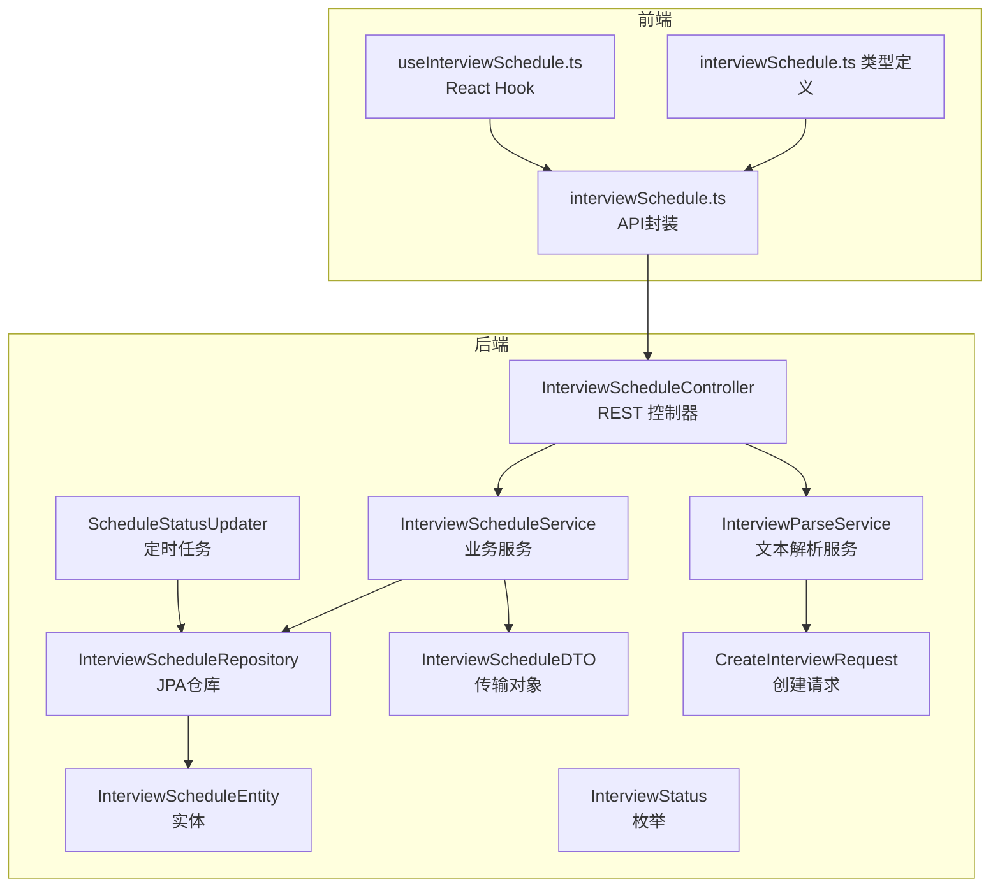
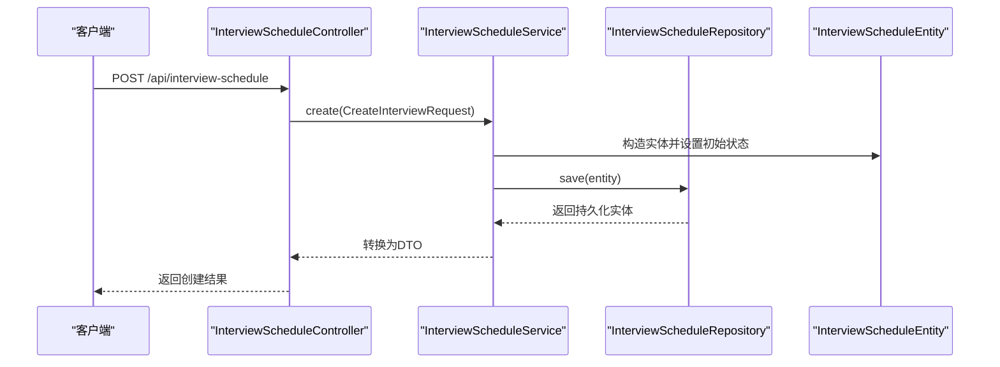
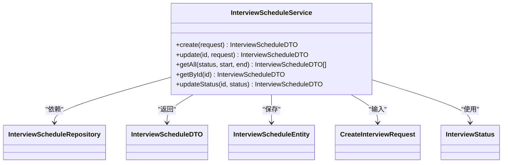
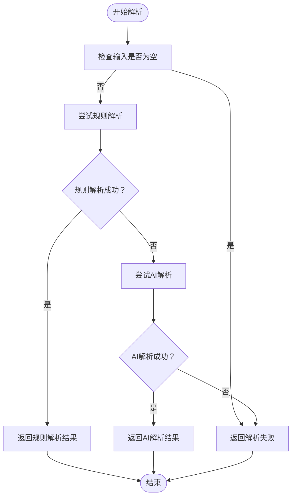
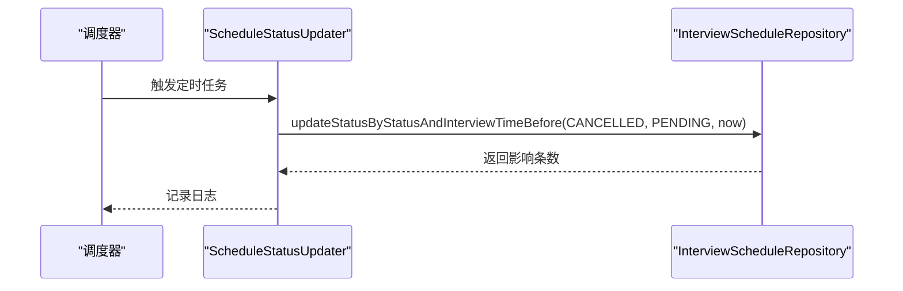
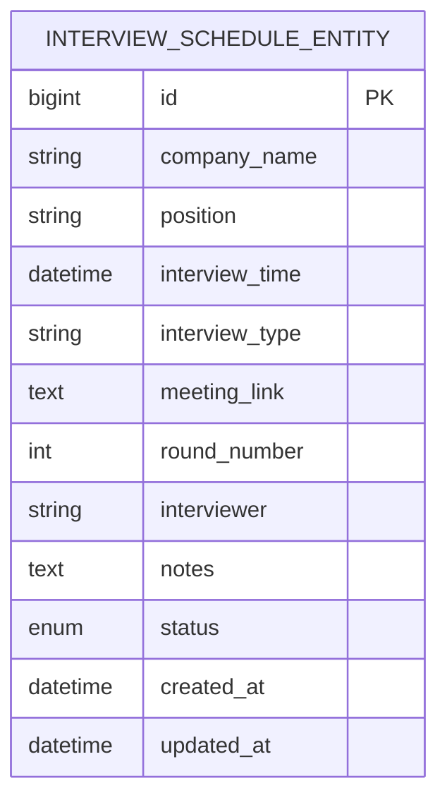
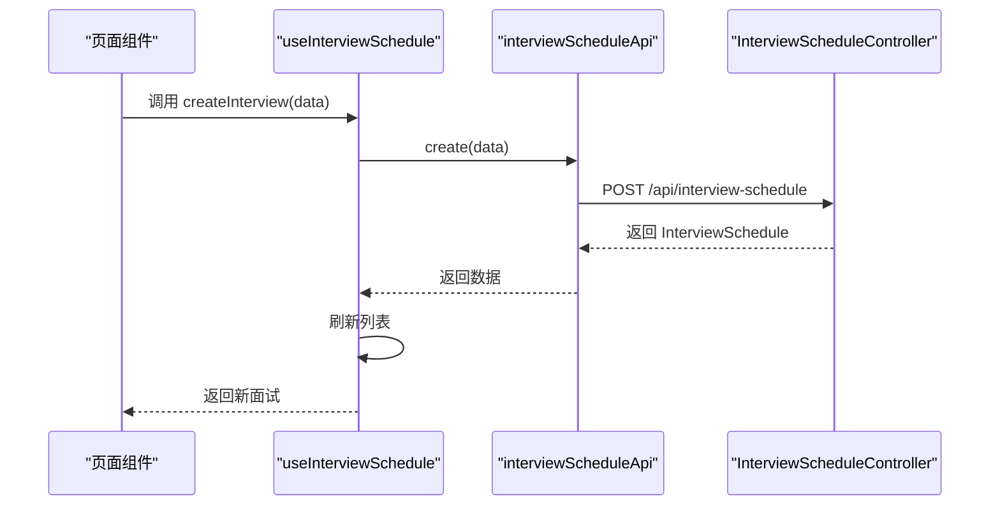
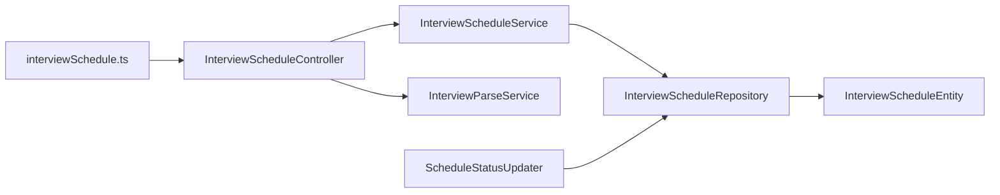
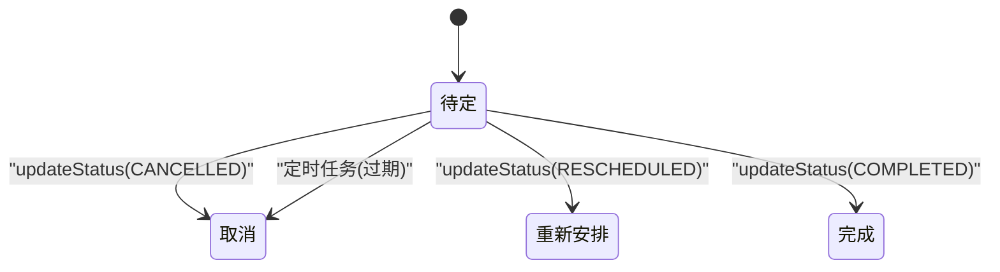

# 面试安排API接口

<cite>
**本文档引用的文件**
- [InterviewScheduleController.java](file://app/src/main/java/interview/guide/modules/interviewschedule/InterviewScheduleController.java)
- [InterviewScheduleService.java](file://app/src/main/java/interview/guide/modules/interviewschedule/service/InterviewScheduleService.java)
- [InterviewParseService.java](file://app/src/main/java/interview/guide/modules/interviewschedule/service/InterviewParseService.java)
- [ScheduleStatusUpdater.java](file://app/src/main/java/interview/guide/modules/interviewschedule/service/ScheduleStatusUpdater.java)
- [InterviewScheduleRepository.java](file://app/src/main/java/interview/guide/modules/interviewschedule/repository/InterviewScheduleRepository.java)
- [InterviewScheduleEntity.java](file://app/src/main/java/interview/guide/modules/interviewschedule/model/InterviewScheduleEntity.java)
- [InterviewScheduleDTO.java](file://app/src/main/java/interview/guide/modules/interviewschedule/model/InterviewScheduleDTO.java)
- [CreateInterviewRequest.java](file://app/src/main/java/interview/guide/modules/interviewschedule/model/CreateInterviewRequest.java)
- [InterviewStatus.java](file://app/src/main/java/interview/guide/modules/interviewschedule/model/InterviewStatus.java)
- [interviewSchedule.ts](file://frontend/src/api/interviewSchedule.ts)
- [interviewSchedule.ts 类型定义](file://frontend/src/types/interviewSchedule.ts)
- [useInterviewSchedule.ts 钩子](file://frontend/src/hooks/useInterviewSchedule.ts)
</cite>

## 目录
1. [简介](#简介)
2. [项目结构](#项目结构)
3. [核心组件](#核心组件)
4. [架构总览](#架构总览)
5. [详细组件分析](#详细组件分析)
6. [依赖关系分析](#依赖关系分析)
7. [性能考虑](#性能考虑)
8. [故障排除指南](#故障排除指南)
9. [结论](#结论)
10. [附录](#附录)

## 简介
本文件面向面试日程管理模块的RESTful API接口，提供从接口定义、数据模型、业务逻辑到前端集成与自动化处理的完整说明。重点覆盖：
- 面试安排创建与编辑：候选人信息、面试官分配、时间选择、通知发送等
- 时间冲突检测与资源可用性：基于数据库查询与定时任务的过期状态自动更新
- 状态管理：确认、取消、重新安排、完成等状态流转
- 日历视图与拖拽重排：基于前端日历组件的交互
- 完整API调用示例：批量操作、条件查询、分页列表等
- 提醒机制与自动化处理流程：定时任务自动标记过期面试

## 项目结构
后端采用Spring Boot + JPA分层架构，前端通过独立的TypeScript模块与后端API交互。

**图表来源**
- [InterviewScheduleController.java:20-131](file://app/src/main/java/interview/guide/modules/interviewschedule/InterviewScheduleController.java#L20-L131)
- [InterviewScheduleService.java:16-85](file://app/src/main/java/interview/guide/modules/interviewschedule/service/InterviewScheduleService.java#L16-L85)
- [InterviewParseService.java:23-429](file://app/src/main/java/interview/guide/modules/interviewschedule/service/InterviewParseService.java#L23-L429)
- [ScheduleStatusUpdater.java:13-30](file://app/src/main/java/interview/guide/modules/interviewschedule/service/ScheduleStatusUpdater.java#L13-L30)
- [InterviewScheduleRepository.java:14-28](file://app/src/main/java/interview/guide/modules/interviewschedule/repository/InterviewScheduleRepository.java#L14-L28)
- [InterviewScheduleEntity.java:7-58](file://app/src/main/java/interview/guide/modules/interviewschedule/model/InterviewScheduleEntity.java#L7-L58)
- [InterviewScheduleDTO.java:6-22](file://app/src/main/java/interview/guide/modules/interviewschedule/model/InterviewScheduleDTO.java#L6-L22)
- [CreateInterviewRequest.java:8-29](file://app/src/main/java/interview/guide/modules/interviewschedule/model/CreateInterviewRequest.java#L8-L29)
- [InterviewStatus.java:3-8](file://app/src/main/java/interview/guide/modules/interviewschedule/model/InterviewStatus.java#L3-L8)
- [interviewSchedule.ts:12-47](file://frontend/src/api/interviewSchedule.ts#L12-L47)
- [interviewSchedule.ts 类型定义:3-48](file://frontend/src/types/interviewSchedule.ts#L3-L48)
- [useInterviewSchedule.ts 钩子:11-71](file://frontend/src/hooks/useInterviewSchedule.ts#L11-L71)

**章节来源**
- [InterviewScheduleController.java:20-131](file://app/src/main/java/interview/guide/modules/interviewschedule/InterviewScheduleController.java#L20-L131)
- [InterviewScheduleService.java:16-85](file://app/src/main/java/interview/guide/modules/interviewschedule/service/InterviewScheduleService.java#L16-L85)
- [InterviewParseService.java:23-429](file://app/src/main/java/interview/guide/modules/interviewschedule/service/InterviewParseService.java#L23-L429)
- [ScheduleStatusUpdater.java:13-30](file://app/src/main/java/interview/guide/modules/interviewschedule/service/ScheduleStatusUpdater.java#L13-L30)
- [InterviewScheduleRepository.java:14-28](file://app/src/main/java/interview/guide/modules/interviewschedule/repository/InterviewScheduleRepository.java#L14-L28)
- [InterviewScheduleEntity.java:7-58](file://app/src/main/java/interview/guide/modules/interviewschedule/model/InterviewScheduleEntity.java#L7-L58)
- [InterviewScheduleDTO.java:6-22](file://app/src/main/java/interview/guide/modules/interviewschedule/model/InterviewScheduleDTO.java#L6-L22)
- [CreateInterviewRequest.java:8-29](file://app/src/main/java/interview/guide/modules/interviewschedule/model/CreateInterviewRequest.java#L8-L29)
- [InterviewStatus.java:3-8](file://app/src/main/java/interview/guide/modules/interviewschedule/model/InterviewStatus.java#L3-L8)
- [interviewSchedule.ts:12-47](file://frontend/src/api/interviewSchedule.ts#L12-L47)
- [interviewSchedule.ts 类型定义:3-48](file://frontend/src/types/interviewSchedule.ts#L3-L48)
- [useInterviewSchedule.ts 钩子:11-71](file://frontend/src/hooks/useInterviewSchedule.ts#L11-L71)

## 核心组件
- 控制器层：提供REST接口，负责请求接收、参数校验与响应包装
- 业务服务层：封装领域逻辑，协调仓库与外部能力
- 数据访问层：基于JPA的仓库接口，提供查询与批量状态更新
- 实体与模型：映射数据库表结构与传输对象，统一前后端数据契约
- 前端API封装：类型安全的HTTP客户端，配合React Hook实现状态管理

**章节来源**
- [InterviewScheduleController.java:20-131](file://app/src/main/java/interview/guide/modules/interviewschedule/InterviewScheduleController.java#L20-L131)
- [InterviewScheduleService.java:16-85](file://app/src/main/java/interview/guide/modules/interviewschedule/service/InterviewScheduleService.java#L16-L85)
- [InterviewScheduleRepository.java:14-28](file://app/src/main/java/interview/guide/modules/interviewschedule/repository/InterviewScheduleRepository.java#L14-L28)
- [InterviewScheduleEntity.java:7-58](file://app/src/main/java/interview/guide/modules/interviewschedule/model/InterviewScheduleEntity.java#L7-L58)
- [InterviewScheduleDTO.java:6-22](file://app/src/main/java/interview/guide/modules/interviewschedule/model/InterviewScheduleDTO.java#L6-L22)
- [CreateInterviewRequest.java:8-29](file://app/src/main/java/interview/guide/modules/interviewschedule/model/CreateInterviewRequest.java#L8-L29)
- [interviewSchedule.ts:12-47](file://frontend/src/api/interviewSchedule.ts#L12-L47)
- [interviewSchedule.ts 类型定义:3-48](file://frontend/src/types/interviewSchedule.ts#L3-L48)
- [useInterviewSchedule.ts 钩子:11-71](file://frontend/src/hooks/useInterviewSchedule.ts#L11-L71)

## 架构总览
面试日程管理遵循经典的MVC分层与DDD概念映射：
- 控制器接收请求，进行参数校验与日志记录
- 服务层执行业务规则，如状态初始化、字段拷贝、查询策略
- 仓库层负责持久化与复杂查询
- 实体与DTO承担数据传输职责
- 定时任务负责自动化状态更新

**图表来源**
- [InterviewScheduleController.java:48-53](file://app/src/main/java/interview/guide/modules/interviewschedule/InterviewScheduleController.java#L48-L53)
- [InterviewScheduleService.java:27-34](file://app/src/main/java/interview/guide/modules/interviewschedule/service/InterviewScheduleService.java#L27-L34)
- [InterviewScheduleRepository.java:14-28](file://app/src/main/java/interview/guide/modules/interviewschedule/repository/InterviewScheduleRepository.java#L14-L28)
- [InterviewScheduleEntity.java:7-58](file://app/src/main/java/interview/guide/modules/interviewschedule/model/InterviewScheduleEntity.java#L7-L58)

## 详细组件分析

### 控制器：InterviewScheduleController
- 提供解析、创建、查询、更新、删除、状态更新等REST接口
- 支持按状态与时间范围筛选
- 使用统一响应包装Result

关键接口
- POST /api/interview-schedule/parse：解析面试邀约文本
- POST /api/interview-schedule：创建面试安排
- GET /api/interview-schedule/{id}：按ID获取
- GET /api/interview-schedule：条件查询（状态/时间范围）
- PUT /api/interview-schedule/{id}：更新
- DELETE /api/interview-schedule/{id}：删除
- PATCH/PUT /api/interview-schedule/{id}/status：更新状态

**章节来源**
- [InterviewScheduleController.java:20-131](file://app/src/main/java/interview/guide/modules/interviewschedule/InterviewScheduleController.java#L20-L131)

### 服务：InterviewScheduleService
- 创建：复制请求字段到实体，设置初始状态为PENDING
- 更新：排除状态字段，避免直接修改状态
- 查询：支持按状态、时间区间、全量查询
- 状态更新：直接设置状态值

**图表来源**
- [InterviewScheduleService.java:16-85](file://app/src/main/java/interview/guide/modules/interviewschedule/service/InterviewScheduleService.java#L16-L85)
- [InterviewScheduleRepository.java:14-28](file://app/src/main/java/interview/guide/modules/interviewschedule/repository/InterviewScheduleRepository.java#L14-L28)
- [InterviewScheduleDTO.java:6-22](file://app/src/main/java/interview/guide/modules/interviewschedule/model/InterviewScheduleDTO.java#L6-L22)
- [InterviewScheduleEntity.java:7-58](file://app/src/main/java/interview/guide/modules/interviewschedule/model/InterviewScheduleEntity.java#L7-L58)
- [CreateInterviewRequest.java:8-29](file://app/src/main/java/interview/guide/modules/interviewschedule/model/CreateInterviewRequest.java#L8-L29)
- [InterviewStatus.java:3-8](file://app/src/main/java/interview/guide/modules/interviewschedule/model/InterviewStatus.java#L3-L8)

**章节来源**
- [InterviewScheduleService.java:16-85](file://app/src/main/java/interview/guide/modules/interviewschedule/service/InterviewScheduleService.java#L16-L85)

### 解析服务：InterviewParseService
- 规则解析：针对飞书、腾讯会议、Zoom等平台的正则匹配
- AI解析：基于大模型的结构化解析，输出标准化CreateInterviewRequest
- 可信度与方法标记：返回解析成功与否、置信度、解析方式与日志
- 自动检测来源：若未指定source，则自动识别平台

**图表来源**
- [InterviewParseService.java:96-122](file://app/src/main/java/interview/guide/modules/interviewschedule/service/InterviewParseService.java#L96-L122)

**章节来源**
- [InterviewParseService.java:23-429](file://app/src/main/java/interview/guide/modules/interviewschedule/service/InterviewParseService.java#L23-L429)

### 定时任务：ScheduleStatusUpdater
- 每小时执行一次，将已过期的PENDING面试自动标记为CANCELLED
- 使用原生SQL批量更新，减少事务开销

**图表来源**
- [ScheduleStatusUpdater.java:20-29](file://app/src/main/java/interview/guide/modules/interviewschedule/service/ScheduleStatusUpdater.java#L20-L29)
- [InterviewScheduleRepository.java:22-27](file://app/src/main/java/interview/guide/modules/interviewschedule/repository/InterviewScheduleRepository.java#L22-L27)

**章节来源**
- [ScheduleStatusUpdater.java:13-30](file://app/src/main/java/interview/guide/modules/interviewschedule/service/ScheduleStatusUpdater.java#L13-L30)
- [InterviewScheduleRepository.java:14-28](file://app/src/main/java/interview/guide/modules/interviewschedule/repository/InterviewScheduleRepository.java#L14-L28)

### 数据模型与仓库
- 实体映射：interview_schedule表，包含公司、岗位、时间、类型、会议链接、轮次、面试官、备注、状态、创建/更新时间
- DTO：对外传输对象，包含createdAt/updatedAt
- 请求模型：CreateInterviewRequest，用于创建/更新
- 仓库接口：提供按状态、时间区间查询与批量状态更新

**图表来源**
- [InterviewScheduleEntity.java:7-58](file://app/src/main/java/interview/guide/modules/interviewschedule/model/InterviewScheduleEntity.java#L7-L58)

**章节来源**
- [InterviewScheduleEntity.java:7-58](file://app/src/main/java/interview/guide/modules/interviewschedule/model/InterviewScheduleEntity.java#L7-L58)
- [InterviewScheduleDTO.java:6-22](file://app/src/main/java/interview/guide/modules/interviewschedule/model/InterviewScheduleDTO.java#L6-L22)
- [CreateInterviewRequest.java:8-29](file://app/src/main/java/interview/guide/modules/interviewschedule/model/CreateInterviewRequest.java#L8-L29)
- [InterviewStatus.java:3-8](file://app/src/main/java/interview/guide/modules/interviewschedule/model/InterviewStatus.java#L3-L8)
- [InterviewScheduleRepository.java:14-28](file://app/src/main/java/interview/guide/modules/interviewschedule/repository/InterviewScheduleRepository.java#L14-L28)

### 前端集成
- API封装：统一的HTTP客户端，导出parse、create、getById、getAll、update、delete、updateStatus等方法
- 类型定义：InterviewSchedule、CreateInterviewRequest、ParseRequest、ParseResponse、InterviewStatus
- React Hook：useInterviewSchedule，封装加载、创建、更新、删除、状态变更与列表刷新

**图表来源**
- [useInterviewSchedule.ts 钩子:34-38](file://frontend/src/hooks/useInterviewSchedule.ts#L34-L38)
- [interviewSchedule.ts:18-20](file://frontend/src/api/interviewSchedule.ts#L18-L20)
- [InterviewScheduleController.java:48-53](file://app/src/main/java/interview/guide/modules/interviewschedule/InterviewScheduleController.java#L48-L53)

**章节来源**
- [interviewSchedule.ts:12-47](file://frontend/src/api/interviewSchedule.ts#L12-L47)
- [interviewSchedule.ts 类型定义:3-48](file://frontend/src/types/interviewSchedule.ts#L3-L48)
- [useInterviewSchedule.ts 钩子:11-71](file://frontend/src/hooks/useInterviewSchedule.ts#L11-L71)

## 依赖关系分析
- 控制器依赖服务与解析服务
- 服务依赖仓库接口
- 仓库接口继承JPA基础能力
- 定时任务依赖仓库接口进行批量更新
- 前端API封装依赖控制器提供的REST端点

**图表来源**
- [InterviewScheduleController.java:20-131](file://app/src/main/java/interview/guide/modules/interviewschedule/InterviewScheduleController.java#L20-L131)
- [InterviewScheduleService.java:16-85](file://app/src/main/java/interview/guide/modules/interviewschedule/service/InterviewScheduleService.java#L16-L85)
- [InterviewParseService.java:23-429](file://app/src/main/java/interview/guide/modules/interviewschedule/service/InterviewParseService.java#L23-L429)
- [InterviewScheduleRepository.java:14-28](file://app/src/main/java/interview/guide/modules/interviewschedule/repository/InterviewScheduleRepository.java#L14-L28)
- [InterviewScheduleEntity.java:7-58](file://app/src/main/java/interview/guide/modules/interviewschedule/model/InterviewScheduleEntity.java#L7-L58)
- [ScheduleStatusUpdater.java:13-30](file://app/src/main/java/interview/guide/modules/interviewschedule/service/ScheduleStatusUpdater.java#L13-L30)
- [interviewSchedule.ts:12-47](file://frontend/src/api/interviewSchedule.ts#L12-L47)

**章节来源**
- [InterviewScheduleController.java:20-131](file://app/src/main/java/interview/guide/modules/interviewschedule/InterviewScheduleController.java#L20-L131)
- [InterviewScheduleService.java:16-85](file://app/src/main/java/interview/guide/modules/interviewschedule/service/InterviewScheduleService.java#L16-L85)
- [InterviewParseService.java:23-429](file://app/src/main/java/interview/guide/modules/interviewschedule/service/InterviewParseService.java#L23-L429)
- [InterviewScheduleRepository.java:14-28](file://app/src/main/java/interview/guide/modules/interviewschedule/repository/InterviewScheduleRepository.java#L14-L28)
- [InterviewScheduleEntity.java:7-58](file://app/src/main/java/interview/guide/modules/interviewschedule/model/InterviewScheduleEntity.java#L7-L58)
- [ScheduleStatusUpdater.java:13-30](file://app/src/main/java/interview/guide/modules/interviewschedule/service/ScheduleStatusUpdater.java#L13-L30)
- [interviewSchedule.ts:12-47](file://frontend/src/api/interviewSchedule.ts#L12-L47)

## 性能考虑
- 批量状态更新：定时任务使用原生SQL批量更新，降低事务压力
- 查询策略：按条件分支选择合适的方法，避免全表扫描
- DTO与实体分离：减少不必要的字段传输与序列化开销
- 前端缓存：React Hook内部维护列表状态，减少重复请求

[本节为通用建议，无需特定文件来源]

## 故障排除指南
- 参数校验失败：检查CreateInterviewRequest各字段约束
- 面试不存在：根据业务异常抛出的错误码定位
- 解析失败：确认输入文本格式与来源，必要时切换解析方式
- 定时任务未生效：检查调度配置与事务注解

**章节来源**
- [InterviewScheduleService.java:75-78](file://app/src/main/java/interview/guide/modules/interviewschedule/service/InterviewScheduleService.java#L75-L78)
- [InterviewParseService.java:96-122](file://app/src/main/java/interview/guide/modules/interviewschedule/service/InterviewParseService.java#L96-L122)
- [ScheduleStatusUpdater.java:20-29](file://app/src/main/java/interview/guide/modules/interviewschedule/service/ScheduleStatusUpdater.java#L20-L29)

## 结论
该模块提供了完整的面试日程管理能力，涵盖从文本解析、创建、查询、更新、删除到状态管理与定时自动化的全流程。前端通过类型安全的API封装与React Hook简化了集成与状态管理。建议在生产环境中结合监控与日志进一步完善可观测性。

[本节为总结，无需特定文件来源]

## 附录

### API定义与调用示例

- 解析面试邀约文本
  - 方法：POST
  - 路径：/api/interview-schedule/parse
  - 请求体：ParseRequest（rawText, source）
  - 响应体：ParseResponse（success, data, confidence, parseMethod, log）

- 创建面试安排
  - 方法：POST
  - 路径：/api/interview-schedule
  - 请求体：CreateInterviewRequest
  - 响应体：InterviewSchedule

- 获取单个面试安排
  - 方法：GET
  - 路径：/api/interview-schedule/{id}

- 条件查询面试安排
  - 方法：GET
  - 路径：/api/interview-schedule
  - 查询参数：status（可选）、start（ISO时间，可选）、end（ISO时间，可选）

- 更新面试安排
  - 方法：PUT
  - 路径：/api/interview-schedule/{id}
  - 请求体：CreateInterviewRequest

- 删除面试安排
  - 方法：DELETE
  - 路径：/api/interview-schedule/{id}

- 更新面试状态
  - 方法：PATCH 或 PUT
  - 路径：/api/interview-schedule/{id}/status
  - 查询参数：status（枚举：PENDING、COMPLETED、CANCELLED、RESCHEDULED）

- 前端调用示例（参考）
  - 解析：调用 interviewScheduleApi.parse(rawText, source)
  - 创建：调用 interviewScheduleApi.create(data)
  - 查询：调用 interviewScheduleApi.getAll({ status, start, end })
  - 更新：调用 interviewScheduleApi.update(id, data)
  - 删除：调用 interviewScheduleApi.delete(id)
  - 更新状态：调用 interviewScheduleApi.updateStatus(id, status)

**章节来源**
- [InterviewScheduleController.java:29-130](file://app/src/main/java/interview/guide/modules/interviewschedule/InterviewScheduleController.java#L29-L130)
- [interviewSchedule.ts:12-47](file://frontend/src/api/interviewSchedule.ts#L12-L47)
- [interviewSchedule.ts 类型定义:3-48](file://frontend/src/types/interviewSchedule.ts#L3-L48)

### 时间冲突检测与状态流转

- 时间冲突检测
  - 当前代码未实现显式的“时间冲突”校验逻辑；可通过扩展仓库接口增加唯一性约束或在服务层添加查询重叠时间的逻辑
  - 建议新增：findByInterviewTimeBetween(start, end) 已存在；可在此基础上扩展去重与冲突报告

- 状态流转
  - PENDING → COMPLETED（完成）
  - PENDING → CANCELLED（取消）
  - PENDING → RESCHEDULED（重新安排）
  - 过期自动更新：定时任务将已过期的PENDING自动标记为CANCELLED

**图表来源**
- [InterviewStatus.java:3-8](file://app/src/main/java/interview/guide/modules/interviewschedule/model/InterviewStatus.java#L3-L8)
- [ScheduleStatusUpdater.java:20-29](file://app/src/main/java/interview/guide/modules/interviewschedule/service/ScheduleStatusUpdater.java#L20-L29)

**章节来源**
- [InterviewScheduleRepository.java:14-28](file://app/src/main/java/interview/guide/modules/interviewschedule/repository/InterviewScheduleRepository.java#L14-L28)
- [InterviewStatus.java:3-8](file://app/src/main/java/interview/guide/modules/interviewschedule/model/InterviewStatus.java#L3-L8)
- [ScheduleStatusUpdater.java:13-30](file://app/src/main/java/interview/guide/modules/interviewschedule/service/ScheduleStatusUpdater.java#L13-L30)

### 日历视图与拖拽重排
- 前端使用react-big-calendar与拖拽插件，将面试列表转换为日历事件
- 默认每场面试时长为30分钟，支持拖拽调整时间与重排

**章节来源**
- [ScheduleCalendar.tsx（组件注释）:1-61](file://frontend/src/components/interviewschedule/ScheduleCalendar.tsx#L1-L61)