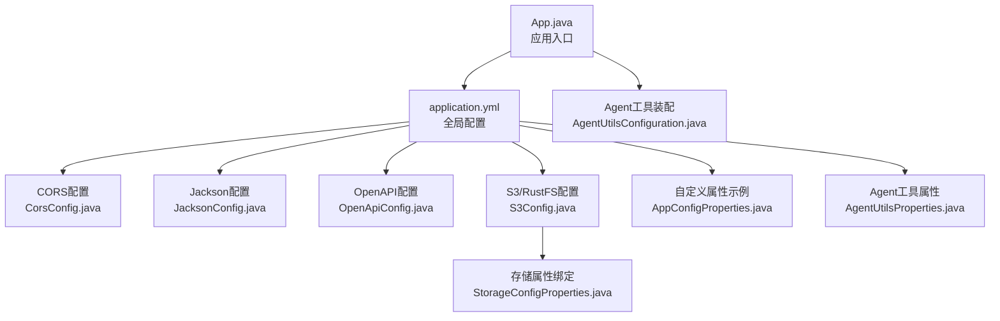
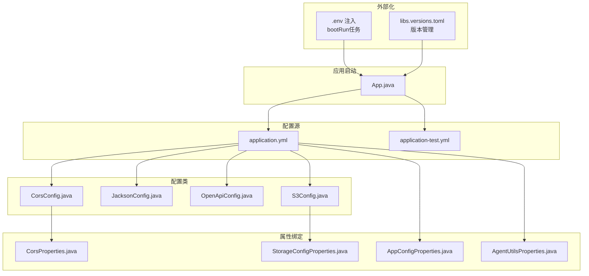
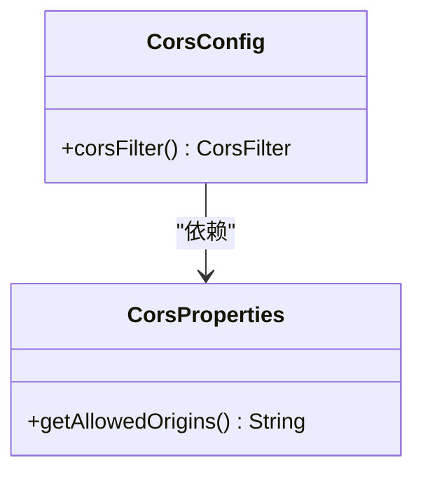
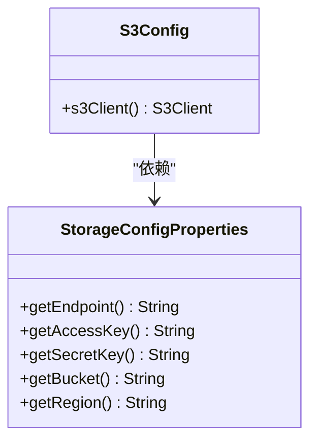
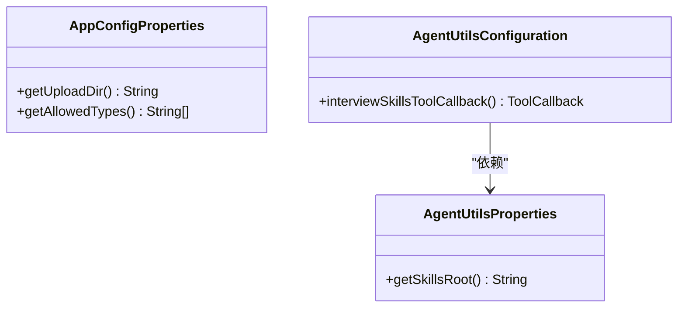
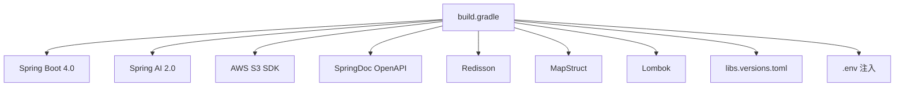

# Spring Boot配置

<cite>
**本文引用的文件**
- [App.java](file://app/src/main/java/interview/guide/App.java)
- [application.yml](file://app/src/main/resources/application.yml)
- [build.gradle](file://app/build.gradle)
- [CorsConfig.java](file://app/src/main/java/interview/guide/common/config/CorsConfig.java)
- [CorsProperties.java](file://app/src/main/java/interview/guide/common/config/CorsProperties.java)
- [JacksonConfig.java](file://app/src/main/java/interview/guide/common/config/JacksonConfig.java)
- [OpenApiConfig.java](file://app/src/main/java/interview/guide/common/config/OpenApiConfig.java)
- [S3Config.java](file://app/src/main/java/interview/guide/common/config/S3Config.java)
- [StorageConfigProperties.java](file://app/src/main/java/interview/guide/common/config/StorageConfigProperties.java)
- [AppConfigProperties.java](file://app/src/main/java/interview/guide/common/config/AppConfigProperties.java)
- [AgentUtilsConfiguration.java](file://app/src/main/java/interview/guide/common/ai/AgentUtilsConfiguration.java)
- [AgentUtilsProperties.java](file://app/src/main/java/interview/guide/common/ai/AgentUtilsProperties.java)
- [application-test.yml](file://app/src/test/resources/application-test.yml)
- [libs.versions.toml](file://gradle/libs.versions.toml)
</cite>

## 目录
1. [简介](#简介)
2. [项目结构](#项目结构)
3. [核心组件](#核心组件)
4. [架构总览](#架构总览)
5. [详细组件分析](#详细组件分析)
6. [依赖分析](#依赖分析)
7. [性能考虑](#性能考虑)
8. [故障排查指南](#故障排查指南)
9. [结论](#结论)
10. [附录](#附录)

## 简介
本文件系统性梳理该Spring Boot应用的配置体系，覆盖启动类作用与Spring Boot 4.0特性、配置加载机制、各类配置类（CORS、Jackson、OpenAPI、S3/RustFS）以及配置属性绑定与最佳实践。文档同时提供常见问题排查与解决方案，帮助开发者高效理解与维护配置。

## 项目结构
- 后端主模块位于 app/，采用Spring Boot 4.0 + Java 21 + Gradle构建。
- 启动类位于 interview.guide.App，启用调度功能并作为应用入口。
- 配置集中在 application.yml，结合多环境与外部化配置（如.env注入）。
- 配置类集中于 interview.guide.common.config 包，负责跨域、序列化、API文档、对象存储等基础设施配置。
- 自定义配置属性通过@ConfigurationProperties绑定至对应实体类，实现类型安全与可验证的配置。

图表来源
- [App.java:1-19](file://app/src/main/java/interview/guide/App.java#L1-L19)
- [application.yml:1-282](file://app/src/main/resources/application.yml#L1-L282)
- [CorsConfig.java:1-44](file://app/src/main/java/interview/guide/common/config/CorsConfig.java#L1-L44)
- [JacksonConfig.java:1-19](file://app/src/main/java/interview/guide/common/config/JacksonConfig.java#L1-L19)
- [OpenApiConfig.java:1-20](file://app/src/main/java/interview/guide/common/config/OpenApiConfig.java#L1-L20)
- [S3Config.java:1-37](file://app/src/main/java/interview/guide/common/config/S3Config.java#L1-L37)
- [StorageConfigProperties.java:1-21](file://app/src/main/java/interview/guide/common/config/StorageConfigProperties.java#L1-L21)
- [AppConfigProperties.java:1-34](file://app/src/main/java/interview/guide/common/config/AppConfigProperties.java#L1-L34)
- [AgentUtilsProperties.java:1-14](file://app/src/main/java/interview/guide/common/ai/AgentUtilsProperties.java#L1-L14)
- [AgentUtilsConfiguration.java:1-70](file://app/src/main/java/interview/guide/common/ai/AgentUtilsConfiguration.java#L1-L70)

章节来源
- [App.java:1-19](file://app/src/main/java/interview/guide/App.java#L1-L19)
- [application.yml:1-282](file://app/src/main/resources/application.yml#L1-L282)
- [build.gradle:1-136](file://app/build.gradle#L1-L136)

## 核心组件
- 启动类与Spring Boot 4.0特性
  - 启动类启用调度能力，作为Spring Boot应用入口，负责引导上下文与组件扫描。
  - 构建脚本声明使用Spring Boot 4.0与Java 21工具链，确保新版本特性与性能优化可用。
- 配置加载机制
  - application.yml集中定义日志、服务器、数据库、JPA、Redisson、Spring AI、应用自定义配置等。
  - 通过占位符支持环境变量注入，便于在不同环境灵活切换。
  - 测试配置文件application-test.yml提供内存数据库与简化配置，便于单元测试与集成测试。
- 配置类与属性绑定
  - CORS、Jackson、OpenAPI、S3/RustFS等通过@Configuration与@Bean装配。
  - 配置属性通过@ConfigurationProperties绑定到实体类，实现强类型与可验证的配置读取。

章节来源
- [App.java:1-19](file://app/src/main/java/interview/guide/App.java#L1-L19)
- [application.yml:1-282](file://app/src/main/resources/application.yml#L1-L282)
- [application-test.yml:1-165](file://app/src/test/resources/application-test.yml#L1-L165)
- [build.gradle:1-136](file://app/build.gradle#L1-L136)

## 架构总览
下图展示配置相关的关键交互：启动类引导应用，配置文件驱动各配置类与属性绑定，最终形成跨域、序列化、API文档与对象存储等基础设施。

图表来源
- [App.java:1-19](file://app/src/main/java/interview/guide/App.java#L1-L19)
- [application.yml:1-282](file://app/src/main/resources/application.yml#L1-L282)
- [application-test.yml:1-165](file://app/src/test/resources/application-test.yml#L1-L165)
- [CorsConfig.java:1-44](file://app/src/main/java/interview/guide/common/config/CorsConfig.java#L1-L44)
- [JacksonConfig.java:1-19](file://app/src/main/java/interview/guide/common/config/JacksonConfig.java#L1-L19)
- [OpenApiConfig.java:1-20](file://app/src/main/java/interview/guide/common/config/OpenApiConfig.java#L1-L20)
- [S3Config.java:1-37](file://app/src/main/java/interview/guide/common/config/S3Config.java#L1-L37)
- [CorsProperties.java:1-14](file://app/src/main/java/interview/guide/common/config/CorsProperties.java#L1-L14)
- [StorageConfigProperties.java:1-21](file://app/src/main/java/interview/guide/common/config/StorageConfigProperties.java#L1-L21)
- [AppConfigProperties.java:1-34](file://app/src/main/java/interview/guide/common/config/AppConfigProperties.java#L1-L34)
- [AgentUtilsProperties.java:1-14](file://app/src/main/java/interview/guide/common/ai/AgentUtilsProperties.java#L1-L14)
- [build.gradle:104-135](file://app/build.gradle#L104-L135)
- [libs.versions.toml:1-30](file://gradle/libs.versions.toml#L1-L30)

## 详细组件分析

### 启动类与Spring Boot 4.0特性
- 作用
  - 声明@SpringBootApplication与@EnableScheduling，启用调度能力，作为应用入口。
- Spring Boot 4.0相关
  - 构建脚本明确使用Spring Boot 4.0模块化设计与Java 21工具链，利于利用新版本的性能与特性（如虚拟线程）。
- 配置要点
  - 通过Gradle bootRun任务注入环境变量，确保本地开发时API密钥等敏感参数可用。

章节来源
- [App.java:1-19](file://app/src/main/java/interview/guide/App.java#L1-L19)
- [build.gradle:1-136](file://app/build.gradle#L1-L136)

### CORS跨域配置
- 组件职责
  - 通过CorsConfig装配CorsFilter，基于CorsProperties动态解析允许的来源，统一设置允许方法、头、凭证与缓存时间。
- 属性绑定
  - CorsProperties绑定app.cors.allowed-origins，支持逗号分隔与空白裁剪。
- 生效范围
  - 对/api/**路径注册跨域规则，满足REST接口跨域需求。

图表来源
- [CorsConfig.java:1-44](file://app/src/main/java/interview/guide/common/config/CorsConfig.java#L1-L44)
- [CorsProperties.java:1-14](file://app/src/main/java/interview/guide/common/config/CorsProperties.java#L1-L14)

章节来源
- [CorsConfig.java:1-44](file://app/src/main/java/interview/guide/common/config/CorsConfig.java#L1-L44)
- [CorsProperties.java:1-14](file://app/src/main/java/interview/guide/common/config/CorsProperties.java#L1-L14)
- [application.yml:190-193](file://app/src/main/resources/application.yml#L190-L193)

### Jackson序列化配置
- 组件职责
  - 提供ObjectMapper Bean，作为JSON序列化/反序列化的默认实现。
- 适用场景
  - REST控制器、消息转换器、日志输出等需要JSON处理的模块。

章节来源
- [JacksonConfig.java:1-19](file://app/src/main/java/interview/guide/common/config/JacksonConfig.java#L1-L19)

### OpenAPI/Swagger文档配置
- 组件职责
  - 通过OpenApiConfig定义OpenAPI元信息（标题、描述、版本），结合springdoc自动扫描包路径生成接口文档。
- 访问路径
  - UI路径与API文档路径由application.yml配置，便于前后端联调与测试。

章节来源
- [OpenApiConfig.java:1-20](file://app/src/main/java/interview/guide/common/config/OpenApiConfig.java#L1-L20)
- [application.yml:26-34](file://app/src/main/resources/application.yml#L26-L34)

### S3/RustFS存储配置
- 组件职责
  - S3Config基于StorageConfigProperties创建S3Client，使用静态凭证、区域与端点覆盖，强制路径风格访问以适配RustFS。
- 属性绑定
  - StorageConfigProperties绑定app.storage.*，支持端点、访问密钥、桶名、区域等。
- 适用场景
  - 知识库上传、简历归档等对象存储需求。

图表来源
- [S3Config.java:1-37](file://app/src/main/java/interview/guide/common/config/S3Config.java#L1-L37)
- [StorageConfigProperties.java:1-21](file://app/src/main/java/interview/guide/common/config/StorageConfigProperties.java#L1-L21)

章节来源
- [S3Config.java:1-37](file://app/src/main/java/interview/guide/common/config/S3Config.java#L1-L37)
- [StorageConfigProperties.java:1-21](file://app/src/main/java/interview/guide/common/config/StorageConfigProperties.java#L1-L21)
- [application.yml:182-189](file://app/src/main/resources/application.yml#L182-L189)

### 应用自定义配置属性
- AppConfigProperties
  - 绑定app.resume.*，用于简历上传目录与允许的MIME类型。
- Agent工具属性
  - AgentUtilsProperties绑定app.ai.agent-utils.skills-root，用于加载技能资源根路径。
  - AgentUtilsConfiguration根据配置构建SkillsTool回调，校验资源存在性并记录日志。

图表来源
- [AppConfigProperties.java:1-34](file://app/src/main/java/interview/guide/common/config/AppConfigProperties.java#L1-L34)
- [AgentUtilsProperties.java:1-14](file://app/src/main/java/interview/guide/common/ai/AgentUtilsProperties.java#L1-L14)
- [AgentUtilsConfiguration.java:1-70](file://app/src/main/java/interview/guide/common/ai/AgentUtilsConfiguration.java#L1-L70)

章节来源
- [AppConfigProperties.java:1-34](file://app/src/main/java/interview/guide/common/config/AppConfigProperties.java#L1-L34)
- [AgentUtilsProperties.java:1-14](file://app/src/main/java/interview/guide/common/ai/AgentUtilsProperties.java#L1-L14)
- [AgentUtilsConfiguration.java:1-70](file://app/src/main/java/interview/guide/common/ai/AgentUtilsConfiguration.java#L1-L70)
- [application.yml:125-181](file://app/src/main/resources/application.yml#L125-L181)

## 依赖分析
- 版本与依赖
  - Spring Boot 4.0、Spring AI 2.0、AWS S3 SDK、SpringDoc OpenAPI、Redisson、MapStruct、Lombok等均在构建脚本中声明。
  - 版本统一由gradle/libs.versions.toml管理，确保兼容性与一致性。
- 运行时注入
  - bootRun任务从根目录.env读取环境变量并注入JVM运行参数，保证编码与密钥可用。

图表来源
- [build.gradle:1-136](file://app/build.gradle#L1-L136)
- [libs.versions.toml:1-30](file://gradle/libs.versions.toml#L1-L30)

章节来源
- [build.gradle:1-136](file://app/build.gradle#L1-L136)
- [libs.versions.toml:1-30](file://gradle/libs.versions.toml#L1-L30)

## 性能考虑
- 虚拟线程与I/O优化
  - application.yml启用虚拟线程，配合Tomcat线程池与HikariCP参数，适合高并发I/O密集场景（如AI调用、SSE长连接）。
- 数据库与JPA
  - PostgreSQL + HikariCP + Hibernate批处理参数优化，减少事务与网络开销。
- 序列化与编码
  - 显式设置HTTP响应编码与Jackson ObjectMapper，避免字符集问题与序列化开销。
- 对象存储
  - S3Client强制路径风格访问，降低DNS解析复杂度，提升RustFS兼容性。

章节来源
- [application.yml:9-25](file://app/src/main/resources/application.yml#L9-L25)
- [application.yml:42-47](file://app/src/main/resources/application.yml#L42-L47)
- [application.yml:48-78](file://app/src/main/resources/application.yml#L48-L78)
- [application.yml:182-189](file://app/src/main/resources/application.yml#L182-L189)
- [JacksonConfig.java:1-19](file://app/src/main/java/interview/guide/common/config/JacksonConfig.java#L1-L19)

## 故障排查指南
- 跨域问题
  - 症状：浏览器CORS错误或预检失败。
  - 排查：确认app.cors.allowed-origins已正确配置且与前端地址一致；检查CorsFilter对/api/**的注册生效。
- OpenAPI/Swagger不可用
  - 症状：无法访问Swagger UI或API文档路径。
  - 排查：核对springdoc.path配置与扫描包路径；确认应用已启用Web MVC与OpenAPI依赖。
- 数据库连接异常
  - 症状：启动报错或连接超时。
  - 排查：检查POSTGRES_*环境变量与HikariCP参数；确认虚拟线程下Open-in-View关闭，避免连接泄漏。
- S3/RustFS访问失败
  - 症状：对象存储操作报错或DNS解析失败。
  - 排查：确认endpoint、accessKey、secretKey、region正确；确保forcePathStyle启用；验证桶名与权限。
- 编码与字符集问题
  - 症状：日志乱码或中文显示异常。
  - 排查：确认server.servlet.encoding与日志编码配置；Gradle bootRun任务已注入UTF-8 JVM参数。
- 测试环境差异
  - 症状：测试用例与本地行为不一致。
  - 排查：对比application-test.yml与application.yml差异；确认测试数据库与Redisson配置。

章节来源
- [application.yml:26-34](file://app/src/main/resources/application.yml#L26-L34)
- [application.yml:48-78](file://app/src/main/resources/application.yml#L48-L78)
- [application.yml:182-189](file://app/src/main/resources/application.yml#L182-L189)
- [application-test.yml:1-165](file://app/src/test/resources/application-test.yml#L1-L165)
- [build.gradle:104-135](file://app/build.gradle#L104-L135)

## 结论
本项目通过集中式配置文件与模块化配置类，实现了跨域、序列化、API文档与对象存储等基础设施的清晰分离。结合Spring Boot 4.0与Java 21特性，配合虚拟线程与连接池优化，能够有效支撑高并发的AI面试平台场景。建议在生产环境中进一步完善配置验证、密钥管理与监控告警，持续提升稳定性与可观测性。

## 附录
- 配置最佳实践
  - 环境变量配置：优先使用占位符与外部化配置，避免硬编码敏感信息。
  - 配置文件分层管理：开发、测试、生产分别维护独立配置，必要时通过profiles或import组合。
  - 配置验证：通过@ConfigurationProperties与构造期校验，尽早暴露配置错误。
  - 密钥与证书：使用专用密钥管理服务或CI/CD注入，避免提交至版本库。
  - 监控与审计：对关键配置项（数据库、AI服务、对象存储）增加健康检查与变更审计。