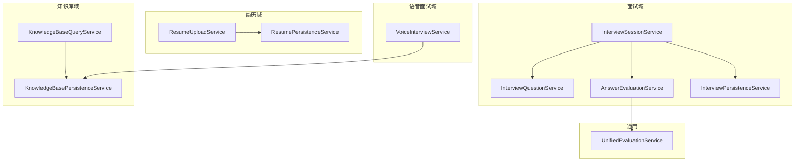
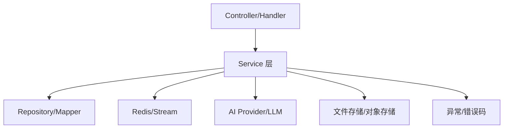
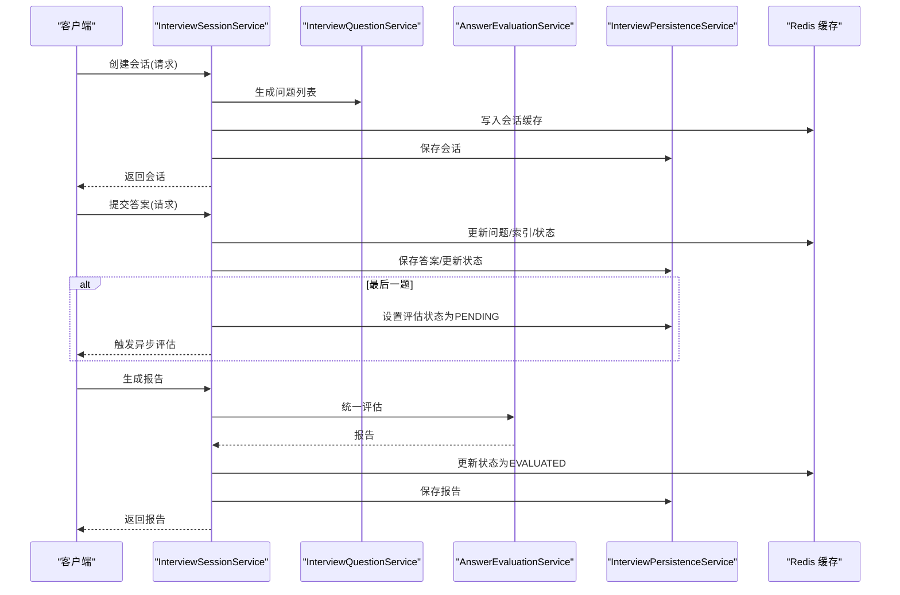
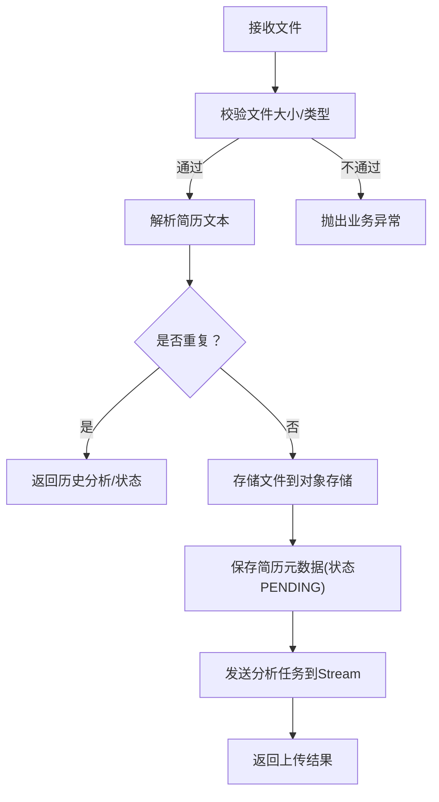
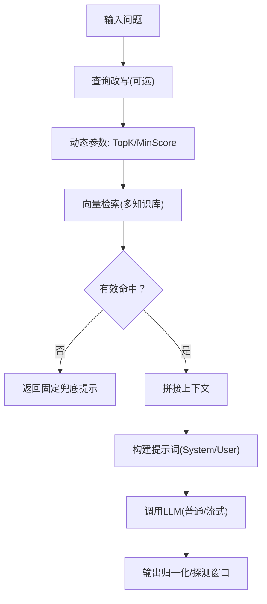
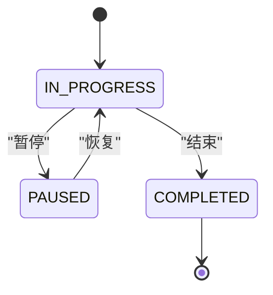
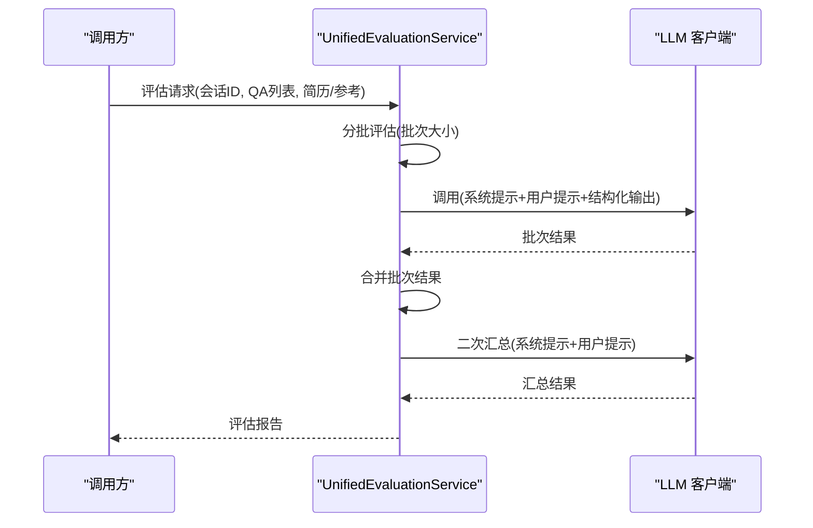
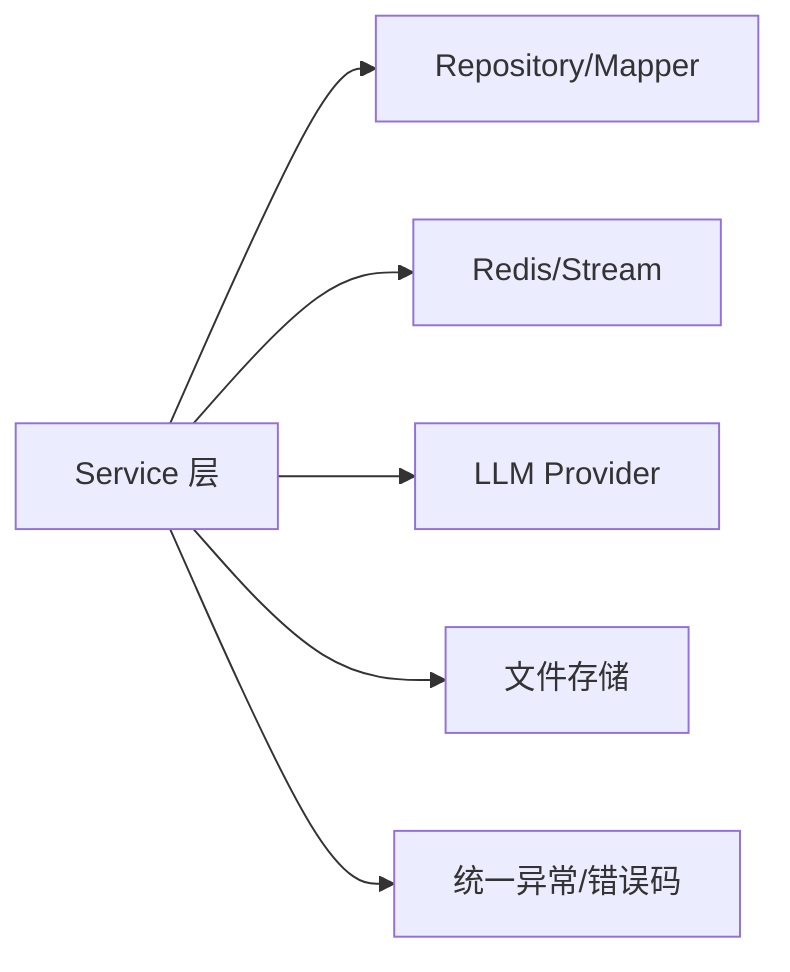

# 业务逻辑层

<cite>
**本文引用的文件**
- [InterviewSessionService.java](file://app/src/main/java/interview/guide/modules/interview/service/InterviewSessionService.java)
- [AnswerEvaluationService.java](file://app/src/main/java/interview/guide/modules/interview/service/AnswerEvaluationService.java)
- [InterviewPersistenceService.java](file://app/src/main/java/interview/guide/modules/interview/service/InterviewPersistenceService.java)
- [InterviewQuestionService.java](file://app/src/main/java/interview/guide/modules/interview/service/InterviewQuestionService.java)
- [ResumeUploadService.java](file://app/src/main/java/interview/guide/modules/resume/service/ResumeUploadService.java)
- [ResumePersistenceService.java](file://app/src/main/java/interview/guide/modules/resume/service/ResumePersistenceService.java)
- [KnowledgeBaseQueryService.java](file://app/src/main/java/interview/guide/modules/knowledgebase/service/KnowledgeBaseQueryService.java)
- [KnowledgeBasePersistenceService.java](file://app/src/main/java/interview/guide/modules/knowledgebase/service/KnowledgeBasePersistenceService.java)
- [VoiceInterviewService.java](file://app/src/main/java/interview/guide/modules/voiceinterview/service/VoiceInterviewService.java)
- [UnifiedEvaluationService.java](file://app/src/main/java/interview/guide/common/evaluation/UnifiedEvaluationService.java)
- [VoiceInterviewServiceTest.java](file://app/src/test/java/interview/guide/modules/voiceinterview/service/VoiceInterviewServiceTest.java)
- [KnowledgeBaseVectorServiceTest.java](file://app/src/test/java/interview/guide/modules/knowledgebase/service/KnowledgeBaseVectorServiceTest.java)
- [RateLimitIntegrationTest.java](file://app/src/test/java/interview/guide/common/aspect/RateLimitIntegrationTest.java)
</cite>

## 目录
1. [简介](#简介)
2. [项目结构](#项目结构)
3. [核心组件](#核心组件)
4. [架构总览](#架构总览)
5. [详细组件分析](#详细组件分析)
6. [依赖分析](#依赖分析)
7. [性能考量](#性能考量)
8. [故障排查指南](#故障排查指南)
9. [结论](#结论)
10. [附录](#附录)

## 简介
本文件聚焦于业务逻辑层（Service 层）的设计与实现，系统性阐述各业务服务的职责划分、业务规则、事务管理、异常处理与服务间协作关系。重点覆盖以下模块：
- 面试会话服务：会话生命周期、问题流转、答案提交、报告生成与评估
- 简历上传服务：文件校验、解析、去重、异步分析与重试
- 知识库查询服务：RAG 检索、查询改写、动态 TopK、流式输出与命中确认
- 语音面试服务：会话状态机、阶段转换、消息持久化与 Redis 缓存
- 通用评估服务：统一面试评估流程（分批评估、二次汇总、降级兜底）

同时提供测试策略与 Mock 策略，帮助读者理解如何进行单元测试与集成测试。

## 项目结构
业务逻辑层位于后端模块 app/src/main/java 下的 modules/* 与 common/* 目录中，采用按功能域划分的包结构：
- modules/interview：文字面试相关（会话、问题、答案、持久化、技能）
- modules/resume：简历上传、解析、持久化、分析
- modules/knowledgebase：知识库上传、向量化、查询、持久化
- modules/voiceinterview：语音面试会话、阶段、消息、评估
- common/evaluation：统一评估服务与通用 DTO
- common/exception：统一异常与错误码
- common/ai：AI 提供商注册与结构化输出调用器
- common/infrastructure：基础设施（文件、Redis、Mapper 等）

图示来源
- [InterviewSessionService.java:40-507](file://app/src/main/java/interview/guide/modules/interview/service/InterviewSessionService.java#L40-L507)
- [InterviewQuestionService.java:41-449](file://app/src/main/java/interview/guide/modules/interview/service/InterviewQuestionService.java#L41-L449)
- [AnswerEvaluationService.java:25-99](file://app/src/main/java/interview/guide/modules/interview/service/AnswerEvaluationService.java#L25-L99)
- [InterviewPersistenceService.java:36-359](file://app/src/main/java/interview/guide/modules/interview/service/InterviewPersistenceService.java#L36-L359)
- [ResumeUploadService.java:29-201](file://app/src/main/java/interview/guide/modules/resume/service/ResumeUploadService.java#L29-L201)
- [ResumePersistenceService.java:31-208](file://app/src/main/java/interview/guide/modules/resume/service/ResumePersistenceService.java#L31-L208)
- [KnowledgeBaseQueryService.java:35-461](file://app/src/main/java/interview/guide/modules/knowledgebase/service/KnowledgeBaseQueryService.java#L35-L461)
- [KnowledgeBasePersistenceService.java:23-110](file://app/src/main/java/interview/guide/modules/knowledgebase/service/KnowledgeBasePersistenceService.java#L23-L110)
- [VoiceInterviewService.java:44-582](file://app/src/main/java/interview/guide/modules/voiceinterview/service/VoiceInterviewService.java#L44-L582)
- [UnifiedEvaluationService.java:32-380](file://app/src/main/java/interview/guide/common/evaluation/UnifiedEvaluationService.java#L32-L380)

章节来源
- [InterviewSessionService.java:40-507](file://app/src/main/java/interview/guide/modules/interview/service/InterviewSessionService.java#L40-L507)
- [KnowledgeBaseQueryService.java:35-461](file://app/src/main/java/interview/guide/modules/knowledgebase/service/KnowledgeBaseQueryService.java#L35-L461)

## 核心组件
- 面试会话服务（InterviewSessionService）
  - 职责：会话创建、状态管理、问题获取与提交、报告生成、评估触发
  - 特点：Redis 缓存 + 数据库双写，异步评估，状态机驱动
- 简历上传服务（ResumeUploadService）
  - 职责：文件校验、内容解析、去重判断、存储、异步分析与重试
  - 特点：事务性持久化 + Redis Stream 异步处理
- 知识库查询服务（KnowledgeBaseQueryService）
  - 职责：RAG 检索、查询改写、动态 TopK、流式输出、命中确认
  - 特点：多阶段检索 + 结果归一化 + SSE 流式输出
- 语音面试服务（VoiceInterviewService）
  - 职责：会话生命周期、阶段转换、消息持久化、Redis 缓存、评估触发
  - 特点：阶段状态机 + 缓存 + 事务
- 统一评估服务（UnifiedEvaluationService）
  - 职责：分批评估、二次汇总、降级兜底、结构化输出
  - 特点：批处理 + 结构化输出 + 汇总增强

章节来源
- [InterviewSessionService.java:40-507](file://app/src/main/java/interview/guide/modules/interview/service/InterviewSessionService.java#L40-L507)
- [ResumeUploadService.java:29-201](file://app/src/main/java/interview/guide/modules/resume/service/ResumeUploadService.java#L29-L201)
- [KnowledgeBaseQueryService.java:35-461](file://app/src/main/java/interview/guide/modules/knowledgebase/service/KnowledgeBaseQueryService.java#L35-L461)
- [VoiceInterviewService.java:44-582](file://app/src/main/java/interview/guide/modules/voiceinterview/service/VoiceInterviewService.java#L44-L582)
- [UnifiedEvaluationService.java:32-380](file://app/src/main/java/interview/guide/common/evaluation/UnifiedEvaluationService.java#L32-L380)

## 架构总览
Service 层通过依赖注入组织，围绕领域模型与仓储接口工作，配合 Redis 缓存与异步消息通道（Stream）实现高性能与解耦。异常通过统一错误码与业务异常抛出，事务由服务层注解控制。

图示来源
- [InterviewSessionService.java:40-507](file://app/src/main/java/interview/guide/modules/interview/service/InterviewSessionService.java#L40-L507)
- [VoiceInterviewService.java:44-582](file://app/src/main/java/interview/guide/modules/voiceinterview/service/VoiceInterviewService.java#L44-L582)
- [KnowledgeBaseQueryService.java:35-461](file://app/src/main/java/interview/guide/modules/knowledgebase/service/KnowledgeBaseQueryService.java#L35-L461)
- [ResumeUploadService.java:29-201](file://app/src/main/java/interview/guide/modules/resume/service/ResumeUploadService.java#L29-L201)

## 详细组件分析

### 面试会话服务（InterviewSessionService）
- 设计原则
  - 会话状态机：CREATED → IN_PROGRESS → COMPLETED → EVALUATED
  - 缓存优先：Redis 缓存会话状态与问题，未命中则从数据库恢复
  - 异步评估：提交最后一个问题或提前交卷后，入队异步评估任务
- 关键流程
  - 创建会话：生成问题列表，写入 Redis 与数据库
  - 获取当前问题：更新状态为进行中，移动索引
  - 提交答案：更新问题答案、索引与状态，最后问题触发评估
  - 生成报告：调用统一评估服务，更新状态并持久化
- 事务与异常
  - 数据库写入使用事务注解，异常时记录告警但不中断主流程
  - 业务异常统一抛出，便于上层控制器处理
- 依赖关系
  - 依赖问题生成、答案评估、持久化、Redis 缓存、LLM 提供商注册

图示来源
- [InterviewSessionService.java:55-118](file://app/src/main/java/interview/guide/modules/interview/service/InterviewSessionService.java#L55-L118)
- [InterviewSessionService.java:295-357](file://app/src/main/java/interview/guide/modules/interview/service/InterviewSessionService.java#L295-L357)
- [InterviewSessionService.java:453-490](file://app/src/main/java/interview/guide/modules/interview/service/InterviewSessionService.java#L453-L490)
- [AnswerEvaluationService.java:45-75](file://app/src/main/java/interview/guide/modules/interview/service/AnswerEvaluationService.java#L45-L75)
- [InterviewPersistenceService.java:46-114](file://app/src/main/java/interview/guide/modules/interview/service/InterviewPersistenceService.java#L46-L114)

章节来源
- [InterviewSessionService.java:40-507](file://app/src/main/java/interview/guide/modules/interview/service/InterviewSessionService.java#L40-L507)
- [InterviewPersistenceService.java:36-359](file://app/src/main/java/interview/guide/modules/interview/service/InterviewPersistenceService.java#L36-L359)
- [AnswerEvaluationService.java:25-99](file://app/src/main/java/interview/guide/modules/interview/service/AnswerEvaluationService.java#L25-L99)

### 简历上传服务（ResumeUploadService）
- 设计原则
  - 文件校验与去重：基于哈希值判断重复简历
  - 异步分析：上传完成后发送分析任务到 Redis Stream
  - 事务性持久化：保存简历元数据与状态
- 关键流程
  - 上传：校验文件类型与大小，解析文本，存储文件，保存元数据
  - 去重：若重复，返回历史分析结果或当前状态
  - 重试：手动重试时从数据库拉取文本并重新入队
- 事务与异常
  - 重试路径使用事务，异常时记录并返回友好提示
- 依赖关系
  - 文件存储、文件校验、解析服务、分析流生产者、持久化服务

图示来源
- [ResumeUploadService.java:47-110](file://app/src/main/java/interview/guide/modules/resume/service/ResumeUploadService.java#L47-L110)
- [ResumeUploadService.java:172-199](file://app/src/main/java/interview/guide/modules/resume/service/ResumeUploadService.java#L172-L199)
- [ResumePersistenceService.java:45-90](file://app/src/main/java/interview/guide/modules/resume/service/ResumePersistenceService.java#L45-L90)

章节来源
- [ResumeUploadService.java:29-201](file://app/src/main/java/interview/guide/modules/resume/service/ResumeUploadService.java#L29-L201)
- [ResumePersistenceService.java:31-208](file://app/src/main/java/interview/guide/modules/resume/service/ResumePersistenceService.java#L31-L208)

### 知识库查询服务（KnowledgeBaseQueryService）
- 设计原则
  - RAG：查询改写 + 动态 TopK + 向量检索 + 上下文拼接 + LLM 生成
  - 命中确认：短 token 查询进行字面匹配确认，避免“信息不足”模板泛滥
  - 流式输出：SSE 探测窗口，先快后透传，失败兜底
- 关键流程
  - 查询：构建上下文，调用 LLM，归一化输出
  - 流式：探测前若干字符，快速识别“无信息”模板，及时终止
  - 搜索参数：根据问题长度动态选择 topK 与最小分数阈值
- 事务与异常
  - 持久化与统计使用事务；查询失败统一抛出业务异常
- 依赖关系
  - 向量检索、知识库列表/计数、提示词模板、LLM 客户端

图示来源
- [KnowledgeBaseQueryService.java:111-155](file://app/src/main/java/interview/guide/modules/knowledgebase/service/KnowledgeBaseQueryService.java#L111-L155)
- [KnowledgeBaseQueryService.java:197-245](file://app/src/main/java/interview/guide/modules/knowledgebase/service/KnowledgeBaseQueryService.java#L197-L245)
- [KnowledgeBaseQueryService.java:264-292](file://app/src/main/java/interview/guide/modules/knowledgebase/service/KnowledgeBaseQueryService.java#L264-L292)
- [KnowledgeBaseQueryService.java:323-344](file://app/src/main/java/interview/guide/modules/knowledgebase/service/KnowledgeBaseQueryService.java#L323-L344)

章节来源
- [KnowledgeBaseQueryService.java:35-461](file://app/src/main/java/interview/guide/modules/knowledgebase/service/KnowledgeBaseQueryService.java#L35-L461)
- [KnowledgeBasePersistenceService.java:23-110](file://app/src/main/java/interview/guide/modules/knowledgebase/service/KnowledgeBasePersistenceService.java#L23-L110)

### 语音面试服务（VoiceInterviewService）
- 设计原则
  - 阶段状态机：INTRO → TECH → PROJECT → HR → COMPLETED
  - Redis 缓存：热点会话缓存，减少数据库压力
  - 事务一致性：会话创建、结束、暂停/恢复、消息持久化均使用事务
- 关键流程
  - 创建：根据启用阶段确定首阶段，保存并缓存
  - 结束：计算实际时长，标记完成并触发评估
  - 暂停/恢复：状态校验，更新缓存
  - 阶段转换：基于时长/问题数规则与启用配置
  - 消息：保存对话并维护序列号
- 依赖关系
  - 会话/消息仓储、Redisson 缓存、评估流生产者、属性配置

图示来源
- [VoiceInterviewService.java:101-124](file://app/src/main/java/interview/guide/modules/voiceinterview/service/VoiceInterviewService.java#L101-L124)
- [VoiceInterviewService.java:277-329](file://app/src/main/java/interview/guide/modules/voiceinterview/service/VoiceInterviewService.java#L277-L329)
- [VoiceInterviewService.java:393-428](file://app/src/main/java/interview/guide/modules/voiceinterview/service/VoiceInterviewService.java#L393-L428)

章节来源
- [VoiceInterviewService.java:44-582](file://app/src/main/java/interview/guide/modules/voiceinterview/service/VoiceInterviewService.java#L44-L582)

### 统一评估服务（UnifiedEvaluationService）
- 设计原则
  - 分批评估：按批次调用 LLM，降低单次负载
  - 结构化输出：使用结构化输出转换器，提升稳定性
  - 二次汇总：对批次结果进行二次汇总，增强整体反馈
  - 降级兜底：批次失败时以零分兜底，汇总失败时回退到聚合结果
- 关键流程
  - 构建 QA 记录与参考上下文
  - 分批评估 + 合并结果
  - 二次汇总 + 归一化输出
- 依赖关系
  - 提示词模板、结构化输出调用器、资源加载器、评估属性

图示来源
- [UnifiedEvaluationService.java:100-144](file://app/src/main/java/interview/guide/common/evaluation/UnifiedEvaluationService.java#L100-L144)
- [UnifiedEvaluationService.java:151-189](file://app/src/main/java/interview/guide/common/evaluation/UnifiedEvaluationService.java#L151-L189)
- [UnifiedEvaluationService.java:248-280](file://app/src/main/java/interview/guide/common/evaluation/UnifiedEvaluationService.java#L248-L280)

章节来源
- [UnifiedEvaluationService.java:32-380](file://app/src/main/java/interview/guide/common/evaluation/UnifiedEvaluationService.java#L32-L380)

## 依赖分析
- 低耦合高内聚
  - 各服务围绕单一职责，通过接口与 DTO 交互，避免循环依赖
- 外部依赖
  - Redis/Stream：缓存与异步任务编排
  - 对象存储：简历与知识库文件存储
  - LLM 提供商：统一注册与客户端获取
- 事务边界
  - 服务层注解控制事务，确保数据一致性
- 错误传播
  - 业务异常统一抛出，便于控制器与网关层处理

图示来源
- [InterviewSessionService.java:40-507](file://app/src/main/java/interview/guide/modules/interview/service/InterviewSessionService.java#L40-L507)
- [VoiceInterviewService.java:44-582](file://app/src/main/java/interview/guide/modules/voiceinterview/service/VoiceInterviewService.java#L44-L582)
- [KnowledgeBaseQueryService.java:35-461](file://app/src/main/java/interview/guide/modules/knowledgebase/service/KnowledgeBaseQueryService.java#L35-L461)
- [ResumeUploadService.java:29-201](file://app/src/main/java/interview/guide/modules/resume/service/ResumeUploadService.java#L29-L201)

## 性能考量
- 缓存优先策略：Redis 缓存会话与语音面试会话，显著降低数据库压力
- 异步处理：简历分析与面试评估通过 Redis Stream 异步执行，提升吞吐
- 分批评估：统一评估服务按批次调用 LLM，避免单次超长请求
- 流式输出：知识库查询采用探测窗口，兼顾速度与体验
- 事务粒度：服务层事务控制在必要范围内，避免长事务阻塞

## 故障排查指南
- 会话状态异常
  - 检查 Redis 缓存是否命中，必要时清理缓存并从数据库恢复
  - 核对状态机转换条件（索引、时长、问题数）
- 评估未触发
  - 确认最后一个问题提交后是否更新评估状态为 PENDING
  - 检查评估任务是否入队（Stream 消费者是否在线）
- 知识库检索命中不足
  - 检查查询改写是否成功，确认短 token 命中确认逻辑
  - 调整 TopK 与最小分数阈值
- 简历分析重复
  - 核对文件哈希是否一致，确认去重逻辑
  - 手动重试时检查状态是否置为 PENDING

章节来源
- [InterviewSessionService.java:183-191](file://app/src/main/java/interview/guide/modules/interview/service/InterviewSessionService.java#L183-L191)
- [KnowledgeBaseQueryService.java:323-344](file://app/src/main/java/interview/guide/modules/knowledgebase/service/KnowledgeBaseQueryService.java#L323-L344)
- [ResumeUploadService.java:172-199](file://app/src/main/java/interview/guide/modules/resume/service/ResumeUploadService.java#L172-L199)

## 结论
业务逻辑层通过清晰的职责划分、严格的事务控制、完善的异常处理与缓存/异步策略，实现了高可用、高性能的面试相关能力。统一评估服务与查询服务进一步提升了评估质量与检索体验。建议在后续迭代中持续完善监控与可观测性，并加强跨服务的契约与版本管理。

## 附录

### 服务测试方法与 Mock 策略
- 单元测试
  - 使用 Mockito 注入 Mock 仓储与外部依赖，验证核心分支与边界条件
  - 示例：语音面试服务测试覆盖会话创建、结束、阶段转换、消息持久化、缓存命中/未命中、阶段转换判断等
- 集成测试
  - 使用 Redisson 运行限流脚本集成测试，验证多规则与独立计数
  - 知识库向量服务测试覆盖向量化存储分批、metadata 设置、相似度搜索过滤、删除向量数据等
- 测试要点
  - 保持测试隔离，必要时注入 Lua 脚本与向量分片器
  - 对异常路径进行断言，确保错误信息与状态正确

章节来源
- [VoiceInterviewServiceTest.java:48-860](file://app/src/test/java/interview/guide/modules/voiceinterview/service/VoiceInterviewServiceTest.java#L48-L860)
- [KnowledgeBaseVectorServiceTest.java:40-593](file://app/src/test/java/interview/guide/modules/knowledgebase/service/KnowledgeBaseVectorServiceTest.java#L40-L593)
- [RateLimitIntegrationTest.java:36-159](file://app/src/test/java/interview/guide/common/aspect/RateLimitIntegrationTest.java#L36-L159)