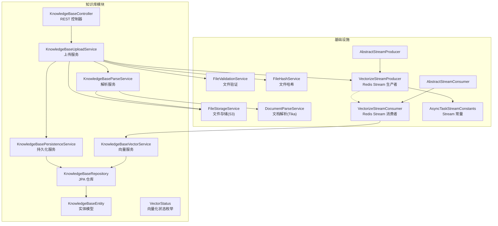
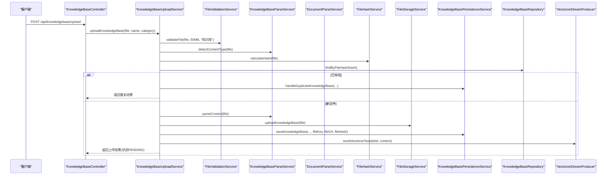
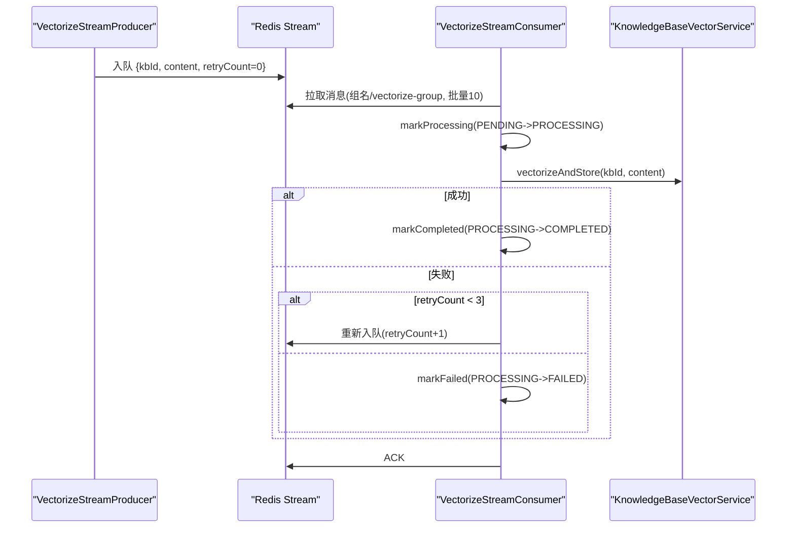
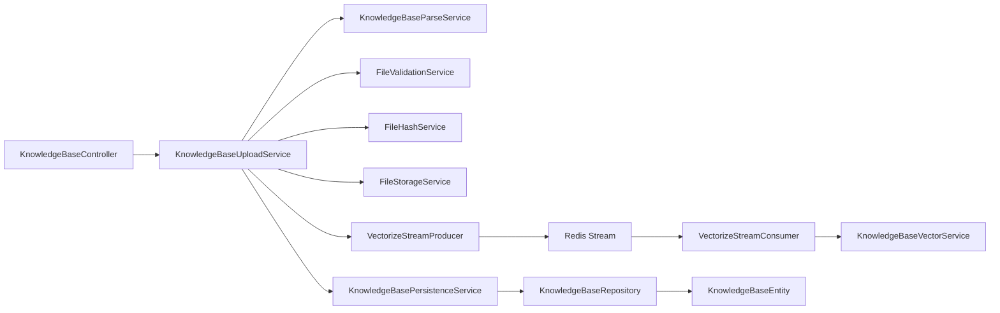

# 知识库上传服务

<cite>
**本文引用的文件**
- [KnowledgeBaseUploadService.java](file://app/src/main/java/interview/guide/modules/knowledgebase/service/KnowledgeBaseUploadService.java)
- [KnowledgeBaseParseService.java](file://app/src/main/java/interview/guide/modules/knowledgebase/service/KnowledgeBaseParseService.java)
- [KnowledgeBasePersistenceService.java](file://app/src/main/java/interview/guide/modules/knowledgebase/service/KnowledgeBasePersistenceService.java)
- [KnowledgeBaseVectorService.java](file://app/src/main/java/interview/guide/modules/knowledgebase/service/KnowledgeBaseVectorService.java)
- [KnowledgeBaseRepository.java](file://app/src/main/java/interview/guide/modules/knowledgebase/repository/KnowledgeBaseRepository.java)
- [KnowledgeBaseEntity.java](file://app/src/main/java/interview/guide/modules/knowledgebase/model/KnowledgeBaseEntity.java)
- [VectorStatus.java](file://app/src/main/java/interview/guide/modules/knowledgebase/model/VectorStatus.java)
- [VectorizeStreamProducer.java](file://app/src/main/java/interview/guide/modules/knowledgebase/listener/VectorizeStreamProducer.java)
- [VectorizeStreamConsumer.java](file://app/src/main/java/interview/guide/modules/knowledgebase/listener/VectorizeStreamConsumer.java)
- [FileValidationService.java](file://app/src/main/java/interview/guide/infrastructure/file/FileValidationService.java)
- [FileHashService.java](file://app/src/main/java/interview/guide/infrastructure/file/FileHashService.java)
- [FileStorageService.java](file://app/src/main/java/interview/guide/infrastructure/file/FileStorageService.java)
- [DocumentParseService.java](file://app/src/main/java/interview/guide/infrastructure/file/DocumentParseService.java)
- [KnowledgeBaseController.java](file://app/src/main/java/interview/guide/modules/knowledgebase/KnowledgeBaseController.java)
- [AsyncTaskStreamConstants.java](file://app/src/main/java/interview/guide/common/constant/AsyncTaskStreamConstants.java)
- [AbstractStreamProducer.java](file://app/src/main/java/interview/guide/common/async/AbstractStreamProducer.java)
- [AbstractStreamConsumer.java](file://app/src/main/java/interview/guide/common/async/AbstractStreamConsumer.java)
</cite>

## 目录
1. [简介](#简介)
2. [项目结构](#项目结构)
3. [核心组件](#核心组件)
4. [架构总览](#架构总览)
5. [详细组件分析](#详细组件分析)
6. [依赖关系分析](#依赖关系分析)
7. [性能考量](#性能考量)
8. [故障排除指南](#故障排除指南)
9. [结论](#结论)
10. [附录](#附录)

## 简介
本文件系统化阐述知识库上传服务的完整实现，围绕 KnowledgeBaseUploadService 的核心职责展开，覆盖文件验证、类型检测、去重检查、内容解析、文件存储、元数据持久化以及异步向量化任务发送。同时详解 uploadKnowledgeBase 方法的工作流程、参数处理、异常处理与返回结构，并说明 revectorize 方法的手动重试机制（文件重新下载、状态更新、任务重新发送）。最后提供最佳实践与故障排除建议。

## 项目结构
知识库上传服务位于模块 interview/guide/modules/knowledgebase 下，采用“控制器-服务-仓储-监听器-基础设施”的分层设计，结合 Redis Stream 实现异步向量化，确保高吞吐与解耦。

图表来源
- [KnowledgeBaseController.java:145-153](file://app/src/main/java/interview/guide/modules/knowledgebase/KnowledgeBaseController.java#L145-L153)
- [KnowledgeBaseUploadService.java:48-102](file://app/src/main/java/interview/guide/modules/knowledgebase/service/KnowledgeBaseUploadService.java#L48-L102)
- [KnowledgeBaseParseService.java:30-57](file://app/src/main/java/interview/guide/modules/knowledgebase/service/KnowledgeBaseParseService.java#L30-L57)
- [KnowledgeBasePersistenceService.java:58-78](file://app/src/main/java/interview/guide/modules/knowledgebase/service/KnowledgeBasePersistenceService.java#L58-L78)
- [KnowledgeBaseVectorService.java:45-81](file://app/src/main/java/interview/guide/modules/knowledgebase/service/KnowledgeBaseVectorService.java#L45-L81)
- [KnowledgeBaseRepository.java:18-23](file://app/src/main/java/interview/guide/modules/knowledgebase/repository/KnowledgeBaseRepository.java#L18-L23)
- [KnowledgeBaseEntity.java:10-72](file://app/src/main/java/interview/guide/modules/knowledgebase/model/KnowledgeBaseEntity.java#L10-L72)
- [VectorStatus.java:6-11](file://app/src/main/java/interview/guide/modules/knowledgebase/model/VectorStatus.java#L6-L11)
- [VectorizeStreamProducer.java:36-57](file://app/src/main/java/interview/guide/modules/knowledgebase/listener/VectorizeStreamProducer.java#L36-L57)
- [VectorizeStreamConsumer.java:85-97](file://app/src/main/java/interview/guide/modules/knowledgebase/listener/VectorizeStreamConsumer.java#L85-L97)
- [FileValidationService.java:27-36](file://app/src/main/java/interview/guide/infrastructure/file/FileValidationService.java#L27-L36)
- [FileHashService.java:31-55](file://app/src/main/java/interview/guide/infrastructure/file/FileHashService.java#L31-L55)
- [FileStorageService.java:52-111](file://app/src/main/java/interview/guide/infrastructure/file/FileStorageService.java#L52-L111)
- [DocumentParseService.java:45-91](file://app/src/main/java/interview/guide/infrastructure/file/DocumentParseService.java#L45-L91)
- [AsyncTaskStreamConstants.java:52-67](file://app/src/main/java/interview/guide/common/constant/AsyncTaskStreamConstants.java#L52-L67)
- [AbstractStreamProducer.java:22-36](file://app/src/main/java/interview/guide/common/async/AbstractStreamProducer.java#L22-L36)
- [AbstractStreamConsumer.java:95-123](file://app/src/main/java/interview/guide/common/async/AbstractStreamConsumer.java#L95-L123)

章节来源
- [KnowledgeBaseController.java:145-153](file://app/src/main/java/interview/guide/modules/knowledgebase/KnowledgeBaseController.java#L145-L153)
- [KnowledgeBaseUploadService.java:48-102](file://app/src/main/java/interview/guide/modules/knowledgebase/service/KnowledgeBaseUploadService.java#L48-L102)

## 核心组件
- KnowledgeBaseUploadService：协调上传全流程，封装验证、去重、解析、存储、持久化与异步任务发送。
- KnowledgeBaseParseService：委托 DocumentParseService 进行内容提取，并提供从存储下载解析的能力。
- KnowledgeBasePersistenceService：负责事务性元数据保存、重复处理与状态更新。
- KnowledgeBaseVectorService：负责文本分块、批量向量化与存储，以及相似度检索与回退策略。
- KnowledgeBaseRepository：JPA 仓库，提供去重、分类、统计与状态查询等接口。
- VectorizeStreamProducer/Consumer：基于 Redis Stream 的异步向量化任务生产与消费。
- FileValidationService：统一的文件大小与类型校验。
- FileHashService：SHA-256 哈希计算，用于去重。
- FileStorageService：S3 兼容存储（RustFS），提供上传、下载、URL 构造与桶存在性检查。
- DocumentParseService：Apache Tika 解析，支持 PDF/DOC/DOCX/TXT/MD 等，带清理与长度限制。
- AsyncTaskStreamConstants：异步任务 Stream 常量（键、组名、前缀、最大长度、重试次数等）。

章节来源
- [KnowledgeBaseUploadService.java:28-36](file://app/src/main/java/interview/guide/modules/knowledgebase/service/KnowledgeBaseUploadService.java#L28-L36)
- [KnowledgeBaseParseService.java:18-23](file://app/src/main/java/interview/guide/modules/knowledgebase/service/KnowledgeBaseParseService.java#L18-L23)
- [KnowledgeBasePersistenceService.java:23-25](file://app/src/main/java/interview/guide/modules/knowledgebase/service/KnowledgeBasePersistenceService.java#L23-L25)
- [KnowledgeBaseVectorService.java:25-39](file://app/src/main/java/interview/guide/modules/knowledgebase/service/KnowledgeBaseVectorService.java#L25-L39)
- [KnowledgeBaseRepository.java:18-23](file://app/src/main/java/interview/guide/modules/knowledgebase/repository/KnowledgeBaseRepository.java#L18-L23)
- [VectorizeStreamProducer.java:19-28](file://app/src/main/java/interview/guide/modules/knowledgebase/listener/VectorizeStreamProducer.java#L19-L28)
- [VectorizeStreamConsumer.java:21-34](file://app/src/main/java/interview/guide/modules/knowledgebase/listener/VectorizeStreamConsumer.java#L21-L34)
- [FileValidationService.java:18-18](file://app/src/main/java/interview/guide/infrastructure/file/FileValidationService.java#L18-L18)
- [FileHashService.java:20-24](file://app/src/main/java/interview/guide/infrastructure/file/FileHashService.java#L20-L24)
- [FileStorageService.java:30-34](file://app/src/main/java/interview/guide/infrastructure/file/FileStorageService.java#L30-L34)
- [DocumentParseService.java:28-37](file://app/src/main/java/interview/guide/infrastructure/file/DocumentParseService.java#L28-L37)
- [AsyncTaskStreamConstants.java:7-13](file://app/src/main/java/interview/guide/common/constant/AsyncTaskStreamConstants.java#L7-L13)

## 架构总览
知识库上传采用同步入口 + 异步处理模式：
- 控制器接收 multipart/form-data 请求，调用上传服务。
- 上传服务执行文件验证、类型检测、去重检查、内容解析。
- 文件上传至 S3 兼容存储，生成 fileKey 与 fileUrl。
- 元数据以 PENDING 状态写入数据库。
- 向量化任务通过 Redis Stream 异步执行，消费者完成分块、批量向量化与入库，并更新状态。

图表来源
- [KnowledgeBaseController.java:145-153](file://app/src/main/java/interview/guide/modules/knowledgebase/KnowledgeBaseController.java#L145-L153)
- [KnowledgeBaseUploadService.java:48-102](file://app/src/main/java/interview/guide/modules/knowledgebase/service/KnowledgeBaseUploadService.java#L48-L102)
- [FileValidationService.java:27-36](file://app/src/main/java/interview/guide/infrastructure/file/FileValidationService.java#L27-L36)
- [KnowledgeBaseParseService.java:30-33](file://app/src/main/java/interview/guide/modules/knowledgebase/service/KnowledgeBaseParseService.java#L30-L33)
- [FileHashService.java:31-38](file://app/src/main/java/interview/guide/infrastructure/file/FileHashService.java#L31-L38)
- [FileStorageService.java:52-111](file://app/src/main/java/interview/guide/infrastructure/file/FileStorageService.java#L52-L111)
- [KnowledgeBasePersistenceService.java:58-78](file://app/src/main/java/interview/guide/modules/knowledgebase/service/KnowledgeBasePersistenceService.java#L58-L78)
- [VectorizeStreamProducer.java:36-38](file://app/src/main/java/interview/guide/modules/knowledgebase/listener/VectorizeStreamProducer.java#L36-L38)

## 详细组件分析

### 上传服务：KnowledgeBaseUploadService
- 职责
  - 文件大小与类型验证（50MB 限制、MIME 类型与扩展名校验）
  - 基于 SHA-256 的去重检查
  - 内容解析（提取文本，用于向量化）
  - 文件存储（S3 兼容，生成 fileKey 与 fileUrl）
  - 元数据持久化（状态 PENDING）
  - 异步向量化任务发送（Redis Stream）

- uploadKnowledgeBase 方法流程
  1) 参数处理：接收 MultipartFile、可选 name 与 category。
  2) 文件验证：调用 FileValidationService.validateFile，限制 50MB。
  3) 类型检测：parseService.detectContentType(file)，随后 validateContentType 基于 MIME 与扩展名双重校验。
  4) 去重检查：FileHashService.calculateHash(file) → KnowledgeBaseRepository.findByFileHash。
  5) 内容解析：parseService.parseContent(file)，若为空则抛业务异常。
  6) 文件存储：FileStorageService.uploadKnowledgeBase(file) 与 getFileUrl。
  7) 元数据保存：KnowledgeBasePersistenceService.saveKnowledgeBase(...)，设置状态为 PENDING。
  8) 异步任务：VectorizeStreamProducer.sendVectorizeTask(kbId, content)。
  9) 返回结构：包含 knowledgeBase 基本信息、storage 信息与 duplicate 标记；向量化状态为 PENDING。

- 异常处理
  - 文件为空、超限、类型不支持、解析失败、存储失败、保存失败均抛出业务异常。
  - Redis 入队失败时，通过 AbstractStreamProducer.onSendFailed 更新向量化状态为 FAILED 并截断错误信息。

- 返回值结构
  - knowledgeBase：id、name、category、fileSize、contentLength、vectorStatus
  - storage：fileKey、fileUrl
  - duplicate：布尔值，true 表示重复上传

章节来源
- [KnowledgeBaseUploadService.java:48-102](file://app/src/main/java/interview/guide/modules/knowledgebase/service/KnowledgeBaseUploadService.java#L48-L102)
- [FileValidationService.java:27-36](file://app/src/main/java/interview/guide/infrastructure/file/FileValidationService.java#L27-L36)
- [FileValidationService.java:61-77](file://app/src/main/java/interview/guide/infrastructure/file/FileValidationService.java#L61-L77)
- [FileHashService.java:31-55](file://app/src/main/java/interview/guide/infrastructure/file/FileHashService.java#L31-L55)
- [FileStorageService.java:52-111](file://app/src/main/java/interview/guide/infrastructure/file/FileStorageService.java#L52-L111)
- [KnowledgeBasePersistenceService.java:58-78](file://app/src/main/java/interview/guide/modules/knowledgebase/service/KnowledgeBasePersistenceService.java#L58-L78)
- [VectorizeStreamProducer.java:36-38](file://app/src/main/java/interview/guide/modules/knowledgebase/listener/VectorizeStreamProducer.java#L36-L38)
- [AbstractStreamProducer.java:31-35](file://app/src/main/java/interview/guide/common/async/AbstractStreamProducer.java#L31-L35)

### 解析服务：KnowledgeBaseParseService
- 委托 DocumentParseService 完成多格式解析（PDF/DOC/DOCX/TXT/MD 等）。
- 支持从 MultipartFile 与字节数组解析。
- 提供 downloadAndParseContent，从存储下载并解析，用于 revectorize。

章节来源
- [KnowledgeBaseParseService.java:30-57](file://app/src/main/java/interview/guide/modules/knowledgebase/service/KnowledgeBaseParseService.java#L30-L57)
- [DocumentParseService.java:45-91](file://app/src/main/java/interview/guide/infrastructure/file/DocumentParseService.java#L45-L91)
- [DocumentParseService.java:149-162](file://app/src/main/java/interview/guide/infrastructure/file/DocumentParseService.java#L149-L162)

### 持久化服务：KnowledgeBasePersistenceService
- handleDuplicateKnowledgeBase：在事务中更新访问计数并返回重复记录，contentLength=0。
- saveKnowledgeBase：构建 KnowledgeBaseEntity，设置 name（来自参数或从文件名提取）、category、原始文件名、大小、类型、存储键与 URL，保存并返回实体。
- updateVectorStatusToPending：将指定知识库向量化状态更新为 PENDING，并清空错误信息。

章节来源
- [KnowledgeBasePersistenceService.java:30-52](file://app/src/main/java/interview/guide/modules/knowledgebase/service/KnowledgeBasePersistenceService.java#L30-L52)
- [KnowledgeBasePersistenceService.java:58-93](file://app/src/main/java/interview/guide/modules/knowledgebase/service/KnowledgeBasePersistenceService.java#L58-L93)
- [KnowledgeBasePersistenceService.java:98-107](file://app/src/main/java/interview/guide/modules/knowledgebase/service/KnowledgeBasePersistenceService.java#L98-L107)

### 向量服务：KnowledgeBaseVectorService
- vectorizeAndStore：删除旧向量 → 文本分块（TokenTextSplitter）→ 批量向量化（阿里云 DashScope API 限制每批 ≤10）→ 写入向量库 → 记录统计。
- similaritySearch：支持按知识库 ID 过滤、相似度阈值与 topK 限制；失败时回退到本地过滤并再次限制 topK。
- deleteByKnowledgeBaseId：委托 VectorRepository 删除对应知识库的向量数据。

章节来源
- [KnowledgeBaseVectorService.java:45-81](file://app/src/main/java/interview/guide/modules/knowledgebase/service/KnowledgeBaseVectorService.java#L45-L81)
- [KnowledgeBaseVectorService.java:91-125](file://app/src/main/java/interview/guide/modules/knowledgebase/service/KnowledgeBaseVectorService.java#L91-L125)
- [KnowledgeBaseVectorService.java:191-201](file://app/src/main/java/interview/guide/modules/knowledgebase/service/KnowledgeBaseVectorService.java#L191-L201)

### 仓储与模型
- KnowledgeBaseRepository：提供去重查询、分类查询、关键词搜索、按状态统计与查询等。
- KnowledgeBaseEntity：包含 fileHash（唯一索引）、name、category、originalFilename、fileSize、contentType、storageKey、storageUrl、uploadedAt、lastAccessedAt、accessCount、questionCount、vectorStatus、vectorError、chunkCount 等字段。
- VectorStatus：PENDING、PROCESSING、COMPLETED、FAILED。

章节来源
- [KnowledgeBaseRepository.java:18-106](file://app/src/main/java/interview/guide/modules/knowledgebase/repository/KnowledgeBaseRepository.java#L18-L106)
- [KnowledgeBaseEntity.java:10-72](file://app/src/main/java/interview/guide/modules/knowledgebase/model/KnowledgeBaseEntity.java#L10-L72)
- [VectorStatus.java:6-11](file://app/src/main/java/interview/guide/modules/knowledgebase/model/VectorStatus.java#L6-L11)

### 异步向量化：生产者与消费者
- VectorizeStreamProducer：构建消息（kbId、content、retryCount=0），入队到 knowledgebase:vectorize:stream，失败时更新状态为 FAILED。
- VectorizeStreamConsumer：创建消费者组 → 单线程消费循环（BATCH_SIZE=10，POLL_INTERVAL_MS=1000）→ markProcessing → processBusiness（调用 vectorizeAndStore）→ markCompleted → ACK。
- 重试机制：当异常且 retryCount < 3 时重新入队；否则标记 FAILED 并记录错误（截断至 500 字符）。

图表来源
- [VectorizeStreamProducer.java:36-57](file://app/src/main/java/interview/guide/modules/knowledgebase/listener/VectorizeStreamProducer.java#L36-L57)
- [VectorizeStreamConsumer.java:74-121](file://app/src/main/java/interview/guide/modules/knowledgebase/listener/VectorizeStreamConsumer.java#L74-L121)
- [AsyncTaskStreamConstants.java:29-46](file://app/src/main/java/interview/guide/common/constant/AsyncTaskStreamConstants.java#L29-L46)
- [KnowledgeBaseVectorService.java:45-81](file://app/src/main/java/interview/guide/modules/knowledgebase/service/KnowledgeBaseVectorService.java#L45-L81)

章节来源
- [VectorizeStreamProducer.java:19-81](file://app/src/main/java/interview/guide/modules/knowledgebase/listener/VectorizeStreamProducer.java#L19-L81)
- [VectorizeStreamConsumer.java:21-139](file://app/src/main/java/interview/guide/modules/knowledgebase/listener/VectorizeStreamConsumer.java#L21-L139)
- [AbstractStreamConsumer.java:95-123](file://app/src/main/java/interview/guide/common/async/AbstractStreamConsumer.java#L95-L123)

### 手动重试：revectorize
- 步骤
  1) 校验知识库存在性，不存在抛出业务异常。
  2) 通过 KnowledgeBaseParseService.downloadAndParseContent 从存储重新下载并解析内容。
  3) 调用 PersistenceService.updateVectorStatusToPending 将状态更新为 PENDING。
  4) 重新发送向量化任务到 Redis Stream。
- 适用场景：向量化失败、内容变更或缓存失效后的手动触发。

章节来源
- [KnowledgeBaseUploadService.java:123-142](file://app/src/main/java/interview/guide/modules/knowledgebase/service/KnowledgeBaseUploadService.java#L123-L142)
- [KnowledgeBaseParseService.java:54-57](file://app/src/main/java/interview/guide/modules/knowledgebase/service/KnowledgeBaseParseService.java#L54-L57)
- [KnowledgeBasePersistenceService.java:83-93](file://app/src/main/java/interview/guide/modules/knowledgebase/service/KnowledgeBasePersistenceService.java#L83-L93)
- [VectorizeStreamProducer.java:36-38](file://app/src/main/java/interview/guide/modules/knowledgebase/listener/VectorizeStreamProducer.java#L36-L38)

## 依赖关系分析
- 低耦合高内聚：上传服务聚合各协作组件，避免跨层依赖；解析、存储、验证、哈希、持久化与 Stream 生产者均为独立服务。
- 关键依赖链
  - 控制器 → 上传服务 → 解析/验证/哈希/存储/持久化/生产者
  - 生产者 → Redis Stream → 消费者 → 向量服务 → 数据库
- 潜在风险
  - Redis 入队失败：由 AbstractStreamProducer 统一兜底，更新状态为 FAILED。
  - 向量化失败：消费者根据重试上限决定是否继续重试或标记失败。
  - 存储桶不存在：FileStorageService.ensureBucketExists 在启动时保障桶存在。

图表来源
- [KnowledgeBaseController.java:145-153](file://app/src/main/java/interview/guide/modules/knowledgebase/KnowledgeBaseController.java#L145-L153)
- [KnowledgeBaseUploadService.java:30-36](file://app/src/main/java/interview/guide/modules/knowledgebase/service/KnowledgeBaseUploadService.java#L30-L36)
- [VectorizeStreamProducer.java:25-28](file://app/src/main/java/interview/guide/modules/knowledgebase/listener/VectorizeStreamProducer.java#L25-L28)
- [VectorizeStreamConsumer.java:26-34](file://app/src/main/java/interview/guide/modules/knowledgebase/listener/VectorizeStreamConsumer.java#L26-L34)
- [KnowledgeBasePersistenceService.java:25-25](file://app/src/main/java/interview/guide/modules/knowledgebase/service/KnowledgeBasePersistenceService.java#L25-L25)
- [KnowledgeBaseRepository.java:18-23](file://app/src/main/java/interview/guide/modules/knowledgebase/repository/KnowledgeBaseRepository.java#L18-L23)
- [KnowledgeBaseEntity.java:10-72](file://app/src/main/java/interview/guide/modules/knowledgebase/model/KnowledgeBaseEntity.java#L10-L72)

章节来源
- [KnowledgeBaseUploadService.java:30-36](file://app/src/main/java/interview/guide/modules/knowledgebase/service/KnowledgeBaseUploadService.java#L30-L36)
- [VectorizeStreamProducer.java:25-28](file://app/src/main/java/interview/guide/modules/knowledgebase/listener/VectorizeStreamProducer.java#L25-L28)
- [VectorizeStreamConsumer.java:26-34](file://app/src/main/java/interview/guide/modules/knowledgebase/listener/VectorizeStreamConsumer.java#L26-L34)

## 性能考量
- 文件解析
  - DocumentParseService 限制最大文本长度为 5MB，避免内存压力。
  - PDF 解析启用按位置排序，提升多栏布局的文本顺序质量。
- 向量化
  - 使用 TokenTextSplitter 进行分块，批量大小限制为 10，适配 DashScope API。
  - 分批写入向量库，减少单次请求负载。
- 存储
  - FileStorageService 采用 S3Client 上传/下载，支持 headObject 检查与桶存在性保障。
- 异步处理
  - Redis Stream 消费者单线程批量拉取（BATCH_SIZE=10），降低并发开销；失败自动重试（MAX_RETRY_COUNT=3）。
- 去重
  - 基于 SHA-256 哈希，避免重复解析与存储，显著节省资源。

章节来源
- [DocumentParseService.java:31-32](file://app/src/main/java/interview/guide/infrastructure/file/DocumentParseService.java#L31-L32)
- [DocumentParseService.java:128-132](file://app/src/main/java/interview/guide/infrastructure/file/DocumentParseService.java#L128-L132)
- [KnowledgeBaseVectorService.java:30-39](file://app/src/main/java/interview/guide/modules/knowledgebase/service/KnowledgeBaseVectorService.java#L30-L39)
- [KnowledgeBaseVectorService.java:64-73](file://app/src/main/java/interview/guide/modules/knowledgebase/service/KnowledgeBaseVectorService.java#L64-L73)
- [FileStorageService.java:89-111](file://app/src/main/java/interview/guide/infrastructure/file/FileStorageService.java#L89-L111)
- [FileStorageService.java:184-201](file://app/src/main/java/interview/guide/infrastructure/file/FileStorageService.java#L184-L201)
- [AbstractStreamConsumer.java:46-58](file://app/src/main/java/interview/guide/common/async/AbstractStreamConsumer.java#L46-L58)
- [AsyncTaskStreamConstants.java:29-46](file://app/src/main/java/interview/guide/common/constant/AsyncTaskStreamConstants.java#L29-L46)

## 故障排除指南
- 常见错误与定位
  - BAD_REQUEST：文件为空、大小超限、类型不支持。检查 FileValidationService.validateFile 与 validateContentType 的调用链。
  - INTERNAL_ERROR：文件解析失败、存储读取失败、保存元数据失败。查看对应异常抛出处的日志。
  - STORAGE_UPLOAD_FAILED/STORAGE_DOWNLOAD_FAILED：S3 客户端异常，检查桶权限、endpoint 与 key。
  - KNOWLEDGE_BASE_VECTORIZATION_FAILED：向量化异常，查看消费者日志与错误截断信息。
- 重试与恢复
  - Redis 入队失败：onSendFailed 自动将向量化状态置为 FAILED。
  - 向量化失败：消费者在 retryCount < 3 时自动重试；达到上限后标记 FAILED。
  - 手动重试：调用 /api/knowledgebase/{id}/revectorize，服务会重新下载解析并发送任务。
- 建议排查步骤
  1) 确认文件大小与类型符合要求（<=50MB，支持 PDF/DOC/DOCX/TXT/MD 等）。
  2) 检查 S3 存储桶存在性与权限。
  3) 查看 Redis Stream 消费者组与消息积压情况。
  4) 关注向量化状态变化（PENDING/PROCESSING/COMPLETED/FAILED）。
  5) 必要时使用 revectorize 触发手动重试。

章节来源
- [FileValidationService.java:27-36](file://app/src/main/java/interview/guide/infrastructure/file/FileValidationService.java#L27-L36)
- [FileValidationService.java:61-77](file://app/src/main/java/interview/guide/infrastructure/file/FileValidationService.java#L61-L77)
- [FileStorageService.java:104-110](file://app/src/main/java/interview/guide/infrastructure/file/FileStorageService.java#L104-L110)
- [VectorizeStreamProducer.java:65-67](file://app/src/main/java/interview/guide/modules/knowledgebase/listener/VectorizeStreamProducer.java#L65-L67)
- [VectorizeStreamConsumer.java:117-121](file://app/src/main/java/interview/guide/modules/knowledgebase/listener/VectorizeStreamConsumer.java#L117-L121)
- [KnowledgeBaseUploadService.java:123-142](file://app/src/main/java/interview/guide/modules/knowledgebase/service/KnowledgeBaseUploadService.java#L123-L142)

## 结论
知识库上传服务通过严格的文件验证、智能去重、稳健的内容解析与 S3 存储，结合 Redis Stream 的异步向量化，实现了高可靠、高性能的知识库入库能力。uploadKnowledgeBase 方法将复杂流程封装为清晰的步骤，revectorize 提供了便捷的手动重试机制。配合完善的异常处理与状态管理，整体方案具备良好的可维护性与扩展性。

## 附录

### API 定义与行为摘要
- 上传接口
  - 方法：POST
  - 路径：/api/knowledgebase/upload
  - 参数：multipart/form-data，file（必填）、name（可选）、category（可选）
  - 返回：包含 knowledgeBase、storage、duplicate 的结构化结果；向量化状态初始为 PENDING
- 重试接口
  - 方法：POST
  - 路径：/api/knowledgebase/{id}/revectorize
  - 行为：重新下载解析内容并发送向量化任务，状态更新为 PENDING

章节来源
- [KnowledgeBaseController.java:145-153](file://app/src/main/java/interview/guide/modules/knowledgebase/KnowledgeBaseController.java#L145-L153)
- [KnowledgeBaseController.java:202-208](file://app/src/main/java/interview/guide/modules/knowledgebase/KnowledgeBaseController.java#L202-L208)