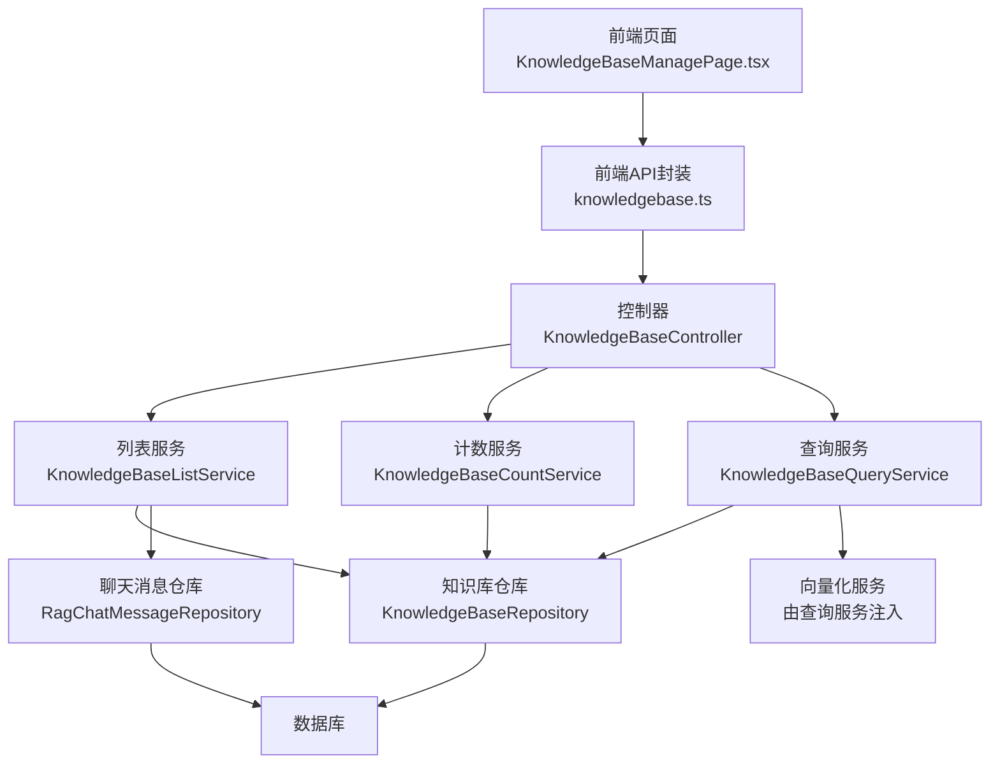
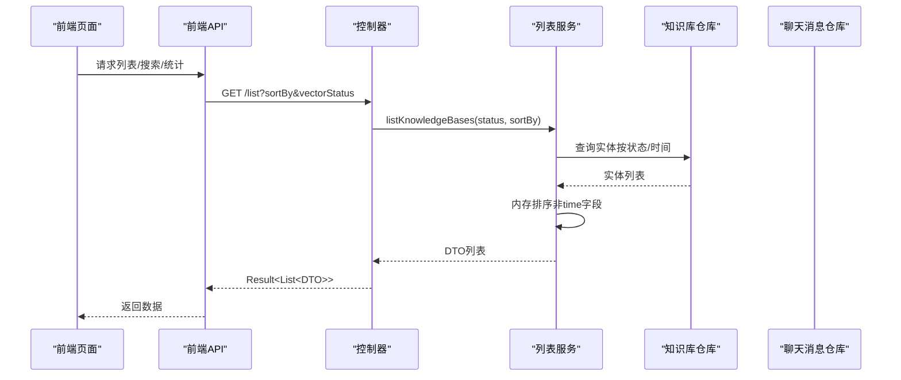
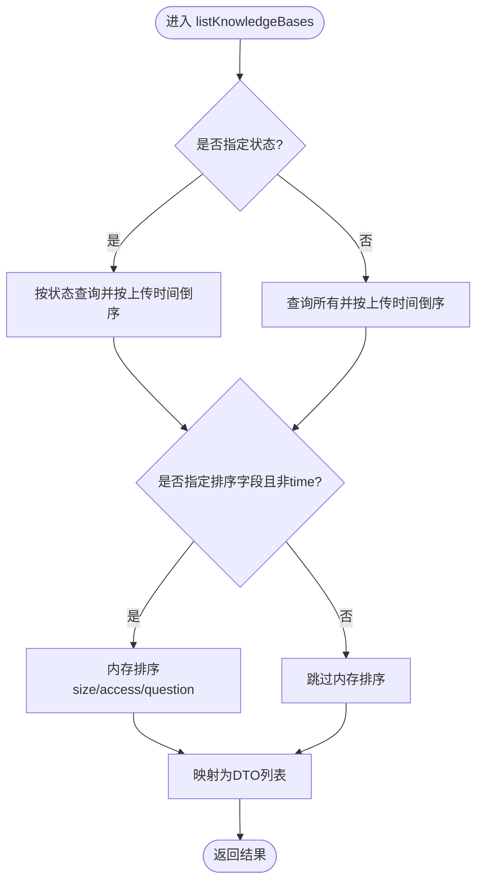
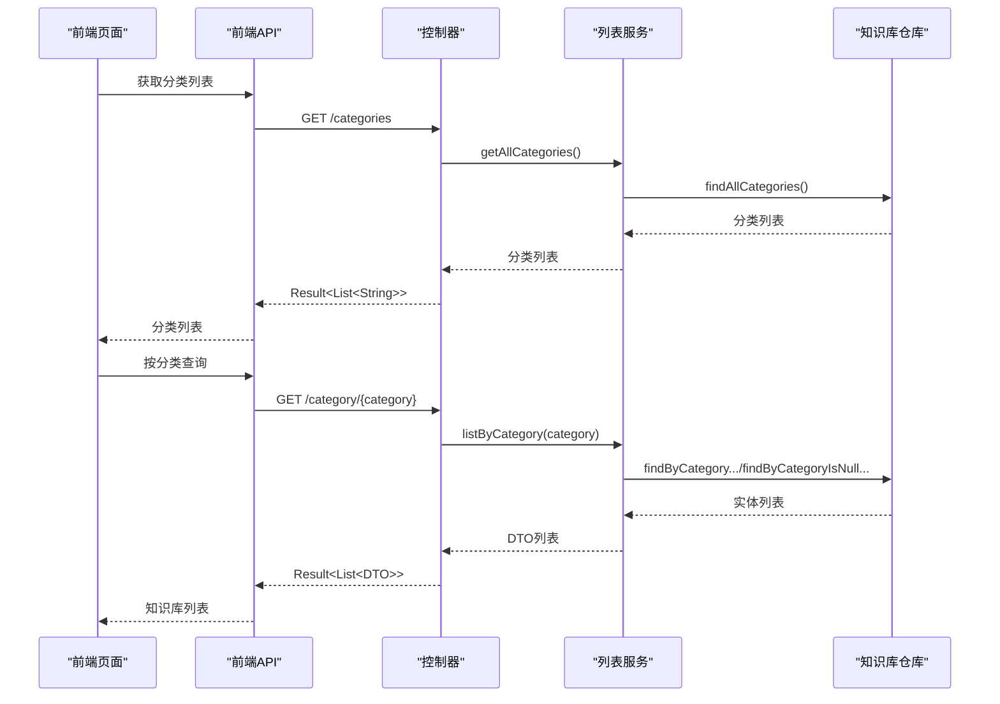
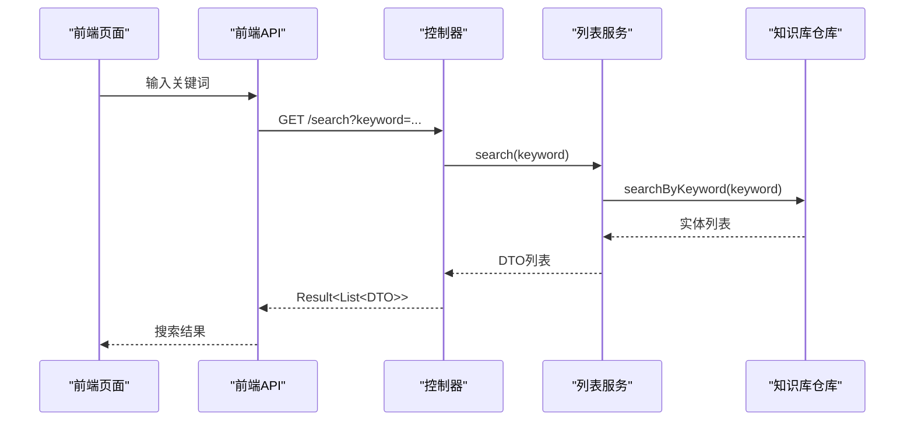
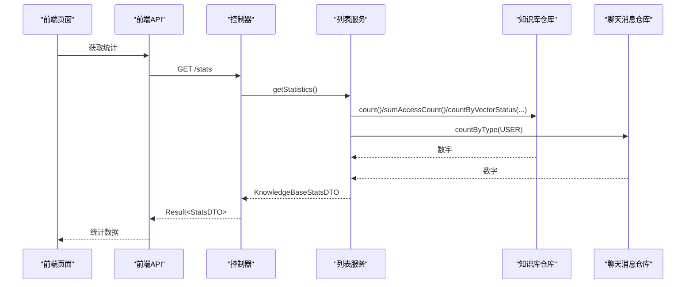
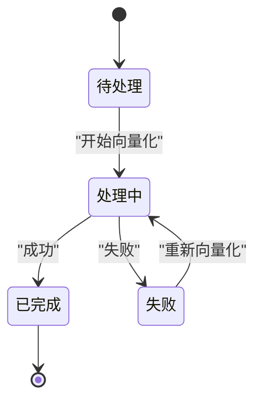
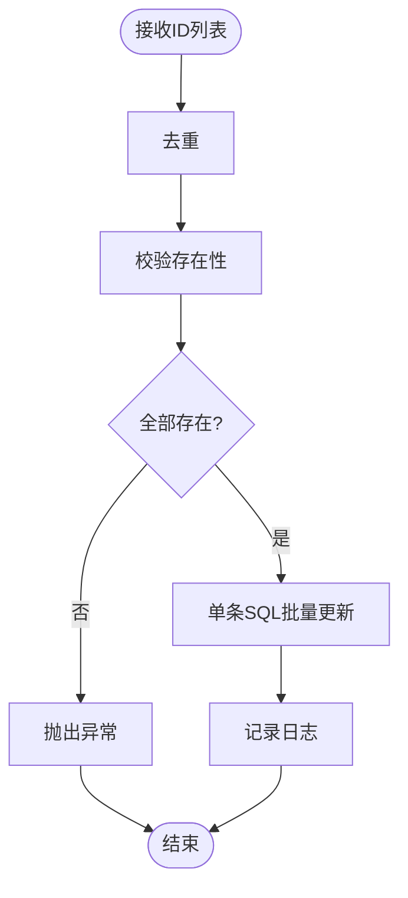
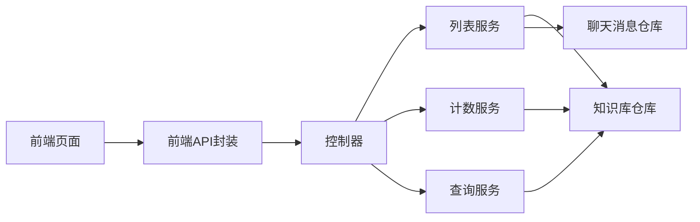

# 知识库列表服务

<cite>
**本文引用的文件**
- [KnowledgeBaseListService.java](file://app/src/main/java/interview/guide/modules/knowledgebase/service/KnowledgeBaseListService.java)
- [KnowledgeBaseCountService.java](file://app/src/main/java/interview/guide/modules/knowledgebase/service/KnowledgeBaseCountService.java)
- [KnowledgeBaseController.java](file://app/src/main/java/interview/guide/modules/knowledgebase/KnowledgeBaseController.java)
- [KnowledgeBaseRepository.java](file://app/src/main/java/interview/guide/modules/knowledgebase/repository/KnowledgeBaseRepository.java)
- [RagChatMessageRepository.java](file://app/src/main/java/interview/guide/modules/knowledgebase/repository/RagChatMessageRepository.java)
- [KnowledgeBaseEntity.java](file://app/src/main/java/interview/guide/modules/knowledgebase/model/KnowledgeBaseEntity.java)
- [KnowledgeBaseListItemDTO.java](file://app/src/main/java/interview/guide/modules/knowledgebase/model/KnowledgeBaseListItemDTO.java)
- [KnowledgeBaseStatsDTO.java](file://app/src/main/java/interview/guide/modules/knowledgebase/model/KnowledgeBaseStatsDTO.java)
- [VectorStatus.java](file://app/src/main/java/interview/guide/modules/knowledgebase/model/VectorStatus.java)
- [KnowledgeBaseQueryService.java](file://app/src/main/java/interview/guide/modules/knowledgebase/service/KnowledgeBaseQueryService.java)
- [KnowledgeBaseQueryProperties.java](file://app/src/main/java/interview/guide/modules/knowledgebase/service/KnowledgeBaseQueryProperties.java)
- [QueryRequest.java](file://app/src/main/java/interview/guide/modules/knowledgebase/model/QueryRequest.java)
- [QueryResponse.java](file://app/src/main/java/interview/guide/modules/knowledgebase/model/QueryResponse.java)
- [KnowledgeBaseManagePage.tsx](file://frontend/src/pages/KnowledgeBaseManagePage.tsx)
- [knowledgebase.ts](file://frontend/src/api/knowledgebase.ts)
</cite>

## 目录
1. [简介](#简介)
2. [项目结构](#项目结构)
3. [核心组件](#核心组件)
4. [架构概览](#架构概览)
5. [详细组件分析](#详细组件分析)
6. [依赖分析](#依赖分析)
7. [性能考虑](#性能考虑)
8. [故障排查指南](#故障排查指南)
9. [结论](#结论)
10. [附录](#附录)

## 简介
本文件围绕知识库列表服务展开，系统性阐述 KnowledgeBaseListService 的列表查询、分类筛选、状态统计、排序规则、搜索机制与性能优化策略，并解释与之配套的 KnowledgeBaseCountService 的统计能力。同时覆盖知识库元数据管理（名称、分类、上传时间、文件大小、向量化状态等）以及状态管理（PENDING、PROCESSING、SUCCESS、FAILED）。文档面向技术与非技术读者，提供可视化图示、流程图与最佳实践建议。

## 项目结构
知识库模块采用分层架构：
- 控制器层：对外暴露 REST API，负责参数校验与响应封装
- 服务层：业务逻辑编排，包含列表查询、统计、计数更新等
- 数据访问层：JPA Repository 提供数据持久化与查询
- 模型层：实体、DTO、枚举与查询请求/响应对象
- 前端页面与API：管理页面展示列表、状态与统计，发起查询与下载

图表来源
- [KnowledgeBaseController.java:47-62](file://app/src/main/java/interview/guide/modules/knowledgebase/KnowledgeBaseController.java#L47-L62)
- [KnowledgeBaseListService.java:43-60](file://app/src/main/java/interview/guide/modules/knowledgebase/service/KnowledgeBaseListService.java#L43-L60)
- [KnowledgeBaseCountService.java:32-54](file://app/src/main/java/interview/guide/modules/knowledgebase/service/KnowledgeBaseCountService.java#L32-L54)
- [KnowledgeBaseQueryService.java:111-155](file://app/src/main/java/interview/guide/modules/knowledgebase/service/KnowledgeBaseQueryService.java#L111-L155)

章节来源
- [KnowledgeBaseController.java:47-62](file://app/src/main/java/interview/guide/modules/knowledgebase/KnowledgeBaseController.java#L47-L62)
- [KnowledgeBaseListService.java:43-60](file://app/src/main/java/interview/guide/modules/knowledgebase/service/KnowledgeBaseListService.java#L43-L60)
- [KnowledgeBaseCountService.java:32-54](file://app/src/main/java/interview/guide/modules/knowledgebase/service/KnowledgeBaseCountService.java#L32-L54)
- [KnowledgeBaseQueryService.java:111-155](file://app/src/main/java/interview/guide/modules/knowledgebase/service/KnowledgeBaseQueryService.java#L111-L155)

## 核心组件
- 列表服务（KnowledgeBaseListService）：提供列表查询、分类筛选、关键词搜索、排序、统计与下载能力
- 计数服务（KnowledgeBaseCountService）：批量更新知识库提问计数
- 控制器（KnowledgeBaseController）：REST API 入口，参数解析与响应封装
- 仓库（KnowledgeBaseRepository、RagChatMessageRepository）：数据访问与聚合查询
- 实体与DTO（KnowledgeBaseEntity、KnowledgeBaseListItemDTO、KnowledgeBaseStatsDTO、VectorStatus）
- 查询服务（KnowledgeBaseQueryService）：配合列表服务进行统计与问答

章节来源
- [KnowledgeBaseListService.java:29-219](file://app/src/main/java/interview/guide/modules/knowledgebase/service/KnowledgeBaseListService.java#L29-L219)
- [KnowledgeBaseCountService.java:22-56](file://app/src/main/java/interview/guide/modules/knowledgebase/service/KnowledgeBaseCountService.java#L22-L56)
- [KnowledgeBaseController.java:37-211](file://app/src/main/java/interview/guide/modules/knowledgebase/KnowledgeBaseController.java#L37-L211)
- [KnowledgeBaseRepository.java:18-108](file://app/src/main/java/interview/guide/modules/knowledgebase/repository/KnowledgeBaseRepository.java#L18-L108)
- [RagChatMessageRepository.java:17-50](file://app/src/main/java/interview/guide/modules/knowledgebase/repository/RagChatMessageRepository.java#L17-L50)
- [KnowledgeBaseEntity.java:15-223](file://app/src/main/java/interview/guide/modules/knowledgebase/model/KnowledgeBaseEntity.java#L15-L223)
- [KnowledgeBaseListItemDTO.java:9-24](file://app/src/main/java/interview/guide/modules/knowledgebase/model/KnowledgeBaseListItemDTO.java#L9-L24)
- [KnowledgeBaseStatsDTO.java:6-13](file://app/src/main/java/interview/guide/modules/knowledgebase/model/KnowledgeBaseStatsDTO.java#L6-L13)
- [VectorStatus.java:6-11](file://app/src/main/java/interview/guide/modules/knowledgebase/model/VectorStatus.java#L6-L11)

## 架构概览
知识库列表服务通过控制器接收请求，调用列表服务执行查询与统计，仓库层负责数据访问与聚合。前端页面通过API封装调用后端接口，实现列表展示、搜索、分类筛选与排序。

图表来源
- [KnowledgeBaseController.java:47-62](file://app/src/main/java/interview/guide/modules/knowledgebase/KnowledgeBaseController.java#L47-L62)
- [KnowledgeBaseListService.java:43-60](file://app/src/main/java/interview/guide/modules/knowledgebase/service/KnowledgeBaseListService.java#L43-L60)
- [KnowledgeBaseRepository.java:33-34](file://app/src/main/java/interview/guide/modules/knowledgebase/repository/KnowledgeBaseRepository.java#L33-L34)

## 详细组件分析

### 列表查询与排序机制
- 查询入口
  - 支持按向量化状态过滤与按上传时间倒序的基础查询
  - 支持按关键词搜索（名称或原始文件名，不区分大小写）
  - 支持按 size、access、question 字段进行内存排序；默认按 time 排序
- 排序实现
  - 时间排序在数据库层面完成
  - 其他字段在内存中进行排序，注意大数据量时的性能影响
- 分页处理
  - 当前实现未引入分页参数，适用于中小规模数据集
  - 若未来扩展，建议引入 Pageable 并结合数据库分页索引

图表来源
- [KnowledgeBaseListService.java:43-60](file://app/src/main/java/interview/guide/modules/knowledgebase/service/KnowledgeBaseListService.java#L43-L60)
- [KnowledgeBaseListService.java:162-175](file://app/src/main/java/interview/guide/modules/knowledgebase/service/KnowledgeBaseListService.java#L162-L175)
- [KnowledgeBaseRepository.java:33-34](file://app/src/main/java/interview/guide/modules/knowledgebase/repository/KnowledgeBaseRepository.java#L33-L34)

章节来源
- [KnowledgeBaseListService.java:43-60](file://app/src/main/java/interview/guide/modules/knowledgebase/service/KnowledgeBaseListService.java#L43-L60)
- [KnowledgeBaseListService.java:162-175](file://app/src/main/java/interview/guide/modules/knowledgebase/service/KnowledgeBaseListService.java#L162-L175)
- [KnowledgeBaseRepository.java:33-34](file://app/src/main/java/interview/guide/modules/knowledgebase/repository/KnowledgeBaseRepository.java#L33-L34)

### 分类筛选与管理
- 分类获取：提供所有分类列表
- 分类查询：支持按分类或未分类（category=null）查询
- 分类更新：支持更新知识库分类，空字符串转为 null 存储
- 前端交互：管理页面提供分类编辑与保存

图表来源
- [KnowledgeBaseController.java:110-130](file://app/src/main/java/interview/guide/modules/knowledgebase/KnowledgeBaseController.java#L110-L130)
- [KnowledgeBaseListService.java:107-134](file://app/src/main/java/interview/guide/modules/knowledgebase/service/KnowledgeBaseListService.java#L107-L134)
- [KnowledgeBaseRepository.java:38-49](file://app/src/main/java/interview/guide/modules/knowledgebase/repository/KnowledgeBaseRepository.java#L38-L49)

章节来源
- [KnowledgeBaseController.java:110-130](file://app/src/main/java/interview/guide/modules/knowledgebase/KnowledgeBaseController.java#L110-L130)
- [KnowledgeBaseListService.java:107-134](file://app/src/main/java/interview/guide/modules/knowledgebase/service/KnowledgeBaseListService.java#L107-L134)
- [KnowledgeBaseRepository.java:38-49](file://app/src/main/java/interview/guide/modules/knowledgebase/repository/KnowledgeBaseRepository.java#L38-L49)

### 搜索机制
- 关键词搜索：基于名称与原始文件名的模糊匹配（不区分大小写），按上传时间倒序
- 前端触发：管理页面在输入框变化时触发搜索请求
- 仓库实现：使用 JPQL LIKE 进行模糊匹配

图表来源
- [KnowledgeBaseController.java:181-184](file://app/src/main/java/interview/guide/modules/knowledgebase/KnowledgeBaseController.java#L181-L184)
- [KnowledgeBaseListService.java:141-148](file://app/src/main/java/interview/guide/modules/knowledgebase/service/KnowledgeBaseListService.java#L141-L148)
- [KnowledgeBaseRepository.java:54-55](file://app/src/main/java/interview/guide/modules/knowledgebase/repository/KnowledgeBaseRepository.java#L54-L55)

章节来源
- [KnowledgeBaseController.java:181-184](file://app/src/main/java/interview/guide/modules/knowledgebase/KnowledgeBaseController.java#L181-L184)
- [KnowledgeBaseListService.java:141-148](file://app/src/main/java/interview/guide/modules/knowledgebase/service/KnowledgeBaseListService.java#L141-L148)
- [KnowledgeBaseRepository.java:54-55](file://app/src/main/java/interview/guide/modules/knowledgebase/repository/KnowledgeBaseRepository.java#L54-L55)

### 状态统计与使用情况分析
- 统计维度
  - 知识库总数、总提问次数、总访问次数
  - 已完成向量化数量、处理中数量
- 统计来源
  - 知识库总数与访问计数：仓库聚合查询
  - 总提问次数：基于聊天消息仓库的用户消息计数
  - 向量化状态分布：按状态计数
- 前端展示：管理页面顶部统计卡片展示各项指标

图表来源
- [KnowledgeBaseController.java:191-194](file://app/src/main/java/interview/guide/modules/knowledgebase/KnowledgeBaseController.java#L191-L194)
- [KnowledgeBaseListService.java:183-191](file://app/src/main/java/interview/guide/modules/knowledgebase/service/KnowledgeBaseListService.java#L183-L191)
- [KnowledgeBaseRepository.java:88-100](file://app/src/main/java/interview/guide/modules/knowledgebase/repository/KnowledgeBaseRepository.java#L88-L100)
- [RagChatMessageRepository.java:47-48](file://app/src/main/java/interview/guide/modules/knowledgebase/repository/RagChatMessageRepository.java#L47-48)

章节来源
- [KnowledgeBaseController.java:191-194](file://app/src/main/java/interview/guide/modules/knowledgebase/KnowledgeBaseController.java#L191-L194)
- [KnowledgeBaseListService.java:183-191](file://app/src/main/java/interview/guide/modules/knowledgebase/service/KnowledgeBaseListService.java#L183-L191)
- [KnowledgeBaseRepository.java:88-100](file://app/src/main/java/interview/guide/modules/knowledgebase/repository/KnowledgeBaseRepository.java#L88-L100)
- [RagChatMessageRepository.java:47-48](file://app/src/main/java/interview/guide/modules/knowledgebase/repository/RagChatMessageRepository.java#L47-48)

### 知识库元数据管理
- 元数据字段
  - 名称、原始文件名、文件大小、内容类型、上传时间、最后访问时间
  - 访问次数、问题数量、向量化状态与错误信息、分块数量
  - 分类字段支持空值（未分类）
- 查询与过滤
  - 名称搜索：模糊匹配
  - 分类筛选：按分类或未分类
  - 状态筛选：按向量化状态过滤
  - 排序：支持按时间、大小、访问、提问排序
- 前端展示：管理页面表格列涵盖上述字段

章节来源
- [KnowledgeBaseEntity.java:15-223](file://app/src/main/java/interview/guide/modules/knowledgebase/model/KnowledgeBaseEntity.java#L15-L223)
- [KnowledgeBaseListItemDTO.java:9-24](file://app/src/main/java/interview/guide/modules/knowledgebase/model/KnowledgeBaseListItemDTO.java#L9-L24)
- [KnowledgeBaseManagePage.tsx:420-589](file://frontend/src/pages/KnowledgeBaseManagePage.tsx#L420-L589)

### 知识库状态管理
- 状态枚举：PENDING、PROCESSING、COMPLETED、FAILED
- 状态展示：前端根据状态渲染图标与文本
- 状态轮询：当存在 PENDING 或 PROCESSING 状态时，页面每5秒自动刷新
- 重试机制：FAILED 状态可触发重新向量化

图表来源
- [VectorStatus.java:6-11](file://app/src/main/java/interview/guide/modules/knowledgebase/model/VectorStatus.java#L6-L11)
- [KnowledgeBaseManagePage.tsx:182-195](file://frontend/src/pages/KnowledgeBaseManagePage.tsx#L182-L195)
- [KnowledgeBaseManagePage.tsx:564-574](file://frontend/src/pages/KnowledgeBaseManagePage.tsx#L564-L574)

章节来源
- [VectorStatus.java:6-11](file://app/src/main/java/interview/guide/modules/knowledgebase/model/VectorStatus.java#L6-L11)
- [KnowledgeBaseManagePage.tsx:182-195](file://frontend/src/pages/KnowledgeBaseManagePage.tsx#L182-L195)
- [KnowledgeBaseManagePage.tsx:564-574](file://frontend/src/pages/KnowledgeBaseManagePage.tsx#L564-L574)

### 计数更新与批量优化
- 批量更新：对多个知识库ID进行去重、存在性校验与单条SQL批量更新
- 事务控制：使用事务保证一致性
- 与查询服务协作：在问答前更新问题计数，确保统计准确

图表来源
- [KnowledgeBaseCountService.java:32-54](file://app/src/main/java/interview/guide/modules/knowledgebase/service/KnowledgeBaseCountService.java#L32-L54)
- [KnowledgeBaseRepository.java:80-81](file://app/src/main/java/interview/guide/modules/knowledgebase/repository/KnowledgeBaseRepository.java#L80-L81)

章节来源
- [KnowledgeBaseCountService.java:32-54](file://app/src/main/java/interview/guide/modules/knowledgebase/service/KnowledgeBaseCountService.java#L32-L54)
- [KnowledgeBaseRepository.java:80-81](file://app/src/main/java/interview/guide/modules/knowledgebase/repository/KnowledgeBaseRepository.java#L80-L81)

### 查询服务与问答统计
- 问答流程：验证知识库、更新问题计数、查询改写与相似度检索、构建上下文、调用AI生成回答
- 统计集成：问题计数更新由计数服务完成，确保统计准确性
- 流式输出：支持SSE流式输出，前端进行探测窗口与无结果模板识别

章节来源
- [KnowledgeBaseQueryService.java:111-155](file://app/src/main/java/interview/guide/modules/knowledgebase/service/KnowledgeBaseQueryService.java#L111-L155)
- [KnowledgeBaseQueryService.java:197-245](file://app/src/main/java/interview/guide/modules/knowledgebase/service/KnowledgeBaseQueryService.java#L197-L245)
- [KnowledgeBaseQueryProperties.java:10-32](file://app/src/main/java/interview/guide/modules/knowledgebase/service/KnowledgeBaseQueryProperties.java#L10-L32)
- [QueryRequest.java:11-24](file://app/src/main/java/interview/guide/modules/knowledgebase/model/QueryRequest.java#L11-L24)
- [QueryResponse.java:6-10](file://app/src/main/java/interview/guide/modules/knowledgebase/model/QueryResponse.java#L6-L10)

## 依赖分析
- 控制器依赖服务：列表服务、计数服务、查询服务、上传服务（用于重试）
- 列表服务依赖仓库：知识库仓库、聊天消息仓库、文件存储服务
- 仓库依赖数据库：JPA/Hibernate，使用注解定义索引与查询
- 前端依赖API封装：统一请求与SSE流式处理

图表来源
- [KnowledgeBaseController.java:39-42](file://app/src/main/java/interview/guide/modules/knowledgebase/KnowledgeBaseController.java#L39-L42)
- [KnowledgeBaseListService.java:31-34](file://app/src/main/java/interview/guide/modules/knowledgebase/service/KnowledgeBaseListService.java#L31-L34)
- [KnowledgeBaseCountService.java:24](file://app/src/main/java/interview/guide/modules/knowledgebase/service/KnowledgeBaseCountService.java#L24)
- [KnowledgeBaseQueryService.java:49](file://app/src/main/java/interview/guide/modules/knowledgebase/service/KnowledgeBaseQueryService.java#L49)

章节来源
- [KnowledgeBaseController.java:39-42](file://app/src/main/java/interview/guide/modules/knowledgebase/KnowledgeBaseController.java#L39-L42)
- [KnowledgeBaseListService.java:31-34](file://app/src/main/java/interview/guide/modules/knowledgebase/service/KnowledgeBaseListService.java#L31-L34)
- [KnowledgeBaseCountService.java:24](file://app/src/main/java/interview/guide/modules/knowledgebase/service/KnowledgeBaseCountService.java#L24)
- [KnowledgeBaseQueryService.java:49](file://app/src/main/java/interview/guide/modules/knowledgebase/service/KnowledgeBaseQueryService.java#L49)

## 性能考虑
- 索引设计
  - 实体已定义文件哈希唯一索引与分类索引，有助于去重与分类查询
  - 建议为上传时间、访问次数、问题数量等常用排序字段建立复合索引
- 查询优化
  - 默认按上传时间倒序，数据库层面完成排序
  - 其他字段内存排序需谨慎，建议在数据量较大时引入分页或数据库排序
- 缓存策略
  - 统计结果可短期缓存（如1-5分钟），降低数据库压力
  - 分类列表可缓存，变更频率较低
- 批量加载
  - 批量更新问题计数使用单条SQL，减少往返开销
- 分页建议
  - 引入 Pageable 参数与数据库分页索引，避免一次性加载全量数据

章节来源
- [KnowledgeBaseEntity.java:11-14](file://app/src/main/java/interview/guide/modules/knowledgebase/model/KnowledgeBaseEntity.java#L11-L14)
- [KnowledgeBaseRepository.java:33-34](file://app/src/main/java/interview/guide/modules/knowledgebase/repository/KnowledgeBaseRepository.java#L33-L34)
- [KnowledgeBaseCountService.java:52](file://app/src/main/java/interview/guide/modules/knowledgebase/service/KnowledgeBaseCountService.java#L52)

## 故障排查指南
- 状态参数非法
  - 控制器对向量化状态进行校验，非法值返回错误
- 知识库不存在
  - 下载与删除等操作在找不到实体时抛出业务异常
- 存储信息缺失
  - 下载时若存储Key为空，返回下载失败错误
- 问答失败
  - 查询服务捕获异常并包装为业务异常，前端可据此提示

章节来源
- [KnowledgeBaseController.java:52-59](file://app/src/main/java/interview/guide/modules/knowledgebase/KnowledgeBaseController.java#L52-L59)
- [KnowledgeBaseListService.java:198-209](file://app/src/main/java/interview/guide/modules/knowledgebase/service/KnowledgeBaseListService.java#L198-L209)
- [KnowledgeBaseQueryService.java:151-154](file://app/src/main/java/interview/guide/modules/knowledgebase/service/KnowledgeBaseQueryService.java#L151-L154)

## 结论
知识库列表服务提供了完善的列表查询、分类筛选、关键词搜索、排序与统计能力，配合计数服务实现准确的使用统计。前端管理页面直观展示状态与统计数据，并支持轮询与重试机制。建议在后续版本中引入分页、数据库索引优化与缓存策略，进一步提升大规模数据下的性能与用户体验。

## 附录
- API一览
  - 列表：GET /api/knowledgebase/list?sortBy&vectorStatus
  - 搜索：GET /api/knowledgebase/search?keyword
  - 分类：GET /api/knowledgebase/categories
  - 分类查询：GET /api/knowledgebase/category/{category}
  - 未分类：GET /api/knowledgebase/uncategorized
  - 更新分类：PUT /api/knowledgebase/{id}/category
  - 统计：GET /api/knowledgebase/stats
  - 下载：GET /api/knowledgebase/{id}/download
  - 上传：POST /api/knowledgebase/upload
  - 问答：POST /api/knowledgebase/query
  - 流式问答：POST /api/knowledgebase/query/stream
  - 重试向量化：POST /api/knowledgebase/{id}/revectorize

章节来源
- [KnowledgeBaseController.java:47-208](file://app/src/main/java/interview/guide/modules/knowledgebase/KnowledgeBaseController.java#L47-L208)
- [knowledgebase.ts:91-181](file://frontend/src/api/knowledgebase.ts#L91-L181)