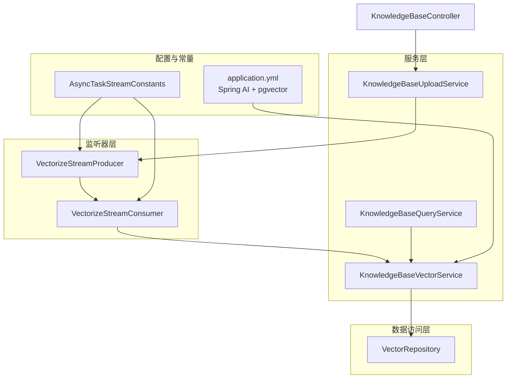
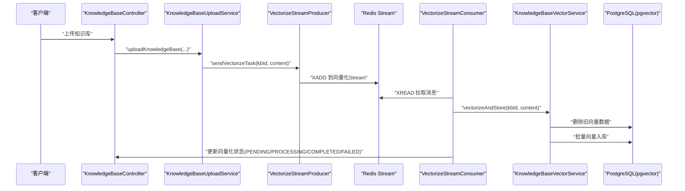
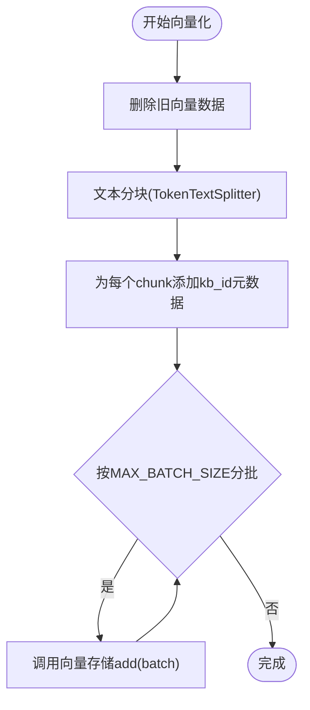
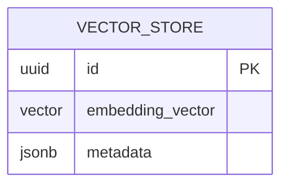
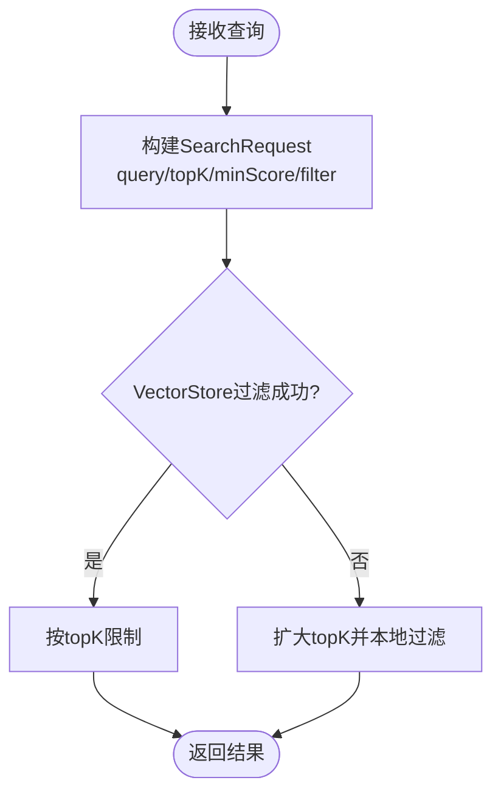
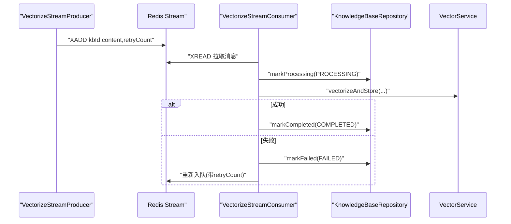
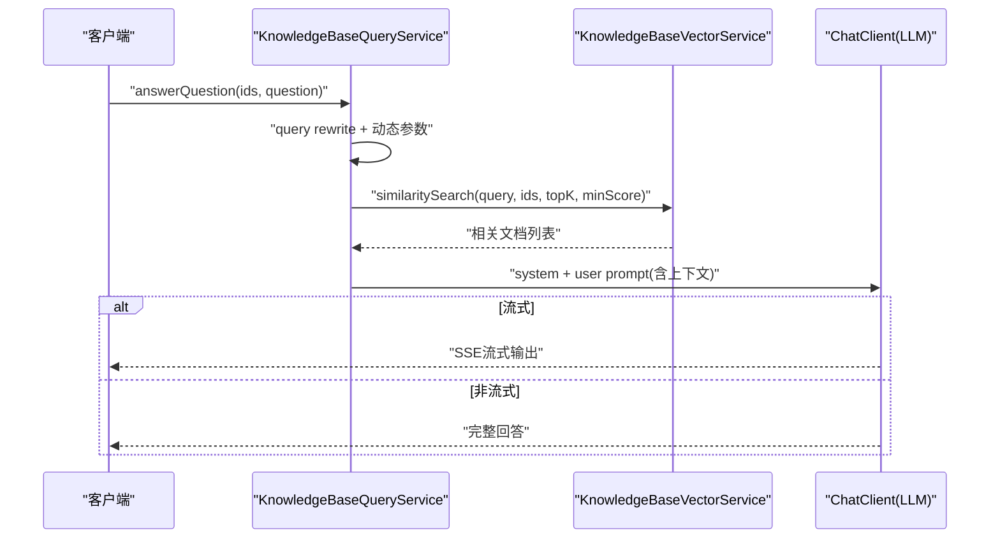
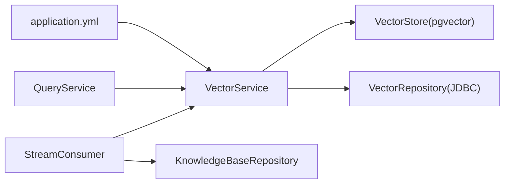

# 知识库向量化服务

<cite>
**本文档引用的文件**
- [KnowledgeBaseVectorService.java](file://app/src/main/java/interview/guide/modules/knowledgebase/service/KnowledgeBaseVectorService.java)
- [VectorizeStreamConsumer.java](file://app/src/main/java/interview/guide/modules/knowledgebase/listener/VectorizeStreamConsumer.java)
- [VectorizeStreamProducer.java](file://app/src/main/java/interview/guide/modules/knowledgebase/listener/VectorizeStreamProducer.java)
- [VectorRepository.java](file://app/src/main/java/interview/guide/modules/knowledgebase/repository/VectorRepository.java)
- [VectorStatus.java](file://app/src/main/java/interview/guide/modules/knowledgebase/model/VectorStatus.java)
- [AsyncTaskStreamConstants.java](file://app/src/main/java/interview/guide/common/constant/AsyncTaskStreamConstants.java)
- [KnowledgeBaseQueryService.java](file://app/src/main/java/interview/guide/modules/knowledgebase/service/KnowledgeBaseQueryService.java)
- [KnowledgeBaseQueryProperties.java](file://app/src/main/java/interview/guide/modules/knowledgebase/service/KnowledgeBaseQueryProperties.java)
- [application.yml](file://app/src/main/resources/application.yml)
- [KnowledgeBaseVectorServiceTest.java](file://app/src/test/java/interview/guide/modules/knowledgebase/service/KnowledgeBaseVectorServiceTest.java)
- [KnowledgeBaseController.java](file://app/src/main/java/interview/guide/modules/knowledgebase/KnowledgeBaseController.java)
- [KnowledgeBaseUploadService.java](file://app/src/main/java/interview/guide/modules/knowledgebase/service/KnowledgeBaseUploadService.java)
</cite>

## 目录
1. [简介](#简介)
2. [项目结构](#项目结构)
3. [核心组件](#核心组件)
4. [架构总览](#架构总览)
5. [详细组件分析](#详细组件分析)
6. [依赖分析](#依赖分析)
7. [性能考虑](#性能考虑)
8. [故障排查指南](#故障排查指南)
9. [结论](#结论)
10. [附录](#附录)

## 简介
本文件面向知识库向量化服务，系统性阐述向量化处理机制与异步架构，包括嵌入模型选择、文本分块策略、向量生成与存储、相似度检索、批量处理、Redis Stream任务队列、错误重试与进度跟踪、以及向量搜索的实现原理与性能调优建议。目标读者既包括技术开发人员，也包括对系统运作机制感兴趣的非技术用户。

## 项目结构
围绕知识库向量化，后端主要涉及以下模块：
- 服务层：向量化服务、查询服务、上传服务、持久化服务
- 监听器层：向量化任务的生产者与消费者（基于Redis Stream）
- 数据访问层：向量存储仓库（基于JDBC直接SQL删除）
- 配置层：Spring AI与pgvector配置、异步任务常量

**图表来源**
- [KnowledgeBaseVectorService.java:25-81](file://app/src/main/java/interview/guide/modules/knowledgebase/service/KnowledgeBaseVectorService.java#L25-L81)
- [VectorizeStreamConsumer.java:21-139](file://app/src/main/java/interview/guide/modules/knowledgebase/listener/VectorizeStreamConsumer.java#L21-L139)
- [VectorizeStreamProducer.java:19-81](file://app/src/main/java/interview/guide/modules/knowledgebase/listener/VectorizeStreamProducer.java#L19-L81)
- [VectorRepository.java:18-65](file://app/src/main/java/interview/guide/modules/knowledgebase/repository/VectorRepository.java#L18-L65)
- [application.yml:98-123](file://app/src/main/resources/application.yml#L98-L123)
- [AsyncTaskStreamConstants.java:7-135](file://app/src/main/java/interview/guide/common/constant/AsyncTaskStreamConstants.java#L7-L135)
- [KnowledgeBaseQueryService.java:34-91](file://app/src/main/java/interview/guide/modules/knowledgebase/service/KnowledgeBaseQueryService.java#L34-L91)
- [KnowledgeBaseUploadService.java:30-102](file://app/src/main/java/interview/guide/modules/knowledgebase/service/KnowledgeBaseUploadService.java#L30-L102)

**章节来源**
- [KnowledgeBaseVectorService.java:25-81](file://app/src/main/java/interview/guide/modules/knowledgebase/service/KnowledgeBaseVectorService.java#L25-L81)
- [VectorizeStreamConsumer.java:21-139](file://app/src/main/java/interview/guide/modules/knowledgebase/listener/VectorizeStreamConsumer.java#L21-L139)
- [VectorizeStreamProducer.java:19-81](file://app/src/main/java/interview/guide/modules/knowledgebase/listener/VectorizeStreamProducer.java#L19-L81)
- [VectorRepository.java:18-65](file://app/src/main/java/interview/guide/modules/knowledgebase/repository/VectorRepository.java#L18-L65)
- [application.yml:98-123](file://app/src/main/resources/application.yml#L98-L123)
- [AsyncTaskStreamConstants.java:7-135](file://app/src/main/java/interview/guide/common/constant/AsyncTaskStreamConstants.java#L7-L135)
- [KnowledgeBaseQueryService.java:34-91](file://app/src/main/java/interview/guide/modules/knowledgebase/service/KnowledgeBaseQueryService.java#L34-L91)
- [KnowledgeBaseUploadService.java:30-102](file://app/src/main/java/interview/guide/modules/knowledgebase/service/KnowledgeBaseUploadService.java#L30-L102)

## 核心组件
- 知识库向量化服务：负责文本分块、向量生成、批量入库、相似度检索、删除旧向量数据
- 向量化任务生产者/消费者：基于Redis Stream的异步任务编排，支持重试与进度跟踪
- 向量存储仓库：基于JDBC的SQL删除，适配pgvector元数据字段
- 查询服务：结合RAG流程，执行查询改写、动态参数检索、上下文构建与LLM回答生成
- 配置：Spring AI与pgvector参数、异步任务常量

**章节来源**
- [KnowledgeBaseVectorService.java:25-81](file://app/src/main/java/interview/guide/modules/knowledgebase/service/KnowledgeBaseVectorService.java#L25-L81)
- [VectorizeStreamConsumer.java:21-139](file://app/src/main/java/interview/guide/modules/knowledgebase/listener/VectorizeStreamConsumer.java#L21-L139)
- [VectorizeStreamProducer.java:19-81](file://app/src/main/java/interview/guide/modules/knowledgebase/listener/VectorizeStreamProducer.java#L19-L81)
- [VectorRepository.java:18-65](file://app/src/main/java/interview/guide/modules/knowledgebase/repository/VectorRepository.java#L18-L65)
- [KnowledgeBaseQueryService.java:34-91](file://app/src/main/java/interview/guide/modules/knowledgebase/service/KnowledgeBaseQueryService.java#L34-L91)
- [application.yml:98-123](file://app/src/main/resources/application.yml#L98-L123)

## 架构总览
系统采用“上传即入队”的异步向量化架构：上传完成后，任务被推送到Redis Stream，消费者拉取并执行向量化，期间维护向量化状态（PENDING/PROCESSING/COMPLETED/FAILED）。查询阶段由查询服务驱动向量检索与LLM生成，支持流式输出与命中确认。

**图表来源**
- [KnowledgeBaseController.java:25-210](file://app/src/main/java/interview/guide/modules/knowledgebase/KnowledgeBaseController.java#L25-L210)
- [KnowledgeBaseUploadService.java:30-102](file://app/src/main/java/interview/guide/modules/knowledgebase/service/KnowledgeBaseUploadService.java#L30-L102)
- [VectorizeStreamProducer.java:19-81](file://app/src/main/java/interview/guide/modules/knowledgebase/listener/VectorizeStreamProducer.java#L19-L81)
- [VectorizeStreamConsumer.java:21-139](file://app/src/main/java/interview/guide/modules/knowledgebase/listener/VectorizeStreamConsumer.java#L21-L139)
- [KnowledgeBaseVectorService.java:45-81](file://app/src/main/java/interview/guide/modules/knowledgebase/service/KnowledgeBaseVectorService.java#L45-L81)

## 详细组件分析

### 向量化服务：文本分块、嵌入与批量入库
- 文本分块：使用TokenTextSplitter，默认约800 tokens/块，基于标点边界切分，无重叠
- 向量生成：通过Spring AI的Embedding模型（text-embedding-v3）生成向量
- 批量入库：受限于阿里云DashScope Embedding API批量上限（<=10），按批次调用VectorStore.add
- 元数据管理：为每个chunk添加kb_id（字符串类型），便于后续过滤与删除
- 事务性：向量化入口使用@Transactional，确保删除与入库的一致性

**图表来源**
- [KnowledgeBaseVectorService.java:45-81](file://app/src/main/java/interview/guide/modules/knowledgebase/service/KnowledgeBaseVectorService.java#L45-L81)

**章节来源**
- [KnowledgeBaseVectorService.java:25-81](file://app/src/main/java/interview/guide/modules/knowledgebase/service/KnowledgeBaseVectorService.java#L25-L81)
- [application.yml:98-123](file://app/src/main/resources/application.yml#L98-L123)

### 向量存储与删除：pgvector集成与SQL优化
- 存储引擎：Spring AI PgVectorStore，默认表名vector_store，元数据字段为JSON/JSONB
- 删除策略：基于JDBC直接SQL删除，使用metadata->>'kb_id'匹配，兼容String与Long两种kb_id格式
- 索引与距离：HNSW索引，COSINE_DISTANCE，维度1024（与text-embedding-v3一致）

**图表来源**
- [application.yml:115-123](file://app/src/main/resources/application.yml#L115-L123)
- [VectorRepository.java:18-65](file://app/src/main/java/interview/guide/modules/knowledgebase/repository/VectorRepository.java#L18-L65)

**章节来源**
- [VectorRepository.java:18-65](file://app/src/main/java/interview/guide/modules/knowledgebase/repository/VectorRepository.java#L18-L65)
- [application.yml:115-123](file://app/src/main/resources/application.yml#L115-L123)

### 相似度检索：过滤、阈值与回退策略
- 过滤表达式：基于kb_id in [...]，支持String与Long两种格式
- 阈值设置：支持similarityThreshold(minScore)，默认按查询长度动态调整
- 回退策略：当VectorStore过滤失败时，先扩大topK再在本地过滤，避免兜底路径引入过多弱相关
- 结果限制：最终按topK截断，确保返回数量可控

**图表来源**
- [KnowledgeBaseVectorService.java:91-159](file://app/src/main/java/interview/guide/modules/knowledgebase/service/KnowledgeBaseVectorService.java#L91-L159)

**章节来源**
- [KnowledgeBaseVectorService.java:91-159](file://app/src/main/java/interview/guide/modules/knowledgebase/service/KnowledgeBaseVectorService.java#L91-L159)

### 异步向量化：Redis Stream任务队列与重试
- 任务键与分组：KB_VECTORIZE_STREAM_KEY、KB_VECTORIZE_GROUP_NAME、消费者前缀
- 拉取与批大小：BATCH_SIZE=10，轮询间隔POLL_INTERVAL_MS=1000ms
- 重试机制：最大重试次数MAX_RETRY_COUNT=3，失败时重新入队并更新状态
- 进度跟踪：状态枚举VectorStatus（PENDING/PROCESSING/COMPLETED/FAILED）

**图表来源**
- [VectorizeStreamProducer.java:19-81](file://app/src/main/java/interview/guide/modules/knowledgebase/listener/VectorizeStreamProducer.java#L19-L81)
- [VectorizeStreamConsumer.java:21-139](file://app/src/main/java/interview/guide/modules/knowledgebase/listener/VectorizeStreamConsumer.java#L21-L139)
- [AsyncTaskStreamConstants.java:7-135](file://app/src/main/java/interview/guide/common/constant/AsyncTaskStreamConstants.java#L7-L135)
- [VectorStatus.java:6-11](file://app/src/main/java/interview/guide/modules/knowledgebase/model/VectorStatus.java#L6-L11)

**章节来源**
- [VectorizeStreamProducer.java:19-81](file://app/src/main/java/interview/guide/modules/knowledgebase/listener/VectorizeStreamProducer.java#L19-L81)
- [VectorizeStreamConsumer.java:21-139](file://app/src/main/java/interview/guide/modules/knowledgebase/listener/VectorizeStreamConsumer.java#L21-L139)
- [AsyncTaskStreamConstants.java:7-135](file://app/src/main/java/interview/guide/common/constant/AsyncTaskStreamConstants.java#L7-L135)
- [VectorStatus.java:6-11](file://app/src/main/java/interview/guide/modules/knowledgebase/model/VectorStatus.java#L6-L11)

### 查询服务：RAG问答与流式输出
- 查询改写：可选启用，提升检索质量
- 动态参数：根据查询长度选择topK与minScore
- 上下文构建：将检索到的文档文本拼接作为上下文
- 流式输出：前端SSE流式接收，探测窗口归一化，避免长篇拒答

**图表来源**
- [KnowledgeBaseQueryService.java:100-245](file://app/src/main/java/interview/guide/modules/knowledgebase/service/KnowledgeBaseQueryService.java#L100-L245)
- [KnowledgeBaseVectorService.java:91-159](file://app/src/main/java/interview/guide/modules/knowledgebase/service/KnowledgeBaseVectorService.java#L91-L159)

**章节来源**
- [KnowledgeBaseQueryService.java:34-461](file://app/src/main/java/interview/guide/modules/knowledgebase/service/KnowledgeBaseQueryService.java#L34-L461)
- [KnowledgeBaseQueryProperties.java:10-33](file://app/src/main/java/interview/guide/modules/knowledgebase/service/KnowledgeBaseQueryProperties.java#L10-L33)

## 依赖分析
- 组件耦合
  - KnowledgeBaseVectorService依赖VectorStore（Spring AI PgVectorStore）与VectorRepository（JDBC）
  - VectorizeStreamConsumer依赖KnowledgeBaseVectorService与KnowledgeBaseRepository
  - KnowledgeBaseQueryService依赖KnowledgeBaseVectorService与多个服务（列表、统计）
- 外部依赖
  - Spring AI（OpenAI兼容模式）+ DashScope Embedding
  - PostgreSQL + pgvector（HNSW/COSINE_DISTANCE）
  - Redis（Redisson）+ Stream

**图表来源**
- [KnowledgeBaseVectorService.java:31-38](file://app/src/main/java/interview/guide/modules/knowledgebase/service/KnowledgeBaseVectorService.java#L31-L38)
- [VectorizeStreamConsumer.java:23-33](file://app/src/main/java/interview/guide/modules/knowledgebase/listener/VectorizeStreamConsumer.java#L23-L33)
- [KnowledgeBaseQueryService.java:46-71](file://app/src/main/java/interview/guide/modules/knowledgebase/service/KnowledgeBaseQueryService.java#L46-L71)
- [application.yml:98-123](file://app/src/main/resources/application.yml#L98-L123)

**章节来源**
- [KnowledgeBaseVectorService.java:31-38](file://app/src/main/java/interview/guide/modules/knowledgebase/service/KnowledgeBaseVectorService.java#L31-L38)
- [VectorizeStreamConsumer.java:23-33](file://app/src/main/java/interview/guide/modules/knowledgebase/listener/VectorizeStreamConsumer.java#L23-L33)
- [KnowledgeBaseQueryService.java:46-71](file://app/src/main/java/interview/guide/modules/knowledgebase/service/KnowledgeBaseQueryService.java#L46-L71)
- [application.yml:98-123](file://app/src/main/resources/application.yml#L98-L123)

## 性能考虑
- 批处理与并发
  - 向量化：MAX_BATCH_SIZE=10，避免超过DashScope Embedding API限制
  - Stream：BATCH_SIZE=10，POLL_INTERVAL_MS=1000ms，平衡吞吐与延迟
- 内存与I/O
  - 文本分块：TokenTextSplitter减少单块过大导致的内存压力
  - JDBC批处理：Hibernate batch_size=50，优化INSERT/UPDATE顺序
- 存储优化
  - pgvector：HNSW索引+COSINE_DISTANCE，维度1024；initialize-schema仅开发环境使用
  - 删除策略：直接SQL删除，避免复杂查询开销
- 搜索优化
  - 动态topK与minScore：短查询topK更大、阈值更高，兼顾召回与精度
  - 回退过滤：先扩大topK再本地过滤，降低失败率

**章节来源**
- [KnowledgeBaseVectorService.java:27-30](file://app/src/main/java/interview/guide/modules/knowledgebase/service/KnowledgeBaseVectorService.java#L27-L30)
- [AsyncTaskStreamConstants.java:28-40](file://app/src/main/java/interview/guide/common/constant/AsyncTaskStreamConstants.java#L28-L40)
- [application.yml:63-78](file://app/src/main/resources/application.yml#L63-L78)
- [application.yml:115-123](file://app/src/main/resources/application.yml#L115-L123)
- [KnowledgeBaseQueryProperties.java:24-31](file://app/src/main/java/interview/guide/modules/knowledgebase/service/KnowledgeBaseQueryProperties.java#L24-L31)

## 故障排查指南
- 向量化失败
  - 现象：抛出业务异常，日志包含“向量化知识库失败”
  - 排查：检查DashScope API连通性、batch大小、content合法性
- 相似度搜索失败
  - 现象：VectorStore过滤失败，触发回退策略
  - 排查：确认kb_id元数据格式（String/Long）、filter表达式、minScore设置
- Redis Stream重试
  - 现象：任务多次重试后仍失败
  - 排查：查看重试次数、消息体格式、消费者ACK情况
- 删除向量数据异常
  - 现象：删除失败抛出业务异常
  - 排查：确认kb_id格式、数据库权限、SQL语法

**章节来源**
- [KnowledgeBaseVectorService.java:76-80](file://app/src/main/java/interview/guide/modules/knowledgebase/service/KnowledgeBaseVectorService.java#L76-L80)
- [VectorizeStreamConsumer.java:117-121](file://app/src/main/java/interview/guide/modules/knowledgebase/listener/VectorizeStreamConsumer.java#L117-L121)
- [VectorRepository.java:59-63](file://app/src/main/java/interview/guide/modules/knowledgebase/repository/VectorRepository.java#L59-L63)

## 结论
本系统通过“上传即入队”的异步向量化架构，结合Spring AI与pgvector，实现了高吞吐、可扩展的知识库向量化与检索能力。通过动态参数、回退策略与流式输出，兼顾了召回质量与用户体验。建议在生产环境中谨慎管理schema初始化，并持续监控向量化状态与检索命中质量，以保障整体性能与稳定性。

## 附录
- 重新向量化接口：支持手动重试失败的任务
- 测试覆盖：单元测试覆盖向量化存储、相似度搜索、删除向量数据等关键场景

**章节来源**
- [KnowledgeBaseController.java:196-210](file://app/src/main/java/interview/guide/modules/knowledgebase/KnowledgeBaseController.java#L196-L210)
- [KnowledgeBaseVectorServiceTest.java:26-593](file://app/src/test/java/interview/guide/modules/knowledgebase/service/KnowledgeBaseVectorServiceTest.java#L26-L593)