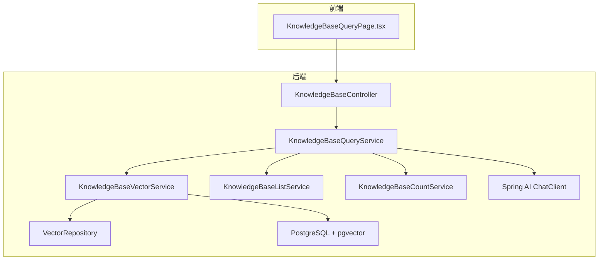
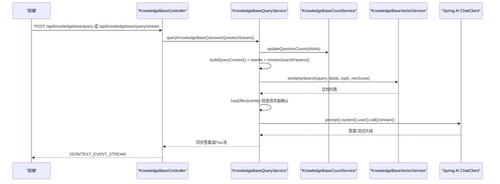
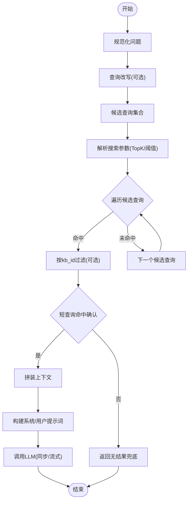
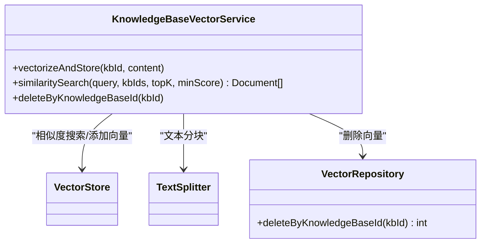
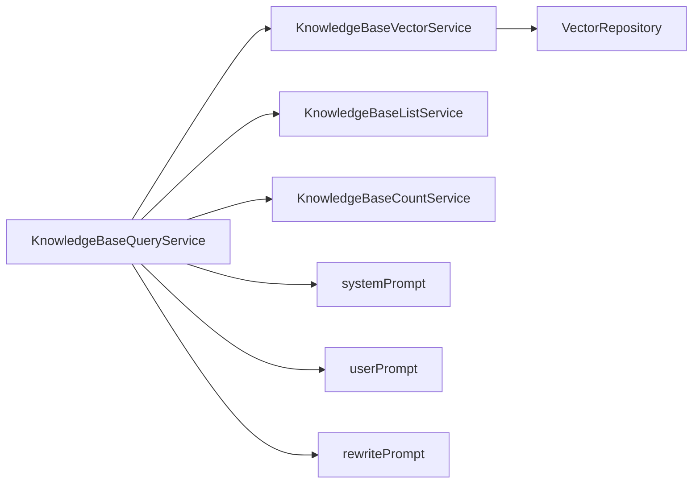

# 知识库查询服务

<cite>
**本文引用的文件**
- [KnowledgeBaseQueryService.java](file://app/src/main/java/interview/guide/modules/knowledgebase/service/KnowledgeBaseQueryService.java)
- [KnowledgeBaseQueryProperties.java](file://app/src/main/java/interview/guide/modules/knowledgebase/service/KnowledgeBaseQueryProperties.java)
- [KnowledgeBaseVectorService.java](file://app/src/main/java/interview/guide/modules/knowledgebase/service/KnowledgeBaseVectorService.java)
- [KnowledgeBaseListService.java](file://app/src/main/java/interview/guide/modules/knowledgebase/service/KnowledgeBaseListService.java)
- [KnowledgeBaseCountService.java](file://app/src/main/java/interview/guide/modules/knowledgebase/service/KnowledgeBaseCountService.java)
- [VectorRepository.java](file://app/src/main/java/interview/guide/modules/knowledgebase/repository/VectorRepository.java)
- [KnowledgeBaseController.java](file://app/src/main/java/interview/guide/modules/knowledgebase/KnowledgeBaseController.java)
- [QueryRequest.java](file://app/src/main/java/interview/guide/modules/knowledgebase/model/QueryRequest.java)
- [QueryResponse.java](file://app/src/main/java/interview/guide/modules/knowledgebase/model/QueryResponse.java)
- [application.yml](file://app/src/main/resources/application.yml)
- [knowledgebase-query-rewrite.st](file://app/src/main/resources/prompts/knowledgebase-query-rewrite.st)
- [knowledgebase-query-user.st](file://app/src/main/resources/prompts/knowledgebase-query-user.st)
- [KnowledgeBaseVectorServiceTest.java](file://app/src/test/java/interview/guide/modules/knowledgebase/service/KnowledgeBaseVectorServiceTest.java)
- [KnowledgeBaseQueryPage.tsx](file://frontend/src/pages/KnowledgeBaseQueryPage.tsx)
</cite>

## 目录
1. [简介](#简介)
2. [项目结构](#项目结构)
3. [核心组件](#核心组件)
4. [架构总览](#架构总览)
5. [详细组件分析](#详细组件分析)
6. [依赖分析](#依赖分析)
7. [性能考虑](#性能考虑)
8. [故障排除指南](#故障排除指南)
9. [结论](#结论)
10. [附录](#附录)

## 简介
本文件面向知识库查询服务的使用者与维护者，系统性阐述基于向量检索的RAG问答能力与实现细节。服务支持：
- 语义搜索与关键词匹配的协同检索
- 查询预处理、向量嵌入、相似度计算、结果过滤与上下文召回
- 答案生成与流式输出、命中确认与无结果兜底
- 查询优化：查询改写、动态TopK与阈值、短查询字面确认
- 响应结构化输出：答案、知识库来源信息
- 性能优化：索引与过滤、并发控制、流式探测窗口
- 统计与分析：热门查询、搜索效果评估、用户行为分析（通过外部指标与日志）

## 项目结构
知识库查询服务位于后端模块的“knowledgebase”包内，采用分层设计：
- 控制器层：对外暴露REST接口，负责限流与请求转发
- 服务层：核心业务逻辑，包括查询服务、向量服务、列表与计数服务
- 数据访问层：JPA仓库与自定义SQL删除向量数据
- 配置与提示词：Spring AI配置、RAG提示词模板
- 前端页面：问答助手页面，演示流式SSE与知识库选择

图表来源
- [KnowledgeBaseController.java:33-211](file://app/src/main/java/interview/guide/modules/knowledgebase/KnowledgeBaseController.java#L33-L211)
- [KnowledgeBaseQueryService.java:33-461](file://app/src/main/java/interview/guide/modules/knowledgebase/service/KnowledgeBaseQueryService.java#L33-L461)
- [KnowledgeBaseVectorService.java:23-203](file://app/src/main/java/interview/guide/modules/knowledgebase/service/KnowledgeBaseVectorService.java#L23-L203)
- [VectorRepository.java:15-66](file://app/src/main/java/interview/guide/modules/knowledgebase/repository/VectorRepository.java#L15-L66)
- [application.yml:98-123](file://app/src/main/resources/application.yml#L98-L123)

章节来源
- [KnowledgeBaseController.java:33-211](file://app/src/main/java/interview/guide/modules/knowledgebase/KnowledgeBaseController.java#L33-L211)
- [application.yml:98-123](file://app/src/main/resources/application.yml#L98-L123)

## 核心组件
- KnowledgeBaseQueryService：RAG主流程引擎，负责查询预处理、候选查询构建、向量检索、命中确认、上下文拼装、提示词构建与LLM调用、流式输出归一化
- KnowledgeBaseVectorService：向量存储与相似度检索，支持按知识库ID过滤、回退过滤、批量化嵌入
- KnowledgeBaseListService：知识库列表、搜索、分类、统计
- KnowledgeBaseCountService：批量更新知识库提问计数
- VectorRepository：基于JDBC的向量数据删除
- KnowledgeBaseController：对外接口、限流、SSE流式输出
- 配置与提示词：RAG开关、搜索阈值、TopK、提示词模板

章节来源
- [KnowledgeBaseQueryService.java:33-461](file://app/src/main/java/interview/guide/modules/knowledgebase/service/KnowledgeBaseQueryService.java#L33-L461)
- [KnowledgeBaseVectorService.java:23-203](file://app/src/main/java/interview/guide/modules/knowledgebase/service/KnowledgeBaseVectorService.java#L23-L203)
- [KnowledgeBaseListService.java:26-219](file://app/src/main/java/interview/guide/modules/knowledgebase/service/KnowledgeBaseListService.java#L26-L219)
- [KnowledgeBaseCountService.java:21-56](file://app/src/main/java/interview/guide/modules/knowledgebase/service/KnowledgeBaseCountService.java#L21-L56)
- [VectorRepository.java:15-66](file://app/src/main/java/interview/guide/modules/knowledgebase/repository/VectorRepository.java#L15-L66)
- [KnowledgeBaseController.java:33-211](file://app/src/main/java/interview/guide/modules/knowledgebase/KnowledgeBaseController.java#L33-L211)
- [KnowledgeBaseQueryProperties.java:7-33](file://app/src/main/java/interview/guide/modules/knowledgebase/service/KnowledgeBaseQueryProperties.java#L7-L33)

## 架构总览
RAG查询链路分为“检索-生成-输出”三层：
- 检索层：查询改写与候选集构建、向量相似度搜索、按知识库ID过滤、命中确认
- 生成层：系统提示词与用户提示词拼装、LLM调用、答案归一化
- 输出层：同步与流式两种输出，流式带探测窗口快速拒答

图表来源
- [KnowledgeBaseController.java:85-103](file://app/src/main/java/interview/guide/modules/knowledgebase/KnowledgeBaseController.java#L85-L103)
- [KnowledgeBaseQueryService.java:100-245](file://app/src/main/java/interview/guide/modules/knowledgebase/service/KnowledgeBaseQueryService.java#L100-L245)
- [KnowledgeBaseVectorService.java:91-125](file://app/src/main/java/interview/guide/modules/knowledgebase/service/KnowledgeBaseVectorService.java#L91-L125)

## 详细组件分析

### KnowledgeBaseQueryService：智能检索与RAG问答
- 查询预处理与候选集
  - 规范化问题、构建候选查询集合（原问题与改写后的查询）
  - 动态参数：根据问题长度选择TopK与最小相似度阈值
- 向量检索与过滤
  - 逐候选查询执行相似度搜索，命中即返回；否则继续下一个候选
  - 支持按知识库ID过滤表达式
- 命中确认与短查询保护
  - 对短token查询进行核心词提取与字面匹配，避免弱相关片段进入模型
- 上下文拼装与提示词
  - 将命中文档按固定分隔符拼接为上下文
  - 系统提示词与用户提示词模板渲染
- 答案生成与输出
  - 同步：一次性返回答案
  - 流式：SSE流式输出，探测窗口快速拒答，避免长篇无意义输出
- 错误处理
  - LLM调用异常封装为业务异常；流式失败兜底提示

图表来源
- [KnowledgeBaseQueryService.java:247-344](file://app/src/main/java/interview/guide/modules/knowledgebase/service/KnowledgeBaseQueryService.java#L247-L344)
- [KnowledgeBaseQueryService.java:395-453](file://app/src/main/java/interview/guide/modules/knowledgebase/service/KnowledgeBaseQueryService.java#L395-L453)

章节来源
- [KnowledgeBaseQueryService.java:93-155](file://app/src/main/java/interview/guide/modules/knowledgebase/service/KnowledgeBaseQueryService.java#L93-L155)
- [KnowledgeBaseQueryService.java:174-188](file://app/src/main/java/interview/guide/modules/knowledgebase/service/KnowledgeBaseQueryService.java#L174-L188)
- [KnowledgeBaseQueryService.java:190-245](file://app/src/main/java/interview/guide/modules/knowledgebase/service/KnowledgeBaseQueryService.java#L190-L245)
- [KnowledgeBaseQueryService.java:247-344](file://app/src/main/java/interview/guide/modules/knowledgebase/service/KnowledgeBaseQueryService.java#L247-L344)
- [KnowledgeBaseQueryService.java:395-453](file://app/src/main/java/interview/guide/modules/knowledgebase/service/KnowledgeBaseQueryService.java#L395-L453)

### KnowledgeBaseVectorService：向量检索与存储
- 文本分块与元数据
  - 使用TokenTextSplitter按800tokens左右切分，统一添加kb_id元数据
  - 分批向量化（阿里云DashScope批量限制≤10）
- 相似度搜索
  - 支持相似度阈值与TopK限制
  - 支持知识库ID过滤表达式
  - 前置过滤失败时回退到本地过滤，保证兜底质量
- 删除向量数据
  - 基于JDBC删除对应kb_id的向量记录

图表来源
- [KnowledgeBaseVectorService.java:23-203](file://app/src/main/java/interview/guide/modules/knowledgebase/service/KnowledgeBaseVectorService.java#L23-L203)
- [VectorRepository.java:15-66](file://app/src/main/java/interview/guide/modules/knowledgebase/repository/VectorRepository.java#L15-L66)

章节来源
- [KnowledgeBaseVectorService.java:45-81](file://app/src/main/java/interview/guide/modules/knowledgebase/service/KnowledgeBaseVectorService.java#L45-L81)
- [KnowledgeBaseVectorService.java:91-159](file://app/src/main/java/interview/guide/modules/knowledgebase/service/KnowledgeBaseVectorService.java#L91-L159)
- [KnowledgeBaseVectorService.java:191-201](file://app/src/main/java/interview/guide/modules/knowledgebase/service/KnowledgeBaseVectorService.java#L191-L201)
- [VectorRepository.java:31-64](file://app/src/main/java/interview/guide/modules/knowledgebase/repository/VectorRepository.java#L31-L64)

### KnowledgeBaseListService：知识库列表与统计
- 列表与筛选：支持按向量化状态、分类、关键词搜索、多字段排序
- 名称与统计：批量获取知识库名称、统计总提问次数、访问次数、各状态数量
- 文件下载：基于存储服务下载知识库文件

章节来源
- [KnowledgeBaseListService.java:91-100](file://app/src/main/java/interview/guide/modules/knowledgebase/service/KnowledgeBaseListService.java#L91-L100)
- [KnowledgeBaseListService.java:183-191](file://app/src/main/java/interview/guide/modules/knowledgebase/service/KnowledgeBaseListService.java#L183-L191)

### KnowledgeBaseCountService：批量提问计数
- 去重后批量更新知识库的questionCount字段，单条SQL完成

章节来源
- [KnowledgeBaseCountService.java:32-54](file://app/src/main/java/interview/guide/modules/knowledgebase/service/KnowledgeBaseCountService.java#L32-L54)

### KnowledgeBaseController：接口与限流
- 查询接口：同步与流式SSE，支持多知识库
- 限流：全局与IP维度，避免滥用
- 其他：列表、搜索、统计、上传下载、分类管理

章节来源
- [KnowledgeBaseController.java:83-103](file://app/src/main/java/interview/guide/modules/knowledgebase/KnowledgeBaseController.java#L83-L103)
- [KnowledgeBaseController.java:140-174](file://app/src/main/java/interview/guide/modules/knowledgebase/KnowledgeBaseController.java#L140-L174)
- [KnowledgeBaseController.java:186-194](file://app/src/main/java/interview/guide/modules/knowledgebase/KnowledgeBaseController.java#L186-L194)

### 配置与提示词
- application.yml：Spring AI OpenAI兼容模式、Embedding模型、pgvector索引与距离类型、RAG参数（开关、TopK、阈值）
- 提示词模板：查询改写、系统提示词、用户提示词

章节来源
- [application.yml:98-123](file://app/src/main/resources/application.yml#L98-L123)
- [application.yml:155-168](file://app/src/main/resources/application.yml#L155-L168)
- [knowledgebase-query-rewrite.st:1-11](file://app/src/main/resources/prompts/knowledgebase-query-rewrite.st#L1-L11)
- [knowledgebase-query-user.st:1-23](file://app/src/main/resources/prompts/knowledgebase-query-user.st#L1-L23)

## 依赖分析
- 组件耦合
  - KnowledgeBaseQueryService依赖向量服务、列表服务、计数服务与提示词模板
  - 向量服务依赖VectorStore与JDBC删除
  - 控制器依赖查询服务与限流注解
- 外部依赖
  - Spring AI ChatClient（DashScope兼容模式）
  - PostgreSQL + pgvector
  - Redisson（应用配置中存在，可用于后续缓存扩展）

图表来源
- [KnowledgeBaseQueryService.java:61-91](file://app/src/main/java/interview/guide/modules/knowledgebase/service/KnowledgeBaseQueryService.java#L61-L91)
- [KnowledgeBaseVectorService.java:32-38](file://app/src/main/java/interview/guide/modules/knowledgebase/service/KnowledgeBaseVectorService.java#L32-L38)
- [VectorRepository.java:20-21](file://app/src/main/java/interview/guide/modules/knowledgebase/repository/VectorRepository.java#L20-L21)

## 性能考虑
- 索引与过滤
  - pgvector使用HNSW索引与余弦距离，初始化schema便于开发环境快速启动
  - 搜索请求支持相似度阈值与TopK限制，减少无关结果
- 并发与流式
  - 启用虚拟线程，提升I/O密集型并发能力
  - 流式输出采用探测窗口，快速识别无结果模板并提前终止
- 批量与去重
  - 批量更新知识库提问计数，避免多次往返
  - 候选查询集合去重，避免重复检索
- 可观测性
  - 建议接入Micrometer记录搜索耗时、查询次数，结合前端展示相关性评分

章节来源
- [application.yml:42-47](file://app/src/main/resources/application.yml#L42-L47)
- [application.yml:115-123](file://app/src/main/resources/application.yml#L115-L123)
- [KnowledgeBaseQueryService.java:395-453](file://app/src/main/java/interview/guide/modules/knowledgebase/service/KnowledgeBaseQueryService.java#L395-L453)
- [KnowledgeBaseCountService.java:32-54](file://app/src/main/java/interview/guide/modules/knowledgebase/service/KnowledgeBaseCountService.java#L32-L54)

## 故障排除指南
- 常见问题定位
  - 向量搜索失败：查看向量服务回退路径日志，确认过滤表达式与阈值设置
  - 无结果返回：检查短查询命中确认逻辑与改写开关
  - 流式输出异常：关注探测窗口归一化逻辑与错误恢复分支
- 日志与告警
  - 关注查询服务与向量服务的关键日志级别，定位异常栈
- 前端联调
  - 确认SSE连接、流式片段拼接与Markdown渲染

章节来源
- [KnowledgeBaseQueryService.java:151-154](file://app/src/main/java/interview/guide/modules/knowledgebase/service/KnowledgeBaseQueryService.java#L151-L154)
- [KnowledgeBaseQueryService.java:241-244](file://app/src/main/java/interview/guide/modules/knowledgebase/service/KnowledgeBaseQueryService.java#L241-L244)
- [KnowledgeBaseVectorService.java:121-124](file://app/src/main/java/interview/guide/modules/knowledgebase/service/KnowledgeBaseVectorService.java#L121-L124)

## 结论
本知识库查询服务以向量检索为核心，结合查询改写、动态参数与命中确认，形成稳定可靠的RAG问答链路。通过流式输出与探测窗口优化用户体验，配合批量计数与过滤表达式提升性能。建议后续在混合检索、重排序与缓存方面进一步增强，并完善相关性评分与热门查询统计的可观测性。

## 附录

### 查询处理流程（代码级）
- 同步查询：answerQuestion → 构建上下文 → 提示词 → LLM → 归一化
- 流式查询：answerQuestionStream → 探测窗口 → 归一化 → 错误恢复

章节来源
- [KnowledgeBaseQueryService.java:100-155](file://app/src/main/java/interview/guide/modules/knowledgebase/service/KnowledgeBaseQueryService.java#L100-L155)
- [KnowledgeBaseQueryService.java:197-245](file://app/src/main/java/interview/guide/modules/knowledgebase/service/KnowledgeBaseQueryService.java#L197-L245)

### 查询优化技术
- 查询改写：启用/禁用开关，模板驱动
- 动态TopK与阈值：按问题长度与紧凑度自适应
- 短查询字面确认：中文核心词提取 + 文本包含匹配
- 候选查询集合：原问题 + 改写问题

章节来源
- [KnowledgeBaseQueryProperties.java:18-31](file://app/src/main/java/interview/guide/modules/knowledgebase/service/KnowledgeBaseQueryProperties.java#L18-L31)
- [KnowledgeBaseQueryService.java:247-317](file://app/src/main/java/interview/guide/modules/knowledgebase/service/KnowledgeBaseQueryService.java#L247-L317)
- [knowledgebase-query-rewrite.st:1-11](file://app/src/main/resources/prompts/knowledgebase-query-rewrite.st#L1-L11)

### 查询响应结构化输出
- 同步响应：QueryResponse（answer、primary knowledgeBaseId、knowledgeBaseName）
- 流式响应：SSE文本流，前端逐片拼接渲染

章节来源
- [QueryResponse.java:6-10](file://app/src/main/java/interview/guide/modules/knowledgebase/model/QueryResponse.java#L6-L10)
- [KnowledgeBaseQueryService.java:177-188](file://app/src/main/java/interview/guide/modules/knowledgebase/service/KnowledgeBaseQueryService.java#L177-L188)
- [KnowledgeBaseQueryPage.tsx:307-337](file://frontend/src/pages/KnowledgeBaseQueryPage.tsx#L307-L337)

### 查询统计与分析
- 知识库统计：总数、总提问次数、总访问次数、各状态数量
- 建议：接入Micrometer记录搜索耗时与查询频次，前端展示相关性评分

章节来源
- [KnowledgeBaseListService.java:183-191](file://app/src/main/java/interview/guide/modules/knowledgebase/service/KnowledgeBaseListService.java#L183-L191)

### 单元测试要点（向量服务）
- 向量化存储：分批处理、metadata设置、删除旧数据顺序
- 相似度搜索：过滤表达式、TopK限制、回退过滤
- 删除向量数据：异常静默处理

章节来源
- [KnowledgeBaseVectorServiceTest.java:155-277](file://app/src/test/java/interview/guide/modules/knowledgebase/service/KnowledgeBaseVectorServiceTest.java#L155-L277)
- [KnowledgeBaseVectorServiceTest.java:279-464](file://app/src/test/java/interview/guide/modules/knowledgebase/service/KnowledgeBaseVectorServiceTest.java#L279-L464)
- [KnowledgeBaseVectorServiceTest.java:466-510](file://app/src/test/java/interview/guide/modules/knowledgebase/service/KnowledgeBaseVectorServiceTest.java#L466-L510)