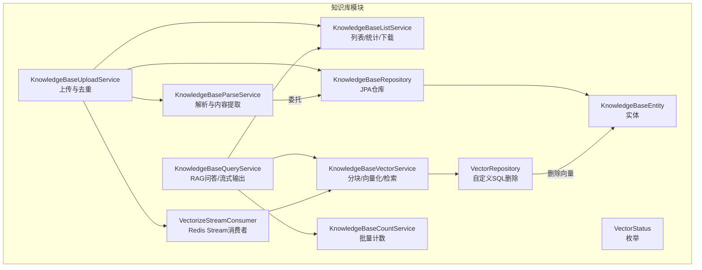
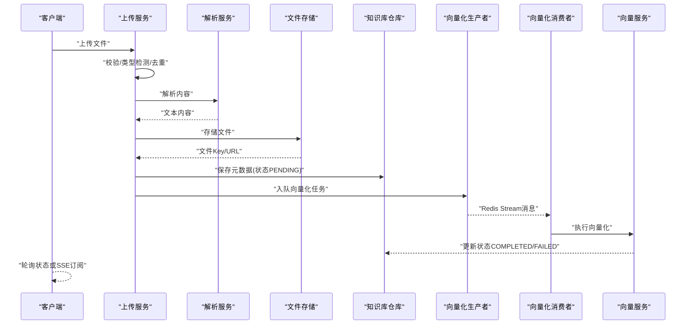
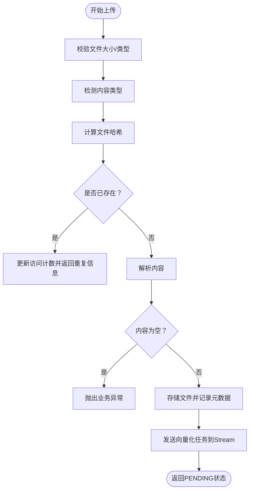
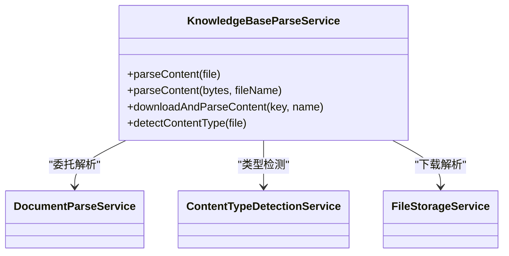
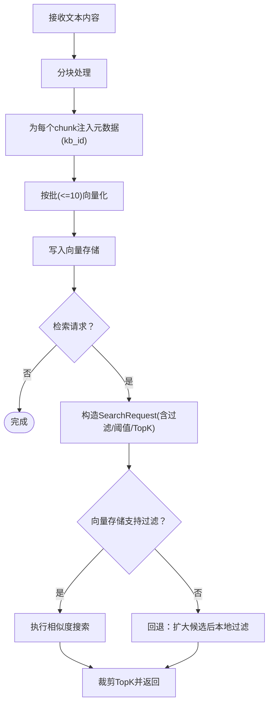
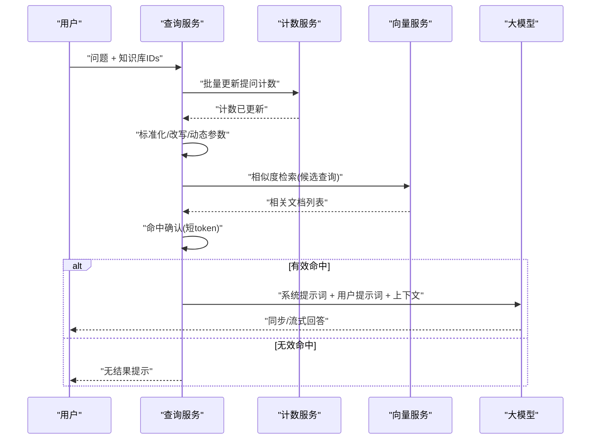
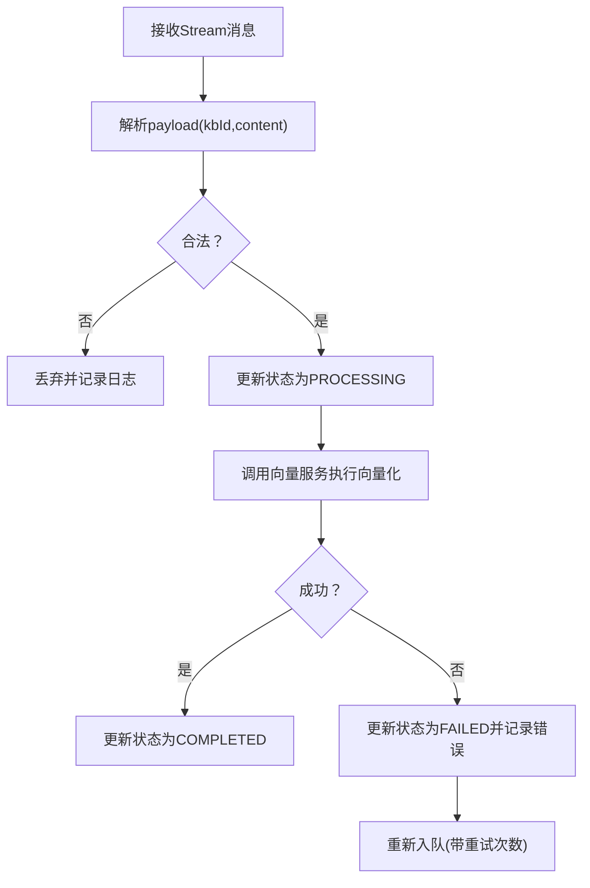
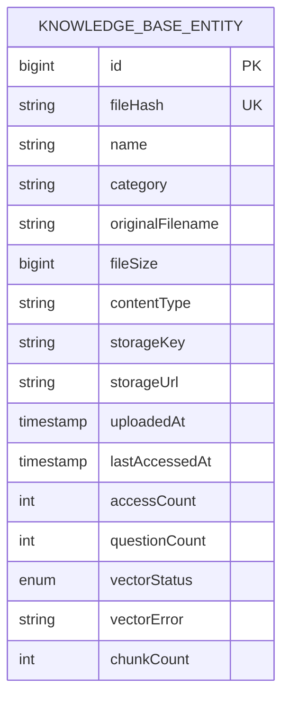
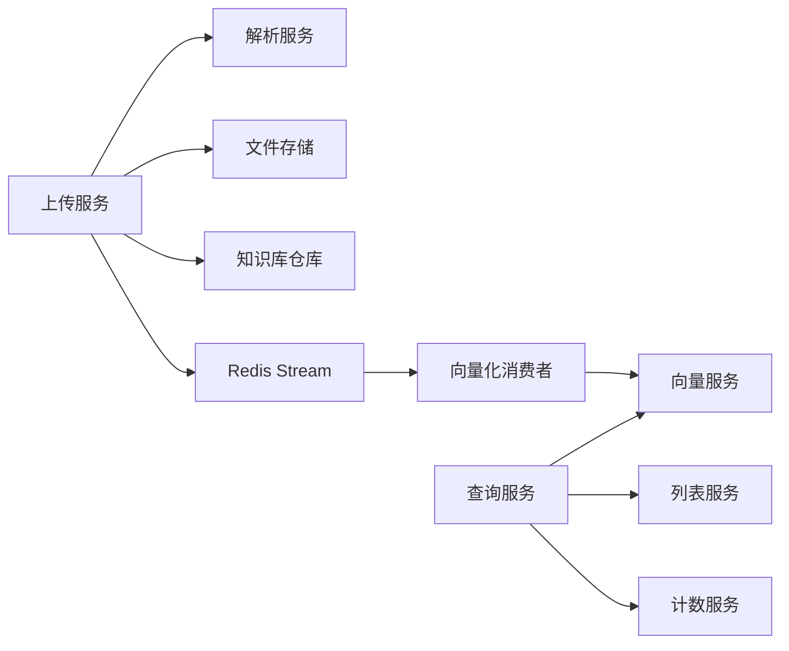

# 知识库管理服务

<cite>
**本文引用的文件**
- [KnowledgeBaseUploadService.java](file://app/src/main/java/interview/guide/modules/knowledgebase/service/KnowledgeBaseUploadService.java)
- [KnowledgeBaseParseService.java](file://app/src/main/java/interview/guide/modules/knowledgebase/service/KnowledgeBaseParseService.java)
- [KnowledgeBaseVectorService.java](file://app/src/main/java/interview/guide/modules/knowledgebase/service/KnowledgeBaseVectorService.java)
- [KnowledgeBaseQueryService.java](file://app/src/main/java/interview/guide/modules/knowledgebase/service/KnowledgeBaseQueryService.java)
- [KnowledgeBasePersistenceService.java](file://app/src/main/java/interview/guide/modules/knowledgebase/service/KnowledgeBasePersistenceService.java)
- [KnowledgeBaseListService.java](file://app/src/main/java/interview/guide/modules/knowledgebase/service/KnowledgeBaseListService.java)
- [KnowledgeBaseCountService.java](file://app/src/main/java/interview/guide/modules/knowledgebase/service/KnowledgeBaseCountService.java)
- [KnowledgeBaseQueryProperties.java](file://app/src/main/java/interview/guide/modules/knowledgebase/service/KnowledgeBaseQueryProperties.java)
- [VectorizeStreamConsumer.java](file://app/src/main/java/interview/guide/modules/knowledgebase/listener/VectorizeStreamConsumer.java)
- [KnowledgeBaseRepository.java](file://app/src/main/java/interview/guide/modules/knowledgebase/repository/KnowledgeBaseRepository.java)
- [VectorRepository.java](file://app/src/main/java/interview/guide/modules/knowledgebase/repository/VectorRepository.java)
- [KnowledgeBaseEntity.java](file://app/src/main/java/interview/guide/modules/knowledgebase/model/KnowledgeBaseEntity.java)
- [VectorStatus.java](file://app/src/main/java/interview/guide/modules/knowledgebase/model/VectorStatus.java)
- [knowledgebase-query-rewrite.st](file://app/src/main/resources/prompts/knowledgebase-query-rewrite.st)
</cite>

## 目录
1. [简介](#简介)
2. [项目结构](#项目结构)
3. [核心组件](#核心组件)
4. [架构总览](#架构总览)
5. [详细组件分析](#详细组件分析)
6. [依赖分析](#依赖分析)
7. [性能考虑](#性能考虑)
8. [故障排查指南](#故障排查指南)
9. [结论](#结论)
10. [附录](#附录)

## 简介
本文件面向知识库管理服务，系统性阐述从“文档上传、解析、向量化、查询”的完整工作流程，并深入解析以下关键服务：
- KnowledgeBaseUploadService：文件处理机制（多格式支持、批量上传、去重、进度跟踪）
- KnowledgeBaseParseService：文档解析技术（文本提取、结构化处理、元数据保留）
- KnowledgeBaseVectorService：向量化处理（嵌入模型选择、向量存储、相似度计算）
- KnowledgeBaseQueryService：智能检索机制（语义搜索、结果排序、上下文增强、流式输出）

同时提供优化与性能调优建议，帮助读者在实际工程中高效落地与维护。

## 项目结构
知识库模块位于后端应用的模块化目录下，采用“按功能域分层”的组织方式：
- service：核心业务服务（上传、解析、向量化、查询、列表、计数、持久化）
- repository：数据访问层（JPA + 自定义 SQL）
- model：领域模型与枚举
- listener：异步任务消费（Redis Stream）
- resources/prompts：RAG提示词模板

图表来源
- [KnowledgeBaseUploadService.java:28-145](file://app/src/main/java/interview/guide/modules/knowledgebase/service/KnowledgeBaseUploadService.java#L28-L145)
- [KnowledgeBaseParseService.java:18-66](file://app/src/main/java/interview/guide/modules/knowledgebase/service/KnowledgeBaseParseService.java#L18-L66)
- [KnowledgeBaseVectorService.java:25-203](file://app/src/main/java/interview/guide/modules/knowledgebase/service/KnowledgeBaseVectorService.java#L25-L203)
- [KnowledgeBaseQueryService.java:35-461](file://app/src/main/java/interview/guide/modules/knowledgebase/service/KnowledgeBaseQueryService.java#L35-L461)
- [KnowledgeBaseListService.java:29-219](file://app/src/main/java/interview/guide/modules/knowledgebase/service/KnowledgeBaseListService.java#L29-L219)
- [KnowledgeBaseCountService.java:22-56](file://app/src/main/java/interview/guide/modules/knowledgebase/service/KnowledgeBaseCountService.java#L22-L56)
- [VectorizeStreamConsumer.java:21-140](file://app/src/main/java/interview/guide/modules/knowledgebase/listener/VectorizeStreamConsumer.java#L21-L140)
- [KnowledgeBaseRepository.java:18-108](file://app/src/main/java/interview/guide/modules/knowledgebase/repository/KnowledgeBaseRepository.java#L18-L108)
- [VectorRepository.java:18-66](file://app/src/main/java/interview/guide/modules/knowledgebase/repository/VectorRepository.java#L18-L66)
- [KnowledgeBaseEntity.java:15-223](file://app/src/main/java/interview/guide/modules/knowledgebase/model/KnowledgeBaseEntity.java#L15-L223)
- [VectorStatus.java:6-12](file://app/src/main/java/interview/guide/modules/knowledgebase/model/VectorStatus.java#L6-L12)

章节来源
- [KnowledgeBaseUploadService.java:28-145](file://app/src/main/java/interview/guide/modules/knowledgebase/service/KnowledgeBaseUploadService.java#L28-L145)
- [KnowledgeBaseParseService.java:18-66](file://app/src/main/java/interview/guide/modules/knowledgebase/service/KnowledgeBaseParseService.java#L18-L66)
- [KnowledgeBaseVectorService.java:25-203](file://app/src/main/java/interview/guide/modules/knowledgebase/service/KnowledgeBaseVectorService.java#L25-L203)
- [KnowledgeBaseQueryService.java:35-461](file://app/src/main/java/interview/guide/modules/knowledgebase/service/KnowledgeBaseQueryService.java#L35-L461)
- [KnowledgeBaseListService.java:29-219](file://app/src/main/java/interview/guide/modules/knowledgebase/service/KnowledgeBaseListService.java#L29-L219)
- [KnowledgeBaseCountService.java:22-56](file://app/src/main/java/interview/guide/modules/knowledgebase/service/KnowledgeBaseCountService.java#L22-L56)
- [VectorizeStreamConsumer.java:21-140](file://app/src/main/java/interview/guide/modules/knowledgebase/listener/VectorizeStreamConsumer.java#L21-L140)
- [KnowledgeBaseRepository.java:18-108](file://app/src/main/java/interview/guide/modules/knowledgebase/repository/KnowledgeBaseRepository.java#L18-L108)
- [VectorRepository.java:18-66](file://app/src/main/java/interview/guide/modules/knowledgebase/repository/VectorRepository.java#L18-L66)
- [KnowledgeBaseEntity.java:15-223](file://app/src/main/java/interview/guide/modules/knowledgebase/model/KnowledgeBaseEntity.java#L15-L223)
- [VectorStatus.java:6-12](file://app/src/main/java/interview/guide/modules/knowledgebase/model/VectorStatus.java#L6-L12)

## 核心组件
- KnowledgeBaseUploadService：负责文件校验、类型检测、去重、内容解析、存储、持久化元数据、异步向量化任务派发与状态返回。
- KnowledgeBaseParseService：封装通用文档解析能力，支持多种格式（PDF、DOCX、DOC、TXT、MD），并提供字节数组与下载解析两种入口。
- KnowledgeBaseVectorService：实现文本分块、向量化、批量入库、相似度检索与过滤、回退策略、按知识库ID过滤。
- KnowledgeBaseQueryService：构建RAG问答链路，包含查询清洗、候选查询生成、动态TopK与阈值、上下文拼接、提示词模板渲染、流式输出与探测窗口优化。
- KnowledgeBaseListService：知识库列表、分类、搜索、排序、统计、下载。
- KnowledgeBaseCountService：批量更新提问计数，确保并发安全与幂等。
- VectorizeStreamConsumer：从Redis Stream消费向量化任务，驱动异步处理并更新状态。
- KnowledgeBaseRepository / VectorRepository：JPA与自定义SQL实现知识库与向量数据的读写与清理。
- KnowledgeBaseEntity / VectorStatus：领域模型与状态枚举。

章节来源
- [KnowledgeBaseUploadService.java:28-145](file://app/src/main/java/interview/guide/modules/knowledgebase/service/KnowledgeBaseUploadService.java#L28-L145)
- [KnowledgeBaseParseService.java:18-66](file://app/src/main/java/interview/guide/modules/knowledgebase/service/KnowledgeBaseParseService.java#L18-L66)
- [KnowledgeBaseVectorService.java:25-203](file://app/src/main/java/interview/guide/modules/knowledgebase/service/KnowledgeBaseVectorService.java#L25-L203)
- [KnowledgeBaseQueryService.java:35-461](file://app/src/main/java/interview/guide/modules/knowledgebase/service/KnowledgeBaseQueryService.java#L35-L461)
- [KnowledgeBaseListService.java:29-219](file://app/src/main/java/interview/guide/modules/knowledgebase/service/KnowledgeBaseListService.java#L29-L219)
- [KnowledgeBaseCountService.java:22-56](file://app/src/main/java/interview/guide/modules/knowledgebase/service/KnowledgeBaseCountService.java#L22-L56)
- [VectorizeStreamConsumer.java:21-140](file://app/src/main/java/interview/guide/modules/knowledgebase/listener/VectorizeStreamConsumer.java#L21-L140)
- [KnowledgeBaseRepository.java:18-108](file://app/src/main/java/interview/guide/modules/knowledgebase/repository/KnowledgeBaseRepository.java#L18-L108)
- [VectorRepository.java:18-66](file://app/src/main/java/interview/guide/modules/knowledgebase/repository/VectorRepository.java#L18-L66)
- [KnowledgeBaseEntity.java:15-223](file://app/src/main/java/interview/guide/modules/knowledgebase/model/KnowledgeBaseEntity.java#L15-L223)
- [VectorStatus.java:6-12](file://app/src/main/java/interview/guide/modules/knowledgebase/model/VectorStatus.java#L6-L12)

## 架构总览
整体采用“同步上传 + 异步向量化”的设计，上传阶段仅做基础校验与元数据落库，真正的向量化通过Redis Stream异步执行，避免阻塞请求线程。查询阶段基于向量检索与LLM生成，结合查询改写与流式输出优化用户体验。

图表来源
- [KnowledgeBaseUploadService.java:48-102](file://app/src/main/java/interview/guide/modules/knowledgebase/service/KnowledgeBaseUploadService.java#L48-L102)
- [KnowledgeBaseParseService.java:30-33](file://app/src/main/java/interview/guide/modules/knowledgebase/service/KnowledgeBaseParseService.java#L30-L33)
- [VectorizeStreamConsumer.java:85-97](file://app/src/main/java/interview/guide/modules/knowledgebase/listener/VectorizeStreamConsumer.java#L85-L97)
- [KnowledgeBaseVectorService.java:45-81](file://app/src/main/java/interview/guide/modules/knowledgebase/service/KnowledgeBaseVectorService.java#L45-L81)
- [KnowledgeBaseRepository.java:18-108](file://app/src/main/java/interview/guide/modules/knowledgebase/repository/KnowledgeBaseRepository.java#L18-L108)

## 详细组件分析

### 知识库上传与去重（KnowledgeBaseUploadService）
- 文件校验：大小上限、类型白名单（通过内容类型检测与扩展名辅助判断）。
- 去重策略：基于文件哈希（SHA-256）判定重复；重复时仅更新访问计数并返回既有记录。
- 内容解析：调用解析服务提取文本，若为空则拒绝。
- 存储与元数据：上传至对象存储，记录Key/URL；保存文件名、大小、类型、哈希等。
- 异步向量化：向Redis Stream发送任务，状态初始为PENDING，消费者完成时更新为COMPLETED或FAILED。
- 重试向量化：支持按ID重新下载并解析，更新状态为PENDING后重新入队。

图表来源
- [KnowledgeBaseUploadService.java:48-102](file://app/src/main/java/interview/guide/modules/knowledgebase/service/KnowledgeBaseUploadService.java#L48-L102)
- [KnowledgeBasePersistenceService.java:57-78](file://app/src/main/java/interview/guide/modules/knowledgebase/service/KnowledgeBasePersistenceService.java#L57-L78)

章节来源
- [KnowledgeBaseUploadService.java:28-145](file://app/src/main/java/interview/guide/modules/knowledgebase/service/KnowledgeBaseUploadService.java#L28-L145)
- [KnowledgeBasePersistenceService.java:23-108](file://app/src/main/java/interview/guide/modules/knowledgebase/service/KnowledgeBasePersistenceService.java#L23-L108)

### 文档解析与内容提取（KnowledgeBaseParseService）
- 多格式支持：统一委托给通用文档解析服务，覆盖PDF、DOCX、DOC、TXT、MD等。
- 双入口解析：支持MultipartFile与字节数组；支持从存储下载后解析。
- 元数据保留：解析结果直接用于后续向量化，元数据通过Document的metadata字段携带（例如kb_id）。

图表来源
- [KnowledgeBaseParseService.java:18-66](file://app/src/main/java/interview/guide/modules/knowledgebase/service/KnowledgeBaseParseService.java#L18-L66)

章节来源
- [KnowledgeBaseParseService.java:18-66](file://app/src/main/java/interview/guide/modules/knowledgebase/service/KnowledgeBaseParseService.java#L18-L66)

### 向量化与相似度检索（KnowledgeBaseVectorService）
- 文本分块：使用基于Token的分块器，默认约800 tokens/块，无重叠，适配嵌入模型输入长度。
- 批量向量化：受第三方API批量限制（示例为10），循环分批提交，累计统计批次与块数。
- 元数据注入：为每个chunk附加知识库ID（字符串化），便于后续过滤。
- 向量存储：通过向量存储组件统一add，底层由PostgreSQL+pgvector实现。
- 相似度检索：支持按知识库ID过滤表达式、最小相似度阈值、TopK裁剪；失败时回退到本地过滤并扩大候选集。
- 数据清理：按kb_id删除对应向量，兼容不同存储格式（kb_id与kb_id_long）。

图表来源
- [KnowledgeBaseVectorService.java:45-125](file://app/src/main/java/interview/guide/modules/knowledgebase/service/KnowledgeBaseVectorService.java#L45-L125)
- [VectorRepository.java:31-64](file://app/src/main/java/interview/guide/modules/knowledgebase/repository/VectorRepository.java#L31-L64)

章节来源
- [KnowledgeBaseVectorService.java:25-203](file://app/src/main/java/interview/guide/modules/knowledgebase/service/KnowledgeBaseVectorService.java#L25-L203)
- [VectorRepository.java:18-66](file://app/src/main/java/interview/guide/modules/knowledgebase/repository/VectorRepository.java#L18-L66)

### 智能检索与RAG问答（KnowledgeBaseQueryService）
- 查询预处理：标准化、可选的查询改写（启用时调用专用提示词模板），生成候选查询集合。
- 动态参数：根据问题长度自动选择TopK与最小相似度阈值，兼顾召回与质量。
- 检索命中确认：对短token场景进行二次字面匹配，避免将弱相关片段交给模型导致冗长“信息不足”回复。
- 上下文构建：将命中文档按固定分隔符拼接为上下文，注入用户提示词模板。
- LLM生成：系统提示词与用户提示词分别渲染，支持同步与流式输出。
- 流式输出优化：探测窗口（前若干字符）快速识别“无结果”模板，立即短路返回，否则尽快透传。

图表来源
- [KnowledgeBaseQueryService.java:111-155](file://app/src/main/java/interview/guide/modules/knowledgebase/service/KnowledgeBaseQueryService.java#L111-L155)
- [KnowledgeBaseQueryService.java:197-245](file://app/src/main/java/interview/guide/modules/knowledgebase/service/KnowledgeBaseQueryService.java#L197-L245)
- [KnowledgeBaseQueryProperties.java:9-33](file://app/src/main/java/interview/guide/modules/knowledgebase/service/KnowledgeBaseQueryProperties.java#L9-L33)
- [knowledgebase-query-rewrite.st:1-11](file://app/src/main/resources/prompts/knowledgebase-query-rewrite.st#L1-L11)

章节来源
- [KnowledgeBaseQueryService.java:35-461](file://app/src/main/java/interview/guide/modules/knowledgebase/service/KnowledgeBaseQueryService.java#L35-L461)
- [KnowledgeBaseQueryProperties.java:9-33](file://app/src/main/java/interview/guide/modules/knowledgebase/service/KnowledgeBaseQueryProperties.java#L9-L33)
- [knowledgebase-query-rewrite.st:1-11](file://app/src/main/resources/prompts/knowledgebase-query-rewrite.st#L1-L11)

### 异步向量化流水线（VectorizeStreamConsumer）
- 消息解析：从Redis Stream读取kbId与content，解析失败则丢弃并记录。
- 状态管理：处理前置为PROCESSING，成功置为COMPLETED，失败置为FAILED并记录错误。
- 重试机制：失败时将消息重新入队，带重试次数字段，避免丢失。
- 与向量服务协作：消费消息后调用向量服务执行分块、批量向量化与入库。

图表来源
- [VectorizeStreamConsumer.java:64-121](file://app/src/main/java/interview/guide/modules/knowledgebase/listener/VectorizeStreamConsumer.java#L64-L121)
- [KnowledgeBaseVectorService.java:45-81](file://app/src/main/java/interview/guide/modules/knowledgebase/service/KnowledgeBaseVectorService.java#L45-L81)

章节来源
- [VectorizeStreamConsumer.java:21-140](file://app/src/main/java/interview/guide/modules/knowledgebase/listener/VectorizeStreamConsumer.java#L21-L140)

### 数据模型与仓库
- KnowledgeBaseEntity：包含文件哈希、名称、分类、原始文件名、大小、类型、存储Key/URL、上传/访问时间、访问与提问计数、向量化状态与错误信息、分块数量等。
- VectorStatus：枚举PENDING/PROCESSING/COMPLETED/FAILED。
- KnowledgeBaseRepository：JPA接口，提供按状态、分类、关键词、排序等查询，以及批量更新提问计数。
- VectorRepository：自定义SQL删除指定知识库的向量数据，兼容kb_id与kb_id_long两种存储格式。

图表来源
- [KnowledgeBaseEntity.java:15-223](file://app/src/main/java/interview/guide/modules/knowledgebase/model/KnowledgeBaseEntity.java#L15-L223)
- [VectorStatus.java:6-12](file://app/src/main/java/interview/guide/modules/knowledgebase/model/VectorStatus.java#L6-L12)
- [KnowledgeBaseRepository.java:18-108](file://app/src/main/java/interview/guide/modules/knowledgebase/repository/KnowledgeBaseRepository.java#L18-L108)
- [VectorRepository.java:31-64](file://app/src/main/java/interview/guide/modules/knowledgebase/repository/VectorRepository.java#L31-L64)

章节来源
- [KnowledgeBaseEntity.java:15-223](file://app/src/main/java/interview/guide/modules/knowledgebase/model/KnowledgeBaseEntity.java#L15-L223)
- [VectorStatus.java:6-12](file://app/src/main/java/interview/guide/modules/knowledgebase/model/VectorStatus.java#L6-L12)
- [KnowledgeBaseRepository.java:18-108](file://app/src/main/java/interview/guide/modules/knowledgebase/repository/KnowledgeBaseRepository.java#L18-L108)
- [VectorRepository.java:18-66](file://app/src/main/java/interview/guide/modules/knowledgebase/repository/VectorRepository.java#L18-L66)

## 依赖分析
- 低耦合高内聚：各服务职责清晰，通过接口与消息解耦（上传->解析->存储->持久化->Stream->向量化）。
- 外部依赖：
  - 向量存储：Spring AI VectorStore + PostgreSQL + pgvector。
  - Redis Stream：异步任务编排与重试。
  - 对象存储：文件存储（RustFS）。
  - LLM：ChatClient（提示词模板来自resources）。
- 潜在风险：
  - Redis Stream堆积：需监控重试次数与积压。
  - 向量存储过滤性能：大规模过滤建议评估索引与表达式复杂度。
  - 批量更新SQL：确保唯一ID去重与存在性校验。

图表来源
- [KnowledgeBaseUploadService.java:30-36](file://app/src/main/java/interview/guide/modules/knowledgebase/service/KnowledgeBaseUploadService.java#L30-L36)
- [VectorizeStreamConsumer.java:26-34](file://app/src/main/java/interview/guide/modules/knowledgebase/listener/VectorizeStreamConsumer.java#L26-L34)
- [KnowledgeBaseQueryService.java:61-71](file://app/src/main/java/interview/guide/modules/knowledgebase/service/KnowledgeBaseQueryService.java#L61-L71)

章节来源
- [KnowledgeBaseUploadService.java:30-36](file://app/src/main/java/interview/guide/modules/knowledgebase/service/KnowledgeBaseUploadService.java#L30-L36)
- [VectorizeStreamConsumer.java:26-34](file://app/src/main/java/interview/guide/modules/knowledgebase/listener/VectorizeStreamConsumer.java#L26-L34)
- [KnowledgeBaseQueryService.java:61-71](file://app/src/main/java/interview/guide/modules/knowledgebase/service/KnowledgeBaseQueryService.java#L61-L71)

## 性能考虑
- 上传与解析
  - 控制文件大小上限，避免超大文件拖慢解析与向量化。
  - 对重复文件直接复用向量数据，减少重复计算。
- 向量化
  - 分块大小与重叠策略影响召回与存储成本，建议结合目标嵌入维度与检索阈值权衡。
  - 批量大小受第三方API限制，合理设置以提升吞吐。
  - 删除旧向量时使用精确过滤表达式，避免全表扫描。
- 检索
  - 启用按kb_id过滤，缩小候选空间。
  - 根据问题长度动态调整TopK与阈值，平衡质量与延迟。
  - 回退策略扩大候选集但要控制上限，避免OOM或超时。
- 流式输出
  - 探测窗口快速短路，显著降低空闲等待；注意模板匹配的稳定性。
- 并发与事务
  - 批量更新提问计数使用单条SQL，减少锁竞争。
  - 事务包裹状态更新与删除操作，保证一致性。

## 故障排查指南
- 上传失败
  - 文件过大或类型不支持：检查校验规则与内容类型检测。
  - 解析为空：确认文件格式与内容是否可读。
- 向量化失败
  - 检查Stream消费者日志与重试次数；查看向量服务异常堆栈。
  - 确认向量存储可用性与索引状态。
- 查询无结果
  - 确认知识库向量化状态为COMPLETED。
  - 调整最小相似度阈值或扩大TopK。
  - 开启查询改写并验证提示词模板。
- 流式输出异常
  - 观察探测窗口逻辑是否提前短路；检查AI服务可用性与网络状况。

章节来源
- [KnowledgeBaseUploadService.java:123-142](file://app/src/main/java/interview/guide/modules/knowledgebase/service/KnowledgeBaseUploadService.java#L123-L142)
- [KnowledgeBaseVectorService.java:76-81](file://app/src/main/java/interview/guide/modules/knowledgebase/service/KnowledgeBaseVectorService.java#L76-L81)
- [VectorizeStreamConsumer.java:117-121](file://app/src/main/java/interview/guide/modules/knowledgebase/listener/VectorizeStreamConsumer.java#L117-L121)
- [KnowledgeBaseQueryService.java:241-245](file://app/src/main/java/interview/guide/modules/knowledgebase/service/KnowledgeBaseQueryService.java#L241-L245)

## 结论
该知识库管理服务通过“上传即异步向量化”的设计，实现了高吞吐与低延迟的端到端流程。解析、向量化、检索与问答环节相互解耦，配合动态参数与流式输出优化，能够满足多样化的业务场景。建议在生产环境中持续关注Stream积压、向量存储过滤性能与提示词模板稳定性，并结合业务指标迭代调参。

## 附录
- 配置项参考（示例）
  - 查询改写开关、短/中/长问题的TopK与最小相似度阈值、系统/用户/改写提示词路径等。
- 提示词模板
  - 查询改写模板位于资源目录，用于将用户问题改写为更适合检索的单句查询。

章节来源
- [KnowledgeBaseQueryProperties.java:9-33](file://app/src/main/java/interview/guide/modules/knowledgebase/service/KnowledgeBaseQueryProperties.java#L9-L33)
- [knowledgebase-query-rewrite.st:1-11](file://app/src/main/resources/prompts/knowledgebase-query-rewrite.st#L1-L11)