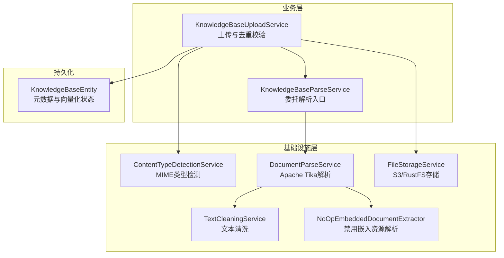
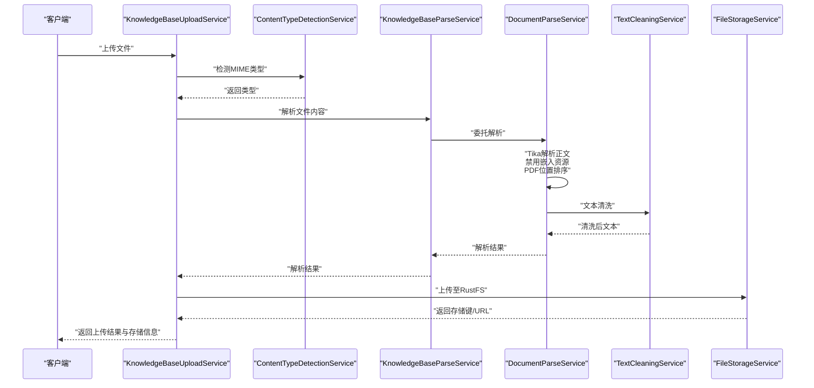
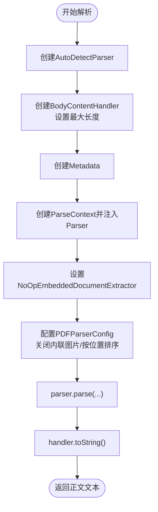
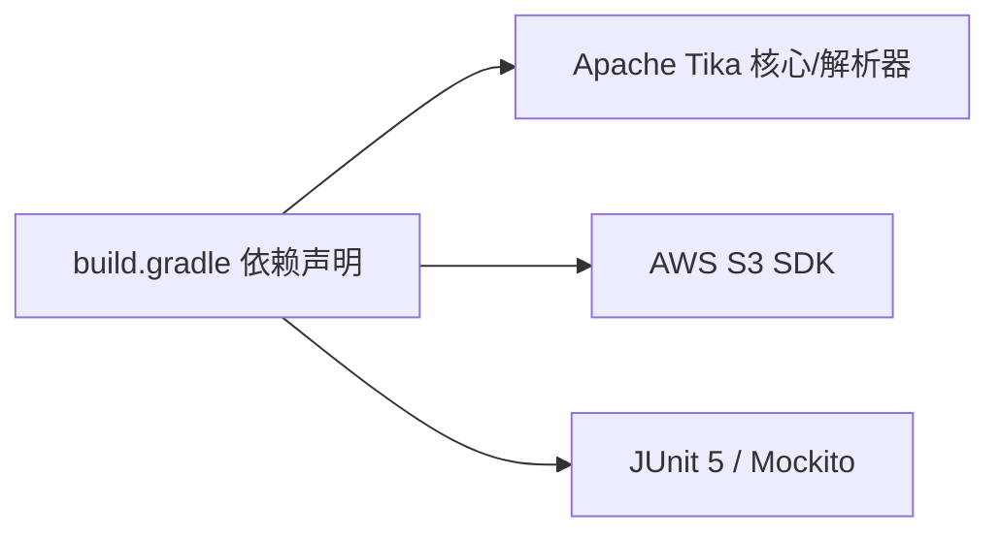
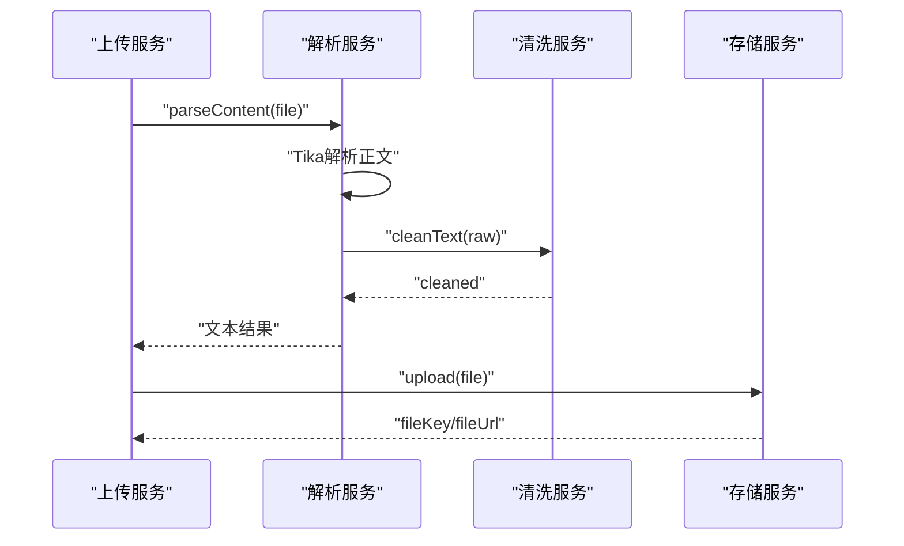

# 知识库解析服务

<cite>
**本文引用的文件**
- [KnowledgeBaseParseService.java](file://app/src/main/java/interview/guide/modules/knowledgebase/service/KnowledgeBaseParseService.java)
- [DocumentParseService.java](file://app/src/main/java/interview/guide/infrastructure/file/DocumentParseService.java)
- [TextCleaningService.java](file://app/src/main/java/interview/guide/infrastructure/file/TextCleaningService.java)
- [ContentTypeDetectionService.java](file://app/src/main/java/interview/guide/infrastructure/file/ContentTypeDetectionService.java)
- [FileStorageService.java](file://app/src/main/java/interview/guide/infrastructure/file/FileStorageService.java)
- [KnowledgeBaseUploadService.java](file://app/src/main/java/interview/guide/modules/knowledgebase/service/KnowledgeBaseUploadService.java)
- [KnowledgeBaseEntity.java](file://app/src/main/java/interview/guide/modules/knowledgebase/model/KnowledgeBaseEntity.java)
- [NoOpEmbeddedDocumentExtractor.java](file://app/src/main/java/interview/guide/infrastructure/file/NoOpEmbeddedDocumentExtractor.java)
- [DocumentParseServiceTest.java](file://app/src/test/java/interview/guide/infrastructure/file/DocumentParseServiceTest.java)
- [DocumentParseIntegrationTest.java](file://app/src/test/java/interview/guide/infrastructure/file/DocumentParseIntegrationTest.java)
- [TextCleaningServiceTest.java](file://app/src/test/java/interview/guide/infrastructure/file/TextCleaningServiceTest.java)
- [build.gradle](file://app/build.gradle)
</cite>

## 目录
1. [引言](#引言)
2. [项目结构](#项目结构)
3. [核心组件](#核心组件)
4. [架构总览](#架构总览)
5. [详细组件分析](#详细组件分析)
6. [依赖分析](#依赖分析)
7. [性能考虑](#性能考虑)
8. [故障排查指南](#故障排查指南)
9. [结论](#结论)
10. [附录](#附录)

## 引言
本文件面向知识库解析服务的技术与非技术读者，系统性阐述“知识库解析服务”的能力边界与实现细节，重点覆盖以下方面：
- 多格式支持：PDF、DOCX、DOC、TXT、MD
- 文本提取算法与格式适配：基于 Apache Tika 的自动检测与解析
- 结构化处理与元数据保留：解析后文本的清洗与规范化
- 完整解析流程：内容类型检测、格式适配器选择、文本提取、格式清理、特殊字符处理、段落分割、标题层级识别
- 不同文件格式的解析策略：二进制格式处理、Office 文档解析、Markdown 渲染、纯文本处理
- 文本清洗能力：HTML 标签移除、编码转换、空白字符标准化、特殊字符过滤
- 性能优化建议与常见问题解决方案

## 项目结构
知识库解析服务位于后端应用的基础设施与业务服务层，围绕“内容类型检测 → 文档解析 → 文本清洗 → 存储与持久化”的主干流程展开，并通过异步向量化实现与检索增强（RAG）对接。

图表来源
- [KnowledgeBaseUploadService.java:48-102](file://app/src/main/java/interview/guide/modules/knowledgebase/service/KnowledgeBaseUploadService.java#L48-L102)
- [KnowledgeBaseParseService.java:30-57](file://app/src/main/java/interview/guide/modules/knowledgebase/service/KnowledgeBaseParseService.java#L30-L57)
- [DocumentParseService.java:108-139](file://app/src/main/java/interview/guide/infrastructure/file/DocumentParseService.java#L108-L139)
- [TextCleaningService.java:80-105](file://app/src/main/java/interview/guide/infrastructure/file/TextCleaningService.java#L80-L105)
- [ContentTypeDetectionService.java:32-66](file://app/src/main/java/interview/guide/infrastructure/file/ContentTypeDetectionService.java#L32-L66)
- [FileStorageService.java:52-61](file://app/src/main/java/interview/guide/infrastructure/file/FileStorageService.java#L52-L61)
- [NoOpEmbeddedDocumentExtractor.java](file://app/src/main/java/interview/guide/infrastructure/file/NoOpEmbeddedDocumentExtractor.java)

章节来源
- [KnowledgeBaseParseService.java:1-66](file://app/src/main/java/interview/guide/modules/knowledgebase/service/KnowledgeBaseParseService.java#L1-66)
- [DocumentParseService.java:1-164](file://app/src/main/java/interview/guide/infrastructure/file/DocumentParseService.java#L1-164)
- [TextCleaningService.java:1-162](file://app/src/main/java/interview/guide/infrastructure/file/TextCleaningService.java#L1-162)
- [ContentTypeDetectionService.java:1-110](file://app/src/main/java/interview/guide/infrastructure/file/ContentTypeDetectionService.java#L1-110)
- [FileStorageService.java:1-280](file://app/src/main/java/interview/guide/infrastructure/file/FileStorageService.java#L1-280)
- [KnowledgeBaseUploadService.java:1-145](file://app/src/main/java/interview/guide/modules/knowledgebase/service/KnowledgeBaseUploadService.java#L1-145)
- [KnowledgeBaseEntity.java:1-223](file://app/src/main/java/interview/guide/modules/knowledgebase/model/KnowledgeBaseEntity.java#L1-223)

## 核心组件
- 知识库解析服务（KnowledgeBaseParseService）
  - 作为对外入口，委托通用文档解析服务执行解析；同时提供内容类型检测与存储下载解析能力。
- 通用文档解析服务（DocumentParseService）
  - 基于 Apache Tika 自动检测解析器，提取正文文本；限制最大文本长度；禁用嵌入资源抽取；对 PDF 进行位置排序优化。
- 文本清洗服务（TextCleaningService）
  - 提供多维度清洗：控制字符、图片文件名/URL、文件协议URL、分隔线；格式规范化（换行统一、行尾空格清理、连续空行压缩）；HTML标签剥离与实体转换；单行化与长度限制。
- 内容类型检测服务（ContentTypeDetectionService）
  - 基于 Apache Tika 的 MIME 类型检测，补充扩展名判断，支持 PDF、Word、纯文本、Markdown 的识别。
- 文件存储服务（FileStorageService）
  - 基于 S3/RustFS 的文件上传、下载、存在性检查、URL 生成与安全文件名处理。
- 知识库上传服务（KnowledgeBaseUploadService）
  - 负责文件校验、类型验证、去重（基于哈希）、解析文本、存储文件、持久化元数据、异步向量化任务派发。

章节来源
- [KnowledgeBaseParseService.java:15-66](file://app/src/main/java/interview/guide/modules/knowledgebase/service/KnowledgeBaseParseService.java#L15-L66)
- [DocumentParseService.java:27-164](file://app/src/main/java/interview/guide/infrastructure/file/DocumentParseService.java#L27-L164)
- [TextCleaningService.java:11-162](file://app/src/main/java/interview/guide/infrastructure/file/TextCleaningService.java#L11-L162)
- [ContentTypeDetectionService.java:15-110](file://app/src/main/java/interview/guide/infrastructure/file/ContentTypeDetectionService.java#L15-L110)
- [FileStorageService.java:30-280](file://app/src/main/java/interview/guide/infrastructure/file/FileStorageService.java#L30-L280)
- [KnowledgeBaseUploadService.java:25-145](file://app/src/main/java/interview/guide/modules/knowledgebase/service/KnowledgeBaseUploadService.java#L25-L145)

## 架构总览
知识库解析服务采用“服务分层 + 外部库集成”的架构：
- 业务层：封装上传、去重、解析、存储、持久化与异步向量化。
- 基础设施层：内容类型检测、文档解析（Tika）、文本清洗、文件存储。
- 外部依赖：Apache Tika（文档解析）、AWS S3 SDK（存储）、Redis（异步队列，由上层服务使用）。

图表来源
- [KnowledgeBaseUploadService.java:48-102](file://app/src/main/java/interview/guide/modules/knowledgebase/service/KnowledgeBaseUploadService.java#L48-L102)
- [KnowledgeBaseParseService.java:30-57](file://app/src/main/java/interview/guide/modules/knowledgebase/service/KnowledgeBaseParseService.java#L30-L57)
- [DocumentParseService.java:108-139](file://app/src/main/java/interview/guide/infrastructure/file/DocumentParseService.java#L108-L139)
- [TextCleaningService.java:80-105](file://app/src/main/java/interview/guide/infrastructure/file/TextCleaningService.java#L80-L105)
- [FileStorageService.java:52-61](file://app/src/main/java/interview/guide/infrastructure/file/FileStorageService.java#L52-L61)

## 详细组件分析

### 知识库解析服务（KnowledgeBaseParseService）
职责
- 对外暴露解析入口，支持 MultipartFile、字节数组与存储下载三种输入形态。
- 委托通用文档解析服务执行解析，并提供内容类型检测能力。
- 与文件存储服务协作，支持从存储下载后解析。

关键点
- 解析委托：将具体解析逻辑委派给 DocumentParseService，保持知识库与简历模块的复用。
- 类型检测：通过 ContentTypeDetectionService 判断文件类型，辅助后续校验与处理。
- 存储下载：结合 FileStorageService，支持从远端存储键下载并解析。

章节来源
- [KnowledgeBaseParseService.java:15-66](file://app/src/main/java/interview/guide/modules/knowledgebase/service/KnowledgeBaseParseService.java#L15-L66)

### 通用文档解析服务（DocumentParseService）
职责
- 使用 Apache Tika 的 AutoDetectParser 自动识别并解析多种文档格式。
- 通过 BodyContentHandler 限制最大文本长度，避免超大文档导致内存压力。
- 禁用嵌入文档提取器（NoOpEmbeddedDocumentExtractor），避免解析图片、附件等嵌入资源。
- 针对 PDF 设置排序策略，按坐标位置提取文本，改善多栏布局顺序。

解析流程（核心步骤）
- 创建 AutoDetectParser 与 BodyContentHandler（最大长度限制）
- 创建 ParseContext 并注入 Parser 实例
- 禁用嵌入资源解析（设置 NoOpEmbeddedDocumentExtractor）
- 配置 PDFParserConfig：关闭内联图片提取、启用按位置排序
- 执行解析并返回正文文本

图表来源
- [DocumentParseService.java:108-139](file://app/src/main/java/interview/guide/infrastructure/file/DocumentParseService.java#L108-L139)
- [NoOpEmbeddedDocumentExtractor.java](file://app/src/main/java/interview/guide/infrastructure/file/NoOpEmbeddedDocumentExtractor.java)

章节来源
- [DocumentParseService.java:27-164](file://app/src/main/java/interview/guide/infrastructure/file/DocumentParseService.java#L27-L164)

### 文本清洗服务（TextCleaningService）
职责
- 在解析后对文本进行统一清洗与规范化，作为 RAG/AI 分析前的“保险层”。

清洗策略（分层）
- 语义去噪层
  - 去除控制字符（保留换行与制表符）
  - 去除整行图片文件名（如 image123.png）
  - 去除图片 URL（http/https）
  - 去除文件协议 URL（file://）
  - 去除分隔线（如 ---、___、===、***）
- 格式规范化层
  - 统一换行符（\r\n、\r → \n）
  - 去除行尾空格与制表符，保留空行（维持段落结构）
  - 压缩连续空行（最多保留两个换行符）

扩展能力
- cleanTextWithLimit：先清洗再截断，适合下游长度限制场景
- cleanToSingleLine：移除换行，合并多余空格，适合单行展示
- stripHtml：移除 HTML 标签并转换常见实体，适合富文本清洗

章节来源
- [TextCleaningService.java:11-162](file://app/src/main/java/interview/guide/infrastructure/file/TextCleaningService.java#L11-L162)
- [TextCleaningServiceTest.java:26-409](file://app/src/test/java/interview/guide/infrastructure/file/TextCleaningServiceTest.java#L26-L409)

### 内容类型检测服务（ContentTypeDetectionService）
职责
- 基于 Apache Tika 的内容检测，优先于 HTTP 头部判断，提高准确性。
- 提供 PDF、Word、纯文本、Markdown 的判定方法，支持扩展名辅助判断。

章节来源
- [ContentTypeDetectionService.java:15-110](file://app/src/main/java/interview/guide/infrastructure/file/ContentTypeDetectionService.java#L15-L110)

### 文件存储服务（FileStorageService）
职责
- 将文件上传至 S3/RustFS，生成安全文件名与唯一键，支持下载、存在性检查、URL 生成与桶存在性保障。
- 文件名清洗：将汉字转换为拼音（大驼峰），保留字母、数字、点号、下划线、连字符，其余替换为下划线。

章节来源
- [FileStorageService.java:30-280](file://app/src/main/java/interview/guide/infrastructure/file/FileStorageService.java#L30-L280)

### 知识库上传服务（KnowledgeBaseUploadService）
职责
- 文件校验（大小、类型）、重复检测（基于哈希）、解析文本、存储文件、持久化元数据、异步向量化任务派发。
- 重新向量化：从存储下载文件并再次解析，更新状态后重新入队。

章节来源
- [KnowledgeBaseUploadService.java:25-145](file://app/src/main/java/interview/guide/modules/knowledgebase/service/KnowledgeBaseUploadService.java#L25-L145)
- [KnowledgeBaseEntity.java:10-223](file://app/src/main/java/interview/guide/modules/knowledgebase/model/KnowledgeBaseEntity.java#L10-L223)

## 依赖分析
- Apache Tika
  - 用于自动检测与解析多种文档格式（PDF、DOCX、DOC、TXT、MD 等）
- AWS S3 SDK
  - 用于文件上传、下载、桶存在性检查与对象元数据读取
- JUnit 5 与 Mockito
  - 单元测试与集成测试覆盖解析、清洗、类型检测与存储

图表来源
- [build.gradle:46-87](file://app/build.gradle#L46-L87)

章节来源
- [build.gradle:46-87](file://app/build.gradle#L46-L87)

## 性能考虑
- 文本长度限制
  - 解析阶段通过 BodyContentHandler 限制最大文本长度，避免超大文档占用过多内存。
- 禁用嵌入资源解析
  - 通过 NoOpEmbeddedDocumentExtractor 避免解析图片、附件等嵌入内容，降低解析开销与噪声。
- PDF 排序优化
  - PDFParserConfig 启用按位置排序，改善多栏布局的文本顺序，减少后处理成本。
- 文本清洗预处理
  - 在解析后进行统一清洗，减少下游 RAG/LLM 的噪声与冗余，间接提升检索质量。
- 存储与去重
  - 基于文件哈希的去重策略，避免重复解析与存储，节省计算与带宽。

章节来源
- [DocumentParseService.java:31-37](file://app/src/main/java/interview/guide/infrastructure/file/DocumentParseService.java#L31-L37)
- [DocumentParseService.java:124-132](file://app/src/main/java/interview/guide/infrastructure/file/DocumentParseService.java#L124-L132)
- [KnowledgeBaseUploadService.java:59-65](file://app/src/main/java/interview/guide/modules/knowledgebase/service/KnowledgeBaseUploadService.java#L59-L65)

## 故障排查指南
常见问题与定位思路
- 解析失败（IO/Tika/SAX 异常）
  - 触发 BusinessException，检查文件是否损坏、格式是否受支持、输入流是否可用。
- 空文件或空内容
  - 空文件返回空字符串；若清洗后仍为空，确认内容是否仅为噪音（分隔线、图片名、临时路径等）。
- 类型检测异常
  - 当基于内容的检测失败时回退到 Content-Type 头部；若仍失败，返回二进制流类型，需检查客户端上传头信息。
- 存储下载失败
  - 下载不到文件或返回空字节数组时，检查存储键是否存在、桶权限与网络连接。
- 文本质量不佳
  - 若出现大量噪音（图片名、URL、分隔线），确认是否正确调用了清洗服务；必要时调整清洗规则。

章节来源
- [DocumentParseService.java:60-63](file://app/src/main/java/interview/guide/infrastructure/file/DocumentParseService.java#L60-L63)
- [DocumentParseService.java:156-161](file://app/src/main/java/interview/guide/infrastructure/file/DocumentParseService.java#L156-L161)
- [ContentTypeDetectionService.java:32-54](file://app/src/main/java/interview/guide/infrastructure/file/ContentTypeDetectionService.java#L32-L54)
- [FileStorageService.java:69-84](file://app/src/main/java/interview/guide/infrastructure/file/FileStorageService.java#L69-L84)
- [TextCleaningService.java:80-105](file://app/src/main/java/interview/guide/infrastructure/file/TextCleaningService.java#L80-L105)

## 结论
知识库解析服务通过“内容类型检测 + Apache Tika 解析 + 统一文本清洗 + 存储与去重”的组合，实现了对多格式文档的稳定解析与高质量文本输出。其设计强调：
- 可靠性：禁用嵌入资源、限制文本长度、严格的异常处理
- 可维护性：服务分层清晰、能力复用（知识库/简历共享解析）
- 可扩展性：清洗规则可演进、存储后端可替换、解析策略可定制

## 附录

### 多格式支持与解析策略
- PDF
  - 使用 PDFParserConfig 关闭内联图片提取，启用按位置排序，提升文本顺序与可读性。
- DOCX/DOC
  - 通过 AutoDetectParser 自动识别，提取正文文本；禁用嵌入资源解析，避免图片/附件噪声。
- TXT/MD
  - 纯文本与 Markdown 由 Tika 正文处理器提取；Markdown 可在清洗阶段进一步标准化格式。

章节来源
- [DocumentParseService.java:127-132](file://app/src/main/java/interview/guide/infrastructure/file/DocumentParseService.java#L127-L132)
- [ContentTypeDetectionService.java:71-108](file://app/src/main/java/interview/guide/infrastructure/file/ContentTypeDetectionService.java#L71-L108)

### 文档解析流程（端到端）

图表来源
- [KnowledgeBaseUploadService.java:67-79](file://app/src/main/java/interview/guide/modules/knowledgebase/service/KnowledgeBaseUploadService.java#L67-L79)
- [KnowledgeBaseParseService.java:30-45](file://app/src/main/java/interview/guide/modules/knowledgebase/service/KnowledgeBaseParseService.java#L30-L45)
- [DocumentParseService.java:55-59](file://app/src/main/java/interview/guide/infrastructure/file/DocumentParseService.java#L55-L59)
- [TextCleaningService.java:80-105](file://app/src/main/java/interview/guide/infrastructure/file/TextCleaningService.java#L80-L105)
- [FileStorageService.java:52-61](file://app/src/main/java/interview/guide/infrastructure/file/FileStorageService.java#L52-L61)

### 测试覆盖要点
- 单元测试
  - DocumentParseServiceTest：覆盖 TXT/MD 解析、字节数组解析、异常处理、文本清洗集成、边界条件。
  - TextCleaningServiceTest：覆盖控制字符、图片名/URL、分隔线、换行统一、单行化、HTML剥离等。
- 集成测试
  - DocumentParseIntegrationTest：真实文件解析、多语言混合、大文件性能、纯噪音文档处理。

章节来源
- [DocumentParseServiceTest.java:32-421](file://app/src/test/java/interview/guide/infrastructure/file/DocumentParseServiceTest.java#L32-L421)
- [DocumentParseIntegrationTest.java:19-404](file://app/src/test/java/interview/guide/infrastructure/file/DocumentParseIntegrationTest.java#L19-L404)
- [TextCleaningServiceTest.java:16-409](file://app/src/test/java/interview/guide/infrastructure/file/TextCleaningServiceTest.java#L16-L409)