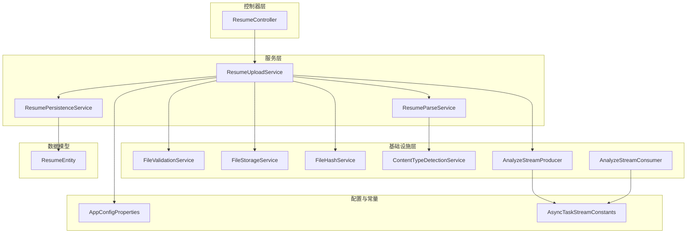
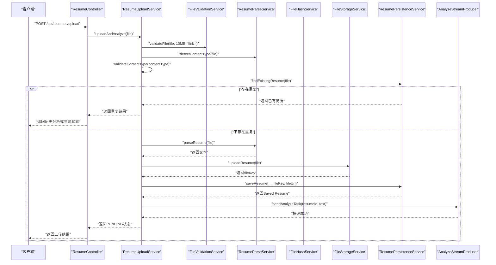
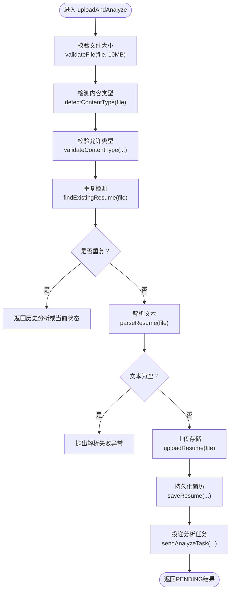
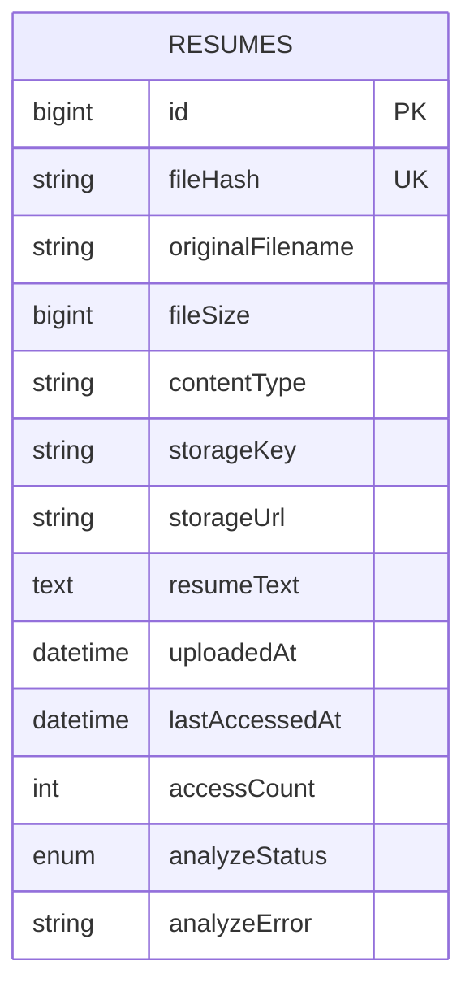
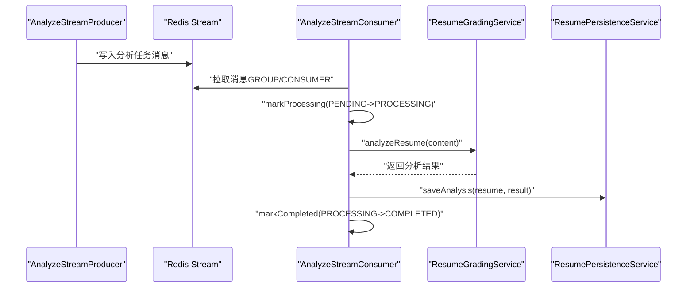
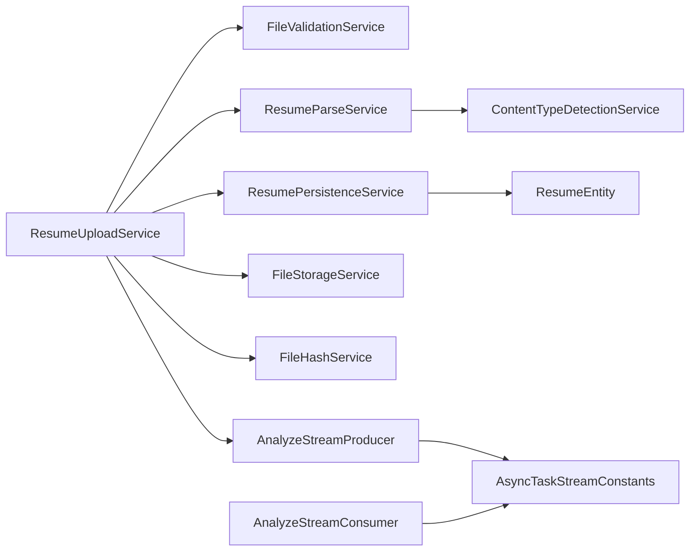

# 简历上传服务

<cite>
**本文引用的文件**
- [ResumeUploadService.java](file://app/src/main/java/interview/guide/modules/resume/service/ResumeUploadService.java)
- [AnalyzeStreamProducer.java](file://app/src/main/java/interview/guide/modules/resume/listener/AnalyzeStreamProducer.java)
- [AnalyzeStreamConsumer.java](file://app/src/main/java/interview/guide/modules/resume/listener/AnalyzeStreamConsumer.java)
- [FileValidationService.java](file://app/src/main/java/interview/guide/infrastructure/file/FileValidationService.java)
- [FileStorageService.java](file://app/src/main/java/interview/guide/infrastructure/file/FileStorageService.java)
- [AppConfigProperties.java](file://app/src/main/java/interview/guide/common/config/AppConfigProperties.java)
- [ResumeParseService.java](file://app/src/main/java/interview/guide/modules/resume/service/ResumeParseService.java)
- [ResumePersistenceService.java](file://app/src/main/java/interview/guide/modules/resume/service/ResumePersistenceService.java)
- [ResumeEntity.java](file://app/src/main/java/interview/guide/modules/resume/model/ResumeEntity.java)
- [AsyncTaskStreamConstants.java](file://app/src/main/java/interview/guide/common/constant/AsyncTaskStreamConstants.java)
- [ResumeController.java](file://app/src/main/java/interview/guide/modules/resume/ResumeController.java)
- [FileHashService.java](file://app/src/main/java/interview/guide/infrastructure/file/FileHashService.java)
- [ContentTypeDetectionService.java](file://app/src/main/java/interview/guide/infrastructure/file/ContentTypeDetectionService.java)
- [application.yml](file://app/src/main/resources/application.yml)
</cite>

## 目录
1. [简介](#简介)
2. [项目结构](#项目结构)
3. [核心组件](#核心组件)
4. [架构总览](#架构总览)
5. [详细组件分析](#详细组件分析)
6. [依赖分析](#依赖分析)
7. [性能考虑](#性能考虑)
8. [故障排查指南](#故障排查指南)
9. [结论](#结论)
10. [附录](#附录)

## 简介
本文件面向“简历上传服务”的使用者与维护者，系统性阐述 ResumeUploadService 的核心能力与实现细节，包括文件上传验证、内容类型检测、重复文件检查、异步分析处理等。文档同时给出 uploadAndAnalyze 方法的完整流程说明，覆盖从文件校验、类型识别、重复检测、文本解析、对象存储、数据库持久化到异步分析任务投递的全过程，并对文件大小限制、支持的文件类型、重复检测机制等关键配置进行解读。最后，文档总结最佳实践、错误处理策略与性能优化建议。

## 项目结构
简历上传相关模块位于后端应用的模块化目录中，采用按功能域分层组织：
- 控制器层：提供 HTTP 接口，负责参数接收与响应封装
- 服务层：业务编排与协调，包括上传、解析、持久化、重试等
- 基础设施层：文件校验、存储、类型检测、Redis Stream 等
- 模型与仓库：简历实体与分析结果的数据映射与查询

图表来源
- [ResumeController.java:1-132](file://app/src/main/java/interview/guide/modules/resume/ResumeController.java#L1-L132)
- [ResumeUploadService.java:1-201](file://app/src/main/java/interview/guide/modules/resume/service/ResumeUploadService.java#L1-L201)
- [ResumeParseService.java:1-66](file://app/src/main/java/interview/guide/modules/resume/service/ResumeParseService.java#L1-L66)
- [ResumePersistenceService.java:1-208](file://app/src/main/java/interview/guide/modules/resume/service/ResumePersistenceService.java#L1-L208)
- [FileValidationService.java:1-129](file://app/src/main/java/interview/guide/infrastructure/file/FileValidationService.java#L1-L129)
- [FileStorageService.java:1-280](file://app/src/main/java/interview/guide/infrastructure/file/FileStorageService.java#L1-L280)
- [FileHashService.java:1-89](file://app/src/main/java/interview/guide/infrastructure/file/FileHashService.java#L1-L89)
- [ContentTypeDetectionService.java:1-110](file://app/src/main/java/interview/guide/infrastructure/file/ContentTypeDetectionService.java#L1-L110)
- [AnalyzeStreamProducer.java:1-82](file://app/src/main/java/interview/guide/modules/resume/listener/AnalyzeStreamProducer.java#L1-L82)
- [AnalyzeStreamConsumer.java:1-158](file://app/src/main/java/interview/guide/modules/resume/listener/AnalyzeStreamConsumer.java#L1-L158)
- [AppConfigProperties.java:1-34](file://app/src/main/java/interview/guide/common/config/AppConfigProperties.java#L1-L34)
- [AsyncTaskStreamConstants.java:1-135](file://app/src/main/java/interview/guide/common/constant/AsyncTaskStreamConstants.java#L1-L135)
- [ResumeEntity.java:1-184](file://app/src/main/java/interview/guide/modules/resume/model/ResumeEntity.java#L1-L184)

章节来源
- [ResumeController.java:1-132](file://app/src/main/java/interview/guide/modules/resume/ResumeController.java#L1-L132)
- [ResumeUploadService.java:1-201](file://app/src/main/java/interview/guide/modules/resume/service/ResumeUploadService.java#L1-L201)

## 核心组件
- ResumeUploadService：简历上传与异步分析的业务编排中心，负责文件校验、类型检测、重复检查、文本解析、对象存储、数据库持久化以及分析任务投递。
- ResumeParseService：简历内容解析委托者，结合内容类型检测与文档解析服务完成文本抽取。
- ResumePersistenceService：简历与分析结果的持久化服务，包含重复检测（基于文件哈希）、保存与查询。
- FileValidationService：通用文件校验工具，支持大小限制、MIME类型白名单校验等。
- FileStorageService：S3 兼容对象存储封装，提供上传、下载、删除、存在性检查、URL 生成等能力。
- FileHashService：文件哈希计算服务，用于重复检测。
- ContentTypeDetectionService：基于 Apache Tika 的 MIME 类型检测服务。
- AnalyzeStreamProducer/Consumer：基于 Redis Stream 的异步分析任务生产与消费。
- AppConfigProperties：应用配置读取，包含允许的文件类型列表等。
- AsyncTaskStreamConstants：异步任务 Redis Stream 常量定义。
- ResumeEntity：简历实体，包含去重字段与分析状态等。

章节来源
- [ResumeUploadService.java:1-201](file://app/src/main/java/interview/guide/modules/resume/service/ResumeUploadService.java#L1-L201)
- [ResumeParseService.java:1-66](file://app/src/main/java/interview/guide/modules/resume/service/ResumeParseService.java#L1-L66)
- [ResumePersistenceService.java:1-208](file://app/src/main/java/interview/guide/modules/resume/service/ResumePersistenceService.java#L1-L208)
- [FileValidationService.java:1-129](file://app/src/main/java/interview/guide/infrastructure/file/FileValidationService.java#L1-L129)
- [FileStorageService.java:1-280](file://app/src/main/java/interview/guide/infrastructure/file/FileStorageService.java#L1-L280)
- [FileHashService.java:1-89](file://app/src/main/java/interview/guide/infrastructure/file/FileHashService.java#L1-L89)
- [ContentTypeDetectionService.java:1-110](file://app/src/main/java/interview/guide/infrastructure/file/ContentTypeDetectionService.java#L1-L110)
- [AnalyzeStreamProducer.java:1-82](file://app/src/main/java/interview/guide/modules/resume/listener/AnalyzeStreamProducer.java#L1-L82)
- [AnalyzeStreamConsumer.java:1-158](file://app/src/main/java/interview/guide/modules/resume/listener/AnalyzeStreamConsumer.java#L1-L158)
- [AppConfigProperties.java:1-34](file://app/src/main/java/interview/guide/common/config/AppConfigProperties.java#L1-L34)
- [AsyncTaskStreamConstants.java:1-135](file://app/src/main/java/interview/guide/common/constant/AsyncTaskStreamConstants.java#L1-L135)
- [ResumeEntity.java:1-184](file://app/src/main/java/interview/guide/modules/resume/model/ResumeEntity.java#L1-L184)

## 架构总览
简历上传采用“同步校验 + 异步分析”的设计：上传接口在业务层完成文件校验、类型检测、重复检查、文本解析与存储后，将分析任务投递至 Redis Stream，由独立消费者异步执行 AI 分析并将结果持久化。

图表来源
- [ResumeController.java:44-54](file://app/src/main/java/interview/guide/modules/resume/ResumeController.java#L44-L54)
- [ResumeUploadService.java:47-110](file://app/src/main/java/interview/guide/modules/resume/service/ResumeUploadService.java#L47-L110)
- [FileValidationService.java:27-36](file://app/src/main/java/interview/guide/infrastructure/file/FileValidationService.java#L27-L36)
- [ResumeParseService.java:30-33](file://app/src/main/java/interview/guide/modules/resume/service/ResumeParseService.java#L30-L33)
- [FileStorageService.java:38-111](file://app/src/main/java/interview/guide/infrastructure/file/FileStorageService.java#L38-L111)
- [ResumePersistenceService.java:45-90](file://app/src/main/java/interview/guide/modules/resume/service/ResumePersistenceService.java#L45-L90)
- [AnalyzeStreamProducer.java:36-38](file://app/src/main/java/interview/guide/modules/resume/listener/AnalyzeStreamProducer.java#L36-L38)

## 详细组件分析

### ResumeUploadService：上传与异步分析编排
- 职责边界
  - 文件上传入口，负责全流程编排：校验、类型检测、重复检查、解析、存储、持久化、投递分析任务。
  - 对外返回结构包含简历基本信息、存储信息与重复标记；重复时优先返回历史分析结果或当前状态。
- 关键流程
  - 文件校验：调用 FileValidationService.validateFile，限制大小为 10MB。
  - 类型检测：通过 ResumeParseService.detectContentType 使用 ContentTypeDetectionService 基于内容检测 MIME 类型，再由 AppConfigProperties 中的 allowed-types 白名单校验。
  - 重复检测：通过 ResumePersistenceService.findExistingResume 基于 FileHashService 计算的文件哈希判断是否重复。
  - 文本解析：ResumeParseService.parseResume 调用底层文档解析服务提取文本。
  - 对象存储：FileStorageService.uploadResume 上传至 S3 兼容存储，生成 fileKey 并拼装 fileUrl。
  - 数据库持久化：ResumePersistenceService.saveResume 写入 ResumeEntity，初始分析状态为 PENDING。
  - 异步分析：AnalyzeStreamProducer.sendAnalyzeTask 投递分析任务到 Redis Stream。
- 错误处理
  - 解析失败抛出业务异常，提示“无法从文件中提取文本内容，请确保文件不是扫描版PDF”。
  - 存储失败、下载失败、读取失败均包装为业务异常，便于上层统一处理。
- 重试机制
  - 通过 reanalyze 方法可手动触发重新分析，若缓存文本缺失则尝试重新解析并更新状态后再次投递分析任务。

图表来源
- [ResumeUploadService.java:47-110](file://app/src/main/java/interview/guide/modules/resume/service/ResumeUploadService.java#L47-L110)
- [FileValidationService.java:27-36](file://app/src/main/java/interview/guide/infrastructure/file/FileValidationService.java#L27-L36)
- [ResumeParseService.java:30-33](file://app/src/main/java/interview/guide/modules/resume/service/ResumeParseService.java#L30-L33)
- [FileStorageService.java:38-111](file://app/src/main/java/interview/guide/infrastructure/file/FileStorageService.java#L38-L111)
- [ResumePersistenceService.java:45-90](file://app/src/main/java/interview/guide/modules/resume/service/ResumePersistenceService.java#L45-L90)
- [AnalyzeStreamProducer.java:36-38](file://app/src/main/java/interview/guide/modules/resume/listener/AnalyzeStreamProducer.java#L36-L38)

章节来源
- [ResumeUploadService.java:1-201](file://app/src/main/java/interview/guide/modules/resume/service/ResumeUploadService.java#L1-L201)

### 文件验证与类型检测
- 文件大小限制
  - 业务层硬性限制为 10MB（字节），超出即抛出业务异常。
  - Spring 配置中 multipart.max-file-size 为 50MB，用于知识库上传场景，简历上传在业务层单独控制。
- 类型检测
  - 使用 ContentTypeDetectionService 基于内容检测 MIME 类型，兜底使用 HTTP 头部。
  - 通过 AppConfigProperties.allowed-types 白名单进行二次校验，支持子串匹配（如“pdf”匹配“application/pdf”）。
- 文件扩展名校验
  - FileValidationService 支持基于扩展名的补充校验，增强容错。

章节来源
- [ResumeUploadService.java:39-60](file://app/src/main/java/interview/guide/modules/resume/service/ResumeUploadService.java#L39-L60)
- [FileValidationService.java:27-77](file://app/src/main/java/interview/guide/infrastructure/file/FileValidationService.java#L27-L77)
- [ContentTypeDetectionService.java:32-55](file://app/src/main/java/interview/guide/infrastructure/file/ContentTypeDetectionService.java#L32-L55)
- [AppConfigProperties.java:26-32](file://app/src/main/java/interview/guide/common/config/AppConfigProperties.java#L26-L32)
- [application.yml:80-83](file://app/src/main/resources/application.yml#L80-L83)

### 重复文件检查机制
- 哈希计算
  - 使用 FileHashService.calculateHash 对文件内容进行 SHA-256 计算，保证跨设备、跨时间的一致性。
- 去重策略
  - ResumePersistenceService.findExistingResume 查询数据库中 fileHash 唯一键，命中则视为重复。
  - 若重复，仅增加访问计数并返回历史分析结果或当前状态，避免重复解析与存储。
- 数据模型
  - ResumeEntity.fileHash 为唯一索引，确保数据库层面的强约束。

图表来源
- [ResumeEntity.java:13-15](file://app/src/main/java/interview/guide/modules/resume/model/ResumeEntity.java#L13-L15)
- [ResumePersistenceService.java:45-62](file://app/src/main/java/interview/guide/modules/resume/service/ResumePersistenceService.java#L45-L62)
- [FileHashService.java:31-55](file://app/src/main/java/interview/guide/infrastructure/file/FileHashService.java#L31-L55)

章节来源
- [ResumePersistenceService.java:45-62](file://app/src/main/java/interview/guide/modules/resume/service/ResumePersistenceService.java#L45-L62)
- [FileHashService.java:31-55](file://app/src/main/java/interview/guide/infrastructure/file/FileHashService.java#L31-L55)
- [ResumeEntity.java:22-24](file://app/src/main/java/interview/guide/modules/resume/model/ResumeEntity.java#L22-L24)

### 异步分析处理
- 生产者
  - AnalyzeStreamProducer 将分析任务封装为消息，包含 resumeId 与 content，写入 Redis Stream。
  - 若投递失败，回调更新分析状态为 FAILED。
- 消费者
  - AnalyzeStreamConsumer 从 Redis Stream 拉取消息，标记为 PROCESSING，执行分析，保存结果，最终标记为 COMPLETED。
  - 支持最大重试次数与消息批次拉取，具备幂等与失败回退能力。
- 任务常量
  - AsyncTaskStreamConstants 定义了简历分析 Stream Key、消费者组名与前缀、字段名等。

图表来源
- [AnalyzeStreamProducer.java:36-67](file://app/src/main/java/interview/guide/modules/resume/listener/AnalyzeStreamProducer.java#L36-L67)
- [AnalyzeStreamConsumer.java:91-115](file://app/src/main/java/interview/guide/modules/resume/listener/AnalyzeStreamConsumer.java#L91-L115)
- [AsyncTaskStreamConstants.java:74-89](file://app/src/main/java/interview/guide/common/constant/AsyncTaskStreamConstants.java#L74-L89)

章节来源
- [AnalyzeStreamProducer.java:1-82](file://app/src/main/java/interview/guide/modules/resume/listener/AnalyzeStreamProducer.java#L1-L82)
- [AnalyzeStreamConsumer.java:1-158](file://app/src/main/java/interview/guide/modules/resume/listener/AnalyzeStreamConsumer.java#L1-L158)
- [AsyncTaskStreamConstants.java:1-135](file://app/src/main/java/interview/guide/common/constant/AsyncTaskStreamConstants.java#L1-L135)

### 与控制器的协作
- 接口定义
  - POST /api/resumes/upload：上传并分析，带全局与 IP 限流。
  - GET /api/resumes：获取简历列表。
  - GET /api/resumes/{id}/detail：获取简历详情（含分析历史）。
  - GET /api/resumes/{id}/export：导出 PDF 报告。
  - DELETE /api/resumes/{id}：删除简历。
  - POST /api/resumes/{id}/reanalyze：手动重试分析。
- 返回封装
  - 统一使用 Result<T> 包裹，重复上传时返回历史分析或当前状态。

章节来源
- [ResumeController.java:44-118](file://app/src/main/java/interview/guide/modules/resume/ResumeController.java#L44-L118)

## 依赖分析
- 组件耦合
  - ResumeUploadService 作为编排者，依赖 FileValidationService、ResumeParseService、ResumePersistenceService、FileStorageService、FileHashService、AnalyzeStreamProducer。
  - ResumePersistenceService 依赖 FileHashService、ResumeMapper、ResumeRepository、ResumeAnalysisRepository、ObjectMapper。
  - AnalyzeStreamProducer/Consumer 依赖 RedisService 与 ResumeRepository，遵循 AsyncTaskStreamConstants 的约定。
- 外部依赖
  - S3 兼容存储：FileStorageService 依赖 S3Client 与 StorageConfigProperties。
  - Redis：AnalyzeStreamProducer/Consumer 依赖 Redisson/Redis 服务。
  - Apache Tika：ContentTypeDetectionService 依赖 Tika 进行类型检测。
- 循环依赖
  - 当前结构未发现循环依赖，职责清晰、边界明确。

图表来源
- [ResumeUploadService.java:31-37](file://app/src/main/java/interview/guide/modules/resume/service/ResumeUploadService.java#L31-L37)
- [ResumeParseService.java:20-22](file://app/src/main/java/interview/guide/modules/resume/service/ResumeParseService.java#L20-L22)
- [ResumePersistenceService.java:33-37](file://app/src/main/java/interview/guide/modules/resume/service/ResumePersistenceService.java#L33-L37)
- [AnalyzeStreamProducer.java:21-28](file://app/src/main/java/interview/guide/modules/resume/listener/AnalyzeStreamProducer.java#L21-L28)
- [AnalyzeStreamConsumer.java:26-40](file://app/src/main/java/interview/guide/modules/resume/listener/AnalyzeStreamConsumer.java#L26-L40)
- [AsyncTaskStreamConstants.java:74-89](file://app/src/main/java/interview/guide/common/constant/AsyncTaskStreamConstants.java#L74-L89)

章节来源
- [ResumeUploadService.java:1-201](file://app/src/main/java/interview/guide/modules/resume/service/ResumeUploadService.java#L1-L201)
- [ResumePersistenceService.java:1-208](file://app/src/main/java/interview/guide/modules/resume/service/ResumePersistenceService.java#L1-L208)
- [AnalyzeStreamProducer.java:1-82](file://app/src/main/java/interview/guide/modules/resume/listener/AnalyzeStreamProducer.java#L1-L82)
- [AnalyzeStreamConsumer.java:1-158](file://app/src/main/java/interview/guide/modules/resume/listener/AnalyzeStreamConsumer.java#L1-L158)

## 性能考虑
- 并发与线程
  - 服务器启用虚拟线程（spring.threads.virtual.enabled=true），适合高 I/O 场景（如 AI 调用、SSE、Redis Stream）。
- 数据库
  - JPA 批量写入与顺序优化（batch_size、order_inserts、order_updates）有助于批量持久化性能。
- 存储
  - S3 兼容存储上传采用 InputStream 方式，避免大文件内存峰值；注意网络抖动与超时配置。
- 缓存与重试
  - 分析任务通过 Redis Stream 实现削峰填谷，配合最大重试次数与消息批次拉取，降低瞬时压力。
- 前端轮询
  - 上传返回 PENDING 状态，前端可轮询查询最新状态，避免长连接占用资源。

章节来源
- [application.yml:44-46](file://app/src/main/resources/application.yml#L44-L46)
- [application.yml:74-77](file://app/src/main/resources/application.yml#L74-L77)
- [AsyncTaskStreamConstants.java:35-40](file://app/src/main/java/interview/guide/common/constant/AsyncTaskStreamConstants.java#L35-L40)

## 故障排查指南
- 常见错误与定位
  - BAD_REQUEST：文件为空、大小超限、类型不支持。检查 FileValidationService 的校验逻辑与 allowed-types 配置。
  - RESUME_PARSE_FAILED：解析失败，常见于扫描版 PDF 或内容为空。建议提示用户重新上传清晰版本。
  - STORAGE_UPLOAD_FAILED/STORAGE_DOWNLOAD_FAILED：S3 存储异常，检查 endpoint、bucket、凭证与网络连通性。
  - RESUME_UPLOAD_FAILED/RESUME_ANALYSIS_FAILED：数据库持久化异常，检查连接池与表结构。
- 日志与追踪
  - 服务层记录关键耗时（解析、存储、入库），便于定位瓶颈。
  - Redis Stream 消费者记录状态变更与重试次数，便于问题复盘。
- 重试与恢复
  - 使用 POST /api/resumes/{id}/reanalyze 触发手动重试。
  - 分析失败时，Producer/Consumer 会更新状态并记录错误信息，便于前端展示与用户操作。

章节来源
- [FileValidationService.java:27-77](file://app/src/main/java/interview/guide/infrastructure/file/FileValidationService.java#L27-L77)
- [FileStorageService.java:104-110](file://app/src/main/java/interview/guide/infrastructure/file/FileStorageService.java#L104-L110)
- [ResumeUploadService.java:74-75](file://app/src/main/java/interview/guide/modules/resume/service/ResumeUploadService.java#L74-L75)
- [AnalyzeStreamProducer.java:65-67](file://app/src/main/java/interview/guide/modules/resume/listener/AnalyzeStreamProducer.java#L65-L67)
- [AnalyzeStreamConsumer.java:113-115](file://app/src/main/java/interview/guide/modules/resume/listener/AnalyzeStreamConsumer.java#L113-L115)

## 结论
简历上传服务通过严格的文件校验、类型检测与重复检查，结合对象存储与数据库持久化，实现了稳定可靠的上传体验；通过 Redis Stream 的异步分析机制，进一步提升了系统的吞吐与稳定性。建议在生产环境中关注 S3 凭证与网络、Redis 连接池配置、以及前端轮询策略，持续优化用户体验与系统性能。

## 附录
- 关键配置项
  - app.resume.allowed-types：允许的 MIME 类型白名单
  - app.storage.endpoint/bucket/access-key/secret-key：S3 兼容存储配置
  - spring.servlet.multipart.max-file-size/max-request-size：Spring 上传限制
  - redisson 配置：Redis 连接池与超时
- 接口一览
  - POST /api/resumes/upload：上传并分析
  - GET /api/resumes：获取简历列表
  - GET /api/resumes/{id}/detail：获取简历详情
  - GET /api/resumes/{id}/export：导出 PDF
  - DELETE /api/resumes/{id}：删除简历
  - POST /api/resumes/{id}/reanalyze：手动重试分析

章节来源
- [application.yml:174-189](file://app/src/main/resources/application.yml#L174-L189)
- [application.yml:80-83](file://app/src/main/resources/application.yml#L80-L83)
- [application.yml:87-98](file://app/src/main/resources/application.yml#L87-L98)
- [ResumeController.java:44-118](file://app/src/main/java/interview/guide/modules/resume/ResumeController.java#L44-L118)