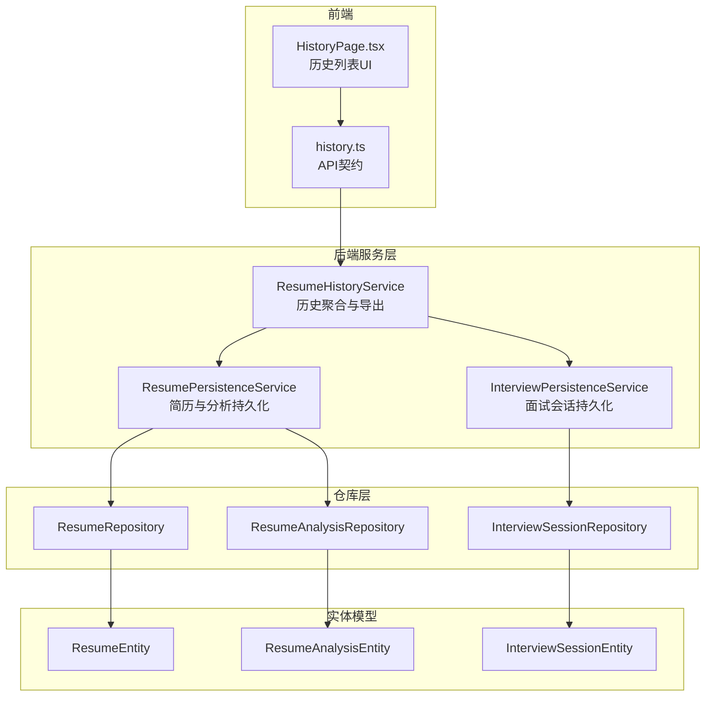
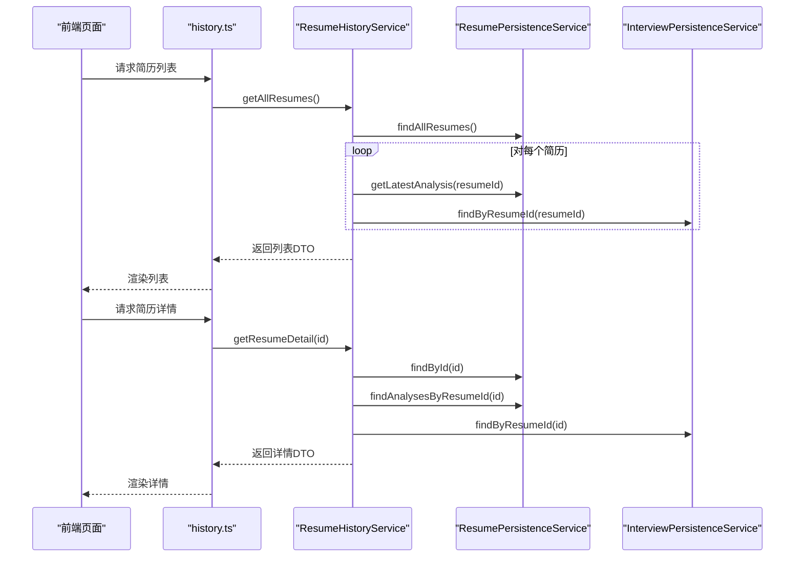
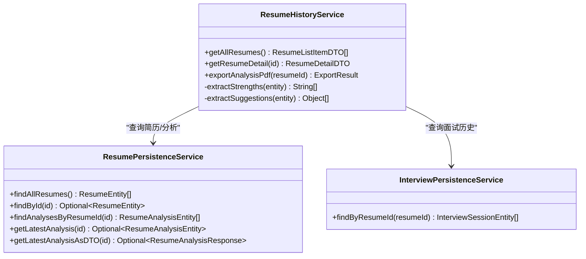
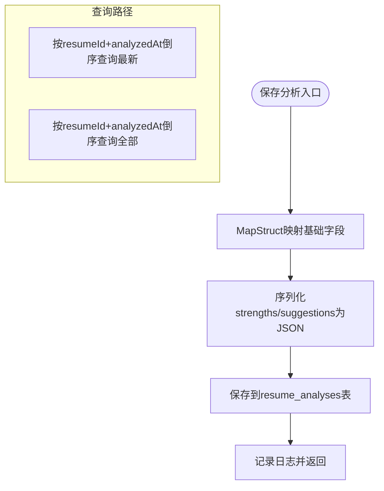
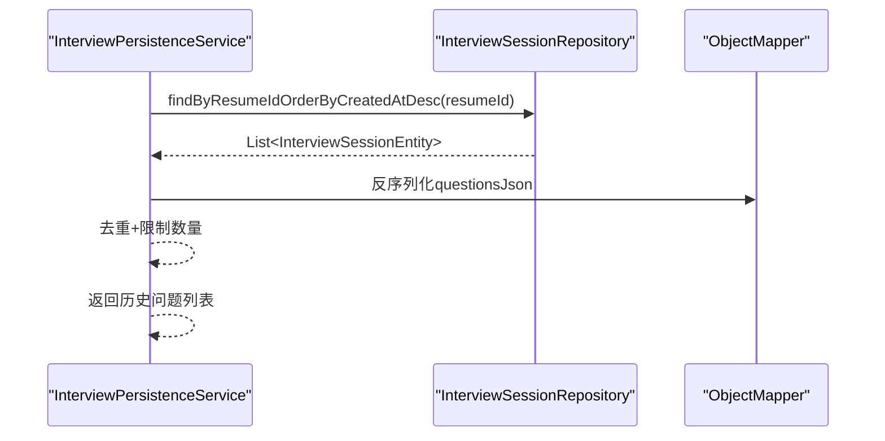
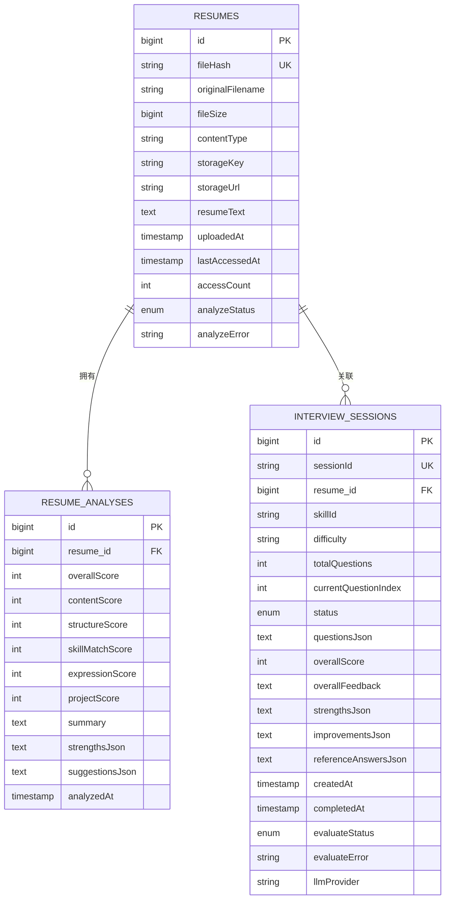
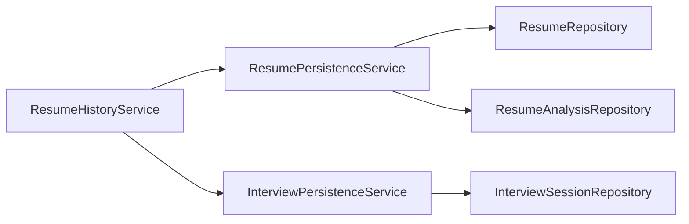

# 简历历史服务

<cite>
**本文引用的文件**
- [ResumeHistoryService.java](file://app/src/main/java/interview/guide/modules/resume/service/ResumeHistoryService.java)
- [ResumePersistenceService.java](file://app/src/main/java/interview/guide/modules/resume/service/ResumePersistenceService.java)
- [ResumeRepository.java](file://app/src/main/java/interview/guide/modules/resume/repository/ResumeRepository.java)
- [ResumeAnalysisRepository.java](file://app/src/main/java/interview/guide/modules/resume/repository/ResumeAnalysisRepository.java)
- [ResumeEntity.java](file://app/src/main/java/interview/guide/modules/resume/model/ResumeEntity.java)
- [ResumeAnalysisEntity.java](file://app/src/main/java/interview/guide/modules/resume/model/ResumeAnalysisEntity.java)
- [ResumeDetailDTO.java](file://app/src/main/java/interview/guide/modules/resume/model/ResumeDetailDTO.java)
- [ResumeListItemDTO.java](file://app/src/main/java/interview/guide/modules/resume/model/ResumeListItemDTO.java)
- [InterviewPersistenceService.java](file://app/src/main/java/interview/guide/modules/interview/service/InterviewPersistenceService.java)
- [InterviewSessionRepository.java](file://app/src/main/java/interview/guide/modules/interview/repository/InterviewSessionRepository.java)
- [InterviewSessionEntity.java](file://app/src/main/java/interview/guide/modules/interview/model/InterviewSessionEntity.java)
- [history.ts](file://frontend/src/api/history.ts)
- [HistoryPage.tsx](file://frontend/src/pages/HistoryPage.tsx)
</cite>

## 目录
1. [简介](#简介)
2. [项目结构](#项目结构)
3. [核心组件](#核心组件)
4. [架构总览](#架构总览)
5. [详细组件分析](#详细组件分析)
6. [依赖关系分析](#依赖关系分析)
7. [性能考量](#性能考量)
8. [故障排查指南](#故障排查指南)
9. [结论](#结论)
10. [附录](#附录)

## 简介
本文件系统性阐述“简历历史服务”的设计与实现，重点覆盖历史记录管理、变更追踪、时间线展示、数据存储策略、查询接口与分页处理、与仓库层的数据交互、性能优化策略、清理与归档机制、数据保留期限管理，以及最佳实践与使用场景。该服务围绕简历实体与其分析历史、面试历史进行统一聚合，提供列表、详情、PDF导出等功能，并通过前端API与页面组件形成完整的用户交互闭环。

## 项目结构
简历历史服务位于后端模块的 resume 子域，采用分层架构：
- 服务层：ResumeHistoryService 聚合简历、分析与面试历史，负责对外暴露查询与导出能力
- 持久化服务：ResumePersistenceService 负责简历与分析记录的读写、去重、删除联动
- 仓库层：JPA Repository 提供简历、分析、面试会话的数据库访问
- 实体模型：ResumeEntity、ResumeAnalysisEntity、InterviewSessionEntity 描述数据结构
- DTO：ResumeDetailDTO、ResumeListItemDTO 作为对外传输对象
- 前端：history.ts 定义API契约，HistoryPage.tsx 实现历史列表UI与轮询刷新

图表来源
- [ResumeHistoryService.java:31-182](file://app/src/main/java/interview/guide/modules/resume/service/ResumeHistoryService.java#L31-L182)
- [ResumePersistenceService.java:31-207](file://app/src/main/java/interview/guide/modules/resume/service/ResumePersistenceService.java#L31-L207)
- [InterviewPersistenceService.java:36-358](file://app/src/main/java/interview/guide/modules/interview/service/InterviewPersistenceService.java#L36-L358)
- [ResumeRepository.java:13-24](file://app/src/main/java/interview/guide/modules/resume/repository/ResumeRepository.java#L13-L24)
- [ResumeAnalysisRepository.java:14-30](file://app/src/main/java/interview/guide/modules/resume/repository/ResumeAnalysisRepository.java#L14-L30)
- [InterviewSessionRepository.java:18-76](file://app/src/main/java/interview/guide/modules/interview/repository/InterviewSessionRepository.java#L18-L76)
- [ResumeEntity.java:12-183](file://app/src/main/java/interview/guide/modules/resume/model/ResumeEntity.java#L12-L183)
- [ResumeAnalysisEntity.java:11-151](file://app/src/main/java/interview/guide/modules/resume/model/ResumeAnalysisEntity.java#L11-L151)
- [InterviewSessionEntity.java:14-286](file://app/src/main/java/interview/guide/modules/interview/model/InterviewSessionEntity.java#L14-L286)

章节来源
- [ResumeHistoryService.java:31-182](file://app/src/main/java/interview/guide/modules/resume/service/ResumeHistoryService.java#L31-L182)
- [ResumePersistenceService.java:31-207](file://app/src/main/java/interview/guide/modules/resume/service/ResumePersistenceService.java#L31-L207)
- [InterviewPersistenceService.java:36-358](file://app/src/main/java/interview/guide/modules/interview/service/InterviewPersistenceService.java#L36-L358)

## 核心组件
- ResumeHistoryService：对外提供简历历史列表、详情聚合、PDF导出能力；内部协调简历与面试历史的查询与映射
- ResumePersistenceService：简历与分析记录的去重、保存、查询、删除；分析记录的JSON序列化/反序列化
- InterviewPersistenceService：面试会话与答案的持久化、查询、删除；历史问题抽取与去重
- 实体与仓库：简历、分析、面试会话的JPA实体与仓库接口，支撑查询与索引
- DTO：简历列表项与详情的对外结构，承载历史聚合结果

章节来源
- [ResumeHistoryService.java:31-182](file://app/src/main/java/interview/guide/modules/resume/service/ResumeHistoryService.java#L31-L182)
- [ResumePersistenceService.java:31-207](file://app/src/main/java/interview/guide/modules/resume/service/ResumePersistenceService.java#L31-L207)
- [InterviewPersistenceService.java:36-358](file://app/src/main/java/interview/guide/modules/interview/service/InterviewPersistenceService.java#L36-L358)
- [ResumeEntity.java:12-183](file://app/src/main/java/interview/guide/modules/resume/model/ResumeEntity.java#L12-L183)
- [ResumeAnalysisEntity.java:11-151](file://app/src/main/java/interview/guide/modules/resume/model/ResumeAnalysisEntity.java#L11-L151)
- [InterviewSessionEntity.java:14-286](file://app/src/main/java/interview/guide/modules/interview/model/InterviewSessionEntity.java#L14-L286)
- [ResumeDetailDTO.java:11-42](file://app/src/main/java/interview/guide/modules/resume/model/ResumeDetailDTO.java#L11-L42)
- [ResumeListItemDTO.java:10-21](file://app/src/main/java/interview/guide/modules/resume/model/ResumeListItemDTO.java#L10-L21)

## 架构总览
简历历史服务围绕“简历-分析-面试”三元组构建历史时间线：
- 历史数据来源
  - 简历分析历史：来自 ResumeAnalysisEntity，按 analyzedAt 倒序排列
  - 面试历史：来自 InterviewSessionEntity，按 createdAt 倒序排列
- 数据聚合
  - 列表页：汇总最新分析分数、分析时间、面试次数
  - 详情页：聚合分析历史与面试历史，提供PDF导出
- 查询与分页
  - 列表查询：ResumePersistenceService.findAllResumes + getLatestAnalysis
  - 详情查询：ResumePersistenceService.findAnalysesByResumeId + InterviewPersistenceService.findByResumeId
  - 历史问题抽取：InterviewPersistenceService.getHistoricalQuestions（非历史页，但与历史相关）

图表来源
- [ResumeHistoryService.java:43-114](file://app/src/main/java/interview/guide/modules/resume/service/ResumeHistoryService.java#L43-L114)
- [ResumePersistenceService.java:134-143](file://app/src/main/java/interview/guide/modules/resume/service/ResumePersistenceService.java#L134-L143)
- [InterviewPersistenceService.java:256-258](file://app/src/main/java/interview/guide/modules/interview/service/InterviewPersistenceService.java#L256-L258)

## 详细组件分析

### ResumeHistoryService 组件分析
职责与流程
- 列表聚合：遍历所有简历，计算最新分析分数与时间、统计面试次数，映射为列表DTO
- 详情聚合：根据简历ID查询分析历史与面试历史，组装详情DTO
- PDF导出：校验简历与最新分析存在性，调用导出服务生成PDF并返回结果

关键实现要点
- 使用 ResumePersistenceService 获取简历与分析历史
- 使用 InterviewPersistenceService 获取面试历史
- JSON字段解析与异常处理：strengthsJson、suggestionsJson 的序列化/反序列化
- 导出异常包装：业务异常转为统一错误码

图表来源
- [ResumeHistoryService.java:33-38](file://app/src/main/java/interview/guide/modules/resume/service/ResumeHistoryService.java#L33-L38)
- [ResumePersistenceService.java:134-143](file://app/src/main/java/interview/guide/modules/resume/service/ResumePersistenceService.java#L134-L143)
- [InterviewPersistenceService.java:256-258](file://app/src/main/java/interview/guide/modules/interview/service/InterviewPersistenceService.java#L256-L258)

章节来源
- [ResumeHistoryService.java:43-176](file://app/src/main/java/interview/guide/modules/resume/service/ResumeHistoryService.java#L43-L176)

### ResumePersistenceService 组件分析
职责与流程
- 去重：基于文件哈希判断重复简历，命中则增加访问计数
- 保存：简历实体保存，分析记录保存（含JSON字段序列化）
- 查询：按ID查询、查询最新分析、查询全部分析、转换为DTO
- 删除：级联删除分析记录与简历实体（面试在上层服务中删除）

复杂度与性能
- 去重查询：基于唯一索引 fileHash，O(1) 查找
- 分析查询：按 resumeId + analyzedAt 倒序，索引支持高效排序
- JSON序列化：Jackson，异常时抛出业务异常

图表来源
- [ResumePersistenceService.java:96-115](file://app/src/main/java/interview/guide/modules/resume/service/ResumePersistenceService.java#L96-L115)
- [ResumePersistenceService.java:120-122](file://app/src/main/java/interview/guide/modules/resume/service/ResumePersistenceService.java#L120-L122)
- [ResumePersistenceService.java:141-143](file://app/src/main/java/interview/guide/modules/resume/service/ResumePersistenceService.java#L141-L143)

章节来源
- [ResumePersistenceService.java:45-115](file://app/src/main/java/interview/guide/modules/resume/service/ResumePersistenceService.java#L45-L115)
- [ResumePersistenceService.java:120-174](file://app/src/main/java/interview/guide/modules/resume/service/ResumePersistenceService.java#L120-L174)
- [ResumePersistenceService.java:187-206](file://app/src/main/java/interview/guide/modules/resume/service/ResumePersistenceService.java#L187-L206)

### InterviewPersistenceService 组件分析
职责与流程
- 会话与答案：保存会话、更新状态、保存答案与报告、删除会话
- 历史查询：按简历ID查询面试历史（createdAt倒序）
- 历史问题抽取：按简历+技能或仅技能抽取主问题，去重并限制数量

复杂度与性能
- 面试历史查询：基于 resume_id + created_at 索引，高效倒序
- 历史问题抽取：限制Top10，去重集合保证稳定性

图表来源
- [InterviewPersistenceService.java:256-258](file://app/src/main/java/interview/guide/modules/interview/service/InterviewPersistenceService.java#L256-L258)
- [InterviewPersistenceService.java:321-357](file://app/src/main/java/interview/guide/modules/interview/service/InterviewPersistenceService.java#L321-L357)
- [InterviewSessionRepository.java:39-44](file://app/src/main/java/interview/guide/modules/interview/repository/InterviewSessionRepository.java#L39-L44)

章节来源
- [InterviewPersistenceService.java:256-258](file://app/src/main/java/interview/guide/modules/interview/service/InterviewPersistenceService.java#L256-L258)
- [InterviewPersistenceService.java:321-357](file://app/src/main/java/interview/guide/modules/interview/service/InterviewPersistenceService.java#L321-L357)

### 数据模型与索引
- 简历表：唯一索引 fileHash，支持去重与快速查找
- 分析表：外键 resume_id，按 analyzedAt 倒序查询
- 面试会话表：多维索引（resume_id, created_at）、（resume_id, status, created_at）、（skillId, created_at），支持历史查询与状态筛选

图表来源
- [ResumeEntity.java:13-183](file://app/src/main/java/interview/guide/modules/resume/model/ResumeEntity.java#L13-L183)
- [ResumeAnalysisEntity.java:12-151](file://app/src/main/java/interview/guide/modules/resume/model/ResumeAnalysisEntity.java#L12-L151)
- [InterviewSessionEntity.java:15-286](file://app/src/main/java/interview/guide/modules/interview/model/InterviewSessionEntity.java#L15-L286)

章节来源
- [ResumeEntity.java:13-183](file://app/src/main/java/interview/guide/modules/resume/model/ResumeEntity.java#L13-L183)
- [ResumeAnalysisEntity.java:12-151](file://app/src/main/java/interview/guide/modules/resume/model/ResumeAnalysisEntity.java#L12-L151)
- [InterviewSessionEntity.java:15-286](file://app/src/main/java/interview/guide/modules/interview/model/InterviewSessionEntity.java#L15-L286)

### 前端集成与最佳实践
- API契约：history.ts 定义了简历列表、详情、导出、删除、统计等接口
- 列表页：HistoryPage.tsx 实现搜索、轮询刷新（当存在分析中简历时每3秒轮询）、删除确认与动画效果
- 最佳实践
  - 列表页：对分析中状态进行轮询，避免频繁请求；使用防抖搜索
  - 详情页：懒加载分析与面试历史，避免一次性渲染大量数据
  - 导出：使用二进制流下载，设置合适的超时与错误提示

章节来源
- [history.ts:90-161](file://frontend/src/api/history.ts#L90-L161)
- [HistoryPage.tsx:52-78](file://frontend/src/pages/HistoryPage.tsx#L52-L78)
- [HistoryPage.tsx:101-103](file://frontend/src/pages/HistoryPage.tsx#L101-L103)

## 依赖关系分析
- ResumeHistoryService 依赖 ResumePersistenceService 与 InterviewPersistenceService，实现历史聚合
- ResumePersistenceService 依赖 ResumeRepository、ResumeAnalysisRepository、ObjectMapper、FileHashService
- InterviewPersistenceService 依赖 InterviewSessionRepository、InterviewAnswerRepository、ResumeRepository、ObjectMapper
- 前端 history.ts 与 HistoryPage.tsx 通过HTTP与后端交互

图表来源
- [ResumeHistoryService.java:33-38](file://app/src/main/java/interview/guide/modules/resume/service/ResumeHistoryService.java#L33-L38)
- [ResumePersistenceService.java:33-37](file://app/src/main/java/interview/guide/modules/resume/service/ResumePersistenceService.java#L33-L37)
- [InterviewPersistenceService.java:38-41](file://app/src/main/java/interview/guide/modules/interview/service/InterviewPersistenceService.java#L38-L41)

章节来源
- [ResumeHistoryService.java:33-38](file://app/src/main/java/interview/guide/modules/resume/service/ResumeHistoryService.java#L33-L38)
- [ResumePersistenceService.java:33-37](file://app/src/main/java/interview/guide/modules/resume/service/ResumePersistenceService.java#L33-L37)
- [InterviewPersistenceService.java:38-41](file://app/src/main/java/interview/guide/modules/interview/service/InterviewPersistenceService.java#L38-L41)

## 性能考量
- 索引优化
  - 简历：fileHash 唯一索引，支持去重与快速查找
  - 分析：resume_id + analyzedAt 索引，支持按简历查询最新与全部分析
  - 面试：resume_id + created_at、resume_id + status + created_at、skillId + created_at 索引，支持历史查询与状态筛选
- 查询优化
  - 列表页：先查简历列表，再按需查询最新分析与面试次数，避免N+1
  - 详情页：批量查询分析与面试历史，减少多次往返
- 序列化成本
  - 分析与面试中的JSON字段采用Jackson序列化/反序列化，异常时记录日志并抛出业务异常
- 前端轮询
  - 列表页仅在存在分析中简历时启用轮询，间隔3秒，降低服务器压力

章节来源
- [ResumeEntity.java:13-15](file://app/src/main/java/interview/guide/modules/resume/model/ResumeEntity.java#L13-L15)
- [ResumeAnalysisEntity.java:12-48](file://app/src/main/java/interview/guide/modules/resume/model/ResumeAnalysisEntity.java#L12-L48)
- [InterviewSessionEntity.java:15-19](file://app/src/main/java/interview/guide/modules/interview/model/InterviewSessionEntity.java#L15-L19)
- [HistoryPage.tsx:72-78](file://frontend/src/pages/HistoryPage.tsx#L72-L78)

## 故障排查指南
常见问题与定位
- 简历不存在：ResumeHistoryService 在详情与导出时校验简历存在性，不存在抛出业务异常
- 分析记录为空：导出前校验最新分析存在性，不存在抛出业务异常
- JSON解析失败：strengthsJson/suggestionsJson 反序列化异常时记录错误日志并抛出业务异常
- 删除联动：删除简历时应同步删除分析记录与面试会话，确保数据一致性

章节来源
- [ResumeHistoryService.java:155-176](file://app/src/main/java/interview/guide/modules/resume/service/ResumeHistoryService.java#L155-L176)
- [ResumePersistenceService.java:187-206](file://app/src/main/java/interview/guide/modules/resume/service/ResumePersistenceService.java#L187-L206)
- [InterviewPersistenceService.java:272-279](file://app/src/main/java/interview/guide/modules/interview/service/InterviewPersistenceService.java#L272-L279)

## 结论
简历历史服务通过清晰的服务分层与完善的仓库接口，实现了简历历史的完整生命周期管理：从上传去重、分析记录、面试历史到详情聚合与PDF导出。配合合理的索引与查询策略、前端轮询与错误处理，整体具备良好的扩展性与用户体验。建议在后续迭代中引入历史数据清理与归档策略，以控制长期数据规模与成本。

## 附录
- 使用场景
  - 简历管理：查看上传时间、分析状态、面试次数、最新分数
  - 历史追踪：查看每次分析的时间线与改进建议
  - 面试回顾：查看每次面试的评分、反馈与参考答案
- 最佳实践
  - 列表页：按需加载、轮询控制、搜索过滤
  - 详情页：批量查询、懒加载、错误降级
  - 导出：二进制流下载、超时与错误提示
- 管理功能建议
  - 清理机制：定期清理超过阈值未访问的简历与分析记录
  - 归档策略：将历史分析与面试记录迁移至冷存储
  - 数据保留期限：根据合规要求设定保留周期并自动化执行