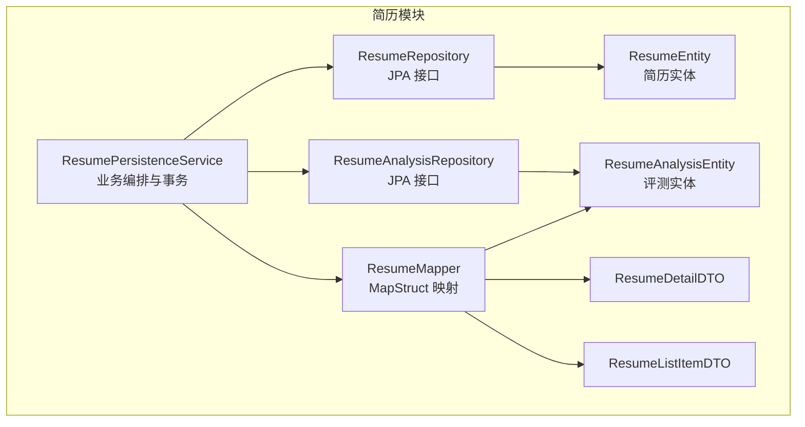
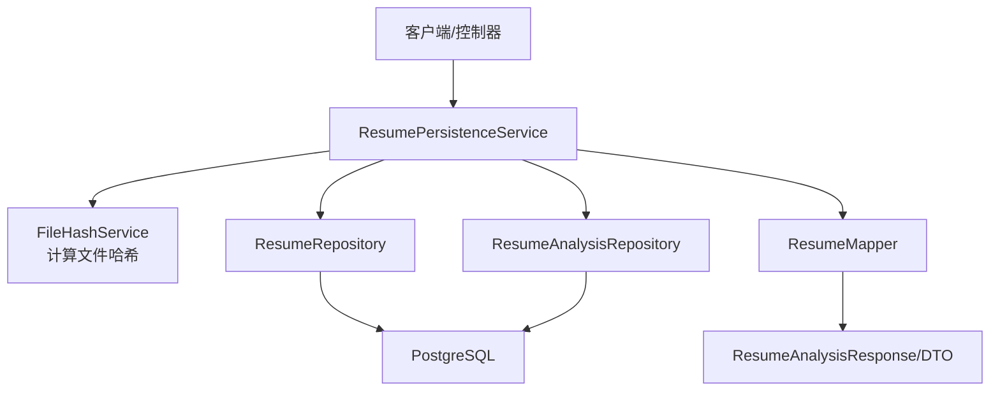
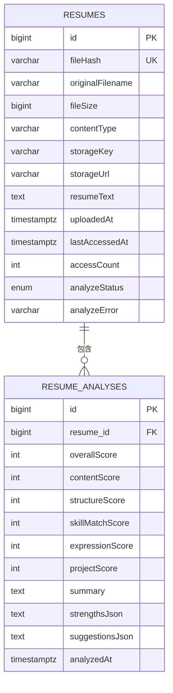
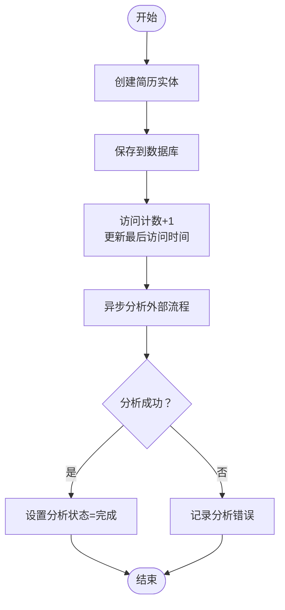
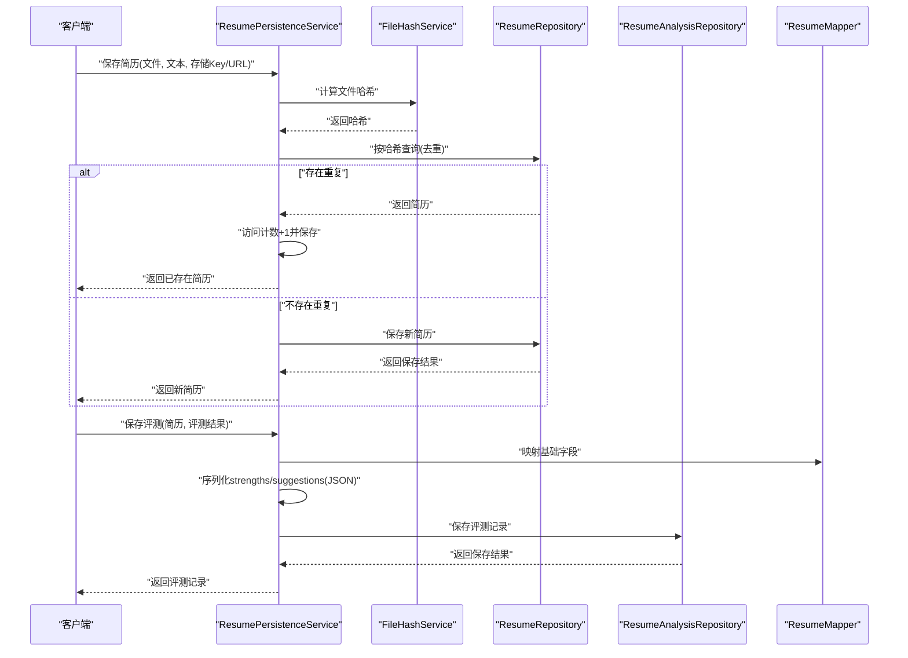
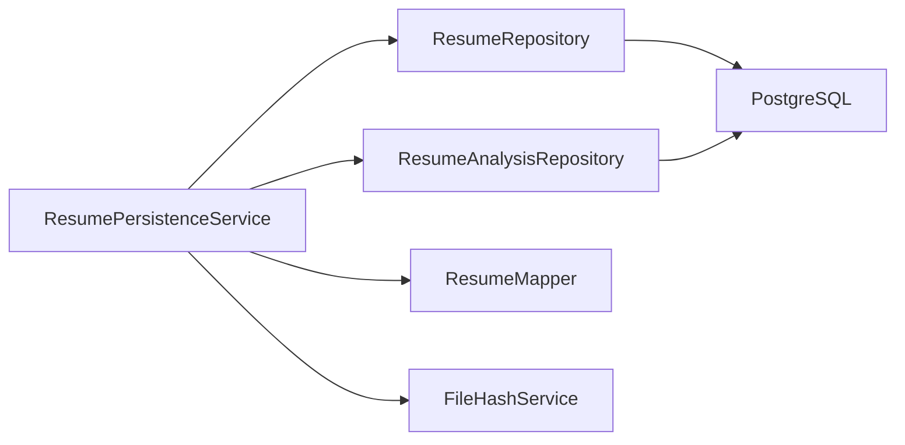

# 简历持久化服务

<cite>
**本文引用的文件**
- [ResumePersistenceService.java](file://app/src/main/java/interview/guide/modules/resume/service/ResumePersistenceService.java)
- [ResumeRepository.java](file://app/src/main/java/interview/guide/modules/resume/repository/ResumeRepository.java)
- [ResumeAnalysisRepository.java](file://app/src/main/java/interview/guide/modules/resume/repository/ResumeAnalysisRepository.java)
- [ResumeEntity.java](file://app/src/main/java/interview/guide/modules/resume/model/ResumeEntity.java)
- [ResumeAnalysisEntity.java](file://app/src/main/java/interview/guide/modules/resume/model/ResumeAnalysisEntity.java)
- [ResumeMapper.java](file://app/src/main/java/interview/guide/infrastructure/mapper/ResumeMapper.java)
- [ResumeDetailDTO.java](file://app/src/main/java/interview/guide/modules/resume/model/ResumeDetailDTO.java)
- [ResumeListItemDTO.java](file://app/src/main/java/interview/guide/modules/resume/model/ResumeListItemDTO.java)
- [ErrorCode.java](file://app/src/main/java/interview/guide/common/exception/ErrorCode.java)
- [application.yml](file://app/src/main/resources/application.yml)
- [init.sql](file://docker/postgres/init.sql)
</cite>

## 目录
1. [简介](#简介)
2. [项目结构](#项目结构)
3. [核心组件](#核心组件)
4. [架构总览](#架构总览)
5. [详细组件分析](#详细组件分析)
6. [依赖关系分析](#依赖关系分析)
7. [性能考量](#性能考量)
8. [故障排查指南](#故障排查指南)
9. [结论](#结论)
10. [附录](#附录)

## 简介
本文件面向简历持久化服务，系统性阐述 ResumePersistenceService 的数据存储策略、数据库设计、实体关系、索引优化、生命周期管理（创建、更新、删除）、与 ResumeRepository/ResumeAnalysisRepository 的协作关系、数据一致性与事务处理、查询优化、以及运维层面的数据迁移、备份恢复与性能监控建议。目标是帮助开发者与运维人员全面理解并高效维护该子系统。

## 项目结构
简历相关模块位于应用工程的模块化目录中，采用按功能域划分的层次化组织方式：
- service 层：负责业务编排与事务控制，如 ResumePersistenceService
- repository 层：基于 Spring Data JPA 的数据访问接口，如 ResumeRepository、ResumeAnalysisRepository
- model 层：JPA 实体与 DTO，如 ResumeEntity、ResumeAnalysisEntity、ResumeDetailDTO、ResumeListItemDTO
- mapper 层：使用 MapStruct 的对象映射接口，如 ResumeMapper
- 配置与基础设施：数据库连接、JPA/Hibernate 参数、Redisson、AI 服务等在 application.yml 中集中配置

图表来源
- [ResumePersistenceService.java:1-208](file://app/src/main/java/interview/guide/modules/resume/service/ResumePersistenceService.java#L1-L208)
- [ResumeRepository.java:1-25](file://app/src/main/java/interview/guide/modules/resume/repository/ResumeRepository.java#L1-L25)
- [ResumeAnalysisRepository.java:1-31](file://app/src/main/java/interview/guide/modules/resume/repository/ResumeAnalysisRepository.java#L1-L31)
- [ResumeMapper.java:1-145](file://app/src/main/java/interview/guide/infrastructure/mapper/ResumeMapper.java#L1-L145)
- [ResumeEntity.java:1-184](file://app/src/main/java/interview/guide/modules/resume/model/ResumeEntity.java#L1-L184)
- [ResumeAnalysisEntity.java:1-152](file://app/src/main/java/interview/guide/modules/resume/model/ResumeAnalysisEntity.java#L1-L152)
- [ResumeDetailDTO.java:1-43](file://app/src/main/java/interview/guide/modules/resume/model/ResumeDetailDTO.java#L1-L43)
- [ResumeListItemDTO.java:1-23](file://app/src/main/java/interview/guide/modules/resume/model/ResumeListItemDTO.java#L1-L23)

章节来源
- [ResumePersistenceService.java:1-208](file://app/src/main/java/interview/guide/modules/resume/service/ResumePersistenceService.java#L1-L208)
- [application.yml:1-281](file://app/src/main/resources/application.yml#L1-L281)

## 核心组件
- ResumePersistenceService：简历与评测结果的持久化主入口，提供去重、保存、查询、删除等能力，并通过事务保障一致性。
- ResumeRepository/ResumeAnalysisRepository：简历与评测记录的数据访问接口，提供按文件哈希去重、按简历查询、按时间排序等方法。
- ResumeEntity/ResumeAnalysisEntity：JPA 实体，定义表结构、索引、字段约束与生命周期回调。
- ResumeMapper：MapStruct 映射器，负责实体与 DTO 的字段映射，JSON 字段由服务层处理。
- ResumeDetailDTO/ResumeListItemDTO：对外展示的轻量数据传输对象。

章节来源
- [ResumePersistenceService.java:1-208](file://app/src/main/java/interview/guide/modules/resume/service/ResumePersistenceService.java#L1-L208)
- [ResumeRepository.java:1-25](file://app/src/main/java/interview/guide/modules/resume/repository/ResumeRepository.java#L1-L25)
- [ResumeAnalysisRepository.java:1-31](file://app/src/main/java/interview/guide/modules/resume/repository/ResumeAnalysisRepository.java#L1-L31)
- [ResumeEntity.java:1-184](file://app/src/main/java/interview/guide/modules/resume/model/ResumeEntity.java#L1-L184)
- [ResumeAnalysisEntity.java:1-152](file://app/src/main/java/interview/guide/modules/resume/model/ResumeAnalysisEntity.java#L1-L152)
- [ResumeMapper.java:1-145](file://app/src/main/java/interview/guide/infrastructure/mapper/ResumeMapper.java#L1-L145)
- [ResumeDetailDTO.java:1-43](file://app/src/main/java/interview/guide/modules/resume/model/ResumeDetailDTO.java#L1-L43)
- [ResumeListItemDTO.java:1-23](file://app/src/main/java/interview/guide/modules/resume/model/ResumeListItemDTO.java#L1-L23)

## 架构总览
简历持久化服务围绕“实体-仓库-服务-映射”的分层架构展开，结合事务、索引与查询优化，实现高可用与高性能。

图表来源
- [ResumePersistenceService.java:1-208](file://app/src/main/java/interview/guide/modules/resume/service/ResumePersistenceService.java#L1-L208)
- [ResumeRepository.java:1-25](file://app/src/main/java/interview/guide/modules/resume/repository/ResumeRepository.java#L1-L25)
- [ResumeAnalysisRepository.java:1-31](file://app/src/main/java/interview/guide/modules/resume/repository/ResumeAnalysisRepository.java#L1-L31)
- [ResumeMapper.java:1-145](file://app/src/main/java/interview/guide/infrastructure/mapper/ResumeMapper.java#L1-L145)

## 详细组件分析

### 数据库设计与实体关系
- 简历表（resumes）
  - 主键：自增 ID
  - 唯一索引：fileHash（用于去重）
  - 字段：原始文件名、大小、类型、存储 Key/URL、解析文本、上传时间、最后访问时间、访问次数、分析状态、错误信息等
  - 生命周期：PrePersist 设置上传与访问时间为当前时间，访问计数初始化为 1
- 评测表（resume_analyses）
  - 主键：自增 ID
  - 外键：resume_id 指向 resumes
  - 字段：总分与各维度分数、摘要、优点与建议（JSON 文本）、评测时间
  - 生命周期：PrePersist 设置评测时间为当前时间

图表来源
- [ResumeEntity.java:12-184](file://app/src/main/java/interview/guide/modules/resume/model/ResumeEntity.java#L12-L184)
- [ResumeAnalysisEntity.java:11-152](file://app/src/main/java/interview/guide/modules/resume/model/ResumeAnalysisEntity.java#L11-L152)

章节来源
- [ResumeEntity.java:12-184](file://app/src/main/java/interview/guide/modules/resume/model/ResumeEntity.java#L12-L184)
- [ResumeAnalysisEntity.java:11-152](file://app/src/main/java/interview/guide/modules/resume/model/ResumeAnalysisEntity.java#L11-L152)

### 索引与查询优化
- 索引策略
  - 简历表对 fileHash 建有唯一索引，用于去重与快速查找
- 查询路径
  - 去重：findByFileHash
  - 列表：findAll（可扩展分页）
  - 评测：按简历 ID 排序查询（orderBy analyzedAt desc）
  - 最新评测：findFirstByResumeIdOrderByAnalyzedAtDesc
- 事务与一致性
  - 保存与删除均在 @Transactional 中执行，保证多步骤原子性
  - 删除时先删除评测记录，再删除简历实体，避免外键约束导致的级联失败

章节来源
- [ResumeRepository.java:15-24](file://app/src/main/java/interview/guide/modules/resume/repository/ResumeRepository.java#L15-L24)
- [ResumeAnalysisRepository.java:16-30](file://app/src/main/java/interview/guide/modules/resume/repository/ResumeAnalysisRepository.java#L16-L30)
- [ResumePersistenceService.java:67-90](file://app/src/main/java/interview/guide/modules/resume/service/ResumePersistenceService.java#L67-L90)
- [ResumePersistenceService.java:187-206](file://app/src/main/java/interview/guide/modules/resume/service/ResumePersistenceService.java#L187-L206)

### 简历实体生命周期管理
- 创建
  - 保存简历实体，设置文件元信息、存储信息与解析文本
  - 初始化上传与访问时间、访问计数
- 更新
  - 访问计数递增与最后访问时间更新
  - 分析状态与错误信息用于前端轮询与展示
- 删除
  - 先删除所有评测记录，再删除简历实体，确保数据完整性

图表来源
- [ResumeEntity.java:67-72](file://app/src/main/java/interview/guide/modules/resume/model/ResumeEntity.java#L67-L72)
- [ResumeEntity.java:163-166](file://app/src/main/java/interview/guide/modules/resume/model/ResumeEntity.java#L163-L166)
- [ResumePersistenceService.java:95-115](file://app/src/main/java/interview/guide/modules/resume/service/ResumePersistenceService.java#L95-L115)

章节来源
- [ResumeEntity.java:67-72](file://app/src/main/java/interview/guide/modules/resume/model/ResumeEntity.java#L67-L72)
- [ResumeEntity.java:163-166](file://app/src/main/java/interview/guide/modules/resume/model/ResumeEntity.java#L163-L166)
- [ResumePersistenceService.java:95-115](file://app/src/main/java/interview/guide/modules/resume/service/ResumePersistenceService.java#L95-L115)

### 与 Repository 的协作关系
- ResumePersistenceService 通过 ResumeRepository 完成简历的去重、保存、查询与删除
- 通过 ResumeAnalysisRepository 完成评测记录的保存、查询与删除
- 两者均基于 Spring Data JPA 的约定式方法命名，实现按简历 ID 的排序查询与去重校验

章节来源
- [ResumePersistenceService.java:45-62](file://app/src/main/java/interview/guide/modules/resume/service/ResumePersistenceService.java#L45-L62)
- [ResumePersistenceService.java:120-143](file://app/src/main/java/interview/guide/modules/resume/service/ResumePersistenceService.java#L120-L143)
- [ResumeRepository.java:15-24](file://app/src/main/java/interview/guide/modules/resume/repository/ResumeRepository.java#L15-L24)
- [ResumeAnalysisRepository.java:16-30](file://app/src/main/java/interview/guide/modules/resume/repository/ResumeAnalysisRepository.java#L16-L30)

### 与 Mapper 的协作关系
- ResumeMapper 负责实体与 DTO 的字段映射，包括评分明细、列表项与详情 DTO
- JSON 字段（strengthsJson、suggestionsJson）由服务层使用 ObjectMapper 序列化/反序列化，Mapper 不直接处理 JSON
- 服务层在保存评测时手动写入 JSON 字段，在读取时反序列化为 DTO

章节来源
- [ResumeMapper.java:18-145](file://app/src/main/java/interview/guide/infrastructure/mapper/ResumeMapper.java#L18-L145)
- [ResumePersistenceService.java:96-115](file://app/src/main/java/interview/guide/modules/resume/service/ResumePersistenceService.java#L96-L115)
- [ResumePersistenceService.java:148-174](file://app/src/main/java/interview/guide/modules/resume/service/ResumePersistenceService.java#L148-L174)

### 数据一致性与事务处理
- 事务边界
  - 保存简历：@Transactional 保护保存过程
  - 保存评测：@Transactional 保护映射与保存过程
  - 删除简历：@Transactional 保护删除评测与简历实体
- 异常处理
  - 保存/反序列化失败统一抛出业务异常，错误码来自 ErrorCode 枚举
- 并发与锁
  - 去重基于文件哈希，避免重复入库
  - 访问计数更新在单条记录上进行，避免竞争条件

章节来源
- [ResumePersistenceService.java:67-90](file://app/src/main/java/interview/guide/modules/resume/service/ResumePersistenceService.java#L67-L90)
- [ResumePersistenceService.java:95-115](file://app/src/main/java/interview/guide/modules/resume/service/ResumePersistenceService.java#L95-L115)
- [ResumePersistenceService.java:187-206](file://app/src/main/java/interview/guide/modules/resume/service/ResumePersistenceService.java#L187-L206)
- [ErrorCode.java:22-31](file://app/src/main/java/interview/guide/common/exception/ErrorCode.java#L22-L31)

### 查询流程与序列图
以下序列图展示了“保存简历并保存评测”的关键调用链路。

图表来源
- [ResumePersistenceService.java:45-62](file://app/src/main/java/interview/guide/modules/resume/service/ResumePersistenceService.java#L45-L62)
- [ResumePersistenceService.java:67-90](file://app/src/main/java/interview/guide/modules/resume/service/ResumePersistenceService.java#L67-L90)
- [ResumePersistenceService.java:95-115](file://app/src/main/java/interview/guide/modules/resume/service/ResumePersistenceService.java#L95-L115)
- [ResumeMapper.java:105-121](file://app/src/main/java/interview/guide/infrastructure/mapper/ResumeMapper.java#L105-L121)

## 依赖关系分析
- 组件耦合
  - ResumePersistenceService 依赖 Repository、Mapper、FileHashService、ResumeMapper、ObjectMapper
  - Repository 依赖 JPA/Hibernate 与数据库
  - Mapper 依赖 MapStruct 注解处理器
- 外部依赖
  - PostgreSQL（含向量扩展）
  - HikariCP 连接池
  - Redisson（缓存/分布式锁等，非简历持久化直接依赖）

图表来源
- [ResumePersistenceService.java:33-37](file://app/src/main/java/interview/guide/modules/resume/service/ResumePersistenceService.java#L33-L37)
- [ResumeRepository.java:1-25](file://app/src/main/java/interview/guide/modules/resume/repository/ResumeRepository.java#L1-L25)
- [ResumeAnalysisRepository.java:1-31](file://app/src/main/java/interview/guide/modules/resume/repository/ResumeAnalysisRepository.java#L1-L31)

章节来源
- [application.yml:48-78](file://app/src/main/resources/application.yml#L48-L78)
- [init.sql:1-2](file://docker/postgres/init.sql#L1-L2)

## 性能考量
- 连接池与方言
  - HikariCP 连接池参数针对虚拟线程场景优化，最大池大小、空闲超时、最大生命周期合理配置
  - PostgreSQL 方言与 SQL 格式化开启，便于调试与性能分析
- 批量与排序
  - JDBC 批量大小、插入/更新顺序优化，减少网络往返与锁竞争
- 查询优化
  - 使用唯一索引 fileHash 进行去重
  - 对简历 ID 的评测查询按 analyzedAt 降序，避免全表扫描
- 缓存与热点
  - 访问计数与最后访问时间更新为单记录写入，避免热点竞争
- I/O 与存储
  - 简历文本与 JSON 字段采用 TEXT 类型，避免超长字段引发的性能问题

章节来源
- [application.yml:54-78](file://app/src/main/resources/application.yml#L54-L78)
- [ResumeEntity.java:13-15](file://app/src/main/java/interview/guide/modules/resume/model/ResumeEntity.java#L13-L15)
- [ResumeAnalysisRepository.java:24-29](file://app/src/main/java/interview/guide/modules/resume/repository/ResumeAnalysisRepository.java#L24-L29)

## 故障排查指南
- 常见错误与定位
  - 保存失败：检查文件哈希计算、存储 Key/URL、ObjectMapper 序列化
  - 反序列化失败：检查 strengthsJson/suggestionsJson 的格式与编码
  - 重复简历：确认 fileHash 唯一索引是否生效
  - 删除异常：确认评测记录是否已清理
- 错误码参考
  - 简历相关错误码集中在 2xxx 区间，如上传失败、分析失败、不存在等
- 日志与告警
  - 服务层记录关键操作日志，便于追踪事务边界与异常点

章节来源
- [ResumePersistenceService.java:58-61](file://app/src/main/java/interview/guide/modules/resume/service/ResumePersistenceService.java#L58-L61)
- [ResumePersistenceService.java:86-89](file://app/src/main/java/interview/guide/modules/resume/service/ResumePersistenceService.java#L86-L89)
- [ResumePersistenceService.java:111-114](file://app/src/main/java/interview/guide/modules/resume/service/ResumePersistenceService.java#L111-L114)
- [ResumePersistenceService.java:170-173](file://app/src/main/java/interview/guide/modules/resume/service/ResumePersistenceService.java#L170-L173)
- [ErrorCode.java:22-31](file://app/src/main/java/interview/guide/common/exception/ErrorCode.java#L22-L31)

## 结论
ResumePersistenceService 通过明确的事务边界、合理的索引与查询策略、清晰的实体关系与映射分工，实现了简历与评测结果的可靠持久化。配合 JPA/Hibernate 的批量与排序优化、PostgreSQL 的向量扩展与 HikariCP 的连接池配置，能够在高并发与大数据量场景下保持稳定性能。建议在生产环境中进一步完善监控与告警体系，并持续评估索引与查询计划的合理性。

## 附录
- 数据库初始化
  - PostgreSQL 初始化脚本启用向量扩展，便于后续向量化检索能力
- 配置要点
  - JPA/Hibernate 批量与排序优化参数
  - PostgreSQL 向量存储参数（开发/生产环境差异）
  - 连接池参数与虚拟线程适配

章节来源
- [init.sql:1-2](file://docker/postgres/init.sql#L1-L2)
- [application.yml:115-123](file://app/src/main/resources/application.yml#L115-L123)
- [application.yml:63-78](file://app/src/main/resources/application.yml#L63-L78)