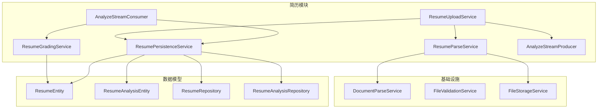
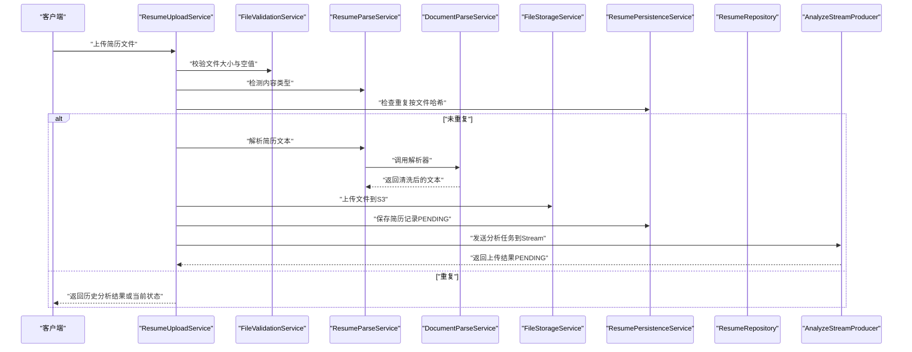
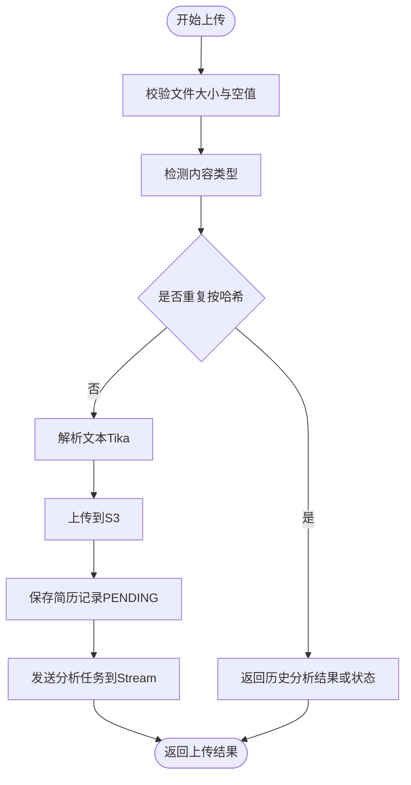
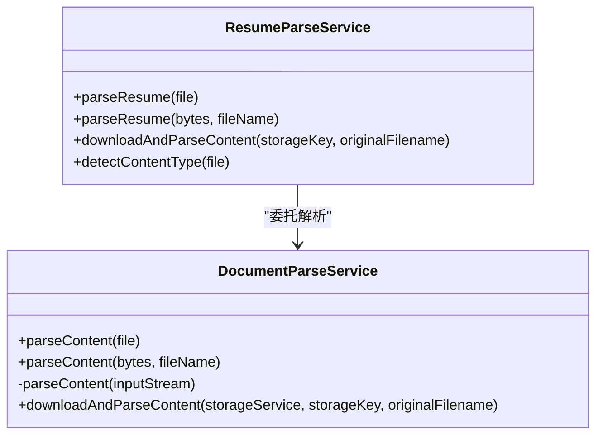
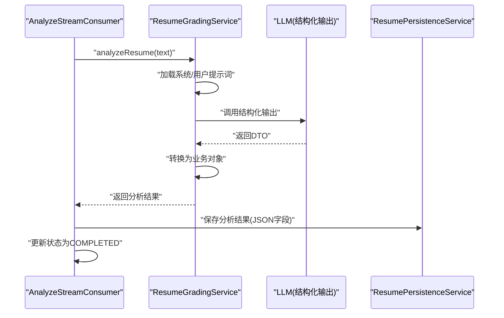
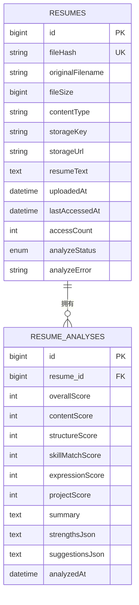
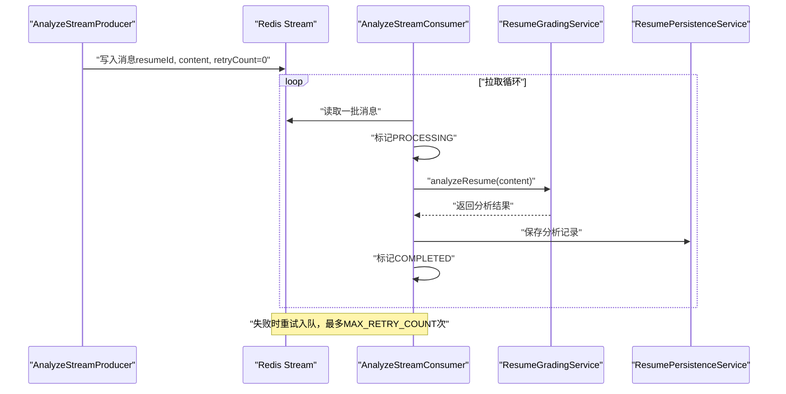
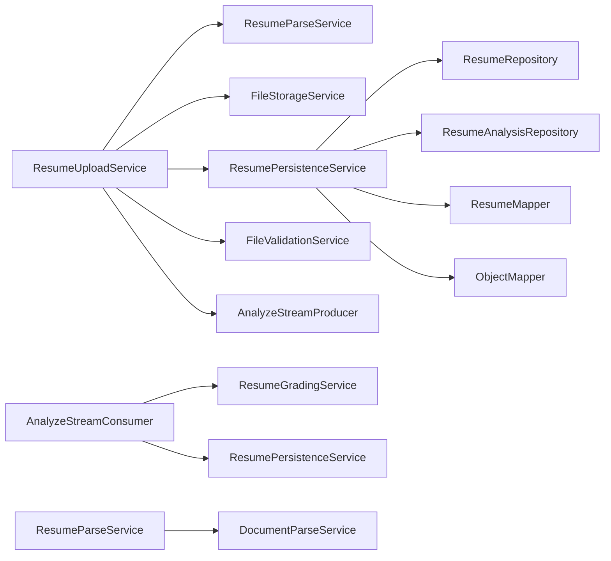

# 简历管理服务

<cite>
**本文引用的文件**
- [ResumeUploadService.java](file://app/src/main/java/interview/guide/modules/resume/service/ResumeUploadService.java)
- [ResumeParseService.java](file://app/src/main/java/interview/guide/modules/resume/service/ResumeParseService.java)
- [ResumeGradingService.java](file://app/src/main/java/interview/guide/modules/resume/service/ResumeGradingService.java)
- [ResumePersistenceService.java](file://app/src/main/java/interview/guide/modules/resume/service/ResumePersistenceService.java)
- [ResumeEntity.java](file://app/src/main/java/interview/guide/modules/resume/model/ResumeEntity.java)
- [ResumeAnalysisEntity.java](file://app/src/main/java/interview/guide/modules/resume/model/ResumeAnalysisEntity.java)
- [ResumeRepository.java](file://app/src/main/java/interview/guide/modules/resume/repository/ResumeRepository.java)
- [ResumeAnalysisRepository.java](file://app/src/main/java/interview/guide/modules/resume/repository/ResumeAnalysisRepository.java)
- [AnalyzeStreamConsumer.java](file://app/src/main/java/interview/guide/modules/resume/listener/AnalyzeStreamConsumer.java)
- [AnalyzeStreamProducer.java](file://app/src/main/java/interview/guide/modules/resume/listener/AnalyzeStreamProducer.java)
- [DocumentParseService.java](file://app/src/main/java/interview/guide/infrastructure/file/DocumentParseService.java)
- [FileValidationService.java](file://app/src/main/java/interview/guide/infrastructure/file/FileValidationService.java)
- [FileStorageService.java](file://app/src/main/java/interview/guide/infrastructure/file/FileStorageService.java)
- [AsyncTaskStreamConstants.java](file://app/src/main/java/interview/guide/common/constant/AsyncTaskStreamConstants.java)
- [interview-question-resume-system.st](file://app/src/main/resources/prompts/interview-question-resume-system.st)
</cite>

## 目录
1. [简介](#简介)
2. [项目结构](#项目结构)
3. [核心组件](#核心组件)
4. [架构总览](#架构总览)
5. [详细组件分析](#详细组件分析)
6. [依赖分析](#依赖分析)
7. [性能考量](#性能考量)
8. [故障排查指南](#故障排查指南)
9. [结论](#结论)
10. [附录](#附录)

## 简介
本文件面向“简历管理服务”的实现与使用，系统性阐述简历上传、解析、评分与持久化的完整流程。重点覆盖以下方面：
- ResumeUploadService 的文件处理机制：类型检测、内容提取、格式验证、去重与异步分析调度。
- ResumeParseService 的文档解析技术：对 PDF、Word、Excel 等格式的支持与优化策略。
- ResumeGradingService 的 AI 评分算法：提示词模板、结构化输出、评分维度与建议生成。
- ResumePersistenceService 的数据存储策略：数据库设计、索引优化、JSON 字段序列化与事务一致性。
- 异步分析流水线：Redis Stream 消费者与生产者、重试与状态管理。

## 项目结构
简历模块位于后端应用的模块化目录下，采用“领域驱动”风格划分：
- service 层：负责业务编排与跨域协作（上传、解析、评分、持久化、异步分析）。
- model/repository 层：定义实体与仓储接口，支撑数据持久化与查询。
- listener 层：封装 Redis Stream 的生产与消费逻辑。
- infrastructure/file 层：提供文件校验、解析、存储等基础设施能力。
- common/constant：定义异步任务流的通用常量。

**图表来源**
- [ResumeUploadService.java:29-201](file://app/src/main/java/interview/guide/modules/resume/service/ResumeUploadService.java#L29-L201)
- [ResumeParseService.java:18-66](file://app/src/main/java/interview/guide/modules/resume/service/ResumeParseService.java#L18-L66)
- [ResumeGradingService.java:28-177](file://app/src/main/java/interview/guide/modules/resume/service/ResumeGradingService.java#L28-L177)
- [ResumePersistenceService.java:31-208](file://app/src/main/java/interview/guide/modules/resume/service/ResumePersistenceService.java#L31-L208)
- [AnalyzeStreamProducer.java:19-82](file://app/src/main/java/interview/guide/modules/resume/listener/AnalyzeStreamProducer.java#L19-L82)
- [AnalyzeStreamConsumer.java:24-158](file://app/src/main/java/interview/guide/modules/resume/listener/AnalyzeStreamConsumer.java#L24-L158)
- [DocumentParseService.java:29-164](file://app/src/main/java/interview/guide/infrastructure/file/DocumentParseService.java#L29-L164)
- [FileValidationService.java:18-129](file://app/src/main/java/interview/guide/infrastructure/file/FileValidationService.java#L18-L129)
- [FileStorageService.java:30-280](file://app/src/main/java/interview/guide/infrastructure/file/FileStorageService.java#L30-L280)
- [ResumeEntity.java:12-184](file://app/src/main/java/interview/guide/modules/resume/model/ResumeEntity.java#L12-L184)
- [ResumeAnalysisEntity.java:11-152](file://app/src/main/java/interview/guide/modules/resume/model/ResumeAnalysisEntity.java#L11-L152)
- [ResumeRepository.java:12-25](file://app/src/main/java/interview/guide/modules/resume/repository/ResumeRepository.java#L12-L25)
- [ResumeAnalysisRepository.java:13-31](file://app/src/main/java/interview/guide/modules/resume/repository/ResumeAnalysisRepository.java#L13-L31)

**章节来源**
- [ResumeUploadService.java:29-201](file://app/src/main/java/interview/guide/modules/resume/service/ResumeUploadService.java#L29-L201)
- [ResumeParseService.java:18-66](file://app/src/main/java/interview/guide/modules/resume/service/ResumeParseService.java#L18-L66)
- [ResumeGradingService.java:28-177](file://app/src/main/java/interview/guide/modules/resume/service/ResumeGradingService.java#L28-L177)
- [ResumePersistenceService.java:31-208](file://app/src/main/java/interview/guide/modules/resume/service/ResumePersistenceService.java#L31-L208)
- [AnalyzeStreamProducer.java:19-82](file://app/src/main/java/interview/guide/modules/resume/listener/AnalyzeStreamProducer.java#L19-L82)
- [AnalyzeStreamConsumer.java:24-158](file://app/src/main/java/interview/guide/modules/resume/listener/AnalyzeStreamConsumer.java#L24-L158)
- [DocumentParseService.java:29-164](file://app/src/main/java/interview/guide/infrastructure/file/DocumentParseService.java#L29-L164)
- [FileValidationService.java:18-129](file://app/src/main/java/interview/guide/infrastructure/file/FileValidationService.java#L18-L129)
- [FileStorageService.java:30-280](file://app/src/main/java/interview/guide/infrastructure/file/FileStorageService.java#L30-L280)
- [ResumeEntity.java:12-184](file://app/src/main/java/interview/guide/modules/resume/model/ResumeEntity.java#L12-L184)
- [ResumeAnalysisEntity.java:11-152](file://app/src/main/java/interview/guide/modules/resume/model/ResumeAnalysisEntity.java#L11-L152)
- [ResumeRepository.java:12-25](file://app/src/main/java/interview/guide/modules/resume/repository/ResumeRepository.java#L12-L25)
- [ResumeAnalysisRepository.java:13-31](file://app/src/main/java/interview/guide/modules/resume/repository/ResumeAnalysisRepository.java#L13-L31)

## 核心组件
- ResumeUploadService：负责文件校验、类型检测、去重判断、文本解析、存储与入库，并将分析任务投递至 Redis Stream。
- ResumeParseService：封装文档解析与类型检测，委托 DocumentParseService 完成多格式文本抽取。
- ResumeGradingService：基于 Spring AI 的结构化输出，调用 LLM 对简历进行评分与建议生成。
- ResumePersistenceService：简历与分析结果的持久化、去重、查询与删除。
- AnalyzeStreamProducer/Consumer：异步分析流水线的生产与消费，配合状态更新与重试控制。
- DocumentParseService：基于 Apache Tika 的多格式解析，支持 PDF、Word、TXT、MD 等；内置清理与长度限制。
- FileValidationService：通用文件校验，支持大小、类型与扩展名检查。
- FileStorageService：基于 S3 的文件上传、下载、删除与存在性检查，提供安全文件名清洗与目录组织。

**章节来源**
- [ResumeUploadService.java:29-201](file://app/src/main/java/interview/guide/modules/resume/service/ResumeUploadService.java#L29-L201)
- [ResumeParseService.java:18-66](file://app/src/main/java/interview/guide/modules/resume/service/ResumeParseService.java#L18-L66)
- [ResumeGradingService.java:28-177](file://app/src/main/java/interview/guide/modules/resume/service/ResumeGradingService.java#L28-L177)
- [ResumePersistenceService.java:31-208](file://app/src/main/java/interview/guide/modules/resume/service/ResumePersistenceService.java#L31-L208)
- [AnalyzeStreamProducer.java:19-82](file://app/src/main/java/interview/guide/modules/resume/listener/AnalyzeStreamProducer.java#L19-L82)
- [AnalyzeStreamConsumer.java:24-158](file://app/src/main/java/interview/guide/modules/resume/listener/AnalyzeStreamConsumer.java#L24-L158)
- [DocumentParseService.java:29-164](file://app/src/main/java/interview/guide/infrastructure/file/DocumentParseService.java#L29-L164)
- [FileValidationService.java:18-129](file://app/src/main/java/interview/guide/infrastructure/file/FileValidationService.java#L18-L129)
- [FileStorageService.java:30-280](file://app/src/main/java/interview/guide/infrastructure/file/FileStorageService.java#L30-L280)

## 架构总览
简历管理服务采用“同步上传 + 异步分析”的解耦架构：
- 上传阶段：校验文件、检测类型、去重、解析文本、存储文件、入库并标记状态为 PENDING。
- 异步分析阶段：通过 Redis Stream 推送分析任务，消费者拉取消息、调用 LLM 评分、持久化结果并更新状态。
- 数据持久化：简历与分析结果分别映射到两张表，分析结果以 JSON 字段存储列表类数据。

**图表来源**
- [ResumeUploadService.java:47-110](file://app/src/main/java/interview/guide/modules/resume/service/ResumeUploadService.java#L47-L110)
- [FileValidationService.java:27-36](file://app/src/main/java/interview/guide/infrastructure/file/FileValidationService.java#L27-L36)
- [ResumeParseService.java:30-33](file://app/src/main/java/interview/guide/modules/resume/service/ResumeParseService.java#L30-L33)
- [DocumentParseService.java:45-64](file://app/src/main/java/interview/guide/infrastructure/file/DocumentParseService.java#L45-L64)
- [FileStorageService.java:89-111](file://app/src/main/java/interview/guide/infrastructure/file/FileStorageService.java#L89-L111)
- [ResumePersistenceService.java:67-90](file://app/src/main/java/interview/guide/modules/resume/service/ResumePersistenceService.java#L67-L90)
- [AnalyzeStreamProducer.java:36-38](file://app/src/main/java/interview/guide/modules/resume/listener/AnalyzeStreamProducer.java#L36-L38)

## 详细组件分析

### 组件一：文件处理与上传（ResumeUploadService）
职责与流程：
- 文件校验：大小限制、空文件检查。
- 类型检测：委托 ResumeParseService 使用 ContentTypeDetectionService 进行 MIME 类型判定。
- 去重策略：基于文件内容 SHA-256 哈希，命中则复用历史分析结果。
- 文本解析：调用 ResumeParseService.parseResume，内部委托 DocumentParseService。
- 存储与URL：通过 FileStorageService 上传并生成访问URL。
- 入库与状态：保存简历记录，初始状态为 PENDING。
- 异步分析：通过 AnalyzeStreamProducer 发送任务到 Redis Stream。

关键点：
- 重复检测使用唯一索引列 fileHash，避免重复存储与重复分析。
- 解析失败时抛出业务异常，提示“请确保文件不是扫描版PDF”，便于前端引导。
- 重试分析：支持手动触发 reanalyze，若本地无缓存文本则从存储下载并解析。

**图表来源**
- [ResumeUploadService.java:47-110](file://app/src/main/java/interview/guide/modules/resume/service/ResumeUploadService.java#L47-L110)
- [ResumePersistenceService.java:45-62](file://app/src/main/java/interview/guide/modules/resume/service/ResumePersistenceService.java#L45-L62)
- [ResumeParseService.java:30-33](file://app/src/main/java/interview/guide/modules/resume/service/ResumeParseService.java#L30-L33)
- [DocumentParseService.java:45-64](file://app/src/main/java/interview/guide/infrastructure/file/DocumentParseService.java#L45-L64)
- [FileStorageService.java:89-111](file://app/src/main/java/interview/guide/infrastructure/file/FileStorageService.java#L89-L111)

**章节来源**
- [ResumeUploadService.java:47-110](file://app/src/main/java/interview/guide/modules/resume/service/ResumeUploadService.java#L47-L110)
- [ResumePersistenceService.java:45-62](file://app/src/main/java/interview/guide/modules/resume/service/ResumePersistenceService.java#L45-L62)
- [ResumeParseService.java:30-33](file://app/src/main/java/interview/guide/modules/resume/service/ResumeParseService.java#L30-L33)
- [DocumentParseService.java:45-64](file://app/src/main/java/interview/guide/infrastructure/file/DocumentParseService.java#L45-L64)
- [FileStorageService.java:89-111](file://app/src/main/java/interview/guide/infrastructure/file/FileStorageService.java#L89-L111)

### 组件二：文档解析技术（ResumeParseService 与 DocumentParseService）
支持格式与特性：
- 多格式支持：PDF、DOC/DOCX、TXT、MD 等，由 Apache Tika 自动检测解析器。
- 正文提取：使用 BodyContentHandler 仅提取正文，限制最大文本长度，避免内存溢出。
- PDF 专项配置：关闭内联图片提取、启用按坐标排序，提升多栏布局的文本顺序质量。
- 嵌入资源禁用：通过 NoOpEmbeddedDocumentExtractor 避免解析图片与附件导致的路径泄漏。
- 文本清洗：解析后交由 TextCleaningService 去噪，提升后续评分质量。
- 字节数组解析：支持从字节数组直接解析，便于从存储下载后处理。
- 下载并解析：结合 FileStorageService，支持从远端存储下载后解析。

**图表来源**
- [ResumeParseService.java:18-66](file://app/src/main/java/interview/guide/modules/resume/service/ResumeParseService.java#L18-L66)
- [DocumentParseService.java:29-164](file://app/src/main/java/interview/guide/infrastructure/file/DocumentParseService.java#L29-L164)

**章节来源**
- [ResumeParseService.java:30-57](file://app/src/main/java/interview/guide/modules/resume/service/ResumeParseService.java#L30-L57)
- [DocumentParseService.java:108-139](file://app/src/main/java/interview/guide/infrastructure/file/DocumentParseService.java#L108-L139)

### 组件三：AI 评分算法（ResumeGradingService）
评分维度与流程：
- 提示词模板：系统提示词与用户提示词分别加载，系统提示词附加结构化输出约束。
- 结构化输出：通过 BeanOutputConverter 与 StructuredOutputInvoker 确保 LLM 输出符合 DTO 结构。
- 评分维度：总分与五项子评分（内容、结构、技能匹配、表达、项目经验），均在 0-100 或对应范围。
- 建议生成：输出建议类别、优先级、问题描述与改进建议。
- 错误兜底：当 LLM 调用失败时，返回固定错误响应，保证前端体验稳定。

**图表来源**
- [AnalyzeStreamConsumer.java:91-105](file://app/src/main/java/interview/guide/modules/resume/listener/AnalyzeStreamConsumer.java#L91-L105)
- [ResumeGradingService.java:86-130](file://app/src/main/java/interview/guide/modules/resume/service/ResumeGradingService.java#L86-L130)
- [ResumePersistenceService.java:95-115](file://app/src/main/java/interview/guide/modules/resume/service/ResumePersistenceService.java#L95-L115)

**章节来源**
- [ResumeGradingService.java:86-130](file://app/src/main/java/interview/guide/modules/resume/service/ResumeGradingService.java#L86-L130)
- [AnalyzeStreamConsumer.java:91-105](file://app/src/main/java/interview/guide/modules/resume/listener/AnalyzeStreamConsumer.java#L91-L105)
- [ResumePersistenceService.java:95-115](file://app/src/main/java/interview/guide/modules/resume/service/ResumePersistenceService.java#L95-L115)

### 组件四：数据持久化策略（ResumePersistenceService 与实体模型）
数据库设计要点：
- 简历表（resumes）：唯一索引 fileHash 用于去重；字段包含原始文件名、大小、类型、存储键与URL、解析文本、分析状态与错误信息等。
- 分析表（resume_analyses）：JSON 字段 strengthsJson 与 suggestionsJson 存储列表数据；各维度分数独立列；带分析时间戳。
- 事务与一致性：保存简历与分析结果均在事务中执行，失败回滚。
- 查询优化：通过 MapStruct 映射基础字段，JSON 字段使用 Jackson 序列化/反序列化；提供最新分析查询与历史记录查询。

**图表来源**
- [ResumeEntity.java:12-184](file://app/src/main/java/interview/guide/modules/resume/model/ResumeEntity.java#L12-L184)
- [ResumeAnalysisEntity.java:11-152](file://app/src/main/java/interview/guide/modules/resume/model/ResumeAnalysisEntity.java#L11-L152)
- [ResumeRepository.java:12-25](file://app/src/main/java/interview/guide/modules/resume/repository/ResumeRepository.java#L12-L25)
- [ResumeAnalysisRepository.java:13-31](file://app/src/main/java/interview/guide/modules/resume/repository/ResumeAnalysisRepository.java#L13-L31)

**章节来源**
- [ResumePersistenceService.java:67-115](file://app/src/main/java/interview/guide/modules/resume/service/ResumePersistenceService.java#L67-L115)
- [ResumeEntity.java:12-184](file://app/src/main/java/interview/guide/modules/resume/model/ResumeEntity.java#L12-L184)
- [ResumeAnalysisEntity.java:11-152](file://app/src/main/java/interview/guide/modules/resume/model/ResumeAnalysisEntity.java#L11-L152)
- [ResumeRepository.java:12-25](file://app/src/main/java/interview/guide/modules/resume/repository/ResumeRepository.java#L12-L25)
- [ResumeAnalysisRepository.java:13-31](file://app/src/main/java/interview/guide/modules/resume/repository/ResumeAnalysisRepository.java#L13-L31)

### 组件五：异步分析流水线（AnalyzeStreamProducer/Consumer）
- 生产者：将简历ID与文本封装为消息，写入 Redis Stream；失败时更新状态为 FAILED。
- 消费者：从 Stream 拉取消息，更新状态为 PROCESSING，调用评分服务，保存分析结果，最终标记为 COMPLETED；支持最多三次重试。
- 常量配置：统一的 Stream Key、消费者组名、字段名、最大长度与轮询间隔等。

**图表来源**
- [AnalyzeStreamProducer.java:36-80](file://app/src/main/java/interview/guide/modules/resume/listener/AnalyzeStreamProducer.java#L36-L80)
- [AnalyzeStreamConsumer.java:91-139](file://app/src/main/java/interview/guide/modules/resume/listener/AnalyzeStreamConsumer.java#L91-L139)
- [AsyncTaskStreamConstants.java:74-89](file://app/src/main/java/interview/guide/common/constant/AsyncTaskStreamConstants.java#L74-L89)

**章节来源**
- [AnalyzeStreamProducer.java:36-80](file://app/src/main/java/interview/guide/modules/resume/listener/AnalyzeStreamProducer.java#L36-L80)
- [AnalyzeStreamConsumer.java:91-139](file://app/src/main/java/interview/guide/modules/resume/listener/AnalyzeStreamConsumer.java#L91-L139)
- [AsyncTaskStreamConstants.java:74-89](file://app/src/main/java/interview/guide/common/constant/AsyncTaskStreamConstants.java#L74-L89)

### 组件六：文件验证与存储（FileValidationService 与 FileStorageService）
- 文件验证：支持大小上限、MIME 类型白名单、扩展名辅助校验；提供 Markdown 扩展名识别与知识库格式判断。
- 文件存储：S3 客户端封装，支持上传、下载、删除、存在性检查与桶存在性保障；文件名清洗与日期路径组织，避免非法字符与冲突。

**章节来源**
- [FileValidationService.java:27-93](file://app/src/main/java/interview/guide/infrastructure/file/FileValidationService.java#L27-L93)
- [FileStorageService.java:89-111](file://app/src/main/java/interview/guide/infrastructure/file/FileStorageService.java#L89-L111)
- [FileStorageService.java:177-179](file://app/src/main/java/interview/guide/infrastructure/file/FileStorageService.java#L177-L179)

## 依赖分析
- 低耦合高内聚：服务层通过接口与基础设施解耦，解析与存储能力可复用。
- 关键依赖链：
  - ResumeUploadService 依赖 ResumeParseService、FileStorageService、ResumePersistenceService、FileValidationService、AnalyzeStreamProducer、ResumeRepository。
  - ResumeParseService 依赖 DocumentParseService、ContentTypeDetectionService、FileStorageService。
  - ResumeGradingService 依赖 ChatClient、PromptTemplate、BeanOutputConverter、StructuredOutputInvoker。
  - ResumePersistenceService 依赖 ResumeRepository、ResumeAnalysisRepository、ResumeMapper、ObjectMapper、FileHashService。
  - AnalyzeStreamConsumer/Producer 依赖 RedisService、ResumeRepository、AsyncTaskStreamConstants。

**图表来源**
- [ResumeUploadService.java:31-37](file://app/src/main/java/interview/guide/modules/resume/service/ResumeUploadService.java#L31-L37)
- [ResumeParseService.java:20-22](file://app/src/main/java/interview/guide/modules/resume/service/ResumeParseService.java#L20-L22)
- [AnalyzeStreamConsumer.java:26-39](file://app/src/main/java/interview/guide/modules/resume/listener/AnalyzeStreamConsumer.java#L26-L39)
- [ResumePersistenceService.java:33-37](file://app/src/main/java/interview/guide/modules/resume/service/ResumePersistenceService.java#L33-L37)

**章节来源**
- [ResumeUploadService.java:31-37](file://app/src/main/java/interview/guide/modules/resume/service/ResumeUploadService.java#L31-L37)
- [ResumeParseService.java:20-22](file://app/src/main/java/interview/guide/modules/resume/service/ResumeParseService.java#L20-L22)
- [AnalyzeStreamConsumer.java:26-39](file://app/src/main/java/interview/guide/modules/resume/listener/AnalyzeStreamConsumer.java#L26-L39)
- [ResumePersistenceService.java:33-37](file://app/src/main/java/interview/guide/modules/resume/service/ResumePersistenceService.java#L33-L37)

## 性能考量
- 解析性能：Tika 解析默认限制最大文本长度，避免超大文件导致内存压力；PDF 使用排序与禁用内联图片提取，提升稳定性。
- 存储性能：S3 上传使用 InputStream 直传，减少中间缓冲；文件名清洗与日期路径组织降低键冲突概率。
- 异步吞吐：Redis Stream 批量拉取与最大长度裁剪，配合重试机制与轮询间隔，平衡延迟与吞吐。
- 数据库性能：简历表对 fileHash 建唯一索引，加速去重；分析表按简历ID排序查询，满足“最新分析”与“历史记录”场景。
- 事务边界：保存与更新状态在事务中执行，保证一致性。

[本节为通用性能建议，无需特定文件引用]

## 故障排查指南
常见问题与定位：
- 上传失败（文件过大/为空）：检查 FileValidationService 的大小限制与空文件校验。
- 不支持的文件类型：确认 ResumeUploadService 的类型白名单与 FileValidationService 的类型校验。
- 解析失败（扫描版PDF/空内容）：查看 DocumentParseService 的异常与提示，引导用户上传可编辑PDF。
- 存储失败（S3）：检查 FileStorageService 的桶存在性、凭证与网络连接。
- 分析失败（AI服务）：查看 ResumeGradingService 的错误响应与日志，确认提示词路径与结构化输出配置。
- 异步分析未执行：检查 Redis Stream 的 Key、消费者组与消息入队；确认 AnalyzeStreamProducer 的状态更新逻辑。
- 重复简历未命中：确认 fileHash 是否一致，检查 ResumePersistenceService 的去重查询。

**章节来源**
- [FileValidationService.java:27-36](file://app/src/main/java/interview/guide/infrastructure/file/FileValidationService.java#L27-L36)
- [DocumentParseService.java:45-64](file://app/src/main/java/interview/guide/infrastructure/file/DocumentParseService.java#L45-L64)
- [FileStorageService.java:184-201](file://app/src/main/java/interview/guide/infrastructure/file/FileStorageService.java#L184-L201)
- [ResumeGradingService.java:115-118](file://app/src/main/java/interview/guide/modules/resume/service/ResumeGradingService.java#L115-L118)
- [AnalyzeStreamProducer.java:65-80](file://app/src/main/java/interview/guide/modules/resume/listener/AnalyzeStreamProducer.java#L65-L80)
- [ResumePersistenceService.java:45-62](file://app/src/main/java/interview/guide/modules/resume/service/ResumePersistenceService.java#L45-L62)

## 结论
本简历管理服务通过“同步上传 + 异步分析”的架构实现了高可用与高性能的简历处理链路。文件处理采用 Tika 多格式解析与严格的类型/大小校验，存储层基于 S3 提供可靠的对象存储，持久化层以 JSON 字段承载动态列表并辅以事务保障。AI 评分服务通过结构化输出确保结果稳定性，异步流水线通过 Redis Stream 实现弹性扩展与重试控制。整体设计兼顾易用性与可维护性，适合在面试与人才管理场景中规模化部署。

[本节为总结性内容，无需特定文件引用]

## 附录
- 提示词参考：系统提示词模板定义了评分维度与难度分布，有助于统一评分口径与输出质量。
- 最佳实践：
  - 上传前引导用户选择可编辑PDF，避免扫描版导致解析失败。
  - 控制文件大小与格式，确保解析与存储效率。
  - 监控 Redis Stream 的积压与重试次数，及时扩容消费者实例。
  - 定期清理过期分析记录与存储文件，控制成本与空间占用。

**章节来源**
- [interview-question-resume-system.st:1-24](file://app/src/main/resources/prompts/interview-question-resume-system.st#L1-L24)