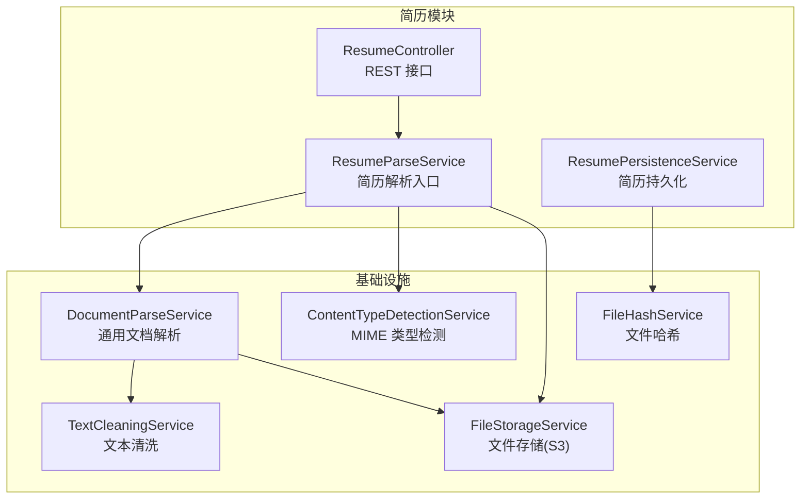
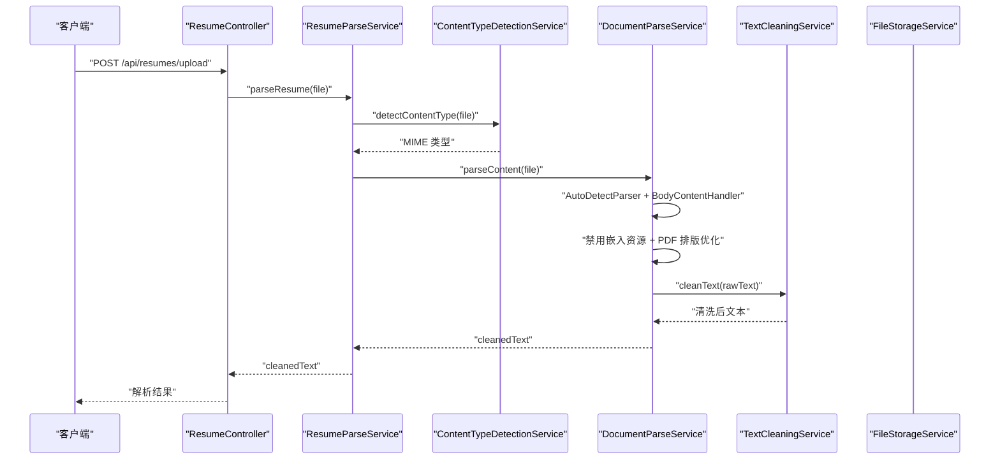
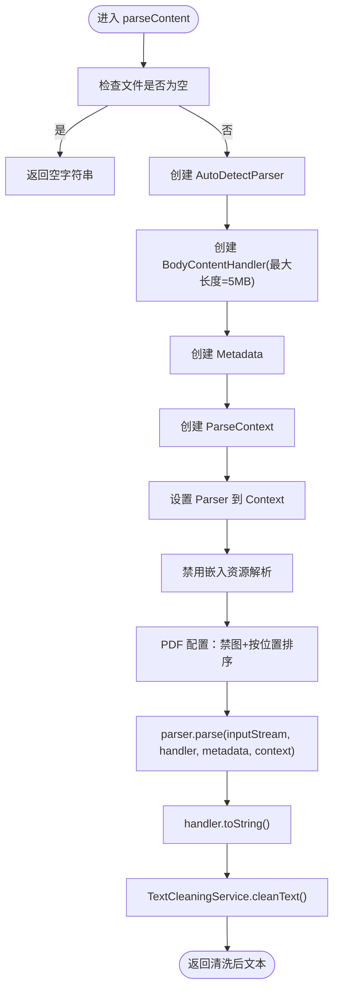
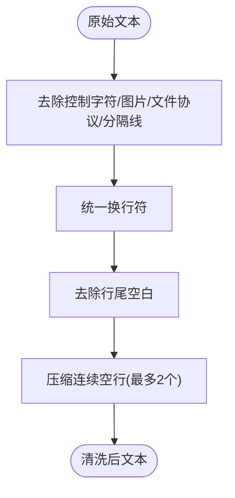
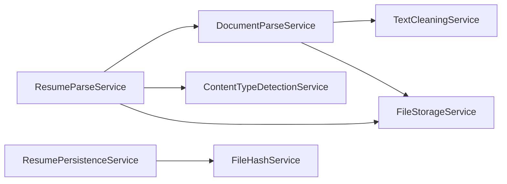

# 简历解析服务

<cite>
**本文引用的文件**
- [ResumeParseService.java](file://app/src/main/java/interview/guide/modules/resume/service/ResumeParseService.java)
- [DocumentParseService.java](file://app/src/main/java/interview/guide/infrastructure/file/DocumentParseService.java)
- [TextCleaningService.java](file://app/src/main/java/interview/guide/infrastructure/file/TextCleaningService.java)
- [ContentTypeDetectionService.java](file://app/src/main/java/interview/guide/infrastructure/file/ContentTypeDetectionService.java)
- [FileStorageService.java](file://app/src/main/java/interview/guide/infrastructure/file/FileStorageService.java)
- [NoOpEmbeddedDocumentExtractor.java](file://app/src/main/java/interview/guide/infrastructure/file/NoOpEmbeddedDocumentExtractor.java)
- [ResumeController.java](file://app/src/main/java/interview/guide/modules/resume/ResumeController.java)
- [ResumePersistenceService.java](file://app/src/main/java/interview/guide/modules/resume/service/ResumePersistenceService.java)
- [FileHashService.java](file://app/src/main/java/interview/guide/infrastructure/file/FileHashService.java)
- [BusinessException.java](file://app/src/main/java/interview/guide/common/exception/BusinessException.java)
- [application-test.yml](file://app/src/test/resources/application-test.yml)
- [DocumentParseServiceTest.java](file://app/src/test/java/interview/guide/infrastructure/file/DocumentParseServiceTest.java)
</cite>

## 目录
1. [简介](#简介)
2. [项目结构](#项目结构)
3. [核心组件](#核心组件)
4. [架构总览](#架构总览)
5. [详细组件分析](#详细组件分析)
6. [依赖分析](#依赖分析)
7. [性能考虑](#性能考虑)
8. [故障排查指南](#故障排查指南)
9. [结论](#结论)
10. [附录](#附录)

## 简介
本文件面向“简历解析服务”的使用者与维护者，系统性阐述 ResumeParseService 的文档解析能力与实现细节。该服务以通用的 DocumentParseService 为核心，结合 TextCleaningService、ContentTypeDetectionService、FileStorageService 等模块，提供对 PDF、Word、Excel、TXT、Markdown 等多种格式的文本提取与清洗能力，并通过统一的错误处理与性能优化策略保障稳定性与可维护性。

## 项目结构
简历解析服务位于后端模块 interview/guide/modules/resume 下，围绕 ResumeParseService 展开；底层能力由基础设施模块 interview/guide/infrastructure/file 提供。整体采用“控制器-服务-基础设施”分层架构，职责清晰、耦合度低。

图表来源
- [ResumeController.java:1-132](file://app/src/main/java/interview/guide/modules/resume/ResumeController.java#L1-L132)
- [ResumeParseService.java:1-66](file://app/src/main/java/interview/guide/modules/resume/service/ResumeParseService.java#L1-L66)
- [ResumePersistenceService.java:1-208](file://app/src/main/java/interview/guide/modules/resume/service/ResumePersistenceService.java#L1-L208)
- [DocumentParseService.java:1-164](file://app/src/main/java/interview/guide/infrastructure/file/DocumentParseService.java#L1-L164)
- [TextCleaningService.java:1-162](file://app/src/main/java/interview/guide/infrastructure/file/TextCleaningService.java#L1-L162)
- [ContentTypeDetectionService.java:1-110](file://app/src/main/java/interview/guide/infrastructure/file/ContentTypeDetectionService.java#L1-L110)
- [FileStorageService.java:1-280](file://app/src/main/java/interview/guide/infrastructure/file/FileStorageService.java#L1-L280)
- [FileHashService.java:1-89](file://app/src/main/java/interview/guide/infrastructure/file/FileHashService.java#L1-L89)

章节来源
- [ResumeController.java:1-132](file://app/src/main/java/interview/guide/modules/resume/ResumeController.java#L1-L132)
- [ResumeParseService.java:1-66](file://app/src/main/java/interview/guide/modules/resume/service/ResumeParseService.java#L1-L66)
- [DocumentParseService.java:1-164](file://app/src/main/java/interview/guide/infrastructure/file/DocumentParseService.java#L1-L164)

## 核心组件
- ResumeParseService：简历解析入口，委托 DocumentParseService 完成内容提取，并提供字节数组与存储下载解析两种模式，同时提供内容类型检测能力。
- DocumentParseService：基于 Apache Tika 的通用文档解析器，支持 PDF、DOC/DOCX、TXT、MD 等格式；内置正文提取、嵌入资源禁用、PDF 排版优化与最大文本长度限制。
- TextCleaningService：简历场景化的文本清洗与规范化，去除控制字符、图片链接、文件协议路径、分隔线等噪声，统一换行并压缩空行。
- ContentTypeDetectionService：基于 Apache Tika 的 MIME 类型检测，提供 PDF、Word、纯文本、Markdown 的判定能力。
- FileStorageService：S3 文件存储封装，提供上传、下载、删除、存在性检查、URL 生成与桶存在性校验。
- NoOpEmbeddedDocumentExtractor：禁用嵌入资源解析，避免提取图片引用与临时文件路径。
- FileHashService：文件哈希计算，用于简历去重。
- BusinessException：统一业务异常封装。

章节来源
- [ResumeParseService.java:1-66](file://app/src/main/java/interview/guide/modules/resume/service/ResumeParseService.java#L1-L66)
- [DocumentParseService.java:1-164](file://app/src/main/java/interview/guide/infrastructure/file/DocumentParseService.java#L1-L164)
- [TextCleaningService.java:1-162](file://app/src/main/java/interview/guide/infrastructure/file/TextCleaningService.java#L1-L162)
- [ContentTypeDetectionService.java:1-110](file://app/src/main/java/interview/guide/infrastructure/file/ContentTypeDetectionService.java#L1-L110)
- [FileStorageService.java:1-280](file://app/src/main/java/interview/guide/infrastructure/file/FileStorageService.java#L1-L280)
- [NoOpEmbeddedDocumentExtractor.java:1-52](file://app/src/main/java/interview/guide/infrastructure/file/NoOpEmbeddedDocumentExtractor.java#L1-L52)
- [FileHashService.java:1-89](file://app/src/main/java/interview/guide/infrastructure/file/FileHashService.java#L1-L89)
- [BusinessException.java:1-49](file://app/src/main/java/interview/guide/common/exception/BusinessException.java#L1-L49)

## 架构总览
简历解析的关键流程如下：前端上传或后端从存储下载文件 → 类型检测 → 文档解析 → 文本清洗 → 返回可检索的纯文本。

图表来源
- [ResumeController.java:38-54](file://app/src/main/java/interview/guide/modules/resume/ResumeController.java#L38-L54)
- [ResumeParseService.java:30-33](file://app/src/main/java/interview/guide/modules/resume/service/ResumeParseService.java#L30-L33)
- [DocumentParseService.java:45-64](file://app/src/main/java/interview/guide/infrastructure/file/DocumentParseService.java#L45-L64)
- [TextCleaningService.java:80-105](file://app/src/main/java/interview/guide/infrastructure/file/TextCleaningService.java#L80-L105)
- [ContentTypeDetectionService.java:32-39](file://app/src/main/java/interview/guide/infrastructure/file/ContentTypeDetectionService.java#L32-L39)

## 详细组件分析

### ResumeParseService（简历解析入口）
- 职责
  - 对外暴露 parseResume(file)、parseResume(bytes, name)、downloadAndParseContent(key, name) 三种解析入口。
  - 委派 DocumentParseService 执行解析与清洗。
  - 提供 detectContentType(file) 用于 MIME 类型检测。
- 设计要点
  - 通过构造注入整合 DocumentParseService、ContentTypeDetectionService、FileStorageService，保持低耦合。
  - 日志记录文件名与解析状态，便于追踪。
- 错误处理
  - 委派 DocumentParseService 抛出 BusinessException，上层控制器统一包装响应。

章节来源
- [ResumeParseService.java:15-66](file://app/src/main/java/interview/guide/modules/resume/service/ResumeParseService.java#L15-L66)

### DocumentParseService（通用文档解析）
- 能力范围
  - 支持 PDF、DOC/DOCX、TXT、MD 等常见格式。
  - 使用 AutoDetectParser 自动选择解析器。
  - 使用 BodyContentHandler 仅提取正文，限制最大文本长度（默认 5MB），避免内存压力。
  - 禁用嵌入资源解析（NoOpEmbeddedDocumentExtractor），避免提取图片引用与临时文件路径。
  - PDF 专用配置：关闭内联图片提取、按坐标排序文本，提升多栏布局的解析顺序。
- 核心流程
  - 构造 AutoDetectParser、BodyContentHandler、Metadata、ParseContext。
  - 设置 Parser 到 Context，显式增强健壮性。
  - 设置 PDFParserConfig，关闭图片与注释提取。
  - 执行 parser.parse(...)，返回 handler.toString()。
- 错误处理
  - 捕获 IOException、TikaException、SAXException，统一包装为 BusinessException。
  - downloadAndParseContent 对存储下载失败进行兜底处理。

图表来源
- [DocumentParseService.java:93-139](file://app/src/main/java/interview/guide/infrastructure/file/DocumentParseService.java#L93-L139)
- [NoOpEmbeddedDocumentExtractor.java:16-51](file://app/src/main/java/interview/guide/infrastructure/file/NoOpEmbeddedDocumentExtractor.java#L16-L51)
- [TextCleaningService.java:80-105](file://app/src/main/java/interview/guide/infrastructure/file/TextCleaningService.java#L80-L105)

章节来源
- [DocumentParseService.java:27-164](file://app/src/main/java/interview/guide/infrastructure/file/DocumentParseService.java#L27-L164)
- [NoOpEmbeddedDocumentExtractor.java:10-52](file://app/src/main/java/interview/guide/infrastructure/file/NoOpEmbeddedDocumentExtractor.java#L10-L52)

### TextCleaningService（文本清洗）
- 清洗目标（简历场景化）
  - 去除控制字符、图片文件名行、图片链接、文件协议 URL、分隔线。
  - 规范化换行符、去除行尾空格、压缩连续空行（最多保留两个换行）。
- 输出形态
  - cleanText：常规清洗。
  - cleanTextWithLimit：限制最大长度。
  - cleanToSingleLine：移除换行，合并为单行。
  - stripHtml：移除 HTML 标签与常见实体。

图表来源
- [TextCleaningService.java:57-105](file://app/src/main/java/interview/guide/infrastructure/file/TextCleaningService.java#L57-L105)

章节来源
- [TextCleaningService.java:7-162](file://app/src/main/java/interview/guide/infrastructure/file/TextCleaningService.java#L7-L162)

### ContentTypeDetectionService（内容类型检测）
- 能力
  - 基于 Apache Tika 的 MIME 类型检测，优先基于内容而非 HTTP 头。
  - 提供 isPdf、isWordDocument、isPlainText、isMarkdown 等便捷判断。
- 使用场景
  - 在解析前进行类型预判，指导后续处理策略（如 PDF 的排版优化）。

章节来源
- [ContentTypeDetectionService.java:11-110](file://app/src/main/java/interview/guide/infrastructure/file/ContentTypeDetectionService.java#L11-L110)

### FileStorageService（文件存储）
- 能力
  - 上传/下载/删除/存在性检查/文件大小查询/桶存在性校验。
  - 文件名清洗：将中文转换为拼音并清理非法字符，保证 S3 存储稳定。
  - 支持简历与知识库两类文件的独立目录前缀。
- 错误处理
  - 统一封装 S3Exception 与 IO 异常为 BusinessException。

章节来源
- [FileStorageService.java:24-280](file://app/src/main/java/interview/guide/infrastructure/file/FileStorageService.java#L24-L280)

### NoOpEmbeddedDocumentExtractor（禁用嵌入资源解析）
- 作用
  - shouldParseEmbedded 始终返回 false，避免解析嵌入的图片、附件等资源。
- 影响
  - 显著减少解析噪音与潜在的临时文件路径泄漏风险。

章节来源
- [NoOpEmbeddedDocumentExtractor.java:10-52](file://app/src/main/java/interview/guide/infrastructure/file/NoOpEmbeddedDocumentExtractor.java#L10-L52)

### FileHashService（文件哈希）
- 用途
  - 计算简历文件的 SHA-256 哈希，用于去重判断。
- 实现
  - 支持 MultipartFile、字节数组与 InputStream 三种输入源。

章节来源
- [FileHashService.java:14-89](file://app/src/main/java/interview/guide/infrastructure/file/FileHashService.java#L14-L89)

### ResumePersistenceService（简历持久化）
- 能力
  - 基于 FileHashService 去重检测，保存简历元数据与解析文本。
  - 保存/读取简历分析结果（JSON 字段序列化/反序列化）。
  - 删除简历时级联删除分析记录。
- 事务与异常
  - 使用 @Transactional 保证一致性；异常统一包装为 BusinessException。

章节来源
- [ResumePersistenceService.java:24-208](file://app/src/main/java/interview/guide/modules/resume/service/ResumePersistenceService.java#L24-L208)

## 依赖分析
- 组件耦合
  - ResumeParseService 仅依赖 DocumentParseService、ContentTypeDetectionService、FileStorageService，保持低耦合。
  - DocumentParseService 依赖 TextCleaningService 与 FileStorageService，形成清晰的“解析-清洗-存储”链路。
- 外部依赖
  - Apache Tika：文档解析与 MIME 检测。
  - AWS SDK(S3)：文件存储。
  - Jackson：JSON 序列化（用于分析结果持久化）。
- 潜在循环依赖
  - 当前模块未发现循环依赖；各层职责清晰。

图表来源
- [ResumeParseService.java:20-22](file://app/src/main/java/interview/guide/modules/resume/service/ResumeParseService.java#L20-L22)
- [DocumentParseService.java:33-37](file://app/src/main/java/interview/guide/infrastructure/file/DocumentParseService.java#L33-L37)
- [ResumePersistenceService.java:37](file://app/src/main/java/interview/guide/modules/resume/service/ResumePersistenceService.java#L37)

章节来源
- [ResumeParseService.java:15-66](file://app/src/main/java/interview/guide/modules/resume/service/ResumeParseService.java#L15-L66)
- [DocumentParseService.java:27-164](file://app/src/main/java/interview/guide/infrastructure/file/DocumentParseService.java#L27-L164)
- [ResumePersistenceService.java:24-208](file://app/src/main/java/interview/guide/modules/resume/service/ResumePersistenceService.java#L24-L208)

## 性能考虑
- 文本长度限制
  - BodyContentHandler 最大长度限制为 5MB，避免超大文档导致内存溢出。
- 禁用嵌入资源解析
  - NoOpEmbeddedDocumentExtractor 避免解析图片与附件，降低解析时间与噪音。
- PDF 排版优化
  - PDFParserConfig.setSortByPosition(true) 按坐标排序文本，改善多栏布局顺序，提升后续 NLP 处理质量。
- 流式哈希
  - FileHashService 提供流式哈希计算，适合大文件去重场景。
- I/O 与网络
  - S3 读写异常统一捕获与包装，避免泄露底层细节；建议在生产环境配置合理的重试与超时策略。

章节来源
- [DocumentParseService.java:31](file://app/src/main/java/interview/guide/infrastructure/file/DocumentParseService.java#L31)
- [DocumentParseService.java:127-132](file://app/src/main/java/interview/guide/infrastructure/file/DocumentParseService.java#L127-L132)
- [FileHashService.java:63-76](file://app/src/main/java/interview/guide/infrastructure/file/FileHashService.java#L63-L76)
- [FileStorageService.java:74-84](file://app/src/main/java/interview/guide/infrastructure/file/FileStorageService.java#L74-L84)

## 故障排查指南
- 常见问题与定位
  - 解析失败：查看 BusinessException 的错误码与消息，确认是否为 IO/Tika/SAX 异常。
  - 下载失败：检查 FileStorageService 的下载逻辑与 S3 权限/连接状态。
  - 类型检测异常：确认文件头与实际内容是否一致，必要时回退到文件扩展名判断。
- 关键日志
  - ResumeParseService/DocumentParseService 在解析开始与结束均记录日志，便于定位耗时与异常点。
- 单元测试参考
  - DocumentParseServiceTest 覆盖了 TXT/MD 解析、字节数组解析、空文件、异常处理、URL 与分隔线清理等场景，可作为回归测试基线。

章节来源
- [BusinessException.java:1-49](file://app/src/main/java/interview/guide/common/exception/BusinessException.java#L1-L49)
- [DocumentParseService.java:45-64](file://app/src/main/java/interview/guide/infrastructure/file/DocumentParseService.java#L45-L64)
- [DocumentParseServiceTest.java:176-192](file://app/src/test/java/interview/guide/infrastructure/file/DocumentParseServiceTest.java#L176-L192)

## 结论
简历解析服务通过“通用解析 + 场景化清洗 + 类型检测 + 存储集成”的架构，在保证多格式兼容的同时，强化了文本质量与运行稳定性。其模块化设计便于扩展与维护，建议在生产环境中结合缓存、限流与重试策略进一步提升吞吐与可用性。

## 附录

### 不同文档格式的解析效果与最佳实践
- PDF
  - 表现：正文提取稳定，多栏布局经排序后更易读。
  - 最佳实践：保持 PDF 无加密与可复制文本；避免过度图像化扫描件。
- DOC/DOCX
  - 表现：结构化文本提取良好，样式信息不影响正文。
  - 最佳实践：避免复杂嵌套表格与脚注混排；建议先清理格式再上传。
- TXT/MD
  - 表现：纯文本与 Markdown 解析快速、准确。
  - 最佳实践：统一换行符；Markdown 中的标题与列表在清洗后仍保留语义。
- Excel
  - 现状：仓库中未提供专门的 Excel 解析实现；建议通过转换为 CSV 或 PDF 后再解析。
- 最佳实践总结
  - 上传前进行类型检测与白名单校验。
  - 对超大文件启用流式处理与长度限制。
  - 使用 TextCleaningService 进行二次清洗，确保下游 NLP/检索质量。

章节来源
- [application-test.yml:79-84](file://app/src/test/resources/application-test.yml#L79-L84)
- [DocumentParseService.java:93-139](file://app/src/main/java/interview/guide/infrastructure/file/DocumentParseService.java#L93-L139)
- [TextCleaningService.java:57-105](file://app/src/main/java/interview/guide/infrastructure/file/TextCleaningService.java#L57-L105)