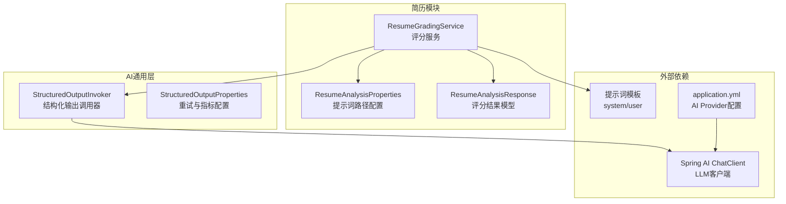
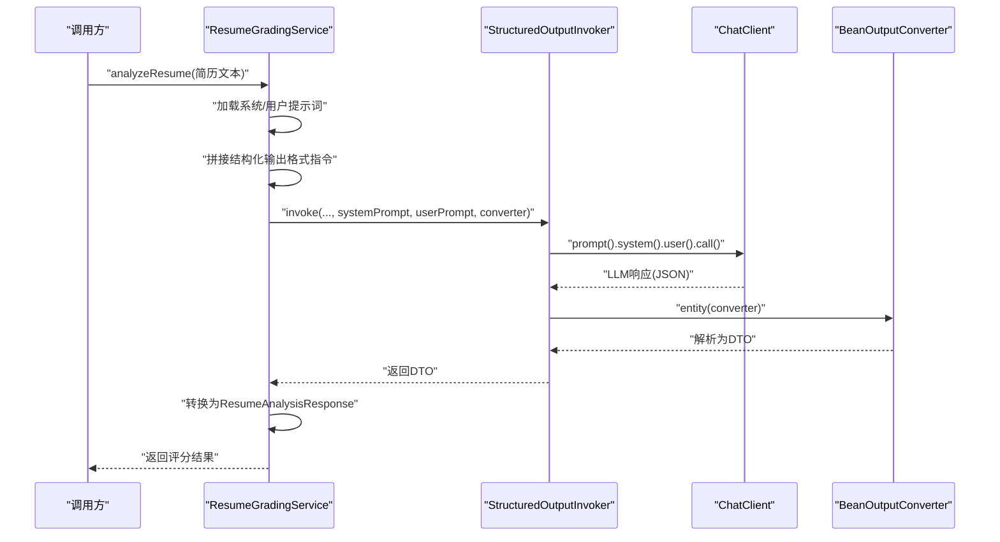
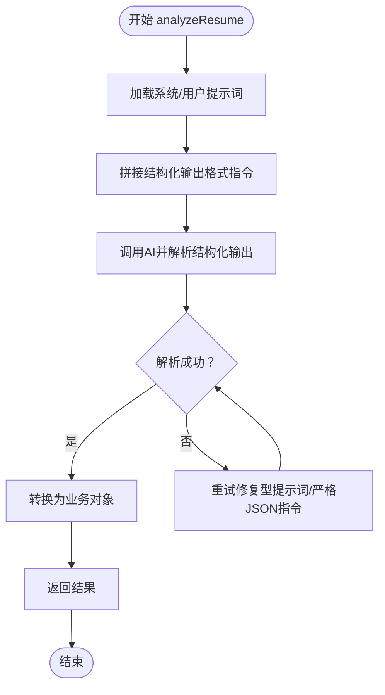
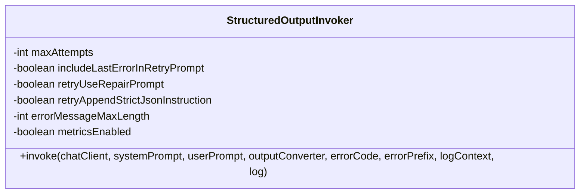
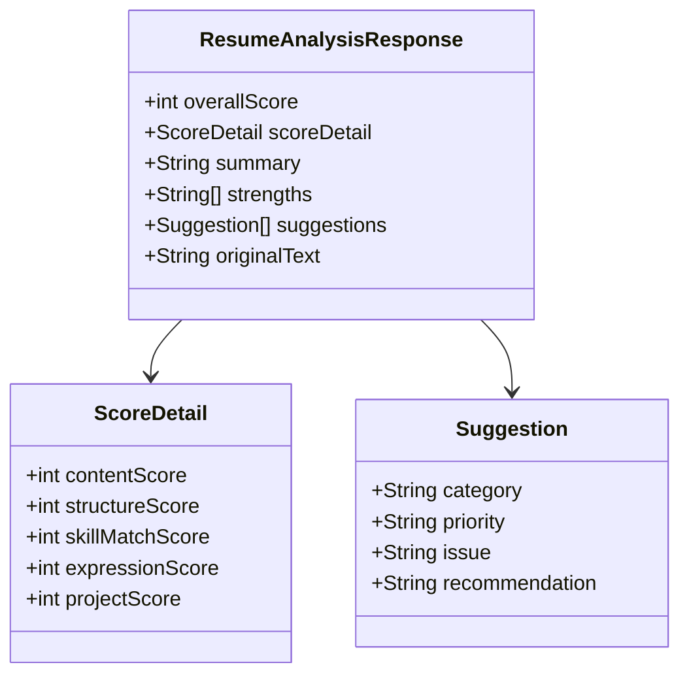
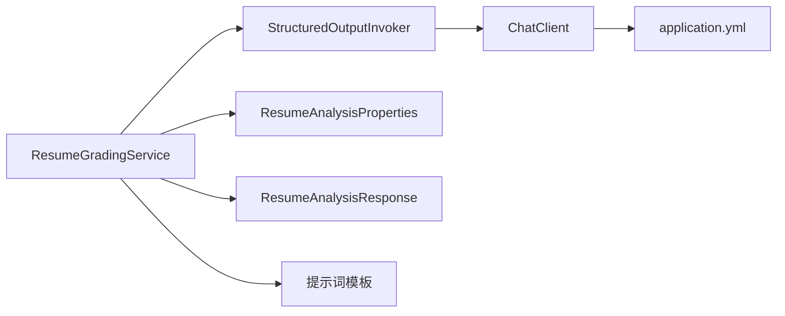

# 简历评分服务

<cite>
**本文引用的文件**
- [ResumeGradingService.java](file://app/src/main/java/interview/guide/modules/resume/service/ResumeGradingService.java)
- [StructuredOutputInvoker.java](file://app/src/main/java/interview/guide/common/ai/StructuredOutputInvoker.java)
- [ResumeAnalysisProperties.java](file://app/src/main/java/interview/guide/modules/resume/service/ResumeAnalysisProperties.java)
- [ResumeAnalysisResponse.java](file://app/src/main/java/interview/guide/modules/interview/model/ResumeAnalysisResponse.java)
- [StructuredOutputProperties.java](file://app/src/main/java/interview/guide/common/ai/StructuredOutputProperties.java)
- [application.yml](file://app/src/main/resources/application.yml)
- [resume-analysis-system.st](file://app/src/main/resources/prompts/resume-analysis-system.st)
- [resume-analysis-user.st](file://app/src/main/resources/prompts/resume-analysis-user.st)
</cite>

## 目录
1. [简介](#简介)
2. [项目结构](#项目结构)
3. [核心组件](#核心组件)
4. [架构概览](#架构概览)
5. [详细组件分析](#详细组件分析)
6. [依赖分析](#依赖分析)
7. [性能考虑](#性能考虑)
8. [故障排查指南](#故障排查指南)
9. [结论](#结论)
10. [附录](#附录)

## 简介
本文件面向“简历评分服务”的实现与使用，重点围绕 ResumeGradingService 的 AI 评分算法与交互流程展开，涵盖以下主题：
- 技能识别与能力评估的评分维度设计
- 提示词工程与结构化输出处理
- 评分结果的数据结构、权重与阈值
- 与 AI 模型的交互方式与可扩展性
- 准确性优化与调试技巧

## 项目结构
简历评分服务位于后端模块的 resume 包中，核心类与资源如下：
- 服务类：ResumeGradingService
- 结构化输出调用封装：StructuredOutputInvoker
- 配置属性：ResumeAnalysisProperties、StructuredOutputProperties
- 数据模型：ResumeAnalysisResponse
- 应用配置：application.yml
- 提示词模板：resume-analysis-system.st、resume-analysis-user.st

图表来源
- [ResumeGradingService.java:28-78](file://app/src/main/java/interview/guide/modules/resume/service/ResumeGradingService.java#L28-L78)
- [StructuredOutputInvoker.java:59-103](file://app/src/main/java/interview/guide/common/ai/StructuredOutputInvoker.java#L59-L103)
- [ResumeAnalysisProperties.java:9-14](file://app/src/main/java/interview/guide/modules/resume/service/ResumeAnalysisProperties.java#L9-L14)
- [application.yml:99-124](file://app/src/main/resources/application.yml#L99-L124)

章节来源
- [ResumeGradingService.java:28-78](file://app/src/main/java/interview/guide/modules/resume/service/ResumeGradingService.java#L28-L78)
- [application.yml:99-124](file://app/src/main/resources/application.yml#L99-L124)

## 核心组件
- ResumeGradingService：负责加载提示词模板、构造系统/用户提示、调用 AI 并解析结构化输出，最终转换为业务对象。
- StructuredOutputInvoker：统一封装结构化输出调用与重试策略，支持修复型重试提示词、严格 JSON 指令注入、指标采集等。
- ResumeAnalysisProperties：定义系统提示词与用户提示词的模板路径。
- ResumeAnalysisResponse：评分结果的数据模型，包含总分、各维度得分、摘要、优点与建议等。
- StructuredOutputProperties：控制结构化输出调用的重试次数、错误注入、严格 JSON 指令开关、指标开关等。

章节来源
- [ResumeGradingService.java:38-78](file://app/src/main/java/interview/guide/modules/resume/service/ResumeGradingService.java#L38-L78)
- [StructuredOutputInvoker.java:46-57](file://app/src/main/java/interview/guide/common/ai/StructuredOutputInvoker.java#L46-L57)
- [ResumeAnalysisProperties.java:9-14](file://app/src/main/java/interview/guide/modules/resume/service/ResumeAnalysisProperties.java#L9-L14)
- [ResumeAnalysisResponse.java:8-48](file://app/src/main/java/interview/guide/modules/interview/model/ResumeAnalysisResponse.java#L8-L48)
- [StructuredOutputProperties.java:9-18](file://app/src/main/java/interview/guide/common/ai/StructuredOutputProperties.java#L9-L18)

## 架构概览
简历评分服务的整体流程如下：
- 读取提示词模板（系统/用户）
- 将结构化输出格式指令附加到系统提示词
- 通过 ChatClient 发送提示词并使用 BeanOutputConverter 解析为 DTO
- 将 DTO 转换为业务对象 ResumeAnalysisResponse 返回

图表来源
- [ResumeGradingService.java:86-130](file://app/src/main/java/interview/guide/modules/resume/service/ResumeGradingService.java#L86-L130)
- [StructuredOutputInvoker.java:59-103](file://app/src/main/java/interview/guide/common/ai/StructuredOutputInvoker.java#L59-L103)

## 详细组件分析

### ResumeGradingService：评分服务主流程
- 职责
  - 加载系统/用户提示词模板
  - 将结构化输出格式指令注入系统提示词
  - 调用 AI 并解析结构化输出
  - 转换为业务对象并返回
- 关键点
  - 使用 PromptTemplate 渲染模板
  - 输出格式由 BeanOutputConverter 提供
  - 失败时抛出业务异常或返回错误响应
- 错误处理
  - AI 调用失败：抛出业务异常
  - 解析失败：通过 StructuredOutputInvoker 的重试策略修复
  - 最终兜底：返回错误摘要与建议

图表来源
- [ResumeGradingService.java:86-130](file://app/src/main/java/interview/guide/modules/resume/service/ResumeGradingService.java#L86-L130)
- [StructuredOutputInvoker.java:105-123](file://app/src/main/java/interview/guide/common/ai/StructuredOutputInvoker.java#L105-L123)

章节来源
- [ResumeGradingService.java:86-130](file://app/src/main/java/interview/guide/modules/resume/service/ResumeGradingService.java#L86-L130)

### StructuredOutputInvoker：结构化输出调用与重试
- 职责
  - 统一封装 ChatClient.prompt().call().entity(...) 的调用
  - 支持多次重试与修复型提示词
  - 可选注入严格 JSON 指令，限制错误信息长度
  - 记录调用次数、尝试状态与耗时指标
- 关键配置
  - 最大重试次数、是否包含上次错误、是否使用修复提示词
  - 是否追加严格 JSON 指令、错误信息最大长度、指标开关

图表来源
- [StructuredOutputInvoker.java:46-57](file://app/src/main/java/interview/guide/common/ai/StructuredOutputInvoker.java#L46-L57)
- [StructuredOutputInvoker.java:59-103](file://app/src/main/java/interview/guide/common/ai/StructuredOutputInvoker.java#L59-L103)

章节来源
- [StructuredOutputInvoker.java:59-103](file://app/src/main/java/interview/guide/common/ai/StructuredOutputInvoker.java#L59-L103)
- [StructuredOutputProperties.java:9-18](file://app/src/main/java/interview/guide/common/ai/StructuredOutputProperties.java#L9-L18)

### 提示词工程与模板
- 系统提示词模板：用于约束输出格式与评分维度
- 用户提示词模板：注入简历文本，触发评分任务
- 模板路径由 ResumeAnalysisProperties 提供，默认指向资源目录下的 st 文件

章节来源
- [ResumeAnalysisProperties.java:9-14](file://app/src/main/java/interview/guide/modules/resume/service/ResumeAnalysisProperties.java#L9-L14)
- [resume-analysis-system.st](file://app/src/main/resources/prompts/resume-analysis-system.st)
- [resume-analysis-user.st](file://app/src/main/resources/prompts/resume-analysis-user.st)

### 评分结果数据模型与权重
- 总分范围：0-100
- 各维度评分范围与权重
  - 内容完整性：0-25
  - 结构清晰度：0-20
  - 技能匹配度：0-25
  - 表达专业性：0-15
  - 项目经验：0-15
- 建议与摘要：由 AI 生成，建议包含类别、优先级、问题与具体建议

图表来源
- [ResumeAnalysisResponse.java:8-48](file://app/src/main/java/interview/guide/modules/interview/model/ResumeAnalysisResponse.java#L8-L48)

章节来源
- [ResumeAnalysisResponse.java:8-48](file://app/src/main/java/interview/guide/modules/interview/model/ResumeAnalysisResponse.java#L8-L48)

### 与 AI 模型的交互方式
- LLM Provider：通过 Spring AI 的 OpenAI 兼容模式对接 DashScope
- 模型选择与温度：可在 application.yml 中配置默认模型与温度
- 调用链路：ChatClient -> PromptTemplate 渲染 -> BeanOutputConverter 解析 -> DTO -> 业务对象

章节来源
- [application.yml:99-114](file://app/src/main/resources/application.yml#L99-L114)
- [application.yml:126-147](file://app/src/main/resources/application.yml#L126-L147)

## 依赖分析
- 组件耦合
  - ResumeGradingService 依赖 StructuredOutputInvoker 与提示词模板
  - StructuredOutputInvoker 依赖 ChatClient 与 BeanOutputConverter
  - 配置通过 application.yml 与属性类注入
- 外部依赖
  - Spring AI ChatClient
  - DashScope/OpenAI 兼容接口
- 潜在风险
  - 输出解析失败时的重试策略
  - 提示词格式与模型能力的适配

图表来源
- [ResumeGradingService.java:62-78](file://app/src/main/java/interview/guide/modules/resume/service/ResumeGradingService.java#L62-L78)
- [StructuredOutputInvoker.java:59-84](file://app/src/main/java/interview/guide/common/ai/StructuredOutputInvoker.java#L59-L84)
- [application.yml:99-114](file://app/src/main/resources/application.yml#L99-L114)

章节来源
- [ResumeGradingService.java:62-78](file://app/src/main/java/interview/guide/modules/resume/service/ResumeGradingService.java#L62-L78)
- [StructuredOutputInvoker.java:59-84](file://app/src/main/java/interview/guide/common/ai/StructuredOutputInvoker.java#L59-L84)
- [application.yml:99-114](file://app/src/main/resources/application.yml#L99-L114)

## 性能考虑
- 虚拟线程：启用虚拟线程以提升 I/O 密集场景并发能力
- 连接池：HikariCP 连接池参数已针对虚拟线程优化
- 指标监控：结构化输出调用具备 invocations/attempts/latency 指标，便于观测与调优
- 重试策略：StructuredOutputInvoker 的重试次数与修复提示词可降低解析失败率

章节来源
- [application.yml:44-46](file://app/src/main/resources/application.yml#L44-L46)
- [application.yml:54-61](file://app/src/main/resources/application.yml#L54-L61)
- [StructuredOutputInvoker.java:133-151](file://app/src/main/java/interview/guide/common/ai/StructuredOutputInvoker.java#L133-L151)
- [StructuredOutputProperties.java:12-17](file://app/src/main/java/interview/guide/common/ai/StructuredOutputProperties.java#L12-L17)

## 故障排查指南
- 常见问题
  - AI 调用失败：检查 AI Provider 配置与网络连通性
  - 结构化解析失败：查看重试日志与修复提示词是否生效
  - 输出格式不符合预期：确认提示词模板与结构化输出格式指令
- 排查步骤
  - 查看服务日志中的错误上下文与重试次数
  - 检查 application.yml 中的 AI Provider 与模型配置
  - 验证提示词模板是否正确加载
  - 调整 StructuredOutputInvoker 的重试参数与严格 JSON 指令开关
- 建议
  - 在开发环境开启严格 JSON 指令与修复提示词
  - 限制错误信息长度，避免过长上下文影响模型输出稳定性

章节来源
- [ResumeGradingService.java:115-118](file://app/src/main/java/interview/guide/modules/resume/service/ResumeGradingService.java#L115-L118)
- [StructuredOutputInvoker.java:89-95](file://app/src/main/java/interview/guide/common/ai/StructuredOutputInvoker.java#L89-L95)
- [StructuredOutputInvoker.java:113-121](file://app/src/main/java/interview/guide/common/ai/StructuredOutputInvoker.java#L113-L121)
- [application.yml:126-159](file://app/src/main/resources/application.yml#L126-L159)

## 结论
简历评分服务通过明确的提示词工程与结构化输出策略，实现了对简历内容的多维度评分与建议生成。其可扩展性体现在：
- 模板化提示词与属性配置，便于切换不同评分模板
- 结构化输出与重试机制，提升评分结果的稳定性
- 指标监控与参数化配置，便于持续优化与调试

## 附录

### 评分维度与权重说明
- 内容完整性：0-25
- 结构清晰度：0-20
- 技能匹配度：0-25
- 表达专业性：0-15
- 项目经验：0-15
- 总分：各维度之和（上限 100）

章节来源
- [ResumeAnalysisResponse.java:31-37](file://app/src/main/java/interview/guide/modules/interview/model/ResumeAnalysisResponse.java#L31-L37)

### 提示词与结构化输出配置
- 提示词模板路径：由 ResumeAnalysisProperties 提供
- 结构化输出格式：由 BeanOutputConverter 自动生成并注入到系统提示词
- 严格 JSON 指令与修复提示词：由 StructuredOutputProperties 控制

章节来源
- [ResumeAnalysisProperties.java:9-14](file://app/src/main/java/interview/guide/modules/resume/service/ResumeAnalysisProperties.java#L9-L14)
- [StructuredOutputProperties.java:9-18](file://app/src/main/java/interview/guide/common/ai/StructuredOutputProperties.java#L9-L18)
- [application.yml:148-159](file://app/src/main/resources/application.yml#L148-L159)