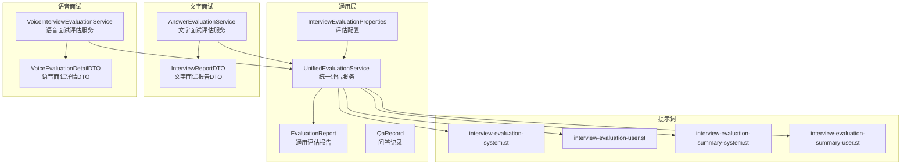
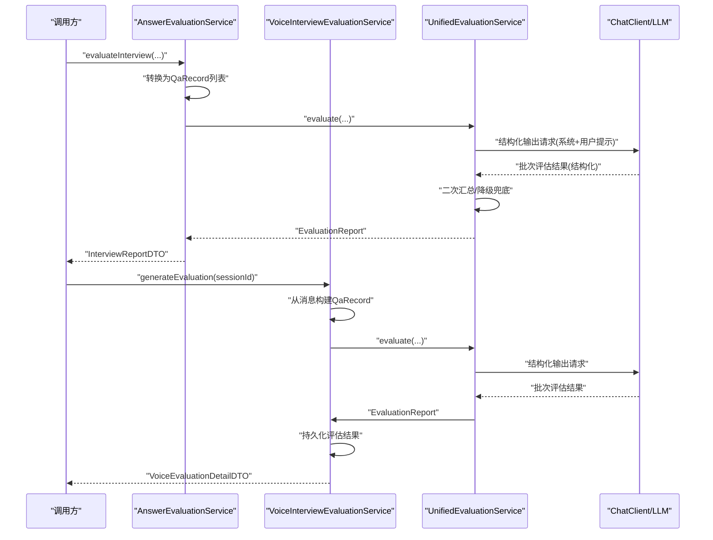
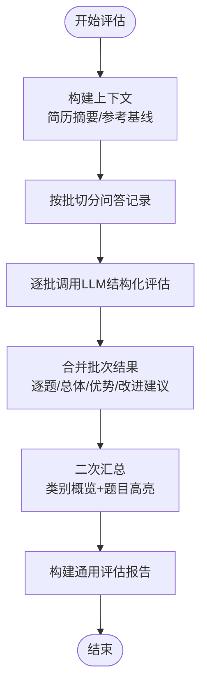
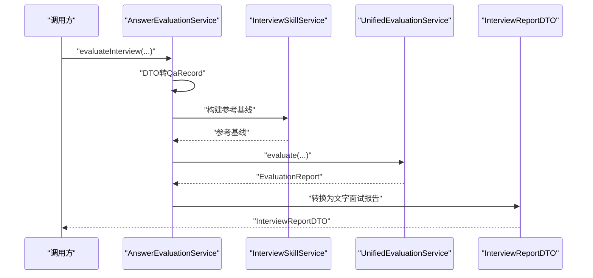
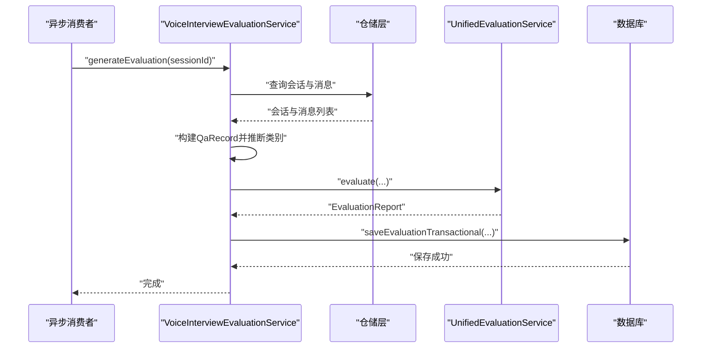
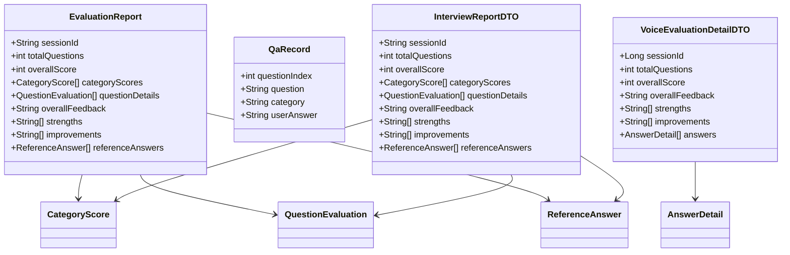
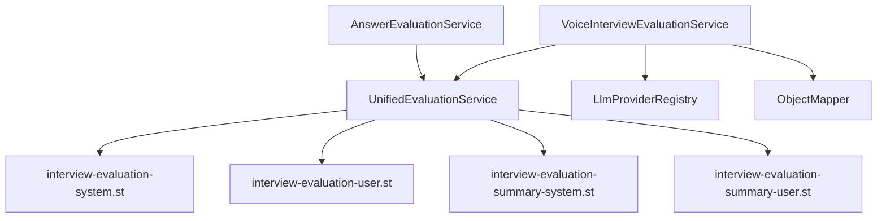

# 评估服务

<cite>
**本文引用的文件**
- [UnifiedEvaluationService.java](file://app/src/main/java/interview/guide/common/evaluation/UnifiedEvaluationService.java)
- [AnswerEvaluationService.java](file://app/src/main/java/interview/guide/modules/interview/service/AnswerEvaluationService.java)
- [VoiceInterviewEvaluationService.java](file://app/src/main/java/interview/guide/modules/voiceinterview/service/VoiceInterviewEvaluationService.java)
- [EvaluationReport.java](file://app/src/main/java/interview/guide/common/evaluation/EvaluationReport.java)
- [QaRecord.java](file://app/src/main/java/interview/guide/common/evaluation/QaRecord.java)
- [InterviewEvaluationProperties.java](file://app/src/main/java/interview/guide/common/evaluation/InterviewEvaluationProperties.java)
- [InterviewReportDTO.java](file://app/src/main/java/interview/guide/modules/interview/model/InterviewReportDTO.java)
- [VoiceEvaluationDetailDTO.java](file://app/src/main/java/interview/guide/modules/voiceinterview/dto/VoiceEvaluationDetailDTO.java)
- [interview-evaluation-user.st](file://app/src/main/resources/prompts/interview-evaluation-user.st)
- [interview-evaluation-system.st](file://app/src/main/resources/prompts/interview-evaluation-system.st)
- [interview-evaluation-summary-user.st](file://app/src/main/resources/prompts/interview-evaluation-summary-user.st)
- [interview-evaluation-summary-system.st](file://app/src/main/resources/prompts/interview-evaluation-summary-system.st)
</cite>

## 目录
1. [简介](#简介)
2. [项目结构](#项目结构)
3. [核心组件](#核心组件)
4. [架构总览](#架构总览)
5. [详细组件分析](#详细组件分析)
6. [依赖分析](#依赖分析)
7. [性能考虑](#性能考虑)
8. [故障排查指南](#故障排查指南)
9. [结论](#结论)
10. [附录](#附录)

## 简介
本文件系统性阐述面试评估服务的设计与实现，覆盖文字面试与语音面试的智能评估机制。评估体系以统一的评估服务为核心，通过分批评估、结构化输出与二次汇总的方式，实现对候选人答题质量、知识覆盖、逻辑性、语言表达、流利度、情感等多维度的综合评价。同时提供可配置的评估模板、评分规则与质量控制策略，支持评估结果在前端的复用渲染与后续应用。

## 项目结构
评估相关模块主要分布在后端 Java 工程中，采用“通用层 + 业务适配层”的分层设计：
- 通用层：统一评估服务与通用数据模型，支撑文字与语音两种面试形态
- 业务适配层：文字面试评估服务与语音面试评估服务分别对接各自的数据源与 DTO
- 提示词层：系统提示与用户提示模板，定义评估任务、约束与输出格式
- 配置层：评估批大小、提示词路径等参数化配置

图表来源
- [UnifiedEvaluationService.java:31-89](file://app/src/main/java/interview/guide/common/evaluation/UnifiedEvaluationService.java#L31-L89)
- [AnswerEvaluationService.java:25-40](file://app/src/main/java/interview/guide/modules/interview/service/AnswerEvaluationService.java#L25-L40)
- [VoiceInterviewEvaluationService.java:35-46](file://app/src/main/java/interview/guide/modules/voiceinterview/service/VoiceInterviewEvaluationService.java#L35-L46)
- [EvaluationReport.java:8-18](file://app/src/main/java/interview/guide/common/evaluation/EvaluationReport.java#L8-L18)
- [QaRecord.java:6-11](file://app/src/main/java/interview/guide/common/evaluation/QaRecord.java#L6-L11)
- [InterviewEvaluationProperties.java:10-17](file://app/src/main/java/interview/guide/common/evaluation/InterviewEvaluationProperties.java#L10-L17)
- [InterviewReportDTO.java:8-18](file://app/src/main/java/interview/guide/modules/interview/model/InterviewReportDTO.java#L8-L18)
- [VoiceEvaluationDetailDTO.java:14-26](file://app/src/main/java/interview/guide/modules/voiceinterview/dto/VoiceEvaluationDetailDTO.java#L14-L26)
- [interview-evaluation-user.st:1-23](file://app/src/main/resources/prompts/interview-evaluation-user.st#L1-L23)
- [interview-evaluation-system.st](file://app/src/main/resources/prompts/interview-evaluation-system.st)
- [interview-evaluation-summary-user.st:1-25](file://app/src/main/resources/prompts/interview-evaluation-summary-user.st#L1-L25)
- [interview-evaluation-summary-system.st](file://app/src/main/resources/prompts/interview-evaluation-summary-system.st)

章节来源
- [UnifiedEvaluationService.java:27-31](file://app/src/main/java/interview/guide/common/evaluation/UnifiedEvaluationService.java#L27-L31)
- [AnswerEvaluationService.java:21-25](file://app/src/main/java/interview/guide/modules/interview/service/AnswerEvaluationService.java#L21-L25)
- [VoiceInterviewEvaluationService.java:31-35](file://app/src/main/java/interview/guide/modules/voiceinterview/service/VoiceInterviewEvaluationService.java#L31-L35)

## 核心组件
- 统一评估服务（UnifiedEvaluationService）：实现分批评估、结构化输出、二次汇总与降级兜底，面向文字与语音面试共用
- 文字面试评估服务（AnswerEvaluationService）：将文字面试的 DTO 转换为通用问答记录，调用统一评估服务并转换为文字面试报告
- 语音面试评估服务（VoiceInterviewEvaluationService）：从语音会话消息中抽取问答记录，推导问题类别，复用统一评估服务，并持久化评估结果
- 通用数据模型：EvaluationReport（通用评估报告）、QaRecord（问答记录），支撑跨形态的评估数据流转
- 评估配置：InterviewEvaluationProperties（批大小、提示词路径）
- 提示词模板：系统提示与用户提示，定义评估任务、约束与输出格式

章节来源
- [UnifiedEvaluationService.java:31-89](file://app/src/main/java/interview/guide/common/evaluation/UnifiedEvaluationService.java#L31-L89)
- [AnswerEvaluationService.java:25-40](file://app/src/main/java/interview/guide/modules/interview/service/AnswerEvaluationService.java#L25-L40)
- [VoiceInterviewEvaluationService.java:35-46](file://app/src/main/java/interview/guide/modules/voiceinterview/service/VoiceInterviewEvaluationService.java#L35-L46)
- [EvaluationReport.java:8-18](file://app/src/main/java/interview/guide/common/evaluation/EvaluationReport.java#L8-L18)
- [QaRecord.java:6-11](file://app/src/main/java/interview/guide/common/evaluation/QaRecord.java#L6-L11)
- [InterviewEvaluationProperties.java:10-17](file://app/src/main/java/interview/guide/common/evaluation/InterviewEvaluationProperties.java#L10-L17)

## 架构总览
统一评估服务作为核心枢纽，接收问答记录与可选的简历摘要、参考基线，按批处理调用大模型进行结构化评估；随后进行二次汇总，生成总体反馈与优势/改进建议，并构建通用评估报告。文字与语音面试通过各自的适配服务将自身数据转换为通用格式后复用该流程。

图表来源
- [AnswerEvaluationService.java:45-75](file://app/src/main/java/interview/guide/modules/interview/service/AnswerEvaluationService.java#L45-L75)
- [VoiceInterviewEvaluationService.java:52-85](file://app/src/main/java/interview/guide/modules/voiceinterview/service/VoiceInterviewEvaluationService.java#L52-L85)
- [UnifiedEvaluationService.java:100-144](file://app/src/main/java/interview/guide/common/evaluation/UnifiedEvaluationService.java#L100-L144)

## 详细组件分析

### 统一评估服务（UnifiedEvaluationService）
职责与流程
- 输入：会话标识、问答记录列表、简历摘要（可选）、参考基线（可选）
- 分批评估：按配置的批大小切分问答记录，逐批调用 LLM 进行结构化评估
- 二次汇总：基于类别概览与题目高亮，对批次结果进行一致性与聚焦性汇总
- 降级兜底：当 LLM 输出异常时，返回空报告并以零分与兜底反馈填充
- 输出：通用评估报告（包含总分、分类得分、每题详情、总体反馈、优势、改进建议、参考答案）

关键特性
- 批量处理与容错：通过批大小控制 LLM 调用频率与上下文长度，异常时以零分与兜底文本保证可用性
- 上下文截断：对简历与参考基线进行长度限制，避免超限
- 二次汇总：在批次评估基础上进行更高阶的综合提炼，提升结论稳定性
- 结构化输出：通过提示词模板与输出转换器确保 LLM 输出符合预期结构

图表来源
- [UnifiedEvaluationService.java:100-144](file://app/src/main/java/interview/guide/common/evaluation/UnifiedEvaluationService.java#L100-L144)
- [UnifiedEvaluationService.java:151-189](file://app/src/main/java/interview/guide/common/evaluation/UnifiedEvaluationService.java#L151-L189)
- [UnifiedEvaluationService.java:248-280](file://app/src/main/java/interview/guide/common/evaluation/UnifiedEvaluationService.java#L248-L280)
- [UnifiedEvaluationService.java:290-344](file://app/src/main/java/interview/guide/common/evaluation/UnifiedEvaluationService.java#L290-L344)

章节来源
- [UnifiedEvaluationService.java:91-144](file://app/src/main/java/interview/guide/common/evaluation/UnifiedEvaluationService.java#L91-L144)
- [UnifiedEvaluationService.java:151-189](file://app/src/main/java/interview/guide/common/evaluation/UnifiedEvaluationService.java#L151-L189)
- [UnifiedEvaluationService.java:248-280](file://app/src/main/java/interview/guide/common/evaluation/UnifiedEvaluationService.java#L248-L280)
- [UnifiedEvaluationService.java:290-344](file://app/src/main/java/interview/guide/common/evaluation/UnifiedEvaluationService.java#L290-L344)

### 文字面试评估服务（AnswerEvaluationService）
职责
- 将文字面试的 DTO 转换为通用问答记录（QaRecord）
- 构建参考基线（来自技能服务）
- 调用统一评估服务生成通用评估报告
- 将通用报告转换为文字面试专用 DTO（InterviewReportDTO）

关键点
- 数据适配：将问题索引、问题、类别、用户答案映射为通用记录
- 参考基线：基于会话技能 ID 构建评估参考段落，增强评估一致性
- 异常处理：捕获业务异常并抛出标准化错误码

图表来源
- [AnswerEvaluationService.java:45-75](file://app/src/main/java/interview/guide/modules/interview/service/AnswerEvaluationService.java#L45-L75)
- [InterviewReportDTO.java:8-18](file://app/src/main/java/interview/guide/modules/interview/model/InterviewReportDTO.java#L8-L18)

章节来源
- [AnswerEvaluationService.java:42-75](file://app/src/main/java/interview/guide/modules/interview/service/AnswerEvaluationService.java#L42-L75)
- [InterviewReportDTO.java:8-18](file://app/src/main/java/interview/guide/modules/interview/model/InterviewReportDTO.java#L8-L18)

### 语音面试评估服务（VoiceInterviewEvaluationService）
职责
- 从语音会话消息中提取 AI 生成文本与用户识别文本，构建问答记录
- 推断问题类别（如自我介绍、技术问题、项目深挖、HR问题）
- 调用统一评估服务生成通用评估报告
- 在事务内持久化评估结果（JSON 存储结构化字段）
- 提供评估详情查询（VoiceEvaluationDetailDTO）

关键点
- 问答记录构建：过滤空文本，按出现顺序编号
- 类别推断：基于 AI 文本关键词进行启发式分类
- 事务与异步：LLM 调用在事务外执行，仅数据库写入在事务内，降低锁持有时间
- 空评估兜底：无有效对话时生成空评估并写入兜底反馈与建议

图表来源
- [VoiceInterviewEvaluationService.java:52-85](file://app/src/main/java/interview/guide/modules/voiceinterview/service/VoiceInterviewEvaluationService.java#L52-L85)
- [VoiceInterviewEvaluationService.java:125-151](file://app/src/main/java/interview/guide/modules/voiceinterview/service/VoiceInterviewEvaluationService.java#L125-L151)
- [VoiceInterviewEvaluationService.java:177-233](file://app/src/main/java/interview/guide/modules/voiceinterview/service/VoiceInterviewEvaluationService.java#L177-L233)

章节来源
- [VoiceInterviewEvaluationService.java:48-85](file://app/src/main/java/interview/guide/modules/voiceinterview/service/VoiceInterviewEvaluationService.java#L48-L85)
- [VoiceInterviewEvaluationService.java:95-124](file://app/src/main/java/interview/guide/modules/voiceinterview/service/VoiceInterviewEvaluationService.java#L95-L124)
- [VoiceInterviewEvaluationService.java:125-175](file://app/src/main/java/interview/guide/modules/voiceinterview/service/VoiceInterviewEvaluationService.java#L125-L175)
- [VoiceInterviewEvaluationService.java:177-233](file://app/src/main/java/interview/guide/modules/voiceinterview/service/VoiceInterviewEvaluationService.java#L177-L233)

### 通用数据模型与 DTO
- 通用评估报告（EvaluationReport）：包含会话标识、总题数、总分、分类得分、每题详情、总体反馈、优势、改进建议、参考答案
- 问答记录（QaRecord）：包含问题索引、问题、类别、用户答案（可为空）
- 文字面试报告 DTO（InterviewReportDTO）：与通用报告结构一致，便于前端复用
- 语音面试详情 DTO（VoiceEvaluationDetailDTO）：包含会话标识、总题数、总分、总体反馈、优势、改进建议与每题详情（含参考答案与关键要点）

图表来源
- [EvaluationReport.java:8-18](file://app/src/main/java/interview/guide/common/evaluation/EvaluationReport.java#L8-L18)
- [QaRecord.java:6-11](file://app/src/main/java/interview/guide/common/evaluation/QaRecord.java#L6-L11)
- [InterviewReportDTO.java:8-18](file://app/src/main/java/interview/guide/modules/interview/model/InterviewReportDTO.java#L8-L18)
- [VoiceEvaluationDetailDTO.java:14-26](file://app/src/main/java/interview/guide/modules/voiceinterview/dto/VoiceEvaluationDetailDTO.java#L14-L26)

章节来源
- [EvaluationReport.java:8-18](file://app/src/main/java/interview/guide/common/evaluation/EvaluationReport.java#L8-L18)
- [QaRecord.java:6-11](file://app/src/main/java/interview/guide/common/evaluation/QaRecord.java#L6-L11)
- [InterviewReportDTO.java:8-18](file://app/src/main/java/interview/guide/modules/interview/model/InterviewReportDTO.java#L8-L18)
- [VoiceEvaluationDetailDTO.java:14-26](file://app/src/main/java/interview/guide/modules/voiceinterview/dto/VoiceEvaluationDetailDTO.java#L14-L26)

## 依赖分析
- 组件耦合
  - 文字与语音评估服务均依赖统一评估服务，保持评估逻辑一致性
  - 统一评估服务依赖提示词模板与结构化输出转换器，确保 LLM 输出稳定
  - 语音评估服务依赖 LLM 提供商注册表以选择合适的 ChatClient
- 外部依赖
  - Spring AI ChatClient：用于与大模型交互
  - Jackson/ObjectMapper：用于 JSON 序列化/反序列化评估结果
  - ResourceLoader：用于加载提示词模板资源

图表来源
- [AnswerEvaluationService.java:34-40](file://app/src/main/java/interview/guide/modules/interview/service/AnswerEvaluationService.java#L34-L40)
- [VoiceInterviewEvaluationService.java:41-46](file://app/src/main/java/interview/guide/modules/voiceinterview/service/VoiceInterviewEvaluationService.java#L41-L46)
- [UnifiedEvaluationService.java:76-89](file://app/src/main/java/interview/guide/common/evaluation/UnifiedEvaluationService.java#L76-L89)

章节来源
- [AnswerEvaluationService.java:34-40](file://app/src/main/java/interview/guide/modules/interview/service/AnswerEvaluationService.java#L34-L40)
- [VoiceInterviewEvaluationService.java:41-46](file://app/src/main/java/interview/guide/modules/voiceinterview/service/VoiceInterviewEvaluationService.java#L41-L46)
- [UnifiedEvaluationService.java:76-89](file://app/src/main/java/interview/guide/common/evaluation/UnifiedEvaluationService.java#L76-L89)

## 性能考虑
- 批大小控制：通过配置参数控制每批评估的问题数量，平衡吞吐与上下文长度
- 上下文截断：对简历与参考基线进行长度限制，避免 LLM 上下文超限
- 降级兜底：当 LLM 输出异常时，以零分与兜底反馈快速返回，保障系统可用性
- 事务边界：语音评估的持久化在事务内执行，减少锁持有时间，提高并发能力
- JSON 存储：评估结果以 JSON 形式存储，便于扩展与检索

章节来源
- [InterviewEvaluationProperties.java:12-12](file://app/src/main/java/interview/guide/common/evaluation/InterviewEvaluationProperties.java#L12-L12)
- [UnifiedEvaluationService.java:115-123](file://app/src/main/java/interview/guide/common/evaluation/UnifiedEvaluationService.java#L115-L123)
- [VoiceInterviewEvaluationService.java:125-151](file://app/src/main/java/interview/guide/modules/voiceinterview/service/VoiceInterviewEvaluationService.java#L125-L151)

## 故障排查指南
常见问题与定位
- 评估失败：检查统一评估服务的日志与错误码，确认提示词模板是否加载成功、结构化输出是否符合预期
- 语音评估无结果：确认会话是否存在有效对话记录，若无则会生成空评估兜底
- 保存失败：检查数据库连接与事务配置，确保 JSON 字段可正常序列化
- LLM 调用异常：确认 LLM 提供商注册表配置正确，ChatClient 可用

章节来源
- [UnifiedEvaluationService.java:183-188](file://app/src/main/java/interview/guide/common/evaluation/UnifiedEvaluationService.java#L183-L188)
- [VoiceInterviewEvaluationService.java:80-84](file://app/src/main/java/interview/guide/modules/voiceinterview/service/VoiceInterviewEvaluationService.java#L80-L84)
- [VoiceInterviewEvaluationService.java:146-150](file://app/src/main/java/interview/guide/modules/voiceinterview/service/VoiceInterviewEvaluationService.java#L146-L150)
- [VoiceInterviewEvaluationService.java:170-174](file://app/src/main/java/interview/guide/modules/voiceinterview/service/VoiceInterviewEvaluationService.java#L170-L174)

## 结论
评估服务通过统一评估框架实现了文字与语音面试的一致性评估，具备良好的可扩展性与稳定性。提示词模板与配置参数支持定制化评估策略，JSON 化的评估结果便于前端复用与后续应用。建议在生产环境中结合批大小、上下文长度与兜底策略进行调优，并持续迭代提示词模板以提升评估质量。

## 附录

### 评估维度与指标说明
- 答案质量评分：基于逐题回答与参考基线的对比，给出分数与反馈
- 知识点覆盖：通过分类统计与参考答案核对，评估候选人在各领域的掌握程度
- 逻辑性分析：结合回答内容与问题类别，评估思路清晰度与条理性
- 语音评估（语音面试）：在文字评估基础上，结合语音识别结果进行一致性与完整性评估（类别推断、空评估兜底等）

章节来源
- [interview-evaluation-user.st:17-23](file://app/src/main/resources/prompts/interview-evaluation-user.st#L17-L23)
- [interview-evaluation-summary-user.st:16-24](file://app/src/main/resources/prompts/interview-evaluation-summary-user.st#L16-L24)
- [VoiceInterviewEvaluationService.java:117-123](file://app/src/main/java/interview/guide/modules/voiceinterview/service/VoiceInterviewEvaluationService.java#L117-L123)
- [VoiceInterviewEvaluationService.java:153-175](file://app/src/main/java/interview/guide/modules/voiceinterview/service/VoiceInterviewEvaluationService.java#L153-L175)

### 配置选项与自定义方法
- 批大小（batchSize）：控制每批评估的问题数量，默认值可在配置类中调整
- 提示词路径：系统提示与用户提示模板路径，支持替换为自定义模板
- 参考基线：由技能服务构建，用于辅助评估与一致性校准
- 输出格式：统一评估服务通过结构化输出转换器确保 LLM 输出符合预期结构

章节来源
- [InterviewEvaluationProperties.java:12-17](file://app/src/main/java/interview/guide/common/evaluation/InterviewEvaluationProperties.java#L12-L17)
- [interview-evaluation-system.st](file://app/src/main/resources/prompts/interview-evaluation-system.st)
- [interview-evaluation-user.st:1-23](file://app/src/main/resources/prompts/interview-evaluation-user.st#L1-L23)
- [interview-evaluation-summary-system.st](file://app/src/main/resources/prompts/interview-evaluation-summary-system.st)
- [interview-evaluation-summary-user.st:1-25](file://app/src/main/resources/prompts/interview-evaluation-summary-user.st#L1-L25)

### 评估结果应用场景与改进建议
- 场景：简历筛选、面试复盘、学习路径优化、技能画像构建
- 建议：持续收集人工标注样本，迭代提示词模板；引入多轮对话与上下文增强；结合外部知识库提升参考基线质量；在前端提供可视化仪表盘与导出能力