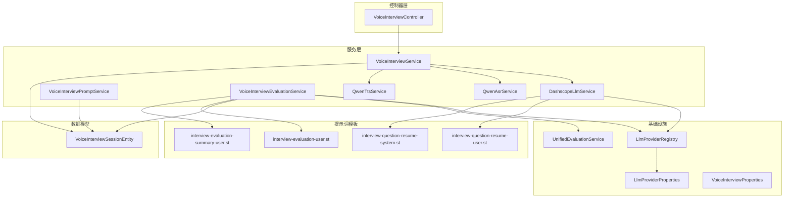
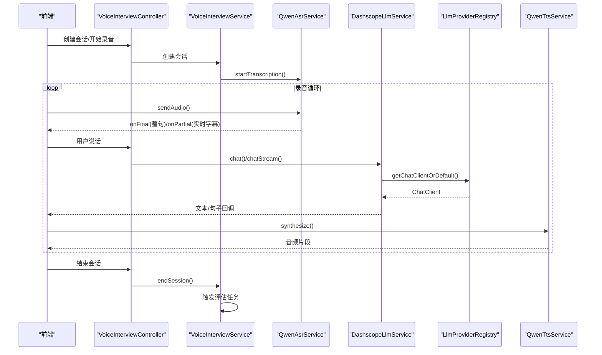
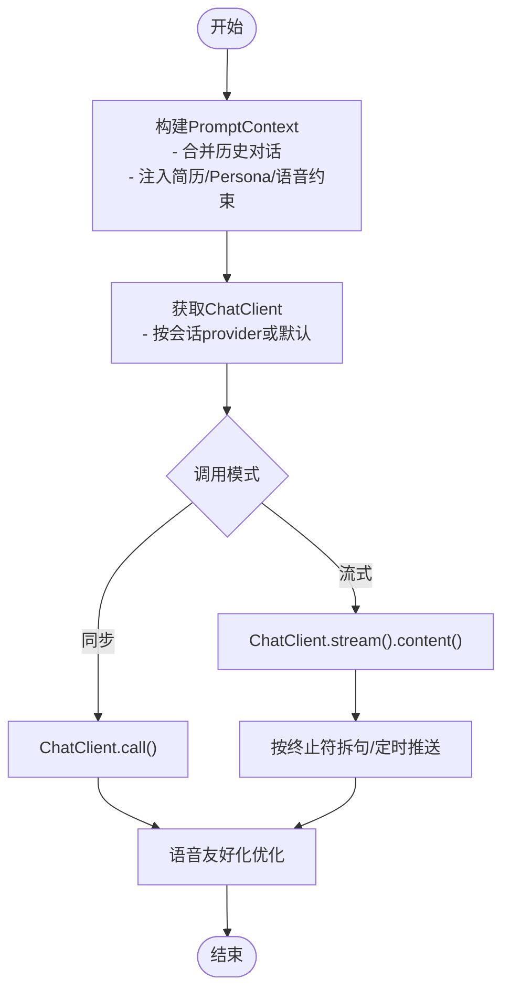
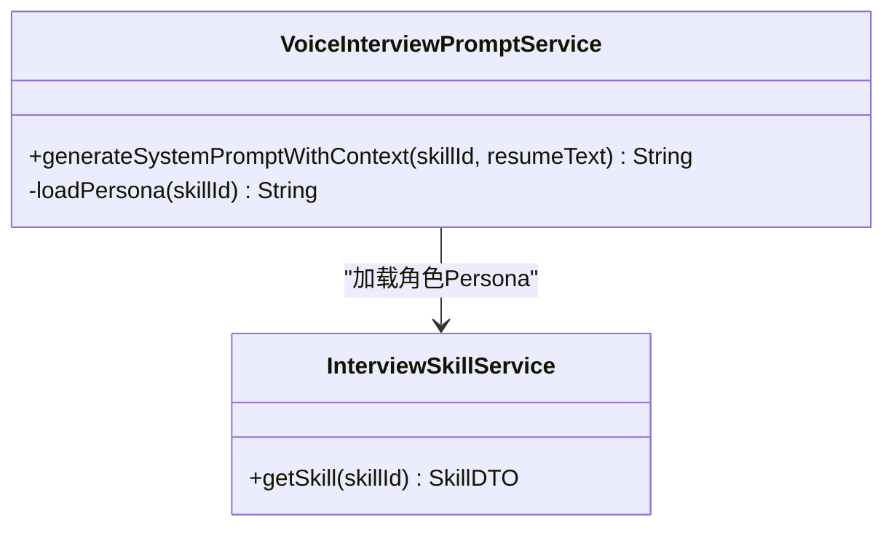
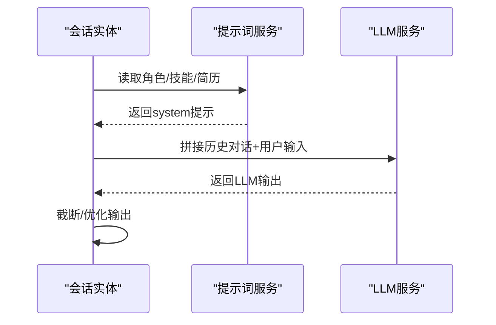
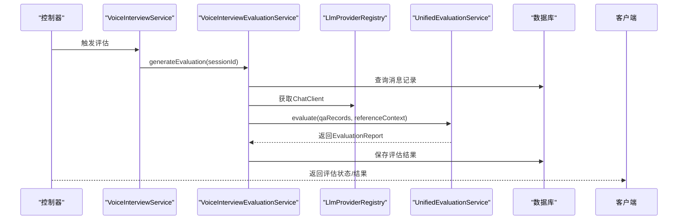
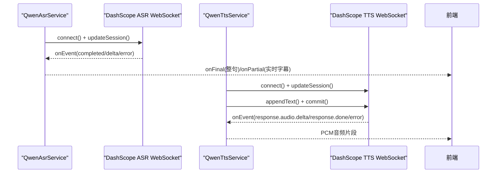
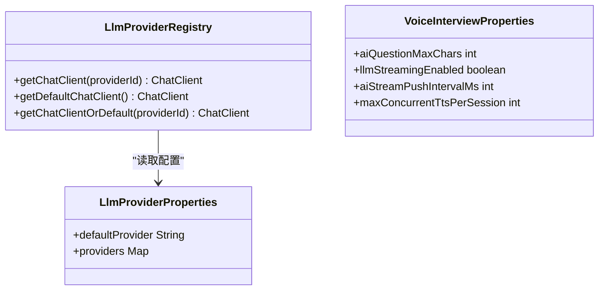
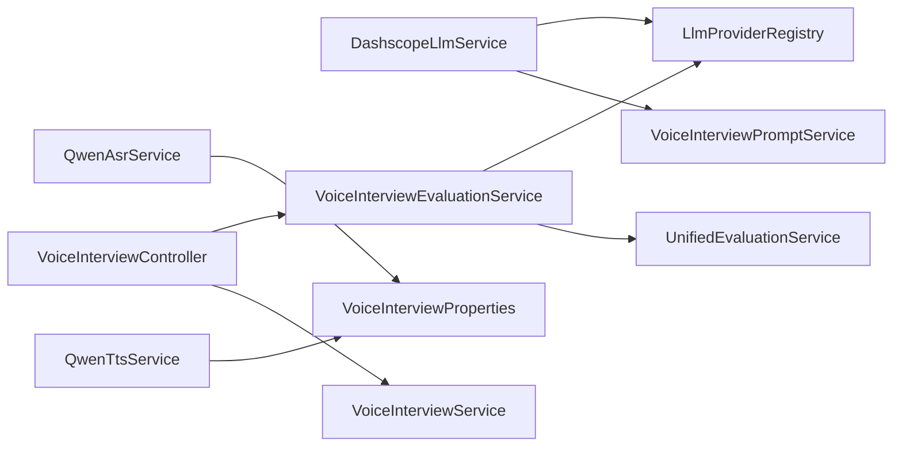

# 语音面试AI集成

<cite>
**本文引用的文件**
- [DashscopeLlmService.java](file://app/src/main/java/interview/guide/modules/voiceinterview/service/DashscopeLlmService.java)
- [VoiceInterviewPromptService.java](file://app/src/main/java/interview/guide/modules/voiceinterview/service/VoiceInterviewPromptService.java)
- [VoiceInterviewEvaluationService.java](file://app/src/main/java/interview/guide/modules/voiceinterview/service/VoiceInterviewEvaluationService.java)
- [LlmProviderRegistry.java](file://app/src/main/java/interview/guide/common/ai/LlmProviderRegistry.java)
- [LlmProviderProperties.java](file://app/src/main/java/interview/guide/common/config/LlmProviderProperties.java)
- [VoiceInterviewProperties.java](file://app/src/main/java/interview/guide/modules/voiceinterview/config/VoiceInterviewProperties.java)
- [VoiceInterviewSessionEntity.java](file://app/src/main/java/interview/guide/modules/voiceinterview/model/VoiceInterviewSessionEntity.java)
- [QwenAsrService.java](file://app/src/main/java/interview/guide/modules/voiceinterview/service/QwenAsrService.java)
- [QwenTtsService.java](file://app/src/main/java/interview/guide/modules/voiceinterview/service/QwenTtsService.java)
- [VoiceInterviewController.java](file://app/src/main/java/interview/guide/modules/voiceinterview/controller/VoiceInterviewController.java)
- [interview-evaluation-user.st](file://app/src/main/resources/prompts/interview-evaluation-user.st)
- [interview-evaluation-summary-user.st](file://app/src/main/resources/prompts/interview-evaluation-summary-user.st)
- [interview-question-resume-user.st](file://app/src/main/resources/prompts/interview-question-resume-user.st)
- [interview-question-resume-system.st](file://app/src/main/resources/prompts/interview-question-resume-system.st)
- [DashscopeLlmServiceTest.java](file://app/src/test/java/interview/guide/modules/voiceinterview/service/DashscopeLlmServiceTest.java)
</cite>

## 目录
1. [简介](#简介)
2. [项目结构](#项目结构)
3. [核心组件](#核心组件)
4. [架构总览](#架构总览)
5. [详细组件分析](#详细组件分析)
6. [依赖关系分析](#依赖关系分析)
7. [性能考量](#性能考量)
8. [故障排查指南](#故障排查指南)
9. [结论](#结论)
10. [附录](#附录)

## 简介
本文件面向语音面试AI集成场景，系统性阐述Dashscope LLM服务的集成方式、提示词工程（Prompt Engineering）在语音面试中的应用、上下文管理机制、AI评估服务实现、配置管理、错误处理与性能监控的最佳实践，并提供模型选择与切换策略。文档以代码为依据，辅以可视化图表，帮助读者快速理解并落地实现。

## 项目结构
语音面试模块位于后端应用的voiceinterview子包下，围绕“会话生命周期管理 + 实时语音识别/合成 + LLM对话 + 评估服务”的闭环展开。整体采用分层架构：控制器层负责REST接口与状态查询；服务层封装业务流程；基础设施层对接Dashscope ASR/TTS与Spring AI ChatClient；资源目录存放提示词模板。

**图表来源**
- [VoiceInterviewController.java:1-201](file://app/src/main/java/interview/guide/modules/voiceinterview/controller/VoiceInterviewController.java#L1-L201)
- [DashscopeLlmService.java:1-246](file://app/src/main/java/interview/guide/modules/voiceinterview/service/DashscopeLlmService.java#L1-L246)
- [VoiceInterviewPromptService.java:1-55](file://app/src/main/java/interview/guide/modules/voiceinterview/service/VoiceInterviewPromptService.java#L1-L55)
- [VoiceInterviewEvaluationService.java:1-241](file://app/src/main/java/interview/guide/modules/voiceinterview/service/VoiceInterviewEvaluationService.java#L1-L241)
- [QwenAsrService.java:1-625](file://app/src/main/java/interview/guide/modules/voiceinterview/service/QwenAsrService.java#L1-L625)
- [QwenTtsService.java:1-397](file://app/src/main/java/interview/guide/modules/voiceinterview/service/QwenTtsService.java#L1-L397)
- [LlmProviderRegistry.java:1-230](file://app/src/main/java/interview/guide/common/ai/LlmProviderRegistry.java#L1-L230)
- [LlmProviderProperties.java:1-40](file://app/src/main/java/interview/guide/common/config/LlmProviderProperties.java#L1-L40)
- [VoiceInterviewProperties.java:1-160](file://app/src/main/java/interview/guide/modules/voiceinterview/config/VoiceInterviewProperties.java#L1-L160)
- [VoiceInterviewSessionEntity.java:1-122](file://app/src/main/java/interview/guide/modules/voiceinterview/model/VoiceInterviewSessionEntity.java#L1-L122)
- [interview-evaluation-user.st:1-23](file://app/src/main/resources/prompts/interview-evaluation-user.st#L1-L23)
- [interview-evaluation-summary-user.st:1-25](file://app/src/main/resources/prompts/interview-evaluation-summary-user.st#L1-L25)
- [interview-question-resume-user.st:1-25](file://app/src/main/resources/prompts/interview-question-resume-user.st#L1-L25)
- [interview-question-resume-system.st:1-24](file://app/src/main/resources/prompts/interview-question-resume-system.st#L1-L24)

**章节来源**
- [VoiceInterviewController.java:1-201](file://app/src/main/java/interview/guide/modules/voiceinterview/controller/VoiceInterviewController.java#L1-L201)
- [VoiceInterviewProperties.java:1-160](file://app/src/main/java/interview/guide/modules/voiceinterview/config/VoiceInterviewProperties.java#L1-L160)

## 核心组件
- Dashscope LLM服务：封装ChatClient调用、流式输出、句子级推送、错误映射与语音优化。
- 提示词工程服务：动态加载角色Persona、拼装语音约束、融合简历上下文。
- 评估服务：基于统一评估框架，对问答记录进行结构化打分与总结。
- ASR/TTS服务：基于Dashscope实时语音能力，提供低延迟识别与合成。
- 配置中心：统一管理LLM提供商、语音参数、速率限制与音频格式。
- 控制器：对外暴露会话生命周期、消息查询、评估触发与状态轮询接口。

**章节来源**
- [DashscopeLlmService.java:1-246](file://app/src/main/java/interview/guide/modules/voiceinterview/service/DashscopeLlmService.java#L1-L246)
- [VoiceInterviewPromptService.java:1-55](file://app/src/main/java/interview/guide/modules/voiceinterview/service/VoiceInterviewPromptService.java#L1-L55)
- [VoiceInterviewEvaluationService.java:1-241](file://app/src/main/java/interview/guide/modules/voiceinterview/service/VoiceInterviewEvaluationService.java#L1-L241)
- [QwenAsrService.java:1-625](file://app/src/main/java/interview/guide/modules/voiceinterview/service/QwenAsrService.java#L1-L625)
- [QwenTtsService.java:1-397](file://app/src/main/java/interview/guide/modules/voiceinterview/service/QwenTtsService.java#L1-L397)
- [VoiceInterviewProperties.java:1-160](file://app/src/main/java/interview/guide/modules/voiceinterview/config/VoiceInterviewProperties.java#L1-L160)
- [VoiceInterviewController.java:1-201](file://app/src/main/java/interview/guide/modules/voiceinterview/controller/VoiceInterviewController.java#L1-L201)

## 架构总览
语音面试系统以“会话实体”为核心纽带，串联ASR实时转写、LLM对话生成、TTS语音合成与评估服务。控制器提供REST接口，服务层编排流程，基础设施层负责外部能力接入与配置管理。

**图表来源**
- [VoiceInterviewController.java:1-201](file://app/src/main/java/interview/guide/modules/voiceinterview/controller/VoiceInterviewController.java#L1-L201)
- [DashscopeLlmService.java:1-246](file://app/src/main/java/interview/guide/modules/voiceinterview/service/DashscopeLlmService.java#L1-L246)
- [QwenAsrService.java:1-625](file://app/src/main/java/interview/guide/modules/voiceinterview/service/QwenAsrService.java#L1-L625)
- [QwenTtsService.java:1-397](file://app/src/main/java/interview/guide/modules/voiceinterview/service/QwenTtsService.java#L1-L397)
- [LlmProviderRegistry.java:1-230](file://app/src/main/java/interview/guide/common/ai/LlmProviderRegistry.java#L1-L230)

## 详细组件分析

### Dashscope LLM服务（模型调用与流式处理）
- 功能要点
  - 同步与流式两种调用路径，支持句子级回调与实时文本推送。
  - 对LLM输出进行语音友好化优化（去除多余标记、截断至句边界、长度控制）。
  - 将会话角色、简历上下文与历史对话拼装为PromptContext，交由提示词服务生成system/user提示。
  - 统一错误映射为用户可读消息，便于前端展示与重试。
- 关键流程
  - 构建PromptContext：合并历史对话、注入简历文本、拼接Persona与语音约束。
  - 获取ChatClient：通过LlmProviderRegistry按会话指定provider或默认provider创建实例。
  - 执行调用：同步调用返回完整文本；流式调用按终止符拆句并推送。
  - 优化输出：规范化文本、按配置截断、保证语音播放体验。

**图表来源**
- [DashscopeLlmService.java:31-153](file://app/src/main/java/interview/guide/modules/voiceinterview/service/DashscopeLlmService.java#L31-L153)
- [VoiceInterviewPromptService.java:25-39](file://app/src/main/java/interview/guide/modules/voiceinterview/service/VoiceInterviewPromptService.java#L25-L39)

**章节来源**
- [DashscopeLlmService.java:1-246](file://app/src/main/java/interview/guide/modules/voiceinterview/service/DashscopeLlmService.java#L1-L246)
- [VoiceInterviewPromptService.java:1-55](file://app/src/main/java/interview/guide/modules/voiceinterview/service/VoiceInterviewPromptService.java#L1-L55)

### 提示词工程（Prompt Engineering）在语音面试中的应用
- 角色Persona加载：优先从技能模板加载面试官角色设定，失败则回退默认提示。
- 语音约束：限定每轮问题数量、长度、输出风格，避免长段落与Markdown，提升口语化表达。
- 简历融合：当存在简历ID时，读取简历文本并注入到system提示，首轮即进入问题。
- 模板化设计：系统/用户侧模板分别定义角色职责、出题标准、输出要求与评估维度，确保一致性与可扩展性。

**图表来源**
- [VoiceInterviewPromptService.java:1-55](file://app/src/main/java/interview/guide/modules/voiceinterview/service/VoiceInterviewPromptService.java#L1-L55)

**章节来源**
- [VoiceInterviewPromptService.java:1-55](file://app/src/main/java/interview/guide/modules/voiceinterview/service/VoiceInterviewPromptService.java#L1-L55)
- [interview-question-resume-system.st:1-24](file://app/src/main/resources/prompts/interview-question-resume-system.st#L1-L24)
- [interview-question-resume-user.st:1-25](file://app/src/main/resources/prompts/interview-question-resume-user.st#L1-L25)

### AI对话的上下文管理机制
- 历史对话拼接：在用户提示中显式拼接“之前的对话”与“当前对话”，确保多轮一致性。
- 会话粒度：以VoiceInterviewSessionEntity为单位维护角色、难度、技能、简历ID、当前阶段与provider等上下文。
- 上下文截断：通过语音友好化策略在句边界截断，避免长段落影响TTS与用户体验。
- 顾问适配器：LlmProviderRegistry支持ToolCallAdvisor、MessageChatMemoryAdvisor与SimpleLoggerAdvisor，按需启用以增强对话能力与可观测性。

**图表来源**
- [DashscopeLlmService.java:155-176](file://app/src/main/java/interview/guide/modules/voiceinterview/service/DashscopeLlmService.java#L155-L176)
- [VoiceInterviewSessionEntity.java:1-122](file://app/src/main/java/interview/guide/modules/voiceinterview/model/VoiceInterviewSessionEntity.java#L1-L122)
- [LlmProviderRegistry.java:192-228](file://app/src/main/java/interview/guide/common/ai/LlmProviderRegistry.java#L192-L228)

**章节来源**
- [DashscopeLlmService.java:155-176](file://app/src/main/java/interview/guide/modules/voiceinterview/service/DashscopeLlmService.java#L155-L176)
- [VoiceInterviewSessionEntity.java:1-122](file://app/src/main/java/interview/guide/modules/voiceinterview/model/VoiceInterviewSessionEntity.java#L1-L122)
- [LlmProviderRegistry.java:192-228](file://app/src/main/java/interview/guide/common/ai/LlmProviderRegistry.java#L192-L228)

### AI评估服务实现（回答质量评分与总结）
- 数据准备：从消息表提取AI生成文本与用户识别文本，构建QA记录列表。
- 评估维度：统一评估框架产出题目级评分、总体反馈、优势与改进建议、参考答案与要点。
- 分类推断：根据AI文本关键词推断问题类别（技术/项目深挖/自我介绍/HR问题）。
- 结果持久化：将评估报告序列化存储，支持详情查询与前端渲染。
- 异步触发：控制器提供评估触发接口，前端轮询状态直至完成。

**图表来源**
- [VoiceInterviewController.java:167-199](file://app/src/main/java/interview/guide/modules/voiceinterview/controller/VoiceInterviewController.java#L167-L199)
- [VoiceInterviewEvaluationService.java:52-85](file://app/src/main/java/interview/guide/modules/voiceinterview/service/VoiceInterviewEvaluationService.java#L52-L85)
- [LlmProviderRegistry.java:65-89](file://app/src/main/java/interview/guide/common/ai/LlmProviderRegistry.java#L65-L89)

**章节来源**
- [VoiceInterviewEvaluationService.java:1-241](file://app/src/main/java/interview/guide/modules/voiceinterview/service/VoiceInterviewEvaluationService.java#L1-L241)
- [interview-evaluation-user.st:1-23](file://app/src/main/resources/prompts/interview-evaluation-user.st#L1-L23)
- [interview-evaluation-summary-user.st:1-25](file://app/src/main/resources/prompts/interview-evaluation-summary-user.st#L1-L25)

### ASR与TTS实时语音能力
- ASR（实时语音识别）
  - 基于DashScope qwen3-asr-flash-realtime，WebSocket连接，支持服务器端VAD自动断句。
  - 支持partial实时字幕与final整句回调，具备断线重连与会话锁保障。
- TTS（实时语音合成）
  - 基于DashScope qwen-tts-realtime，WebSocket连接，支持commit模式手动触发。
  - 同步合成API，30秒超时保护，自动收集音频delta并返回PCM数据。

**图表来源**
- [QwenAsrService.java:130-287](file://app/src/main/java/interview/guide/modules/voiceinterview/service/QwenAsrService.java#L130-L287)
- [QwenTtsService.java:107-222](file://app/src/main/java/interview/guide/modules/voiceinterview/service/QwenTtsService.java#L107-L222)

**章节来源**
- [QwenAsrService.java:1-625](file://app/src/main/java/interview/guide/modules/voiceinterview/service/QwenAsrService.java#L1-L625)
- [QwenTtsService.java:1-397](file://app/src/main/java/interview/guide/modules/voiceinterview/service/QwenTtsService.java#L1-L397)

### 配置管理与模型选择
- LLM提供商注册中心
  - 支持多提供商缓存与动态创建ChatClient，按providerId或默认provider获取实例。
  - 可选启用ToolCallAdvisor、MessageChatMemoryAdvisor与SimpleLoggerAdvisor。
- 应用配置
  - VoiceInterviewProperties：语音面试相关参数（最大字符数、流式推送间隔、并发TTS限制、音频格式等）。
  - LlmProviderProperties：app.ai.default-provider与providers配置，支持多供应商切换。
- 模型选择与切换策略
  - 会话级：VoiceInterviewSessionEntity.llmProvider字段决定本次使用的provider。
  - 默认回退：LlmProviderRegistry.getChatClientOrDefault自动回退到默认provider。
  - 灰度与A/B：通过app.ai.providers配置新增provider并逐步切换。

**图表来源**
- [LlmProviderRegistry.java:65-89](file://app/src/main/java/interview/guide/common/ai/LlmProviderRegistry.java#L65-L89)
- [LlmProviderProperties.java:1-40](file://app/src/main/java/interview/guide/common/config/LlmProviderProperties.java#L1-L40)
- [VoiceInterviewProperties.java:1-160](file://app/src/main/java/interview/guide/modules/voiceinterview/config/VoiceInterviewProperties.java#L1-L160)

**章节来源**
- [LlmProviderRegistry.java:1-230](file://app/src/main/java/interview/guide/common/ai/LlmProviderRegistry.java#L1-L230)
- [LlmProviderProperties.java:1-40](file://app/src/main/java/interview/guide/common/config/LlmProviderProperties.java#L1-L40)
- [VoiceInterviewProperties.java:1-160](file://app/src/main/java/interview/guide/modules/voiceinterview/config/VoiceInterviewProperties.java#L1-L160)
- [VoiceInterviewSessionEntity.java:1-122](file://app/src/main/java/interview/guide/modules/voiceinterview/model/VoiceInterviewSessionEntity.java#L1-L122)

## 依赖关系分析
- 组件耦合
  - DashscopeLlmService依赖LlmProviderRegistry与VoiceInterviewPromptService，体现“对话生成”与“提示词工程”的清晰边界。
  - VoiceInterviewEvaluationService依赖LlmProviderRegistry与统一评估框架，实现“评估生成”的可插拔性。
  - ASR/TTS服务独立性强，通过配置中心注入API Key与模型参数，便于替换与灰度。
- 外部依赖
  - DashScope实时语音能力（ASR/TTS）、Spring AI ChatClient与OpenAI兼容模型、Redis Streams用于异步评估。
- 循环依赖
  - 未发现直接循环依赖；服务间通过接口与配置解耦。

**图表来源**
- [DashscopeLlmService.java:1-246](file://app/src/main/java/interview/guide/modules/voiceinterview/service/DashscopeLlmService.java#L1-L246)
- [VoiceInterviewEvaluationService.java:1-241](file://app/src/main/java/interview/guide/modules/voiceinterview/service/VoiceInterviewEvaluationService.java#L1-L241)
- [QwenAsrService.java:1-625](file://app/src/main/java/interview/guide/modules/voiceinterview/service/QwenAsrService.java#L1-L625)
- [QwenTtsService.java:1-397](file://app/src/main/java/interview/guide/modules/voiceinterview/service/QwenTtsService.java#L1-L397)
- [VoiceInterviewController.java:1-201](file://app/src/main/java/interview/guide/modules/voiceinterview/controller/VoiceInterviewController.java#L1-L201)

**章节来源**
- [DashscopeLlmService.java:1-246](file://app/src/main/java/interview/guide/modules/voiceinterview/service/DashscopeLlmService.java#L1-L246)
- [VoiceInterviewEvaluationService.java:1-241](file://app/src/main/java/interview/guide/modules/voiceinterview/service/VoiceInterviewEvaluationService.java#L1-L241)
- [QwenAsrService.java:1-625](file://app/src/main/java/interview/guide/modules/voiceinterview/service/QwenAsrService.java#L1-L625)
- [QwenTtsService.java:1-397](file://app/src/main/java/interview/guide/modules/voiceinterview/service/QwenTtsService.java#L1-L397)
- [VoiceInterviewController.java:1-201](file://app/src/main/java/interview/guide/modules/voiceinterview/controller/VoiceInterviewController.java#L1-L201)

## 性能考量
- 流式文本推送
  - 通过最小推送间隔与最小字符增量控制WebSocket刷屏频率，兼顾实时性与稳定性。
  - 句子级推送优先于字符级推送，减少TTS排队压力。
- 并发与限流
  - 单会话并发TTS上限与全局速率限制，避免DashScope连接与配额限制导致的失败。
  - ASR/TTS均具备断线重连与会话锁，保障稳定性。
- 输出优化
  - 语音友好化策略在句边界截断，避免长段落引发TTS卡顿。
- 评估异步化
  - 评估任务通过Redis Streams异步执行，避免阻塞主线程。

**章节来源**
- [VoiceInterviewProperties.java:35-51](file://app/src/main/java/interview/guide/modules/voiceinterview/config/VoiceInterviewProperties.java#L35-L51)
- [DashscopeLlmService.java:78-148](file://app/src/main/java/interview/guide/modules/voiceinterview/service/DashscopeLlmService.java#L78-L148)
- [QwenAsrService.java:150-186](file://app/src/main/java/interview/guide/modules/voiceinterview/service/QwenAsrService.java#L150-L186)
- [QwenTtsService.java:107-222](file://app/src/main/java/interview/guide/modules/voiceinterview/service/QwenTtsService.java#L107-L222)

## 故障排查指南
- 常见错误映射
  - 认证失败：API Key无效或权限不足，提示“认证失败，请检查API Key配置”。
  - 超时：网络或服务端超时，提示“AI服务响应超时，请稍后重试”。
  - 频率限制：配额或限流，提示“AI服务调用频率超限，请稍后重试”。
  - 网络异常：连接失败，提示“AI服务网络连接失败，请检查网络”。
- 单元测试覆盖
  - 基本调用、对话历史、错误处理、流式回退、边界条件等均有测试用例保障。
- 排查建议
  - 检查app.ai与app.voice-interview配置是否正确。
  - 查看日志中“[VoiceInterview] Session {} using LLM provider: {}”定位provider使用情况。
  - 评估失败时检查评估状态轮询与数据库存储。

**章节来源**
- [DashscopeLlmService.java:178-194](file://app/src/main/java/interview/guide/modules/voiceinterview/service/DashscopeLlmService.java#L178-L194)
- [DashscopeLlmServiceTest.java:1-426](file://app/src/test/java/interview/guide/modules/voiceinterview/service/DashscopeLlmServiceTest.java#L1-L426)

## 结论
该语音面试AI集成方案以Dashscope实时语音能力为基础，结合Spring AI ChatClient与统一评估框架，实现了从“实时语音交互—LLM对话—结构化评估”的完整闭环。通过提示词工程与上下文管理确保多轮对话的一致性与专业性；通过配置中心与Provider注册实现模型与供应商的灵活切换；通过流式推送与并发控制保障用户体验与系统稳定性。

## 附录
- 提示词模板位置
  - 评估用户模板：resources/prompts/interview-evaluation-user.st
  - 评估汇总用户模板：resources/prompts/interview-evaluation-summary-user.st
  - 项目经历出题用户模板：resources/prompts/interview-question-resume-user.st
  - 项目经历出题系统模板：resources/prompts/interview-question-resume-system.st
- 关键配置项
  - app.ai.default-provider：默认LLM提供商
  - app.ai.providers.{providerId}.baseUrl/apiKey/model：提供商接入参数
  - app.voice-interview.aiQuestionMaxChars/aiStreamPushIntervalMs/maxConcurrentTtsPerSession：语音面试参数