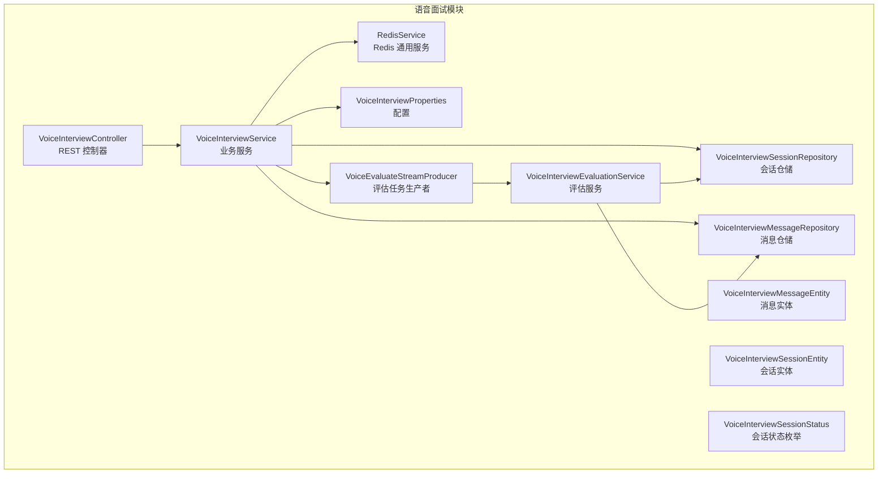
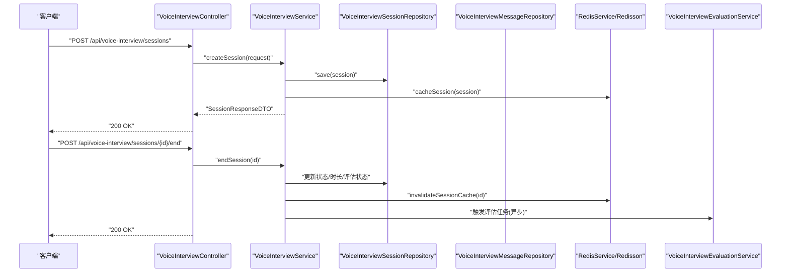
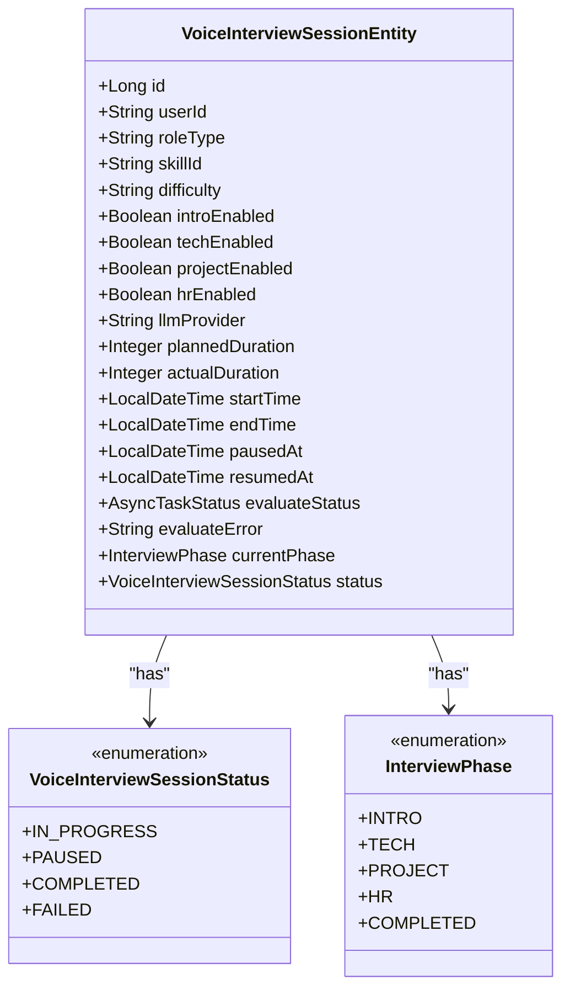
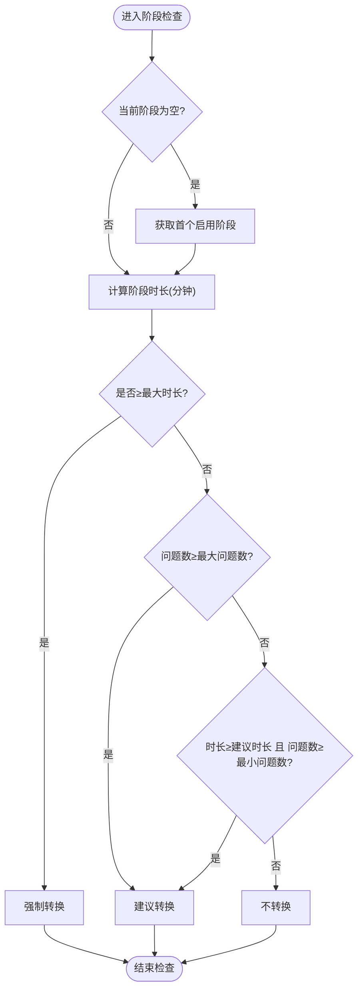
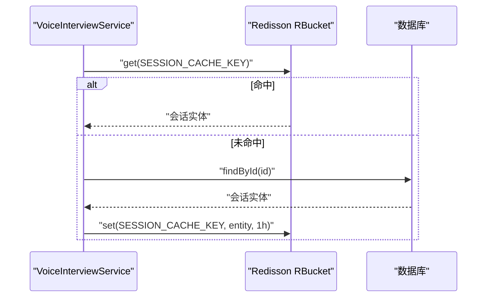
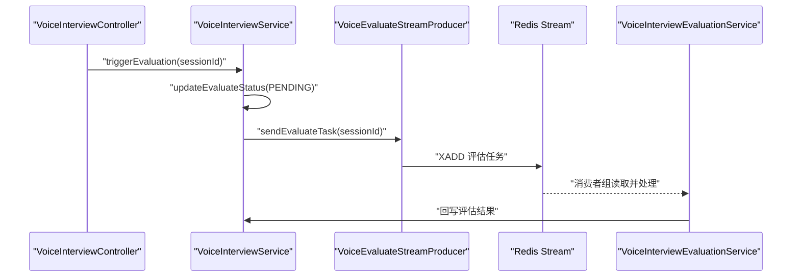
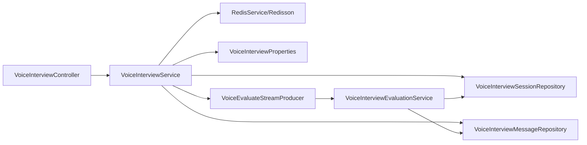

# 语音面试会话管理

<cite>
**本文引用的文件**
- [VoiceInterviewService.java](file://app/src/main/java/interview/guide/modules/voiceinterview/service/VoiceInterviewService.java)
- [VoiceInterviewSessionEntity.java](file://app/src/main/java/interview/guide/modules/voiceinterview/model/VoiceInterviewSessionEntity.java)
- [VoiceInterviewSessionStatus.java](file://app/src/main/java/interview/guide/modules/voiceinterview/model/VoiceInterviewSessionStatus.java)
- [VoiceInterviewSessionRepository.java](file://app/src/main/java/interview/guide/modules/voiceinterview/repository/VoiceInterviewSessionRepository.java)
- [VoiceInterviewController.java](file://app/src/main/java/interview/guide/modules/voiceinterview/controller/VoiceInterviewController.java)
- [CreateSessionRequest.java](file://app/src/main/java/interview/guide/modules/voiceinterview/dto/CreateSessionRequest.java)
- [SessionResponseDTO.java](file://app/src/main/java/interview/guide/modules/voiceinterview/dto/SessionResponseDTO.java)
- [VoiceInterviewProperties.java](file://app/src/main/java/interview/guide/modules/voiceinterview/config/VoiceInterviewProperties.java)
- [VoiceEvaluateStreamProducer.java](file://app/src/main/java/interview/guide/modules/voiceinterview/listener/VoiceEvaluateStreamProducer.java)
- [VoiceInterviewMessageRepository.java](file://app/src/main/java/interview/guide/modules/voiceinterview/repository/VoiceInterviewMessageRepository.java)
- [VoiceInterviewMessageEntity.java](file://app/src/main/java/interview/guide/modules/voiceinterview/model/VoiceInterviewMessageEntity.java)
- [SessionMetaDTO.java](file://app/src/main/java/interview/guide/modules/voiceinterview/dto/SessionMetaDTO.java)
- [VoiceInterviewEvaluationService.java](file://app/src/main/java/interview/guide/modules/voiceinterview/service/VoiceInterviewEvaluationService.java)
- [RedisService.java](file://app/src/main/java/interview/guide/infrastructure/redis/RedisService.java)
- [InterviewSessionCache.java](file://app/src/main/java/interview/guide/infrastructure/redis/InterviewSessionCache.java)
</cite>

## 目录
1. [简介](#简介)
2. [项目结构](#项目结构)
3. [核心组件](#核心组件)
4. [架构总览](#架构总览)
5. [详细组件分析](#详细组件分析)
6. [依赖分析](#依赖分析)
7. [性能考虑](#性能考虑)
8. [故障排查指南](#故障排查指南)
9. [结论](#结论)
10. [附录](#附录)

## 简介
本文件面向语音面试会话管理模块，系统性阐述 VoiceInterviewService 的核心能力与实现细节，覆盖会话生命周期（创建、结束、暂停、恢复）、阶段转换机制与状态跟踪、会话实体模型设计、Redis 缓存策略、业务规则与约束、以及完整 API 接口说明与使用示例。目标是帮助开发者与产品人员快速理解并正确使用该模块。

## 项目结构
语音面试模块位于 app/src/main/java/interview/guide/modules/voiceinterview 下，采用按职责分层组织：
- controller 层：对外暴露 REST API
- service 层：业务编排与规则控制
- repository 层：数据访问
- model/dto 层：实体与传输对象
- config：配置项
- listener：异步流处理
- handler：WebSocket 处理（不在本文详述）

图表来源
- [VoiceInterviewController.java:35-201](file://app/src/main/java/interview/guide/modules/voiceinterview/controller/VoiceInterviewController.java#L35-L201)
- [VoiceInterviewService.java:41-582](file://app/src/main/java/interview/guide/modules/voiceinterview/service/VoiceInterviewService.java#L41-L582)
- [VoiceInterviewEvaluationService.java:35-241](file://app/src/main/java/interview/guide/modules/voiceinterview/service/VoiceInterviewEvaluationService.java#L35-L241)
- [VoiceInterviewProperties.java:14-160](file://app/src/main/java/interview/guide/modules/voiceinterview/config/VoiceInterviewProperties.java#L14-L160)
- [VoiceEvaluateStreamProducer.java:17-62](file://app/src/main/java/interview/guide/modules/voiceinterview/listener/VoiceEvaluateStreamProducer.java#L17-L62)
- [RedisService.java:26-395](file://app/src/main/java/interview/guide/infrastructure/redis/RedisService.java#L26-L395)
- [VoiceInterviewSessionRepository.java:16-46](file://app/src/main/java/interview/guide/modules/voiceinterview/repository/VoiceInterviewSessionRepository.java#L16-L46)
- [VoiceInterviewMessageRepository.java:12-25](file://app/src/main/java/interview/guide/modules/voiceinterview/repository/VoiceInterviewMessageRepository.java#L12-L25)
- [VoiceInterviewMessageEntity.java:11-54](file://app/src/main/java/interview/guide/modules/voiceinterview/model/VoiceInterviewMessageEntity.java#L11-L54)
- [VoiceInterviewSessionEntity.java:13-122](file://app/src/main/java/interview/guide/modules/voiceinterview/model/VoiceInterviewSessionEntity.java#L13-L122)
- [VoiceInterviewSessionStatus.java:7-28](file://app/src/main/java/interview/guide/modules/voiceinterview/model/VoiceInterviewSessionStatus.java#L7-L28)

章节来源
- [VoiceInterviewController.java:35-201](file://app/src/main/java/interview/guide/modules/voiceinterview/controller/VoiceInterviewController.java#L35-L201)
- [VoiceInterviewService.java:41-582](file://app/src/main/java/interview/guide/modules/voiceinterview/service/VoiceInterviewService.java#L41-L582)

## 核心组件
- 会话实体模型：定义会话字段、阶段枚举、状态枚举、时间戳等。
- 会话仓储：提供按用户、状态、更新时间等查询能力。
- 语音面试服务：会话生命周期、阶段转换、暂停/恢复、消息持久化、Redis 缓存、评估触发与状态回写。
- 控制器：对外暴露 REST API，统一返回 Result 包装。
- 评估服务：基于对话历史与统一评估框架生成评估报告。
- Redis 服务：提供通用的缓存、Stream、分布式锁等能力。
- 配置：阶段时长/问题数阈值、音频参数、限流等。

章节来源
- [VoiceInterviewSessionEntity.java:13-122](file://app/src/main/java/interview/guide/modules/voiceinterview/model/VoiceInterviewSessionEntity.java#L13-L122)
- [VoiceInterviewSessionRepository.java:16-46](file://app/src/main/java/interview/guide/modules/voiceinterview/repository/VoiceInterviewSessionRepository.java#L16-L46)
- [VoiceInterviewService.java:41-582](file://app/src/main/java/interview/guide/modules/voiceinterview/service/VoiceInterviewService.java#L41-L582)
- [VoiceInterviewController.java:35-201](file://app/src/main/java/interview/guide/modules/voiceinterview/controller/VoiceInterviewController.java#L35-L201)
- [VoiceInterviewEvaluationService.java:35-241](file://app/src/main/java/interview/guide/modules/voiceinterview/service/VoiceInterviewEvaluationService.java#L35-L241)
- [RedisService.java:26-395](file://app/src/main/java/interview/guide/infrastructure/redis/RedisService.java#L26-L395)
- [VoiceInterviewProperties.java:14-160](file://app/src/main/java/interview/guide/modules/voiceinterview/config/VoiceInterviewProperties.java#L14-L160)

## 架构总览
语音面试会话管理采用“控制器-服务-仓储-缓存/流”的分层架构。会话状态与消息持久化在数据库，活跃会话通过 Redis 缓存加速读取；评估流程通过 Redis Stream 异步执行，避免阻塞主线程。

图表来源
- [VoiceInterviewController.java:46-79](file://app/src/main/java/interview/guide/modules/voiceinterview/controller/VoiceInterviewController.java#L46-L79)
- [VoiceInterviewService.java:63-124](file://app/src/main/java/interview/guide/modules/voiceinterview/service/VoiceInterviewService.java#L63-L124)
- [VoiceInterviewEvaluationService.java:52-85](file://app/src/main/java/interview/guide/modules/voiceinterview/service/VoiceInterviewEvaluationService.java#L52-L85)
- [RedisService.java:277-301](file://app/src/main/java/interview/guide/infrastructure/redis/RedisService.java#L277-L301)

## 详细组件分析

### 会话实体模型与状态
- 实体字段涵盖用户标识、角色模板、难度、简历ID、各阶段开关、LLM 提供商、计划/实际时长、起止时间、暂停/恢复时间、评估状态与错误信息等。
- 阶段枚举：INTRO、TECH、PROJECT、HR、COMPLETED。
- 状态枚举：IN_PROGRESS、PAUSED、COMPLETED、FAILED。

图表来源
- [VoiceInterviewSessionEntity.java:13-122](file://app/src/main/java/interview/guide/modules/voiceinterview/model/VoiceInterviewSessionEntity.java#L13-L122)
- [VoiceInterviewSessionStatus.java:7-28](file://app/src/main/java/interview/guide/modules/voiceinterview/model/VoiceInterviewSessionStatus.java#L7-L28)

章节来源
- [VoiceInterviewSessionEntity.java:13-122](file://app/src/main/java/interview/guide/modules/voiceinterview/model/VoiceInterviewSessionEntity.java#L13-L122)
- [VoiceInterviewSessionStatus.java:7-28](file://app/src/main/java/interview/guide/modules/voiceinterview/model/VoiceInterviewSessionStatus.java#L7-L28)

### 会话生命周期与阶段转换
- 生命周期：创建 → 进行中 → 暂停（可多次）→ 恢复 → 结束 → 评估（异步）。
- 阶段转换：根据启用的功能模块顺序（INTRO → TECH → PROJECT → HR → COMPLETED），getNextPhase 返回下一个启用阶段；startPhase 支持直接跳转到指定阶段。
- 强制转换与建议转换：
  - 强制转换：当前阶段达到最大时长。
  - 建议转换：达到最大问题数；或达到建议时长且问题数不低于最小值。
- 暂停/恢复：仅当状态为 IN_PROGRESS 或 PAUSED 时允许操作，分别记录暂停/恢复时间。

图表来源
- [VoiceInterviewService.java:384-428](file://app/src/main/java/interview/guide/modules/voiceinterview/service/VoiceInterviewService.java#L384-L428)
- [VoiceInterviewService.java:437-455](file://app/src/main/java/interview/guide/modules/voiceinterview/service/VoiceInterviewService.java#L437-L455)

章节来源
- [VoiceInterviewService.java:170-194](file://app/src/main/java/interview/guide/modules/voiceinterview/service/VoiceInterviewService.java#L170-L194)
- [VoiceInterviewService.java:384-455](file://app/src/main/java/interview/guide/modules/voiceinterview/service/VoiceInterviewService.java#L384-L455)

### Redis 缓存策略
- 缓存键设计：以 voice:interview:session:{id} 作为会话缓存键，便于按会话维度精确失效。
- TTL 设置：缓存时长为 1 小时，平衡热点命中与内存占用。
- 缓存失效：创建/结束/暂停/恢复/阶段切换均会更新缓存；结束会话时显式失效。
- 读取优先级：优先从 Redis Bucket 读取，未命中回源数据库；写入时同时落库并缓存。

图表来源
- [VoiceInterviewService.java:144-161](file://app/src/main/java/interview/guide/modules/voiceinterview/service/VoiceInterviewService.java#L144-L161)
- [VoiceInterviewService.java:543-558](file://app/src/main/java/interview/guide/modules/voiceinterview/service/VoiceInterviewService.java#L543-L558)

章节来源
- [VoiceInterviewService.java:52-582](file://app/src/main/java/interview/guide/modules/voiceinterview/service/VoiceInterviewService.java#L52-L582)

### 评估与异步流
- 触发评估：结束会话或手动触发时，将任务写入 Redis Stream，消费端异步生成评估报告并回写数据库。
- 评估状态：通过 session.evaluateStatus 与 evaluateError 记录状态与错误信息，前端轮询 /evaluation 接口获取结果。
- 评估服务：将消息历史转换为 QA 记录，推送到统一评估框架，生成整体评分、反馈与参考答案。

图表来源
- [VoiceInterviewController.java:167-199](file://app/src/main/java/interview/guide/modules/voiceinterview/controller/VoiceInterviewController.java#L167-L199)
- [VoiceInterviewService.java:534-538](file://app/src/main/java/interview/guide/modules/voiceinterview/service/VoiceInterviewService.java#L534-L538)
- [VoiceEvaluateStreamProducer.java:29-60](file://app/src/main/java/interview/guide/modules/voiceinterview/listener/VoiceEvaluateStreamProducer.java#L29-L60)
- [VoiceInterviewEvaluationService.java:52-85](file://app/src/main/java/interview/guide/modules/voiceinterview/service/VoiceInterviewEvaluationService.java#L52-L85)

章节来源
- [VoiceInterviewEvaluationService.java:35-241](file://app/src/main/java/interview/guide/modules/voiceinterview/service/VoiceInterviewEvaluationService.java#L35-L241)
- [VoiceInterviewService.java:517-538](file://app/src/main/java/interview/guide/modules/voiceinterview/service/VoiceInterviewService.java#L517-L538)

### API 接口说明与使用示例
- 创建会话
  - 方法：POST /api/voice-interview/sessions
  - 请求体：CreateSessionRequest（roleType/skillId/difficulty/resumeId/各阶段开关/计划时长/LLM 提供商）
  - 返回：SessionResponseDTO（包含 sessionId、当前阶段、状态、WebSocket URL）
- 获取会话
  - 方法：GET /api/voice-interview/sessions/{sessionId}
  - 返回：SessionResponseDTO
- 结束会话
  - 方法：POST /api/voice-interview/sessions/{sessionId}/end
  - 行为：更新状态为 COMPLETED，计算实际时长，触发评估异步任务
- 暂停会话
  - 方法：PUT /api/voice-interview/sessions/{sessionId}/pause
  - 请求体：{ reason: "user_initiated" | "timeout" }
- 恢复会话
  - 方法：PUT /api/voice-interview/sessions/{sessionId}/resume
  - 返回：SessionResponseDTO
- 获取会话列表
  - 方法：GET /api/voice-interview/sessions?userId=&status=
  - 返回：SessionMetaDTO 列表
- 获取对话历史
  - 方法：GET /api/voice-interview/sessions/{sessionId}/messages
  - 返回：消息 DTO 列表
- 获取/触发评估
  - GET /api/voice-interview/sessions/{sessionId}/evaluation
  - POST /api/voice-interview/sessions/{sessionId}/evaluation

章节来源
- [VoiceInterviewController.java:46-201](file://app/src/main/java/interview/guide/modules/voiceinterview/controller/VoiceInterviewController.java#L46-L201)
- [CreateSessionRequest.java:12-33](file://app/src/main/java/interview/guide/modules/voiceinterview/dto/CreateSessionRequest.java#L12-L33)
- [SessionResponseDTO.java:17-26](file://app/src/main/java/interview/guide/modules/voiceinterview/dto/SessionResponseDTO.java#L17-L26)
- [SessionMetaDTO.java:17-29](file://app/src/main/java/interview/guide/modules/voiceinterview/dto/SessionMetaDTO.java#L17-L29)

## 依赖分析
- 控制器依赖服务；服务依赖仓储、Redis、配置与评估生产者；评估服务依赖统一评估框架与 LLM 注册中心。
- 仓储接口提供按用户、状态、更新时间排序的查询，支撑会话列表展示与筛选。
- Redis 服务提供通用能力，包括缓存、Stream、分布式锁等。

图表来源
- [VoiceInterviewController.java:41-43](file://app/src/main/java/interview/guide/modules/voiceinterview/controller/VoiceInterviewController.java#L41-L43)
- [VoiceInterviewService.java:46-50](file://app/src/main/java/interview/guide/modules/voiceinterview/service/VoiceInterviewService.java#L46-L50)
- [VoiceInterviewEvaluationService.java:40-46](file://app/src/main/java/interview/guide/modules/voiceinterview/service/VoiceInterviewEvaluationService.java#L40-L46)
- [VoiceInterviewProperties.java:14-27](file://app/src/main/java/interview/guide/modules/voiceinterview/config/VoiceInterviewProperties.java#L14-L27)

章节来源
- [VoiceInterviewSessionRepository.java:16-46](file://app/src/main/java/interview/guide/modules/voiceinterview/repository/VoiceInterviewSessionRepository.java#L16-L46)
- [VoiceInterviewMessageRepository.java:12-25](file://app/src/main/java/interview/guide/modules/voiceinterview/repository/VoiceInterviewMessageRepository.java#L12-L25)
- [RedisService.java:26-395](file://app/src/main/java/interview/guide/infrastructure/redis/RedisService.java#L26-L395)

## 性能考虑
- Redis 缓存：对高频读取的会话实体进行缓存，减少数据库压力；TTL 1 小时适中，兼顾命中率与一致性。
- 异步评估：结束会话即触发评估任务，避免阻塞请求线程；通过 Redis Stream 实现高吞吐的消息传递。
- 数据库查询：列表接口按更新时间倒序，结合仓储提供的多字段查询，满足前端分页与筛选需求。
- 限流与并发：配置中包含每会话/每 IP/全局并发限制，可在网关或服务侧配合使用。

## 故障排查指南
- 会话不存在：控制器在查询评估状态或触发评估时若会话不存在，抛出业务异常；请确认 sessionId 正确。
- 状态非法：暂停/恢复仅在特定状态下允许；若报错，请检查当前状态与期望状态。
- 评估失败：评估服务捕获异常并回写 FAILED 状态与错误信息；前端可通过 /evaluation 接口查看错误详情。
- Redis 异常：缓存读写失败时，服务会回退到数据库；若持续失败，请检查 Redis 连接与权限。

章节来源
- [VoiceInterviewController.java:141-157](file://app/src/main/java/interview/guide/modules/voiceinterview/controller/VoiceInterviewController.java#L141-L157)
- [VoiceInterviewService.java:277-329](file://app/src/main/java/interview/guide/modules/voiceinterview/service/VoiceInterviewService.java#L277-L329)
- [VoiceInterviewEvaluationService.java:78-85](file://app/src/main/java/interview/guide/modules/voiceinterview/service/VoiceInterviewEvaluationService.java#L78-L85)

## 结论
语音面试会话管理模块通过清晰的分层设计与 Redis 缓存、异步评估机制，实现了高性能、可扩展的会话生命周期管理。阶段转换规则与状态机设计贴合面试流程，配置化的时长与问题阈值便于按场景调整。建议在生产环境中结合监控与告警，持续优化缓存命中率与评估耗时。

## 附录
- 会话实体字段与默认值：见实体类定义。
- 阶段配置：见 VoiceInterviewProperties.PhaseConfig 与 DurationConfig。
- Redis 缓存键前缀：voice:interview:session:。
- 评估流键：由常量定义（见评估生产者）。