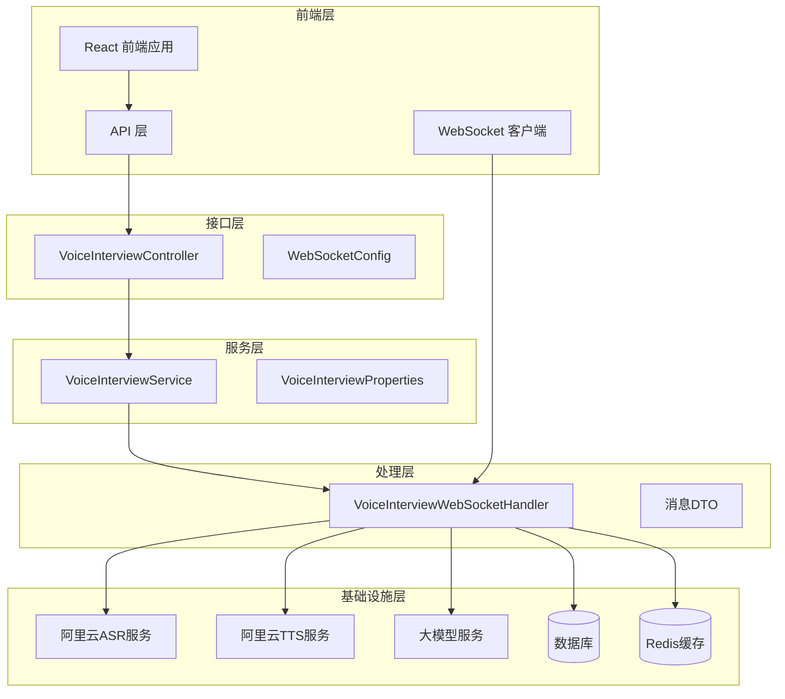
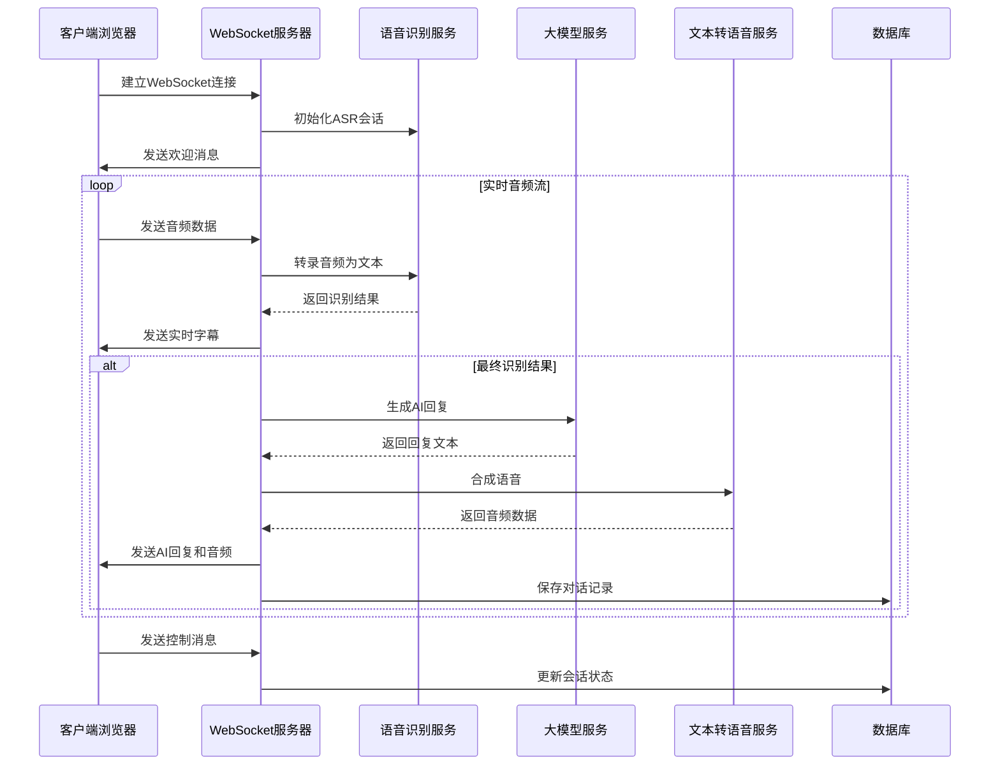
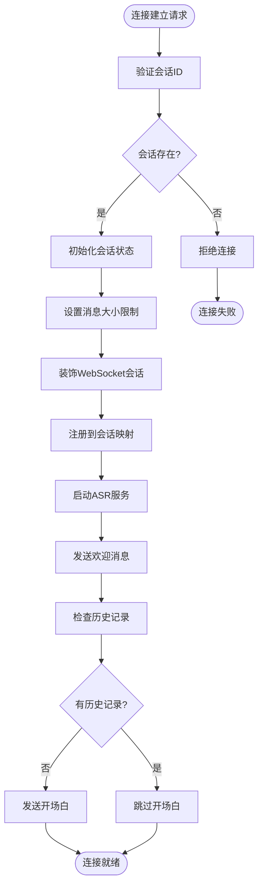
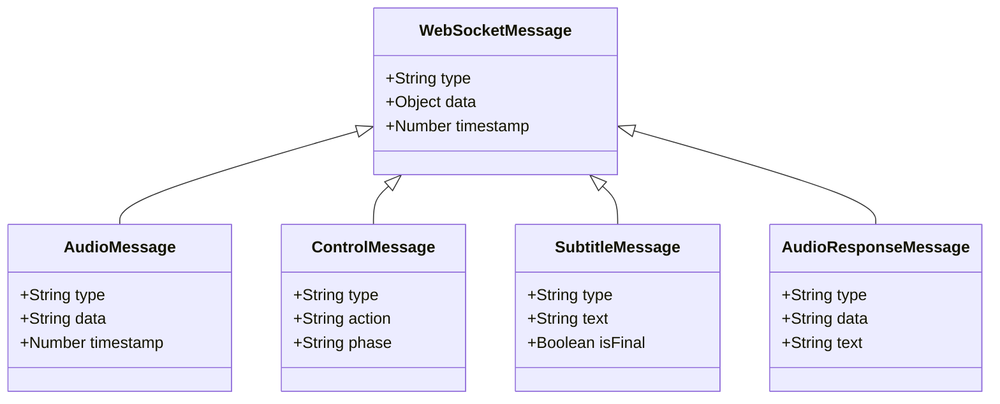
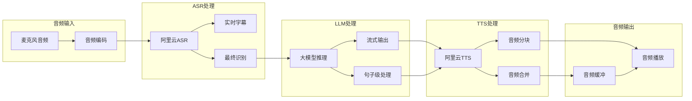
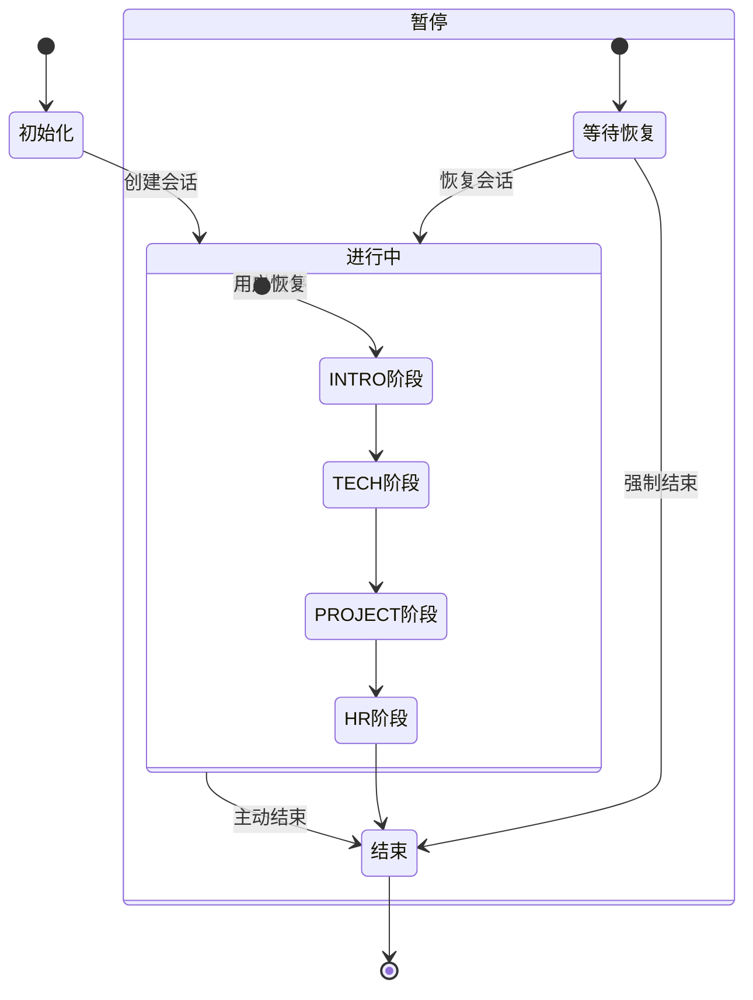
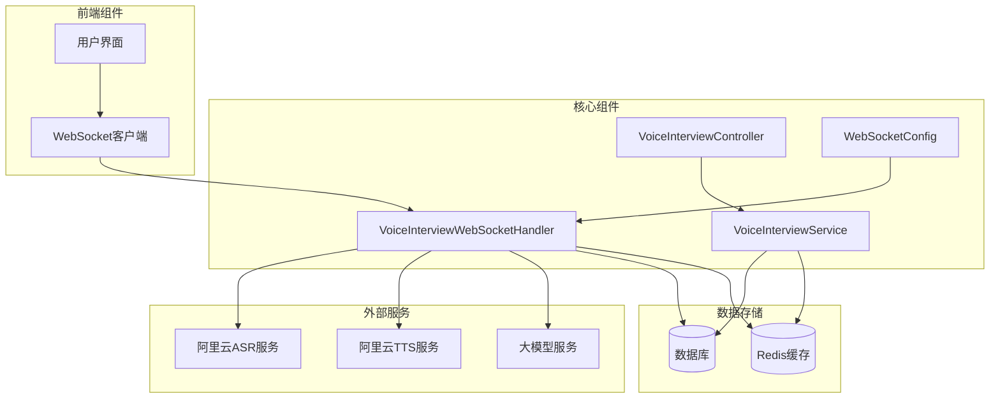
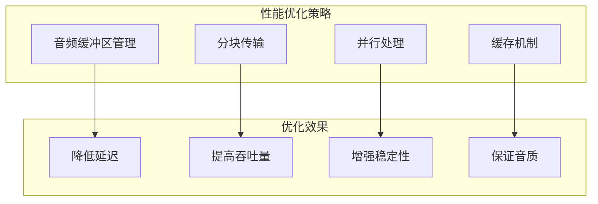

# 语音面试实时通信

<cite>
**本文档引用的文件**
- [WebSocketConfig.java](file://app/src/main/java/interview/guide/modules/voiceinterview/config/WebSocketConfig.java)
- [VoiceInterviewWebSocketHandler.java](file://app/src/main/java/interview/guide/modules/voiceinterview/handler/VoiceInterviewWebSocketHandler.java)
- [WebSocketControlMessage.java](file://app/src/main/java/interview/guide/modules/voiceinterview/dto/WebSocketControlMessage.java)
- [WebSocketSubtitleMessage.java](file://app/src/main/java/interview/guide/modules/voiceinterview/dto/WebSocketSubtitleMessage.java)
- [VoiceInterviewController.java](file://app/src/main/java/interview/guide/modules/voiceinterview/controller/VoiceInterviewController.java)
- [VoiceInterviewService.java](file://app/src/main/java/interview/guide/modules/voiceinterview/service/VoiceInterviewService.java)
- [VoiceInterviewProperties.java](file://app/src/main/java/interview/guide/modules/voiceinterview/config/VoiceInterviewProperties.java)
- [VoiceInterviewSessionEntity.java](file://app/src/main/java/interview/guide/modules/voiceinterview/model/VoiceInterviewSessionEntity.java)
- [voiceInterview.ts](file://frontend/src/api/voiceInterview.ts)
- [VoiceInterviewPage.tsx](file://frontend/src/pages/VoiceInterviewPage.tsx)
- [VoiceInterviewIntegrationTest.java](file://app/src/test/java/interview/guide/modules/voiceinterview/integration/VoiceInterviewIntegrationTest.java)
</cite>

## 目录
1. [简介](#简介)
2. [项目结构](#项目结构)
3. [核心组件](#核心组件)
4. [架构概览](#架构概览)
5. [详细组件分析](#详细组件分析)
6. [依赖关系分析](#依赖关系分析)
7. [性能考虑](#性能考虑)
8. [故障排除指南](#故障排除指南)
9. [结论](#结论)

## 简介

语音面试实时通信系统是一个基于WebSocket的全双工实时通信平台，专为在线语音面试场景设计。该系统实现了高质量的双向音频流传输、实时字幕显示、智能语音识别和自然语言处理功能。

系统采用Spring Boot + React的技术栈，结合阿里云的语音服务（ASR/TTS）和大模型推理能力，为用户提供沉浸式的语音面试体验。整个系统支持多阶段面试流程、智能暂停/恢复机制、以及完整的会话生命周期管理。

## 项目结构

语音面试实时通信系统采用分层架构设计，主要分为以下层次：



**图表来源**
- [WebSocketConfig.java:14-23](file://app/src/main/java/interview/guide/modules/voiceinterview/config/WebSocketConfig.java#L14-L23)
- [VoiceInterviewController.java:35-39](file://app/src/main/java/interview/guide/modules/voiceinterview/controller/VoiceInterviewController.java#L35-L39)
- [VoiceInterviewService.java:41-44](file://app/src/main/java/interview/guide/modules/voiceinterview/service/VoiceInterviewService.java#L41-L44)

**章节来源**
- [WebSocketConfig.java:1-25](file://app/src/main/java/interview/guide/modules/voiceinterview/config/WebSocketConfig.java#L1-L25)
- [VoiceInterviewController.java:25-39](file://app/src/main/java/interview/guide/modules/voiceinterview/controller/VoiceInterviewController.java#L25-L39)

## 核心组件

### WebSocket 配置组件

系统使用Spring WebSocket框架提供WebSocket连接支持，配置类负责注册WebSocket处理器和设置连接拦截器。

### 语音面试WebSocket处理器

核心的消息处理器，负责：
- WebSocket连接建立和维护
- 实时音频数据处理
- 控制消息解析和执行
- 字幕消息生成和分发
- 会话状态管理和生命周期控制

### 消息DTO组件

定义了系统中使用的标准消息格式：
- 控制消息：用于会话控制操作
- 字幕消息：用于实时字幕显示
- 音频消息：用于音频数据传输

### 语音面试服务

提供会话管理、状态控制、数据持久化等功能：
- 会话创建、暂停、恢复、结束
- 阶段转换逻辑
- Redis缓存管理
- 评估任务触发

**章节来源**
- [VoiceInterviewWebSocketHandler.java:56-103](file://app/src/main/java/interview/guide/modules/voiceinterview/handler/VoiceInterviewWebSocketHandler.java#L56-L103)
- [WebSocketControlMessage.java:14-18](file://app/src/main/java/interview/guide/modules/voiceinterview/dto/WebSocketControlMessage.java#L14-L18)
- [WebSocketSubtitleMessage.java:12-16](file://app/src/main/java/interview/guide/modules/voiceinterview/dto/WebSocketSubtitleMessage.java#L12-L16)

## 架构概览

系统采用事件驱动的微服务架构，实现了完整的实时通信链路：



**图表来源**
- [VoiceInterviewWebSocketHandler.java:139-169](file://app/src/main/java/interview/guide/modules/voiceinterview/handler/VoiceInterviewWebSocketHandler.java#L139-L169)
- [VoiceInterviewWebSocketHandler.java:300-345](file://app/src/main/java/interview/guide/modules/voiceinterview/handler/VoiceInterviewWebSocketHandler.java#L300-L345)
- [VoiceInterviewWebSocketHandler.java:556-748](file://app/src/main/java/interview/guide/modules/voiceinterview/handler/VoiceInterviewWebSocketHandler.java#L556-L748)

## 详细组件分析

### WebSocket连接建立机制

系统实现了完整的WebSocket连接生命周期管理：



**图表来源**
- [VoiceInterviewWebSocketHandler.java:139-169](file://app/src/main/java/interview/guide/modules/voiceinterview/handler/VoiceInterviewWebSocketHandler.java#L139-L169)
- [VoiceInterviewWebSocketHandler.java:208-251](file://app/src/main/java/interview/guide/modules/voiceinterview/handler/VoiceInterviewWebSocketHandler.java#L208-L251)

### 实时消息处理流程

系统支持多种消息类型的实时处理：



**图表来源**
- [WebSocketControlMessage.java:14-18](file://app/src/main/java/interview/guide/modules/voiceinterview/dto/WebSocketControlMessage.java#L14-L18)
- [WebSocketSubtitleMessage.java:12-16](file://app/src/main/java/interview/guide/modules/voiceinterview/dto/WebSocketSubtitleMessage.java#L12-L16)

### 语音处理管道

系统实现了完整的语音处理流水线：



**图表来源**
- [VoiceInterviewWebSocketHandler.java:487-508](file://app/src/main/java/interview/guide/modules/voiceinterview/handler/VoiceInterviewWebSocketHandler.java#L487-L508)
- [VoiceInterviewWebSocketHandler.java:587-729](file://app/src/main/java/interview/guide/modules/voiceinterview/handler/VoiceInterviewWebSocketHandler.java#L587-L729)

### 会话状态管理

系统实现了复杂的会话状态管理机制：



**图表来源**
- [VoiceInterviewSessionEntity.java:118-121](file://app/src/main/java/interview/guide/modules/voiceinterview/model/VoiceInterviewSessionEntity.java#L118-L121)
- [VoiceInterviewService.java:170-194](file://app/src/main/java/interview/guide/modules/voiceinterview/service/VoiceInterviewService.java#L170-L194)

**章节来源**
- [VoiceInterviewWebSocketHandler.java:139-380](file://app/src/main/java/interview/guide/modules/voiceinterview/handler/VoiceInterviewWebSocketHandler.java#L139-L380)
- [VoiceInterviewService.java:101-124](file://app/src/main/java/interview/guide/modules/voiceinterview/service/VoiceInterviewService.java#L101-L124)

## 依赖关系分析

系统各组件之间的依赖关系如下：



**图表来源**
- [VoiceInterviewWebSocketHandler.java:58-64](file://app/src/main/java/interview/guide/modules/voiceinterview/handler/VoiceInterviewWebSocketHandler.java#L58-L64)
- [VoiceInterviewService.java:46-50](file://app/src/main/java/interview/guide/modules/voiceinterview/service/VoiceInterviewService.java#L46-L50)

### 组件耦合度分析

系统采用了松耦合的设计原则：
- **低耦合**：WebSocket处理器与具体服务实现解耦
- **高内聚**：每个组件职责明确，功能单一
- **可扩展性**：通过接口和抽象类支持功能扩展

**章节来源**
- [VoiceInterviewWebSocketHandler.java:1-56](file://app/src/main/java/interview/guide/modules/voiceinterview/handler/VoiceInterviewWebSocketHandler.java#L1-L56)
- [VoiceInterviewService.java:1-44](file://app/src/main/java/interview/guide/modules/voiceinterview/service/VoiceInterviewService.java#L1-L44)

## 性能考虑

### WebSocket连接优化

系统在WebSocket连接方面采用了多项优化策略：

1. **连接装饰器**：使用`ConcurrentWebSocketSessionDecorator`提高并发处理能力
2. **消息大小限制**：合理设置文本和二进制消息大小限制
3. **虚拟线程池**：使用Java虚拟线程处理阻塞操作
4. **调度器优化**：专用的调度线程池处理STT合并

### 音频处理性能



### 内存管理

系统实现了完善的内存管理机制：
- **会话状态缓存**：使用ConcurrentHashMap存储会话状态
- **音频缓存**：预加载和缓存开场音频
- **资源清理**：连接关闭时及时释放资源

**章节来源**
- [VoiceInterviewWebSocketHandler.java:94-103](file://app/src/main/java/interview/guide/modules/voiceinterview/handler/VoiceInterviewWebSocketHandler.java#L94-L103)
- [VoiceInterviewWebSocketHandler.java:106-127](file://app/src/main/java/interview/guide/modules/voiceinterview/handler/VoiceInterviewWebSocketHandler.java#L106-L127)

## 故障排除指南

### 常见问题及解决方案

#### WebSocket连接问题

| 问题类型 | 症状 | 解决方案 |
|---------|------|----------|
| 连接超时 | 页面提示连接失败 | 检查网络连接，确认服务器可达性 |
| 断线重连 | 自动重连但失败 | 检查服务器配置，查看日志信息 |
| 消息丢失 | 部分消息未收到 | 检查消息大小限制，优化网络环境 |

#### 音频处理问题

| 问题类型 | 症状 | 解决方案 |
|---------|------|----------|
| 识别错误 | 语音识别结果不准确 | 检查音频质量，调整采样率设置 |
| 延迟过高 | 回答延迟明显 | 优化网络带宽，减少并发连接数 |
| 音频卡顿 | 音频播放不流畅 | 检查音频缓冲区配置，优化TTS服务 |

#### 会话管理问题

| 问题类型 | 症状 | 解决方案 |
|---------|------|----------|
| 会话状态异常 | 会话状态不正确 | 检查状态转换逻辑，查看数据库状态 |
| 数据不一致 | 历史记录缺失 | 检查数据持久化机制，确认事务处理 |
| 缓存失效 | 缓存数据过期 | 检查Redis配置，调整TTL设置 |

### 调试工具和方法

#### 前端调试

```typescript
// WebSocket连接调试
const debugWS = new VoiceInterviewWebSocket(
  sessionId, 
  wsUrl, 
  {
    onOpen: () => console.log('WebSocket连接已建立'),
    onMessage: (msg) => console.log('收到消息:', msg),
    onError: (error) => console.error('WebSocket错误:', error),
    onClose: (event) => console.log('连接关闭:', event)
  }
);
```

#### 后端调试

```java
// 添加调试日志
log.info("WebSocket连接建立: sessionId={}", sessionId);
log.debug("音频数据大小: {} bytes", audioData.length);
log.warn("Large message detected: {}KB", messageSizeKB);
```

**章节来源**
- [VoiceInterviewWebSocketHandler.java:383-385](file://app/src/main/java/interview/guide/modules/voiceinterview/handler/VoiceInterviewWebSocketHandler.java#L383-L385)
- [VoiceInterviewPage.tsx:293-355](file://frontend/src/pages/VoiceInterviewPage.tsx#L293-L355)

## 结论

语音面试实时通信系统是一个功能完整、性能优异的实时通信平台。系统通过精心设计的架构和优化策略，实现了高质量的语音面试体验。

### 主要优势

1. **实时性强**：采用WebSocket实现全双工通信，支持低延迟音频传输
2. **功能丰富**：集成了ASR、LLM、TTS等多种AI服务能力
3. **用户体验佳**：提供流畅的字幕显示和音频播放体验
4. **可扩展性好**：模块化设计便于功能扩展和维护
5. **稳定性高**：完善的错误处理和重连机制

### 技术亮点

- **事件驱动架构**：基于Spring WebSocket的事件驱动设计
- **多线程优化**：使用虚拟线程和专用调度器提升性能
- **智能缓存**：Redis缓存和音频预加载机制
- **容错处理**：完善的异常捕获和恢复机制

### 改进建议

1. **安全增强**：增加连接认证和消息加密机制
2. **监控完善**：添加更详细的性能指标和监控告警
3. **国际化支持**：扩展多语言支持能力
4. **移动端优化**：针对移动设备进行专门优化

该系统为在线语音面试提供了坚实的技术基础，能够满足现代企业对智能化面试系统的需求。