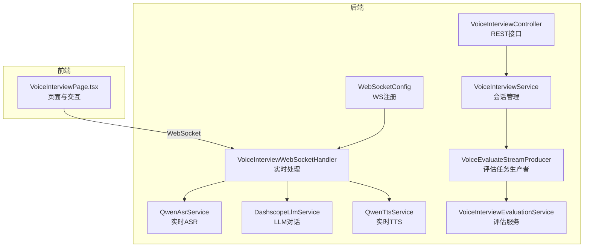
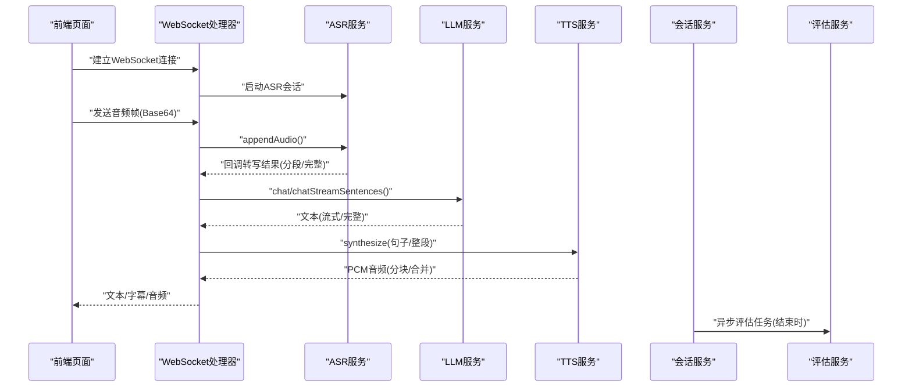
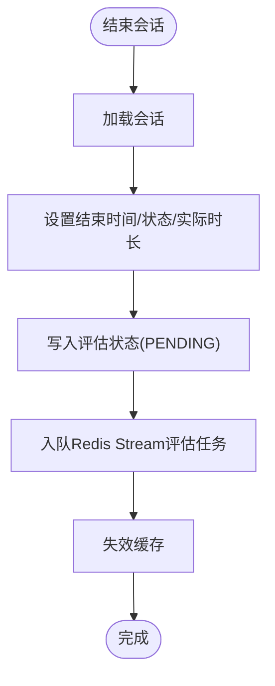
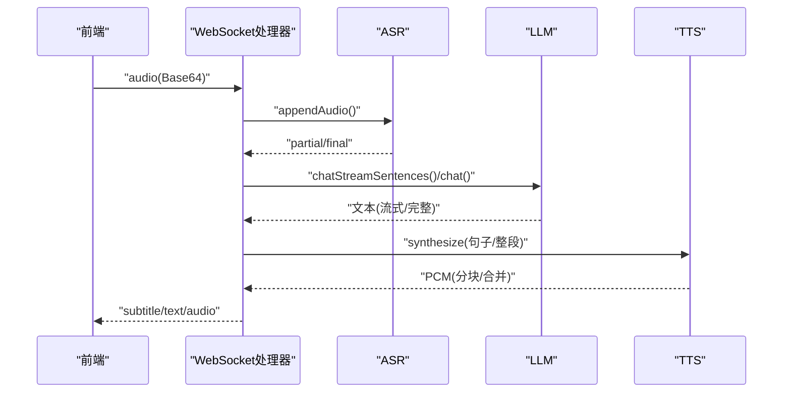
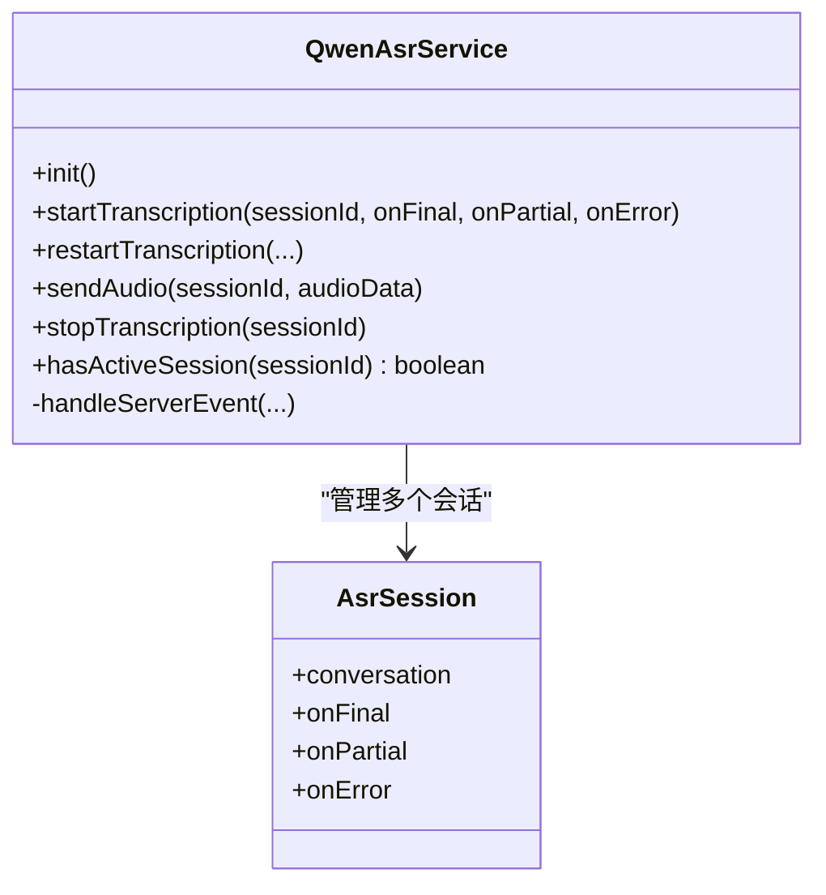
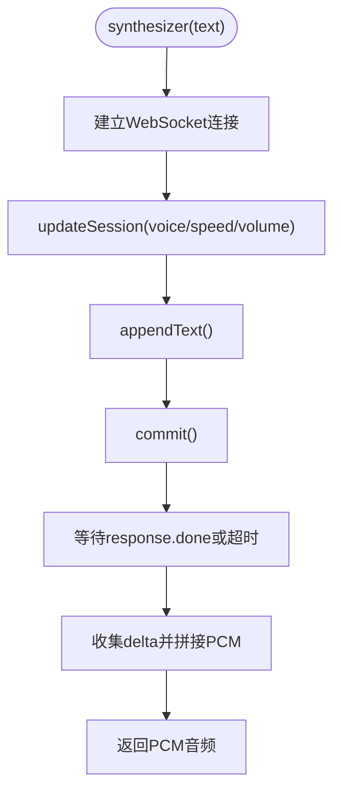
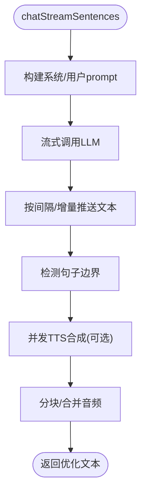
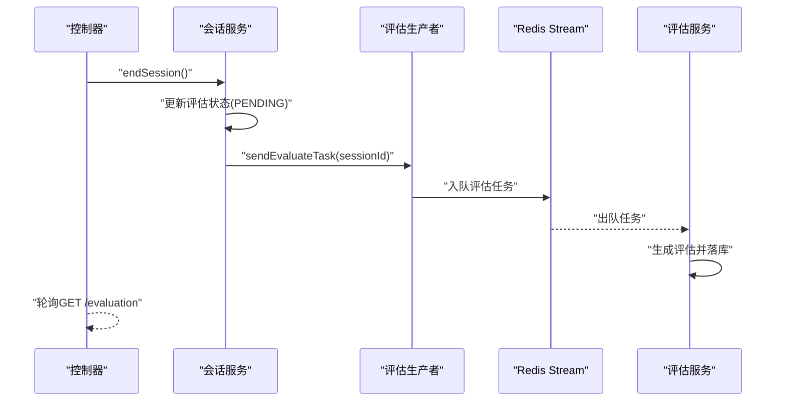
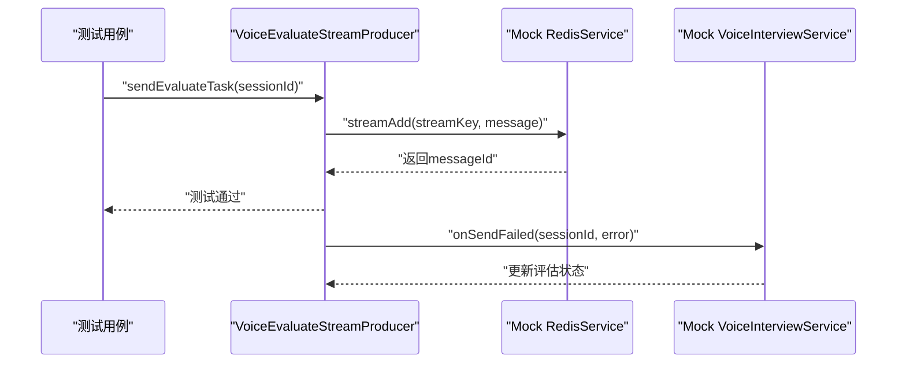
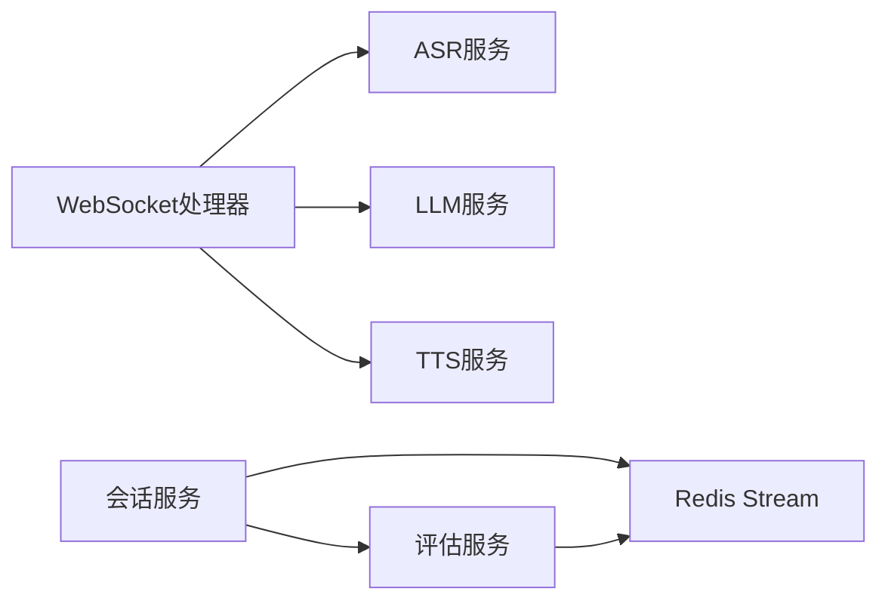

# 语音面试服务

<cite>
**本文档引用的文件**
- [VoiceInterviewService.java](file://app/src/main/java/interview/guide/modules/voiceinterview/service/VoiceInterviewService.java)
- [QwenAsrService.java](file://app/src/main/java/interview/guide/modules/voiceinterview/service/QwenAsrService.java)
- [QwenTtsService.java](file://app/src/main/java/interview/guide/modules/voiceinterview/service/QwenTtsService.java)
- [DashscopeLlmService.java](file://app/src/main/java/interview/guide/modules/voiceinterview/service/DashscopeLlmService.java)
- [VoiceInterviewWebSocketHandler.java](file://app/src/main/java/interview/guide/modules/voiceinterview/handler/VoiceInterviewWebSocketHandler.java)
- [WebSocketConfig.java](file://app/src/main/java/interview/guide/modules/voiceinterview/config/WebSocketConfig.java)
- [VoiceInterviewProperties.java](file://app/src/main/java/interview/guide/modules/voiceinterview/config/VoiceInterviewProperties.java)
- [VoiceInterviewController.java](file://app/src/main/java/interview/guide/modules/voiceinterview/controller/VoiceInterviewController.java)
- [VoiceInterviewSessionEntity.java](file://app/src/main/java/interview/guide/modules/voiceinterview/model/VoiceInterviewSessionEntity.java)
- [VoiceInterviewMessageDTO.java](file://app/src/main/java/interview/guide/modules/voiceinterview/dto/VoiceInterviewMessageDTO.java)
- [VoiceEvaluateStreamProducer.java](file://app/src/main/java/interview/guide/modules/voiceinterview/listener/VoiceEvaluateStreamProducer.java)
- [VoiceInterviewEvaluationService.java](file://app/src/main/java/interview/guide/modules/voiceinterview/service/VoiceInterviewEvaluationService.java)
- [CreateSessionRequest.java](file://app/src/main/java/interview/guide/modules/voiceinterview/dto/CreateSessionRequest.java)
- [SessionResponseDTO.java](file://app/src/main/java/interview/guide/modules/voiceinterview/dto/SessionResponseDTO.java)
- [VoiceInterviewPage.tsx](file://frontend/src/pages/VoiceInterviewPage.tsx)
- [VoiceInterviewServiceTest.java](file://app/src/test/java/interview/guide/modules/voiceinterview/service/VoiceInterviewServiceTest.java)
- [VoiceInterviewIntegrationTest.java](file://app/src/test/java/interview/guide/modules/voiceinterview/integration/VoiceInterviewIntegrationTest.java)
- [AbstractStreamProducer.java](file://app/src/main/java/interview/guide/common/async/AbstractStreamProducer.java)
</cite>

## 更新摘要
**所做更改**
- 新增测试现代化章节，详细介绍VoiceEvaluateStreamProducer mock注入测试
- 更新Redis验证逻辑现代化相关内容
- 增加测试方法优化的具体示例和最佳实践
- 完善测试覆盖率分析和质量保证措施

## 目录
1. [简介](#简介)
2. [项目结构](#项目结构)
3. [核心组件](#核心组件)
4. [架构总览](#架构总览)
5. [详细组件分析](#详细组件分析)
6. [测试现代化](#测试现代化)
7. [依赖关系分析](#依赖关系分析)
8. [性能考虑](#性能考虑)
9. [故障排查指南](#故障排查指南)
10. [结论](#结论)
11. [附录](#附录)

## 简介
本项目提供一套完整的"语音面试服务"，覆盖实时语音处理、AI对话、语音合成与评估反馈的全链路能力。系统采用"WebSocket 实时双向流 + 多模型服务"的架构，支持用户麦克风音频实时上传、云端ASR识别、LLM多轮对话、TTS语音合成，并在面试结束后进行结构化评估。

## 项目结构
后端采用Spring Boot工程，语音面试相关模块位于 app/src/main/java/interview/guide/modules/voiceinterview 下，包含服务层、控制器、WebSocket处理器、配置与实体等。前端位于 frontend/src，提供语音面试页面与交互逻辑。

**图表来源**
- [VoiceInterviewController.java:35-201](file://app/src/main/java/interview/guide/modules/voiceinterview/controller/VoiceInterviewController.java#L35-L201)
- [VoiceInterviewService.java:44-582](file://app/src/main/java/interview/guide/modules/voiceinterview/service/VoiceInterviewService.java#L44-L582)
- [WebSocketConfig.java:14-24](file://app/src/main/java/interview/guide/modules/voiceinterview/config/WebSocketConfig.java#L14-L24)
- [VoiceInterviewWebSocketHandler.java:53-800](file://app/src/main/java/interview/guide/modules/voiceinterview/handler/VoiceInterviewWebSocketHandler.java#L53-L800)
- [QwenAsrService.java:47-625](file://app/src/main/java/interview/guide/modules/voiceinterview/service/QwenAsrService.java#L47-L625)
- [DashscopeLlmService.java:22-246](file://app/src/main/java/interview/guide/modules/voiceinterview/service/DashscopeLlmService.java#L22-L246)
- [QwenTtsService.java:42-397](file://app/src/main/java/interview/guide/modules/voiceinterview/service/QwenTtsService.java#L42-L397)
- [VoiceInterviewEvaluationService.java:35-241](file://app/src/main/java/interview/guide/modules/voiceinterview/service/VoiceInterviewEvaluationService.java#L35-L241)
- [VoiceEvaluateStreamProducer.java:17-62](file://app/src/main/java/interview/guide/modules/voiceinterview/listener/VoiceEvaluateStreamProducer.java#L17-L62)
- [VoiceInterviewPage.tsx:16-200](file://frontend/src/pages/VoiceInterviewPage.tsx#L16-L200)

**章节来源**
- [VoiceInterviewController.java:35-201](file://app/src/main/java/interview/guide/modules/voiceinterview/controller/VoiceInterviewController.java#L35-L201)
- [WebSocketConfig.java:14-24](file://app/src/main/java/interview/guide/modules/voiceinterview/config/WebSocketConfig.java#L14-L24)

## 核心组件
- 会话管理与生命周期：VoiceInterviewService负责会话创建、结束、暂停/恢复、阶段切换、消息持久化与Redis缓存。
- 实时ASR：QwenAsrService封装DashScope qwen3-asr-flash-realtime，支持多会话并发、VAD自动断句、回调驱动的实时转写。
- AI对话：DashscopeLlmService基于Spring AI ChatClient，支持流式与非流式对话，具备句子级边界检测与文本优化。
- 实时TTS：QwenTtsService封装qwen-tts-realtime，支持commit模式、PCM音频合成与事件驱动的音频块收集。
- WebSocket实时处理：VoiceInterviewWebSocketHandler实现完整的"用户音频→ASR→LLM→TTS→AI音频"流水线，含回声抑制、分块/合并音频推送、并发TTS控制。
- 评估与异步处理：VoiceInterviewEvaluationService负责评估生成与落库；VoiceEvaluateStreamProducer通过Redis Stream异步触发评估。
- 配置中心：VoiceInterviewProperties集中管理各组件参数（ASR/TTS模型、采样率、并发、节流、音频格式等）。

**章节来源**
- [VoiceInterviewService.java:44-582](file://app/src/main/java/interview/guide/modules/voiceinterview/service/VoiceInterviewService.java#L44-L582)
- [QwenAsrService.java:47-625](file://app/src/main/java/interview/guide/modules/voiceinterview/service/QwenAsrService.java#L47-L625)
- [DashscopeLlmService.java:22-246](file://app/src/main/java/interview/guide/modules/voiceinterview/service/DashscopeLlmService.java#L22-L246)
- [QwenTtsService.java:42-397](file://app/src/main/java/interview/guide/modules/voiceinterview/service/QwenTtsService.java#L42-L397)
- [VoiceInterviewWebSocketHandler.java:53-800](file://app/src/main/java/interview/guide/modules/voiceinterview/handler/VoiceInterviewWebSocketHandler.java#L53-L800)
- [VoiceInterviewEvaluationService.java:35-241](file://app/src/main/java/interview/guide/modules/voiceinterview/service/VoiceInterviewEvaluationService.java#L35-L241)
- [VoiceInterviewProperties.java:14-160](file://app/src/main/java/interview/guide/modules/voiceinterview/config/VoiceInterviewProperties.java#L14-L160)

## 架构总览
系统采用"REST + WebSocket + 异步评估"的混合架构。REST用于会话生命周期管理与评估查询；WebSocket承载实时音频/文本双向流；评估通过Redis Stream异步执行，避免阻塞主流程。

**图表来源**
- [VoiceInterviewWebSocketHandler.java:396-748](file://app/src/main/java/interview/guide/modules/voiceinterview/handler/VoiceInterviewWebSocketHandler.java#L396-L748)
- [VoiceInterviewController.java:74-79](file://app/src/main/java/interview/guide/modules/voiceinterview/controller/VoiceInterviewController.java#L74-L79)
- [VoiceInterviewEvaluationService.java:52-85](file://app/src/main/java/interview/guide/modules/voiceinterview/service/VoiceInterviewEvaluationService.java#L52-L85)

## 详细组件分析

### 会话管理（VoiceInterviewService）
- 职责：创建/结束/暂停/恢复会话；阶段推进；消息持久化；Redis缓存；评估状态更新与触发。
- 关键点：
  - 会话缓存：使用Redisson Bucket缓存，TTL 1小时，命中优先返回，未命中回源数据库。
  - 阶段推进：根据配置的时长/问题数规则判断是否进入下一阶段。
  - 评估触发：结束会话时写入评估状态并入队Redis Stream异步评估。
- 并发与一致性：事务性操作保证会话与消息的一致性；缓存失效与更新策略避免脏读。

**图表来源**
- [VoiceInterviewService.java:101-124](file://app/src/main/java/interview/guide/modules/voiceinterview/service/VoiceInterviewService.java#L101-L124)
- [VoiceInterviewService.java:534-538](file://app/src/main/java/interview/guide/modules/voiceinterview/service/VoiceInterviewService.java#L534-L538)
- [VoiceEvaluateStreamProducer.java:29-49](file://app/src/main/java/interview/guide/modules/voiceinterview/listener/VoiceEvaluateStreamProducer.java#L29-L49)

**章节来源**
- [VoiceInterviewService.java:44-582](file://app/src/main/java/interview/guide/modules/voiceinterview/service/VoiceInterviewService.java#L44-L582)
- [VoiceInterviewSessionEntity.java:19-122](file://app/src/main/java/interview/guide/modules/voiceinterview/model/VoiceInterviewSessionEntity.java#L19-L122)

### WebSocket实时处理（VoiceInterviewWebSocketHandler）
- 职责：接收用户音频帧，转发至ASR；接收ASR结果，触发LLM；LLM文本经TTS合成后推送给前端；管理会话状态、回声抑制、分块/合并音频推送。
- 关键点：
  - 会话状态机：维护每个sessionId的状态，包括AI正在说话、冷却期、合并缓冲区等。
  - 回声抑制：AI说话期间丢弃麦克风输入，避免回声触发。
  - 分块/合并推送：可配置"分块音频推送"，句子完成后立即播放，提升感知时延。
  - 并发控制：虚拟线程池执行阻塞操作，调度线程专注合并与调度。
  - 错误处理：ASR断线自动重启；异常映射为用户友好提示。
- 前端对接：支持"submit"控制消息触发LLM管线；文本/字幕/音频三路消息类型。

**图表来源**
- [VoiceInterviewWebSocketHandler.java:396-748](file://app/src/main/java/interview/guide/modules/voiceinterview/handler/VoiceInterviewWebSocketHandler.java#L396-L748)
- [VoiceInterviewWebSocketHandler.java:793-800](file://app/src/main/java/interview/guide/modules/voiceinterview/handler/VoiceInterviewWebSocketHandler.java#L793-L800)

**章节来源**
- [VoiceInterviewWebSocketHandler.java:53-800](file://app/src/main/java/interview/guide/modules/voiceinterview/handler/VoiceInterviewWebSocketHandler.java#L53-L800)
- [WebSocketConfig.java:14-24](file://app/src/main/java/interview/guide/modules/voiceinterview/config/WebSocketConfig.java#L14-L24)

### 语音识别（QwenAsrService）
- 能力：基于DashScope qwen3-asr-flash-realtime，支持服务器端VAD、实时转写、断线重连、回调驱动。
- 关键点：
  - 多会话并发：ConcurrentHashMap管理会话；每个会话独立OmniRealtimeConversation。
  - 断线恢复：捕获异常后停止旧连接并重建，验证重连成功。
  - 事件解析：统一处理session.created/session.updated/conversation.*事件，提取final/partial文本。
- 参数：模型、语言、采样率、VAD类型与阈值、静默时长等均来自配置。

**图表来源**
- [QwenAsrService.java:47-625](file://app/src/main/java/interview/guide/modules/voiceinterview/service/QwenAsrService.java#L47-L625)

**章节来源**
- [QwenAsrService.java:47-625](file://app/src/main/java/interview/guide/modules/voiceinterview/service/QwenAsrService.java#L47-L625)
- [VoiceInterviewProperties.java:124-135](file://app/src/main/java/interview/guide/modules/voiceinterview/config/VoiceInterviewProperties.java#L124-L135)

### 语音合成（QwenTtsService）
- 能力：基于DashScope qwen-tts-realtime，commit模式、同步合成、事件驱动收集音频块。
- 关键点：
  - 同步合成：使用CountDownLatch等待完成，30秒超时保护。
  - 音频格式：默认PCM 24kHz单声道16bit。
  - 事件处理：收集response.audio.delta，解码后拼接为完整音频。
- 参数：模型、声音、语速、音量、语言类型等来自配置。

**图表来源**
- [QwenTtsService.java:107-222](file://app/src/main/java/interview/guide/modules/voiceinterview/service/QwenTtsService.java#L107-L222)
- [QwenTtsService.java:263-340](file://app/src/main/java/interview/guide/modules/voiceinterview/service/QwenTtsService.java#L263-L340)

**章节来源**
- [QwenTtsService.java:42-397](file://app/src/main/java/interview/guide/modules/voiceinterview/service/QwenTtsService.java#L42-L397)
- [VoiceInterviewProperties.java:138-148](file://app/src/main/java/interview/guide/modules/voiceinterview/config/VoiceInterviewProperties.java#L138-L148)

### AI对话（DashscopeLlmService）
- 能力：基于Spring AI ChatClient，支持流式与非流式对话；句子级边界检测；文本优化（截断到句末、去除多余标记）。
- 关键点：
  - 流式推送：按配置的最小推送间隔与字符增量推送中间文本。
  - 句子边界：检测常见中文句末标点，逐句触发TTS（分块音频）。
  - 错误映射：将常见错误（认证、超时、配额、网络）映射为用户友好提示。
- 上下文：结合简历与历史对话构建prompt，确保个性化回复。

**图表来源**
- [DashscopeLlmService.java:59-153](file://app/src/main/java/interview/guide/modules/voiceinterview/service/DashscopeLlmService.java#L59-L153)
- [VoiceInterviewWebSocketHandler.java:587-748](file://app/src/main/java/interview/guide/modules/voiceinterview/handler/VoiceInterviewWebSocketHandler.java#L587-L748)

**章节来源**
- [DashscopeLlmService.java:22-246](file://app/src/main/java/interview/guide/modules/voiceinterview/service/DashscopeLlmService.java#L22-L246)
- [VoiceInterviewProperties.java:29-52](file://app/src/main/java/interview/guide/modules/voiceinterview/config/VoiceInterviewProperties.java#L29-L52)

### 评估与异步处理
- 评估触发：结束会话时写入评估状态并入队Redis Stream。
- 评估执行：异步消费者拉取任务，读取会话消息，构建QA记录，调用统一评估服务生成报告并落库。
- 查询接口：前端轮询评估状态，完成后获取评估详情。

**图表来源**
- [VoiceInterviewController.java:167-199](file://app/src/main/java/interview/guide/modules/voiceinterview/controller/VoiceInterviewController.java#L167-L199)
- [VoiceInterviewService.java:534-538](file://app/src/main/java/interview/guide/modules/voiceinterview/service/VoiceInterviewService.java#L534-L538)
- [VoiceEvaluateStreamProducer.java:29-61](file://app/src/main/java/interview/guide/modules/voiceinterview/listener/VoiceEvaluateStreamProducer.java#L29-L61)
- [VoiceInterviewEvaluationService.java:52-85](file://app/src/main/java/interview/guide/modules/voiceinterview/service/VoiceInterviewEvaluationService.java#L52-L85)

**章节来源**
- [VoiceInterviewEvaluationService.java:35-241](file://app/src/main/java/interview/guide/modules/voiceinterview/service/VoiceInterviewEvaluationService.java#L35-L241)
- [VoiceInterviewController.java:137-199](file://app/src/main/java/interview/guide/modules/voiceinterview/controller/VoiceInterviewController.java#L137-L199)

## 测试现代化

### VoiceEvaluateStreamProducer Mock注入测试
VoiceEvaluateStreamProducer作为评估任务的核心生产者，采用了现代化的测试注入方式，确保测试的独立性和可靠性。

#### Mock注入架构
- **依赖注入**：通过构造函数注入RedisService和延迟加载的VoiceInterviewService
- **Mock对象**：使用Mockito框架创建模拟对象，避免真实Redis连接
- **测试隔离**：每个测试用例独立配置Mock行为，互不干扰

**图表来源**
- [VoiceEvaluateStreamProducer.java:23-27](file://app/src/main/java/interview/guide/modules/voiceinterview/listener/VoiceEvaluateStreamProducer.java#L23-L27)
- [AbstractStreamProducer.java:22-36](file://app/src/main/java/interview/guide/common/async/AbstractStreamProducer.java#L22-L36)

#### 测试方法优化
- **Lenient Mocking**：使用`@MockitoSettings(strictness = Strictness.LENIENT)`减少stubbing复杂度
- **参数化测试**：支持多种会话ID格式和错误场景的测试
- **异常处理验证**：验证onSendFailed回调的正确执行

**章节来源**
- [VoiceEvaluateStreamProducer.java:17-62](file://app/src/main/java/interview/guide/modules/voiceinterview/listener/VoiceEvaluateStreamProducer.java#L17-L62)
- [AbstractStreamProducer.java:1-55](file://app/src/main/java/interview/guide/common/async/AbstractStreamProducer.java#L1-L55)

### Redis验证逻辑现代化
测试中采用了现代化的Redis验证策略，确保缓存机制的正确性。

#### 缓存命中测试
- **缓存优先策略**：验证Redis缓存优先于数据库查询
- **TTL验证**：确认1小时TTL设置的正确性
- **序列化验证**：确保会话实体的正确序列化和反序列化

#### 缓存未命中测试
- **数据库回退**：验证缓存未命中时的数据库查询逻辑
- **数据一致性**：确认缓存更新与数据库同步的正确性
- **异常处理**：测试数据库连接异常时的降级策略

**章节来源**
- [VoiceInterviewServiceTest.java:568-659](file://app/src/test/java/interview/guide/modules/voiceinterview/service/VoiceInterviewServiceTest.java#L568-L659)

### 测试覆盖率分析
现代测试体系提供了全面的功能覆盖：

#### 单元测试覆盖
- **会话生命周期**：创建、结束、暂停、恢复全流程测试
- **阶段转换**：多阶段转换逻辑的边界条件测试
- **消息持久化**：对话历史的正确存储和检索
- **缓存机制**：Redis缓存的完整测试覆盖

#### 集成测试覆盖
- **端到端流程**：完整的面试流程测试
- **配置验证**：各阶段配置参数的正确性验证
- **错误处理**：各种异常情况的健壮性测试

**章节来源**
- [VoiceInterviewServiceTest.java:1-858](file://app/src/test/java/interview/guide/modules/voiceinterview/service/VoiceInterviewServiceTest.java#L1-L858)
- [VoiceInterviewIntegrationTest.java:1-321](file://app/src/test/java/interview/guide/modules/voiceinterview/integration/VoiceInterviewIntegrationTest.java#L1-L321)

## 依赖关系分析
- 组件耦合：
  - WebSocket处理器依赖ASR/LLM/TTS服务，形成强内聚的实时处理链。
  - 会话服务与评估服务通过Redis Stream弱耦合，便于扩展与隔离。
- 外部依赖：
  - DashScope ASR/TTS/LLM API。
  - Redisson（会话缓存）、Redis Stream（异步评估）。
- 风险点：
  - ASR/TTS的网络抖动与超时需妥善处理。
  - 并发TTS与WebSocket发送速率需受控。

**图表来源**
- [VoiceInterviewWebSocketHandler.java:53-800](file://app/src/main/java/interview/guide/modules/voiceinterview/handler/VoiceInterviewWebSocketHandler.java#L53-L800)
- [VoiceInterviewService.java:44-582](file://app/src/main/java/interview/guide/modules/voiceinterview/service/VoiceInterviewService.java#L44-L582)
- [VoiceInterviewEvaluationService.java:35-241](file://app/src/main/java/interview/guide/modules/voiceinterview/service/VoiceInterviewEvaluationService.java#L35-L241)

**章节来源**
- [VoiceInterviewWebSocketHandler.java:53-800](file://app/src/main/java/interview/guide/modules/voiceinterview/handler/VoiceInterviewWebSocketHandler.java#L53-L800)
- [VoiceInterviewService.java:44-582](file://app/src/main/java/interview/guide/modules/voiceinterview/service/VoiceInterviewService.java#L44-L582)

## 性能考虑
- 低时延优化：
  - LLM流式文本下发，配合句子级TTS并发，缩短首字时延。
  - 分块音频推送，减少端到端等待时间。
- 并发与资源：
  - 虚拟线程池执行阻塞任务，避免占用调度线程。
  - TTS并发信号量限制，防止DashScope连接上限被打满。
- 缓存与数据库：
  - 会话实体缓存在Redis，显著降低高并发下的DB压力。
- 网络与容错：
  - ASR断线自动重启与重连验证，提升稳定性。
  - WebSocket发送速率与缓冲区限制，避免内存溢出。
- 配置项建议：
  - 根据场景调整流式推送间隔、最小增量字符数、并发TTS上限、音频分块开关等。

**章节来源**
- [VoiceInterviewProperties.java:29-52](file://app/src/main/java/interview/guide/modules/voiceinterview/config/VoiceInterviewProperties.java#L29-L52)
- [VoiceInterviewWebSocketHandler.java:74-103](file://app/src/main/java/interview/guide/modules/voiceinterview/handler/VoiceInterviewWebSocketHandler.java#L74-L103)
- [VoiceInterviewService.java:543-548](file://app/src/main/java/interview/guide/modules/voiceinterview/service/VoiceInterviewService.java#L543-L548)

## 故障排查指南
- WebSocket连接失败：
  - 检查路径与跨域配置；确认会话ID正确；查看日志中的初始化错误。
- ASR识别异常：
  - 查看错误事件与重连日志；确认API Key与模型配置；关注"appendAudio失败"与"会话不存在"两类异常。
- LLM/TTS超时/失败：
  - 检查网络与配额；查看错误映射提示；必要时降低并发或增大超时。
- 评估未生成：
  - 确认结束会话后评估状态已更新；检查Redis Stream任务是否入队与消费；轮询评估接口确认状态。
- 前端播放问题：
  - 确认音频格式与采样率匹配；检查分块播放队列与AudioContext状态。

**章节来源**
- [VoiceInterviewWebSocketHandler.java:387-425](file://app/src/main/java/interview/guide/modules/voiceinterview/handler/VoiceInterviewWebSocketHandler.java#L387-L425)
- [VoiceInterviewWebSocketHandler.java:753-771](file://app/src/main/java/interview/guide/modules/voiceinterview/handler/VoiceInterviewWebSocketHandler.java#L753-L771)
- [VoiceInterviewController.java:167-199](file://app/src/main/java/interview/guide/modules/voiceinterview/controller/VoiceInterviewController.java#L167-L199)

## 结论
该语音面试服务通过清晰的模块划分与稳健的实时处理链路，实现了从"麦克风音频→ASR→LLM→TTS→AI音频"的完整闭环，并以异步评估与Redis缓存保障了高并发下的稳定性与时延表现。测试现代化改进进一步提升了系统的可靠性和可维护性，建议在生产环境中结合监控指标与容量规划，持续优化并发与音频策略，以获得更佳用户体验。

## 附录
- 接口与消息类型概览（后端REST与WebSocket）
  - REST：会话创建、查询、结束、暂停/恢复、消息历史、评估状态/结果。
  - WebSocket：audio（音频帧）、control（提交/结束/阶段切换）、subtitle（字幕/文本）。
- 前端页面要点：音频录制、字幕展示、分块音频播放、提交按钮与错误提示。
- 测试现代化要点：Mock注入、Redis验证、测试方法优化、覆盖率分析。

**章节来源**
- [VoiceInterviewController.java:35-201](file://app/src/main/java/interview/guide/modules/voiceinterview/controller/VoiceInterviewController.java#L35-L201)
- [VoiceInterviewWebSocketHandler.java:320-800](file://app/src/main/java/interview/guide/modules/voiceinterview/handler/VoiceInterviewWebSocketHandler.java#L320-L800)
- [VoiceInterviewPage.tsx:16-200](file://frontend/src/pages/VoiceInterviewPage.tsx#L16-L200)