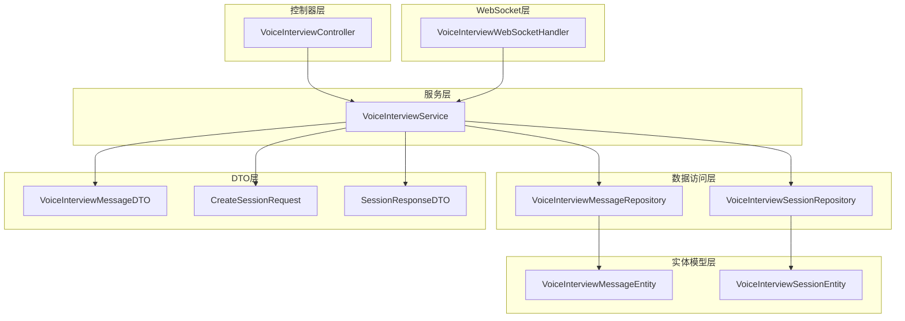
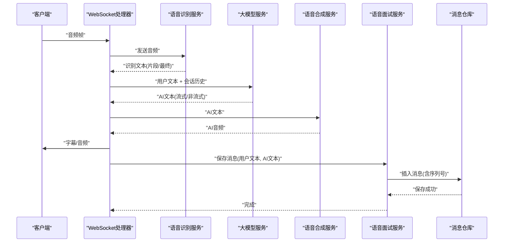
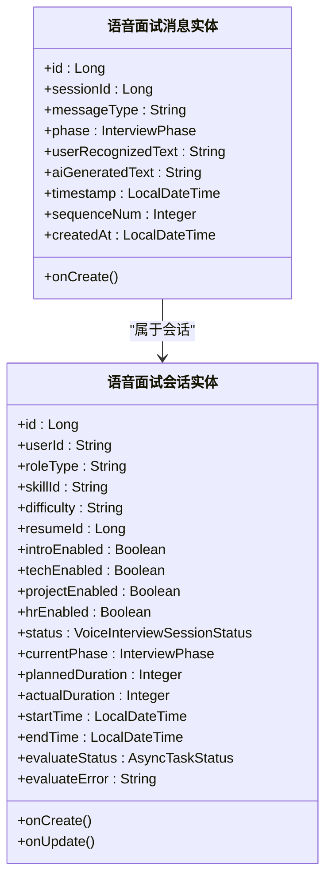
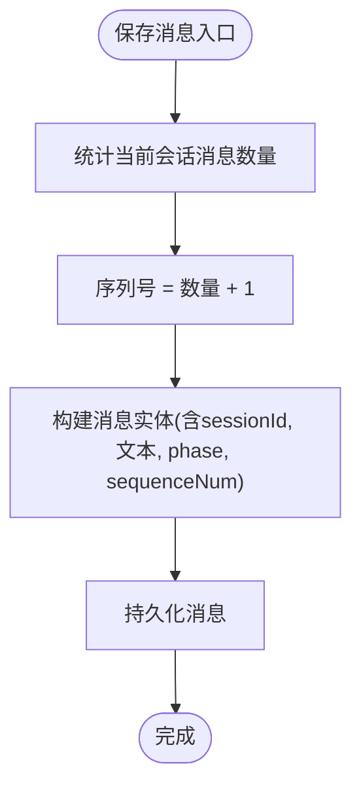
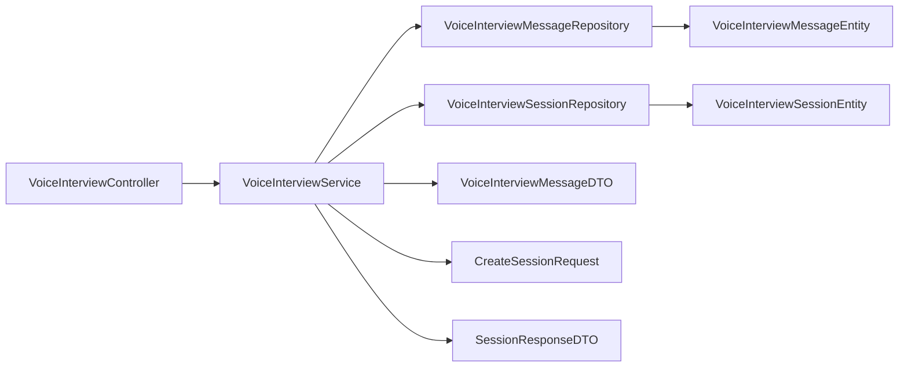

# 语音面试消息处理

<cite>
**本文引用的文件**
- [VoiceInterviewMessageEntity.java](file://app/src/main/java/interview/guide/modules/voiceinterview/model/VoiceInterviewMessageEntity.java)
- [VoiceInterviewSessionEntity.java](file://app/src/main/java/interview/guide/modules/voiceinterview/model/VoiceInterviewSessionEntity.java)
- [VoiceInterviewMessageRepository.java](file://app/src/main/java/interview/guide/modules/voiceinterview/repository/VoiceInterviewMessageRepository.java)
- [VoiceInterviewSessionRepository.java](file://app/src/main/java/interview/guide/modules/voiceinterview/repository/VoiceInterviewSessionRepository.java)
- [VoiceInterviewMessageDTO.java](file://app/src/main/java/interview/guide/modules/voiceinterview/dto/VoiceInterviewMessageDTO.java)
- [VoiceInterviewService.java](file://app/src/main/java/interview/guide/modules/voiceinterview/service/VoiceInterviewService.java)
- [VoiceInterviewController.java](file://app/src/main/java/interview/guide/modules/voiceinterview/controller/VoiceInterviewController.java)
- [VoiceInterviewWebSocketHandler.java](file://app/src/main/java/interview/guide/modules/voiceinterview/handler/VoiceInterviewWebSocketHandler.java)
- [VoiceInterviewSessionStatus.java](file://app/src/main/java/interview/guide/modules/voiceinterview/model/VoiceInterviewSessionStatus.java)
- [CreateSessionRequest.java](file://app/src/main/java/interview/guide/modules/voiceinterview/dto/CreateSessionRequest.java)
- [SessionResponseDTO.java](file://app/src/main/java/interview/guide/modules/voiceinterview/dto/SessionResponseDTO.java)
</cite>

## 目录
1. [简介](#简介)
2. [项目结构](#项目结构)
3. [核心组件](#核心组件)
4. [架构总览](#架构总览)
5. [详细组件分析](#详细组件分析)
6. [依赖分析](#依赖分析)
7. [性能考虑](#性能考虑)
8. [故障排查指南](#故障排查指南)
9. [结论](#结论)

## 简介
本文件面向“语音面试消息处理”的完整实现，围绕以下目标展开：
- 对话消息的存储与检索：用户语音识别文本与AI生成响应文本的持久化流程
- 消息序列号的自动生成与管理：确保对话历史的正确顺序
- 消息实体与会话实体的关系设计：外键约束与级联行为
- 查询优化策略：按会话ID查询、按序列号排序
- 数据传输对象（DTO）设计与转换逻辑
- 异常与错误处理机制

## 项目结构
语音面试模块位于后端应用的 voiceinterview 子包下，采用分层架构：
- 控制器层：REST 接口，负责接收请求与返回结果
- 服务层：业务逻辑编排，包含消息持久化、会话状态管理、评估任务触发
- 数据访问层：JPA Repository 负责数据库交互
- 实体模型层：JPA 实体定义表结构与字段
- DTO 层：前后端数据传输载体
- WebSocket 层：实时音频流处理与消息落库

图表来源
- [VoiceInterviewController.java:1-201](file://app/src/main/java/interview/guide/modules/voiceinterview/controller/VoiceInterviewController.java#L1-201)
- [VoiceInterviewService.java:1-582](file://app/src/main/java/interview/guide/modules/voiceinterview/service/VoiceInterviewService.java#L1-582)
- [VoiceInterviewMessageRepository.java:1-25](file://app/src/main/java/interview/guide/modules/voiceinterview/repository/VoiceInterviewMessageRepository.java#L1-25)
- [VoiceInterviewSessionRepository.java:1-46](file://app/src/main/java/interview/guide/modules/voiceinterview/repository/VoiceInterviewSessionRepository.java#L1-46)
- [VoiceInterviewMessageEntity.java:1-54](file://app/src/main/java/interview/guide/modules/voiceinterview/model/VoiceInterviewMessageEntity.java#L1-54)
- [VoiceInterviewSessionEntity.java:1-122](file://app/src/main/java/interview/guide/modules/voiceinterview/model/VoiceInterviewSessionEntity.java#L1-122)
- [VoiceInterviewMessageDTO.java:1-24](file://app/src/main/java/interview/guide/modules/voiceinterview/dto/VoiceInterviewMessageDTO.java#L1-24)
- [CreateSessionRequest.java:1-33](file://app/src/main/java/interview/guide/modules/voiceinterview/dto/CreateSessionRequest.java#L1-33)
- [SessionResponseDTO.java:1-26](file://app/src/main/java/interview/guide/modules/voiceinterview/dto/SessionResponseDTO.java#L1-26)
- [VoiceInterviewWebSocketHandler.java:1-800](file://app/src/main/java/interview/guide/modules/voiceinterview/handler/VoiceInterviewWebSocketHandler.java#L1-800)

章节来源
- [VoiceInterviewController.java:1-201](file://app/src/main/java/interview/guide/modules/voiceinterview/controller/VoiceInterviewController.java#L1-L201)
- [VoiceInterviewService.java:1-582](file://app/src/main/java/interview/guide/modules/voiceinterview/service/VoiceInterviewService.java#L1-L582)
- [VoiceInterviewMessageRepository.java:1-25](file://app/src/main/java/interview/guide/modules/voiceinterview/repository/VoiceInterviewMessageRepository.java#L1-L25)
- [VoiceInterviewSessionRepository.java:1-46](file://app/src/main/java/interview/guide/modules/voiceinterview/repository/VoiceInterviewSessionRepository.java#L1-L46)
- [VoiceInterviewMessageEntity.java:1-54](file://app/src/main/java/interview/guide/modules/voiceinterview/model/VoiceInterviewMessageEntity.java#L1-L54)
- [VoiceInterviewSessionEntity.java:1-122](file://app/src/main/java/interview/guide/modules/voiceinterview/model/VoiceInterviewSessionEntity.java#L1-L122)
- [VoiceInterviewMessageDTO.java:1-24](file://app/src/main/java/interview/guide/modules/voiceinterview/dto/VoiceInterviewMessageDTO.java#L1-L24)
- [CreateSessionRequest.java:1-33](file://app/src/main/java/interview/guide/modules/voiceinterview/dto/CreateSessionRequest.java#L1-L33)
- [SessionResponseDTO.java:1-26](file://app/src/main/java/interview/guide/modules/voiceinterview/dto/SessionResponseDTO.java#L1-L26)
- [VoiceInterviewWebSocketHandler.java:1-800](file://app/src/main/java/interview/guide/modules/voiceinterview/handler/VoiceInterviewWebSocketHandler.java#L1-L800)

## 核心组件
- 会话实体与消息实体：定义了语音面试的会话与对话消息的表结构、字段与生命周期钩子
- Repository：提供按会话ID查询消息列表、统计消息数量等方法
- Service：封装消息保存、历史查询、会话状态管理、评估状态更新等业务逻辑
- Controller：对外暴露 REST 接口，返回 DTO
- WebSocket 处理器：实时音频流处理，完成 STT/LMM/TTS 后将对话消息落库
- DTO：前后端数据传输载体，包含必要的字段映射

章节来源
- [VoiceInterviewMessageEntity.java:1-54](file://app/src/main/java/interview/guide/modules/voiceinterview/model/VoiceInterviewMessageEntity.java#L1-L54)
- [VoiceInterviewSessionEntity.java:1-122](file://app/src/main/java/interview/guide/modules/voiceinterview/model/VoiceInterviewSessionEntity.java#L1-L122)
- [VoiceInterviewMessageRepository.java:1-25](file://app/src/main/java/interview/guide/modules/voiceinterview/repository/VoiceInterviewMessageRepository.java#L1-L25)
- [VoiceInterviewSessionRepository.java:1-46](file://app/src/main/java/interview/guide/modules/voiceinterview/repository/VoiceInterviewSessionRepository.java#L1-L46)
- [VoiceInterviewService.java:1-582](file://app/src/main/java/interview/guide/modules/voiceinterview/service/VoiceInterviewService.java#L1-L582)
- [VoiceInterviewController.java:1-201](file://app/src/main/java/interview/guide/modules/voiceinterview/controller/VoiceInterviewController.java#L1-L201)
- [VoiceInterviewWebSocketHandler.java:1-800](file://app/src/main/java/interview/guide/modules/voiceinterview/handler/VoiceInterviewWebSocketHandler.java#L1-L800)
- [VoiceInterviewMessageDTO.java:1-24](file://app/src/main/java/interview/guide/modules/voiceinterview/dto/VoiceInterviewMessageDTO.java#L1-L24)
- [CreateSessionRequest.java:1-33](file://app/src/main/java/interview/guide/modules/voiceinterview/dto/CreateSessionRequest.java#L1-L33)
- [SessionResponseDTO.java:1-26](file://app/src/main/java/interview/guide/modules/voiceinterview/dto/SessionResponseDTO.java#L1-L26)

## 架构总览
语音面试的消息处理贯穿“实时 WebSocket 流水线”与“数据库持久化”，整体流程如下：
- 用户通过 WebSocket 发送音频，经 STT 得到识别文本
- 将用户文本与 AI 响应文本组合为一条对话消息
- 服务层计算序列号并保存消息，同时将文本同步发送至前端字幕与音频
- 历史查询按会话ID与序列号排序返回

图表来源
- [VoiceInterviewWebSocketHandler.java:300-748](file://app/src/main/java/interview/guide/modules/voiceinterview/handler/VoiceInterviewWebSocketHandler.java#L300-L748)
- [VoiceInterviewService.java:216-238](file://app/src/main/java/interview/guide/modules/voiceinterview/service/VoiceInterviewService.java#L216-L238)
- [VoiceInterviewMessageRepository.java:13-24](file://app/src/main/java/interview/guide/modules/voiceinterview/repository/VoiceInterviewMessageRepository.java#L13-L24)

## 详细组件分析

### 消息实体与会话实体
- 消息实体包含会话ID、消息类型、阶段、用户识别文本、AI生成文本、时间戳、序列号、创建时间等字段；在持久化前自动填充创建时间与时间戳
- 会话实体包含用户ID、角色类型、技能ID、难度、简历ID、各阶段开关、状态、计划/实际时长、起止时间、评估状态与错误信息等；在持久化/更新前自动填充时间戳

图表来源
- [VoiceInterviewMessageEntity.java:11-53](file://app/src/main/java/interview/guide/modules/voiceinterview/model/VoiceInterviewMessageEntity.java#L11-L53)
- [VoiceInterviewSessionEntity.java:13-116](file://app/src/main/java/interview/guide/modules/voiceinterview/model/VoiceInterviewSessionEntity.java#L13-L116)

章节来源
- [VoiceInterviewMessageEntity.java:1-54](file://app/src/main/java/interview/guide/modules/voiceinterview/model/VoiceInterviewMessageEntity.java#L1-L54)
- [VoiceInterviewSessionEntity.java:1-122](file://app/src/main/java/interview/guide/modules/voiceinterview/model/VoiceInterviewSessionEntity.java#L1-L122)

### 消息序列号的自动生成与管理
- 序列号通过“当前会话消息数量 + 1”计算，保证严格递增
- 保存消息时将序列号写入实体，随后持久化入库
- 历史查询默认按序列号升序返回，确保对话顺序正确

图表来源
- [VoiceInterviewService.java:508-512](file://app/src/main/java/interview/guide/modules/voiceinterview/service/VoiceInterviewService.java#L508-L512)
- [VoiceInterviewMessageRepository.java:18](file://app/src/main/java/interview/guide/modules/voiceinterview/repository/VoiceInterviewMessageRepository.java#L18)

章节来源
- [VoiceInterviewService.java:508-512](file://app/src/main/java/interview/guide/modules/voiceinterview/service/VoiceInterviewService.java#L508-L512)
- [VoiceInterviewMessageRepository.java:18](file://app/src/main/java/interview/guide/modules/voiceinterview/repository/VoiceInterviewMessageRepository.java#L18)

### 消息与会话的关系设计
- 消息实体包含 sessionId 字段，用于关联所属会话
- 会话实体提供多种查询接口（按用户ID、状态、更新时间等）
- 历史查询通过 Repository 方法按会话ID与序列号排序返回

章节来源
- [VoiceInterviewMessageEntity.java:23-24](file://app/src/main/java/interview/guide/modules/voiceinterview/model/VoiceInterviewMessageEntity.java#L23-L24)
- [VoiceInterviewSessionRepository.java:19-44](file://app/src/main/java/interview/guide/modules/voiceinterview/repository/VoiceInterviewSessionRepository.java#L19-L44)
- [VoiceInterviewMessageRepository.java:18](file://app/src/main/java/interview/guide/modules/voiceinterview/repository/VoiceInterviewMessageRepository.java#L18)

### 消息查询优化策略
- 按会话ID查询：使用 Repository 提供的方法，避免全表扫描
- 按序列号排序：默认按 sequenceNum 升序返回，保证对话顺序
- 统计消息数量：提供 countBySessionId 方法，便于前端展示消息条数

章节来源
- [VoiceInterviewMessageRepository.java:18-23](file://app/src/main/java/interview/guide/modules/voiceinterview/repository/VoiceInterviewMessageRepository.java#L18-L23)

### 数据传输对象（DTO）设计与转换
- 消息 DTO 包含 id、sessionId、messageType、phase、userRecognizedText、aiGeneratedText、timestamp、sequenceNum
- 服务层将实体转换为 DTO，供控制器返回给前端
- 会话相关 DTO 包含会话元信息与 WebSocket URL

章节来源
- [VoiceInterviewMessageDTO.java:1-24](file://app/src/main/java/interview/guide/modules/voiceinterview/dto/VoiceInterviewMessageDTO.java#L1-L24)
- [VoiceInterviewService.java:255-268](file://app/src/main/java/interview/guide/modules/voiceinterview/service/VoiceInterviewService.java#L255-L268)
- [SessionResponseDTO.java:1-26](file://app/src/main/java/interview/guide/modules/voiceinterview/dto/SessionResponseDTO.java#L1-L26)

### WebSocket 实时流水线与消息落库
- WebSocket 处理器接收音频帧，转交给 STT 识别
- 识别完成后，触发 LLM 生成 AI 文本，并进行 TTS 合成音频
- 在发送字幕与音频的同时，调用服务层保存消息（用户文本与 AI 文本）
- 若开启流式 LLM，会在句子级并发触发 TTS，提升体验

章节来源
- [VoiceInterviewWebSocketHandler.java:396-425](file://app/src/main/java/interview/guide/modules/voiceinterview/handler/VoiceInterviewWebSocketHandler.java#L396-L425)
- [VoiceInterviewWebSocketHandler.java:538-748](file://app/src/main/java/interview/guide/modules/voiceinterview/handler/VoiceInterviewWebSocketHandler.java#L538-L748)
- [VoiceInterviewService.java:216-238](file://app/src/main/java/interview/guide/modules/voiceinterview/service/VoiceInterviewService.java#L216-L238)

### 控制器与服务交互
- 控制器提供会话创建、结束、暂停/恢复、历史查询、评估状态轮询等接口
- 服务层负责业务编排与异常处理，返回 DTO 或抛出业务异常

章节来源
- [VoiceInterviewController.java:1-201](file://app/src/main/java/interview/guide/modules/voiceinterview/controller/VoiceInterviewController.java#L1-L201)
- [VoiceInterviewService.java:1-582](file://app/src/main/java/interview/guide/modules/voiceinterview/service/VoiceInterviewService.java#L1-L582)

## 依赖分析
- 控制器依赖服务层；服务层依赖仓库与外部能力（Redisson、评估生产者等）
- 仓库依赖 JPA，提供按会话ID查询与计数
- 实体之间存在一对一关系（消息属于会话）

图表来源
- [VoiceInterviewController.java:1-201](file://app/src/main/java/interview/guide/modules/voiceinterview/controller/VoiceInterviewController.java#L1-L201)
- [VoiceInterviewService.java:1-582](file://app/src/main/java/interview/guide/modules/voiceinterview/service/VoiceInterviewService.java#L1-L582)
- [VoiceInterviewMessageRepository.java:1-25](file://app/src/main/java/interview/guide/modules/voiceinterview/repository/VoiceInterviewMessageRepository.java#L1-L25)
- [VoiceInterviewSessionRepository.java:1-46](file://app/src/main/java/interview/guide/modules/voiceinterview/repository/VoiceInterviewSessionRepository.java#L1-L46)
- [VoiceInterviewMessageEntity.java:1-54](file://app/src/main/java/interview/guide/modules/voiceinterview/model/VoiceInterviewMessageEntity.java#L1-L54)
- [VoiceInterviewSessionEntity.java:1-122](file://app/src/main/java/interview/guide/modules/voiceinterview/model/VoiceInterviewSessionEntity.java#L1-L122)
- [VoiceInterviewMessageDTO.java:1-24](file://app/src/main/java/interview/guide/modules/voiceinterview/dto/VoiceInterviewMessageDTO.java#L1-L24)
- [CreateSessionRequest.java:1-33](file://app/src/main/java/interview/guide/modules/voiceinterview/dto/CreateSessionRequest.java#L1-L33)
- [SessionResponseDTO.java:1-26](file://app/src/main/java/interview/guide/modules/voiceinterview/dto/SessionResponseDTO.java#L1-L26)

## 性能考虑
- 使用虚拟线程执行阻塞任务（LLM/TTS/JDBC），避免占用调度线程
- 采用分块/合并两种 TTS 推送模式，平衡首开延迟与带宽占用
- 通过 Redis 缓存会话实体，降低数据库压力
- 历史查询按会话ID与序列号排序，建议在数据库层面建立复合索引以优化排序与过滤

## 故障排查指南
- WebSocket 连接异常：检查 STT/TTS 服务可用性与鉴权配置
- 会话不存在：控制器对不存在会话抛出业务异常，需确认会话ID有效性
- 暂停/恢复状态校验：服务层对非进行中/非暂停状态进行校验并抛出业务异常
- 评估状态更新：服务层提供统一的状态更新入口，异常会被捕获并记录日志
- 序列号异常：若出现重复或跳跃，检查消息保存逻辑与并发场景下的计数一致性

章节来源
- [VoiceInterviewController.java:142-144](file://app/src/main/java/interview/guide/modules/voiceinterview/controller/VoiceInterviewController.java#L142-L144)
- [VoiceInterviewService.java:284-288](file://app/src/main/java/interview/guide/modules/voiceinterview/service/VoiceInterviewService.java#L284-L288)
- [VoiceInterviewService.java:313-317](file://app/src/main/java/interview/guide/modules/voiceinterview/service/VoiceInterviewService.java#L313-L317)
- [VoiceInterviewService.java:517-529](file://app/src/main/java/interview/guide/modules/voiceinterview/service/VoiceInterviewService.java#L517-L529)

## 结论
该语音面试消息处理方案以实体-仓库-服务-控制器分层清晰、WebSocket 实时流水线高效、消息序列号自动生成与查询优化完备为核心特征。通过 DTO 解耦前后端数据结构，结合 Redis 缓存与合理的并发模型，能够满足高并发场景下的实时语音面试需求。后续可在数据库层面补充索引与审计日志，进一步增强可观测性与稳定性。