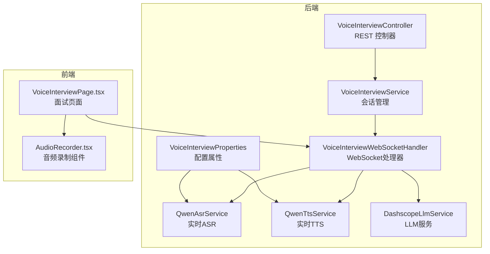
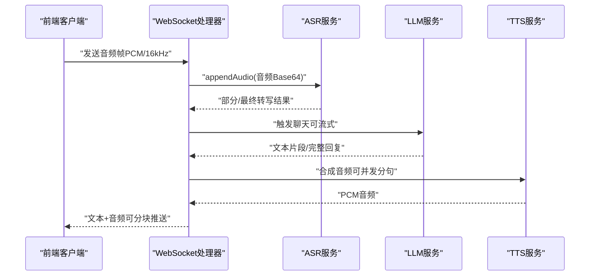
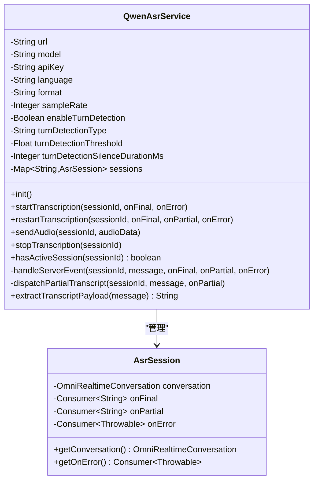
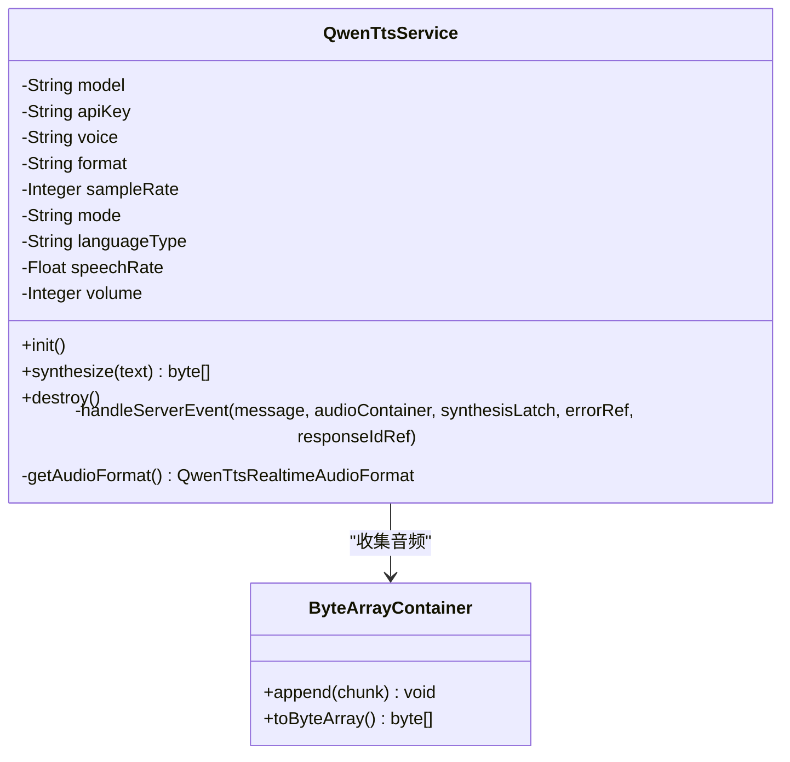
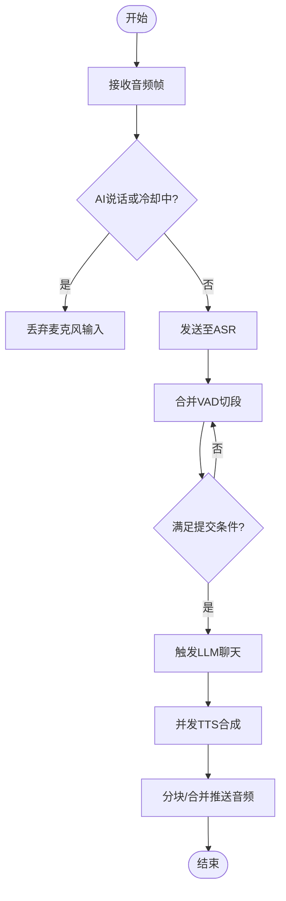
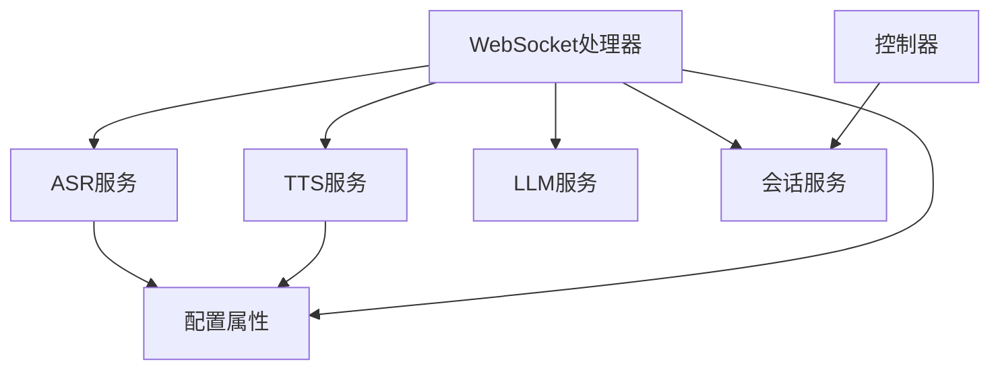

# 语音面试音频处理

<cite>
**本文档引用的文件**
- [QwenAsrService.java](file://app/src/main/java/interview/guide/modules/voiceinterview/service/QwenAsrService.java)
- [QwenTtsService.java](file://app/src/main/java/interview/guide/modules/voiceinterview/service/QwenTtsService.java)
- [VoiceInterviewService.java](file://app/src/main/java/interview/guide/modules/voiceinterview/service/VoiceInterviewService.java)
- [VoiceInterviewWebSocketHandler.java](file://app/src/main/java/interview/guide/modules/voiceinterview/handler/VoiceInterviewWebSocketHandler.java)
- [VoiceInterviewProperties.java](file://app/src/main/java/interview/guide/modules/voiceinterview/config/VoiceInterviewProperties.java)
- [application.yml](file://app/src/main/resources/application.yml)
- [voice-interview-opening.yml](file://app/src/main/resources/voice-interview-opening.yml)
- [WebSocketControlMessage.java](file://app/src/main/java/interview/guide/modules/voiceinterview/dto/WebSocketControlMessage.java)
- [WebSocketSubtitleMessage.java](file://app/src/main/java/interview/guide/modules/voiceinterview/dto/WebSocketSubtitleMessage.java)
- [QwenAsrServiceTest.java](file://app/src/test/java/interview/guide/modules/voiceinterview/service/QwenAsrServiceTest.java)
- [QwenTtsServiceTest.java](file://app/src/test/java/interview/guide/modules/voiceinterview/service/QwenTtsServiceTest.java)
- [VoiceInterviewPage.tsx](file://frontend/src/pages/VoiceInterviewPage.tsx)
- [AudioRecorder.tsx](file://frontend/src/components/AudioRecorder.tsx)
</cite>

## 目录
1. [简介](#简介)
2. [项目结构](#项目结构)
3. [核心组件](#核心组件)
4. [架构总览](#架构总览)
5. [详细组件分析](#详细组件分析)
6. [依赖关系分析](#依赖关系分析)
7. [性能考虑](#性能考虑)
8. [故障排查指南](#故障排查指南)
9. [结论](#结论)
10. [附录](#附录)

## 简介
本项目提供完整的语音面试音频处理解决方案，涵盖实时语音识别（ASR）、文本转语音（TTS）、双向音频流处理、会话管理与评估等模块。系统采用 WebSocket 实时传输音频数据，结合阿里云 DashScope 的 qwen3-asr-flash-realtime 和 qwen3-tts-flash-realtime 实时模型，实现低延迟的语音面试体验。前端通过 VAD（语音活动检测）进行本地噪声抑制与回声控制，后端通过服务器端 VAD（SSE）与会话合并策略实现稳定可靠的转写与合成。

## 项目结构
后端采用 Spring Boot 微服务架构，核心模块位于 `app/src/main/java/interview/guide/modules/voiceinterview/`，包含服务层、控制器层、WebSocket 处理器、配置类与 DTO。前端位于 `frontend/src/`，提供音频录制、实时字幕与交互界面。

**图表来源**
- [VoiceInterviewController.java:1-201](file://app/src/main/java/interview/guide/modules/voiceinterview/controller/VoiceInterviewController.java#L1-L201)
- [VoiceInterviewService.java:1-582](file://app/src/main/java/interview/guide/modules/voiceinterview/service/VoiceInterviewService.java#L1-L582)
- [VoiceInterviewWebSocketHandler.java:1-800](file://app/src/main/java/interview/guide/modules/voiceinterview/handler/VoiceInterviewWebSocketHandler.java#L1-L800)
- [QwenAsrService.java:1-625](file://app/src/main/java/interview/guide/modules/voiceinterview/service/QwenAsrService.java#L1-L625)
- [QwenTtsService.java:1-397](file://app/src/main/java/interview/guide/modules/voiceinterview/service/QwenTtsService.java#L1-L397)
- [VoiceInterviewProperties.java:1-160](file://app/src/main/java/interview/guide/modules/voiceinterview/config/VoiceInterviewProperties.java#L1-L160)
- [VoiceInterviewPage.tsx:1-734](file://frontend/src/pages/VoiceInterviewPage.tsx#L1-L734)
- [AudioRecorder.tsx:1-257](file://frontend/src/components/AudioRecorder.tsx#L1-L257)

**章节来源**
- [VoiceInterviewController.java:1-201](file://app/src/main/java/interview/guide/modules/voiceinterview/controller/VoiceInterviewController.java#L1-L201)
- [VoiceInterviewService.java:1-582](file://app/src/main/java/interview/guide/modules/voiceinterview/service/VoiceInterviewService.java#L1-L582)
- [VoiceInterviewWebSocketHandler.java:1-800](file://app/src/main/java/interview/guide/modules/voiceinterview/handler/VoiceInterviewWebSocketHandler.java#L1-L800)
- [QwenAsrService.java:1-625](file://app/src/main/java/interview/guide/modules/voiceinterview/service/QwenAsrService.java#L1-L625)
- [QwenTtsService.java:1-397](file://app/src/main/java/interview/guide/modules/voiceinterview/service/QwenTtsService.java#L1-L397)
- [VoiceInterviewProperties.java:1-160](file://app/src/main/java/interview/guide/modules/voiceinterview/config/VoiceInterviewProperties.java#L1-L160)
- [VoiceInterviewPage.tsx:1-734](file://frontend/src/pages/VoiceInterviewPage.tsx#L1-L734)
- [AudioRecorder.tsx:1-257](file://frontend/src/components/AudioRecorder.tsx#L1-L257)

## 核心组件
- 语音识别服务（ASR）：基于阿里云 DashScope qwen3-asr-flash-realtime，支持服务器端 VAD、实时转写与断线重连。
- 语音合成服务（TTS）：基于阿里云 DashScope qwen3-tts-flash-realtime，支持并发 TTS 合成与分块音频推送。
- WebSocket 处理器：负责音频流的实时处理、会话状态管理、LLM/TTS 管线调度与错误处理。
- 会话服务：管理面试会话生命周期、阶段切换、消息持久化与评估任务触发。
- 配置属性：集中管理 ASR/TTS 参数、音频规格、速率限制与流式策略。

**章节来源**
- [QwenAsrService.java:25-46](file://app/src/main/java/interview/guide/modules/voiceinterview/service/QwenAsrService.java#L25-L46)
- [QwenTtsService.java:20-41](file://app/src/main/java/interview/guide/modules/voiceinterview/service/QwenTtsService.java#L20-L41)
- [VoiceInterviewWebSocketHandler.java:45-56](file://app/src/main/java/interview/guide/modules/voiceinterview/handler/VoiceInterviewWebSocketHandler.java#L45-L56)
- [VoiceInterviewService.java:30-44](file://app/src/main/java/interview/guide/modules/voiceinterview/service/VoiceInterviewService.java#L30-L44)
- [VoiceInterviewProperties.java:117-160](file://app/src/main/java/interview/guide/modules/voiceinterview/config/VoiceInterviewProperties.java#L117-L160)

## 架构总览
系统采用“前端采集 → WebSocket → 后端处理 → 云端模型”的实时架构。前端通过 VAD 进行本地噪声抑制与回声控制，后端通过服务器端 VAD 与会话合并策略实现稳定转写与合成。

**图表来源**
- [VoiceInterviewWebSocketHandler.java:396-482](file://app/src/main/java/interview/guide/modules/voiceinterview/handler/VoiceInterviewWebSocketHandler.java#L396-L482)
- [QwenAsrService.java:130-187](file://app/src/main/java/interview/guide/modules/voiceinterview/service/QwenAsrService.java#L130-L187)
- [QwenTtsService.java:107-222](file://app/src/main/java/interview/guide/modules/voiceinterview/service/QwenTtsService.java#L107-L222)

## 详细组件分析

### 语音识别服务（ASR）
- 实时转写：通过 DashScope qwen3-asr-flash-realtime 建立 WebSocket 连接，配置服务器端 VAD，自动检测语音片段并触发转写。
- 会话管理：支持多会话并发，使用线程安全的 Map 管理会话状态，提供启动、重启与停止接口。
- 错误处理：捕获连接异常与事件错误，触发重连逻辑并上报错误。
- 数据格式：音频为 PCM 格式，采样率为 16kHz，经 Base64 编码后发送。

**图表来源**
- [QwenAsrService.java:72-84](file://app/src/main/java/interview/guide/modules/voiceinterview/service/QwenAsrService.java#L72-L84)
- [QwenAsrService.java:557-581](file://app/src/main/java/interview/guide/modules/voiceinterview/service/QwenAsrService.java#L557-L581)

**章节来源**
- [QwenAsrService.java:107-113](file://app/src/main/java/interview/guide/modules/voiceinterview/service/QwenAsrService.java#L107-L113)
- [QwenAsrService.java:130-187](file://app/src/main/java/interview/guide/modules/voiceinterview/service/QwenAsrService.java#L130-L187)
- [QwenAsrService.java:188-287](file://app/src/main/java/interview/guide/modules/voiceinterview/service/QwenAsrService.java#L188-L287)
- [QwenAsrService.java:302-322](file://app/src/main/java/interview/guide/modules/voiceinterview/service/QwenAsrService.java#L302-L322)
- [QwenAsrService.java:332-358](file://app/src/main/java/interview/guide/modules/voiceinterview/service/QwenAsrService.java#L332-L358)
- [QwenAsrService.java:409-482](file://app/src/main/java/interview/guide/modules/voiceinterview/service/QwenAsrService.java#L409-L482)
- [QwenAsrService.java:508-552](file://app/src/main/java/interview/guide/modules/voiceinterview/service/QwenAsrService.java#L508-L552)

### 语音合成服务（TTS）
- 实时合成：通过 qwen3-tts-flash-realtime 建立 WebSocket 连接，使用 commit 模式同步合成音频。
- 并发控制：支持每会话并发 TTS 调用上限，避免连接限制。
- 音频格式：默认 PCM 24kHz 单声道 16bit，可转换为 WAV 推送。
- 错误处理：捕获服务端错误并返回空音频数组，前端进行降级处理。

**图表来源**
- [QwenTtsService.java:65-76](file://app/src/main/java/interview/guide/modules/voiceinterview/service/QwenTtsService.java#L65-L76)
- [QwenTtsService.java:107-222](file://app/src/main/java/interview/guide/modules/voiceinterview/service/QwenTtsService.java#L107-L222)
- [QwenTtsService.java:263-340](file://app/src/main/java/interview/guide/modules/voiceinterview/service/QwenTtsService.java#L263-L340)
- [QwenTtsService.java:347-357](file://app/src/main/java/interview/guide/modules/voiceinterview/service/QwenTtsService.java#L347-L357)

**章节来源**
- [QwenTtsService.java:85-92](file://app/src/main/java/interview/guide/modules/voiceinterview/service/QwenTtsService.java#L85-L92)
- [QwenTtsService.java:107-222](file://app/src/main/java/interview/guide/modules/voiceinterview/service/QwenTtsService.java#L107-L222)
- [QwenTtsService.java:263-340](file://app/src/main/java/interview/guide/modules/voiceinterview/service/QwenTtsService.java#L263-L340)

### WebSocket 处理器与实时音频流
- 音频采集：前端使用 Web Audio API 与 VAD（onnxruntime-web），将 16kHz PCM 音频按 1 秒切片并 Base64 编码发送。
- 会话合并：将多次 VAD 切段的片段合并，等待用户手动提交或达到静音阈值后触发 LLM。
- LLM/TTS 管线：支持流式文本与并发 TTS 合成，可选择分块推送或合并推送。
- 回声与冷却：AI 说话期间屏蔽麦克风输入，设置 800ms 冷却期防止扬声器尾音触发 STT。
- 错误映射：将阿里云错误映射为用户友好的提示信息。

**图表来源**
- [VoiceInterviewWebSocketHandler.java:431-482](file://app/src/main/java/interview/guide/modules/voiceinterview/handler/VoiceInterviewWebSocketHandler.java#L431-L482)
- [VoiceInterviewWebSocketHandler.java:513-547](file://app/src/main/java/interview/guide/modules/voiceinterview/handler/VoiceInterviewWebSocketHandler.java#L513-L547)
- [VoiceInterviewWebSocketHandler.java:556-748](file://app/src/main/java/interview/guide/modules/voiceinterview/handler/VoiceInterviewWebSocketHandler.java#L556-L748)

**章节来源**
- [VoiceInterviewWebSocketHandler.java:140-169](file://app/src/main/java/interview/guide/modules/voiceinterview/handler/VoiceInterviewWebSocketHandler.java#L140-L169)
- [VoiceInterviewWebSocketHandler.java:396-425](file://app/src/main/java/interview/guide/modules/voiceinterview/handler/VoiceInterviewWebSocketHandler.java#L396-L425)
- [VoiceInterviewWebSocketHandler.java:487-508](file://app/src/main/java/interview/guide/modules/voiceinterview/handler/VoiceInterviewWebSocketHandler.java#L487-L508)
- [VoiceInterviewWebSocketHandler.java:538-547](file://app/src/main/java/interview/guide/modules/voiceinterview/handler/VoiceInterviewWebSocketHandler.java#L538-L547)
- [VoiceInterviewWebSocketHandler.java:753-771](file://app/src/main/java/interview/guide/modules/voiceinterview/handler/VoiceInterviewWebSocketHandler.java#L753-L771)

### 会话管理与评估
- 生命周期：创建、暂停、恢复、结束会话，记录阶段与时长，触发异步评估任务。
- Redis 缓存：使用 Redisson 缓存会话实体，提高查询性能。
- 评估集成：通过 Redis Stream 触发评估任务，支持轮询获取评估状态与结果。

**章节来源**
- [VoiceInterviewService.java:63-93](file://app/src/main/java/interview/guide/modules/voiceinterview/service/VoiceInterviewService.java#L63-L93)
- [VoiceInterviewService.java:101-124](file://app/src/main/java/interview/guide/modules/voiceinterview/service/VoiceInterviewService.java#L101-L124)
- [VoiceInterviewService.java:170-194](file://app/src/main/java/interview/guide/modules/voiceinterview/service/VoiceInterviewService.java#L170-L194)
- [VoiceInterviewService.java:517-529](file://app/src/main/java/interview/guide/modules/voiceinterview/service/VoiceInterviewService.java#L517-L529)

### 配置参数与调优建议
- ASR 参数：模型、URL、语言、音频格式、采样率、服务器端 VAD 类型与静音时长。
- TTS 参数：模型、声音、音频格式、采样率、模式、语速与音量。
- 音频规格：编解码器、采样率、比特率、通道数与切片时长。
- 流式策略：是否启用 LLM 流式文本、最小推送间隔与增量字符数、每会话并发 TTS 上限、是否启用分块音频推送。
- 速率限制：每会话消息数、每 IP 访问数与全局并发数。

**章节来源**
- [VoiceInterviewProperties.java:117-160](file://app/src/main/java/interview/guide/modules/voiceinterview/config/VoiceInterviewProperties.java#L117-L160)
- [application.yml:229-281](file://app/src/main/resources/application.yml#L229-L281)
- [voice-interview-opening.yml:1-45](file://app/src/main/resources/voice-interview-opening.yml#L1-L45)

## 依赖关系分析
- 组件耦合：WebSocket 处理器依赖 ASR/TTS/LLM 服务与会话服务；控制器依赖会话服务；配置类为各服务提供参数。
- 外部依赖：阿里云 DashScope 实时模型、Redisson、Micrometer 指标。
- 并发模型：使用虚拟线程执行阻塞任务，避免阻塞调度线程；使用信号量控制并发 TTS。

**图表来源**
- [VoiceInterviewWebSocketHandler.java:58-64](file://app/src/main/java/interview/guide/modules/voiceinterview/handler/VoiceInterviewWebSocketHandler.java#L58-L64)
- [VoiceInterviewController.java:41-43](file://app/src/main/java/interview/guide/modules/voiceinterview/controller/VoiceInterviewController.java#L41-L43)
- [VoiceInterviewService.java:46-50](file://app/src/main/java/interview/guide/modules/voiceinterview/service/VoiceInterviewService.java#L46-L50)
- [VoiceInterviewProperties.java:1-160](file://app/src/main/java/interview/guide/modules/voiceinterview/config/VoiceInterviewProperties.java#L1-L160)

**章节来源**
- [VoiceInterviewWebSocketHandler.java:58-64](file://app/src/main/java/interview/guide/modules/voiceinterview/handler/VoiceInterviewWebSocketHandler.java#L58-L64)
- [VoiceInterviewController.java:41-43](file://app/src/main/java/interview/guide/modules/voiceinterview/controller/VoiceInterviewController.java#L41-L43)
- [VoiceInterviewService.java:46-50](file://app/src/main/java/interview/guide/modules/voiceinterview/service/VoiceInterviewService.java#L46-L50)

## 性能考虑
- 延迟优化：前端使用 1 秒切片与 16kHz 采样率平衡延迟与质量；服务器端启用服务器端 VAD 减少无效传输。
- 并发控制：每会话并发 TTS 上限避免连接限制；虚拟线程提升 I/O 密集型场景吞吐。
- 缓冲与背压：WebSocket 发送缓冲限制与时间限制防止内存溢出；分块音频推送降低首包时延。
- 指标监控：Micrometer 计数器与计时器记录 ASR/TTS/LLM 时延与成功率，便于性能分析。

**章节来源**
- [VoiceInterviewWebSocketHandler.java:85-89](file://app/src/main/java/interview/guide/modules/voiceinterview/handler/VoiceInterviewWebSocketHandler.java#L85-L89)
- [VoiceInterviewWebSocketHandler.java:589-591](file://app/src/main/java/interview/guide/modules/voiceinterview/handler/VoiceInterviewWebSocketHandler.java#L589-L591)
- [VoiceInterviewWebSocketHandler.java:503-504](file://app/src/main/java/interview/guide/modules/voiceinterview/handler/VoiceInterviewWebSocketHandler.java#L503-L504)

## 故障排查指南
- ASR 连接中断：检查 API Key 与网络；系统会自动重启并验证连接；若失败，前端提示刷新重试。
- TTS 合成失败：检查服务端错误映射与空音频计数；前端降级显示文本。
- WebSocket 异常：查看传输错误日志与关闭状态码；必要时重建连接。
- 前端 VAD 问题：确认 VAD 库加载与麦克风权限；检查音频上下文与脚本处理器连接。

**章节来源**
- [QwenAsrService.java:153-186](file://app/src/main/java/interview/guide/modules/voiceinterview/service/QwenAsrService.java#L153-L186)
- [QwenTtsService.java:306-329](file://app/src/main/java/interview/guide/modules/voiceinterview/service/QwenTtsService.java#L306-L329)
- [VoiceInterviewWebSocketHandler.java:383-385](file://app/src/main/java/interview/guide/modules/voiceinterview/handler/VoiceInterviewWebSocketHandler.java#L383-L385)
- [AudioRecorder.tsx:83-101](file://frontend/src/components/AudioRecorder.tsx#L83-L101)

## 结论
本系统通过前后端协同，实现了低延迟、高可靠性的语音面试音频处理流程。前端 VAD 与回声控制配合后端服务器端 VAD 与会话合并策略，确保转写稳定性；并发 TTS 与分块推送优化了音频下发体验；完善的配置与监控体系为性能调优提供了基础。建议在生产环境中结合指标数据持续优化采样率、并发与推送策略。

## 附录

### 音频质量评估与优化
- 采样率与比特率：16kHz PCM 适用于语音场景；24kHz 提升自然度但增加带宽压力。
- 编解码器：OPUS 在低码率下保持良好音质；WAV 便于播放但体积较大。
- 压缩算法：WebSocket 传输建议无损或低损压缩；前端可按需选择分块推送以降低抖动。

**章节来源**
- [VoiceInterviewProperties.java:109-115](file://app/src/main/java/interview/guide/modules/voiceinterview/config/VoiceInterviewProperties.java#L109-L115)
- [application.yml:275-281](file://app/src/main/resources/application.yml#L275-L281)

### 前端音频处理要点
- 本地噪声抑制：启用浏览器的 echoCancellation、noiseSuppression、autoGainControl。
- VAD 与回声：使用 onnxruntime-web 进行本地 VAD；麦克风输出增益归零避免回声。
- 音频格式：16kHz、16bit、单声道；按 1 秒切片 Base64 编码发送。

**章节来源**
- [AudioRecorder.tsx:72-79](file://frontend/src/components/AudioRecorder.tsx#L72-L79)
- [AudioRecorder.tsx:87-101](file://frontend/src/components/AudioRecorder.tsx#L87-L101)
- [AudioRecorder.tsx:124-151](file://frontend/src/components/AudioRecorder.tsx#L124-L151)

### 测试与验证
- 单元测试覆盖：ASR 服务的会话生命周期、多会话并发与负载均衡；TTS 服务的空文本处理与资源清理。
- 行为验证：断言会话创建/停止、多会话独立运行、payload 提取正确性。

**章节来源**
- [QwenAsrServiceTest.java:38-106](file://app/src/test/java/interview/guide/modules/voiceinterview/service/QwenAsrServiceTest.java#L38-L106)
- [QwenAsrServiceTest.java:121-136](file://app/src/test/java/interview/guide/modules/voiceinterview/service/QwenAsrServiceTest.java#L121-L136)
- [QwenTtsServiceTest.java:32-78](file://app/src/test/java/interview/guide/modules/voiceinterview/service/QwenTtsServiceTest.java#L32-L78)