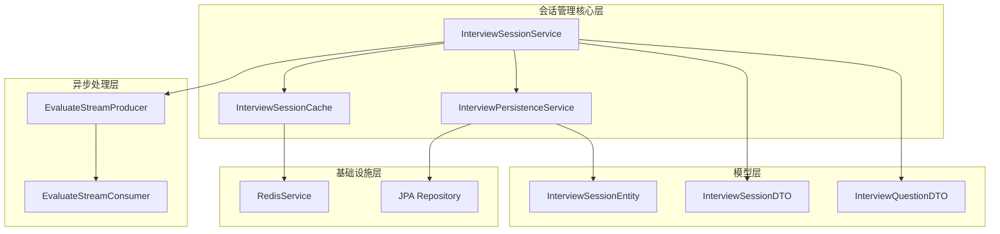
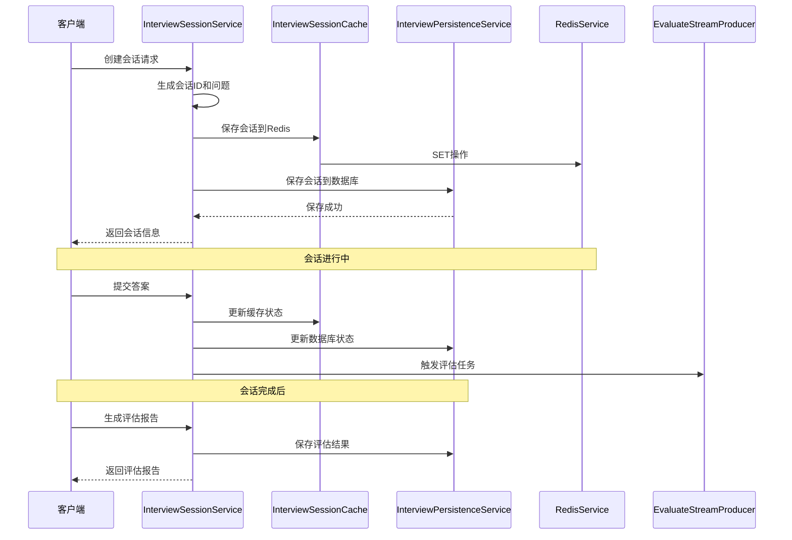
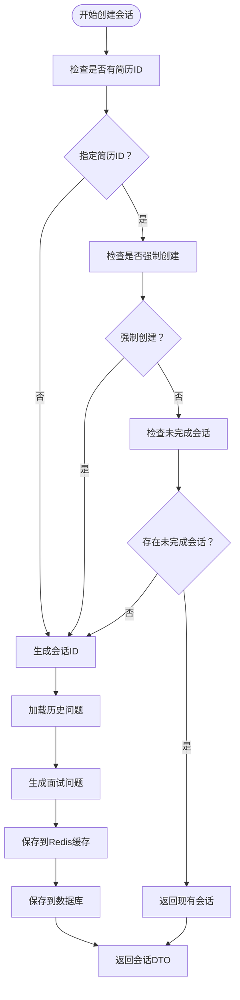
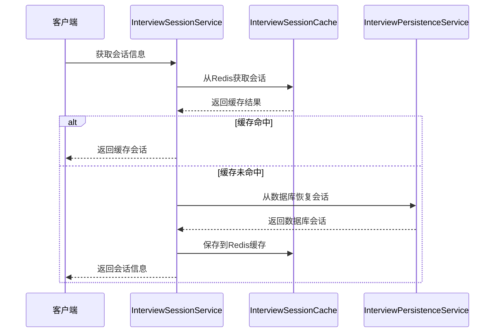
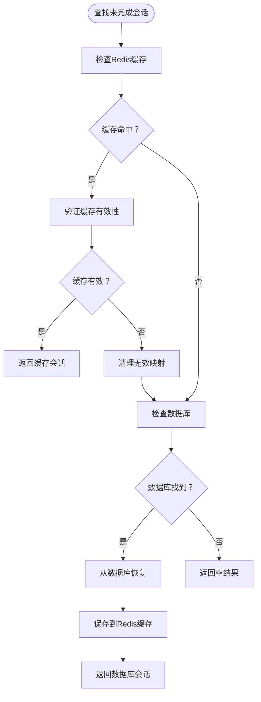
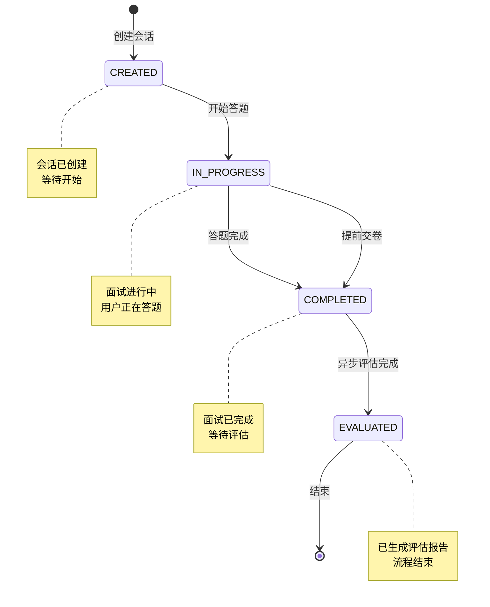
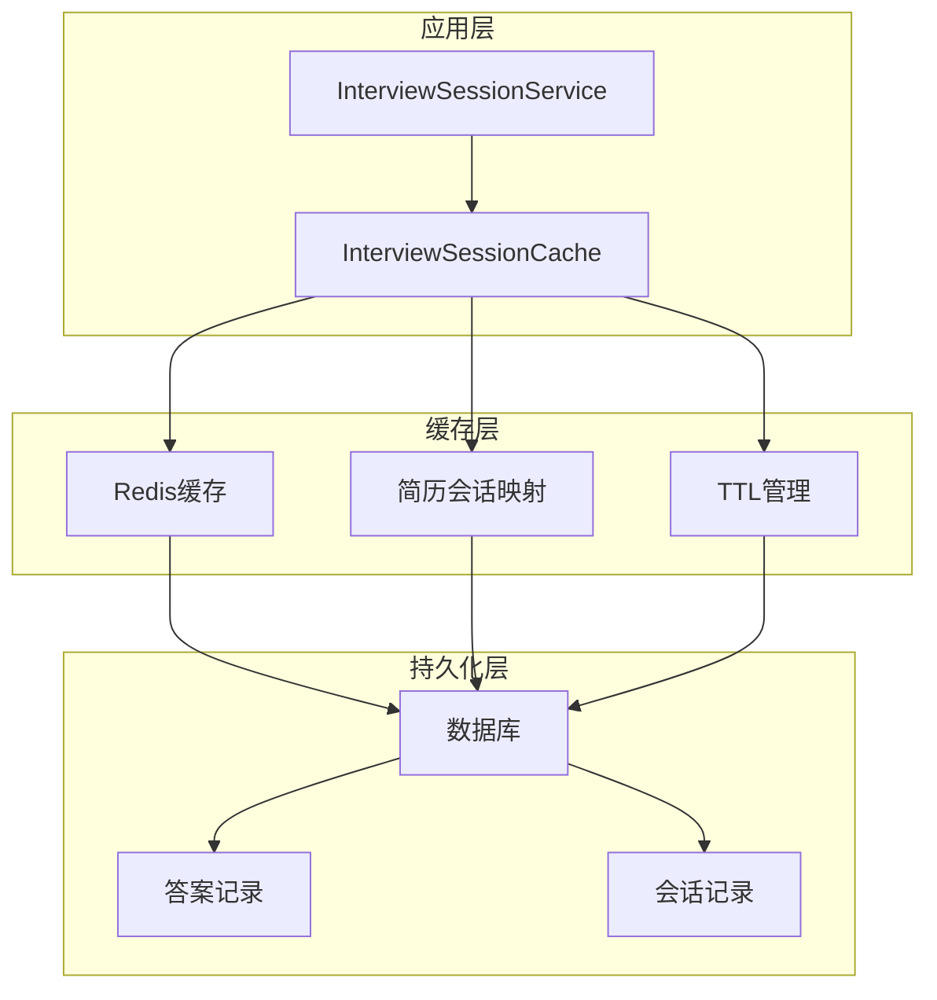
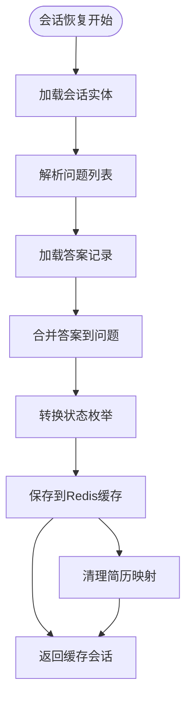
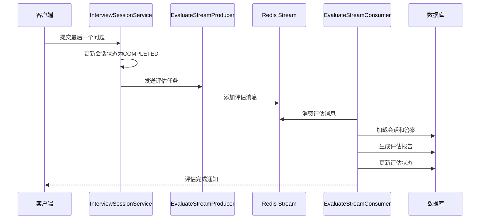
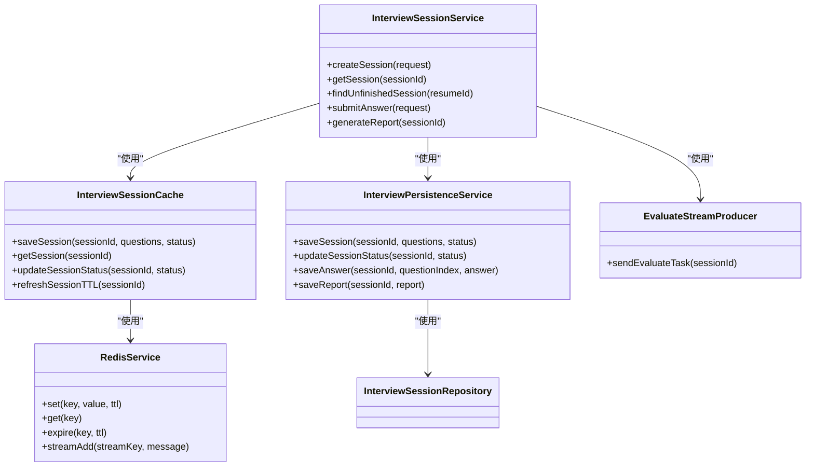

# 会话生命周期管理

<cite>
**本文档引用的文件**
- [InterviewSessionService.java](file://app/src/main/java/interview/guide/modules/interview/service/InterviewSessionService.java)
- [InterviewSessionCache.java](file://app/src/main/java/interview/guide/infrastructure/redis/InterviewSessionCache.java)
- [RedisService.java](file://app/src/main/java/interview/guide/infrastructure/redis/RedisService.java)
- [InterviewPersistenceService.java](file://app/src/main/java/interview/guide/modules/interview/service/InterviewPersistenceService.java)
- [InterviewSessionRepository.java](file://app/src/main/java/interview/guide/modules/interview/repository/InterviewSessionRepository.java)
- [InterviewSessionEntity.java](file://app/src/main/java/interview/guide/modules/interview/model/InterviewSessionEntity.java)
- [InterviewSessionDTO.java](file://app/src/main/java/interview/guide/modules/interview/model/InterviewSessionDTO.java)
- [InterviewQuestionDTO.java](file://app/src/main/java/interview/guide/modules/interview/model/InterviewQuestionDTO.java)
- [EvaluateStreamConsumer.java](file://app/src/main/java/interview/guide/modules/interview/listener/EvaluateStreamConsumer.java)
- [EvaluateStreamProducer.java](file://app/src/main/java/interview/guide/modules/interview/listener/EvaluateStreamProducer.java)
</cite>

## 目录
1. [简介](#简介)
2. [项目结构](#项目结构)
3. [核心组件](#核心组件)
4. [架构概览](#架构概览)
5. [详细组件分析](#详细组件分析)
6. [依赖关系分析](#依赖关系分析)
7. [性能考虑](#性能考虑)
8. [故障排除指南](#故障排除指南)
9. [结论](#结论)

## 简介

本文档深入解析面试指导系统中的会话生命周期管理系统，重点分析InterviewSessionService的核心功能实现。该系统采用Redis缓存与数据库协同的工作机制，实现了高效的面试会话管理，包括会话创建、状态查询、未完成会话查找等核心功能。

系统支持完整的会话状态转换机制，从CREATED→IN_PROGRESS→COMPLETED→EVALUATED，确保面试流程的完整性和一致性。通过Redis缓存实现高并发访问，通过数据库持久化保证数据可靠性，通过异步评估机制提升用户体验。

## 项目结构

面试会话管理功能主要分布在以下模块中：

**图表来源**
- [InterviewSessionService.java:40-507](file://app/src/main/java/interview/guide/modules/interview/service/InterviewSessionService.java#L40-L507)
- [InterviewSessionCache.java:27-244](file://app/src/main/java/interview/guide/infrastructure/redis/InterviewSessionCache.java#L27-L244)
- [InterviewPersistenceService.java:36-359](file://app/src/main/java/interview/guide/modules/interview/service/InterviewPersistenceService.java#L36-L359)

**章节来源**
- [InterviewSessionService.java:1-507](file://app/src/main/java/interview/guide/modules/interview/service/InterviewSessionService.java#L1-L507)
- [InterviewSessionCache.java:1-244](file://app/src/main/java/interview/guide/infrastructure/redis/InterviewSessionCache.java#L1-L244)
- [InterviewPersistenceService.java:1-359](file://app/src/main/java/interview/guide/modules/interview/service/InterviewPersistenceService.java#L1-L359)

## 核心组件

### InterviewSessionService - 会话管理核心服务

InterviewSessionService是会话生命周期管理的核心组件，负责协调各个子系统的协作。该服务采用组合设计模式，注入了问题生成、答案评估、持久化、缓存、流处理等多个依赖。

主要职责包括：
- 会话创建与初始化
- 会话状态管理与转换
- 问题提交与进度跟踪
- 评估任务调度
- 报告生成与状态更新

**章节来源**
- [InterviewSessionService.java:40-507](file://app/src/main/java/interview/guide/modules/interview/service/InterviewSessionService.java#L40-L507)

### InterviewSessionCache - Redis缓存服务

InterviewSessionCache专门负责Redis缓存操作，实现了会话数据的高性能缓存。该服务提供了完整的缓存生命周期管理，包括数据存储、检索、更新、过期管理等功能。

关键特性：
- 会话数据序列化存储
- 基于简历ID的未完成会话映射
- TTL（生存时间）管理
- 缓存一致性维护

**章节来源**
- [InterviewSessionCache.java:27-244](file://app/src/main/java/interview/guide/infrastructure/redis/InterviewSessionCache.java#L27-L244)

### InterviewPersistenceService - 数据持久化服务

InterviewPersistenceService负责数据库操作，确保会话数据的持久化存储。该服务实现了事务性操作，保证数据的一致性和完整性。

核心功能：
- 会话实体的创建与更新
- 答案数据的持久化
- 历史数据查询
- 评估状态管理

**章节来源**
- [InterviewPersistenceService.java:36-359](file://app/src/main/java/interview/guide/modules/interview/service/InterviewPersistenceService.java#L36-L359)

## 架构概览

系统采用分层架构设计，实现了缓存层、服务层、持久化层的清晰分离：

**图表来源**
- [InterviewSessionService.java:55-118](file://app/src/main/java/interview/guide/modules/interview/service/InterviewSessionService.java#L55-L118)
- [InterviewSessionCache.java:89-105](file://app/src/main/java/interview/guide/infrastructure/redis/InterviewSessionCache.java#L89-L105)
- [InterviewPersistenceService.java:46-78](file://app/src/main/java/interview/guide/modules/interview/service/InterviewPersistenceService.java#L46-L78)

## 详细组件分析

### 会话创建流程（createSession）

会话创建是整个生命周期管理的基础，涉及多个步骤的协调工作：

**图表来源**
- [InterviewSessionService.java:55-118](file://app/src/main/java/interview/guide/modules/interview/service/InterviewSessionService.java#L55-L118)

**章节来源**
- [InterviewSessionService.java:55-118](file://app/src/main/java/interview/guide/modules/interview/service/InterviewSessionService.java#L55-L118)

### 会话状态查询流程（getSession）

会话状态查询采用了缓存优先的策略，确保高并发场景下的性能表现：

**图表来源**
- [InterviewSessionService.java:123-137](file://app/src/main/java/interview/guide/modules/interview/service/InterviewSessionService.java#L123-L137)
- [InterviewSessionCache.java:110-118](file://app/src/main/java/interview/guide/infrastructure/redis/InterviewSessionCache.java#L110-L118)

**章节来源**
- [InterviewSessionService.java:123-137](file://app/src/main/java/interview/guide/modules/interview/service/InterviewSessionService.java#L123-L137)

### 未完成会话查找流程（findUnfinishedSession）

该功能支持用户在中断后继续之前的面试，体现了良好的用户体验设计：

**图表来源**
- [InterviewSessionService.java:142-170](file://app/src/main/java/interview/guide/modules/interview/service/InterviewSessionService.java#L142-L170)
- [InterviewSessionCache.java:184-198](file://app/src/main/java/interview/guide/infrastructure/redis/InterviewSessionCache.java#L184-L198)

**章节来源**
- [InterviewSessionService.java:142-170](file://app/src/main/java/interview/guide/modules/interview/service/InterviewSessionService.java#L142-L170)

### 会话状态转换机制

系统实现了严格的会话状态转换，确保面试流程的规范性：

**图表来源**
- [InterviewSessionEntity.java:105-110](file://app/src/main/java/interview/guide/modules/interview/model/InterviewSessionEntity.java#L105-L110)
- [InterviewSessionDTO.java:16-21](file://app/src/main/java/interview/guide/modules/interview/model/InterviewSessionDTO.java#L16-L21)

**章节来源**
- [InterviewSessionEntity.java:105-110](file://app/src/main/java/interview/guide/modules/interview/model/InterviewSessionEntity.java#L105-L110)
- [InterviewSessionDTO.java:16-21](file://app/src/main/java/interview/guide/modules/interview/model/InterviewSessionDTO.java#L16-L21)

### Redis缓存与数据库协同工作机制

系统采用了"缓存优先，数据库兜底"的设计理念，实现了高效的读写分离：

**图表来源**
- [InterviewSessionCache.java:35-45](file://app/src/main/java/interview/guide/infrastructure/redis/InterviewSessionCache.java#L35-L45)
- [InterviewPersistenceService.java:46-78](file://app/src/main/java/interview/guide/modules/interview/service/InterviewPersistenceService.java#L46-L78)

**章节来源**
- [InterviewSessionCache.java:35-45](file://app/src/main/java/interview/guide/infrastructure/redis/InterviewSessionCache.java#L35-L45)
- [InterviewPersistenceService.java:46-78](file://app/src/main/java/interview/guide/modules/interview/service/InterviewPersistenceService.java#L46-L78)

### 会话恢复机制（restoreSessionFromDatabase）

当缓存失效或未命中时，系统提供了完整的会话恢复能力：

**图表来源**
- [InterviewSessionService.java:183-235](file://app/src/main/java/interview/guide/modules/interview/service/InterviewSessionService.java#L183-L235)

**章节来源**
- [InterviewSessionService.java:183-235](file://app/src/main/java/interview/guide/modules/interview/service/InterviewSessionService.java#L183-L235)

### 异步评估处理流程

系统采用Redis Stream实现异步评估，提升了系统的响应性能：

**图表来源**
- [InterviewSessionService.java:338-343](file://app/src/main/java/interview/guide/modules/interview/service/InterviewSessionService.java#L338-L343)
- [EvaluateStreamProducer.java:33-35](file://app/src/main/java/interview/guide/modules/interview/listener/EvaluateStreamProducer.java#L33-L35)
- [EvaluateStreamConsumer.java:104-134](file://app/src/main/java/interview/guide/modules/interview/listener/EvaluateStreamConsumer.java#L104-L134)

**章节来源**
- [EvaluateStreamProducer.java:33-35](file://app/src/main/java/interview/guide/modules/interview/listener/EvaluateStreamProducer.java#L33-L35)
- [EvaluateStreamConsumer.java:104-134](file://app/src/main/java/interview/guide/modules/interview/listener/EvaluateStreamConsumer.java#L104-L134)

## 依赖关系分析

系统各组件之间的依赖关系清晰明确，遵循了依赖倒置原则：

**图表来源**
- [InterviewSessionService.java:42-48](file://app/src/main/java/interview/guide/modules/interview/service/InterviewSessionService.java#L42-L48)
- [InterviewSessionCache.java:29-30](file://app/src/main/java/interview/guide/infrastructure/redis/InterviewSessionCache.java#L29-L30)
- [InterviewPersistenceService.java:38-41](file://app/src/main/java/interview/guide/modules/interview/service/InterviewPersistenceService.java#L38-L41)

**章节来源**
- [InterviewSessionService.java:42-48](file://app/src/main/java/interview/guide/modules/interview/service/InterviewSessionService.java#L42-L48)

## 性能考虑

### 缓存策略优化

系统采用了多层次的缓存策略来提升性能：

1. **热点数据缓存**：会话数据默认缓存24小时，适合长时间在线的面试场景
2. **TTL刷新机制**：每次访问都会刷新TTL，防止活跃会话被意外淘汰
3. **简历ID映射**：快速定位用户的未完成会话，减少数据库查询

### 数据库优化

1. **索引设计**：针对常用查询字段建立了复合索引，包括简历ID+状态+创建时间等
2. **延迟加载**：简历实体采用LAZY加载，避免不必要的关联查询
3. **批量操作**：历史问题查询采用TOP N限制，控制数据量

### 异步处理优化

1. **Redis Stream**：使用Redis Stream实现消息队列，支持高吞吐量的异步评估
2. **阻塞读取**：消费者使用阻塞读取，减少CPU占用
3. **重试机制**：完善的重试和错误处理机制，确保评估任务的可靠性

## 故障排除指南

### 常见问题及解决方案

#### 会话创建失败
**症状**：创建会话时报错，但数据库中没有记录
**原因分析**：
- Redis连接异常
- JSON序列化失败
- 数据库事务回滚

**解决步骤**：
1. 检查Redis连接配置
2. 验证问题列表的JSON序列化
3. 查看数据库事务日志

#### 会话状态不一致
**症状**：缓存和数据库中的会话状态不同步
**原因分析**：
- 缓存更新失败
- 数据库更新异常
- 并发更新冲突

**解决步骤**：
1. 清理相关缓存键
2. 检查数据库约束
3. 实施分布式锁

#### 评估任务积压
**症状**：评估任务长时间未处理
**原因分析**：
- Redis Stream消费者组配置错误
- 消费者实例数量不足
- 评估过程异常

**解决步骤**：
1. 检查消费者组创建
2. 增加消费者实例
3. 查看评估日志

**章节来源**
- [InterviewSessionService.java:106-108](file://app/src/main/java/interview/guide/modules/interview/service/InterviewSessionService.java#L106-L108)
- [InterviewPersistenceService.java:74-77](file://app/src/main/java/interview/guide/modules/interview/service/InterviewPersistenceService.java#L74-L77)

## 结论

面试会话生命周期管理系统通过精心设计的架构和实现，成功实现了高并发、高可用的面试管理功能。系统的主要优势包括：

1. **高性能架构**：采用Redis缓存+数据库双层存储，平衡了性能和可靠性
2. **完整的状态管理**：严格的会话状态转换机制确保了流程的规范性
3. **异步处理能力**：通过Redis Stream实现高效的异步评估
4. **良好的扩展性**：模块化设计便于功能扩展和维护

该系统为面试指导平台提供了坚实的技术基础，能够支持大规模的并发访问和复杂的业务场景。通过持续的优化和改进，可以进一步提升系统的性能和用户体验。