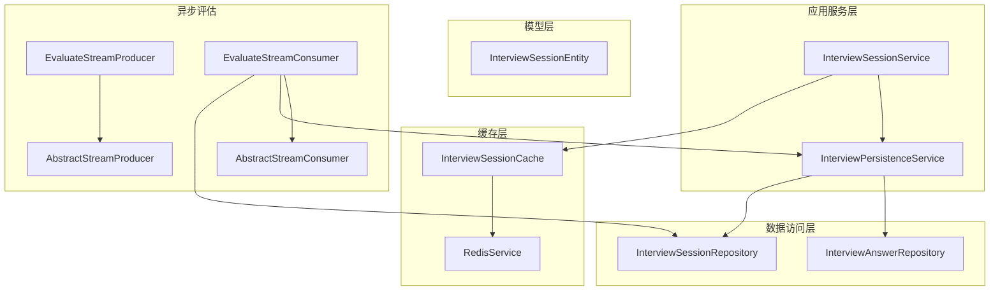
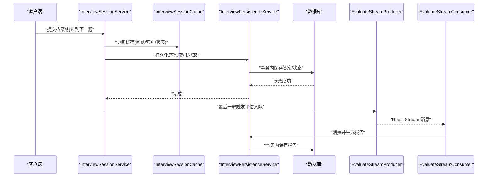
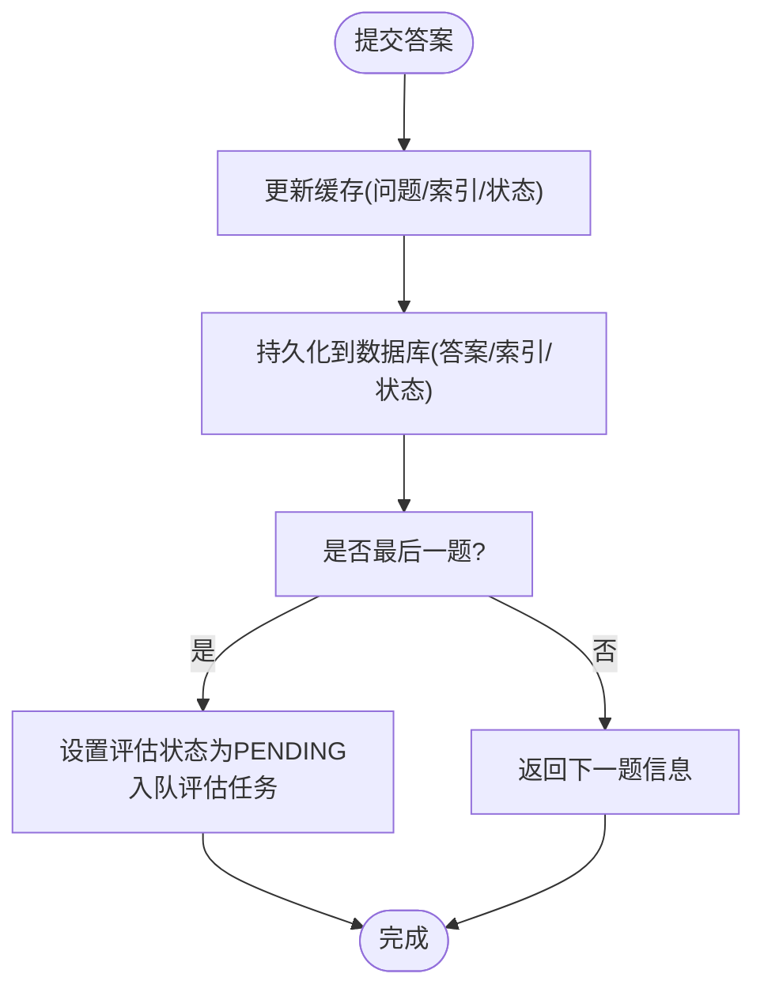
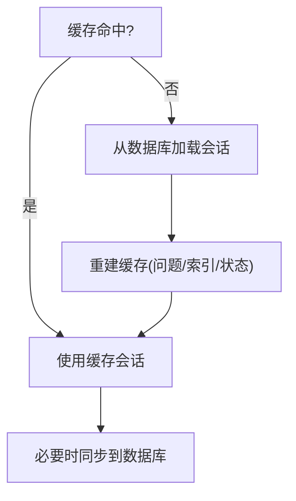
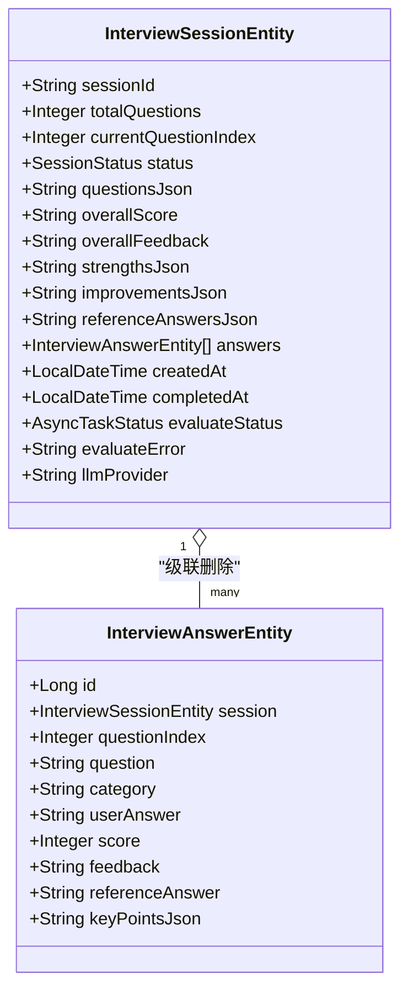
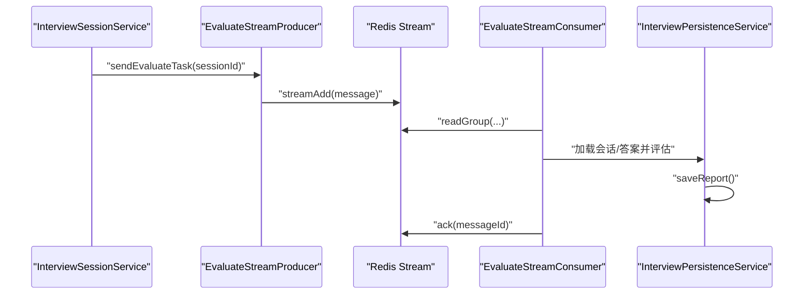
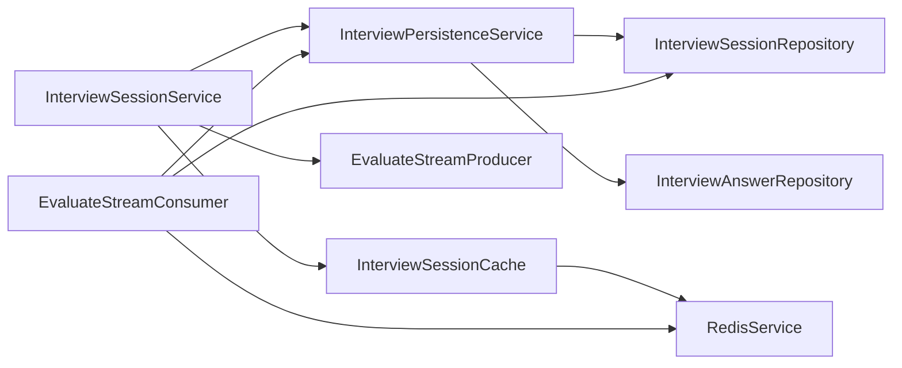

# 持久化协调

<cite>
**本文引用的文件**
- [InterviewSessionService.java](file://app/src/main/java/interview/guide/modules/interview/service/InterviewSessionService.java)
- [InterviewPersistenceService.java](file://app/src/main/java/interview/guide/modules/interview/service/InterviewPersistenceService.java)
- [InterviewSessionCache.java](file://app/src/main/java/interview/guide/infrastructure/redis/InterviewSessionCache.java)
- [RedisService.java](file://app/src/main/java/interview/guide/infrastructure/redis/RedisService.java)
- [InterviewSessionRepository.java](file://app/src/main/java/interview/guide/modules/interview/repository/InterviewSessionRepository.java)
- [InterviewAnswerRepository.java](file://app/src/main/java/interview/guide/modules/interview/repository/InterviewAnswerRepository.java)
- [InterviewSessionEntity.java](file://app/src/main/java/interview/guide/modules/interview/model/InterviewSessionEntity.java)
- [EvaluateStreamConsumer.java](file://app/src/main/java/interview/guide/modules/interview/listener/EvaluateStreamConsumer.java)
- [EvaluateStreamProducer.java](file://app/src/main/java/interview/guide/modules/interview/listener/EvaluateStreamProducer.java)
- [AbstractStreamConsumer.java](file://app/src/main/java/interview/guide/common/async/AbstractStreamConsumer.java)
- [AbstractStreamProducer.java](file://app/src/main/java/interview/guide/common/async/AbstractStreamProducer.java)
- [CommonConstants.java](file://app/src/main/java/interview/guide/common/constant/CommonConstants.java)
</cite>

## 目录
1. [简介](#简介)
2. [项目结构](#项目结构)
3. [核心组件](#核心组件)
4. [架构总览](#架构总览)
5. [详细组件分析](#详细组件分析)
6. [依赖分析](#依赖分析)
7. [性能考虑](#性能考虑)
8. [故障排查指南](#故障排查指南)
9. [结论](#结论)
10. [附录](#附录)

## 简介
本文聚焦面试模块中的“持久化协调”机制，系统阐述 InterviewSessionService 与 InterviewPersistenceService 的协作关系，覆盖以下主题：
- 数据一致性保障与事务边界
- 会话状态同步策略（Redis 缓存与数据库）
- 冲突处理与最终一致性
- 异步评估流水线与状态流转
- 异常处理、重试与故障恢复
- 持久化性能优化与容量规划建议

## 项目结构
面试持久化相关的关键层次如下：
- 服务层：InterviewSessionService（会话生命周期与缓存同步）、InterviewPersistenceService（数据库事务与持久化）
- 缓存层：InterviewSessionCache（Redis 会话缓存）、RedisService（Redis 原语封装）
- 数据访问层：InterviewSessionRepository、InterviewAnswerRepository（JPA）
- 模型层：InterviewSessionEntity（JPA 实体与索引）
- 异步评估：EvaluateStreamProducer（入队）、EvaluateStreamConsumer（消费与评估）

图表来源
- [InterviewSessionService.java:40-507](file://app/src/main/java/interview/guide/modules/interview/service/InterviewSessionService.java#L40-L507)
- [InterviewPersistenceService.java:36-359](file://app/src/main/java/interview/guide/modules/interview/service/InterviewPersistenceService.java#L36-L359)
- [InterviewSessionCache.java:27-244](file://app/src/main/java/interview/guide/infrastructure/redis/InterviewSessionCache.java#L27-L244)
- [RedisService.java:29-395](file://app/src/main/java/interview/guide/infrastructure/redis/RedisService.java#L29-L395)
- [InterviewSessionRepository.java:17-77](file://app/src/main/java/interview/guide/modules/interview/repository/InterviewSessionRepository.java#L17-L77)
- [InterviewAnswerRepository.java:14-37](file://app/src/main/java/interview/guide/modules/interview/repository/InterviewAnswerRepository.java#L14-L37)
- [InterviewSessionEntity.java:14-287](file://app/src/main/java/interview/guide/modules/interview/model/InterviewSessionEntity.java#L14-L287)
- [EvaluateStreamConsumer.java:30-185](file://app/src/main/java/interview/guide/modules/interview/listener/EvaluateStreamConsumer.java#L30-L185)
- [EvaluateStreamProducer.java:17-78](file://app/src/main/java/interview/guide/modules/interview/listener/EvaluateStreamProducer.java#L17-L78)
- [AbstractStreamConsumer.java:23-176](file://app/src/main/java/interview/guide/common/async/AbstractStreamConsumer.java#L23-L176)
- [AbstractStreamProducer.java:13-55](file://app/src/main/java/interview/guide/common/async/AbstractStreamProducer.java#L13-L55)

章节来源
- [InterviewSessionService.java:40-507](file://app/src/main/java/interview/guide/modules/interview/service/InterviewSessionService.java#L40-L507)
- [InterviewPersistenceService.java:36-359](file://app/src/main/java/interview/guide/modules/interview/service/InterviewPersistenceService.java#L36-L359)

## 核心组件
- InterviewSessionService：负责会话生命周期管理、缓存优先读取与数据库恢复、状态推进、答案持久化与评估触发。
- InterviewPersistenceService：负责数据库事务边界内的会话、答案、报告的持久化与状态更新，提供历史问题加载与删除能力。
- InterviewSessionCache：负责 Redis 会话缓存、简历到会话的映射、TTL 刷新与状态同步。
- RedisService：提供 Redis 基础操作、Stream 消费/生产、分布式锁等通用能力。
- EvaluateStreamProducer/Consumer：基于 Redis Stream 的异步评估流水线，具备重试、ACK、状态标记能力。

章节来源
- [InterviewSessionService.java:40-507](file://app/src/main/java/interview/guide/modules/interview/service/InterviewSessionService.java#L40-L507)
- [InterviewPersistenceService.java:36-359](file://app/src/main/java/interview/guide/modules/interview/service/InterviewPersistenceService.java#L36-L359)
- [InterviewSessionCache.java:27-244](file://app/src/main/java/interview/guide/infrastructure/redis/InterviewSessionCache.java#L27-L244)
- [RedisService.java:29-395](file://app/src/main/java/interview/guide/infrastructure/redis/RedisService.java#L29-L395)
- [EvaluateStreamConsumer.java:30-185](file://app/src/main/java/interview/guide/modules/interview/listener/EvaluateStreamConsumer.java#L30-L185)
- [EvaluateStreamProducer.java:17-78](file://app/src/main/java/interview/guide/modules/interview/listener/EvaluateStreamProducer.java#L17-L78)

## 架构总览
持久化协调遵循“缓存优先、数据库兜底”的策略，并以事务边界确保数据库侧的一致性。会话状态在 Redis 与数据库之间双向同步，异步评估通过 Redis Stream 完成解耦与重试。

图表来源
- [InterviewSessionService.java:295-357](file://app/src/main/java/interview/guide/modules/interview/service/InterviewSessionService.java#L295-L357)
- [InterviewPersistenceService.java:133-162](file://app/src/main/java/interview/guide/modules/interview/service/InterviewPersistenceService.java#L133-L162)
- [EvaluateStreamProducer.java:33-35](file://app/src/main/java/interview/guide/modules/interview/listener/EvaluateStreamProducer.java#L33-L35)
- [EvaluateStreamConsumer.java:104-134](file://app/src/main/java/interview/guide/modules/interview/listener/EvaluateStreamConsumer.java#L104-L134)

## 详细组件分析

### InterviewSessionService 与 InterviewPersistenceService 协作
- 会话创建：先写 Redis 缓存，再尝试持久化数据库；若数据库失败，仍返回缓存中的会话，保证前端体验连续性。
- 状态推进：首次获取当前问题时，若状态为 CREATED，则更新为 IN_PROGRESS 并同步到数据库；提交答案时，先更新缓存，再持久化；最后题自动触发评估。
- 评估流程：提交答案或提前交卷时，设置评估状态为 PENDING，并将任务入队到 Redis Stream；消费者拉取消息后执行评估并落库。

图表来源
- [InterviewSessionService.java:295-357](file://app/src/main/java/interview/guide/modules/interview/service/InterviewSessionService.java#L295-L357)
- [InterviewPersistenceService.java:133-162](file://app/src/main/java/interview/guide/modules/interview/service/InterviewPersistenceService.java#L133-L162)

章节来源
- [InterviewSessionService.java:55-118](file://app/src/main/java/interview/guide/modules/interview/service/InterviewSessionService.java#L55-L118)
- [InterviewSessionService.java:274-289](file://app/src/main/java/interview/guide/modules/interview/service/InterviewSessionService.java#L274-L289)
- [InterviewSessionService.java:295-357](file://app/src/main/java/interview/guide/modules/interview/service/InterviewSessionService.java#L295-L357)
- [InterviewSessionService.java:403-427](file://app/src/main/java/interview/guide/modules/interview/service/InterviewSessionService.java#L403-L427)

### 会话状态同步机制与冲突处理
- 缓存优先策略：getSession/findUnfinishedSession 优先从 Redis 获取；缓存未命中时从数据库恢复，并写回缓存。
- 状态同步：Redis 与数据库状态字段一一对应（CREATED/IN_PROGRESS/COMPLETED/EVALUATED），两者变更均需在各自层完成。
- 冲突处理：Redis 作为“热数据”，数据库作为“权威事实”。若缓存与数据库状态不一致，以数据库为准；恢复时会将数据库状态写回缓存。
- 未完成会话映射：简历ID到会话ID的映射仅在未完成状态下维护，完成后自动清理，避免脏读。

图表来源
- [InterviewSessionService.java:123-137](file://app/src/main/java/interview/guide/modules/interview/service/InterviewSessionService.java#L123-L137)
- [InterviewSessionService.java:142-170](file://app/src/main/java/interview/guide/modules/interview/service/InterviewSessionService.java#L142-L170)
- [InterviewSessionCache.java:184-198](file://app/src/main/java/interview/guide/infrastructure/redis/InterviewSessionCache.java#L184-L198)

章节来源
- [InterviewSessionCache.java:89-105](file://app/src/main/java/interview/guide/infrastructure/redis/InterviewSessionCache.java#L89-L105)
- [InterviewSessionCache.java:123-136](file://app/src/main/java/interview/guide/infrastructure/redis/InterviewSessionCache.java#L123-L136)
- [InterviewSessionCache.java:226-238](file://app/src/main/java/interview/guide/infrastructure/redis/InterviewSessionCache.java#L226-L238)

### 数据一致性与事务处理
- 事务边界：InterviewPersistenceService 的 saveSession/updateSessionStatus/updateCurrentQuestionIndex/saveAnswer/saveReport 均标注为事务方法，确保数据库层面的 ACID。
- 序列化/反序列化：问题列表以 JSON 存储在数据库，使用 ObjectMapper 进行序列化/反序列化；异常时抛出业务异常，避免脏数据。
- 级联删除：InterviewSessionEntity 对答案设置 cascade = CascadeType.ALL, orphanRemoval = true，删除会话时自动删除答案。

图表来源
- [InterviewSessionEntity.java:14-287](file://app/src/main/java/interview/guide/modules/interview/model/InterviewSessionEntity.java#L14-L287)
- [InterviewAnswerRepository.java:14-37](file://app/src/main/java/interview/guide/modules/interview/repository/InterviewAnswerRepository.java#L14-L37)

章节来源
- [InterviewPersistenceService.java:46-78](file://app/src/main/java/interview/guide/modules/interview/service/InterviewPersistenceService.java#L46-L78)
- [InterviewPersistenceService.java:83-95](file://app/src/main/java/interview/guide/modules/interview/service/InterviewPersistenceService.java#L83-L95)
- [InterviewPersistenceService.java:119-128](file://app/src/main/java/interview/guide/modules/interview/service/InterviewPersistenceService.java#L119-L128)
- [InterviewPersistenceService.java:133-162](file://app/src/main/java/interview/guide/modules/interview/service/InterviewPersistenceService.java#L133-L162)
- [InterviewPersistenceService.java:167-244](file://app/src/main/java/interview/guide/modules/interview/service/InterviewPersistenceService.java#L167-L244)

### 异步评估流水线与状态修复
- 入队：提交答案或提前交卷时，设置评估状态为 PENDING，并将 sessionId 入队到 Redis Stream。
- 消费：EvaluateStreamConsumer 基于 AbstractStreamConsumer 模板，实现重试、ACK、状态标记与失败处理。
- 状态修复：若评估失败，状态标记为 FAILED；若重试耗尽，仍会标记失败并截断错误信息，便于后续人工介入。

图表来源
- [InterviewSessionService.java:338-343](file://app/src/main/java/interview/guide/modules/interview/service/InterviewSessionService.java#L338-L343)
- [EvaluateStreamProducer.java:33-53](file://app/src/main/java/interview/guide/modules/interview/listener/EvaluateStreamProducer.java#L33-L53)
- [EvaluateStreamConsumer.java:104-134](file://app/src/main/java/interview/guide/modules/interview/listener/EvaluateStreamConsumer.java#L104-L134)
- [AbstractStreamConsumer.java:74-123](file://app/src/main/java/interview/guide/common/async/AbstractStreamConsumer.java#L74-L123)

章节来源
- [EvaluateStreamProducer.java:33-78](file://app/src/main/java/interview/guide/modules/interview/listener/EvaluateStreamProducer.java#L33-L78)
- [EvaluateStreamConsumer.java:104-185](file://app/src/main/java/interview/guide/modules/interview/listener/EvaluateStreamConsumer.java#L104-L185)
- [AbstractStreamConsumer.java:23-176](file://app/src/main/java/interview/guide/common/async/AbstractStreamConsumer.java#L23-L176)

## 依赖分析
- 服务层依赖：InterviewSessionService 依赖 InterviewPersistenceService、InterviewSessionCache、EvaluateStreamProducer；InterviewPersistenceService 依赖 JPA Repositories 与 ObjectMapper。
- 缓存与数据库：InterviewSessionCache 通过 RedisService 与 Redis 交互；InterviewSessionRepository/AnswerRepository 提供数据库访问。
- 异步依赖：EvaluateStreamConsumer 依赖 RedisService、InterviewSessionRepository、InterviewPersistenceService 与 LlmProviderRegistry。

图表来源
- [InterviewSessionService.java:42-48](file://app/src/main/java/interview/guide/modules/interview/service/InterviewSessionService.java#L42-L48)
- [InterviewPersistenceService.java:38-41](file://app/src/main/java/interview/guide/modules/interview/service/InterviewPersistenceService.java#L38-L41)
- [InterviewSessionCache.java:29-30](file://app/src/main/java/interview/guide/infrastructure/redis/InterviewSessionCache.java#L29-L30)
- [EvaluateStreamConsumer.java:40-53](file://app/src/main/java/interview/guide/modules/interview/listener/EvaluateStreamConsumer.java#L40-L53)

章节来源
- [InterviewSessionRepository.java:17-77](file://app/src/main/java/interview/guide/modules/interview/repository/InterviewSessionRepository.java#L17-L77)
- [InterviewAnswerRepository.java:14-37](file://app/src/main/java/interview/guide/modules/interview/repository/InterviewAnswerRepository.java#L14-L37)

## 性能考虑
- 缓存命中与热点：Redis 缓存默认 TTL 为 24 小时，适合长会话场景；高频会话可通过刷新 TTL 降低过期风险。
- 批量与序列化：答案持久化采用逐条 upsert（按 sessionId+questionIndex），避免大事务；问题列表以 JSON 存储，注意序列化开销。
- 查询优化：数据库层已建立复合索引（如 resume_id+created_at、resume_id+status+created_at、skillId+createdAt），有助于历史问题与会话查询。
- 异步评估：通过 Redis Stream 解耦评估任务，避免阻塞主线程；消费者组模式支持水平扩展。
- Redis 压力：Stream 长度受最大长度限制，重试消息会再次入队，需关注积压与死信处理。

章节来源
- [InterviewSessionCache.java:43-45](file://app/src/main/java/interview/guide/infrastructure/redis/InterviewSessionCache.java#L43-L45)
- [InterviewSessionEntity.java:15-19](file://app/src/main/java/interview/guide/modules/interview/model/InterviewSessionEntity.java#L15-L19)
- [InterviewPersistenceService.java:315-357](file://app/src/main/java/interview/guide/modules/interview/service/InterviewPersistenceService.java#L315-L357)
- [RedisService.java:284-301](file://app/src/main/java/interview/guide/infrastructure/redis/RedisService.java#L284-L301)

## 故障排查指南
- 会话未找到：缓存未命中且数据库无记录时抛出业务异常；检查 sessionId 与 resumeId 的组合是否正确。
- 状态不一致：若发现缓存与数据库状态不同，优先以数据库为准；检查恢复流程与状态同步逻辑。
- 评估失败：查看评估状态与错误字段，确认重试次数与消息 ACK；必要时人工干预或重启消费者。
- 持久化异常：序列化失败会抛出业务异常；检查问题列表 JSON 结构与 ObjectMapper 配置。
- 缓存清理：未完成会话映射会在状态变为完成时自动清理；若出现悬挂映射，可在缓存层清理或等待 TTL 过期。

章节来源
- [InterviewSessionService.java:133-134](file://app/src/main/java/interview/guide/modules/interview/service/InterviewSessionService.java#L133-L134)
- [InterviewPersistenceService.java:74-77](file://app/src/main/java/interview/guide/modules/interview/service/InterviewPersistenceService.java#L74-L77)
- [EvaluateStreamConsumer.java:142-144](file://app/src/main/java/interview/guide/modules/interview/listener/EvaluateStreamConsumer.java#L142-L144)

## 结论
该持久化协调机制通过“缓存优先 + 数据库兜底 + 事务边界 + 异步评估”的组合，实现了高可用与高性能的面试会话管理。InterviewSessionService 与 InterviewPersistenceService 在状态推进与数据落库上紧密协作，Redis 与数据库之间通过明确的同步策略与 TTL 管理维持最终一致性；异步评估通过 Redis Stream 实现解耦与重试，整体架构清晰、可扩展性强。

## 附录
- 默认值参考：面试技能、难度与 LLM 提供商默认值定义于通用常量中，便于统一管理与替换。
- 配置建议（示例路径与要点）：
  - Redis 缓存 TTL：根据会话平均时长与过期策略调整（当前默认 24 小时）。
  - Stream 最大长度：根据吞吐量与保留策略设置（当前通过常量配置）。
  - 事务超时与重试：根据评估耗时与数据库负载设置合理的超时与重试上限。
- 运维经验：
  - 监控缓存命中率与数据库慢查询，定期清理过期键与冗余映射。
  - 观察评估任务积压与失败率，动态扩缩容消费者实例。
  - 建立告警：数据库连接池耗尽、Redis 阻塞、Stream 长度超限、评估失败率上升。

章节来源
- [CommonConstants.java:38-44](file://app/src/main/java/interview/guide/common/constant/CommonConstants.java#L38-L44)
- [RedisService.java:284-301](file://app/src/main/java/interview/guide/infrastructure/redis/RedisService.java#L284-L301)
- [AbstractStreamConsumer.java:112-122](file://app/src/main/java/interview/guide/common/async/AbstractStreamConsumer.java#L112-L122)