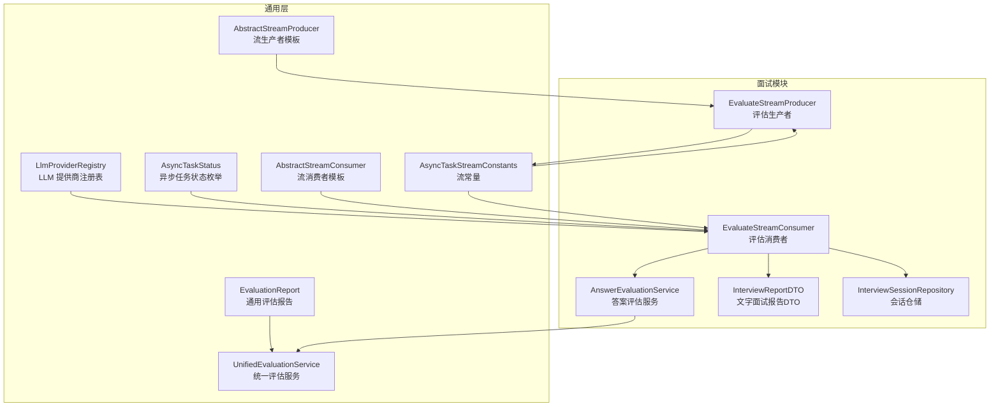
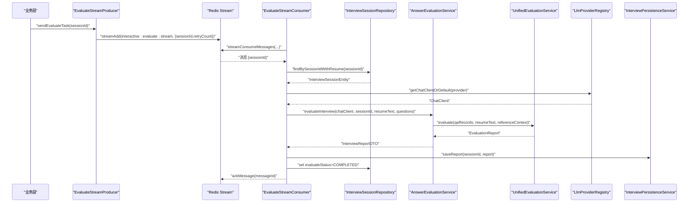
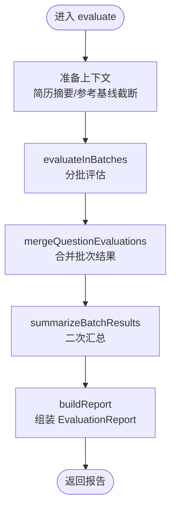
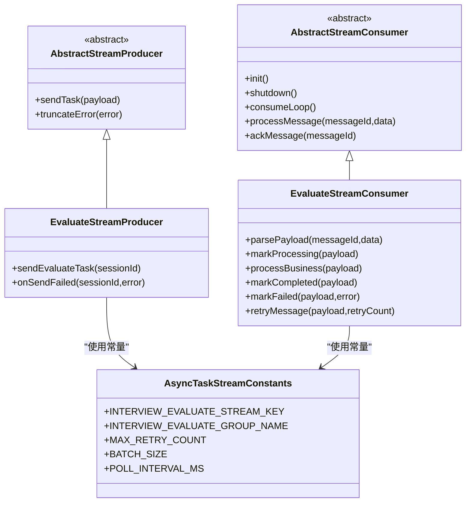
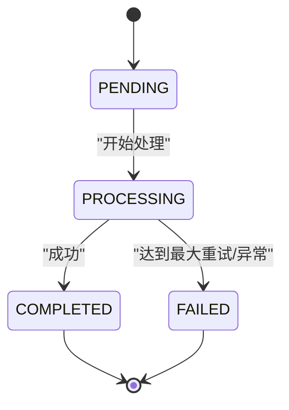
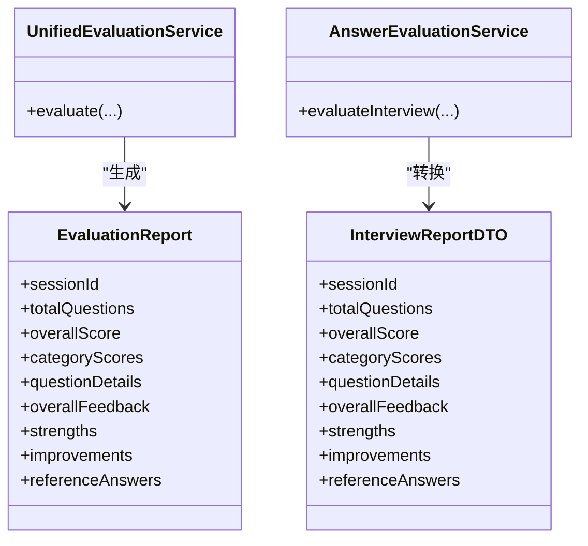
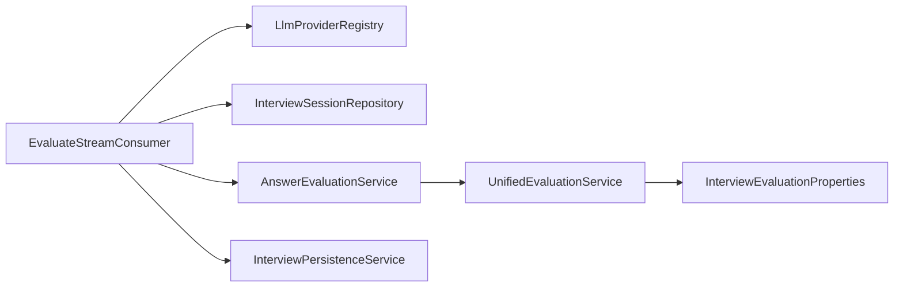

# 评估集成

<cite>
**本文引用的文件**
- [EvaluationReport.java](file://app/src/main/java/interview/guide/common/evaluation/EvaluationReport.java)
- [UnifiedEvaluationService.java](file://app/src/main/java/interview/guide/common/evaluation/UnifiedEvaluationService.java)
- [AsyncTaskStatus.java](file://app/src/main/java/interview/guide/common/model/AsyncTaskStatus.java)
- [EvaluateStreamProducer.java](file://app/src/main/java/interview/guide/modules/interview/listener/EvaluateStreamProducer.java)
- [EvaluateStreamConsumer.java](file://app/src/main/java/interview/guide/modules/interview/listener/EvaluateStreamConsumer.java)
- [AbstractStreamProducer.java](file://app/src/main/java/interview/guide/common/async/AbstractStreamProducer.java)
- [AbstractStreamConsumer.java](file://app/src/main/java/interview/guide/common/async/AbstractStreamConsumer.java)
- [AsyncTaskStreamConstants.java](file://app/src/main/java/interview/guide/common/constant/AsyncTaskStreamConstants.java)
- [AnswerEvaluationService.java](file://app/src/main/java/interview/guide/modules/interview/service/AnswerEvaluationService.java)
- [LlmProviderRegistry.java](file://app/src/main/java/interview/guide/common/ai/LlmProviderRegistry.java)
- [QaRecord.java](file://app/src/main/java/interview/guide/common/evaluation/QaRecord.java)
- [InterviewReportDTO.java](file://app/src/main/java/interview/guide/modules/interview/model/InterviewReportDTO.java)
- [InterviewSessionRepository.java](file://app/src/main/java/interview/guide/modules/interview/repository/InterviewSessionRepository.java)
- [InterviewEvaluationProperties.java](file://app/src/main/java/interview/guide/common/evaluation/InterviewEvaluationProperties.java)
- [interview-evaluation-user.st](file://app/src/main/resources/prompts/interview-evaluation-user.st)
- [interview-evaluation-summary-system.st](file://app/src/main/resources/prompts/interview-evaluation-summary-system.st)
- [interview-evaluation-summary-user.st](file://app/src/main/resources/prompts/interview-evaluation-summary-user.st)
</cite>

## 目录
1. [简介](#简介)
2. [项目结构](#项目结构)
3. [核心组件](#核心组件)
4. [架构总览](#架构总览)
5. [详细组件分析](#详细组件分析)
6. [依赖分析](#依赖分析)
7. [性能考虑](#性能考虑)
8. [故障排查指南](#故障排查指南)
9. [结论](#结论)
10. [附录](#附录)

## 简介
本文件面向“评估集成”的实现与运维，重点覆盖以下方面：
- generateReport 方法的报告生成功能：包括评估服务调用、LLM 提供商选择、报告格式化与二次汇总。
- 异步评估机制：Redis Stream 消息队列、评估任务生产者(EvaluateStreamProducer)的工作原理。
- 评估状态管理与任务生命周期：AsyncTaskStatus 的状态流转与持久化。
- 评估结果的数据结构与后续处理流程：EvaluationReport → InterviewReportDTO → 存储与导出。
- 监控方案、错误重试机制与性能优化策略，并提供集成示例与调试技巧。

## 项目结构
评估相关代码主要分布在以下模块：
- 通用评估与数据模型：common/evaluation、common/model、common/ai、common/async、common/constant
- 文字面试评估服务：modules/interview/service、modules/interview/listener、modules/interview/model、modules/interview/repository
- 提示词资源：resources/prompts

图表来源
- [EvaluationReport.java:1-41](file://app/src/main/java/interview/guide/common/evaluation/EvaluationReport.java#L1-L41)
- [UnifiedEvaluationService.java:1-380](file://app/src/main/java/interview/guide/common/evaluation/UnifiedEvaluationService.java#L1-L380)
- [LlmProviderRegistry.java:1-230](file://app/src/main/java/interview/guide/common/ai/LlmProviderRegistry.java#L1-L230)
- [AsyncTaskStatus.java:1-13](file://app/src/main/java/interview/guide/common/model/AsyncTaskStatus.java#L1-L13)
- [AbstractStreamProducer.java:1-55](file://app/src/main/java/interview/guide/common/async/AbstractStreamProducer.java#L1-L55)
- [AbstractStreamConsumer.java:1-176](file://app/src/main/java/interview/guide/common/async/AbstractStreamConsumer.java#L1-L176)
- [AsyncTaskStreamConstants.java:1-135](file://app/src/main/java/interview/guide/common/constant/AsyncTaskStreamConstants.java#L1-L135)
- [AnswerEvaluationService.java:1-99](file://app/src/main/java/interview/guide/modules/interview/service/AnswerEvaluationService.java#L1-L99)
- [EvaluateStreamProducer.java:1-78](file://app/src/main/java/interview/guide/modules/interview/listener/EvaluateStreamProducer.java#L1-L78)
- [EvaluateStreamConsumer.java:1-185](file://app/src/main/java/interview/guide/modules/interview/listener/EvaluateStreamConsumer.java#L1-L185)
- [InterviewReportDTO.java:1-50](file://app/src/main/java/interview/guide/modules/interview/model/InterviewReportDTO.java#L1-L50)
- [InterviewSessionRepository.java:1-77](file://app/src/main/java/interview/guide/modules/interview/repository/InterviewSessionRepository.java#L1-L77)

章节来源
- [EvaluationReport.java:1-41](file://app/src/main/java/interview/guide/common/evaluation/EvaluationReport.java#L1-L41)
- [UnifiedEvaluationService.java:1-380](file://app/src/main/java/interview/guide/common/evaluation/UnifiedEvaluationService.java#L1-L380)
- [AsyncTaskStreamConstants.java:1-135](file://app/src/main/java/interview/guide/common/constant/AsyncTaskStreamConstants.java#L1-L135)

## 核心组件
- 通用评估报告与问答记录
  - EvaluationReport：定义通用评估报告结构，包含会话ID、总题数、总分、分类得分、每题详情、总体反馈、优势、改进建议、参考答案等。
  - QaRecord：通用问答记录，支持问题索引、问题、类别、用户回答（可空）。
- 统一评估服务
  - UnifiedEvaluationService：实现分批评估、结构化输出、二次汇总与降级兜底，输出 EvaluationReport。
- LLM 提供商注册表
  - LlmProviderRegistry：按配置动态创建 ChatClient，支持默认提供商与工具回调、顾问（Advisors）装配。
- 异步评估流水线
  - EvaluateStreamProducer：将评估任务写入 Redis Stream。
  - EvaluateStreamConsumer：从 Redis Stream 拉取消息并执行评估，更新状态，持久化报告。
  - AbstractStreamProducer/AbstractStreamConsumer：封装消息发送、消费循环、ACK、重试与生命周期管理。
  - AsyncTaskStreamConstants：统一的流键、消费者组、字段与重试参数。
  - AsyncTaskStatus：评估任务状态枚举（PENDING、PROCESSING、COMPLETED、FAILED）。
- 文字面试评估服务
  - AnswerEvaluationService：将 InterviewQuestionDTO 转换为 QaRecord，调用 UnifiedEvaluationService，并转换为 InterviewReportDTO。
- 数据模型与仓储
  - InterviewReportDTO：文字面试专用报告 DTO。
  - InterviewSessionRepository：会话查询与状态更新。

章节来源
- [EvaluationReport.java:1-41](file://app/src/main/java/interview/guide/common/evaluation/EvaluationReport.java#L1-L41)
- [QaRecord.java:1-12](file://app/src/main/java/interview/guide/common/evaluation/QaRecord.java#L1-L12)
- [UnifiedEvaluationService.java:1-380](file://app/src/main/java/interview/guide/common/evaluation/UnifiedEvaluationService.java#L1-L380)
- [LlmProviderRegistry.java:1-230](file://app/src/main/java/interview/guide/common/ai/LlmProviderRegistry.java#L1-L230)
- [AsyncTaskStatus.java:1-13](file://app/src/main/java/interview/guide/common/model/AsyncTaskStatus.java#L1-L13)
- [AbstractStreamProducer.java:1-55](file://app/src/main/java/interview/guide/common/async/AbstractStreamProducer.java#L1-L55)
- [AbstractStreamConsumer.java:1-176](file://app/src/main/java/interview/guide/common/async/AbstractStreamConsumer.java#L1-L176)
- [AsyncTaskStreamConstants.java:1-135](file://app/src/main/java/interview/guide/common/constant/AsyncTaskStreamConstants.java#L1-L135)
- [AnswerEvaluationService.java:1-99](file://app/src/main/java/interview/guide/modules/interview/service/AnswerEvaluationService.java#L1-L99)
- [InterviewReportDTO.java:1-50](file://app/src/main/java/interview/guide/modules/interview/model/InterviewReportDTO.java#L1-L50)
- [InterviewSessionRepository.java:1-77](file://app/src/main/java/interview/guide/modules/interview/repository/InterviewSessionRepository.java#L1-L77)

## 架构总览
评估系统采用“事件驱动 + 流式处理”的异步架构：
- 业务侧在面试结束后通过 EvaluateStreamProducer 将 sessionId 写入 Redis Stream。
- EvaluateStreamConsumer 作为消费者组成员，从流中拉取消息，解析负载，标记处理中，调用 AnswerEvaluationService，再由 UnifiedEvaluationService 调用 LlmProviderRegistry 获取 ChatClient，完成评估与持久化。
- 评估状态通过 AsyncTaskStatus 在会话实体中维护，便于前端轮询与展示。

图表来源
- [EvaluateStreamProducer.java:1-78](file://app/src/main/java/interview/guide/modules/interview/listener/EvaluateStreamProducer.java#L1-L78)
- [EvaluateStreamConsumer.java:1-185](file://app/src/main/java/interview/guide/modules/interview/listener/EvaluateStreamConsumer.java#L1-L185)
- [AnswerEvaluationService.java:1-99](file://app/src/main/java/interview/guide/modules/interview/service/AnswerEvaluationService.java#L1-L99)
- [UnifiedEvaluationService.java:1-380](file://app/src/main/java/interview/guide/common/evaluation/UnifiedEvaluationService.java#L1-L380)
- [LlmProviderRegistry.java:1-230](file://app/src/main/java/interview/guide/common/ai/LlmProviderRegistry.java#L1-L230)
- [AsyncTaskStreamConstants.java:1-135](file://app/src/main/java/interview/guide/common/constant/AsyncTaskStreamConstants.java#L1-L135)

## 详细组件分析

### 统一评估服务（UnifiedEvaluationService）
- 功能职责
  - 输入：ChatClient、sessionId、问答记录列表、简历摘要、可选参考上下文。
  - 分批评估：按配置的批次大小切分问答，逐批调用结构化输出以获得批次报告。
  - 合并与降级：将批次结果合并，对缺失题采用零分兜底；若结构化输出失败则返回空报告，保证整体可用性。
  - 二次汇总：基于类别概览与题目高亮，调用总结提示词生成更一致的总体反馈与优势/改进建议。
  - 输出：EvaluationReport。
- 关键点
  - 简历与参考上下文截断，避免超长导致 token 消耗过大。
  - 使用 BeanOutputConverter 与 PromptTemplate 渲染结构化输出格式。
  - 对 strengths/improvements 去重、限制数量，确保输出质量。

图表来源
- [UnifiedEvaluationService.java:1-380](file://app/src/main/java/interview/guide/common/evaluation/UnifiedEvaluationService.java#L1-L380)

章节来源
- [UnifiedEvaluationService.java:1-380](file://app/src/main/java/interview/guide/common/evaluation/UnifiedEvaluationService.java#L1-L380)
- [InterviewEvaluationProperties.java:1-17](file://app/src/main/java/interview/guide/common/evaluation/InterviewEvaluationProperties.java#L1-L17)
- [interview-evaluation-user.st:1-23](file://app/src/main/resources/prompts/interview-evaluation-user.st#L1-L23)
- [interview-evaluation-summary-system.st:1-11](file://app/src/main/resources/prompts/interview-evaluation-summary-system.st#L1-L11)
- [interview-evaluation-summary-user.st:1-25](file://app/src/main/resources/prompts/interview-evaluation-summary-user.st#L1-L25)

### LLM 提供商选择（LlmProviderRegistry）
- 功能职责
  - 根据 providerId 或默认配置动态创建 ChatClient。
  - 支持工具回调、顾问（Advisors）装配，如工具调用、消息记忆、日志等。
  - 缓存 ChatClient，避免重复创建。
- 使用方式
  - EvaluateStreamConsumer 通过 getChatClientOrDefault(provider) 获取 ChatClient，若会话未指定 provider，则回退到默认提供商。

章节来源
- [LlmProviderRegistry.java:1-230](file://app/src/main/java/interview/guide/common/ai/LlmProviderRegistry.java#L1-L230)
- [EvaluateStreamConsumer.java:128-132](file://app/src/main/java/interview/guide/modules/interview/listener/EvaluateStreamConsumer.java#L128-L132)

### 异步评估机制（Redis Stream）
- 生产者（EvaluateStreamProducer）
  - 将 sessionId 与 retryCount 写入 interview:evaluate:stream。
  - 发送失败时更新会话评估状态为 FAILED。
- 消费者（EvaluateStreamConsumer）
  - 初始化消费者组与线程池，循环拉取消息，解析负载，标记 PROCESSING。
  - 业务处理：读取会话与答案，构建问答列表，获取 ChatClient，调用 AnswerEvaluationService，保存报告，标记 COMPLETED。
  - 错误处理：捕获异常后判断重试次数，超过阈值则标记 FAILED 并 ACK；否则重新入队。
- 模板基类
  - AbstractStreamProducer：统一封装 streamAdd、错误回调与错误截断。
  - AbstractStreamConsumer：统一封装消费者组创建、线程池、消费循环、ACK、重试计数解析与错误截断。

图表来源
- [AbstractStreamProducer.java:1-55](file://app/src/main/java/interview/guide/common/async/AbstractStreamProducer.java#L1-L55)
- [AbstractStreamConsumer.java:1-176](file://app/src/main/java/interview/guide/common/async/AbstractStreamConsumer.java#L1-L176)
- [EvaluateStreamProducer.java:1-78](file://app/src/main/java/interview/guide/modules/interview/listener/EvaluateStreamProducer.java#L1-L78)
- [EvaluateStreamConsumer.java:1-185](file://app/src/main/java/interview/guide/modules/interview/listener/EvaluateStreamConsumer.java#L1-L185)
- [AsyncTaskStreamConstants.java:1-135](file://app/src/main/java/interview/guide/common/constant/AsyncTaskStreamConstants.java#L1-L135)

章节来源
- [EvaluateStreamProducer.java:1-78](file://app/src/main/java/interview/guide/modules/interview/listener/EvaluateStreamProducer.java#L1-L78)
- [EvaluateStreamConsumer.java:1-185](file://app/src/main/java/interview/guide/modules/interview/listener/EvaluateStreamConsumer.java#L1-L185)
- [AbstractStreamProducer.java:1-55](file://app/src/main/java/interview/guide/common/async/AbstractStreamProducer.java#L1-L55)
- [AbstractStreamConsumer.java:1-176](file://app/src/main/java/interview/guide/common/async/AbstractStreamConsumer.java#L1-L176)
- [AsyncTaskStreamConstants.java:1-135](file://app/src/main/java/interview/guide/common/constant/AsyncTaskStreamConstants.java#L1-L135)

### 评估状态管理与任务生命周期
- AsyncTaskStatus：PENDING → PROCESSING → COMPLETED/FAILED。
- EvaluateStreamProducer：发送失败时直接更新 FAILED。
- EvaluateStreamConsumer：处理开始标记 PROCESSING，成功标记 COMPLETED，失败且未达最大重试则重新入队，否则标记 FAILED。
- InterviewSessionRepository：提供 findBySessionIdWithResume，用于消费侧加载会话与简历信息。

图表来源
- [AsyncTaskStatus.java:1-13](file://app/src/main/java/interview/guide/common/model/AsyncTaskStatus.java#L1-L13)
- [EvaluateStreamProducer.java:61-76](file://app/src/main/java/interview/guide/modules/interview/listener/EvaluateStreamProducer.java#L61-L76)
- [EvaluateStreamConsumer.java:99-144](file://app/src/main/java/interview/guide/modules/interview/listener/EvaluateStreamConsumer.java#L99-L144)
- [InterviewSessionRepository.java:28-29](file://app/src/main/java/interview/guide/modules/interview/repository/InterviewSessionRepository.java#L28-L29)

章节来源
- [AsyncTaskStatus.java:1-13](file://app/src/main/java/interview/guide/common/model/AsyncTaskStatus.java#L1-L13)
- [EvaluateStreamProducer.java:1-78](file://app/src/main/java/interview/guide/modules/interview/listener/EvaluateStreamProducer.java#L1-L78)
- [EvaluateStreamConsumer.java:1-185](file://app/src/main/java/interview/guide/modules/interview/listener/EvaluateStreamConsumer.java#L1-L185)
- [InterviewSessionRepository.java:1-77](file://app/src/main/java/interview/guide/modules/interview/repository/InterviewSessionRepository.java#L1-L77)

### 评估结果数据结构与后续处理
- EvaluationReport（通用）
  - 字段：sessionId、totalQuestions、overallScore、categoryScores、questionDetails、overallFeedback、strengths、improvements、referenceAnswers。
- InterviewReportDTO（文字面试）
  - 字段：sessionId、totalQuestions、overallScore、categoryScores、questionDetails、overallFeedback、strengths、improvements、referenceAnswers。
- 转换链路
  - UnifiedEvaluationService → EvaluationReport
  - AnswerEvaluationService → InterviewReportDTO
  - EvaluateStreamConsumer → InterviewPersistenceService.saveReport → 持久化
- 导出与展示
  - 可结合导出服务（如 PDF 导出）进行报告输出。

图表来源
- [EvaluationReport.java:1-41](file://app/src/main/java/interview/guide/common/evaluation/EvaluationReport.java#L1-L41)
- [InterviewReportDTO.java:1-50](file://app/src/main/java/interview/guide/modules/interview/model/InterviewReportDTO.java#L1-L50)
- [UnifiedEvaluationService.java:1-380](file://app/src/main/java/interview/guide/common/evaluation/UnifiedEvaluationService.java#L1-L380)
- [AnswerEvaluationService.java:77-97](file://app/src/main/java/interview/guide/modules/interview/service/AnswerEvaluationService.java#L77-L97)

章节来源
- [EvaluationReport.java:1-41](file://app/src/main/java/interview/guide/common/evaluation/EvaluationReport.java#L1-L41)
- [InterviewReportDTO.java:1-50](file://app/src/main/java/interview/guide/modules/interview/model/InterviewReportDTO.java#L1-L50)
- [AnswerEvaluationService.java:1-99](file://app/src/main/java/interview/guide/modules/interview/service/AnswerEvaluationService.java#L1-L99)
- [UnifiedEvaluationService.java:1-380](file://app/src/main/java/interview/guide/common/evaluation/UnifiedEvaluationService.java#L1-L380)

## 依赖分析
- 组件耦合
  - EvaluateStreamConsumer 依赖 LlmProviderRegistry、AnswerEvaluationService、InterviewSessionRepository、InterviewPersistenceService、ObjectMapper。
  - AnswerEvaluationService 依赖 UnifiedEvaluationService、InterviewPersistenceService、InterviewSkillService。
  - UnifiedEvaluationService 依赖 PromptTemplate、BeanOutputConverter、StructuredOutputInvoker、InterviewEvaluationProperties。
- 外部依赖
  - Redis（Stream）、Spring AI ChatClient、OpenAI API（通过 OpenAiChatModel）。
- 潜在风险
  - LLM 调用失败或超时会影响评估；需合理设置超时与重试。
  - Redis 连接异常或流积压会导致评估延迟；需监控流长度与消费者组 ACK。

图表来源
- [EvaluateStreamConsumer.java:1-185](file://app/src/main/java/interview/guide/modules/interview/listener/EvaluateStreamConsumer.java#L1-L185)
- [AnswerEvaluationService.java:1-99](file://app/src/main/java/interview/guide/modules/interview/service/AnswerEvaluationService.java#L1-L99)
- [UnifiedEvaluationService.java:1-380](file://app/src/main/java/interview/guide/common/evaluation/UnifiedEvaluationService.java#L1-L380)
- [LlmProviderRegistry.java:1-230](file://app/src/main/java/interview/guide/common/ai/LlmProviderRegistry.java#L1-L230)

章节来源
- [EvaluateStreamConsumer.java:1-185](file://app/src/main/java/interview/guide/modules/interview/listener/EvaluateStreamConsumer.java#L1-L185)
- [AnswerEvaluationService.java:1-99](file://app/src/main/java/interview/guide/modules/interview/service/AnswerEvaluationService.java#L1-L99)
- [UnifiedEvaluationService.java:1-380](file://app/src/main/java/interview/guide/common/evaluation/UnifiedEvaluationService.java#L1-L380)
- [LlmProviderRegistry.java:1-230](file://app/src/main/java/interview/guide/common/ai/LlmProviderRegistry.java#L1-L230)

## 性能考虑
- 批次大小与吞吐
  - 通过 InterviewEvaluationProperties.batchSize 控制分批大小，平衡吞吐与成本。
- LLM 调用优化
  - 使用 LlmProviderRegistry 缓存 ChatClient，减少初始化开销。
  - 设置合理的连接与读取超时，避免阻塞线程。
- Redis 流优化
  - 控制 STREAM_MAX_LEN，避免无限增长；合理 BATCH_SIZE 与 POLL_INTERVAL_MS。
- 结果降级与稳定性
  - 分批评估失败时返回空报告，由合并逻辑兜底；二次汇总失败时降级到批次聚合结果。

章节来源
- [InterviewEvaluationProperties.java:1-17](file://app/src/main/java/interview/guide/common/evaluation/InterviewEvaluationProperties.java#L1-L17)
- [LlmProviderRegistry.java:1-230](file://app/src/main/java/interview/guide/common/ai/LlmProviderRegistry.java#L1-L230)
- [AsyncTaskStreamConstants.java:1-135](file://app/src/main/java/interview/guide/common/constant/AsyncTaskStreamConstants.java#L1-L135)
- [UnifiedEvaluationService.java:176-188](file://app/src/main/java/interview/guide/common/evaluation/UnifiedEvaluationService.java#L176-L188)
- [UnifiedEvaluationService.java:276-280](file://app/src/main/java/interview/guide/common/evaluation/UnifiedEvaluationService.java#L276-L280)

## 故障排查指南
- 评估未开始
  - 检查 EvaluateStreamProducer 是否成功写入 Redis Stream；查看日志中的任务发送与失败回调。
  - 确认消费者组是否创建成功，线程是否正常运行。
- 评估卡在 PROCESSING
  - 检查 LLM 提供商配置与网络连通性；确认 ChatClient 创建与顾问装配是否正确。
  - 查看 AnswerEvaluationService 的异常栈，定位 DTO 转换或技能参考构建问题。
- 评估失败（FAILED）
  - 查看 EvaluateStreamConsumer 的重试计数与最终失败原因；确认是否超过 MAX_RETRY_COUNT。
  - 检查会话是否存在，questionsJson 是否可解析。
- 报告为空或评分异常
  - 检查分批评估是否全部失败导致兜底为 0 分；检查参考上下文长度与截断逻辑。
  - 确认 strengths/improvements 的去重与数量限制是否影响显示。

章节来源
- [EvaluateStreamProducer.java:33-76](file://app/src/main/java/interview/guide/modules/interview/listener/EvaluateStreamProducer.java#L33-L76)
- [EvaluateStreamConsumer.java:95-123](file://app/src/main/java/interview/guide/modules/interview/listener/EvaluateStreamConsumer.java#L95-L123)
- [AbstractStreamConsumer.java:35-72](file://app/src/main/java/interview/guide/common/async/AbstractStreamConsumer.java#L35-L72)
- [AnswerEvaluationService.java:68-75](file://app/src/main/java/interview/guide/modules/interview/service/AnswerEvaluationService.java#L68-L75)
- [UnifiedEvaluationService.java:202-246](file://app/src/main/java/interview/guide/common/evaluation/UnifiedEvaluationService.java#L202-L246)

## 结论
评估集成通过“统一评估服务 + LLM 提供商注册表 + Redis Stream 异步流水线”实现了高可靠、可扩展的评估能力。其关键优势在于：
- 分批评估与二次汇总提升稳定性与一致性；
- 模板化的流生产者/消费者降低耦合与重复代码；
- 明确的状态机与重试策略保障任务可靠性；
- 清晰的数据模型与转换链路便于后续导出与展示。

建议在生产环境持续监控 Redis 流长度、消费者组 ACK、LLM 调用成功率与延迟，并根据业务峰值调整批次大小与并发度。

## 附录
- 集成示例（步骤）
  - 业务侧在面试结束时调用 EvaluateStreamProducer.sendEvaluateTask(sessionId)。
  - 等待 EvaluateStreamConsumer 消费并持久化报告。
  - 前端轮询 InterviewSessionRepository.findBySessionId 获取 evaluateStatus 与报告。
- 调试技巧
  - 开启 LlmProviderRegistry 的顾问日志（SimpleLoggerAdvisor）以便观察请求与响应。
  - 在 AbstractStreamConsumer 中临时提高 BATCH_SIZE 与降低 POLL_INTERVAL_MS 加速复现。
  - 使用 truncateError 与日志级别区分业务异常与系统异常。