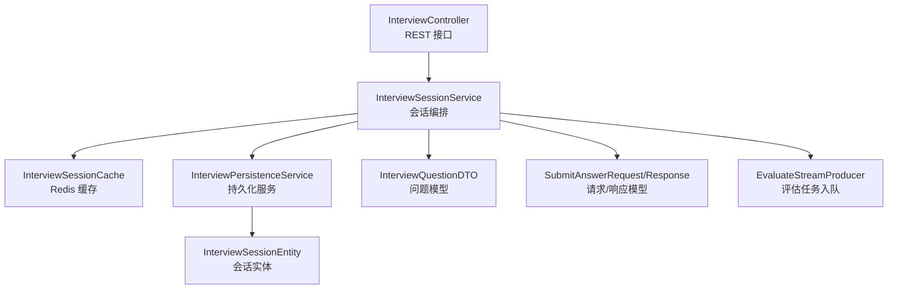
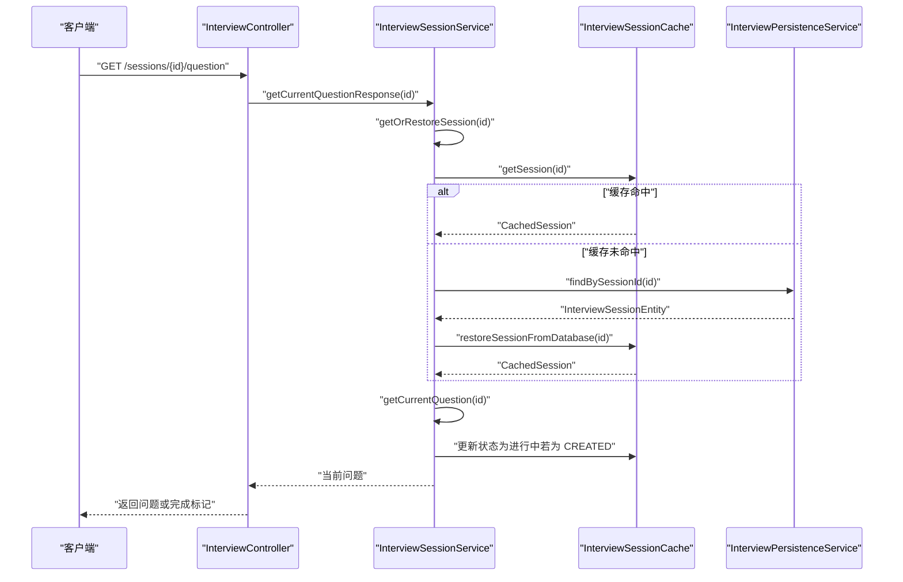
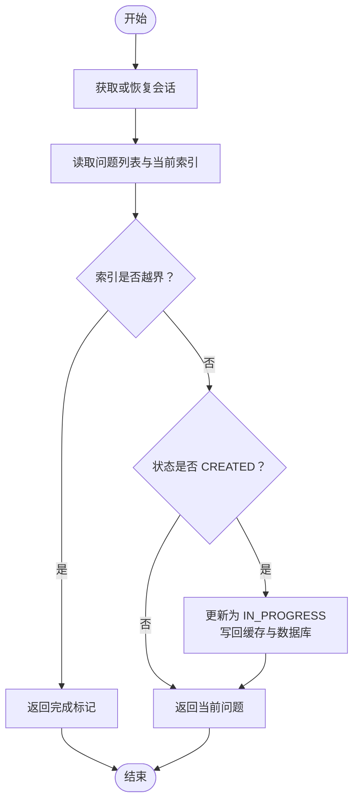
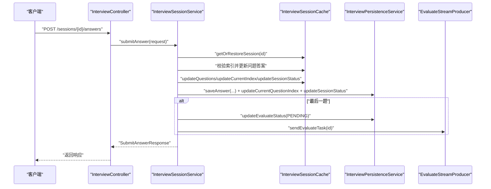
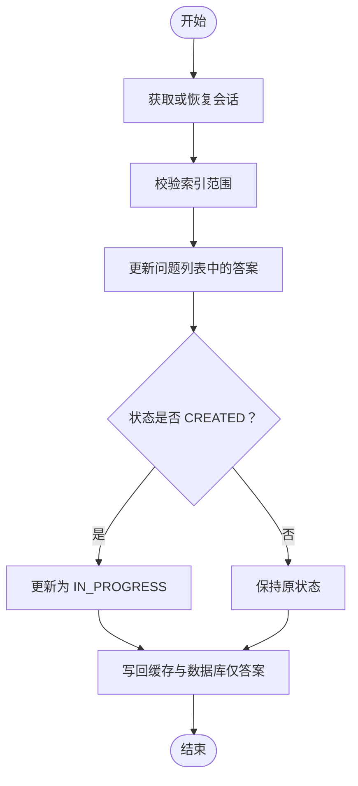
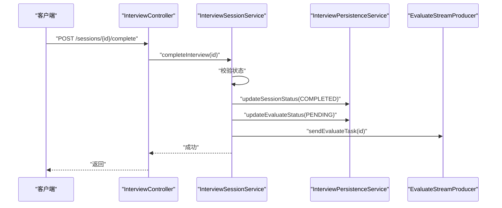
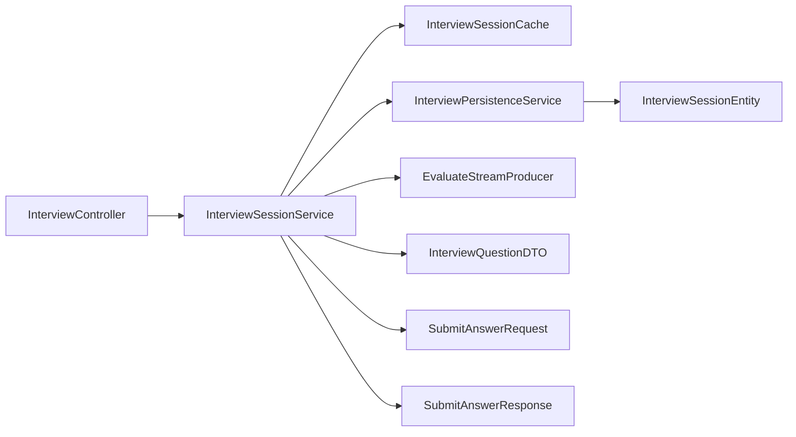

# 问题管理

<cite>
**本文引用的文件**
- [InterviewController.java](file://app/src/main/java/interview/guide/modules/interview/InterviewController.java)
- [InterviewSessionService.java](file://app/src/main/java/interview/guide/modules/interview/service/InterviewSessionService.java)
- [InterviewPersistenceService.java](file://app/src/main/java/interview/guide/modules/interview/service/InterviewPersistenceService.java)
- [InterviewSessionEntity.java](file://app/src/main/java/interview/guide/modules/interview/model/InterviewSessionEntity.java)
- [InterviewSessionCache.java](file://app/src/main/java/interview/guide/infrastructure/redis/InterviewSessionCache.java)
- [SubmitAnswerRequest.java](file://app/src/main/java/interview/guide/modules/interview/model/SubmitAnswerRequest.java)
- [SubmitAnswerResponse.java](file://app/src/main/java/interview/guide/modules/interview/model/SubmitAnswerResponse.java)
- [InterviewQuestionDTO.java](file://app/src/main/java/interview/guide/modules/interview/model/InterviewQuestionDTO.java)
- [ErrorCode.java](file://app/src/main/java/interview/guide/common/exception/ErrorCode.java)
- [CommonConstants.java](file://app/src/main/java/interview/guide/common/constant/CommonConstants.java)
- [EvaluateStreamProducer.java](file://app/src/main/java/interview/guide/modules/interview/listener/EvaluateStreamProducer.java)
</cite>

## 目录
1. [简介](#简介)
2. [项目结构](#项目结构)
3. [核心组件](#核心组件)
4. [架构总览](#架构总览)
5. [详细组件分析](#详细组件分析)
6. [依赖分析](#依赖分析)
7. [性能考虑](#性能考虑)
8. [故障排查指南](#故障排查指南)
9. [结论](#结论)
10. [附录](#附录)

## 简介
本文件聚焦“问题管理”能力，围绕以下目标展开：
- 详解 getCurrentQuestion 方法如何获取当前问题，覆盖问题索引管理、问题边界检查、状态更新等逻辑
- 详述 submitAnswer 方法的完整流程，包括答案提交、问题索引递增、下一题获取、会话状态转换等
- 介绍 saveAnswer 方法的暂存功能，解释其与 submitAnswer 的差异及适用场景
- 说明 completeInterview 方法的提前交卷机制与异步评估触发逻辑
- 提供错误处理策略、并发控制方案与性能优化建议，并给出使用示例与最佳实践

## 项目结构
问题管理相关代码位于面试模块，采用“控制器-服务-持久层-缓存”的分层设计：
- 控制器层负责对外暴露 REST 接口
- 服务层编排业务流程，协调缓存与持久层
- 持久层负责与数据库交互
- 缓存层基于 Redis 提供高性能读写与会话映射

图表来源
- [InterviewController.java:71-134](file://app/src/main/java/interview/guide/modules/interview/InterviewController.java#L71-L134)
- [InterviewSessionService.java:249-357](file://app/src/main/java/interview/guide/modules/interview/service/InterviewSessionService.java#L249-L357)
- [InterviewSessionCache.java:89-105](file://app/src/main/java/interview/guide/infrastructure/redis/InterviewSessionCache.java#L89-L105)
- [InterviewPersistenceService.java:46-78](file://app/src/main/java/interview/guide/modules/interview/service/InterviewPersistenceService.java#L46-L78)
- [InterviewSessionEntity.java:20-110](file://app/src/main/java/interview/guide/modules/interview/model/InterviewSessionEntity.java#L20-L110)
- [InterviewQuestionDTO.java:7-35](file://app/src/main/java/interview/guide/modules/interview/model/InterviewQuestionDTO.java#L7-L35)
- [SubmitAnswerRequest.java:10-20](file://app/src/main/java/interview/guide/modules/interview/model/SubmitAnswerRequest.java#L10-L20)
- [SubmitAnswerResponse.java:6-11](file://app/src/main/java/interview/guide/modules/interview/model/SubmitAnswerResponse.java#L6-L11)
- [EvaluateStreamProducer.java:33-35](file://app/src/main/java/interview/guide/modules/interview/listener/EvaluateStreamProducer.java#L33-L35)

章节来源
- [InterviewController.java:71-134](file://app/src/main/java/interview/guide/modules/interview/InterviewController.java#L71-L134)
- [InterviewSessionService.java:249-357](file://app/src/main/java/interview/guide/modules/interview/service/InterviewSessionService.java#L249-L357)

## 核心组件
- 控制器接口
  - 获取当前问题：GET /api/interview/sessions/{sessionId}/question
  - 提交答案：POST /api/interview/sessions/{sessionId}/answers
  - 暂存答案：PUT /api/interview/sessions/{sessionId}/answers
  - 提前交卷：POST /api/interview/sessions/{sessionId}/complete
- 服务编排
  - getCurrentQuestionResponse/getCurrentQuestion：获取当前问题并处理边界与状态
  - submitAnswer：提交答案并推进到下一题，必要时触发异步评估
  - saveAnswer：仅暂存答案，不推进索引
  - completeInterview：提前交卷并触发异步评估
- 缓存与持久化
  - InterviewSessionCache：会话在 Redis 的读写、索引更新、状态变更
  - InterviewPersistenceService：数据库层面的状态、索引、答案与报告的持久化
- 数据模型
  - InterviewQuestionDTO：问题与答案、评分、反馈、父子关系等
  - SubmitAnswerRequest/Response：提交答案的输入输出契约

章节来源
- [InterviewController.java:71-134](file://app/src/main/java/interview/guide/modules/interview/InterviewController.java#L71-L134)
- [InterviewSessionService.java:249-357](file://app/src/main/java/interview/guide/modules/interview/service/InterviewSessionService.java#L249-L357)
- [InterviewSessionCache.java:89-164](file://app/src/main/java/interview/guide/infrastructure/redis/InterviewSessionCache.java#L89-L164)
- [InterviewPersistenceService.java:83-162](file://app/src/main/java/interview/guide/modules/interview/service/InterviewPersistenceService.java#L83-L162)
- [InterviewQuestionDTO.java:7-35](file://app/src/main/java/interview/guide/modules/interview/model/InterviewQuestionDTO.java#L7-L35)
- [SubmitAnswerRequest.java:10-20](file://app/src/main/java/interview/guide/modules/interview/model/SubmitAnswerRequest.java#L10-L20)
- [SubmitAnswerResponse.java:6-11](file://app/src/main/java/interview/guide/modules/interview/model/SubmitAnswerResponse.java#L6-L11)

## 架构总览
问题管理贯穿“缓存优先、数据库兜底”的设计原则。会话状态与进度在 Redis 中快速流转，数据库作为最终一致性保障。

图表来源
- [InterviewController.java:71-74](file://app/src/main/java/interview/guide/modules/interview/InterviewController.java#L71-L74)
- [InterviewSessionService.java:249-289](file://app/src/main/java/interview/guide/modules/interview/service/InterviewSessionService.java#L249-L289)
- [InterviewSessionCache.java:110-118](file://app/src/main/java/interview/guide/infrastructure/redis/InterviewSessionCache.java#L110-L118)
- [InterviewPersistenceService.java:249-251](file://app/src/main/java/interview/guide/modules/interview/service/InterviewPersistenceService.java#L249-L251)

## 详细组件分析

### getCurrentQuestion 流程与边界检查
- 输入：sessionId
- 关键步骤
  - 通过 getOrRestoreSession 优先从 Redis 获取会话；未命中则从数据库恢复
  - 读取问题列表与当前索引
  - 边界检查：当当前索引等于问题总数时，返回“已完成”标记
  - 若首次访问且状态为 CREATED，则更新为 IN_PROGRESS，并同步到数据库
  - 返回当前问题对象
- 状态更新
  - 仅在首次进入问题时将状态从 CREATED 变更为 IN_PROGRESS
  - 该更新同时写回 Redis 与数据库，确保一致性

图表来源
- [InterviewSessionService.java:249-289](file://app/src/main/java/interview/guide/modules/interview/service/InterviewSessionService.java#L249-L289)
- [InterviewSessionCache.java:123-136](file://app/src/main/java/interview/guide/infrastructure/redis/InterviewSessionCache.java#L123-L136)
- [InterviewPersistenceService.java:83-95](file://app/src/main/java/interview/guide/modules/interview/service/InterviewPersistenceService.java#L83-L95)

章节来源
- [InterviewSessionService.java:249-289](file://app/src/main/java/interview/guide/modules/interview/service/InterviewSessionService.java#L249-L289)

### submitAnswer 完整流程
- 输入：sessionId、questionIndex、answer
- 关键步骤
  - 校验索引有效性（0 <= index < 问题总数）
  - 在问题列表中更新对应问题的答案
  - 计算下一题索引：newIndex = index + 1
  - 判断是否还有下一题，决定会话状态：有则 IN_PROGRESS，无则 COMPLETED
  - 写回 Redis：更新问题列表、当前索引、会话状态
  - 写回数据库：保存答案、更新当前索引、更新会话状态
  - 若为最后一题：设置评估状态为 PENDING，并通过 EvaluateStreamProducer 入队评估任务
- 输出：SubmitAnswerResponse，包含是否还有下题、下一题、当前索引、总题数

图表来源
- [InterviewController.java:80-90](file://app/src/main/java/interview/guide/modules/interview/InterviewController.java#L80-L90)
- [InterviewSessionService.java:295-357](file://app/src/main/java/interview/guide/modules/interview/service/InterviewSessionService.java#L295-L357)
- [InterviewPersistenceService.java:133-162](file://app/src/main/java/interview/guide/modules/interview/service/InterviewPersistenceService.java#L133-L162)
- [EvaluateStreamProducer.java:33-35](file://app/src/main/java/interview/guide/modules/interview/listener/EvaluateStreamProducer.java#L33-L35)

章节来源
- [InterviewSessionService.java:295-357](file://app/src/main/java/interview/guide/modules/interview/service/InterviewSessionService.java#L295-L357)
- [InterviewPersistenceService.java:133-162](file://app/src/main/java/interview/guide/modules/interview/service/InterviewPersistenceService.java#L133-L162)

### saveAnswer 暂存功能与差异
- 输入：sessionId、questionIndex、answer
- 行为差异
  - 仅更新问题列表中的答案，不推进当前索引
  - 不改变会话状态（除非仍为 CREATED，也会被更新为 IN_PROGRESS）
  - 不触发评估任务
- 使用场景
  - 用户在答题过程中临时保存草稿，避免误操作导致进度丢失
  - 长文本编辑、多轮思考后的最终确认提交

图表来源
- [InterviewSessionService.java:362-398](file://app/src/main/java/interview/guide/modules/interview/service/InterviewSessionService.java#L362-L398)
- [InterviewPersistenceService.java:133-162](file://app/src/main/java/interview/guide/modules/interview/service/InterviewPersistenceService.java#L133-L162)

章节来源
- [InterviewSessionService.java:362-398](file://app/src/main/java/interview/guide/modules/interview/service/InterviewSessionService.java#L362-L398)

### completeInterview 提前交卷与异步评估
- 输入：sessionId
- 行为
  - 校验会话状态：若已 COMPLETED 或 EVALUATED 则拒绝
  - 将状态更新为 COMPLETED，并写回缓存与数据库
  - 设置评估状态为 PENDING
  - 通过 EvaluateStreamProducer 将评估任务入队
- 触发时机
  - 用户主动提前交卷
  - 服务端在 submitAnswer 的最后一题也具备相同逻辑

图表来源
- [InterviewController.java:129-134](file://app/src/main/java/interview/guide/modules/interview/InterviewController.java#L129-L134)
- [InterviewSessionService.java:403-427](file://app/src/main/java/interview/guide/modules/interview/service/InterviewSessionService.java#L403-L427)
- [InterviewPersistenceService.java:83-114](file://app/src/main/java/interview/guide/modules/interview/service/InterviewPersistenceService.java#L83-L114)
- [EvaluateStreamProducer.java:33-35](file://app/src/main/java/interview/guide/modules/interview/listener/EvaluateStreamProducer.java#L33-L35)

章节来源
- [InterviewSessionService.java:403-427](file://app/src/main/java/interview/guide/modules/interview/service/InterviewSessionService.java#L403-L427)

### 数据模型与契约
- InterviewQuestionDTO
  - 字段：questionIndex、question、type、category、topicSummary、userAnswer、score、feedback、isFollowUp、parentQuestionIndex
  - 方法：withAnswer、withEvaluation
- SubmitAnswerRequest/Response
  - Request：sessionId、questionIndex、answer
  - Response：hasNextQuestion、nextQuestion、currentIndex、totalQuestions

章节来源
- [InterviewQuestionDTO.java:7-35](file://app/src/main/java/interview/guide/modules/interview/model/InterviewQuestionDTO.java#L7-L35)
- [SubmitAnswerRequest.java:10-20](file://app/src/main/java/interview/guide/modules/interview/model/SubmitAnswerRequest.java#L10-L20)
- [SubmitAnswerResponse.java:6-11](file://app/src/main/java/interview/guide/modules/interview/model/SubmitAnswerResponse.java#L6-L11)

## 依赖分析
- 组件耦合
  - InterviewController 仅依赖服务层接口，低耦合
  - InterviewSessionService 依赖缓存、持久层、LLM 注册表、评估生产者
  - InterviewPersistenceService 依赖仓库与 Jackson 序列化
  - InterviewSessionCache 依赖 RedisService 与 ObjectMapper
- 外部依赖
  - Redis：会话缓存、简历到会话映射、评估任务队列
  - 数据库：会话、答案、报告、评估状态
  - 异步评估：通过 Redis Stream 与 EvaluateStreamProducer

图表来源
- [InterviewController.java:32-34](file://app/src/main/java/interview/guide/modules/interview/InterviewController.java#L32-L34)
- [InterviewSessionService.java:42-48](file://app/src/main/java/interview/guide/modules/interview/service/InterviewSessionService.java#L42-L48)
- [InterviewPersistenceService.java:38-41](file://app/src/main/java/interview/guide/modules/interview/service/InterviewPersistenceService.java#L38-L41)
- [InterviewSessionCache.java:29-30](file://app/src/main/java/interview/guide/infrastructure/redis/InterviewSessionCache.java#L29-L30)
- [InterviewSessionEntity.java:20-110](file://app/src/main/java/interview/guide/modules/interview/model/InterviewSessionEntity.java#L20-L110)
- [InterviewQuestionDTO.java:7-35](file://app/src/main/java/interview/guide/modules/interview/model/InterviewQuestionDTO.java#L7-L35)
- [SubmitAnswerRequest.java:10-20](file://app/src/main/java/interview/guide/modules/interview/model/SubmitAnswerRequest.java#L10-L20)
- [SubmitAnswerResponse.java:6-11](file://app/src/main/java/interview/guide/modules/interview/model/SubmitAnswerResponse.java#L6-L11)
- [EvaluateStreamProducer.java:23-25](file://app/src/main/java/interview/guide/modules/interview/listener/EvaluateStreamProducer.java#L23-L25)

## 性能考虑
- 缓存优先策略
  - 会话与问题列表均以 JSON 形式存储于 Redis，减少数据库压力
  - 默认 24 小时 TTL，结合 refreshSessionTTL 保证活跃会话不被回收
- 批量写入
  - Redis 写入集中在 updateQuestions/updateCurrentIndex/updateSessionStatus，降低网络往返
- 序列化开销
  - 问题列表的序列化/反序列化在缓存层与持久层均有发生，建议控制问题规模与字段数量
- 异步评估
  - 通过 Redis Stream 异步执行评估，避免阻塞请求线程
- 并发控制
  - 服务层未显式加锁，依赖 Redis 单线程写入与数据库事务一致性
  - 建议在客户端侧做“提交互斥”，防止重复提交同一题

[本节为通用性能建议，无需特定文件引用]

## 故障排查指南
- 常见错误码
  - 会话不存在：INTERVIEW_SESSION_NOT_FOUND
  - 问题不存在：INTERVIEW_QUESTION_NOT_FOUND
  - 会话已完成：INTERVIEW_ALREADY_COMPLETED
  - 面试尚未完成：INTERVIEW_NOT_COMPLETED
- 排查步骤
  - 确认 sessionId 是否正确，是否存在未完成会话映射
  - 检查问题索引是否越界（0 <= index < totalQuestions）
  - 若提交后无下一题但评估未触发，检查数据库评估状态是否更新为 PENDING
  - 若评估失败，查看 EvaluateStreamProducer 的错误回写与日志
- 日志定位
  - 控制器层对关键操作（提交答案、暂存、提前交卷）均打印日志，便于定位

章节来源
- [ErrorCode.java:32-40](file://app/src/main/java/interview/guide/common/exception/ErrorCode.java#L32-L40)
- [InterviewController.java:87-88](file://app/src/main/java/interview/guide/modules/interview/InterviewController.java#L87-L88)
- [InterviewController.java:121-122](file://app/src/main/java/interview/guide/modules/interview/InterviewController.java#L121-L122)
- [InterviewController.java:131-132](file://app/src/main/java/interview/guide/modules/interview/InterviewController.java#L131-L132)

## 结论
问题管理通过“缓存优先 + 数据库兜底”的架构，实现了高并发下的流畅体验。核心流程清晰：获取当前问题、提交答案推进进度、暂存草稿、提前交卷触发异步评估。配合严格的边界检查与错误码体系，系统具备良好的健壮性与可观测性。建议在客户端侧做好互斥与重试策略，进一步提升用户体验。

[本节为总结性内容，无需特定文件引用]

## 附录

### 使用示例与最佳实践
- 获取当前问题
  - 请求：GET /api/interview/sessions/{sessionId}/question
  - 返回：completed=false 时携带 question；completed=true 时提示已完成
  - 最佳实践：前端在完成标记出现时隐藏输入区域并展示完成页
- 提交答案
  - 请求：POST /api/interview/sessions/{sessionId}/answers
  - 负载：{ "questionIndex": N, "answer": "..." }
  - 返回：SubmitAnswerResponse，包含是否还有下题、下一题、当前索引、总题数
  - 最佳实践：提交成功后立即拉取下一题，避免用户等待
- 暂存答案
  - 请求：PUT /api/interview/sessions/{sessionId}/answers
  - 负载：{ "questionIndex": N, "answer": "..." }
  - 最佳实践：长文本编辑时定期暂存，避免页面刷新丢失
- 提前交卷
  - 请求：POST /api/interview/sessions/{sessionId}/complete
  - 最佳实践：在用户确认不再继续答题时触发，避免重复提交

章节来源
- [InterviewController.java:71-134](file://app/src/main/java/interview/guide/modules/interview/InterviewController.java#L71-L134)
- [SubmitAnswerResponse.java:6-11](file://app/src/main/java/interview/guide/modules/interview/model/SubmitAnswerResponse.java#L6-L11)