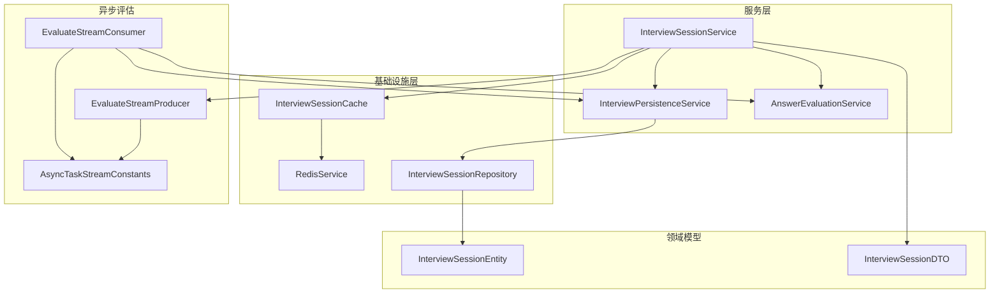
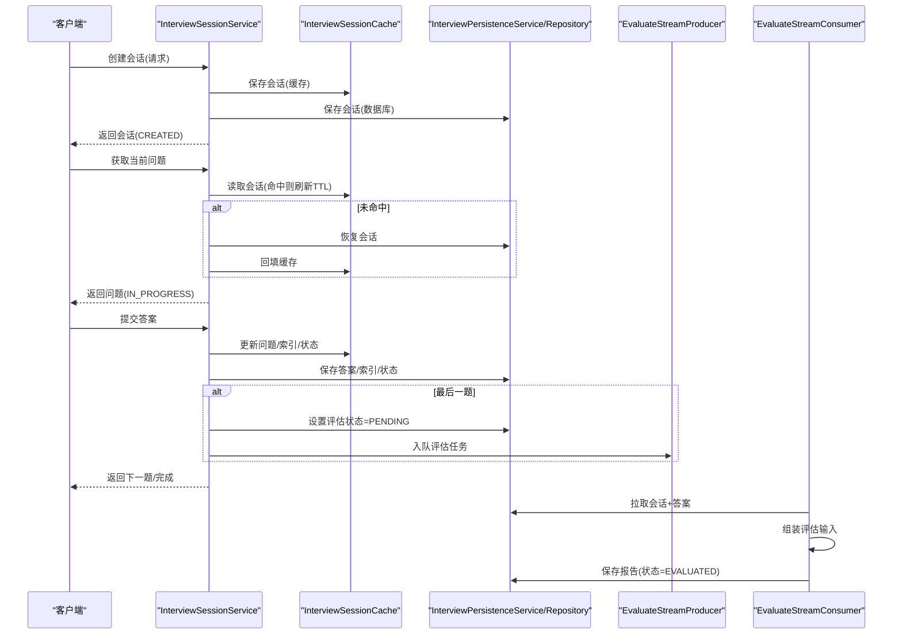
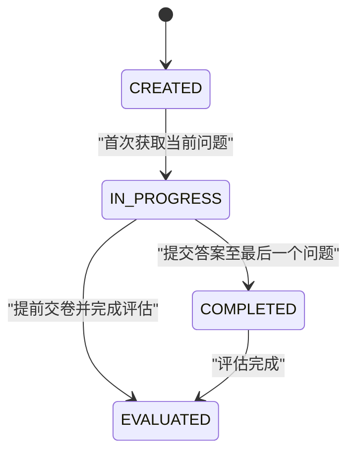
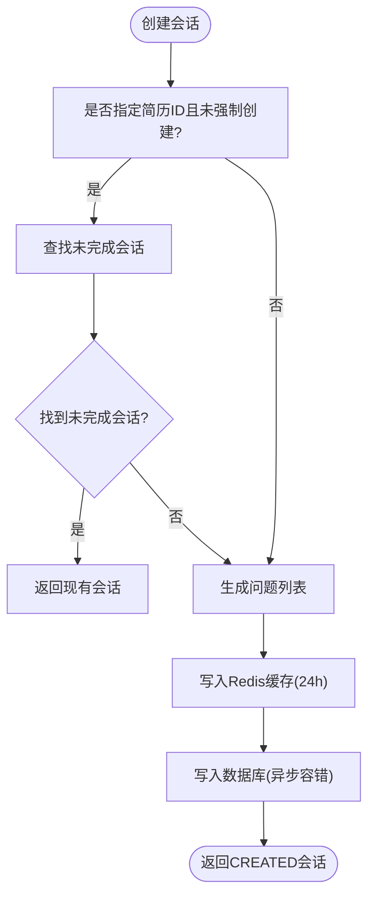
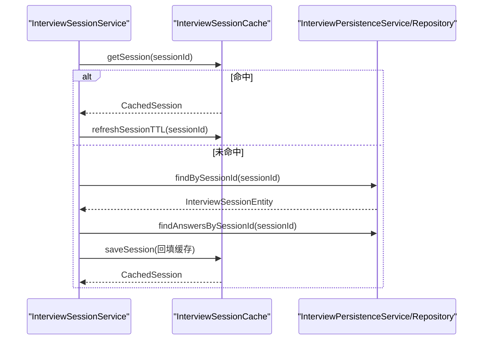
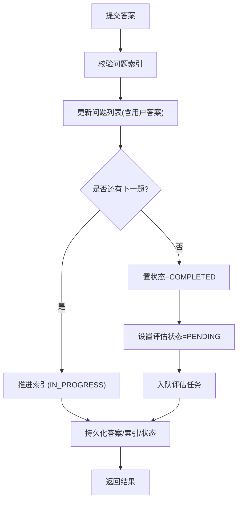
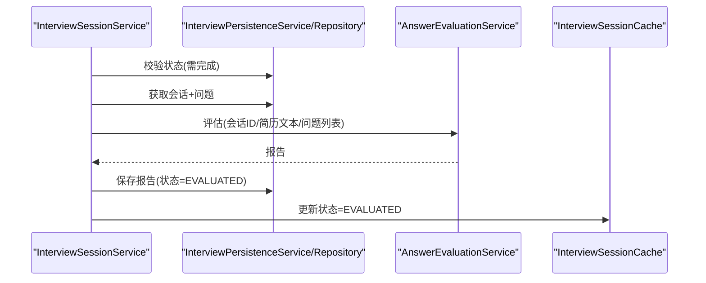
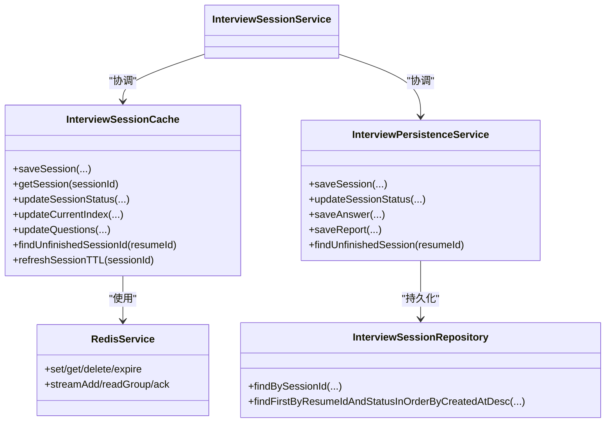
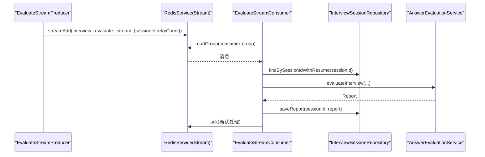
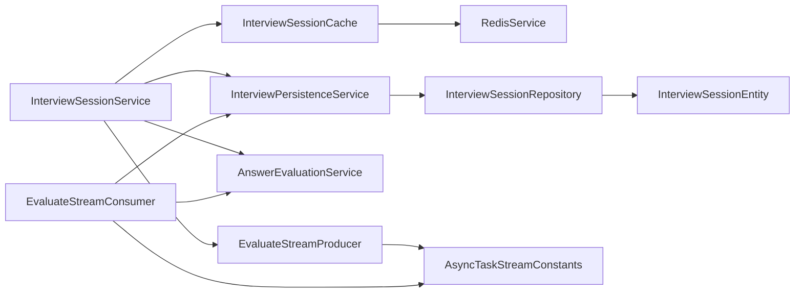

# 面试会话服务

<cite>
**本文引用的文件**   
- [InterviewSessionService.java](file://app/src/main/java/interview/guide/modules/interview/service/InterviewSessionService.java)
- [InterviewPersistenceService.java](file://app/src/main/java/interview/guide/modules/interview/service/InterviewPersistenceService.java)
- [InterviewSessionCache.java](file://app/src/main/java/interview/guide/infrastructure/redis/InterviewSessionCache.java)
- [RedisService.java](file://app/src/main/java/interview/guide/infrastructure/redis/RedisService.java)
- [InterviewSessionRepository.java](file://app/src/main/java/interview/guide/modules/interview/repository/InterviewSessionRepository.java)
- [InterviewSessionEntity.java](file://app/src/main/java/interview/guide/modules/interview/model/InterviewSessionEntity.java)
- [InterviewSessionDTO.java](file://app/src/main/java/interview/guide/modules/interview/model/InterviewSessionDTO.java)
- [CreateInterviewRequest.java](file://app/src/main/java/interview/guide/modules/interview/model/CreateInterviewRequest.java)
- [SubmitAnswerRequest.java](file://app/src/main/java/interview/guide/modules/interview/model/SubmitAnswerRequest.java)
- [AnswerEvaluationService.java](file://app/src/main/java/interview/guide/modules/interview/service/AnswerEvaluationService.java)
- [EvaluateStreamProducer.java](file://app/src/main/java/interview/guide/modules/interview/listener/EvaluateStreamProducer.java)
- [EvaluateStreamConsumer.java](file://app/src/main/java/interview/guide/modules/interview/listener/EvaluateStreamConsumer.java)
- [AsyncTaskStreamConstants.java](file://app/src/main/java/interview/guide/common/constant/AsyncTaskStreamConstants.java)
- [CommonConstants.java](file://app/src/main/java/interview/guide/common/constant/CommonConstants.java)
</cite>

## 目录
1. [简介](#简介)
2. [项目结构](#项目结构)
3. [核心组件](#核心组件)
4. [架构总览](#架构总览)
5. [详细组件分析](#详细组件分析)
6. [依赖分析](#依赖分析)
7. [性能考量](#性能考量)
8. [故障排查指南](#故障排查指南)
9. [结论](#结论)
10. [附录](#附录)

## 简介
本文件系统性阐述面试会话服务（InterviewSessionService）的完整生命周期管理能力，涵盖会话创建、状态流转、问题获取、答案提交、报告生成等关键流程，并深入解析会话缓存（Redis）与数据库（PostgreSQL/JPA）的协同机制、TTL与故障恢复策略、异步评估（Redis Stream）的实现细节。文档同时提供最佳实践建议，包括并发控制、错误处理与性能优化，以及典型使用场景与调用路径。

## 项目结构
面试会话服务位于应用模块的“interview”子域下，采用分层设计：
- 控制器层：对外暴露HTTP接口（由上层控制器负责）
- 服务层：InterviewSessionService为核心协调者，调用问题生成、评估、持久化与缓存服务
- 持久化层：JPA仓库与实体，负责会话与答案的持久化
- 基础设施层：Redis缓存与Stream，负责高并发读写与异步任务编排
- 通用能力：统一评估服务、AI Provider注册、异步任务常量等

图表来源
- [InterviewSessionService.java:1-507](file://app/src/main/java/interview/guide/modules/interview/service/InterviewSessionService.java#L1-L507)
- [InterviewPersistenceService.java:1-359](file://app/src/main/java/interview/guide/modules/interview/service/InterviewPersistenceService.java#L1-L359)
- [InterviewSessionCache.java:1-244](file://app/src/main/java/interview/guide/infrastructure/redis/InterviewSessionCache.java#L1-L244)
- [RedisService.java:1-395](file://app/src/main/java/interview/guide/infrastructure/redis/RedisService.java#L1-L395)
- [InterviewSessionRepository.java:1-77](file://app/src/main/java/interview/guide/modules/interview/repository/InterviewSessionRepository.java#L1-L77)
- [InterviewSessionEntity.java:1-287](file://app/src/main/java/interview/guide/modules/interview/model/InterviewSessionEntity.java#L1-L287)
- [InterviewSessionDTO.java:1-23](file://app/src/main/java/interview/guide/modules/interview/model/InterviewSessionDTO.java#L1-L23)
- [EvaluateStreamProducer.java:1-78](file://app/src/main/java/interview/guide/modules/interview/listener/EvaluateStreamProducer.java#L1-L78)
- [EvaluateStreamConsumer.java:1-185](file://app/src/main/java/interview/guide/modules/interview/listener/EvaluateStreamConsumer.java#L1-L185)
- [AsyncTaskStreamConstants.java:1-135](file://app/src/main/java/interview/guide/common/constant/AsyncTaskStreamConstants.java#L1-L135)

章节来源
- [InterviewSessionService.java:1-507](file://app/src/main/java/interview/guide/modules/interview/service/InterviewSessionService.java#L1-L507)
- [InterviewPersistenceService.java:1-359](file://app/src/main/java/interview/guide/modules/interview/service/InterviewPersistenceService.java#L1-L359)
- [InterviewSessionCache.java:1-244](file://app/src/main/java/interview/guide/infrastructure/redis/InterviewSessionCache.java#L1-L244)
- [RedisService.java:1-395](file://app/src/main/java/interview/guide/infrastructure/redis/RedisService.java#L1-L395)
- [InterviewSessionRepository.java:1-77](file://app/src/main/java/interview/guide/modules/interview/repository/InterviewSessionRepository.java#L1-L77)
- [InterviewSessionEntity.java:1-287](file://app/src/main/java/interview/guide/modules/interview/model/InterviewSessionEntity.java#L1-L287)
- [InterviewSessionDTO.java:1-23](file://app/src/main/java/interview/guide/modules/interview/model/InterviewSessionDTO.java#L1-L23)
- [EvaluateStreamProducer.java:1-78](file://app/src/main/java/interview/guide/modules/interview/listener/EvaluateStreamProducer.java#L1-L78)
- [EvaluateStreamConsumer.java:1-185](file://app/src/main/java/interview/guide/modules/interview/listener/EvaluateStreamConsumer.java#L1-L185)
- [AsyncTaskStreamConstants.java:1-135](file://app/src/main/java/interview/guide/common/constant/AsyncTaskStreamConstants.java#L1-L135)

## 核心组件
- InterviewSessionService：会话生命周期中枢，负责创建、状态管理、问题获取、答案提交、提前交卷、报告生成与缓存/数据库同步
- InterviewSessionCache：基于Redis的会话缓存，提供TTL、映射、刷新与序列化能力
- InterviewPersistenceService：会话与答案的持久化，维护数据库一致性与事务边界
- EvaluateStreamProducer/Consumer：通过Redis Stream异步触发与执行评估任务
- AnswerEvaluationService：将问题DTO适配为通用评估输入，调用统一评估服务生成报告
- InterviewSessionRepository/Entity：JPA访问与实体定义，支撑历史问题去重、未完成会话检索等

章节来源
- [InterviewSessionService.java:40-507](file://app/src/main/java/interview/guide/modules/interview/service/InterviewSessionService.java#L40-L507)
- [InterviewSessionCache.java:27-244](file://app/src/main/java/interview/guide/infrastructure/redis/InterviewSessionCache.java#L27-L244)
- [InterviewPersistenceService.java:36-359](file://app/src/main/java/interview/guide/modules/interview/service/InterviewPersistenceService.java#L36-L359)
- [EvaluateStreamProducer.java:19-78](file://app/src/main/java/interview/guide/modules/interview/listener/EvaluateStreamProducer.java#L19-L78)
- [EvaluateStreamConsumer.java:32-185](file://app/src/main/java/interview/guide/modules/interview/listener/EvaluateStreamConsumer.java#L32-L185)
- [AnswerEvaluationService.java:26-99](file://app/src/main/java/interview/guide/modules/interview/service/AnswerEvaluationService.java#L26-L99)
- [InterviewSessionRepository.java:18-77](file://app/src/main/java/interview/guide/modules/interview/repository/InterviewSessionRepository.java#L18-L77)
- [InterviewSessionEntity.java:20-287](file://app/src/main/java/interview/guide/modules/interview/model/InterviewSessionEntity.java#L20-L287)

## 架构总览
面试会话服务采用“缓存优先 + 数据库兜底”的双写策略：读路径优先命中Redis，未命中则从数据库恢复并回填缓存；写路径同时更新Redis与数据库，确保最终一致。状态机驱动会话流转，异步评估通过Redis Stream解耦执行与触发。

图表来源
- [InterviewSessionService.java:55-357](file://app/src/main/java/interview/guide/modules/interview/service/InterviewSessionService.java#L55-L357)
- [InterviewSessionCache.java:89-164](file://app/src/main/java/interview/guide/infrastructure/redis/InterviewSessionCache.java#L89-L164)
- [InterviewPersistenceService.java:46-162](file://app/src/main/java/interview/guide/modules/interview/service/InterviewPersistenceService.java#L46-L162)
- [EvaluateStreamProducer.java:33-35](file://app/src/main/java/interview/guide/modules/interview/listener/EvaluateStreamProducer.java#L33-L35)
- [EvaluateStreamConsumer.java:104-134](file://app/src/main/java/interview/guide/modules/interview/listener/EvaluateStreamConsumer.java#L104-L134)

## 详细组件分析

### 会话生命周期与状态机
- 状态枚举：CREATED → IN_PROGRESS → COMPLETED → EVALUATED
- 触发条件：
  - 创建后初始状态为CREATED
  - 首次获取当前问题时若仍为CREATED则切换为IN_PROGRESS
  - 提交答案后若到达末题则置为COMPLETED
  - 评估完成后状态置为EVALUATED
- 未完成会话查找：通过简历ID到会话ID的映射键快速定位CREATED/IN_PROGRESS会话

图表来源
- [InterviewSessionEntity.java:105-110](file://app/src/main/java/interview/guide/modules/interview/model/InterviewSessionEntity.java#L105-L110)
- [InterviewSessionService.java:274-286](file://app/src/main/java/interview/guide/modules/interview/service/InterviewSessionService.java#L274-L286)
- [InterviewSessionService.java:316-323](file://app/src/main/java/interview/guide/modules/interview/service/InterviewSessionService.java#L316-L323)
- [InterviewSessionService.java:403-427](file://app/src/main/java/interview/guide/modules/interview/service/InterviewSessionService.java#L403-L427)

章节来源
- [InterviewSessionEntity.java:105-110](file://app/src/main/java/interview/guide/modules/interview/model/InterviewSessionEntity.java#L105-L110)
- [InterviewSessionService.java:274-286](file://app/src/main/java/interview/guide/modules/interview/service/InterviewSessionService.java#L274-L286)
- [InterviewSessionService.java:316-323](file://app/src/main/java/interview/guide/modules/interview/service/InterviewSessionService.java#L316-L323)
- [InterviewSessionService.java:403-427](file://app/src/main/java/interview/guide/modules/interview/service/InterviewSessionService.java#L403-L427)

### 会话创建流程
- 请求参数校验与默认值：questionCount范围、skillId必填、默认难度与LLM提供方
- 历史问题去重：根据简历ID精确匹配或skillId通用模式，取最近N条会话的问题集合去重后参与出题
- 生成问题：调用问题服务基于技能与上下文生成指定数量的问题
- 写入缓存：CREATED状态，设置24小时TTL
- 写入数据库：异步容错，失败不阻塞前端

图表来源
- [InterviewSessionService.java:55-118](file://app/src/main/java/interview/guide/modules/interview/service/InterviewSessionService.java#L55-L118)
- [InterviewPersistenceService.java:46-78](file://app/src/main/java/interview/guide/modules/interview/service/InterviewPersistenceService.java#L46-L78)
- [InterviewSessionCache.java:89-105](file://app/src/main/java/interview/guide/infrastructure/redis/InterviewSessionCache.java#L89-L105)

章节来源
- [InterviewSessionService.java:55-118](file://app/src/main/java/interview/guide/modules/interview/service/InterviewSessionService.java#L55-L118)
- [InterviewPersistenceService.java:46-78](file://app/src/main/java/interview/guide/modules/interview/service/InterviewPersistenceService.java#L46-L78)
- [InterviewSessionCache.java:89-105](file://app/src/main/java/interview/guide/infrastructure/redis/InterviewSessionCache.java#L89-L105)

### 会话读取与缓存同步
- 读取优先级：Redis缓存 → 数据库恢复 → 抛出未找到
- 缓存命中：刷新TTL，避免频繁重建
- 缓存未命中：从数据库加载会话与答案，重建问题列表中的用户答案，回填缓存

图表来源
- [InterviewSessionService.java:123-137](file://app/src/main/java/interview/guide/modules/interview/service/InterviewSessionService.java#L123-L137)
- [InterviewSessionService.java:183-235](file://app/src/main/java/interview/guide/modules/interview/service/InterviewSessionService.java#L183-L235)
- [InterviewSessionCache.java:110-118](file://app/src/main/java/interview/guide/infrastructure/redis/InterviewSessionCache.java#L110-L118)
- [InterviewPersistenceService.java:249-313](file://app/src/main/java/interview/guide/modules/interview/service/InterviewPersistenceService.java#L249-L313)

章节来源
- [InterviewSessionService.java:123-137](file://app/src/main/java/interview/guide/modules/interview/service/InterviewSessionService.java#L123-L137)
- [InterviewSessionService.java:183-235](file://app/src/main/java/interview/guide/modules/interview/service/InterviewSessionService.java#L183-L235)
- [InterviewSessionCache.java:110-118](file://app/src/main/java/interview/guide/infrastructure/redis/InterviewSessionCache.java#L110-L118)
- [InterviewPersistenceService.java:249-313](file://app/src/main/java/interview/guide/modules/interview/service/InterviewPersistenceService.java#L249-L313)

### 答案提交与自动评估
- 提交答案：更新对应问题的用户答案，推进索引；若为最后一个问题，设置评估状态为PENDING并入队评估任务
- 暂存答案：仅更新缓存与数据库，不推进索引，保持状态为IN_PROGRESS
- 提前交卷：直接置状态为COMPLETED并入队评估

图表来源
- [InterviewSessionService.java:295-357](file://app/src/main/java/interview/guide/modules/interview/service/InterviewSessionService.java#L295-L357)
- [InterviewPersistenceService.java:133-162](file://app/src/main/java/interview/guide/modules/interview/service/InterviewPersistenceService.java#L133-L162)
- [EvaluateStreamProducer.java:33-35](file://app/src/main/java/interview/guide/modules/interview/listener/EvaluateStreamProducer.java#L33-L35)

章节来源
- [InterviewSessionService.java:295-357](file://app/src/main/java/interview/guide/modules/interview/service/InterviewSessionService.java#L295-L357)
- [InterviewPersistenceService.java:133-162](file://app/src/main/java/interview/guide/modules/interview/service/InterviewPersistenceService.java#L133-L162)
- [EvaluateStreamProducer.java:33-35](file://app/src/main/java/interview/guide/modules/interview/listener/EvaluateStreamProducer.java#L33-L35)

### 报告生成与状态更新
- 触发条件：会话必须为COMPLETED或EVALUATED
- 评估流程：消费Redis Stream消息，拉取会话与答案，组装评估输入，调用统一评估服务生成报告，持久化并置状态为EVALUATED

图表来源
- [InterviewSessionService.java:453-490](file://app/src/main/java/interview/guide/modules/interview/service/InterviewSessionService.java#L453-L490)
- [AnswerEvaluationService.java:45-75](file://app/src/main/java/interview/guide/modules/interview/service/AnswerEvaluationService.java#L45-L75)
- [InterviewPersistenceService.java:167-244](file://app/src/main/java/interview/guide/modules/interview/service/InterviewPersistenceService.java#L167-L244)

章节来源
- [InterviewSessionService.java:453-490](file://app/src/main/java/interview/guide/modules/interview/service/InterviewSessionService.java#L453-L490)
- [AnswerEvaluationService.java:45-75](file://app/src/main/java/interview/guide/modules/interview/service/AnswerEvaluationService.java#L45-L75)
- [InterviewPersistenceService.java:167-244](file://app/src/main/java/interview/guide/modules/interview/service/InterviewPersistenceService.java#L167-L244)

### 缓存与数据库协同、TTL与故障恢复
- 缓存键：会话主体键与简历到会话ID映射键，均设置24小时TTL
- 未完成状态映射：CREATED/IN_PROGRESS时建立简历→会话ID映射，完成后自动清理
- 故障恢复：缓存未命中时从数据库恢复，重建问题列表并回填缓存
- TTL刷新：每次读取时刷新TTL，延长活跃会话存活时间

图表来源
- [InterviewSessionCache.java:27-244](file://app/src/main/java/interview/guide/infrastructure/redis/InterviewSessionCache.java#L27-L244)
- [RedisService.java:29-395](file://app/src/main/java/interview/guide/infrastructure/redis/RedisService.java#L29-L395)
- [InterviewPersistenceService.java:36-359](file://app/src/main/java/interview/guide/modules/interview/service/InterviewPersistenceService.java#L36-L359)
- [InterviewSessionRepository.java:18-77](file://app/src/main/java/interview/guide/modules/interview/repository/InterviewSessionRepository.java#L18-L77)

章节来源
- [InterviewSessionCache.java:89-105](file://app/src/main/java/interview/guide/infrastructure/redis/InterviewSessionCache.java#L89-L105)
- [InterviewSessionCache.java:184-198](file://app/src/main/java/interview/guide/infrastructure/redis/InterviewSessionCache.java#L184-L198)
- [InterviewSessionCache.java:203-206](file://app/src/main/java/interview/guide/infrastructure/redis/InterviewSessionCache.java#L203-L206)
- [InterviewPersistenceService.java:299-306](file://app/src/main/java/interview/guide/modules/interview/service/InterviewPersistenceService.java#L299-L306)

### 异步评估机制（Redis Stream）
- 生产者：提交答案或提前交卷时，将会话ID写入“interview:evaluate:stream”，设置最大长度与重试字段
- 消费者：以消费者组形式从Stream读取消息，标记PROCESSING，拉取会话与答案，调用评估服务生成报告并保存，标记COMPLETED或FAILED并重试
- 重试策略：最大重试次数由常量定义，失败时更新评估状态与错误信息

图表来源
- [EvaluateStreamProducer.java:33-53](file://app/src/main/java/interview/guide/modules/interview/listener/EvaluateStreamProducer.java#L33-L53)
- [EvaluateStreamConsumer.java:104-134](file://app/src/main/java/interview/guide/modules/interview/listener/EvaluateStreamConsumer.java#L104-L134)
- [AsyncTaskStreamConstants.java:96-112](file://app/src/main/java/interview/guide/common/constant/AsyncTaskStreamConstants.java#L96-L112)

章节来源
- [EvaluateStreamProducer.java:33-53](file://app/src/main/java/interview/guide/modules/interview/listener/EvaluateStreamProducer.java#L33-L53)
- [EvaluateStreamConsumer.java:104-134](file://app/src/main/java/interview/guide/modules/interview/listener/EvaluateStreamConsumer.java#L104-L134)
- [AsyncTaskStreamConstants.java:96-112](file://app/src/main/java/interview/guide/common/constant/AsyncTaskStreamConstants.java#L96-L112)

## 依赖分析
- 组件内聚与耦合
  - InterviewSessionService聚合多个协作组件，承担主要业务编排职责
  - 缓存与持久化通过服务层解耦，便于替换实现
  - 评估通过统一服务抽象，便于扩展不同评估策略
- 外部依赖
  - Redisson：提供Redis缓存、Stream、分布式锁等能力
  - JPA/Hibernate：提供实体持久化与查询能力
  - Spring AI ChatClient：提供LLM调用能力

图表来源
- [InterviewSessionService.java:42-48](file://app/src/main/java/interview/guide/modules/interview/service/InterviewSessionService.java#L42-L48)
- [InterviewSessionCache.java:29](file://app/src/main/java/interview/guide/infrastructure/redis/InterviewSessionCache.java#L29)
- [InterviewPersistenceService.java:38-41](file://app/src/main/java/interview/guide/modules/interview/service/InterviewPersistenceService.java#L38-L41)
- [InterviewSessionRepository.java:18-29](file://app/src/main/java/interview/guide/modules/interview/repository/InterviewSessionRepository.java#L18-L29)
- [EvaluateStreamProducer.java:21-26](file://app/src/main/java/interview/guide/modules/interview/listener/EvaluateStreamProducer.java#L21-L26)
- [EvaluateStreamConsumer.java:34-54](file://app/src/main/java/interview/guide/modules/interview/listener/EvaluateStreamConsumer.java#L34-L54)

章节来源
- [InterviewSessionService.java:42-48](file://app/src/main/java/interview/guide/modules/interview/service/InterviewSessionService.java#L42-L48)
- [InterviewSessionCache.java:29](file://app/src/main/java/interview/guide/infrastructure/redis/InterviewSessionCache.java#L29)
- [InterviewPersistenceService.java:38-41](file://app/src/main/java/interview/guide/modules/interview/service/InterviewPersistenceService.java#L38-L41)
- [InterviewSessionRepository.java:18-29](file://app/src/main/java/interview/guide/modules/interview/repository/InterviewSessionRepository.java#L18-L29)
- [EvaluateStreamProducer.java:21-26](file://app/src/main/java/interview/guide/modules/interview/listener/EvaluateStreamProducer.java#L21-L26)
- [EvaluateStreamConsumer.java:34-54](file://app/src/main/java/interview/guide/modules/interview/listener/EvaluateStreamConsumer.java#L34-L54)

## 性能考量
- 缓存命中率
  - 通过刷新TTL降低冷启动概率，结合映射键快速定位未完成会话
  - 建议在高并发场景下预热热点会话，减少数据库抖动
- 数据库压力
  - 写路径采用异步容错，避免阻塞用户交互
  - 批量读取答案与问题，减少往返次数
- Redis Stream吞吐
  - 合理设置消费者组与批量大小，避免过多竞争
  - 控制Stream最大长度，防止内存膨胀
- 评估负载
  - 评估服务应具备限流与熔断能力，避免LLM调用成为瓶颈
  - 对长文本与复杂问题可考虑分片评估或降采样

## 故障排查指南
- 会话未找到
  - 检查Redis缓存键是否存在，必要时回溯数据库
  - 核对sessionId是否正确传递
- 状态异常
  - 确认状态转换链路：CREATED→IN_PROGRESS→COMPLETED→EVALUATED
  - 核对评估状态字段是否被错误覆盖
- 评估失败
  - 查看评估错误字段与重试次数
  - 检查Stream消费者组是否正常消费与ACK
- 缓存不一致
  - 核对TTL刷新逻辑与映射键清理逻辑
  - 在极端情况下可手动删除缓存键并触发数据库恢复

章节来源
- [InterviewSessionService.java:133](file://app/src/main/java/interview/guide/modules/interview/service/InterviewSessionService.java#L133)
- [InterviewPersistenceService.java:100-114](file://app/src/main/java/interview/guide/modules/interview/service/InterviewPersistenceService.java#L100-L114)
- [EvaluateStreamConsumer.java:142-144](file://app/src/main/java/interview/guide/modules/interview/listener/EvaluateStreamConsumer.java#L142-L144)
- [InterviewSessionCache.java:129-132](file://app/src/main/java/interview/guide/infrastructure/redis/InterviewSessionCache.java#L129-L132)

## 结论
面试会话服务通过“缓存优先 + 数据库兜底”的双写策略与状态机驱动，实现了高可用、可观测的会话生命周期管理；借助Redis Stream的异步评估机制，有效解耦了实时交互与离线计算。配合合理的TTL与故障恢复策略，可在保证用户体验的同时维持系统的稳定性与可扩展性。

## 附录
- 使用场景示例
  - 新建会话：携带简历ID与技能主题，系统自动去重历史问题并生成新题
  - 实时答题：逐题提交答案，系统即时推进进度并在最后题触发评估
  - 提前交卷：无需等待所有问题完成，可立即进入评估流程
- 最佳实践
  - 并发控制：使用Redis分布式锁保护关键写路径（如答案提交）
  - 错误处理：对数据库写入失败进行日志记录与告警，前端可重试
  - 性能优化：合理设置Redis TTL与Stream最大长度，避免资源浪费
  - 可观测性：为每个关键节点埋点（创建、提交、评估），便于追踪与审计