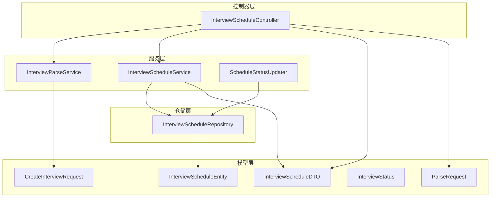
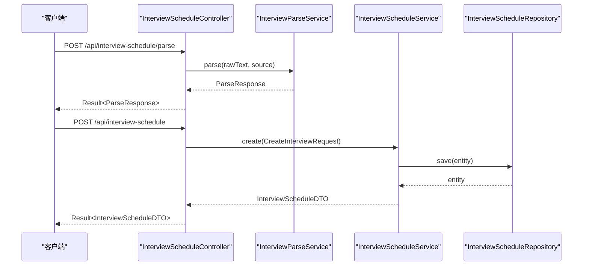
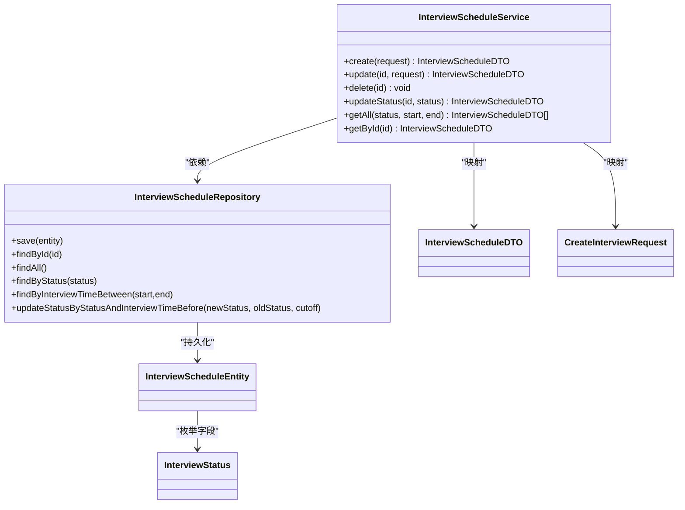
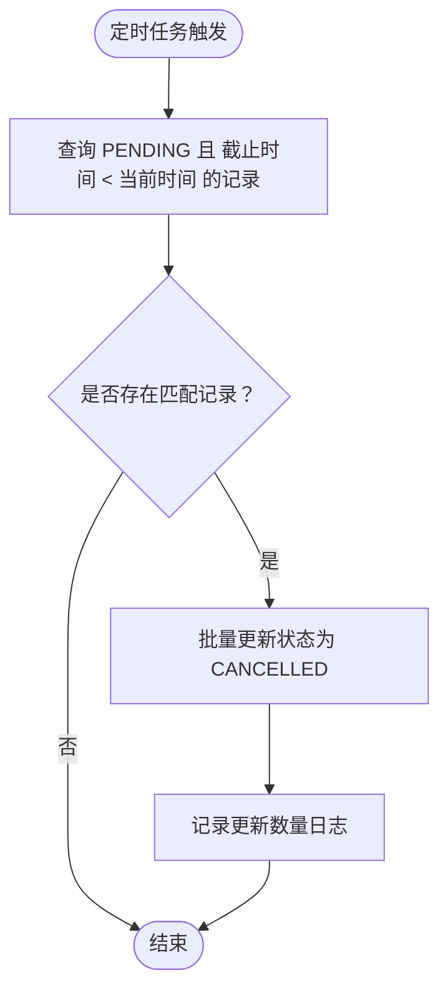
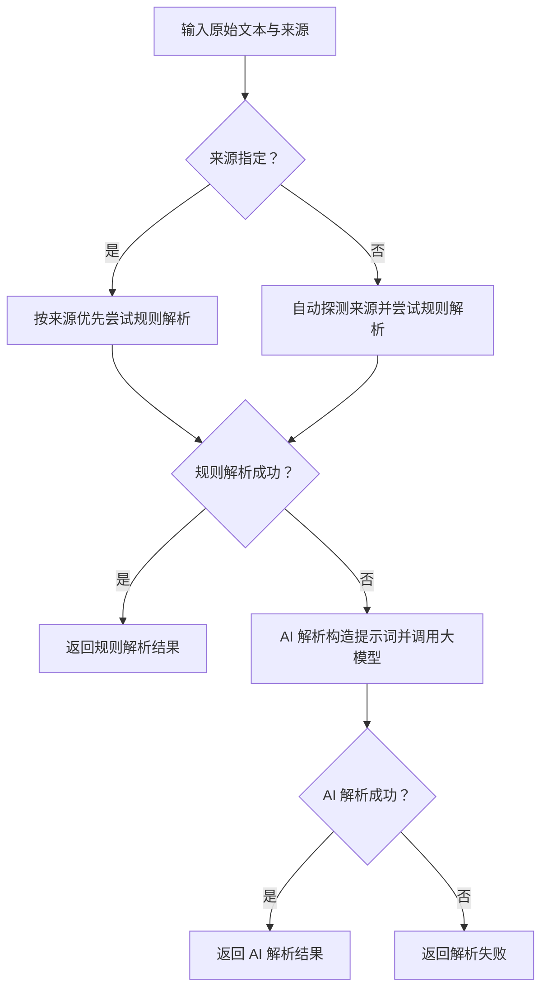
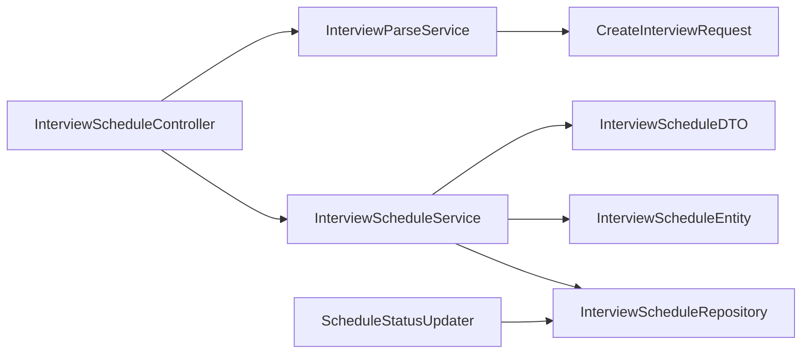

# 面试安排服务

<cite>
**本文引用的文件**
- [InterviewScheduleService.java](file://app/src/main/java/interview/guide/modules/interviewschedule/service/InterviewScheduleService.java)
- [ScheduleStatusUpdater.java](file://app/src/main/java/interview/guide/modules/interviewschedule/service/ScheduleStatusUpdater.java)
- [InterviewParseService.java](file://app/src/main/java/interview/guide/modules/interviewschedule/service/InterviewParseService.java)
- [InterviewScheduleEntity.java](file://app/src/main/java/interview/guide/modules/interviewschedule/model/InterviewScheduleEntity.java)
- [InterviewScheduleDTO.java](file://app/src/main/java/interview/guide/modules/interviewschedule/model/InterviewScheduleDTO.java)
- [CreateInterviewRequest.java](file://app/src/main/java/interview/guide/modules/interviewschedule/model/CreateInterviewRequest.java)
- [InterviewStatus.java](file://app/src/main/java/interview/guide/modules/interviewschedule/model/InterviewStatus.java)
- [InterviewScheduleRepository.java](file://app/src/main/java/interview/guide/modules/interviewschedule/repository/InterviewScheduleRepository.java)
- [InterviewScheduleController.java](file://app/src/main/java/interview/guide/modules/interviewschedule/InterviewScheduleController.java)
- [ParseRequest.java](file://app/src/main/java/interview/guide/modules/interviewschedule/model/ParseRequest.java)
</cite>

## 目录
1. [简介](#简介)
2. [项目结构](#项目结构)
3. [核心组件](#核心组件)
4. [架构总览](#架构总览)
5. [详细组件分析](#详细组件分析)
6. [依赖分析](#依赖分析)
7. [性能考虑](#性能考虑)
8. [故障排查指南](#故障排查指南)
9. [结论](#结论)
10. [附录](#附录)

## 简介
本文件面向“面试安排服务”的使用者与维护者，系统性阐述面试时间安排、状态管理与日程解析的完整业务流程。重点覆盖以下方面：
- InterviewScheduleService 的核心能力：面试预约、状态更新、查询与删除。
- ScheduleStatusUpdater 的自动状态同步机制：定时任务触发、过期状态变更、异常处理与数据一致性保障。
- InterviewParseService 的日程解析能力：多平台规则解析（飞书/腾讯会议/Zoom）、AI辅助解析、重复事件与时区处理策略。
- 最佳实践：资源调度、用户体验优化、系统性能调优。
- 使用场景与配置示例：如何通过接口完成从“文本解析”到“日程创建与状态流转”的端到端流程。

## 项目结构
面试安排模块位于后端应用的模块化目录下，采用按功能域分层的组织方式：
- 控制器层：对外暴露 REST 接口，负责请求入参校验与响应封装。
- 服务层：实现业务逻辑，包括日程解析、状态更新与日程管理。
- 模型层：定义实体、DTO、请求体与枚举类型。
- 仓储层：基于 JPA 的数据访问接口，提供查询与批量状态更新能力。

图表来源
- [InterviewScheduleController.java:1-132](file://app/src/main/java/interview/guide/modules/interviewschedule/InterviewScheduleController.java#L1-L132)
- [InterviewParseService.java:1-430](file://app/src/main/java/interview/guide/modules/interviewschedule/service/InterviewParseService.java#L1-L430)
- [InterviewScheduleService.java:1-86](file://app/src/main/java/interview/guide/modules/interviewschedule/service/InterviewScheduleService.java#L1-L86)
- [ScheduleStatusUpdater.java:1-31](file://app/src/main/java/interview/guide/modules/interviewschedule/service/ScheduleStatusUpdater.java#L1-L31)
- [InterviewScheduleEntity.java:1-59](file://app/src/main/java/interview/guide/modules/interviewschedule/model/InterviewScheduleEntity.java#L1-L59)
- [InterviewScheduleDTO.java:1-23](file://app/src/main/java/interview/guide/modules/interviewschedule/model/InterviewScheduleDTO.java#L1-L23)
- [CreateInterviewRequest.java:1-30](file://app/src/main/java/interview/guide/modules/interviewschedule/model/CreateInterviewRequest.java#L1-L30)
- [InterviewStatus.java:1-9](file://app/src/main/java/interview/guide/modules/interviewschedule/model/InterviewStatus.java#L1-L9)
- [ParseRequest.java:1-13](file://app/src/main/java/interview/guide/modules/interviewschedule/model/ParseRequest.java#L1-L13)
- [InterviewScheduleRepository.java:1-29](file://app/src/main/java/interview/guide/modules/interviewschedule/repository/InterviewScheduleRepository.java#L1-L29)

章节来源
- [InterviewScheduleController.java:1-132](file://app/src/main/java/interview/guide/modules/interviewschedule/InterviewScheduleController.java#L1-L132)
- [InterviewParseService.java:1-430](file://app/src/main/java/interview/guide/modules/interviewschedule/service/InterviewParseService.java#L1-L430)
- [InterviewScheduleService.java:1-86](file://app/src/main/java/interview/guide/modules/interviewschedule/service/InterviewScheduleService.java#L1-L86)
- [ScheduleStatusUpdater.java:1-31](file://app/src/main/java/interview/guide/modules/interviewschedule/service/ScheduleStatusUpdater.java#L1-L31)
- [InterviewScheduleEntity.java:1-59](file://app/src/main/java/interview/guide/modules/interviewschedule/model/InterviewScheduleEntity.java#L1-L59)
- [InterviewScheduleDTO.java:1-23](file://app/src/main/java/interview/guide/modules/interviewschedule/model/InterviewScheduleDTO.java#L1-L23)
- [CreateInterviewRequest.java:1-30](file://app/src/main/java/interview/guide/modules/interviewschedule/model/CreateInterviewRequest.java#L1-L30)
- [InterviewStatus.java:1-9](file://app/src/main/java/interview/guide/modules/interviewschedule/model/InterviewStatus.java#L1-L9)
- [ParseRequest.java:1-13](file://app/src/main/java/interview/guide/modules/interviewschedule/model/ParseRequest.java#L1-L13)
- [InterviewScheduleRepository.java:1-29](file://app/src/main/java/interview/guide/modules/interviewschedule/repository/InterviewScheduleRepository.java#L1-L29)

## 核心组件
- InterviewScheduleController：提供解析、增删改查与状态更新的 REST 接口，统一返回 Result 包装。
- InterviewParseService：多源规则解析与 AI 辅助解析，输出标准化 CreateInterviewRequest。
- InterviewScheduleService：对日程实体进行持久化、查询与状态更新；负责 DTO/实体映射。
- ScheduleStatusUpdater：基于定时任务的自动状态同步，将过期的 PENDING 自动置为 CANCELLED。
- InterviewScheduleRepository：JPA 仓储，提供按状态/时间段查询与批量状态更新。
- 模型与枚举：InterviewScheduleEntity/DTO/Request、InterviewStatus 构成数据契约。

章节来源
- [InterviewScheduleController.java:1-132](file://app/src/main/java/interview/guide/modules/interviewschedule/InterviewScheduleController.java#L1-L132)
- [InterviewParseService.java:1-430](file://app/src/main/java/interview/guide/modules/interviewschedule/service/InterviewParseService.java#L1-L430)
- [InterviewScheduleService.java:1-86](file://app/src/main/java/interview/guide/modules/interviewschedule/service/InterviewScheduleService.java#L1-L86)
- [ScheduleStatusUpdater.java:1-31](file://app/src/main/java/interview/guide/modules/interviewschedule/service/ScheduleStatusUpdater.java#L1-L31)
- [InterviewScheduleRepository.java:1-29](file://app/src/main/java/interview/guide/modules/interviewschedule/repository/InterviewScheduleRepository.java#L1-L29)
- [InterviewScheduleEntity.java:1-59](file://app/src/main/java/interview/guide/modules/interviewschedule/model/InterviewScheduleEntity.java#L1-L59)
- [InterviewScheduleDTO.java:1-23](file://app/src/main/java/interview/guide/modules/interviewschedule/model/InterviewScheduleDTO.java#L1-L23)
- [CreateInterviewRequest.java:1-30](file://app/src/main/java/interview/guide/modules/interviewschedule/model/CreateInterviewRequest.java#L1-L30)
- [InterviewStatus.java:1-9](file://app/src/main/java/interview/guide/modules/interviewschedule/model/InterviewStatus.java#L1-L9)

## 架构总览
面试安排服务采用典型的三层架构与领域驱动设计：
- 表现层：REST 控制器接收请求，进行参数校验与响应封装。
- 领域层：服务层承载业务规则，包括解析、状态管理与数据转换。
- 基础设施层：JPA 仓储负责数据库交互，定时任务组件负责后台状态同步。

图表来源
- [InterviewScheduleController.java:35-53](file://app/src/main/java/interview/guide/modules/interviewschedule/InterviewScheduleController.java#L35-L53)
- [InterviewParseService.java:96-122](file://app/src/main/java/interview/guide/modules/interviewschedule/service/InterviewParseService.java#L96-L122)
- [InterviewScheduleService.java:27-34](file://app/src/main/java/interview/guide/modules/interviewschedule/service/InterviewScheduleService.java#L27-L34)
- [InterviewScheduleRepository.java:14-28](file://app/src/main/java/interview/guide/modules/interviewschedule/repository/InterviewScheduleRepository.java#L14-L28)

## 详细组件分析

### InterviewScheduleService：面试预约与状态管理
- 职责边界
  - 创建：将 CreateInterviewRequest 映射为实体，初始化状态为 PENDING，并持久化返回 DTO。
  - 更新：按需拷贝字段（排除 id 与 status），保存后返回最新 DTO。
  - 删除：按 id 删除。
  - 状态更新：显式设置状态字段并持久化。
  - 查询：支持按状态、时间区间或全量查询，统一映射为 DTO 列表。
- 数据一致性
  - 所有写操作在事务内执行，确保数据库一致性。
  - 实体预保存/更新钩子自动填充 createdAt/updatedAt。
- 错误处理
  - 通过统一异常封装抛出业务异常，便于上层处理。

图表来源
- [InterviewScheduleService.java:1-86](file://app/src/main/java/interview/guide/modules/interviewschedule/service/InterviewScheduleService.java#L1-L86)
- [InterviewScheduleRepository.java:1-29](file://app/src/main/java/interview/guide/modules/interviewschedule/repository/InterviewScheduleRepository.java#L1-L29)
- [InterviewScheduleEntity.java:1-59](file://app/src/main/java/interview/guide/modules/interviewschedule/model/InterviewScheduleEntity.java#L1-L59)
- [InterviewScheduleDTO.java:1-23](file://app/src/main/java/interview/guide/modules/interviewschedule/model/InterviewScheduleDTO.java#L1-L23)
- [CreateInterviewRequest.java:1-30](file://app/src/main/java/interview/guide/modules/interviewschedule/model/CreateInterviewRequest.java#L1-L30)
- [InterviewStatus.java:1-9](file://app/src/main/java/interview/guide/modules/interviewschedule/model/InterviewStatus.java#L1-L9)

章节来源
- [InterviewScheduleService.java:1-86](file://app/src/main/java/interview/guide/modules/interviewschedule/service/InterviewScheduleService.java#L1-L86)
- [InterviewScheduleEntity.java:1-59](file://app/src/main/java/interview/guide/modules/interviewschedule/model/InterviewScheduleEntity.java#L1-L59)
- [InterviewScheduleDTO.java:1-23](file://app/src/main/java/interview/guide/modules/interviewschedule/model/InterviewScheduleDTO.java#L1-L23)
- [CreateInterviewRequest.java:1-30](file://app/src/main/java/interview/guide/modules/interviewschedule/model/CreateInterviewRequest.java#L1-L30)
- [InterviewStatus.java:1-9](file://app/src/main/java/interview/guide/modules/interviewschedule/model/InterviewStatus.java#L1-L9)

### ScheduleStatusUpdater：自动状态同步机制
- 触发机制
  - 基于 @Scheduled 的定时任务，每小时执行一次。
- 业务逻辑
  - 将截止时间早于当前时间且状态为 PENDING 的记录批量更新为 CANCELLED。
  - 记录更新数量日志，便于监控与审计。
- 异常处理与一致性
  - 在事务上下文中执行，避免部分更新导致的数据不一致。
  - 失败重试由调度框架与数据库事务回滚保障。

图表来源
- [ScheduleStatusUpdater.java:20-29](file://app/src/main/java/interview/guide/modules/interviewschedule/service/ScheduleStatusUpdater.java#L20-L29)
- [InterviewScheduleRepository.java:22-27](file://app/src/main/java/interview/guide/modules/interviewschedule/repository/InterviewScheduleRepository.java#L22-L27)

章节来源
- [ScheduleStatusUpdater.java:1-31](file://app/src/main/java/interview/guide/modules/interviewschedule/service/ScheduleStatusUpdater.java#L1-L31)
- [InterviewScheduleRepository.java:1-29](file://app/src/main/java/interview/guide/modules/interviewschedule/repository/InterviewScheduleRepository.java#L1-L29)

### InterviewParseService：日程解析能力
- 解析策略
  - 规则解析优先：针对飞书、腾讯会议、Zoom 的特定格式进行正则匹配与字段抽取。
  - AI 辅助解析：当规则解析失败时，构造提示词交由大模型抽取结构化字段。
- 字段提取与验证
  - 必填字段：公司名、岗位、面试时间。
  - 可选字段：面试形式、会议链接、轮次、面试官、备注。
  - 时间解析：兼容多种格式，必要时以当前日期推导相对时间。
  - 轮次解析：支持中文数字与阿拉伯数字。
- 输出规范
  - 统一输出 CreateInterviewRequest，供后续创建流程使用。
  - 返回 ParseResponse，包含是否成功、置信度、来源与原因。

图表来源
- [InterviewParseService.java:96-122](file://app/src/main/java/interview/guide/modules/interviewschedule/service/InterviewParseService.java#L96-L122)
- [InterviewParseService.java:124-158](file://app/src/main/java/interview/guide/modules/interviewschedule/service/InterviewParseService.java#L124-L158)
- [InterviewParseService.java:295-386](file://app/src/main/java/interview/guide/modules/interviewschedule/service/InterviewParseService.java#L295-L386)

章节来源
- [InterviewParseService.java:1-430](file://app/src/main/java/interview/guide/modules/interviewschedule/service/InterviewParseService.java#L1-L430)
- [ParseRequest.java:1-13](file://app/src/main/java/interview/guide/modules/interviewschedule/model/ParseRequest.java#L1-L13)
- [CreateInterviewRequest.java:1-30](file://app/src/main/java/interview/guide/modules/interviewschedule/model/CreateInterviewRequest.java#L1-L30)

### 控制器层：接口与使用场景
- 接口清单
  - POST /api/interview-schedule/parse：解析文本，返回 ParseResponse。
  - POST /api/interview-schedule：创建日程，返回 InterviewScheduleDTO。
  - GET /api/interview-schedule/{id}：按 id 查询。
  - GET /api/interview-schedule：按状态/时间区间查询。
  - PUT /api/interview-schedule/{id}：更新日程。
  - DELETE /api/interview-schedule/{id}：删除日程。
  - PATCH/PUT /api/interview-schedule/{id}/status：更新状态。
- 典型使用场景
  - 场景一：从招聘邮件中复制文本 → 调用解析接口 → 校验并创建日程 → 定时任务自动取消过期。
  - 场景二：手动录入日程 → 设置状态为 PENDING → 等待到期自动变更为 CANCELLED。
  - 场景三：批量导入日程 → 逐条创建并设置状态 → 查询统计报表。

章节来源
- [InterviewScheduleController.java:35-130](file://app/src/main/java/interview/guide/modules/interviewschedule/InterviewScheduleController.java#L35-L130)

## 依赖分析
- 组件耦合
  - 控制器仅依赖服务层，职责清晰。
  - 服务层依赖仓储与模型，保持低耦合高内聚。
  - 定时任务组件仅依赖仓储，避免循环依赖。
- 外部依赖
  - Spring Data JPA 提供仓储能力。
  - Spring 定时任务框架提供调度能力。
  - 大模型调用通过 LLM Provider Registry 注入（解析时使用）。

图表来源
- [InterviewScheduleController.java:1-132](file://app/src/main/java/interview/guide/modules/interviewschedule/InterviewScheduleController.java#L1-L132)
- [InterviewScheduleService.java:1-86](file://app/src/main/java/interview/guide/modules/interviewschedule/service/InterviewScheduleService.java#L1-L86)
- [InterviewParseService.java:1-430](file://app/src/main/java/interview/guide/modules/interviewschedule/service/InterviewParseService.java#L1-L430)
- [ScheduleStatusUpdater.java:1-31](file://app/src/main/java/interview/guide/modules/interviewschedule/service/ScheduleStatusUpdater.java#L1-L31)
- [InterviewScheduleRepository.java:1-29](file://app/src/main/java/interview/guide/modules/interviewschedule/repository/InterviewScheduleRepository.java#L1-L29)
- [InterviewScheduleEntity.java:1-59](file://app/src/main/java/interview/guide/modules/interviewschedule/model/InterviewScheduleEntity.java#L1-L59)
- [InterviewScheduleDTO.java:1-23](file://app/src/main/java/interview/guide/modules/interviewschedule/model/InterviewScheduleDTO.java#L1-L23)
- [CreateInterviewRequest.java:1-30](file://app/src/main/java/interview/guide/modules/interviewschedule/model/CreateInterviewRequest.java#L1-L30)

章节来源
- [InterviewScheduleController.java:1-132](file://app/src/main/java/interview/guide/modules/interviewschedule/InterviewScheduleController.java#L1-L132)
- [InterviewScheduleService.java:1-86](file://app/src/main/java/interview/guide/modules/interviewschedule/service/InterviewScheduleService.java#L1-L86)
- [InterviewParseService.java:1-430](file://app/src/main/java/interview/guide/modules/interviewschedule/service/InterviewParseService.java#L1-L430)
- [ScheduleStatusUpdater.java:1-31](file://app/src/main/java/interview/guide/modules/interviewschedule/service/ScheduleStatusUpdater.java#L1-L31)
- [InterviewScheduleRepository.java:1-29](file://app/src/main/java/interview/guide/modules/interviewschedule/repository/InterviewScheduleRepository.java#L1-L29)

## 性能考虑
- 查询优化
  - 对按状态与时间范围的查询，建议在数据库层面建立复合索引（状态+时间），减少全表扫描。
  - 批量状态更新使用原生 SQL，避免逐条更新带来的网络与事务开销。
- 解析性能
  - 规则解析优先，AI 解析作为兜底，降低大模型调用频率。
  - 合理设置 AI 提示词与 JSON 结构约束，提高解析成功率与稳定性。
- 定时任务
  - 当前为每小时一次，可根据业务量调整频率；注意数据库压力与日志量。
- 缓存与异步
  - 对高频读取的查询结果可引入缓存（如 Redis）以减轻数据库压力。
  - 对非关键路径的操作（如日志、通知）可异步化，提升接口响应速度。

## 故障排查指南
- 解析失败
  - 检查输入文本是否为空或格式异常；确认来源参数是否正确。
  - 查看规则解析与 AI 解析分支的日志，定位失败环节。
- 状态未更新
  - 确认定时任务是否启用与调度器是否正常运行。
  - 检查数据库中满足条件的记录是否存在，以及事务是否提交。
- 数据不一致
  - 所有写操作均在事务内执行；若出现异常，检查异常传播与回滚策略。
- 接口错误
  - 控制器层统一返回 Result 包装，前端应根据状态码与消息进行提示。

章节来源
- [InterviewParseService.java:96-122](file://app/src/main/java/interview/guide/modules/interviewschedule/service/InterviewParseService.java#L96-L122)
- [ScheduleStatusUpdater.java:20-29](file://app/src/main/java/interview/guide/modules/interviewschedule/service/ScheduleStatusUpdater.java#L20-L29)
- [InterviewScheduleController.java:35-130](file://app/src/main/java/interview/guide/modules/interviewschedule/InterviewScheduleController.java#L35-L130)

## 结论
面试安排服务通过清晰的分层设计与明确的职责划分，实现了从“文本解析”到“日程创建与状态管理”的闭环。规则解析与 AI 辅助解析相结合，既保证了性能又提升了鲁棒性；定时任务确保了过期状态的自动同步。建议在生产环境中结合索引优化、缓存与异步化策略进一步提升性能与可用性。

## 附录

### 使用场景与配置示例
- 场景一：解析飞书邀请
  - 输入：rawText 为飞书邀请文本，source 为 "feishu"。
  - 步骤：调用解析接口 → 校验 ParseResponse → 使用返回的 CreateInterviewRequest 调用创建接口。
- 场景二：解析腾讯会议
  - 输入：rawText 包含会议号与密码，source 为 "tencent"。
  - 步骤：解析 → 创建 → 设置状态为 PENDING → 等待定时任务处理。
- 场景三：手动创建
  - 输入：CreateInterviewRequest（必填字段齐全）。
  - 步骤：直接调用创建接口 → 查询列表 → 按需更新状态。

章节来源
- [InterviewScheduleController.java:35-130](file://app/src/main/java/interview/guide/modules/interviewschedule/InterviewScheduleController.java#L35-L130)
- [InterviewParseService.java:96-122](file://app/src/main/java/interview/guide/modules/interviewschedule/service/InterviewParseService.java#L96-L122)
- [CreateInterviewRequest.java:1-30](file://app/src/main/java/interview/guide/modules/interviewschedule/model/CreateInterviewRequest.java#L1-L30)