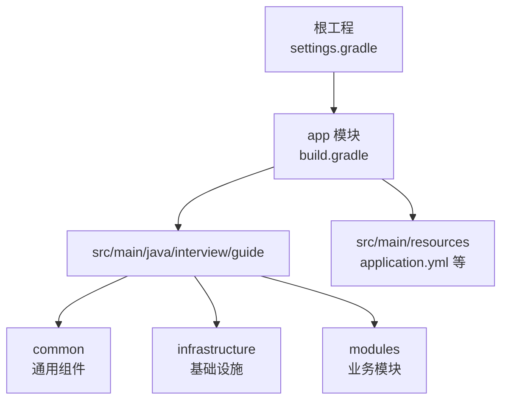
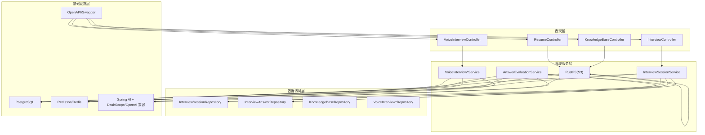
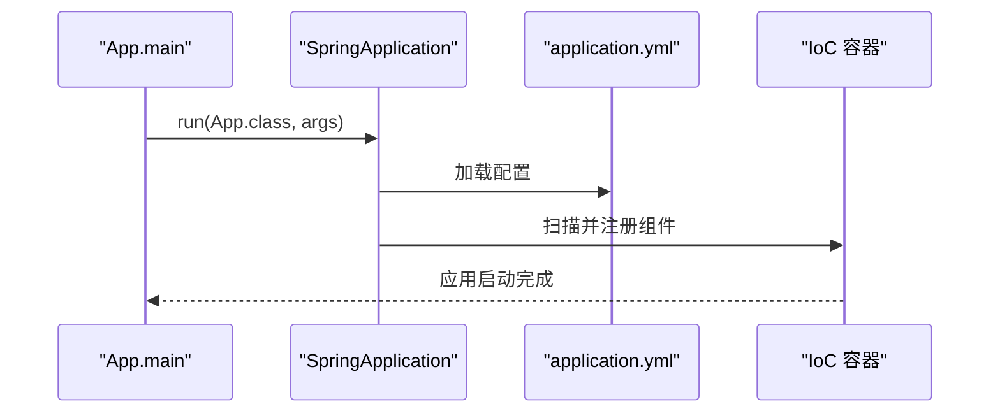
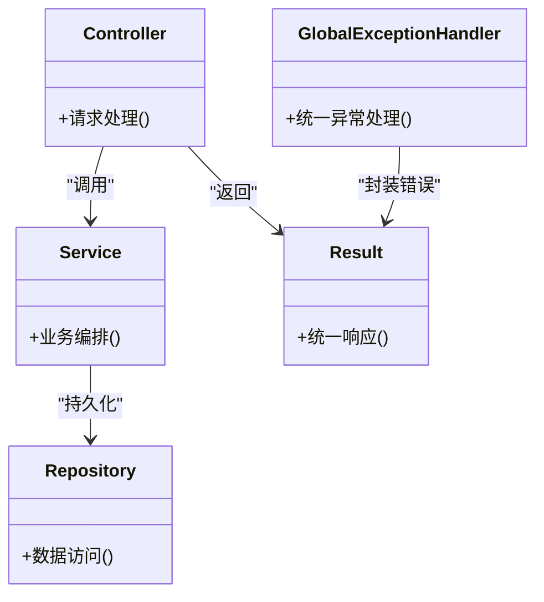
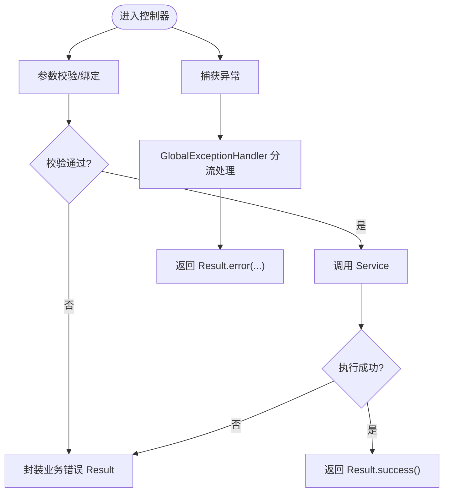
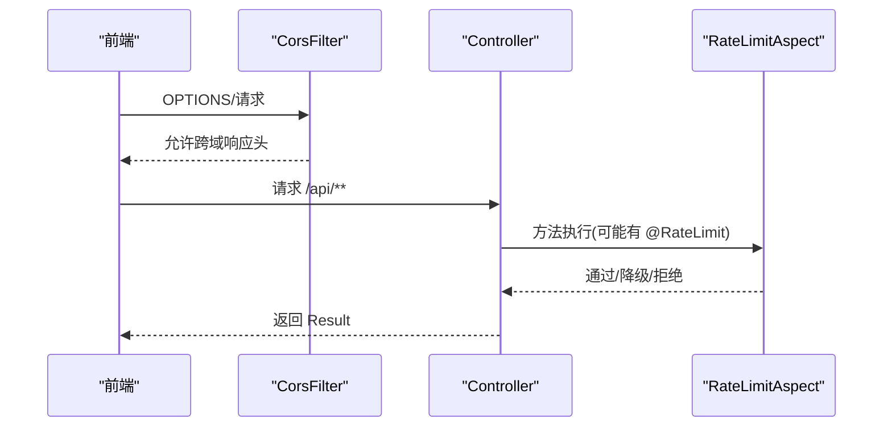
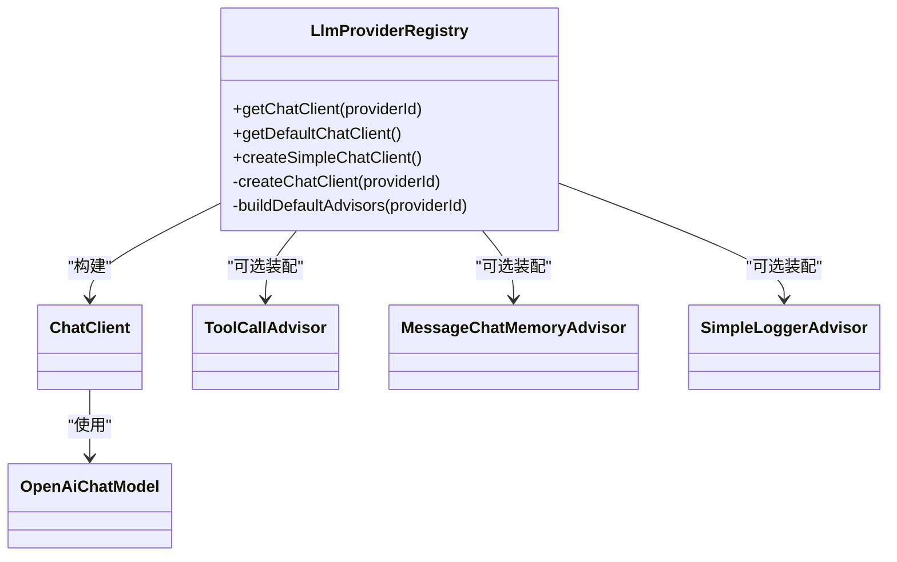
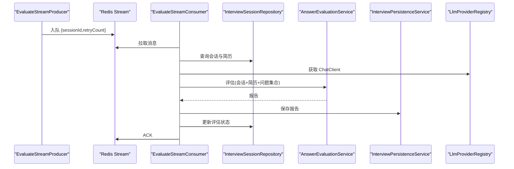
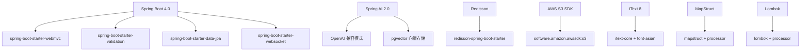

# 后端开发指南

<cite>
**本文引用的文件**   
- [App.java](file://app/src/main/java/interview/guide/App.java)
- [application.yml](file://app/src/main/resources/application.yml)
- [build.gradle](file://app/build.gradle)
- [settings.gradle](file://settings.gradle)
- [libs.versions.toml](file://gradle/libs.versions.toml)
- [CorsConfig.java](file://app/src/main/java/interview/guide/common/config/CorsConfig.java)
- [GlobalExceptionHandler.java](file://app/src/main/java/interview/guide/common/exception/GlobalExceptionHandler.java)
- [Result.java](file://app/src/main/java/interview/guide/common/result/Result.java)
- [RateLimit.java](file://app/src/main/java/interview/guide/common/annotation/RateLimit.java)
- [RateLimitAspect.java](file://app/src/main/java/interview/guide/common/aspect/RateLimitAspect.java)
- [LlmProviderRegistry.java](file://app/src/main/java/interview/guide/common/ai/LlmProviderRegistry.java)
- [AbstractStreamConsumer.java](file://app/src/main/java/interview/guide/common/async/AbstractStreamConsumer.java)
- [AbstractStreamProducer.java](file://app/src/main/java/interview/guide/common/async/AbstractStreamProducer.java)
- [EvaluateStreamConsumer.java](file://app/src/main/java/interview/guide/modules/interview/listener/EvaluateStreamConsumer.java)
- [EvaluateStreamProducer.java](file://app/src/main/java/interview/guide/modules/interview/listener/EvaluateStreamProducer.java)
</cite>

## 目录
1. [简介](#简介)
2. [项目结构](#项目结构)
3. [核心组件](#核心组件)
4. [架构总览](#架构总览)
5. [详细组件分析](#详细组件分析)
6. [依赖分析](#依赖分析)
7. [性能考虑](#性能考虑)
8. [故障排查指南](#故障排查指南)
9. [结论](#结论)
10. [附录](#附录)

## 简介
本指南面向面试指南平台后端开发者，围绕 Spring Boot 4.0 与 Java 21 的现代化技术栈，系统讲解应用启动、配置管理、依赖注入、分层架构、AI 提供商管理、异常与统一响应、API 设计最佳实践、异步处理（Redis Stream）、安全配置（CORS、速率限制）以及开发调试与代码规范。文档以仓库实际代码为依据，辅以图示帮助不同背景读者快速上手。

## 项目结构
- 根工程采用 Gradle 多模块布局，主模块为 app，包含后端应用源码与资源。
- 应用入口位于模块根包下，通过 Spring Boot 自动装配扫描各子包。
- 配置集中在 application.yml，结合环境变量实现灵活部署。
- 代码按领域与层次组织：common（通用）、infrastructure（基础设施）、modules（业务模块）。

**图表来源**
- [settings.gradle:1-24](file://settings.gradle#L1-L24)
- [build.gradle:1-136](file://app/build.gradle#L1-L136)

**章节来源**
- [settings.gradle:1-24](file://settings.gradle#L1-L24)
- [build.gradle:1-136](file://app/build.gradle#L1-L136)
- [application.yml:1-282](file://app/src/main/resources/application.yml#L1-L282)

## 核心组件
- 应用启动器：启用调度与 Spring Boot 自动装配，作为应用入口。
- 配置中心：集中管理服务器、数据库、Redis、AI 与应用自定义配置。
- 通用响应封装：统一返回结构，简化前端对接。
- 全局异常处理：覆盖业务、校验、上传、网络、AI 调用等异常类型。
- 速率限制：基于 Redis Lua 脚本的多维限流切面，支持降级方法。
- AI 提供商注册中心：动态构建 ChatClient，支持工具回调与顾问适配器。
- 异步处理：Redis Stream 生产者/消费者模板，统一 ACK、重试与生命周期管理。

**章节来源**
- [App.java:1-19](file://app/src/main/java/interview/guide/App.java#L1-L19)
- [application.yml:1-282](file://app/src/main/resources/application.yml#L1-L282)
- [Result.java:1-61](file://app/src/main/java/interview/guide/common/result/Result.java#L1-L61)
- [GlobalExceptionHandler.java:1-161](file://app/src/main/java/interview/guide/common/exception/GlobalExceptionHandler.java#L1-L161)
- [RateLimit.java:1-120](file://app/src/main/java/interview/guide/common/annotation/RateLimit.java#L1-L120)
- [RateLimitAspect.java:1-265](file://app/src/main/java/interview/guide/common/aspect/RateLimitAspect.java#L1-L265)
- [LlmProviderRegistry.java:1-230](file://app/src/main/java/interview/guide/common/ai/LlmProviderRegistry.java#L1-L230)
- [AbstractStreamConsumer.java:1-176](file://app/src/main/java/interview/guide/common/async/AbstractStreamConsumer.java#L1-L176)
- [AbstractStreamProducer.java:1-55](file://app/src/main/java/interview/guide/common/async/AbstractStreamProducer.java#L1-L55)

## 架构总览
系统采用分层架构与模块化设计：
- 表现层：Controller（模块内按功能划分，如 interview、knowledgebase、resume、voiceinterview 等）。
- 领域服务层：Service（负责业务编排与协调）。
- 数据访问层：Repository（JPA）。
- 基础设施层：Redis、PostgreSQL、Spring AI、S3/RustFS、OpenAPI 文档等。
- 通用层：统一响应、异常、限流、AI 提供商注册、异步流处理等。

**图表来源**
- [application.yml:26-35](file://app/src/main/resources/application.yml#L26-L35)
- [LlmProviderRegistry.java:35-230](file://app/src/main/java/interview/guide/common/ai/LlmProviderRegistry.java#L35-L230)

## 详细组件分析

### 应用启动与配置管理
- 启动类启用调度与 Spring Boot 自动装配，作为应用入口。
- application.yml 集中管理服务器、数据库、JPA、Redis、AI、应用自定义配置与 OpenAPI 扫描路径。
- Gradle 版本与插件由 libs.versions.toml 统一管理，app/build.gradle 引入依赖与工具链配置。

**图表来源**
- [App.java:14-18](file://app/src/main/java/interview/guide/App.java#L14-L18)
- [application.yml:1-282](file://app/src/main/resources/application.yml#L1-L282)

**章节来源**
- [App.java:1-19](file://app/src/main/java/interview/guide/App.java#L1-L19)
- [application.yml:1-282](file://app/src/main/resources/application.yml#L1-L282)
- [build.gradle:1-136](file://app/build.gradle#L1-L136)
- [libs.versions.toml:1-30](file://gradle/libs.versions.toml#L1-L30)

### 分层架构与职责划分
- Controller：接收请求、参数校验、调用 Service、返回 Result。
- Service：编排业务流程、调用 Repository、调用 AI/存储等外部能力。
- Repository：数据持久化接口，JPA 管理实体与查询。
- 交互关系：Controller 依赖 Service，Service 依赖 Repository 与基础设施组件；异常通过全局处理器统一返回。

**图表来源**
- [GlobalExceptionHandler.java:23-161](file://app/src/main/java/interview/guide/common/exception/GlobalExceptionHandler.java#L23-L161)
- [Result.java:10-61](file://app/src/main/java/interview/guide/common/result/Result.java#L10-L61)

**章节来源**
- [GlobalExceptionHandler.java:1-161](file://app/src/main/java/interview/guide/common/exception/GlobalExceptionHandler.java#L1-L161)
- [Result.java:1-61](file://app/src/main/java/interview/guide/common/result/Result.java#L1-L61)

### 统一响应与异常处理
- 统一响应 Result 提供成功/失败构造方法与判断逻辑，保证前后端契约一致。
- 全局异常处理器覆盖业务异常、参数校验、绑定、上传大小、AI 网络与调用异常、资源未找到、方法不支持与未知异常，均以 Result 形式返回。

**图表来源**
- [Result.java:10-61](file://app/src/main/java/interview/guide/common/result/Result.java#L10-L61)
- [GlobalExceptionHandler.java:23-161](file://app/src/main/java/interview/guide/common/exception/GlobalExceptionHandler.java#L23-L161)

**章节来源**
- [Result.java:1-61](file://app/src/main/java/interview/guide/common/result/Result.java#L1-L61)
- [GlobalExceptionHandler.java:1-161](file://app/src/main/java/interview/guide/common/exception/GlobalExceptionHandler.java#L1-L161)

### CORS 配置与安全
- CORS 配置通过 CorsConfig 读取应用配置，设置允许来源、方法、头、凭证与缓存时间，并限定对 /api/** 生效。
- 速率限制通过注解与切面实现，支持全局/IP/用户三维度，内置降级方法与 Redis Lua 脚本限流。

**图表来源**
- [CorsConfig.java:15-44](file://app/src/main/java/interview/guide/common/config/CorsConfig.java#L15-L44)
- [RateLimit.java:27-120](file://app/src/main/java/interview/guide/common/annotation/RateLimit.java#L27-L120)
- [RateLimitAspect.java:31-265](file://app/src/main/java/interview/guide/common/aspect/RateLimitAspect.java#L31-L265)

**章节来源**
- [CorsConfig.java:1-44](file://app/src/main/java/interview/guide/common/config/CorsConfig.java#L1-L44)
- [RateLimit.java:1-120](file://app/src/main/java/interview/guide/common/annotation/RateLimit.java#L1-L120)
- [RateLimitAspect.java:1-265](file://app/src/main/java/interview/guide/common/aspect/RateLimitAspect.java#L1-L265)

### AI 提供商管理（Spring AI 与 DashScope）
- LlmProviderRegistry 负责根据配置动态创建 ChatClient，支持默认提供商、简单 ChatClient、顾问适配器（工具调用、消息记忆、日志）。
- 通过 OpenAI 兼容模式对接 DashScope，配置温度、模型与超时，结合工具回调与观察注册。

**图表来源**
- [LlmProviderRegistry.java:35-230](file://app/src/main/java/interview/guide/common/ai/LlmProviderRegistry.java#L35-L230)

**章节来源**
- [LlmProviderRegistry.java:1-230](file://app/src/main/java/interview/guide/common/ai/LlmProviderRegistry.java#L1-L230)
- [application.yml:99-124](file://app/src/main/resources/application.yml#L99-L124)

### 异步处理：Redis Stream 模板与面试评估流水线
- AbstractStreamProducer/AbstractStreamConsumer 提供统一的生产/消费骨架：消费者组创建、批量拉取、ACK、重试、生命周期管理。
- EvaluateStreamProducer 将面试会话 ID 入队，EvaluateStreamConsumer 拉取消息、组装问题与答案、调用 AI 评估、持久化报告并更新状态。

**图表来源**
- [AbstractStreamProducer.java:14-55](file://app/src/main/java/interview/guide/common/async/AbstractStreamProducer.java#L14-L55)
- [AbstractStreamConsumer.java:24-176](file://app/src/main/java/interview/guide/common/async/AbstractStreamConsumer.java#L24-L176)
- [EvaluateStreamProducer.java:18-78](file://app/src/main/java/interview/guide/modules/interview/listener/EvaluateStreamProducer.java#L18-L78)
- [EvaluateStreamConsumer.java:31-185](file://app/src/main/java/interview/guide/modules/interview/listener/EvaluateStreamConsumer.java#L31-L185)

**章节来源**
- [AbstractStreamProducer.java:1-55](file://app/src/main/java/interview/guide/common/async/AbstractStreamProducer.java#L1-L55)
- [AbstractStreamConsumer.java:1-176](file://app/src/main/java/interview/guide/common/async/AbstractStreamConsumer.java#L1-L176)
- [EvaluateStreamProducer.java:1-78](file://app/src/main/java/interview/guide/modules/interview/listener/EvaluateStreamProducer.java#L1-L78)
- [EvaluateStreamConsumer.java:1-185](file://app/src/main/java/interview/guide/modules/interview/listener/EvaluateStreamConsumer.java#L1-L185)

### API 设计最佳实践
- RESTful 设计：资源命名使用名词复数，路径清晰表达层级；使用标准 HTTP 方法语义。
- 参数校验：在 Controller 层使用校验注解，配合全局异常处理返回统一错误。
- 错误处理：统一 Result.error(...)，区分业务错误码与系统错误码，避免泄露敏感信息。
- 响应一致性：成功返回 Result.success(data)，失败返回 Result.error(code,message)。
- 文档：通过 SpringDoc OpenAPI 自动生成接口文档，扫描路径在配置中指定。

**章节来源**
- [application.yml:26-35](file://app/src/main/resources/application.yml#L26-L35)
- [GlobalExceptionHandler.java:23-161](file://app/src/main/java/interview/guide/common/exception/GlobalExceptionHandler.java#L23-L161)
- [Result.java:10-61](file://app/src/main/java/interview/guide/common/result/Result.java#L10-L61)

## 依赖分析
- Spring Boot 4.0 模块化起步依赖：Web MVC、Validation、Data JPA、WebSocket。
- Spring AI 2.0：OpenAI 兼容模式与 pgvector 向量存储。
- Redisson：Redis 客户端与 Redis Stream 支持。
- AWS S3 SDK：RustFS 存储。
- iText 8：PDF 导出。
- MapStruct/Lombok：对象映射与简化代码。
- 测试：JUnit 5、Spring Boot Test。

**图表来源**
- [build.gradle:23-87](file://app/build.gradle#L23-L87)
- [libs.versions.toml:17-30](file://gradle/libs.versions.toml#L17-L30)

**章节来源**
- [build.gradle:1-136](file://app/build.gradle#L1-L136)
- [libs.versions.toml:1-30](file://gradle/libs.versions.toml#L1-L30)

## 性能考虑
- 虚拟线程：启用虚拟线程提升 I/O 密集型并发（AI 调用、SSE、WebSocket）。
- 连接池：HikariCP 与 PostgreSQL 配置优化，降低事务开销。
- 批量操作：JDBC 批量大小与顺序优化，减少网络往返。
- Redis：合理设置连接池与订阅连接池，避免阻塞。
- 限流：基于 Redis Lua 脚本的令牌桶，支持多维限流与降级。
- 缓存：会话与中间态状态通过 Redis Stream 与缓存协同，避免阻塞主线程。

[本节为通用建议，无需特定文件引用]

## 故障排查指南
- 全局异常处理：优先定位异常类型与错误码，查看日志上下文，确认是否为业务异常或系统异常。
- 速率限制：检查 Redis 脚本是否加载成功、键空间与维度是否正确、降级方法是否存在且签名匹配。
- Redis Stream：确认消费者组创建、ACK 是否成功、重试次数上限与失败标记。
- AI 服务：检查 API Key、模型名称、网络超时与限流策略；区分超时与 SSL 握手失败。
- CORS：核对允许来源、方法与头，确认预检请求已放行。

**章节来源**
- [GlobalExceptionHandler.java:1-161](file://app/src/main/java/interview/guide/common/exception/GlobalExceptionHandler.java#L1-L161)
- [RateLimitAspect.java:1-265](file://app/src/main/java/interview/guide/common/aspect/RateLimitAspect.java#L1-L265)
- [EvaluateStreamConsumer.java:1-185](file://app/src/main/java/interview/guide/modules/interview/listener/EvaluateStreamConsumer.java#L1-L185)
- [CorsConfig.java:1-44](file://app/src/main/java/interview/guide/common/config/CorsConfig.java#L1-L44)

## 结论
本指南基于仓库实际代码，系统梳理了 Spring Boot 4.0 后端开发的关键要素：启动与配置、分层架构、统一响应与异常、AI 提供商管理、Redis Stream 异步流水线、CORS 与速率限制等。建议在开发中遵循统一响应与异常处理契约，合理使用限流与异步机制，结合 OpenAPI 文档提升协作效率。

[本节为总结性内容，无需特定文件引用]

## 附录
- 开发环境：JDK 21、Gradle、PostgreSQL、Redis、RustFS/S3 兼容存储。
- 调试技巧：利用虚拟线程特性观察 I/O 并发，结合 Redisson 客户端监控与日志定位问题。
- 代码规范：统一使用 Lombok 与 MapStruct，保持 DTO/Entity 映射清晰；Controller/Service/Repository 分层明确，异常统一处理。

[本节为通用建议，无需特定文件引用]