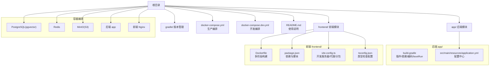
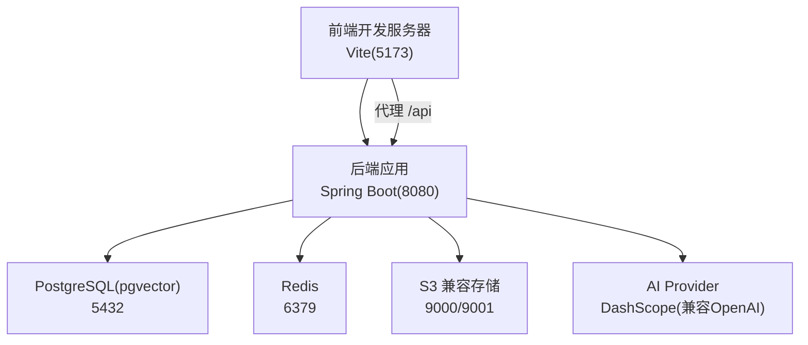
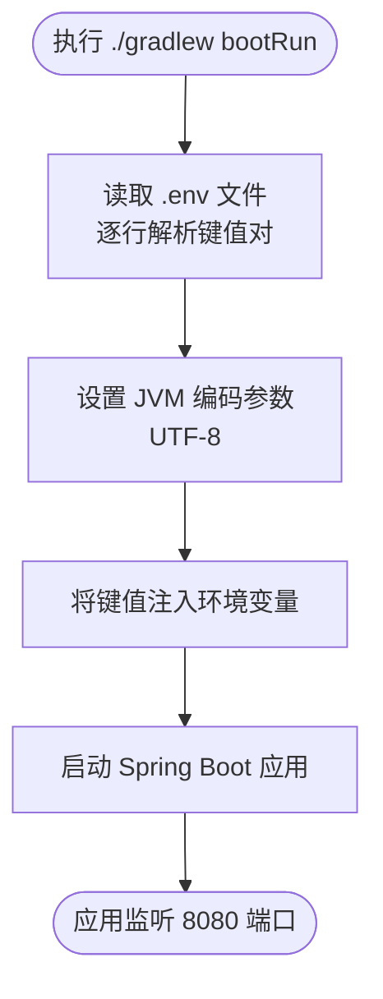
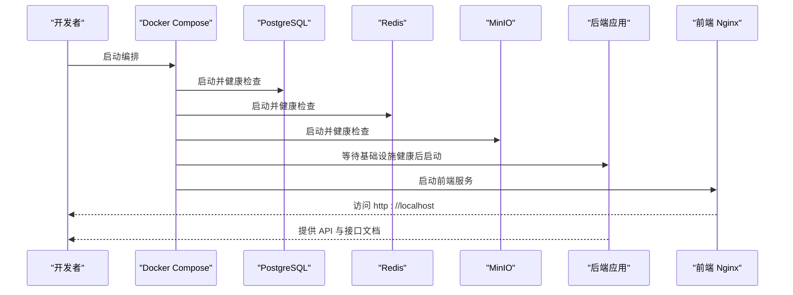
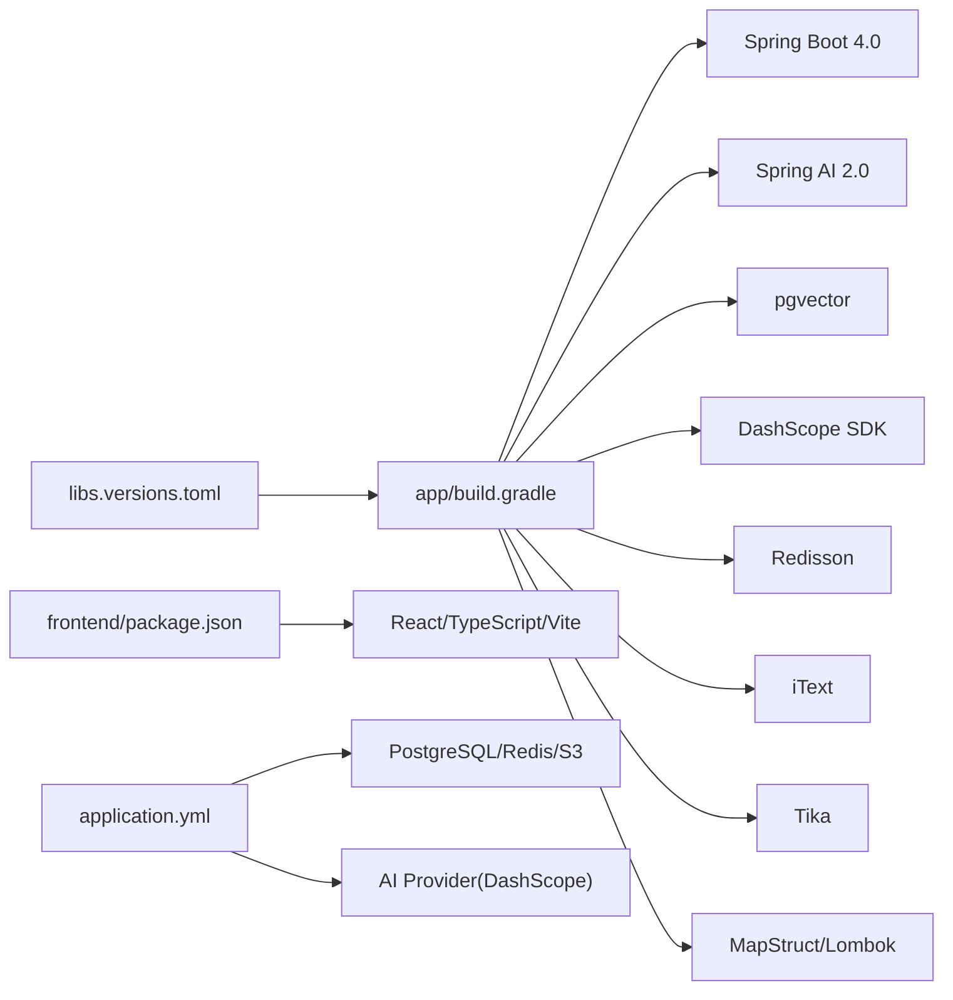

# 开发环境搭建

<cite>
**本文引用的文件**
- [app/build.gradle](file://app/build.gradle)
- [settings.gradle](file://settings.gradle)
- [gradle/libs.versions.toml](file://gradle/libs.versions.toml)
- [README.md](file://README.md)
- [docker-compose.yml](file://docker-compose.yml)
- [docker-compose.dev.yml](file://docker-compose.dev.yml)
- [frontend/Dockerfile](file://frontend/Dockerfile)
- [frontend/package.json](file://frontend/package.json)
- [frontend/vite.config.ts](file://frontend/vite.config.ts)
- [frontend/tsconfig.json](file://frontend/tsconfig.json)
- [app/src/main/resources/application.yml](file://app/src/main/resources/application.yml)
</cite>

## 目录
1. [简介](#简介)
2. [项目结构](#项目结构)
3. [核心组件](#核心组件)
4. [架构总览](#架构总览)
5. [详细组件分析](#详细组件分析)
6. [依赖关系分析](#依赖关系分析)
7. [性能考虑](#性能考虑)
8. [故障排查指南](#故障排查指南)
9. [结论](#结论)
10. [附录](#附录)

## 简介
本指南面向首次参与开发的工程师，目标是帮助你在本地快速搭建并运行完整的开发环境，涵盖以下方面：
- Gradle 构建系统配置与使用：依赖管理、版本控制、构建脚本、环境变量注入、编码与测试配置。
- Docker 容器化配置：开发环境编排、服务依赖管理、环境变量配置、持久化卷与健康检查。
- IDE 开发环境配置：IntelliJ IDEA 项目导入、插件安装、运行配置与调试。
- 开发工具链安装与基础使用：Java SDK、Git、Docker、Node.js、包管理器等。
- 常见问题排查：依赖冲突、端口占用、数据库连接、日志编码、AI 模型配置等。

## 项目结构
项目采用多模块结构，后端位于 app/，前端位于 frontend/，根目录提供 Gradle 与 Docker 编排文件，以及文档与脚本。

图表来源
- [app/build.gradle:1-136](file://app/build.gradle#L1-L136)
- [frontend/Dockerfile:1-44](file://frontend/Dockerfile#L1-L44)
- [frontend/package.json:1-47](file://frontend/package.json#L1-L47)
- [frontend/vite.config.ts:1-42](file://frontend/vite.config.ts#L1-L42)
- [frontend/tsconfig.json:1-22](file://frontend/tsconfig.json#L1-L22)
- [docker-compose.yml:1-197](file://docker-compose.yml#L1-L197)

章节来源
- [README.md:210-247](file://README.md#L210-L247)
- [settings.gradle:1-24](file://settings.gradle#L1-L24)

## 核心组件
- Gradle 多模块与版本管理：通过 libs.versions.toml 统一管理第三方依赖版本，settings.gradle 声明插件仓库与工具链解析，app/build.gradle 配置插件、仓库、依赖、Java Toolchain、编码与 bootRun 环境变量注入。
- Docker Compose 编排：docker-compose.yml 定义数据库、缓存、对象存储、后端、前端等服务，包含健康检查、命名卷与环境变量；docker-compose.dev.yml 提供本地开发依赖服务（PostgreSQL、Redis、RustFS）。
- 前端工程：Vite + React + TypeScript，配置代理到后端 8080 端口，按需拆分 vendor 包，支持 wasm 与顶层 await 插件。
- 后端配置：application.yml 通过环境变量注入数据库、Redis、S3、AI Provider、CORS、语音面试等参数，支持虚拟线程与 HikariCP 优化。

章节来源
- [app/build.gradle:6-136](file://app/build.gradle#L6-L136)
- [gradle/libs.versions.toml:1-30](file://gradle/libs.versions.toml#L1-L30)
- [settings.gradle:8-24](file://settings.gradle#L8-L24)
- [docker-compose.yml:1-197](file://docker-compose.yml#L1-L197)
- [docker-compose.dev.yml:1-64](file://docker-compose.dev.yml#L1-L64)
- [frontend/vite.config.ts:1-42](file://frontend/vite.config.ts#L1-L42)
- [app/src/main/resources/application.yml:1-282](file://app/src/main/resources/application.yml#L1-L282)

## 架构总览
下图展示了开发环境的典型启动顺序与交互：前端通过 Vite 代理访问后端 API，后端连接数据库、缓存与对象存储，AI 能力通过 DashScope/OpenAI 兼容接口调用。

图表来源
- [frontend/vite.config.ts:24-37](file://frontend/vite.config.ts#L24-L37)
- [app/src/main/resources/application.yml:48-98](file://app/src/main/resources/application.yml#L48-L98)
- [docker-compose.yml:13-171](file://docker-compose.yml#L13-L171)

## 详细组件分析

### Gradle 构建系统配置与使用
- 插件与仓库
  - 使用 Spring Boot 与依赖管理插件，插件仓库指向阿里云与 Gradle 官方仓库，settings.gradle 启用 foojay 工具链解析，确保自动下载 JDK 21。
  - 版本集中管理：gradle/libs.versions.toml 定义 Spring Boot、Spring AI、Lombok、MapStruct、iText、AWS SDK、SpringDoc、Tika、Pinyin4j、JUnit 等版本。
- 依赖与模块
  - app/build.gradle 引入 Web MVC、Validation、JPA、WebSocket、Spring AI（OpenAI 兼容模式与 pgvector 向量存储）、Tika、S3 SDK、Redisson、iText、DashScope SDK、Jakarta 注解、Lombok、MapStruct、测试 Starter 与 JUnit。
  - 通过 platform(...) 对齐 spring-ai-agent-utils 版本，避免冲突。
- Java 与编码
  - Java Toolchain 指定语言版本为 21；全局设置 JavaCompile 编码为 UTF-8；test 使用 JUnit Platform。
- bootRun 环境变量注入
  - 读取根目录 .env 文件，将键值注入 JVM 环境变量，同时设置 file.encoding、console.encoding、stdout.encoding、stderr.encoding 为 UTF-8，解决控制台与日志编码问题。

图表来源
- [app/build.gradle:104-136](file://app/build.gradle#L104-L136)

章节来源
- [settings.gradle:8-24](file://settings.gradle#L8-L24)
- [gradle/libs.versions.toml:1-30](file://gradle/libs.versions.toml#L1-L30)
- [app/build.gradle:6-136](file://app/build.gradle#L6-L136)

### Docker 容器化配置
- 生产编排（docker-compose.yml）
  - 服务：PostgreSQL(pgvector)、Redis、MinIO、MinIO 初始化任务(createbuckets)、后端 app、前端 Nginx。
  - 健康检查：PostgreSQL 使用 pg_isready，Redis 使用 redis-cli ping，MinIO 使用 curl 检测存活。
  - 环境变量：数据库、Redis、S3、AI Provider、面试参数均通过环境变量注入；后端使用服务名作为主机名（Docker 内部 DNS 解析）。
  - 持久化：postgres_data、redis_data、minio_data 命名卷。
- 开发编排（docker-compose.dev.yml）
  - 服务：PostgreSQL、Redis、RustFS（S3 兼容存储）。
  - RustFS 首次启动后需登录控制台手动创建 Bucket（interview-guide）。
- 前端 Dockerfile
  - 多阶段构建：第一阶段使用 node:20-alpine 安装 pnpm 与依赖并构建；第二阶段使用 nginx:alpine 提供静态资源服务，暴露 80 端口。

图表来源
- [docker-compose.yml:13-186](file://docker-compose.yml#L13-L186)
- [docker-compose.dev.yml:6-64](file://docker-compose.dev.yml#L6-L64)
- [frontend/Dockerfile:1-44](file://frontend/Dockerfile#L1-L44)

章节来源
- [docker-compose.yml:1-197](file://docker-compose.yml#L1-L197)
- [docker-compose.dev.yml:1-64](file://docker-compose.dev.yml#L1-L64)
- [frontend/Dockerfile:1-44](file://frontend/Dockerfile#L1-L44)

### IDE 开发环境配置（IntelliJ IDEA）
- 项目导入
  - 打开 IntelliJ IDEA，选择 “Open”，定位到仓库根目录，IDE 将自动识别 Gradle 项目与子模块 app。
- 插件安装
  - 推荐安装：Lombok、MapStruct Support、Rainbow Brackets、String Manipulation、Key Promoter X。
- 运行配置
  - 新建 Gradle 运行配置，任务选择 bootRun，JVM 参数可复用 app/build.gradle 中的编码设置；或直接使用 Gradle 工具窗口执行。
  - 新建 Spring Boot 运行配置，主类为 App.java（位于 app/src/main/java/interview/guide/App.java），确保激活正确的配置文件（如 application.yml）。
- 调试与热重载
  - 使用远程调试配置连接 5005 端口（如需），或直接在 IDE 中打断点调试。
  - 前端使用 Vite 开发服务器，具备热更新能力。

章节来源
- [app/build.gradle:104-136](file://app/build.gradle#L104-L136)
- [README.md:317-336](file://README.md#L317-L336)

### 开发工具链安装与配置
- Java SDK（JDK 21+）
  - 使用 settings.gradle 中的 foojay 工具链解析，自动下载所需 JDK；也可手动安装并配置 JAVA_HOME。
- Git
  - 基础使用：clone、branch、commit、push/pull、merge/rebase。
- Docker 与 Docker Compose
  - 安装 Docker Desktop，使用 docker compose 命令编排服务；生产使用 docker-compose.yml，开发使用 docker-compose.dev.yml。
- Node.js 与包管理器
  - 前端使用 pnpm；安装 pnpm 后，执行 pnpm install 与 pnpm dev。
- Gradle
  - 使用仓库自带的 wrapper（gradlew/gradlew.bat），无需全局安装 Gradle。

章节来源
- [settings.gradle:17-20](file://settings.gradle#L17-L20)
- [README.md:251-259](file://README.md#L251-L259)
- [frontend/package.json:1-47](file://frontend/package.json#L1-L47)

## 依赖关系分析
- Gradle 版本与依赖
  - libs.versions.toml 统一版本，app/build.gradle 通过 alias 与 ref 引用，避免版本漂移。
- Spring Boot 与 Spring AI
  - Spring Boot 4.0 + Spring AI 2.0（OpenAI 兼容模式）+ pgvector 向量存储；DashScope SDK 替代 NLS SDK。
- 前端依赖
  - React、TypeScript、Vite、TailwindCSS、Recharts、Lucide React、Framer Motion、ONNX Runtime Web 等。
- 后端配置
  - application.yml 通过环境变量注入数据库、Redis、S3、AI Provider、CORS、语音面试等参数；启用虚拟线程与 HikariCP 优化。

图表来源
- [gradle/libs.versions.toml:1-30](file://gradle/libs.versions.toml#L1-L30)
- [app/build.gradle:23-87](file://app/build.gradle#L23-L87)
- [frontend/package.json:11-44](file://frontend/package.json#L11-L44)
- [app/src/main/resources/application.yml:48-282](file://app/src/main/resources/application.yml#L48-L282)

章节来源
- [gradle/libs.versions.toml:1-30](file://gradle/libs.versions.toml#L1-L30)
- [app/build.gradle:23-87](file://app/build.gradle#L23-L87)
- [frontend/package.json:11-44](file://frontend/package.json#L11-L44)
- [app/src/main/resources/application.yml:48-282](file://app/src/main/resources/application.yml#L48-L282)

## 性能考虑
- 虚拟线程与连接池
  - 启用虚拟线程（Java 21+），适合 I/O 密集型场景；HikariCP 连接池参数针对虚拟线程场景优化，降低 CPU 密集型开销。
- 批量与 SQL 优化
  - Hibernate JDBC 批量大小、插入/更新排序、版本化数据批量，减少数据库往返与锁竞争。
- 前端分包与懒加载
  - Vite manualChunks 将 React 与 UI 依赖拆分为独立包，提升缓存命中率与首屏性能。
- 缓存与消息队列
  - Redis 缓存与 Stream 异步处理（简历分析、知识库向量化），降低请求延迟并提升吞吐。

章节来源
- [app/src/main/resources/application.yml:42-78](file://app/src/main/resources/application.yml#L42-L78)
- [frontend/vite.config.ts:13-23](file://frontend/vite.config.ts#L13-L23)

## 故障排查指南
- 依赖冲突与版本不一致
  - 使用 libs.versions.toml 统一版本；通过 platform(...) 对齐 Spring AI 生态版本；避免在 build.gradle 中硬编码版本。
- 端口占用
  - 数据库 5432、Redis 6379、MinIO 9000/9001、后端 8080、前端 5173、Nginx 80；可通过 docker-compose 停止或修改映射端口。
- 数据库连接失败
  - 检查 application.yml 中 POSTGRES_* 环境变量与 docker-compose.yml 中环境变量一致性；确认数据库健康检查通过。
- MinIO/Bucket 初始化
  - 生产编排使用 mc 初始化 Bucket；开发编排使用 RustFS，需登录控制台手动创建 Bucket。
- AI 模型配置错误
  - 确认 .env 中 AI_BAILIAN_API_KEY 与 AI_MODEL；后端 application.yml 中 AI Provider 基础地址与模型名称。
- 日志中文乱码（Windows PowerShell）
  - 项目已在 Gradle、Logback 与 bootRun 中设置 UTF-8；PowerShell 需设置代码页与输出编码，或使用仓库提供的 .bat 启动脚本。
- PDF 导出中文异常
  - 确认内置中文字体存在、iText 依赖正确、日志中字体加载信息正常。
- 简历分析/知识库向量化失败
  - 检查 Redis 连接、Stream Consumer 是否运行；确认向量表初始化开关与模型维度匹配。

章节来源
- [README.md:424-495](file://README.md#L424-L495)
- [app/src/main/resources/application.yml:99-124](file://app/src/main/resources/application.yml#L99-L124)
- [docker-compose.yml:102-117](file://docker-compose.yml#L102-L117)
- [docker-compose.dev.yml:38-58](file://docker-compose.dev.yml#L38-L58)
- [app/build.gradle:104-136](file://app/build.gradle#L104-L136)

## 结论
通过本指南，你可以：
- 使用 Gradle 统一管理依赖与版本，正确注入环境变量并解决编码问题；
- 使用 Docker Compose 一键启动生产或开发环境，理解服务间依赖与健康检查；
- 在 IntelliJ IDEA 中高效导入与运行项目；
- 排查常见问题，快速恢复开发效率。

## 附录
- 快速启动步骤（Docker 生产编排）
  - 复制 .env.example 为 .env，填写 AI 配置；执行 docker-compose up -d --build。
- 快速启动步骤（本地开发）
  - 启动 docker compose -f docker-compose.dev.yml up -d；后端 ./gradlew bootRun；前端 cd frontend && pnpm install && pnpm dev。
- 常用运维命令
  - 查看服务状态、查看后端日志、停止并移除、停止并清除数据卷、清理无用镜像。

章节来源
- [README.md:338-414](file://README.md#L338-L414)
- [docker-compose.yml:344-414](file://docker-compose.yml#L344-L414)